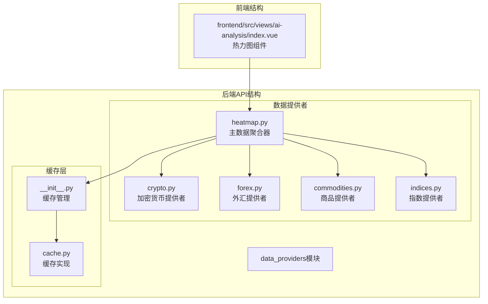
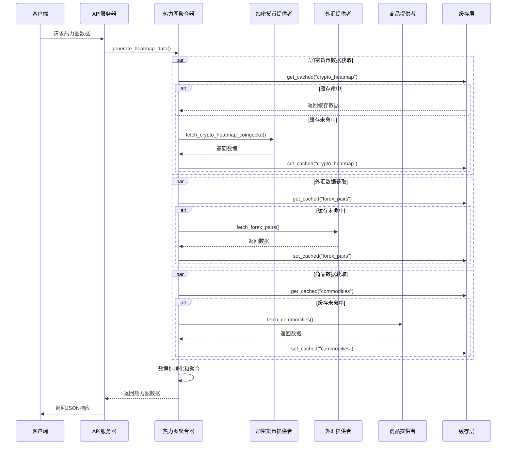
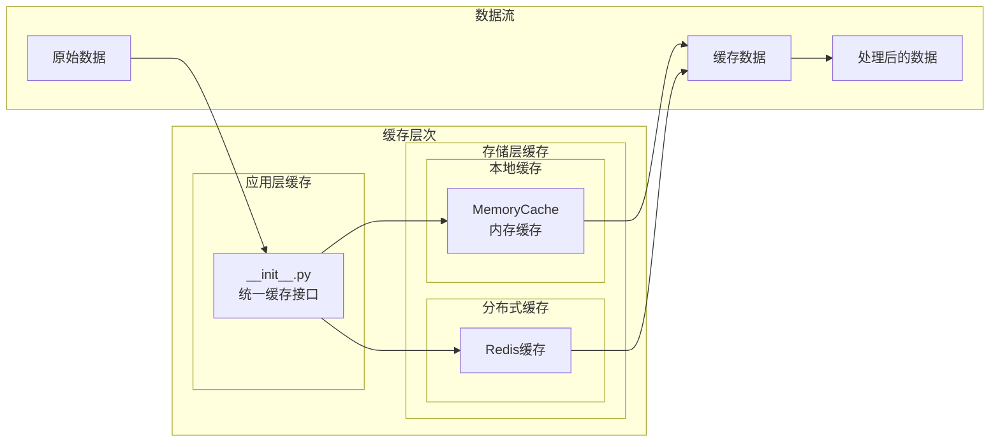
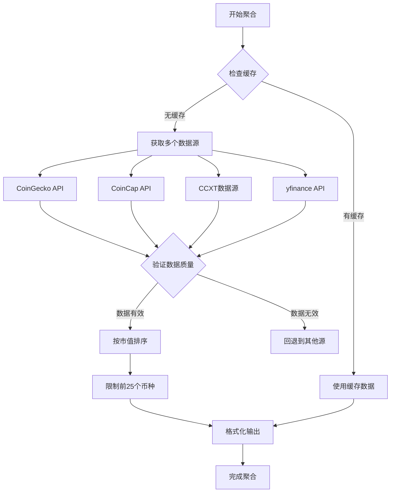
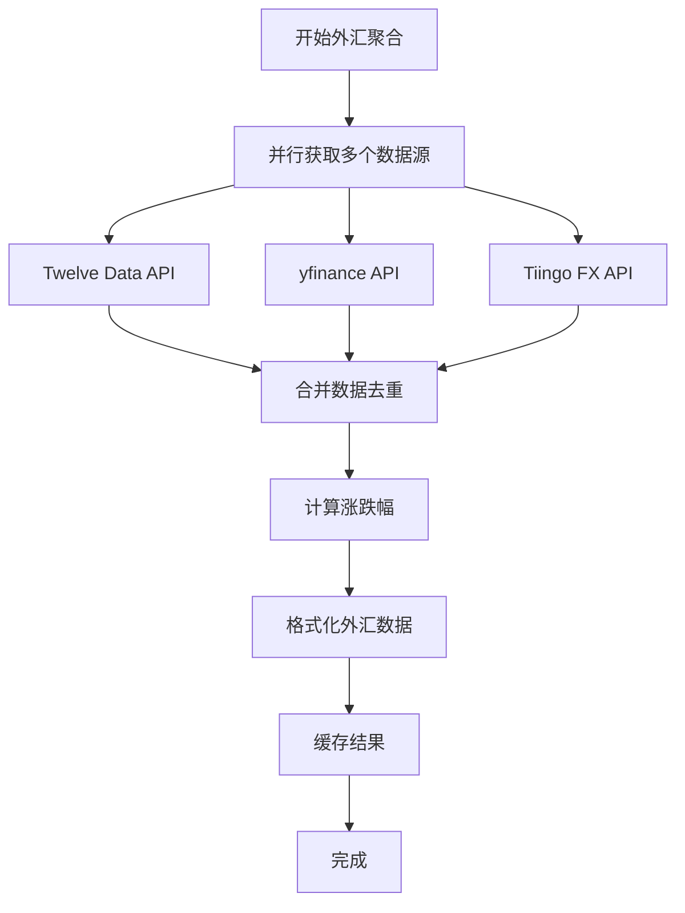
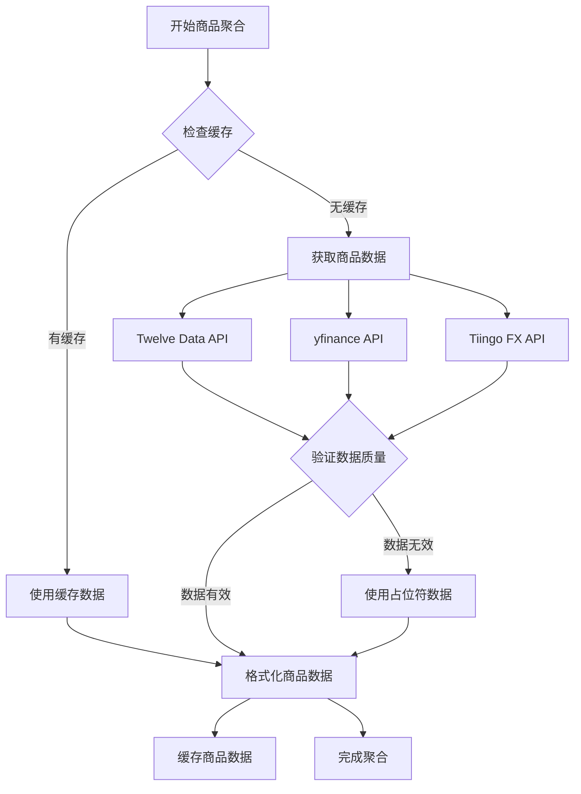
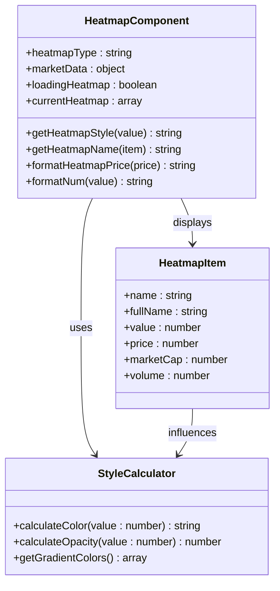
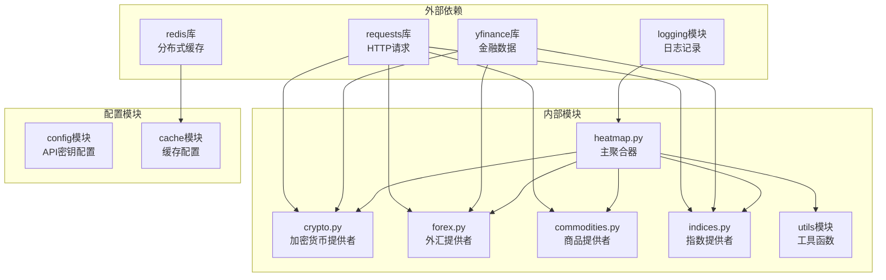
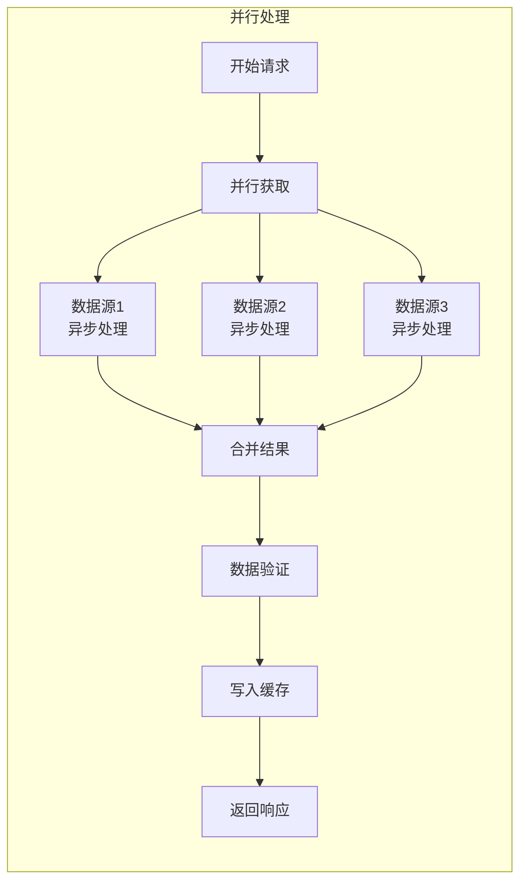

# 热力图数据提供者

<cite>
**本文档引用的文件**
- [heatmap.py](file://backend_api_python/app/data_providers/heatmap.py)
- [crypto.py](file://backend_api_python/app/data_providers/crypto.py)
- [forex.py](file://backend_api_python/app/data_providers/forex.py)
- [commodities.py](file://backend_api_python/app/data_providers/commodities.py)
- [indices.py](file://backend_api_python/app/data_providers/indices.py)
- [__init__.py](file://backend_api_python/app/data_providers/__init__.py)
- [cache.py](file://backend_api_python/app/utils/cache.py)
- [index.vue](file://frontend/src/views/ai-analysis/index.vue)
</cite>

## 目录
1. [简介](#简介)
2. [项目结构](#项目结构)
3. [核心组件](#核心组件)
4. [架构概览](#架构概览)
5. [详细组件分析](#详细组件分析)
6. [依赖关系分析](#依赖关系分析)
7. [性能考虑](#性能考虑)
8. [故障排除指南](#故障排除指南)
9. [结论](#结论)
10. [附录](#附录)

## 简介

热力图数据提供者是QuantDinger量化交易系统中的关键组件，负责聚合和生成跨市场的资产热力图数据。该系统支持多种资产类别，包括加密货币、外汇、商品、股指和行业板块，为用户提供实时的市场动向概览。

热力图数据提供者采用多源数据聚合策略，通过智能缓存机制优化性能，并提供灵活的可视化接口。系统支持24小时价格变化、成交量、市值等多维度指标，帮助用户快速识别市场热点和趋势。

## 项目结构

热力图数据提供者位于后端API的data_providers模块中，采用模块化设计，每个资产类别都有专门的数据提供者：



**图表来源**
- [heatmap.py:1-147](file://backend_api_python/app/data_providers/heatmap.py#L1-L147)
- [__init__.py:1-85](file://backend_api_python/app/data_providers/__init__.py#L1-L85)
- [cache.py:1-128](file://backend_api_python/app/utils/cache.py#L1-L128)

**章节来源**
- [heatmap.py:1-147](file://backend_api_python/app/data_providers/heatmap.py#L1-L147)
- [__init__.py:1-85](file://backend_api_python/app/data_providers/__init__.py#L1-L85)

## 核心组件

### 主数据聚合器

热力图主聚合器负责协调各个数据提供者的数据收集和整合工作。其核心功能包括：

- **多源数据聚合**：从加密货币、外汇、商品、指数等多个数据源获取数据
- **智能缓存管理**：使用统一的缓存层优化数据访问性能
- **数据标准化**：将不同来源的数据格式统一为标准热力图格式
- **错误处理**：实现多级容错机制，确保数据聚合的稳定性

### 数据提供者模块

每个资产类别的数据提供者都实现了特定的获取和处理逻辑：

- **加密货币提供者**：支持多个API源，包括CoinGecko、CoinCap和CCXT
- **外汇提供者**：提供主要货币对的实时汇率和涨跌幅数据
- **商品提供者**：涵盖贵金属、能源和基础商品的价格数据
- **指数提供者**：收集全球主要股指的历史和实时数据

**章节来源**
- [heatmap.py:20-147](file://backend_api_python/app/data_providers/heatmap.py#L20-L147)
- [crypto.py:118-169](file://backend_api_python/app/data_providers/crypto.py#L118-L169)
- [forex.py:154-172](file://backend_api_python/app/data_providers/forex.py#L154-L172)
- [commodities.py:155-181](file://backend_api_python/app/data_providers/commodities.py#L155-L181)

## 架构概览

热力图数据提供者采用分层架构设计，确保系统的可扩展性和维护性：



**图表来源**
- [heatmap.py:20-147](file://backend_api_python/app/data_providers/heatmap.py#L20-L147)
- [__init__.py:45-58](file://backend_api_python/app/data_providers/__init__.py#L45-L58)

### 缓存架构

系统采用两级缓存架构，确保高性能和高可用性：



**图表来源**
- [__init__.py:23-34](file://backend_api_python/app/data_providers/__init__.py#L23-L34)
- [cache.py:49-99](file://backend_api_python/app/utils/cache.py#L49-L99)

**章节来源**
- [__init__.py:23-58](file://backend_api_python/app/data_providers/__init__.py#L23-L58)
- [cache.py:49-128](file://backend_api_python/app/utils/cache.py#L49-L128)

## 详细组件分析

### 热力图数据聚合算法

热力图数据聚合采用分阶段处理策略，确保数据的准确性和时效性：

#### 加密货币热力图算法



**图表来源**
- [heatmap.py:23-81](file://backend_api_python/app/data_providers/heatmap.py#L23-L81)
- [crypto.py:174-205](file://backend_api_python/app/data_providers/crypto.py#L174-L205)

#### 外汇热力图算法

外汇数据聚合采用多源并行获取策略：



**图表来源**
- [heatmap.py:37-91](file://backend_api_python/app/data_providers/heatmap.py#L37-L91)
- [forex.py:154-172](file://backend_api_python/app/data_providers/forex.py#L154-L172)

#### 商品热力图算法

商品数据聚合支持贵金属和能源商品的综合分析：



**图表来源**
- [heatmap.py:51-65](file://backend_api_python/app/data_providers/heatmap.py#L51-L65)
- [commodities.py:155-181](file://backend_api_python/app/data_providers/commodities.py#L155-L181)

### 数据标准化和转换

热力图数据提供者实现了统一的数据标准化流程：

| 数据源 | 字段映射 | 转换规则 |
|--------|----------|----------|
| 加密货币 | symbol, name, price, change_24h, market_cap, volume_24h | 数值安全转换，市值降序排列 |
| 外汇 | name, name_cn, name_en, price, change | 涨跌幅计算，货币对标准化 |
| 商品 | name_cn, name_en, price, change, unit | 单位标准化，数值格式化 |
| 股指 | symbol, name_cn, name_en, price, change, region, flag | 地缘标识符添加，区域分类 |

**章节来源**
- [heatmap.py:43-146](file://backend_api_python/app/data_providers/heatmap.py#L43-L146)

### 前端可视化集成

前端热力图组件采用响应式设计，支持多种交互模式：



**图表来源**
- [index.vue:788-899](file://frontend/src/views/ai-analysis/index.vue#L788-L899)
- [index.vue:928-1099](file://frontend/src/views/ai-analysis/index.vue#L928-L1099)

**章节来源**
- [index.vue:90-107](file://frontend/src/views/ai-analysis/index.vue#L90-L107)
- [index.vue:884-886](file://frontend/src/views/ai-analysis/index.vue#L884-L886)

## 依赖关系分析

热力图数据提供者具有清晰的依赖关系和模块化设计：



**图表来源**
- [heatmap.py:1-17](file://backend_api_python/app/data_providers/heatmap.py#L1-L17)
- [crypto.py:1-10](file://backend_api_python/app/data_providers/crypto.py#L1-L10)
- [forex.py:1-10](file://backend_api_python/app/data_providers/forex.py#L1-L10)

### 错误处理和容错机制

系统实现了多层次的错误处理和容错机制：

| 错误类型 | 处理策略 | 回退方案 |
|----------|----------|----------|
| API连接失败 | 记录日志并跳过 | 使用备用数据源 |
| 数据解析错误 | 使用默认值填充 | 返回占位符数据 |
| 缓存读取失败 | 直接从源获取 | 重新写入缓存 |
| 网络超时 | 重试机制 | 返回部分数据 |

**章节来源**
- [heatmap.py:32-35](file://backend_api_python/app/data_providers/heatmap.py#L32-L35)
- [crypto.py:162-169](file://backend_api_python/app/data_providers/crypto.py#L162-L169)

## 性能考虑

热力图数据提供者在设计时充分考虑了性能优化：

### 缓存策略

系统采用智能缓存策略，根据不同数据的更新频率设置合适的TTL：

| 数据类型 | 缓存TTL | 缓存键 | 更新策略 |
|----------|---------|--------|----------|
| 加密货币热力图 | 300秒 | crypto_heatmap | 5分钟刷新 |
| 外汇数据 | 120秒 | forex_pairs | 2分钟刷新 |
| 商品数据 | 120秒 | commodities | 2分钟刷新 |
| 股指数据 | 120秒 | stock_indices | 2分钟刷新 |
| 市场概览 | 120秒 | market_overview | 2分钟刷新 |

### 并行数据获取

系统支持多源并行数据获取，显著提升响应速度：



**图表来源**
- [heatmap.py:26-31](file://backend_api_python/app/data_providers/heatmap.py#L26-L31)

### 内存管理

系统采用内存友好的设计，避免内存泄漏和过度占用：

- **惰性初始化**：缓存管理器采用单例模式，按需创建
- **TTL自动清理**：过期数据自动清理，防止内存膨胀
- **批量数据处理**：支持大数据集的分批处理

**章节来源**
- [cache.py:55-99](file://backend_api_python/app/utils/cache.py#L55-L99)
- [__init__.py:45-58](file://backend_api_python/app/data_providers/__init__.py#L45-L58)

## 故障排除指南

### 常见问题诊断

| 问题症状 | 可能原因 | 解决方案 |
|----------|----------|----------|
| 热力图数据为空 | API源不可用 | 检查网络连接和API密钥 |
| 数据延迟严重 | 缓存过期 | 清除缓存或调整TTL |
| 性能下降 | 缓存未命中 | 优化缓存策略或增加缓存容量 |
| 显示异常 | 数据格式错误 | 检查数据标准化流程 |

### 调试工具和监控

系统提供了完善的调试和监控功能：

- **日志记录**：详细的错误日志和性能指标
- **缓存统计**：缓存命中率和失效统计
- **API状态监控**：各数据源的可用性监控
- **性能分析**：请求响应时间和资源使用情况

**章节来源**
- [cache.py:160-174](file://backend_api_python/app/utils/cache.py#L160-L174)
- [__init__.py:61-78](file://backend_api_python/app/data_providers/__init__.py#L61-L78)

## 结论

热力图数据提供者是一个高度模块化、性能优化的跨市场数据聚合系统。通过多源数据获取、智能缓存管理和统一的数据标准化流程，该系统为用户提供了实时、准确的市场热力图数据。

系统的主要优势包括：
- **多源冗余**：确保数据获取的高可用性
- **智能缓存**：优化性能和降低API成本
- **标准化输出**：简化前端集成和使用
- **灵活扩展**：易于添加新的数据源和指标

未来可以考虑的功能增强包括实时数据推送、更精细的缓存控制和更丰富的数据分析工具。

## 附录

### API接口定义

热力图数据提供者对外提供的主要接口：

| 接口名称 | 方法 | 路径 | 功能描述 |
|----------|------|------|----------|
| 获取热力图数据 | GET | /api/market/heatmap | 返回所有类别的热力图数据 |
| 刷新缓存 | POST | /api/market/heatmap/refresh | 强制刷新所有缓存数据 |

### 配置参数

系统支持的配置参数：

| 参数名 | 类型 | 默认值 | 描述 |
|--------|------|--------|------|
| CACHE_ENABLED | boolean | false | 是否启用缓存 |
| CACHE_TTL | object | - | 各类数据的缓存时间 |
| API_TIMEOUT | number | 10 | API请求超时时间（秒） |
| MAX_RETRIES | number | 3 | API请求最大重试次数 |

### 数据格式规范

热力图数据的标准输出格式：

```json
{
  "crypto": [
    {
      "name": "BTC",
      "fullName": "Bitcoin",
      "value": 2.5,
      "price": 45000.00,
      "marketCap": 870000000000,
      "volume": 25000000000,
      "change_24h": 2.5
    }
  ],
  "forex": [...],
  "commodities": [...],
  "sectors": [...],
  "indices": [...]
}
```