# Polymarket预测市场数据集成

<cite>
**本文档引用的文件**
- [polymarket.py](file://backend/app/data_sources/polymarket.py)
- [polymarket.py](file://backend/app/models/polymarket.py)
- [polymarket_repository.py](file://backend/app/database/repositories/polymarket_repository.py)
- [polymarket_worker.py](file://backend/app/services/polymarket_worker.py)
- [polymarket_analyzer.py](file://backend/app/services/polymarket_analyzer.py)
- [polymarket_batch_analyzer.py](file://backend/app/services/polymarket_batch_analyzer.py)
- [polymarket.py](file://backend/app/routes/polymarket.py)
- [polymarket_importer.py](file://backend/app/graph/importers/polymarket_importer.py)
- [sync_scheduler.py](file://backend/app/services/sync_scheduler.py)
- [sync_executors.py](file://backend/app/services/sync_executors.py)
- [sync_task.py](file://backend/app/models/sync_task.py)
- [sync_repository.py](file://backend/app/database/repositories/sync_repository.py)
- [polymarket-data.md](file://docs/data/polymarket-data.md)
- [graphiti-polymarket.md](file://docs/architect/graphiti-polymarket.md)
</cite>

## 更新摘要
**所做更改**
- 更新了架构概览以反映新的通用同步调度器框架
- 移除了原有的PolymarketWorker实现描述，改为新的同步执行器模式
- 新增了通用同步调度器的详细说明
- 更新了数据流架构以体现新的执行器模式
- 增强了批量分析器的功能描述

## 目录
1. [简介](#简介)
2. [项目结构](#项目结构)
3. [核心组件](#核心组件)
4. [架构概览](#架构概览)
5. [详细组件分析](#详细组件分析)
6. [依赖关系分析](#依赖关系分析)
7. [性能考量](#性能考量)
8. [故障排除指南](#故障排除指南)
9. [结论](#结论)

## 简介

QuantDinger项目中的Polymarket预测市场数据集成为整个量化交易系统的重要组成部分。该项目实现了对Polymarket预测市场的完整数据集成，包括实时数据获取、智能分析、机会发现和知识图谱构建等功能。

**更新** 系统现已采用新的通用同步调度器框架，替代了原有的专用PolymarketWorker实现，提供了更灵活和可扩展的同步机制。

Polymarket是一个去中心化的预测市场平台，允许用户对各种事件进行投注，如政治选举、经济指标、体育赛事等。通过将这些预测市场数据集成到QuantDinger系统中，用户可以获得更全面的市场洞察和交易机会。

## 项目结构

Polymarket数据集成模块采用分层架构设计，主要包含以下几个核心层次：

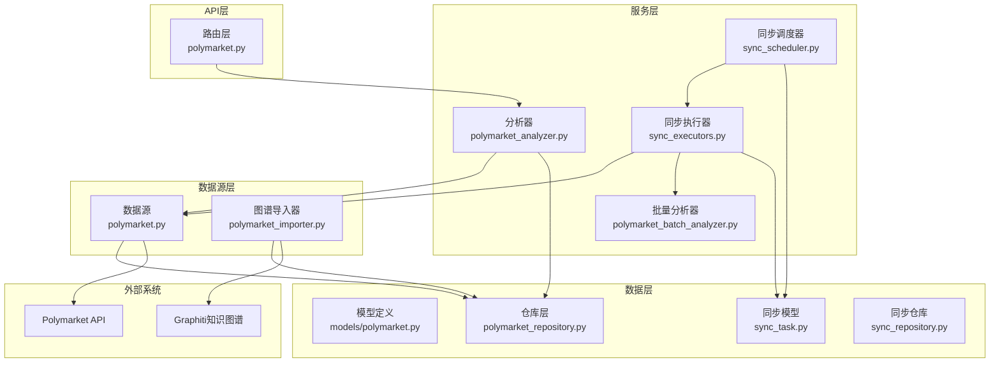

**图表来源**
- [polymarket.py:1-1177](file://backend/app/data_sources/polymarket.py#L1-L1177)
- [sync_scheduler.py:1-307](file://backend/app/services/sync_scheduler.py#L1-L307)
- [sync_executors.py:1-119](file://backend/app/services/sync_executors.py#L1-L119)

**章节来源**
- [polymarket.py:1-1177](file://backend/app/data_sources/polymarket.py#L1-L1177)
- [polymarket.py:1-70](file://backend/app/models/polymarket.py#L1-L70)

## 核心组件

### 数据源层 (Data Source Layer)

数据源层是Polymarket集成的核心，负责与Polymarket官方API进行交互并处理数据转换。

#### 主要功能特性：
- **多API端点支持**：支持Gamma API、Data API和CLOB API三个官方端点
- **智能缓存机制**：实现5分钟TTL缓存策略，减少API调用频率
- **数据标准化**：统一不同API返回的数据格式
- **错误处理**：完善的异常处理和降级策略

### 分析服务层 (Analysis Service Layer)

分析服务层提供智能化的市场分析功能，包括单市场分析和批量机会发现。

#### 核心分析能力：
- **AI驱动分析**：基于LLM的深度市场分析
- **机会识别**：自动识别高价值交易机会
- **风险评估**：综合评估市场风险和机会
- **技术面结合**：结合技术分析提供交易建议

### 同步调度器层 (Sync Scheduler Layer)

**更新** 同步调度器层是新引入的核心组件，提供通用的同步任务管理框架。

#### 核心功能：
- **通用执行器模式**：支持多种数据源类型的同步执行器
- **任务生命周期管理**：完整的任务创建、执行、监控和记录
- **并发控制**：支持多任务并发执行和资源管理
- **状态跟踪**：详细的执行状态和历史记录
- **灵活配置**：支持不同的执行间隔和参数配置

### 同步执行器层 (Sync Executor Layer)

**更新** 同步执行器层专门处理Polymarket数据的同步逻辑。

#### PolymarketSyncExecutor功能：
- **数据获取**：从Polymarket API获取市场数据
- **批量分析**：对增量数据进行AI机会分析
- **数据去重**：确保市场数据的唯一性和完整性
- **分类统计**：统计不同类别的市场分布
- **结果保存**：将分析结果持久化存储

**章节来源**
- [polymarket_analyzer.py:1-238](file://backend/app/services/polymarket_analyzer.py#L1-L238)
- [polymarket_batch_analyzer.py:1-222](file://backend/app/services/polymarket_batch_analyzer.py#L1-L222)
- [sync_scheduler.py:1-307](file://backend/app/services/sync_scheduler.py#L1-L307)
- [sync_executors.py:1-119](file://backend/app/services/sync_executors.py#L1-L119)

## 架构概览

**更新** Polymarket数据集成采用现代化的微服务架构，现在使用通用同步调度器框架，实现了高度模块化和可扩展的设计。

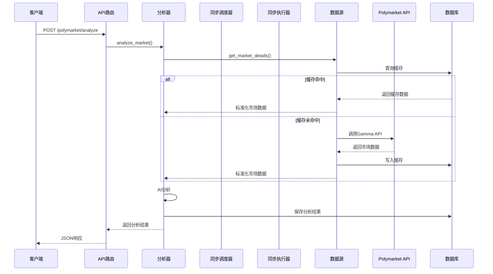

**图表来源**
- [polymarket.py:91-152](file://backend/app/data_sources/polymarket.py#L91-L152)
- [polymarket_analyzer.py:136-186](file://backend/app/services/polymarket_analyzer.py#L136-L186)

### 数据流架构

**更新** 系统采用事件驱动的数据流架构，现在通过通用同步调度器管理任务执行：

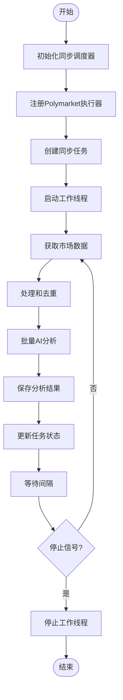

**图表来源**
- [sync_scheduler.py:119-136](file://backend/app/services/sync_scheduler.py#L119-L136)
- [sync_executors.py:28-105](file://backend/app/services/sync_executors.py#L28-L105)

**章节来源**
- [polymarket.py:1-1177](file://backend/app/data_sources/polymarket.py#L1-L1177)
- [sync_scheduler.py:1-307](file://backend/app/services/sync_scheduler.py#L1-L307)
- [polymarket-data.md:1-93](file://docs/data/polymarket-data.md#L1-L93)

## 详细组件分析

### PolymarketDataSource类

PolymarketDataSource是数据源层的核心类，负责与Polymarket API的所有交互。

#### 核心方法分析：

##### get_trending_markets方法
实现热门市场的获取和缓存逻辑：

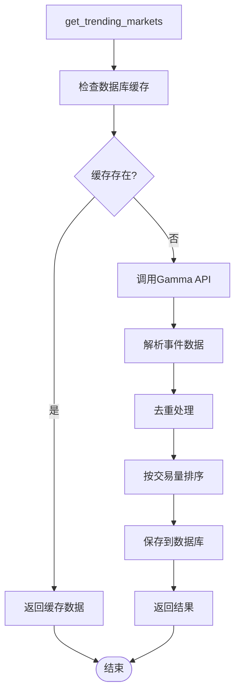

**图表来源**
- [polymarket.py:37-90](file://backend/app/data_sources/polymarket.py#L37-L90)

##### search_markets方法
实现智能搜索功能，支持多种匹配策略：

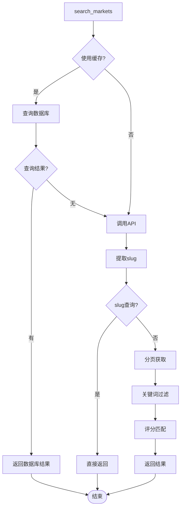

**图表来源**
- [polymarket.py:160-343](file://backend/app/data_sources/polymarket.py#L160-L343)

**章节来源**
- [polymarket.py:19-1177](file://backend/app/data_sources/polymarket.py#L19-L1177)

### PolymarketAnalyzer类

PolymarketAnalyzer提供高级分析功能，结合AI技术和市场数据进行深度分析。

#### 分析流程：

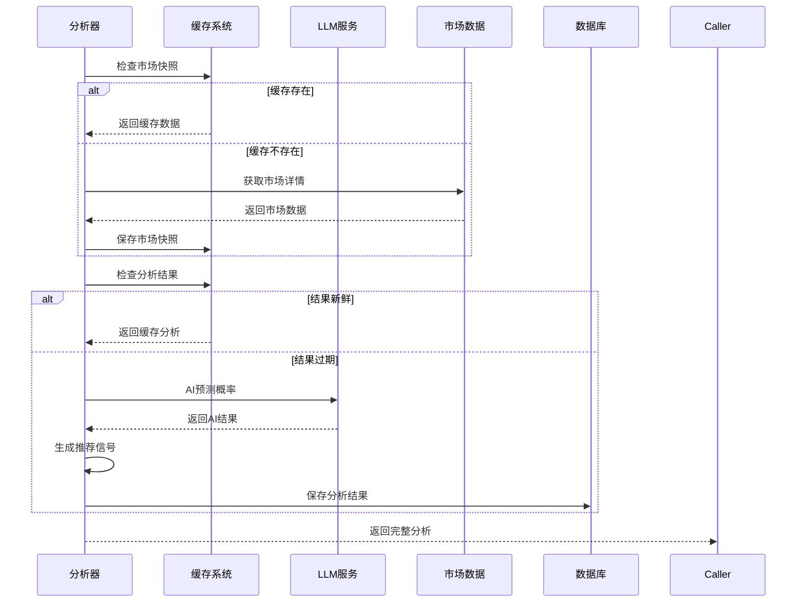

**图表来源**
- [polymarket_analyzer.py:136-186](file://backend/app/services/polymarket_analyzer.py#L136-L186)

**章节来源**
- [polymarket_analyzer.py:1-238](file://backend/app/services/polymarket_analyzer.py#L1-L238)

### 同步调度器 (SyncScheduler)

**更新** SyncScheduler是新的核心组件，提供通用的任务调度和管理功能。

#### 核心功能：
- **执行器注册**：支持动态注册不同类型的数据源执行器
- **任务管理**：创建、启动、停止和监控同步任务
- **状态跟踪**：记录任务执行的历史和状态
- **并发控制**：管理多个任务的并发执行
- **生命周期管理**：完整的任务从创建到完成的生命周期

#### 工作流程：

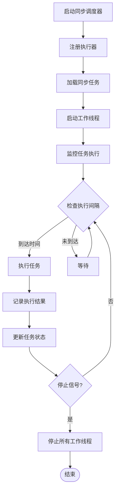

**图表来源**
- [sync_scheduler.py:119-136](file://backend/app/services/sync_scheduler.py#L119-L136)

**章节来源**
- [sync_scheduler.py:1-307](file://backend/app/services/sync_scheduler.py#L1-L307)

### 同步执行器 (PolymarketSyncExecutor)

**更新** PolymarketSyncExecutor是专门为Polymarket数据源设计的执行器。

#### 核心职责：
- **数据获取**：从Polymarket API获取市场数据
- **批量分析**：对增量数据进行AI机会分析
- **数据处理**：去重、分类和统计处理
- **结果保存**：将分析结果持久化存储

#### 执行流程：

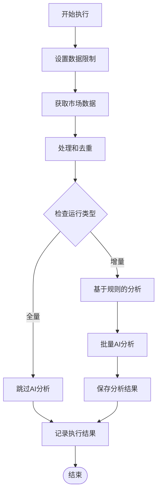

**图表来源**
- [sync_executors.py:28-105](file://backend/app/services/sync_executors.py#L28-L105)

**章节来源**
- [sync_executors.py:1-119](file://backend/app/services/sync_executors.py#L1-L119)

### 数据模型和仓库层

#### 数据模型设计

系统采用清晰的数据模型设计，支持完整的预测市场数据存储：

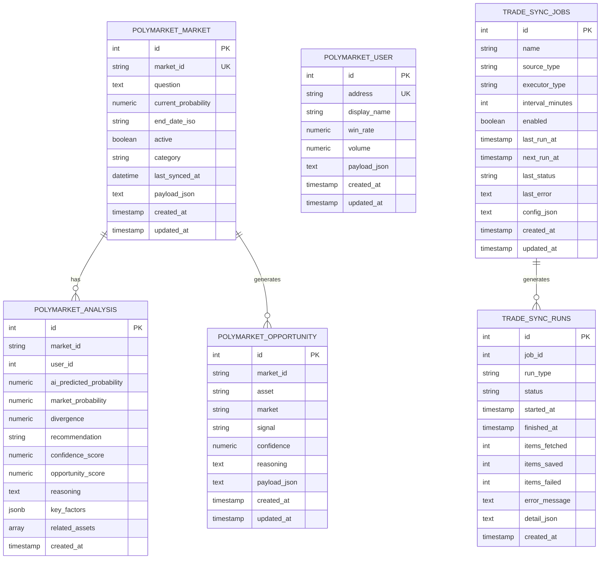

**图表来源**
- [polymarket.py:27-70](file://backend/app/models/polymarket.py#L27-L70)
- [sync_task.py:12-61](file://backend/app/models/sync_task.py#L12-L61)

**章节来源**
- [polymarket.py:1-70](file://backend/app/models/polymarket.py#L1-L70)
- [polymarket_repository.py:1-132](file://backend/app/database/repositories/polymarket_repository.py#L1-L132)
- [sync_task.py:1-61](file://backend/app/models/sync_task.py#L1-L61)

## 依赖关系分析

### 外部依赖

系统对外部系统的依赖关系如下：

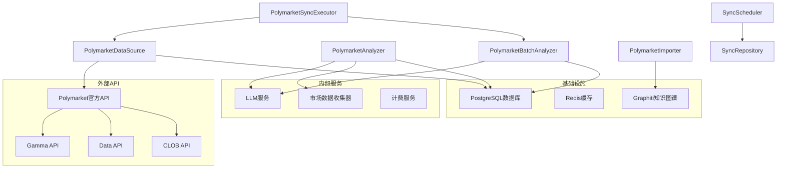

**图表来源**
- [polymarket.py:22-29](file://backend/app/data_sources/polymarket.py#L22-L29)
- [polymarket_analyzer.py:12-25](file://backend/app/services/polymarket_analyzer.py#L12-L25)

### 内部依赖关系

**更新** 系统内部各组件之间的依赖关系现在更加清晰：

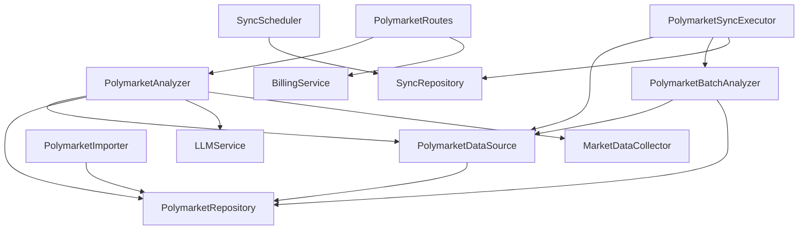

**图表来源**
- [polymarket.py:1-16](file://backend/app/data_sources/polymarket.py#L1-L16)
- [sync_scheduler.py:220-245](file://backend/app/services/sync_scheduler.py#L220-L245)

**章节来源**
- [polymarket.py:1-1177](file://backend/app/data_sources/polymarket.py#L1-L1177)
- [sync_scheduler.py:1-307](file://backend/app/services/sync_scheduler.py#L1-L307)

## 性能考量

### 缓存策略

系统实现了多层次的缓存策略来优化性能：

1. **数据库缓存**：5分钟TTL的市场数据缓存
2. **内存缓存**：工作线程内的临时缓存
3. **API限流**：合理的请求频率控制

### 性能优化措施

**更新** 新的同步调度器框架提供了更好的性能优化：

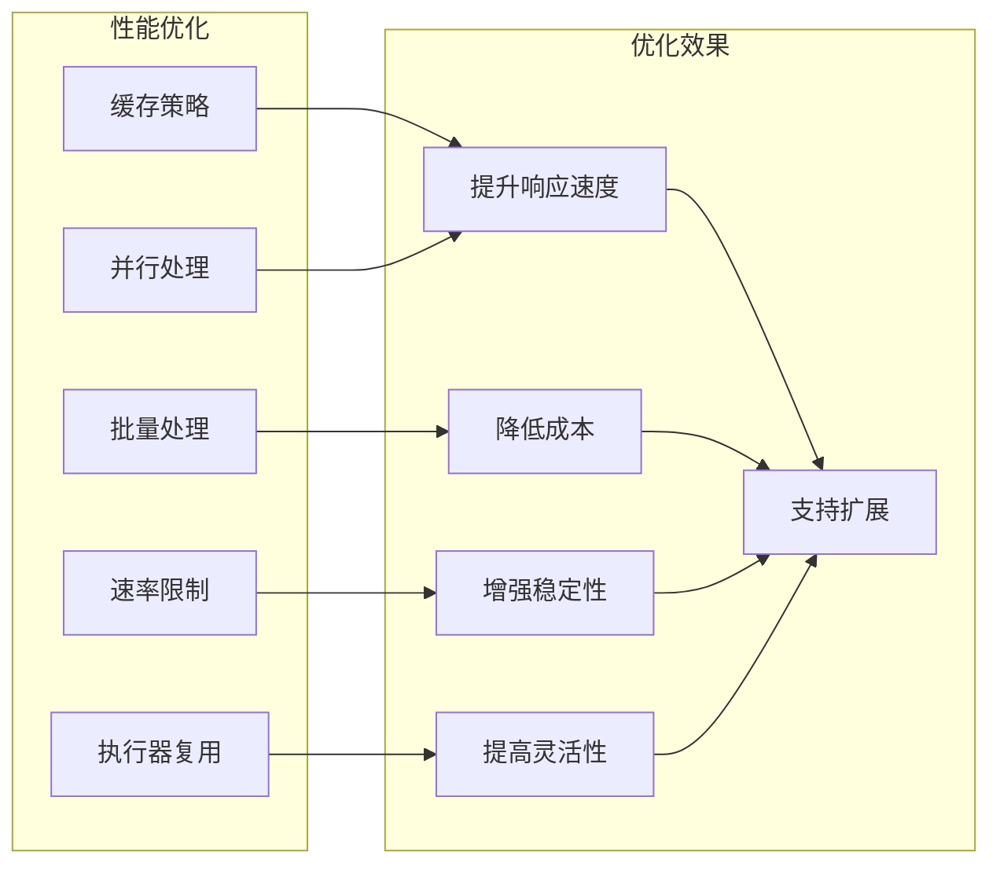

### 错误处理和降级

系统具备完善的错误处理机制：

1. **API错误处理**：网络超时、API限流、服务不可用等情况
2. **数据验证**：确保返回数据的完整性和一致性
3. **降级策略**：在API不可用时返回缓存数据
4. **监控告警**：实时监控系统状态和性能指标
5. **任务恢复**：支持任务失败后的自动重试和恢复

**章节来源**
- [polymarket.py:485-507](file://backend/app/data_sources/polymarket.py#L485-L507)
- [sync_scheduler.py:187-202](file://backend/app/services/sync_scheduler.py#L187-L202)

## 故障排除指南

### 常见问题及解决方案

#### API调用失败
- **症状**：返回空列表或错误日志
- **原因**：网络连接问题、API限流、服务不可用
- **解决方案**：检查网络连接、增加重试机制、调整请求频率

#### 数据解析错误
- **症状**：解析事件数据时出现异常
- **原因**：API返回格式变化、数据字段缺失
- **解决方案**：更新解析逻辑、添加字段验证、使用默认值

#### 缓存问题
- **症状**：缓存数据过期或损坏
- **原因**：缓存TTL设置不当、数据库连接异常
- **解决方案**：调整缓存策略、检查数据库状态、清理损坏缓存

#### 同步任务失败
**更新** 新增同步任务相关的故障排除：

- **症状**：同步任务无法启动或频繁失败
- **原因**：执行器未注册、数据库连接问题、配置错误
- **解决方案**：检查执行器注册状态、验证数据库连接、确认任务配置

### 监控和诊断

系统提供了完善的监控和诊断功能：

1. **日志记录**：详细的错误日志和调试信息
2. **性能指标**：API调用时间、成功率、错误率
3. **健康检查**：定期检查各组件运行状态
4. **告警机制**：异常情况自动通知
5. **任务状态监控**：实时查看同步任务执行状态

**章节来源**
- [polymarket.py:87-89](file://backend/app/data_sources/polymarket.py#L87-L89)
- [polymarket_analyzer.py:184-186](file://backend/app/services/polymarket_analyzer.py#L184-L186)

## 结论

QuantDinger项目的Polymarket预测市场数据集成为量化交易系统提供了强大的数据支撑。通过采用新的通用同步调度器框架，系统实现了以下关键改进：

### 技术成就

1. **完整的API集成**：支持Polymarket官方三个API端点
2. **智能缓存机制**：优化性能和降低成本
3. **AI驱动分析**：提供深度市场洞察和交易机会
4. **可扩展架构**：支持未来功能扩展和技术升级
5. **通用同步框架**：提供灵活的任务管理和执行机制

### 架构优势

**更新** 新的同步调度器框架带来了显著的架构优势：

1. **模块化设计**：执行器与调度器分离，提高代码复用性
2. **可扩展性**：支持轻松添加新的数据源执行器
3. **任务管理**：完整的任务生命周期管理和状态跟踪
4. **并发控制**：支持多任务并发执行和资源管理
5. **监控能力**：内置的任务执行监控和诊断功能

### 业务价值

1. **实时数据获取**：确保用户获得最新的市场信息
2. **智能分析**：帮助用户做出更好的投资决策
3. **风险控制**：提供全面的风险评估和管理工具
4. **成本效益**：通过缓存和优化降低运营成本
5. **系统稳定性**：新的框架提供了更好的错误处理和恢复能力

### 未来发展

系统为未来的扩展奠定了坚实基础，包括：

1. **知识图谱集成**：利用Graphiti构建预测市场知识图谱
2. **多市场支持**：扩展到其他预测市场平台
3. **机器学习增强**：进一步提升AI分析能力
4. **实时监控**：增强系统的可观测性和可维护性
5. **任务编排**：支持复杂的多步骤同步任务编排

通过这一完整的数据集成解决方案，QuantDinger为用户提供了一个强大、可靠、高效的预测市场分析平台，为量化交易提供了重要的数据和技术支撑。新的同步调度器框架不仅保持了原有功能的完整性，还为未来的功能扩展和技术升级提供了更加灵活和强大的基础。