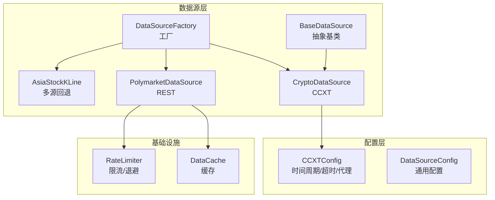
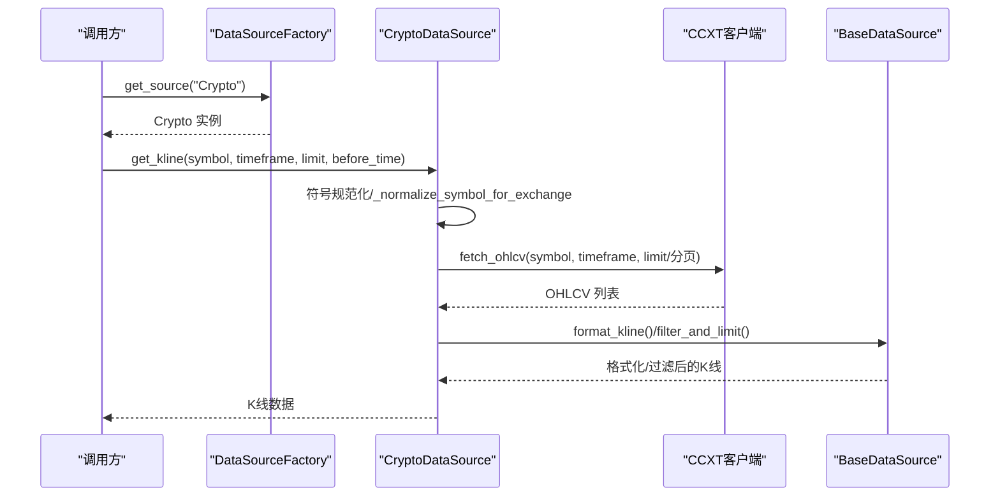
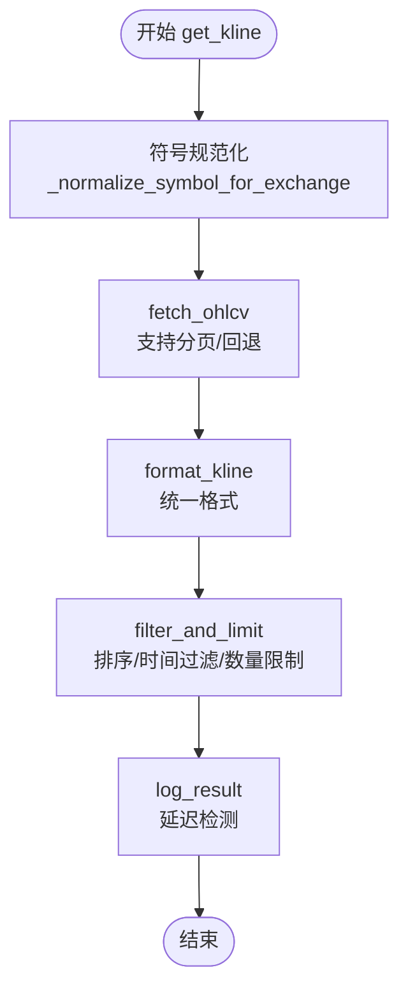
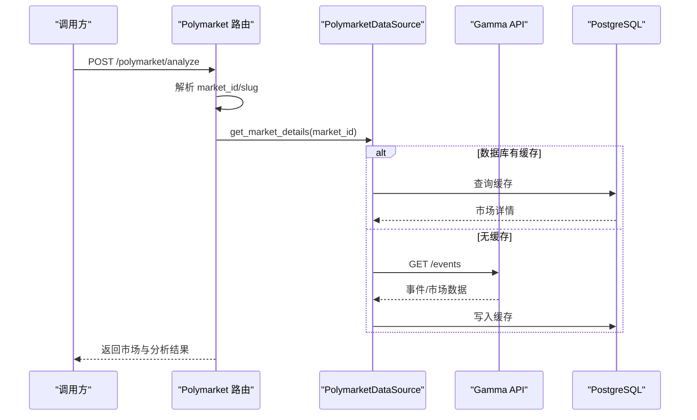
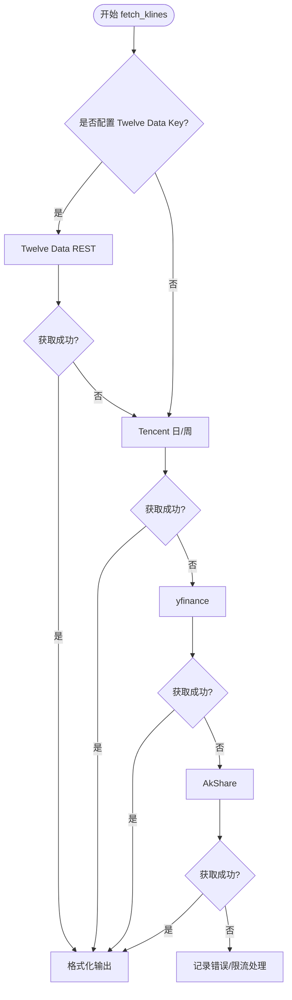
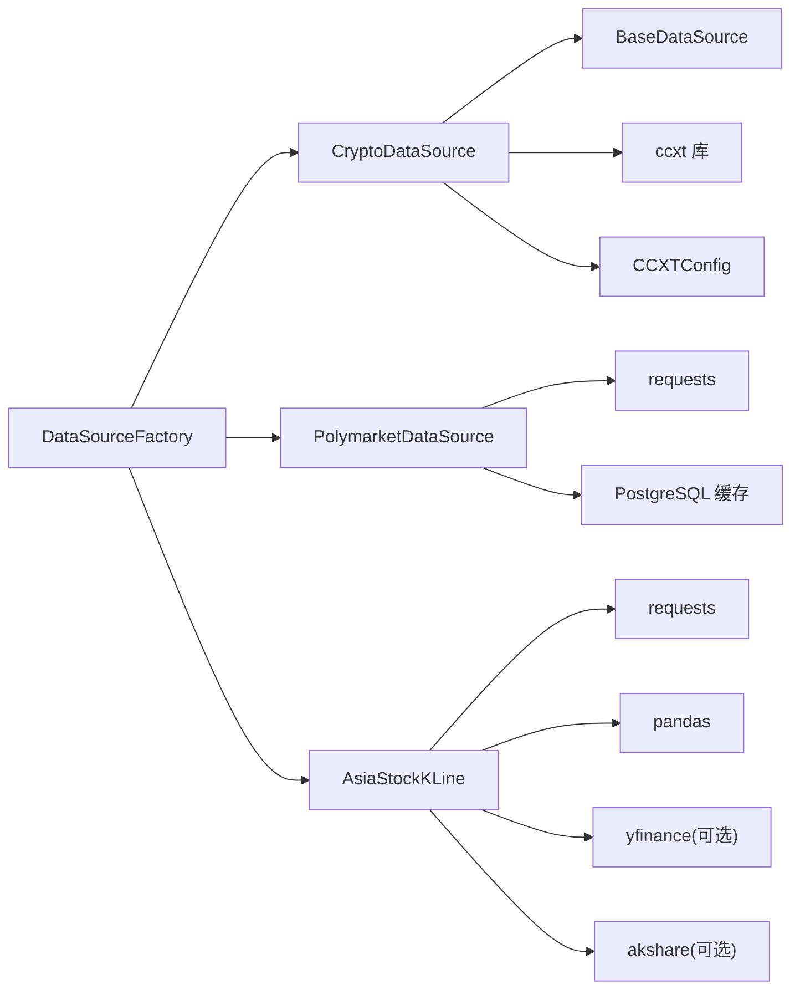

# 加密货币数据源

<cite>
**本文档引用的文件**
- [crypto.py](file://backend_api_python/app/data_sources/crypto.py)
- [base.py](file://backend_api_python/app/data_sources/base.py)
- [polymarket.py](file://backend_api_python/app/data_sources/polymarket.py)
- [asia_stock_kline.py](file://backend_api_python/app/data_sources/asia_stock_kline.py)
- [factory.py](file://backend_api_python/app/data_sources/factory.py)
- [data_sources.py](file://backend_api_python/app/config/data_sources.py)
- [cache_manager.py](file://backend_api_python/app/data_sources/cache_manager.py)
- [rate_limiter.py](file://backend_api_python/app/data_sources/rate_limiter.py)
- [polymarket_analyzer.py](file://backend_api_python/app/services/polymarket_analyzer.py)
- [polymarket.py](file://backend_api_python/app/routes/polymarket.py)
- [settings.py](file://backend_api_python/app/routes/settings.py)
- [execution.py](file://backend_api_python/app/services/live_trading/execution.py)
- [symbols.py](file://backend_api_python/app/services/live_trading/symbols.py)
</cite>

## 目录
1. [简介](#简介)
2. [项目结构](#项目结构)
3. [核心组件](#核心组件)
4. [架构总览](#架构总览)
5. [详细组件分析](#详细组件分析)
6. [依赖关系分析](#依赖关系分析)
7. [性能考虑](#性能考虑)
8. [故障排除指南](#故障排除指南)
9. [结论](#结论)
10. [附录](#附录)

## 简介
本文件系统性阐述加密货币数据源的实现原理与工程实践，重点覆盖：
- CryptoDataSource 的 CCXT 集成、REST API 数据获取与历史回溯策略
- 符号规范化与交易所适配（含 Coinbase、Kraken 等特例）
- Polymarket 预测市场数据源的 REST API 解析与缓存策略
- 亚洲股市 K 线数据的多源回退方案（Twelve Data、Tencent、yfinance、AkShare）
- 配置体系、错误处理与性能优化建议

## 项目结构
后端采用模块化数据源设计，通过工厂模式按市场类型返回对应的数据源实例；加密货币数据源位于 data_sources 子目录，Polymarket 与亚洲股市 K 线分别独立实现。

**图表来源**
- [factory.py:13-71](file://backend_api_python/app/data_sources/factory.py#L13-L71)
- [base.py:27-53](file://backend_api_python/app/data_sources/base.py#L27-L53)
- [crypto.py:16-53](file://backend_api_python/app/data_sources/crypto.py#L16-L53)
- [polymarket.py:17-34](file://backend_api_python/app/data_sources/polymarket.py#L17-L34)
- [asia_stock_kline.py:1-14](file://backend_api_python/app/data_sources/asia_stock_kline.py#L1-L14)
- [data_sources.py:101-150](file://backend_api_python/app/config/data_sources.py#L101-L150)
- [cache_manager.py:44-70](file://backend_api_python/app/data_sources/cache_manager.py#L44-L70)
- [rate_limiter.py:109-164](file://backend_api_python/app/data_sources/rate_limiter.py#L109-L164)

**章节来源**
- [factory.py:13-71](file://backend_api_python/app/data_sources/factory.py#L13-L71)
- [data_sources.py:101-150](file://backend_api_python/app/config/data_sources.py#L101-L150)

## 核心组件
- CryptoDataSource：基于 CCXT 的加密货币数据源，支持符号规范化、交易所特性适配、历史 K 线分页拉取与结果过滤。
- BaseDataSource：统一的 K 线接口与通用工具（格式化、时间范围计算、过滤限制、延迟检测）。
- PolymarketDataSource：Polymarket 预测市场数据源，提供热门市场、市场详情、搜索与缓存。
- AsiaStockKLine：亚洲股市（A/H 股）K 线多源回退方案，优先 Twelve Data，其次 Tencent/yfinance/AkShare。
- DataSourceFactory：按市场类型返回数据源实例，兼容历史调用路径。
- 配置体系：CCXTConfig 提供默认交易所、时间周期映射、超时与代理配置。
- 基础设施：DataCache 提供 TTL/LRU 缓存；RateLimiter 提供随机抖动、指数退避与请求频率控制。

**章节来源**
- [crypto.py:16-175](file://backend_api_python/app/data_sources/crypto.py#L16-L175)
- [base.py:27-171](file://backend_api_python/app/data_sources/base.py#L27-L171)
- [polymarket.py:17-88](file://backend_api_python/app/data_sources/polymarket.py#L17-L88)
- [asia_stock_kline.py:1-14](file://backend_api_python/app/data_sources/asia_stock_kline.py#L1-L14)
- [factory.py:13-71](file://backend_api_python/app/data_sources/factory.py#L13-L71)
- [data_sources.py:101-150](file://backend_api_python/app/config/data_sources.py#L101-L150)
- [cache_manager.py:44-233](file://backend_api_python/app/data_sources/cache_manager.py#L44-L233)
- [rate_limiter.py:109-273](file://backend_api_python/app/data_sources/rate_limiter.py#L109-L273)

## 架构总览
加密货币数据流经 CCXT 客户端，结合 BaseDataSource 的统一格式化与过滤；Polymarket 数据通过 REST API 获取并缓存；亚洲股市 K 线采用多源回退策略保证稳定性。

**图表来源**
- [factory.py:74-105](file://backend_api_python/app/data_sources/factory.py#L74-L105)
- [crypto.py:232-297](file://backend_api_python/app/data_sources/crypto.py#L232-L297)
- [base.py:64-131](file://backend_api_python/app/data_sources/base.py#L64-L131)

## 详细组件分析

### CryptoDataSource 组件分析
- CCXT 集成与配置
  - 默认交易所、超时、代理与速率限制由 CCXTConfig 提供，支持动态加载交易所类。
  - 时间周期映射来自 CCXTConfig.TIMEFRAME_MAP，与 BaseDataSource 的 TIMEFRAME_SECONDS 协作。
- 符号规范化
  - 支持多种输入格式（含冒号后缀、无分隔符等），自动识别基础/报价货币组合。
  - 针对 Coinbase 等交易所的特殊映射（如 USDT→USD），并在 markets 中查找有效符号。
- 历史 K 线获取
  - 支持 before_time 的历史窗口回溯，内部按批次拉取并合并，确保覆盖完整时间范围。
  - 失败时触发回退策略，使用基于起止时间的 fetch_ohlcv 调用。
- 结果处理
  - 统一格式化与过滤，按时间升序、剔除无效条目、限制数量。
  - 延迟检测：根据 K 线末尾时间与当前 UTC 的差值，按周期设定阈值告警。

**图表来源**
- [crypto.py:232-297](file://backend_api_python/app/data_sources/crypto.py#L232-L297)
- [base.py:64-131](file://backend_api_python/app/data_sources/base.py#L64-L131)

**章节来源**
- [crypto.py:16-175](file://backend_api_python/app/data_sources/crypto.py#L16-L175)
- [crypto.py:232-387](file://backend_api_python/app/data_sources/crypto.py#L232-L387)
- [base.py:14-171](file://backend_api_python/app/data_sources/base.py#L14-L171)
- [data_sources.py:101-150](file://backend_api_python/app/config/data_sources.py#L101-L150)

### Polymarket 预测市场数据源
- 数据来源与端点
  - Gamma API（市场/事件）、Data API（用户/活动）、CLOB API（订单簿/价格）。
  - 采用 Session 与 User-Agent 等头部，增强稳定性。
- 热门市场与搜索
  - 支持按类别筛选、去重、按 24h 成交量排序；搜索支持 slug/ID/关键词多维匹配。
  - 优先从数据库缓存读取，支持 TTL 控制；失败时回退至 API。
- 市场详情与 URL 构建
  - 从数据库或 API 获取市场详情，解析概率、流动性、结束时间等字段。
  - 统一 URL 构建策略，优先 slug，否则回退 markets 端点。
- 缓存与持久化
  - 数据库缓存 qd_polymarket_markets，PolymarketAnalyzer 同步缓存 qd_polymarket_ai_analysis。
- 路由与分析
  - 提供 /polymarket/analyze 接口，解析输入（URL/标题），调用 PolymarketAnalyzer 生成 AI 分析与机会评分。

**图表来源**
- [polymarket.py:22-254](file://backend_api_python/app/routes/polymarket.py#L22-L254)
- [polymarket.py:89-158](file://backend_api_python/app/data_sources/polymarket.py#L89-L158)
- [polymarket.py:450-541](file://backend_api_python/app/data_sources/polymarket.py#L450-L541)
- [polymarket_analyzer.py:19-112](file://backend_api_python/app/services/polymarket_analyzer.py#L19-L112)

**章节来源**
- [polymarket.py:17-88](file://backend_api_python/app/data_sources/polymarket.py#L17-L88)
- [polymarket.py:89-158](file://backend_api_python/app/data_sources/polymarket.py#L89-L158)
- [polymarket.py:450-541](file://backend_api_python/app/data_sources/polymarket.py#L450-L541)
- [polymarket.py:704-985](file://backend_api_python/app/data_sources/polymarket.py#L704-L985)
- [polymarket_analyzer.py:19-112](file://backend_api_python/app/services/polymarket_analyzer.py#L19-L112)
- [polymarket.py:22-254](file://backend_api_python/app/routes/polymarket.py#L22-L254)

### 亚洲股市 K 线适配方案
- 回退策略优先级
  - 配置 TWELVE_DATA_API_KEY：Twelve Data（全局稳定）→ Tencent 日/周 → yfinance → AkShare。
  - 无 Key：Tencent 日/周 → yfinance → AkShare。
- 时间周期与代码转换
  - timeframe 别名映射（如 1w→1W、1d→1D 等）。
  - 腾讯代码到 AkShare/yfinance 的转换（A/H 股）。
- 错误与限流处理
  - 临时性错误标记（连接中断、超时、429 等）触发指数退避重试。
  - 代理绕过（_bypass_proxy）用于 AkShare 访问国内站点。
- 数据格式化
  - 统一输出 K 线格式（time/open/high/low/close/volume），按时间排序。

**图表来源**
- [asia_stock_kline.py:1-14](file://backend_api_python/app/data_sources/asia_stock_kline.py#L1-L14)
- [asia_stock_kline.py:169-264](file://backend_api_python/app/data_sources/asia_stock_kline.py#L169-L264)
- [asia_stock_kline.py:355-408](file://backend_api_python/app/data_sources/asia_stock_kline.py#L355-L408)
- [asia_stock_kline.py:485-530](file://backend_api_python/app/data_sources/asia_stock_kline.py#L485-L530)

**章节来源**
- [asia_stock_kline.py:1-14](file://backend_api_python/app/data_sources/asia_stock_kline.py#L1-L14)
- [asia_stock_kline.py:169-264](file://backend_api_python/app/data_sources/asia_stock_kline.py#L169-L264)
- [asia_stock_kline.py:355-408](file://backend_api_python/app/data_sources/asia_stock_kline.py#L355-L408)
- [asia_stock_kline.py:485-530](file://backend_api_python/app/data_sources/asia_stock_kline.py#L485-L530)

### 交易对格式与下单适配
- 符号规范化
  - 统一去除冒号后缀、转为大写、识别分隔符与报价货币，无法识别时默认 USDT。
- 交易所适配
  - Coinbase：USDT→USD 映射；markets 校验有效性。
- 下单符号格式
  - Spot/swap 场景下，确保符号符合交易所要求（如 Deepcoin、HTX 等格式）。

**章节来源**
- [crypto.py:70-174](file://backend_api_python/app/data_sources/crypto.py#L70-L174)
- [execution.py:41-84](file://backend_api_python/app/services/live_trading/execution.py#L41-L84)
- [symbols.py:175-214](file://backend_api_python/app/services/live_trading/symbols.py#L175-L214)

## 依赖关系分析
- CryptoDataSource 依赖 BaseDataSource（接口与工具）、CCXTConfig（配置）、CCXT 库。
- PolymarketDataSource 依赖 requests、数据库（缓存）、时间解析与 JSON 处理。
- AsiaStockKLine 依赖 requests、pandas、yfinance、akshare（可选）。
- 工厂模式解耦调用方与具体数据源实现。
- 缓存与限流作为横切关注点注入到数据源与外部 API 调用。

**图表来源**
- [crypto.py:16-53](file://backend_api_python/app/data_sources/crypto.py#L16-L53)
- [polymarket.py:17-34](file://backend_api_python/app/data_sources/polymarket.py#L17-L34)
- [asia_stock_kline.py:24-26](file://backend_api_python/app/data_sources/asia_stock_kline.py#L24-L26)
- [factory.py:13-71](file://backend_api_python/app/data_sources/factory.py#L13-L71)

**章节来源**
- [factory.py:13-71](file://backend_api_python/app/data_sources/factory.py#L13-L71)
- [data_sources.py:101-150](file://backend_api_python/app/config/data_sources.py#L101-L150)

## 性能考虑
- 缓存策略
  - DataCache 提供 TTL/LRU，实时行情 20 分钟、K 线 5 分钟、股票信息 24 小时，命中率统计便于监控。
- 限流与退避
  - RateLimiter 随机抖动与最小间隔，指数退避重试（2^attempt）上限 30s，缓解 API 限流。
- 历史回溯优化
  - CCXT 分页拉取，按时间步长推进，避免一次性请求过多；before_time 窗口内精确覆盖。
- 多源回退
  - 优先稳定源（Twelve Data），失败快速降级，减少整体失败率。

**章节来源**
- [cache_manager.py:44-233](file://backend_api_python/app/data_sources/cache_manager.py#L44-L233)
- [rate_limiter.py:109-273](file://backend_api_python/app/data_sources/rate_limiter.py#L109-L273)
- [crypto.py:299-387](file://backend_api_python/app/data_sources/crypto.py#L299-L387)
- [asia_stock_kline.py:169-264](file://backend_api_python/app/data_sources/asia_stock_kline.py#L169-L264)

## 故障排除指南
- CCXT 符号错误
  - 现象：symbol not found、market does not exist。
  - 处理：启用 markets 加载与有效符号查找，尝试 USDT→USD 映射。
- API 限流/超时
  - Polymarket：429/503 等状态码，记录告警并回退缓存；Twelve Data：429/配额限制，指数退避。
- 数据为空
  - 检查 markets 缓存是否加载、before_time 窗口是否过大、过滤后被裁剪。
- 代理与网络
  - CCXTConfig.PROXY 与环境变量 HTTPS_PROXY/HTTP_PROXY；AkShare 访问国内站点时可临时清除代理。

**章节来源**
- [crypto.py:200-230](file://backend_api_python/app/data_sources/crypto.py#L200-L230)
- [polymarket.py:520-541](file://backend_api_python/app/data_sources/polymarket.py#L520-L541)
- [asia_stock_kline.py:202-230](file://backend_api_python/app/data_sources/asia_stock_kline.py#L202-L230)
- [data_sources.py:132-145](file://backend_api_python/app/config/data_sources.py#L132-L145)

## 结论
该数据源体系通过 CCXT、REST API 与多源回退策略，实现了对加密货币、预测市场与亚洲股市的稳健数据获取。配合缓存与限流机制，兼顾性能与可靠性；工厂模式与统一接口提升了扩展性与可维护性。

## 附录

### 配置示例与要点
- CCXT 默认交易所与时间周期映射
  - 默认交易所：binance（可通过 CCXT_DEFAULT_EXCHANGE 环境变量或配置覆盖）。
  - 时间周期映射：1m/5m/15m/30m/1H/4H/1D/1W。
- 数据源通用配置
  - 超时、重试次数与退避系数可通过配置或环境变量调整。
- Polymarket 分析路由
  - /polymarket/analyze 接收输入（URL/标题），返回市场与 AI 分析结果。

**章节来源**
- [data_sources.py:101-150](file://backend_api_python/app/config/data_sources.py#L101-L150)
- [settings.py:1015-1054](file://backend_api_python/app/routes/settings.py#L1015-L1054)
- [polymarket.py:22-254](file://backend_api_python/app/routes/polymarket.py#L22-L254)