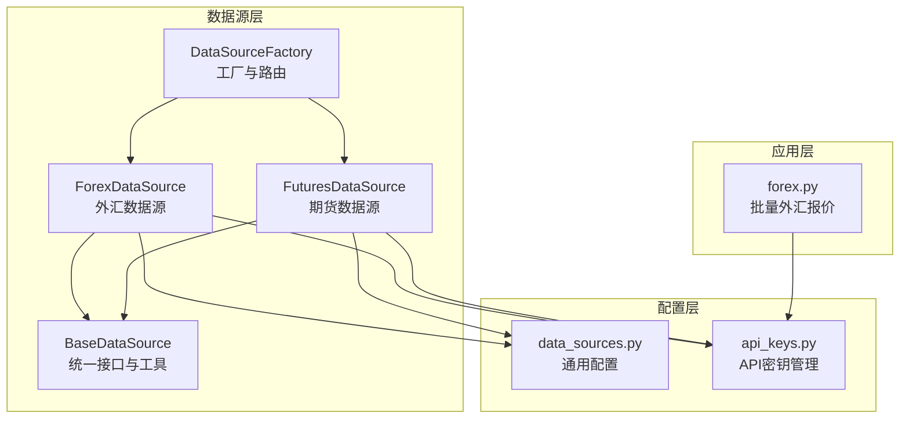
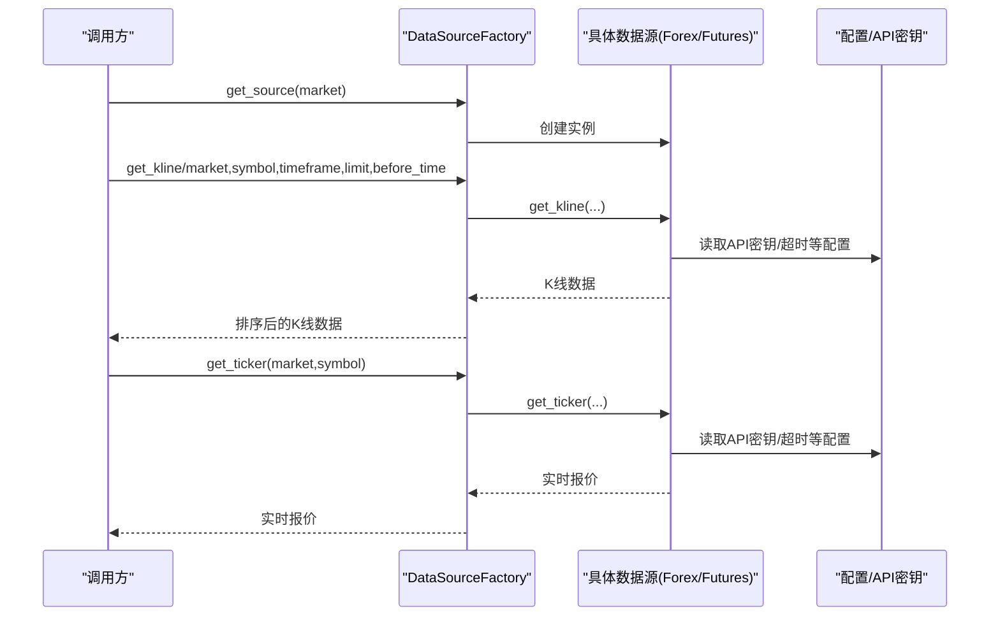
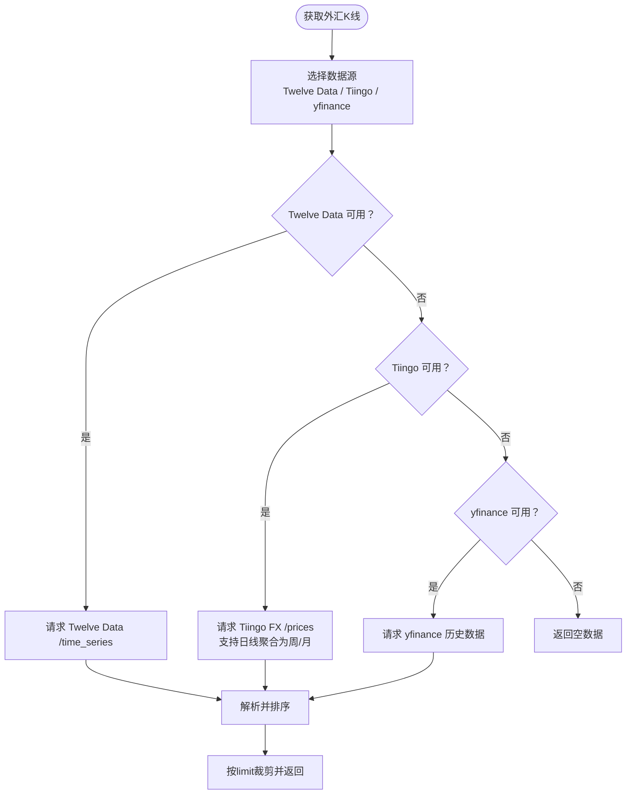
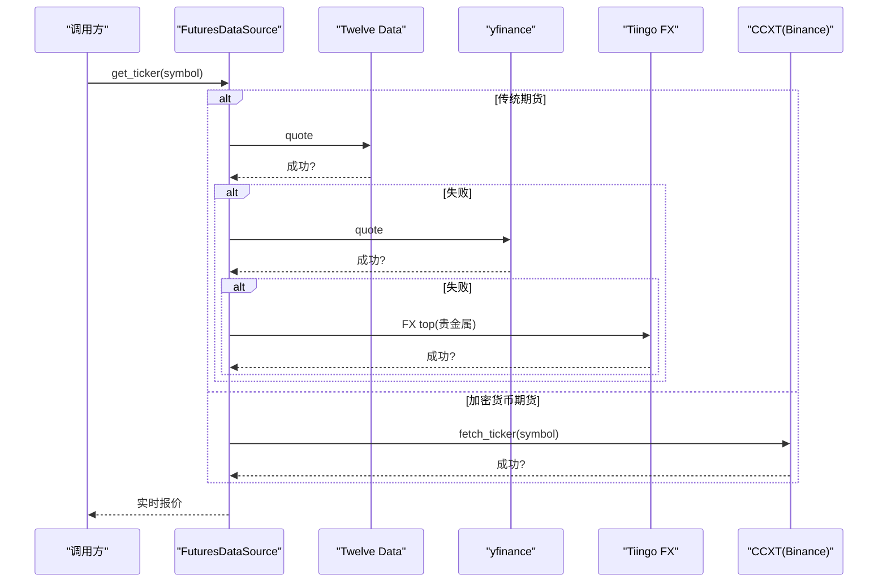
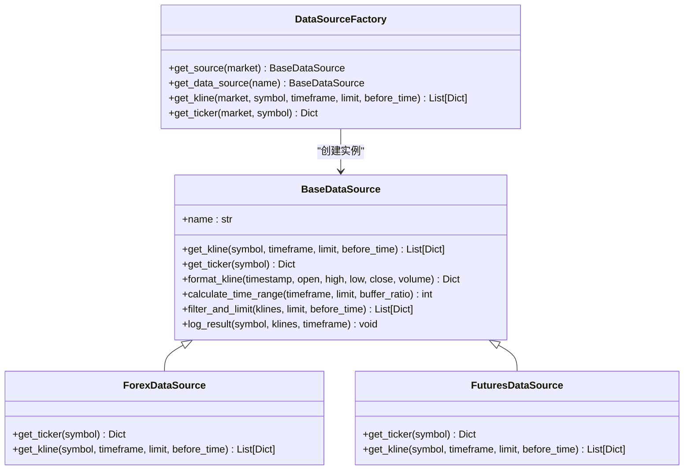
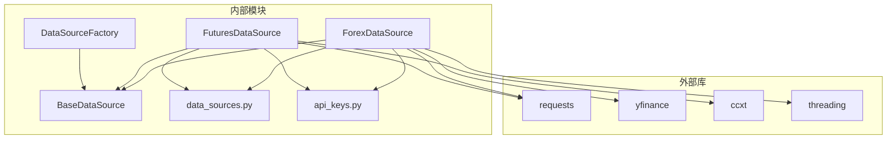

# 外汇期货数据源

<cite>
**本文档引用的文件**
- [forex.py](file://backend_api_python/app/data_sources/forex.py)
- [futures.py](file://backend_api_python/app/data_sources/futures.py)
- [base.py](file://backend_api_python/app/data_sources/base.py)
- [factory.py](file://backend_api_python/app/data_sources/factory.py)
- [data_sources.py](file://backend_api_python/app/config/data_sources.py)
- [api_keys.py](file://backend_api_python/app/config/api_keys.py)
- [forex.py](file://backend_api_python/app/data_providers/forex.py)
</cite>

## 目录
1. [简介](#简介)
2. [项目结构](#项目结构)
3. [核心组件](#核心组件)
4. [架构概览](#架构概览)
5. [详细组件分析](#详细组件分析)
6. [依赖分析](#依赖分析)
7. [性能考量](#性能考量)
8. [故障排除指南](#故障排除指南)
9. [结论](#结论)
10. [附录](#附录)

## 简介
本文件面向量化交易系统中的外汇与期货数据源，系统性阐述 ForexDataSource 与 FuturesDataSource 的实现特点，重点覆盖以下主题：
- 外汇市场的报价机制与点差处理
- 期货市场的合约月份轮换与交割规则
- 保证金与杠杆在系统中的体现与影响
- 多数据源降级策略与统一接口设计
- 不同数据源的选择标准与适用场景

通过代码级分析与可视化图示，帮助开发者与策略工程师快速理解并正确使用这些数据源。

## 项目结构
本项目采用模块化的数据源架构，核心位于 backend_api_python/app/data_sources 目录，包含基础抽象、具体数据源实现、工厂与配置模块。外汇报价与期货数据分别由独立的数据源类负责，统一通过工厂进行实例化与调用。

**图表来源**
- [factory.py:13-71](file://backend_api_python/app/data_sources/factory.py#L13-L71)
- [base.py:27-171](file://backend_api_python/app/data_sources/base.py#L27-L171)
- [forex.py:95-690](file://backend_api_python/app/data_sources/forex.py#L95-L690)
- [futures.py:60-465](file://backend_api_python/app/data_sources/futures.py#L60-L465)
- [data_sources.py:26-171](file://backend_api_python/app/config/data_sources.py#L26-L171)
- [api_keys.py:148-164](file://backend_api_python/app/config/api_keys.py#L148-L164)
- [forex.py:1-172](file://backend_api_python/app/data_providers/forex.py#L1-L172)

**章节来源**
- [factory.py:13-71](file://backend_api_python/app/data_sources/factory.py#L13-L71)
- [base.py:27-171](file://backend_api_python/app/data_sources/base.py#L27-L171)

## 核心组件
- BaseDataSource：定义统一的 K 线与实时报价接口、时间周期映射、数据过滤与延迟检测等通用能力。
- DataSourceFactory：按市场类型返回对应数据源实例，提供便捷的 K 线与实时报价获取方法。
- ForexDataSource：支持外汇与贵金属现货的多数据源降级（Twelve Data → Tiingo → yfinance），并内置缓存与聚合逻辑。
- FuturesDataSource：支持传统期货（Twelve Data → yfinance → Tiingo 精品金属）与加密货币期货（CCXT），并区分传统与加密两类数据流。

**章节来源**
- [base.py:27-171](file://backend_api_python/app/data_sources/base.py#L27-L171)
- [factory.py:13-134](file://backend_api_python/app/data_sources/factory.py#L13-L134)
- [forex.py:95-690](file://backend_api_python/app/data_sources/forex.py#L95-L690)
- [futures.py:60-465](file://backend_api_python/app/data_sources/futures.py#L60-L465)

## 架构概览
下图展示数据源工厂如何根据市场类型选择具体数据源，并调用其统一接口获取 K 线与实时报价。

**图表来源**
- [factory.py:74-133](file://backend_api_python/app/data_sources/factory.py#L74-L133)
- [base.py:32-82](file://backend_api_python/app/data_sources/base.py#L32-L82)
- [data_sources.py:26-171](file://backend_api_python/app/config/data_sources.py#L26-L171)
- [api_keys.py:148-164](file://backend_api_python/app/config/api_keys.py#L148-L164)

## 详细组件分析

### 外汇数据源（ForexDataSource）
- 多数据源降级策略
  - 优先级：Twelve Data → Tiingo → yfinance
  - 实时报价与 K 线均遵循相同降级链路，确保在任一上游不可用时仍能返回可用数据
- 点差与报价机制
  - Twelve Data 提供 close/previous_close，用于计算涨跌与涨跌幅
  - Tiingo 提供 bid/ask/mid，若无 mid 则以 bid 与 ask 的平均值近似中间价
  - yfinance 通过历史收盘价序列计算涨跌
- 合约月份轮换与时间聚合
  - Tiingo 日线数据支持按周/月聚合，内部实现将日线聚合为周线与月线，满足周线/月线需求
- 缓存与性能
  - 全局缓存（带 TTL）减少重复请求，提升高频访问性能
- 时间周期与时间范围
  - 使用 TIMEFRAME_SECONDS 映射周期到秒数，计算请求时间范围时加入缓冲系数

**图表来源**
- [forex.py:303-373](file://backend_api_python/app/data_sources/forex.py#L303-L373)
- [forex.py:375-559](file://backend_api_python/app/data_sources/forex.py#L375-L559)
- [forex.py:644-689](file://backend_api_python/app/data_sources/forex.py#L644-L689)

**章节来源**
- [forex.py:95-690](file://backend_api_python/app/data_sources/forex.py#L95-L690)

### 期货数据源（FuturesDataSource）
- 传统期货
  - 数据源：Twelve Data → yfinance → Tiingo（精品金属）
  - 符号映射：GC→XAUUSD，SI→XAGUSD，通过 Tiingo FX 获取贵金属实时报价
  - 时间周期：支持分钟至日线，周线通过日线聚合实现
- 加密货币期货
  - 使用 CCXT（默认 Binance Futures）获取 K 线数据，支持多交易所与多周期映射
- 统一接口
  - get_ticker：自动识别传统期货与加密货币期货，分别调用对应路径
  - get_kline：根据符号特征分流到传统或加密数据流

**图表来源**
- [futures.py:108-134](file://backend_api_python/app/data_sources/futures.py#L108-L134)
- [futures.py:136-211](file://backend_api_python/app/data_sources/futures.py#L136-L211)
- [futures.py:415-463](file://backend_api_python/app/data_sources/futures.py#L415-L463)

**章节来源**
- [futures.py:60-465](file://backend_api_python/app/data_sources/futures.py#L60-L465)

### 统一数据接口与工厂
- BaseDataSource
  - 定义 get_kline 与可选的 get_ticker 接口
  - 提供 TIMEFRAME_SECONDS 映射、数据过滤与时间范围计算、延迟检测等工具
- DataSourceFactory
  - 按市场类型返回对应数据源实例
  - 提供 get_kline 与 get_ticker 的便捷方法，内部完成排序与异常处理

**图表来源**
- [base.py:27-171](file://backend_api_python/app/data_sources/base.py#L27-L171)
- [factory.py:13-134](file://backend_api_python/app/data_sources/factory.py#L13-L134)
- [forex.py:95-113](file://backend_api_python/app/data_sources/forex.py#L95-L113)
- [futures.py:60-90](file://backend_api_python/app/data_sources/futures.py#L60-L90)

**章节来源**
- [base.py:27-171](file://backend_api_python/app/data_sources/base.py#L27-L171)
- [factory.py:13-134](file://backend_api_python/app/data_sources/factory.py#L13-L134)

## 依赖分析
- 外部依赖
  - requests：HTTP 请求
  - yfinance：免费金融数据获取
  - ccxt：加密货币交易所接口
  - threading：全局缓存的线程安全
- 内部依赖
  - BaseDataSource：所有具体数据源的父类
  - DataSourceFactory：统一入口与实例缓存
  - data_sources.py：通用配置（超时、重试、时间周期映射）
  - api_keys.py：API 密钥读取与校验

**图表来源**
- [forex.py:5-17](file://backend_api_python/app/data_sources/forex.py#L5-L17)
- [futures.py:7-17](file://backend_api_python/app/data_sources/futures.py#L7-L17)
- [data_sources.py:26-171](file://backend_api_python/app/config/data_sources.py#L26-L171)
- [api_keys.py:148-164](file://backend_api_python/app/config/api_keys.py#L148-L164)

**章节来源**
- [forex.py:5-17](file://backend_api_python/app/data_sources/forex.py#L5-L17)
- [futures.py:7-17](file://backend_api_python/app/data_sources/futures.py#L7-L17)
- [data_sources.py:26-171](file://backend_api_python/app/config/data_sources.py#L26-L171)
- [api_keys.py:148-164](file://backend_api_python/app/config/api_keys.py#L148-L164)

## 性能考量
- 缓存策略
  - 外汇数据源使用全局缓存与 TTL，减少重复请求，适合高频查询场景
- 重试与限速
  - Tiingo 与 Twelve Data 在遇到 429/速率限制时进行指数退避重试
- 时间范围计算
  - 通过 TIMEFRAME_SECONDS 与缓冲系数估算请求范围，避免过度拉取导致的性能问题
- 数据聚合
  - Tiingo 日线聚合为周/月线，减少上游请求次数，提升周线/月线获取效率

**章节来源**
- [forex.py:19-22](file://backend_api_python/app/data_sources/forex.py#L19-L22)
- [forex.py:78-92](file://backend_api_python/app/data_sources/forex.py#L78-L92)
- [futures.py:456-479](file://backend_api_python/app/data_sources/futures.py#L456-L479)
- [base.py:83-101](file://backend_api_python/app/data_sources/base.py#L83-L101)

## 故障排除指南
- API 密钥配置
  - 确认 TWELVE_DATA_API_KEY 与 TIINGO_API_KEY 已正确设置，否则相关数据源将降级或不可用
- 速率限制
  - 遇到 429 错误时，系统会自动等待并重试；必要时升级付费计划
- 数据缺失
  - 若 get_ticker 返回空或 last 为 0，检查符号格式与上游数据可用性
- 时区与时序
  - Tiingo 返回 UTC 时间，内部已正确转换；确保下游逻辑使用 UTC 时间戳

**章节来源**
- [api_keys.py:34-41](file://backend_api_python/app/config/api_keys.py#L34-L41)
- [api_keys.py:28-32](file://backend_api_python/app/config/api_keys.py#L28-L32)
- [forex.py:196-213](file://backend_api_python/app/data_sources/forex.py#L196-L213)
- [futures.py:485-491](file://backend_api_python/app/data_sources/futures.py#L485-L491)

## 结论
ForexDataSource 与 FuturesDataSource 通过统一的 BaseDataSource 接口与 DataSourceFactory 路由，实现了对外汇与期货市场的多数据源降级与一致化访问。外汇侧强调报价点差与缓存优化，期货侧兼顾传统商品与加密货币的差异化需求。配合配置模块与 API 密钥管理，系统在稳定性与性能之间取得良好平衡，适合构建稳健的量化交易数据基础设施。

## 附录

### 外汇与期货的关键概念说明
- 外汇报价机制
  - bid/ask/mid：报价三要素，mid 可由 bid 与 ask 计算得到
  - 涨跌与涨跌幅：基于 previous_close 与最新 close 计算
- 期货合约轮换与交割
  - 合约月份轮换：通过符号后缀（如 =F）与交易所规则实现
  - 交割规则：不同交易所与产品类型存在差异，需参考具体交易所文档
- 保证金与杠杆
  - 杠杆放大收益与风险，下单时需考虑维持保证金与强平价格
  - 保证金计算与最小订单数量（min notional）直接影响可执行性

### 数据源选择标准
- 外汇
  - 优先 Twelve Data（高质量实时报价）
  - Tiingo 作为日线与部分时间周期的补充
  - yfinance 作为最后的兜底
- 期货
  - 传统商品：Twelve Data → yfinance → Tiingo（贵金属）
  - 加密货币期货：CCXT（Binance Futures 等）

**章节来源**
- [forex.py:148-297](file://backend_api_python/app/data_sources/forex.py#L148-L297)
- [futures.py:136-211](file://backend_api_python/app/data_sources/futures.py#L136-L211)
- [futures.py:415-463](file://backend_api_python/app/data_sources/futures.py#L415-L463)