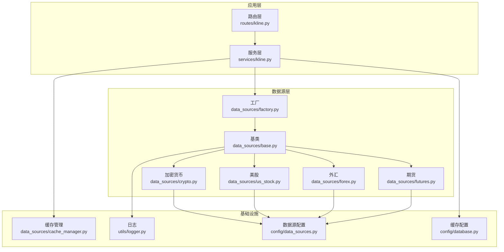
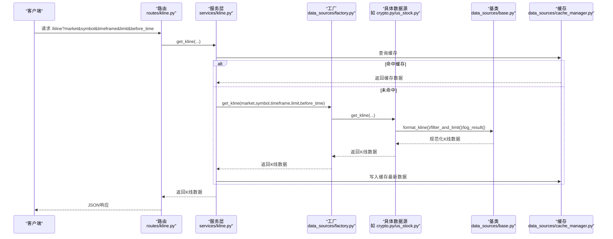
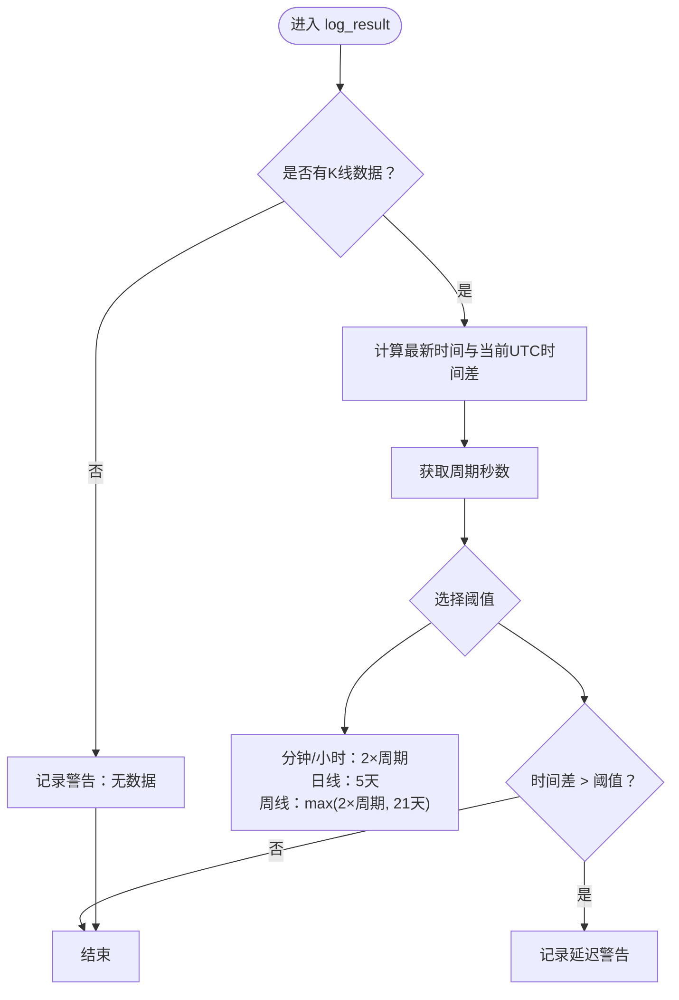
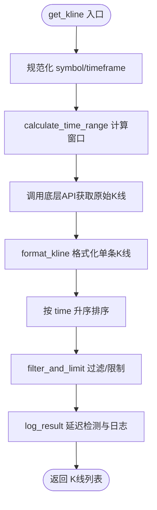
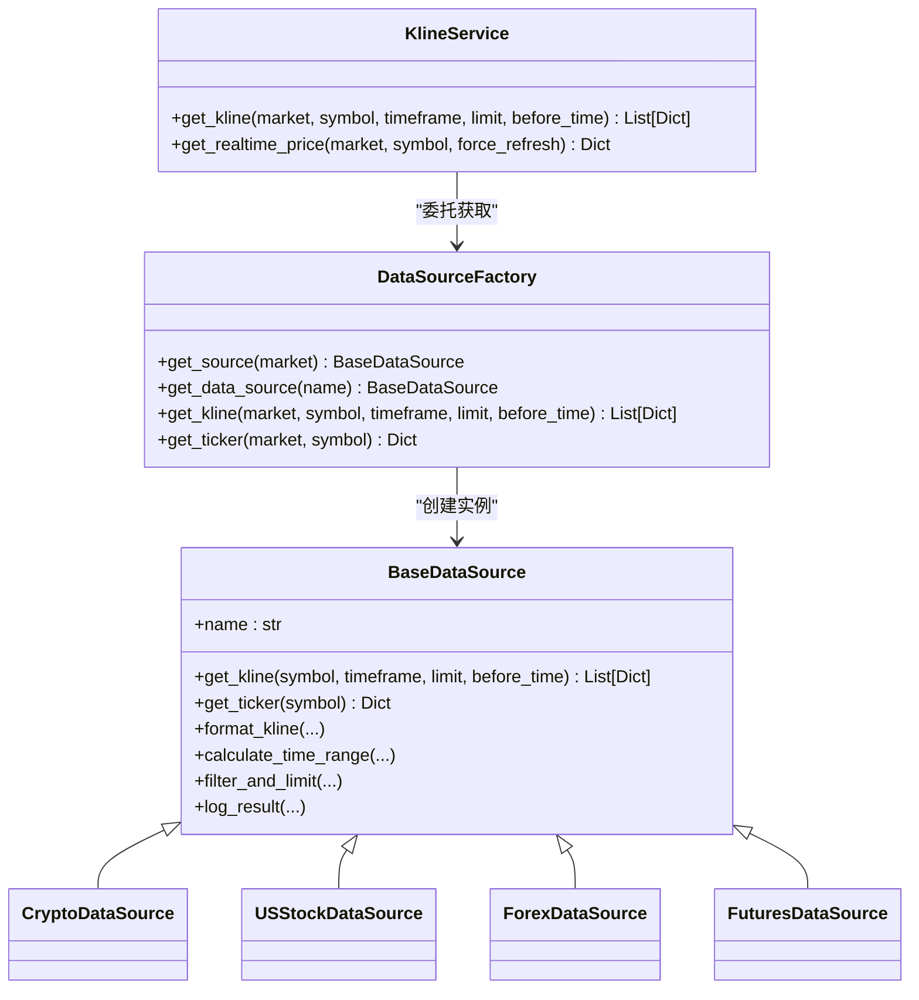
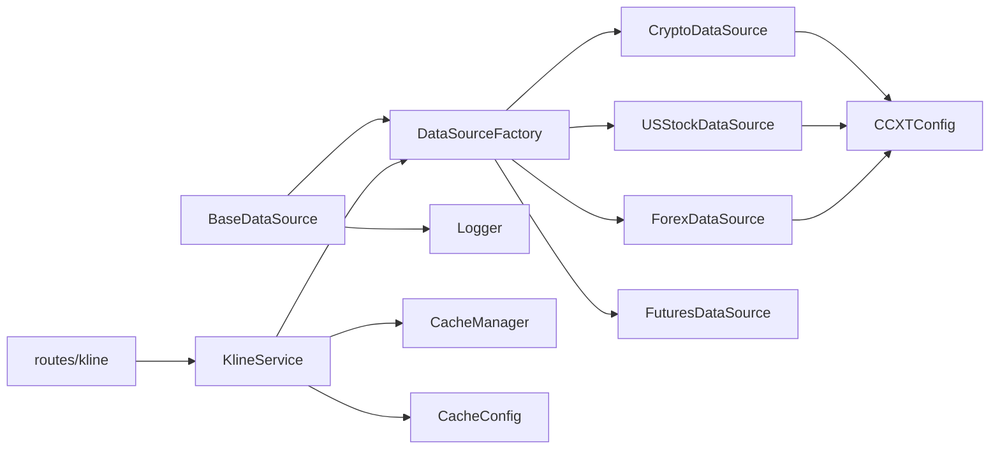

# 数据源基类

<cite>
**本文引用的文件**
- [backend_api_python/app/data_sources/base.py](file://backend_api_python/app/data_sources/base.py)
- [backend_api_python/app/data_sources/crypto.py](file://backend_api_python/app/data_sources/crypto.py)
- [backend_api_python/app/data_sources/us_stock.py](file://backend_api_python/app/data_sources/us_stock.py)
- [backend_api_python/app/data_sources/forex.py](file://backend_api_python/app/data_sources/forex.py)
- [backend_api_python/app/data_sources/factory.py](file://backend_api_python/app/data_sources/factory.py)
- [backend_api_python/app/services/kline.py](file://backend_api_python/app/services/kline.py)
- [backend_api_python/app/routes/kline.py](file://backend_api_python/app/routes/kline.py)
- [backend_api_python/app/utils/logger.py](file://backend_api_python/app/utils/logger.py)
- [backend_api_python/app/data_sources/cache_manager.py](file://backend_api_python/app/data_sources/cache_manager.py)
- [backend_api_python/app/config/data_sources.py](file://backend_api_python/app/config/data_sources.py)
- [backend_api_python/app/config/database.py](file://backend_api_python/app/config/database.py)
</cite>

## 目录
1. [简介](#简介)
2. [项目结构](#项目结构)
3. [核心组件](#核心组件)
4. [架构概览](#架构概览)
5. [详细组件分析](#详细组件分析)
6. [依赖关系分析](#依赖关系分析)
7. [性能考量](#性能考量)
8. [故障排查指南](#故障排查指南)
9. [结论](#结论)
10. [附录](#附录)

## 简介
本文件系统化阐述数据源基类的设计与实现，重点覆盖：
- BaseDataSource 抽象基类的接口规范与设计原则
- get_kline 方法的参数语义、返回格式与数据一致性保障
- K线数据格式规范、时间周期映射常量与过滤限制机制
- get_ticker 可选接口的实现要点与兼容性
- 数据延迟检测与日志记录机制
- 工厂模式与服务层集成方式
- 接口使用示例与最佳实践

## 项目结构
数据源体系围绕“抽象基类 + 多市场具体实现 + 工厂 + 服务层”的分层组织，辅以缓存与日志基础设施。

**图表来源**
- [backend_api_python/app/routes/kline.py:1-200](file://backend_api_python/app/routes/kline.py#L1-L200)
- [backend_api_python/app/services/kline.py:1-191](file://backend_api_python/app/services/kline.py#L1-L191)
- [backend_api_python/app/data_sources/factory.py:1-134](file://backend_api_python/app/data_sources/factory.py#L1-L134)
- [backend_api_python/app/data_sources/base.py:1-171](file://backend_api_python/app/data_sources/base.py#L1-L171)
- [backend_api_python/app/data_sources/crypto.py:1-388](file://backend_api_python/app/data_sources/crypto.py#L1-L388)
- [backend_api_python/app/data_sources/us_stock.py:1-318](file://backend_api_python/app/data_sources/us_stock.py#L1-L318)
- [backend_api_python/app/data_sources/forex.py:1-200](file://backend_api_python/app/data_sources/forex.py#L1-L200)
- [backend_api_python/app/data_sources/factory.py:1-134](file://backend_api_python/app/data_sources/factory.py#L1-L134)
- [backend_api_python/app/data_sources/cache_manager.py:1-233](file://backend_api_python/app/data_sources/cache_manager.py#L1-L233)
- [backend_api_python/app/utils/logger.py:1-63](file://backend_api_python/app/utils/logger.py#L1-L63)
- [backend_api_python/app/config/data_sources.py:1-171](file://backend_api_python/app/config/data_sources.py#L1-L171)
- [backend_api_python/app/config/database.py:1-90](file://backend_api_python/app/config/database.py#L1-L90)

**章节来源**
- [backend_api_python/app/data_sources/base.py:1-171](file://backend_api_python/app/data_sources/base.py#L1-L171)
- [backend_api_python/app/data_sources/factory.py:1-134](file://backend_api_python/app/data_sources/factory.py#L1-L134)
- [backend_api_python/app/services/kline.py:1-191](file://backend_api_python/app/services/kline.py#L1-L191)
- [backend_api_python/app/routes/kline.py:1-200](file://backend_api_python/app/routes/kline.py#L1-L200)
- [backend_api_python/app/utils/logger.py:1-63](file://backend_api_python/app/utils/logger.py#L1-L63)
- [backend_api_python/app/data_sources/cache_manager.py:1-233](file://backend_api_python/app/data_sources/cache_manager.py#L1-L233)
- [backend_api_python/app/config/data_sources.py:1-171](file://backend_api_python/app/config/data_sources.py#L1-L171)
- [backend_api_python/app/config/database.py:1-90](file://backend_api_python/app/config/database.py#L1-L90)

## 核心组件
- BaseDataSource 抽象基类：定义统一接口、提供通用工具方法（格式化、时间范围计算、过滤限制、延迟检测日志）
- DataSourceFactory 工厂：按市场类型创建具体数据源实例，并提供便捷的 get_kline/get_ticker 调用入口
- KlineService 服务：封装缓存、统一入口、降级策略与错误处理
- 具体数据源实现：Crypto/USStock/Forex/Futures 等，遵循基类接口并实现差异化细节

关键职责与关系：
- 基类负责契约与通用能力，具体实现负责适配不同数据源与市场规则
- 工厂屏蔽具体实现差异，服务层通过工厂获取数据
- 缓存与日志贯穿服务层与数据源层，保障性能与可观测性

**章节来源**
- [backend_api_python/app/data_sources/base.py:27-171](file://backend_api_python/app/data_sources/base.py#L27-L171)
- [backend_api_python/app/data_sources/factory.py:13-134](file://backend_api_python/app/data_sources/factory.py#L13-L134)
- [backend_api_python/app/services/kline.py:14-191](file://backend_api_python/app/services/kline.py#L14-L191)

## 架构概览
下图展示从路由到数据源的典型调用链路，以及延迟检测与日志记录的关键节点。

**图表来源**
- [backend_api_python/app/routes/kline.py:17-132](file://backend_api_python/app/routes/kline.py#L17-L132)
- [backend_api_python/app/services/kline.py:21-65](file://backend_api_python/app/services/kline.py#L21-L65)
- [backend_api_python/app/data_sources/factory.py:74-106](file://backend_api_python/app/data_sources/factory.py#L74-L106)
- [backend_api_python/app/data_sources/base.py:32-171](file://backend_api_python/app/data_sources/base.py#L32-L171)
- [backend_api_python/app/data_sources/cache_manager.py:71-128](file://backend_api_python/app/data_sources/cache_manager.py#L71-L128)

## 详细组件分析

### BaseDataSource 抽象基类
- 设计原则
  - 明确契约：get_kline 为强制实现，get_ticker 为可选
  - 提供通用工具：格式化、时间范围估算、数据过滤与限制、延迟检测日志
  - 统一数据模型：K线字段 time/open/high/low/close/volume，数值精度与单位约束
- 关键接口与行为
  - get_kline(symbol, timeframe, limit, before_time=None) -> List[Dict[str, Any]]
  - get_ticker(symbol) -> Dict[str, Any]（默认抛出 NotImplementedError）
  - format_kline(...)：标准化单条K线字段与精度
  - calculate_time_range(timeframe, limit, buffer_ratio=1.2)：估算请求窗口（秒）
  - filter_and_limit(klines, limit, before_time=None)：排序、过滤、截断
  - log_result(symbol, klines, timeframe)：延迟检测与日志输出
- 延迟检测策略
  - 以 UTC 时间比较最新K线时间与当前时间
  - 不同周期阈值不同：分钟/小时级约2倍K线周期，日线约5天，周线取周期×2与21天的最大值
  - 无数据时记录警告

**图表来源**
- [backend_api_python/app/data_sources/base.py:133-171](file://backend_api_python/app/data_sources/base.py#L133-L171)

**章节来源**
- [backend_api_python/app/data_sources/base.py:27-171](file://backend_api_python/app/data_sources/base.py#L27-L171)

### get_kline 接口规范
- 参数
  - symbol：交易对/股票代码（字符串）
  - timeframe：时间周期（字符串，如 1m/5m/15m/30m/1H/4H/1D/1W）
  - limit：请求K线条数（整数）
  - before_time：Unix时间戳（秒），仅返回该时间之前的K线（可选）
- 返回
  - 列表，元素为字典，包含 time/open/high/low/close/volume 字段
  - 字段类型与精度：time 为整数秒；open/high/low/close 为浮点数，保留4位小数；volume 为浮点数，保留2位小数
- 数据一致性
  - 实现应保证返回数据按 time 升序排列
  - 若存在 before_time，应过滤掉之后的数据
  - 若最终数量超过 limit，应取最新 limit 条

**图表来源**
- [backend_api_python/app/data_sources/base.py:32-132](file://backend_api_python/app/data_sources/base.py#L32-L132)
- [backend_api_python/app/data_sources/crypto.py:232-297](file://backend_api_python/app/data_sources/crypto.py#L232-L297)
- [backend_api_python/app/data_sources/us_stock.py:170-218](file://backend_api_python/app/data_sources/us_stock.py#L170-L218)

**章节来源**
- [backend_api_python/app/data_sources/base.py:32-53](file://backend_api_python/app/data_sources/base.py#L32-L53)
- [backend_api_python/app/data_sources/base.py:64-81](file://backend_api_python/app/data_sources/base.py#L64-L81)
- [backend_api_python/app/data_sources/base.py:83-101](file://backend_api_python/app/data_sources/base.py#L83-L101)
- [backend_api_python/app/data_sources/base.py:103-131](file://backend_api_python/app/data_sources/base.py#L103-L131)
- [backend_api_python/app/data_sources/base.py:133-171](file://backend_api_python/app/data_sources/base.py#L133-L171)

### K线数据格式规范
- 字段定义
  - time：整数，Unix 秒（UTC）
  - open/high/low/close：浮点数，精度4位
  - volume：浮点数，精度2位
- 业务约定
  - K线时间连续且升序
  - 严格使用 UTC 时间，避免本地时区偏差导致的误判
  - 体积字段单位与具体市场一致（如加密货币常用交易币计）

**章节来源**
- [backend_api_python/app/data_sources/base.py:49-51](file://backend_api_python/app/data_sources/base.py#L49-L51)
- [backend_api_python/app/data_sources/base.py:74-81](file://backend_api_python/app/data_sources/base.py#L74-L81)
- [backend_api_python/app/data_sources/base.py:146-149](file://backend_api_python/app/data_sources/base.py#L146-L149)

### 时间周期映射常量
- 基类常量 TIMEFRAME_SECONDS：将字符串周期映射为秒数
- 各实现可在自身配置中进行二次映射（如 CCXT/YFinance/Forex 等）
- 周期取值：1m/5m/15m/30m/1H/4H/1D/1W（大小写均可，部分实现会做兼容）

**章节来源**
- [backend_api_python/app/data_sources/base.py:14-24](file://backend_api_python/app/data_sources/base.py#L14-L24)
- [backend_api_python/app/config/data_sources.py:119-129](file://backend_api_python/app/config/data_sources.py#L119-L129)
- [backend_api_python/app/data_sources/us_stock.py:22-32](file://backend_api_python/app/data_sources/us_stock.py#L22-L32)
- [backend_api_python/app/data_sources/forex.py:100-104](file://backend_api_python/app/data_sources/forex.py#L100-L104)

### 数据过滤与限制机制
- 排序：按 time 升序
- 时间过滤：若提供 before_time，则剔除 time >= before_time 的数据
- 数量限制：若总数超过 limit，取最新 limit 条（尾部截断）
- 适用范围：所有具体实现均复用基类的 filter_and_limit

**章节来源**
- [backend_api_python/app/data_sources/base.py:103-131](file://backend_api_python/app/data_sources/base.py#L103-L131)

### get_ticker 可选接口
- 基类默认抛出 NotImplementedError，表示该数据源不提供实时报价
- 具体实现可选择性覆盖，如 Crypto/USStock/Forex/Futures 等
- 返回格式尽量兼容 CCXT fetch_ticker 的形状（至少包含 last 字段），以便上层策略执行器使用

**章节来源**
- [backend_api_python/app/data_sources/base.py:55-62](file://backend_api_python/app/data_sources/base.py#L55-L62)
- [backend_api_python/app/data_sources/crypto.py:176-230](file://backend_api_python/app/data_sources/crypto.py#L176-L230)
- [backend_api_python/app/data_sources/us_stock.py:58-168](file://backend_api_python/app/data_sources/us_stock.py#L58-L168)
- [backend_api_python/app/data_sources/forex.py:120-146](file://backend_api_python/app/data_sources/forex.py#L120-L146)
- [backend_api_python/app/data_sources/futures.py:108-134](file://backend_api_python/app/data_sources/futures.py#L108-L134)

### 数据延迟检测与日志记录机制
- 延迟检测
  - 以 UTC 时间比较最新K线 time 与当前时间
  - 不同周期阈值不同，避免节假日/周末导致的误报
- 日志记录
  - 无数据时记录警告
  - 延迟超过阈值时记录警告，包含最新K线UTC时间、阈值与周期
- 日志配置
  - 全局日志级别、格式与文件轮转
  - 路由层与特定模块的日志级别微调

**章节来源**
- [backend_api_python/app/data_sources/base.py:133-171](file://backend_api_python/app/data_sources/base.py#L133-L171)
- [backend_api_python/app/utils/logger.py:9-48](file://backend_api_python/app/utils/logger.py#L9-L48)

### 工厂模式与服务层集成
- DataSourceFactory
  - get_source/market：按市场类型创建并缓存数据源实例
  - get_kline/get_ticker：提供统一入口，内部调用具体数据源
- KlineService
  - 缓存策略：仅对最新数据（无 before_time）进行缓存，按周期设置 TTL
  - 价格获取：优先 get_ticker，降级使用 1 分钟/日线 K 线
- 路由层
  - /kline：解析查询参数，调用 KlineService
  - /price：获取最新价格

**图表来源**
- [backend_api_python/app/data_sources/base.py:27-171](file://backend_api_python/app/data_sources/base.py#L27-L171)
- [backend_api_python/app/data_sources/factory.py:13-134](file://backend_api_python/app/data_sources/factory.py#L13-L134)
- [backend_api_python/app/services/kline.py:14-191](file://backend_api_python/app/services/kline.py#L14-L191)

**章节来源**
- [backend_api_python/app/data_sources/factory.py:18-71](file://backend_api_python/app/data_sources/factory.py#L18-L71)
- [backend_api_python/app/data_sources/factory.py:74-132](file://backend_api_python/app/data_sources/factory.py#L74-L132)
- [backend_api_python/app/services/kline.py:21-65](file://backend_api_python/app/services/kline.py#L21-L65)
- [backend_api_python/app/services/kline.py:74-191](file://backend_api_python/app/services/kline.py#L74-L191)
- [backend_api_python/app/routes/kline.py:17-132](file://backend_api_python/app/routes/kline.py#L17-L132)

### 具体实现示例

#### 加密货币数据源（Crypto）
- 特点
  - 使用 CCXT 获取 OHLCV，支持分页拉取完整窗口
  - 符号规范化与交易所适配（如 Coinbase/OKX/Binance 等）
  - get_ticker 优先 CCXT fetch_ticker，失败时回退
- 关键流程
  - 符号归一化 -> CCXT 时间周期映射 -> fetch_ohlcv 分页 -> format_kline -> filter_and_limit -> log_result

**章节来源**
- [backend_api_python/app/data_sources/crypto.py:16-49](file://backend_api_python/app/data_sources/crypto.py#L16-L49)
- [backend_api_python/app/data_sources/crypto.py:70-174](file://backend_api_python/app/data_sources/crypto.py#L70-L174)
- [backend_api_python/app/data_sources/crypto.py:232-297](file://backend_api_python/app/data_sources/crypto.py#L232-L297)
- [backend_api_python/app/data_sources/crypto.py:299-387](file://backend_api_python/app/data_sources/crypto.py#L299-L387)

#### 美股数据源（USStock）
- 特点
  - 优先 Finnhub（实时），降级 yfinance fast_info/info/history
  - get_ticker 返回包含 last/change/changePercent/high/low/open/previousClose 的字典
  - get_kline 使用 yfinance + finnhub（日线），并提供按周期估算的日期范围
- 关键流程
  - get_ticker：Finnhub -> yfinance fast_info -> yfinance info -> 1 分钟 K 线近似
  - get_kline：yfinance -> finnhub 日线 -> format_kline -> filter_and_limit -> log_result

**章节来源**
- [backend_api_python/app/data_sources/us_stock.py:17-57](file://backend_api_python/app/data_sources/us_stock.py#L17-L57)
- [backend_api_python/app/data_sources/us_stock.py:58-168](file://backend_api_python/app/data_sources/us_stock.py#L58-L168)
- [backend_api_python/app/data_sources/us_stock.py:170-218](file://backend_api_python/app/data_sources/us_stock.py#L170-L218)
- [backend_api_python/app/data_sources/us_stock.py:220-317](file://backend_api_python/app/data_sources/us_stock.py#L220-L317)

#### 外汇数据源（Forex）
- 特点
  - 三级降级：Twelve Data -> Tiingo -> yfinance
  - 提供独立的实时报价缓存（60秒TTL）
  - 符号映射与时间周期映射
- 关键流程
  - get_ticker：Twelve Data -> Tiingo -> yfinance（逐级尝试）
  - get_kline：根据可用 API 与周期映射获取数据

**章节来源**
- [backend_api_python/app/data_sources/forex.py:95-146](file://backend_api_python/app/data_sources/forex.py#L95-L146)
- [backend_api_python/app/data_sources/forex.py:148-200](file://backend_api_python/app/data_sources/forex.py#L148-L200)

#### 期货数据源（Futures）
- 特点
  - 传统期货：Twelve Data -> yfinance -> Tiingo（贵金属）
  - 加密货币期货：CCXT（Binance Futures）
  - 符号与周期映射区分两类来源
- 关键流程
  - get_ticker：根据符号类型选择路径（传统/加密）
  - get_kline：按来源调用对应 API

**章节来源**
- [backend_api_python/app/data_sources/futures.py:60-134](file://backend_api_python/app/data_sources/futures.py#L60-L134)
- [backend_api_python/app/data_sources/futures.py:136-200](file://backend_api_python/app/data_sources/futures.py#L136-L200)

## 依赖关系分析
- 组件耦合
  - 基类与具体实现：强契约弱实现，通过继承扩展
  - 工厂与实现：动态导入与懒加载，降低启动成本
  - 服务层与工厂：松耦合，便于替换与扩展
- 外部依赖
  - CCXT：加密货币数据源
  - yfinance/Finntub：美股数据源
  - requests/第三方API：外汇与期货数据源
- 循环依赖
  - 未发现循环导入；工厂按需导入具体实现

**图表来源**
- [backend_api_python/app/data_sources/base.py:1-12](file://backend_api_python/app/data_sources/base.py#L1-L12)
- [backend_api_python/app/data_sources/factory.py:50-71](file://backend_api_python/app/data_sources/factory.py#L50-L71)
- [backend_api_python/app/services/kline.py:17-19](file://backend_api_python/app/services/kline.py#L17-L19)
- [backend_api_python/app/routes/kline.py:8-14](file://backend_api_python/app/routes/kline.py#L8-L14)
- [backend_api_python/app/data_sources/crypto.py:9-13](file://backend_api_python/app/data_sources/crypto.py#L9-L13)
- [backend_api_python/app/data_sources/us_stock.py:10-12](file://backend_api_python/app/data_sources/us_stock.py#L10-L12)
- [backend_api_python/app/data_sources/forex.py:13-15](file://backend_api_python/app/data_sources/forex.py#L13-L15)
- [backend_api_python/app/config/database.py:62-85](file://backend_api_python/app/config/database.py#L62-L85)

**章节来源**
- [backend_api_python/app/data_sources/base.py:1-12](file://backend_api_python/app/data_sources/base.py#L1-L12)
- [backend_api_python/app/data_sources/factory.py:50-71](file://backend_api_python/app/data_sources/factory.py#L50-L71)
- [backend_api_python/app/services/kline.py:17-19](file://backend_api_python/app/services/kline.py#L17-L19)
- [backend_api_python/app/config/database.py:62-85](file://backend_api_python/app/config/database.py#L62-L85)

## 性能考量
- 缓存策略
  - K线缓存：按周期设置 TTL，仅对最新数据缓存，避免历史数据污染
  - 实时报价缓存：短 TTL，提升高频查询性能
- 请求窗口估算
  - calculate_time_range 提供缓冲系数，减少边界误差
- 分页与降级
  - 加密货币数据源支持分页拉取，避免单次请求上限
  - 多级降级（如美股）提升可用性与稳定性
- 日志与监控
  - 延迟检测与异常日志，辅助定位性能瓶颈

**章节来源**
- [backend_api_python/app/services/kline.py:21-65](file://backend_api_python/app/services/kline.py#L21-L65)
- [backend_api_python/app/data_sources/cache_manager.py:55-128](file://backend_api_python/app/data_sources/cache_manager.py#L55-L128)
- [backend_api_python/app/data_sources/crypto.py:299-387](file://backend_api_python/app/data_sources/crypto.py#L299-L387)
- [backend_api_python/app/data_sources/us_stock.py:170-218](file://backend_api_python/app/data_sources/us_stock.py#L170-L218)

## 故障排查指南
- 常见问题
  - 无数据：检查 symbol 是否正确、before_time 是否合理、API Key 是否配置
  - 延迟告警：确认数据源更新频率、节假日/周末影响、阈值设置
  - 价格获取失败：确认 get_ticker 是否实现、降级路径是否生效
- 定位手段
  - 查看路由层与服务层日志，关注错误堆栈
  - 使用工厂与服务层的错误捕获与降级逻辑
  - 核对缓存状态与 TTL，必要时强制刷新
- 建议
  - 在 before_time 场景下，适当增大 limit 的缓冲比例
  - 对高频查询启用缓存，避免触发限流
  - 对于免费 API，优先使用降级路径或缩短查询窗口

**章节来源**
- [backend_api_python/app/routes/kline.py:76-132](file://backend_api_python/app/routes/kline.py#L76-L132)
- [backend_api_python/app/services/kline.py:115-191](file://backend_api_python/app/services/kline.py#L115-L191)
- [backend_api_python/app/data_sources/base.py:133-171](file://backend_api_python/app/data_sources/base.py#L133-L171)

## 结论
BaseDataSource 通过清晰的接口契约与通用工具方法，为多市场数据源提供了统一抽象。结合工厂与服务层，实现了可扩展、可缓存、可观测的数据获取体系。get_kline 的参数与返回格式、过滤与限制机制、延迟检测与日志记录，共同保障了数据质量与用户体验。在实际使用中，建议遵循接口规范、合理设置周期与窗口、充分利用缓存与降级策略，并通过日志与监控持续优化性能与稳定性。

## 附录

### 接口使用示例与最佳实践
- 获取K线
  - 使用 KlineService.get_kline 或 DataSourceFactory.get_kline
  - 合理设置 timeframe 与 limit，必要时传入 before_time
  - 注意返回数据按时间升序排列，且字段精度与单位符合规范
- 获取实时价格
  - 优先调用 KlineService.get_realtime_price，内部自动降级
  - 若数据源未实现 get_ticker，将回退到 K 线或日线
- 最佳实践
  - 为高频查询开启缓存，合理设置 TTL
  - 在节假日/周末场景下，适当放宽日线/周线阈值
  - 对免费 API 使用降级路径，避免阻塞主流程
  - 通过日志与延迟检测持续监控数据质量

**章节来源**
- [backend_api_python/app/services/kline.py:21-65](file://backend_api_python/app/services/kline.py#L21-L65)
- [backend_api_python/app/services/kline.py:74-191](file://backend_api_python/app/services/kline.py#L74-L191)
- [backend_api_python/app/data_sources/factory.py:74-132](file://backend_api_python/app/data_sources/factory.py#L74-L132)