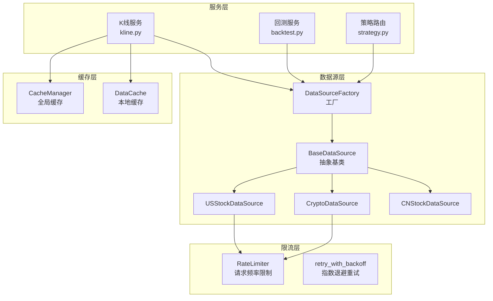
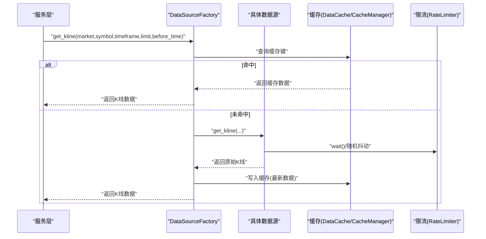
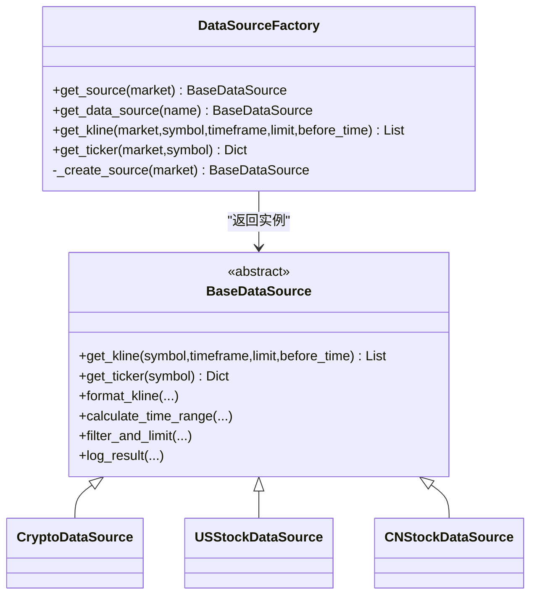
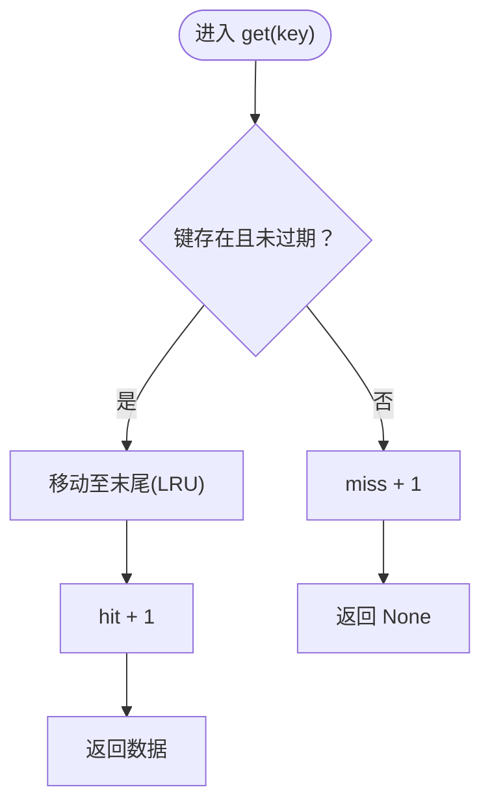
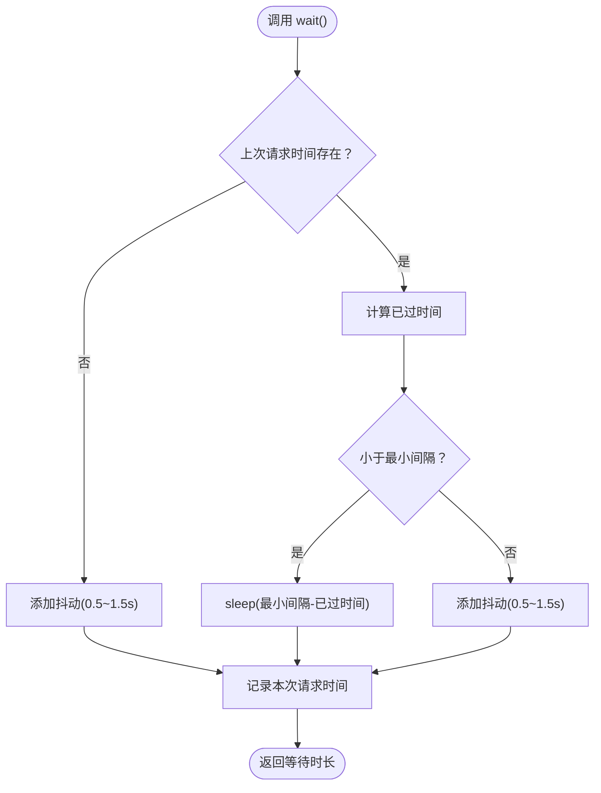
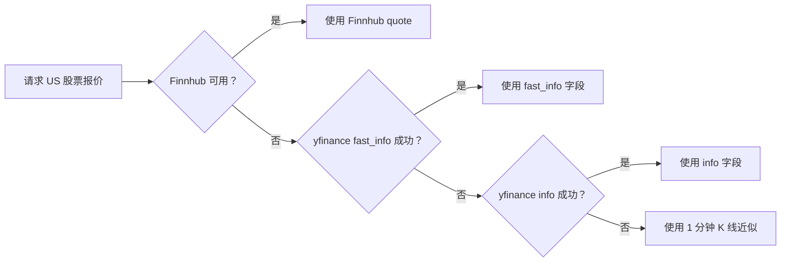
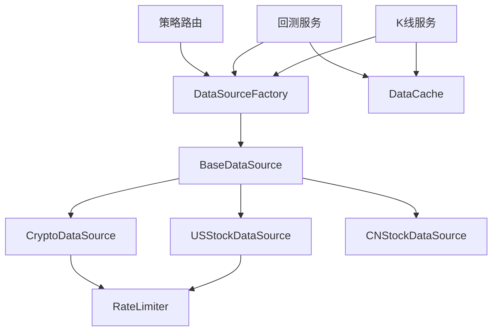

# 数据源工厂

<cite>
**本文引用的文件**
- [factory.py](file://backend_api_python/app/data_sources/factory.py)
- [base.py](file://backend_api_python/app/data_sources/base.py)
- [cache_manager.py](file://backend_api_python/app/data_sources/cache_manager.py)
- [rate_limiter.py](file://backend_api_python/app/data_sources/rate_limiter.py)
- [crypto.py](file://backend_api_python/app/data_sources/crypto.py)
- [cn_stock.py](file://backend_api_python/app/data_sources/cn_stock.py)
- [us_stock.py](file://backend_api_python/app/data_sources/us_stock.py)
- [cache.py](file://backend_api_python/app/utils/cache.py)
- [data_sources.py](file://backend_api_python/app/config/data_sources.py)
- [kline.py](file://backend_api_python/app/services/kline.py)
- [backtest.py](file://backend_api_python/app/services/backtest.py)
- [strategy.py](file://backend_api_python/app/routes/strategy.py)
</cite>

## 目录
1. [简介](#简介)
2. [项目结构](#项目结构)
3. [核心组件](#核心组件)
4. [架构总览](#架构总览)
5. [详细组件分析](#详细组件分析)
6. [依赖关系分析](#依赖关系分析)
7. [性能考量](#性能考量)
8. [故障排查指南](#故障排查指南)
9. [结论](#结论)
10. [附录](#附录)

## 简介
本文件系统性地文档化了 QuantDinger 后端中的“数据源工厂与管理系统”。重点涵盖：
- DataSourceFactory 的工厂模式实现：如何识别数据源类型、实例化与生命周期管理。
- CacheManager 缓存管理机制：TTL 过期、LRU 淘汰、按数据类型分区、线程安全与统计。
- RateLimiter 速率限制器：请求频率控制、随机抖动、指数退避重试、User-Agent 轮换与随机休眠。
- 数据源选择策略与性能优化建议：基于市场类型、API 限流、缓存策略与错误降级路径。

## 项目结构
该模块位于后端 Python 应用的 app/data_sources 目录，围绕工厂模式组织各类数据源实现，并通过统一的基类接口对外提供 K 线与实时报价能力。同时，配合服务层的缓存与限流策略，形成稳定高效的市场数据获取链路。

图表来源
- [factory.py:13-134](file://backend_api_python/app/data_sources/factory.py#L13-L134)
- [base.py:27-171](file://backend_api_python/app/data_sources/base.py#L27-L171)
- [crypto.py:16-388](file://backend_api_python/app/data_sources/crypto.py#L16-L388)
- [us_stock.py:17-318](file://backend_api_python/app/data_sources/us_stock.py#L17-L318)
- [cn_stock.py:30-100](file://backend_api_python/app/data_sources/cn_stock.py#L30-L100)
- [cache_manager.py:44-233](file://backend_api_python/app/data_sources/cache_manager.py#L44-L233)
- [cache.py:49-129](file://backend_api_python/app/utils/cache.py#L49-L129)
- [rate_limiter.py:109-273](file://backend_api_python/app/data_sources/rate_limiter.py#L109-L273)
- [kline.py:40-191](file://backend_api_python/app/services/kline.py#L40-L191)
- [backtest.py:1725-1854](file://backend_api_python/app/services/backtest.py#L1725-L1854)
- [strategy.py:1372-1386](file://backend_api_python/app/routes/strategy.py#L1372-L1386)

章节来源
- [factory.py:13-134](file://backend_api_python/app/data_sources/factory.py#L13-L134)
- [base.py:27-171](file://backend_api_python/app/data_sources/base.py#L27-L171)

## 核心组件
- DataSourceFactory：集中管理数据源实例，提供按市场类型获取数据源、便捷的 K 线与实时报价接口，并内置错误处理与日志记录。
- BaseDataSource：定义统一接口（K 线与可选的实时报价），提供格式化、时间范围计算、过滤限制与延迟检测等通用能力。
- DataCache：本地内存缓存实现，支持 TTL、LRU、线程安全、统计信息输出与过期清理。
- RateLimiter：请求频率限制器，结合随机抖动与指数退避重试，降低被限流/封禁风险。
- CacheManager：全局缓存管理器，支持本地内存与 Redis 两种后端，按配置自动切换。

章节来源
- [factory.py:13-134](file://backend_api_python/app/data_sources/factory.py#L13-L134)
- [base.py:27-171](file://backend_api_python/app/data_sources/base.py#L27-L171)
- [cache_manager.py:44-233](file://backend_api_python/app/data_sources/cache_manager.py#L44-L233)
- [rate_limiter.py:109-273](file://backend_api_python/app/data_sources/rate_limiter.py#L109-L273)
- [cache.py:49-129](file://backend_api_python/app/utils/cache.py#L49-L129)

## 架构总览
数据获取流程自上而下分为三层：
- 服务层：K 线服务、回测服务、策略路由等调用工厂接口获取数据。
- 工厂层：DataSourceFactory 根据市场类型选择具体数据源，封装统一的 K 线与实时报价入口。
- 数据源层：各市场数据源（加密货币、美股、A 股等）实现具体抓取逻辑，部分数据源内部集成限流与降级策略。
- 缓存层：服务层与工厂层可选择性使用 DataCache 或 CacheManager 提升性能与稳定性。
- 限流层：RateLimiter 与 retry_with_backoff 保障请求节奏与容错。

图表来源
- [kline.py:40-65](file://backend_api_python/app/services/kline.py#L40-L65)
- [factory.py:74-106](file://backend_api_python/app/data_sources/factory.py#L74-L106)
- [cache_manager.py:71-128](file://backend_api_python/app/data_sources/cache_manager.py#L71-L128)
- [rate_limiter.py:135-159](file://backend_api_python/app/data_sources/rate_limiter.py#L135-L159)

## 详细组件分析

### DataSourceFactory 工厂模式
- 类型识别与实例化
  - 支持的市场类型：Crypto、CNStock、HKStock、USStock、Forex、Futures。
  - 内部维护静态字典缓存已创建实例，避免重复初始化。
  - 提供向后兼容的名称映射，将历史调用风格统一到新的市场类型。
- 统一入口
  - get_kline：封装排序与异常处理，保证返回数据有序且健壮。
  - get_ticker：对未实现的市场给出警告并返回默认结构，避免上游崩溃。
- 生命周期管理
  - 单例式缓存实例，进程内共享，减少资源占用。
  - 异常捕获与日志记录，便于问题定位与监控。

图表来源
- [factory.py:13-134](file://backend_api_python/app/data_sources/factory.py#L13-L134)
- [base.py:27-171](file://backend_api_python/app/data_sources/base.py#L27-L171)
- [crypto.py:16-388](file://backend_api_python/app/data_sources/crypto.py#L16-L388)
- [us_stock.py:17-318](file://backend_api_python/app/data_sources/us_stock.py#L17-L318)
- [cn_stock.py:30-100](file://backend_api_python/app/data_sources/cn_stock.py#L30-L100)

章节来源
- [factory.py:13-134](file://backend_api_python/app/data_sources/factory.py#L13-L134)
- [base.py:27-171](file://backend_api_python/app/data_sources/base.py#L27-L171)

### CacheManager 缓存管理机制
- 设计目标
  - TTL 过期：每个条目带存活时间，到期自动失效。
  - LRU 淘汰：达到最大容量时，最久未使用的条目优先被淘汰。
  - 按数据类型分区：实时行情、K 线、股票信息分别配置独立缓存实例。
  - 线程安全：使用可重入锁保护并发读写。
- 关键能力
  - get/set/delete/clear/cleanup_expired：基础 CRUD 与清理。
  - stats：命中/未命中统计与命中率计算。
  - 键生成：K 线缓存键包含 symbol、timeframe、limit、before_time，确保查询参数变化时区分缓存。
- 全局缓存实例
  - realtime：默认 TTL 20 分钟，最大 6000 条。
  - kline：默认 TTL 5 分钟，最大 500 个键。
  - stock_info：默认 TTL 24 小时，最大 6000 条。

图表来源
- [cache_manager.py:71-98](file://backend_api_python/app/data_sources/cache_manager.py#L71-L98)

章节来源
- [cache_manager.py:44-233](file://backend_api_python/app/data_sources/cache_manager.py#L44-L233)

### RateLimiter 速率限制器
- 请求频率控制
  - RateLimiter：确保两次请求之间至少间隔 min_interval 秒，并叠加随机抖动，模拟人类行为。
- 指数退避重试
  - retry_with_backoff：对指定异常进行最多 max_attempts 次重试，延迟按指数增长，上限不超过 max_delay，并加入 ±20% 抖动。
- 防封禁策略
  - 随机 User-Agent 轮换与随机休眠，降低被识别为自动化脚本的概率。
- 全局限流器实例
  - 东方财富、腾讯财经、AkShare 等接口分别配置不同 min_interval 与抖动范围，以匹配其限流强度。

图表来源
- [rate_limiter.py:135-159](file://backend_api_python/app/data_sources/rate_limiter.py#L135-L159)

章节来源
- [rate_limiter.py:109-273](file://backend_api_python/app/data_sources/rate_limiter.py#L109-L273)

### 数据源实现与选择策略
- 加密货币（Crypto）
  - 基于 CCXT，动态加载交易所类，支持符号规范化与多报价货币识别。
  - 支持历史数据分页拉取，避免单次请求上限导致的数据截断。
  - 未实现 get_ticker 时，返回默认结构以兼容上层调用。
- 美股（USStock）
  - 优先使用 Finnhub（实时），降级使用 yfinance 的 fast_info/info 或 1 分钟 K 线。
  - 日线数据在 yfinance 失败时可回退到 Finnhub。
- A 股（CNStock）
  - 多层降级：TwelveData（付费）→ 腾讯日/周线 → yfinance → AkShare。
  - 根据是否配置 API Key 决定可用层级，保证在无 Key 场景下仍可获取分钟/小时数据。

图表来源
- [us_stock.py:58-168](file://backend_api_python/app/data_sources/us_stock.py#L58-L168)

章节来源
- [crypto.py:16-388](file://backend_api_python/app/data_sources/crypto.py#L16-L388)
- [us_stock.py:17-318](file://backend_api_python/app/data_sources/us_stock.py#L17-L318)
- [cn_stock.py:30-100](file://backend_api_python/app/data_sources/cn_stock.py#L30-L100)

## 依赖关系分析
- 工厂与数据源
  - DataSourceFactory 通过条件导入具体数据源类，实现运行时解耦。
  - BaseDataSource 为所有数据源提供统一接口与通用工具方法。
- 缓存与服务
  - 服务层（kline.py）在获取 K 线时优先查询缓存，未命中再调用工厂；实时价格获取也采用多级降级与短时缓存。
  - 回测服务（backtest.py）使用专用 K 线缓存，按查询键缓存 DataFrame，提升回测性能。
- 限流与数据源
  - 数据源内部可直接使用 RateLimiter 与 retry_with_backoff，或依赖 CCXT 的内置限流（如启用）。
- 配置与环境
  - 配置项通过元类方式从环境变量与附加配置加载，影响超时、重试、时间周期映射与代理设置等。

图表来源
- [factory.py:49-71](file://backend_api_python/app/data_sources/factory.py#L49-L71)
- [base.py:27-171](file://backend_api_python/app/data_sources/base.py#L27-L171)
- [kline.py:40-65](file://backend_api_python/app/services/kline.py#L40-L65)
- [backtest.py:1725-1740](file://backend_api_python/app/services/backtest.py#L1725-L1740)
- [strategy.py:1372-1386](file://backend_api_python/app/routes/strategy.py#L1372-L1386)
- [rate_limiter.py:109-273](file://backend_api_python/app/data_sources/rate_limiter.py#L109-L273)

章节来源
- [data_sources.py:101-171](file://backend_api_python/app/config/data_sources.py#L101-L171)

## 性能考量
- 缓存策略
  - 服务层对最新 K 线与实时价格进行短 TTL 缓存，显著降低上游 API 压力。
  - 回测服务对历史 K 线进行 DataFrame 级缓存，避免重复下载相同窗口数据。
  - DataCache 的 LRU 与容量限制确保内存占用可控。
- 请求节流
  - RateLimiter 的最小间隔与抖动组合，既能满足限流要求，又能模拟人类行为，降低封禁概率。
  - retry_with_backoff 的指数退避与抖动，提高网络波动下的成功率。
- 数据源选择
  - 优先使用实时性强的源（如 Finnhub），在不可用时快速降级到 yfinance 或 K 线近似。
  - 加密货币数据源支持分页拉取，避免单次请求上限导致的数据缺失。
- 配置优化
  - 通过配置文件与环境变量调整超时、重试次数与时间周期映射，适配不同网络与业务场景。

[本节为通用性能讨论，无需特定文件引用]

## 故障排查指南
- 工厂调用异常
  - 若 get_kline 返回空列表，检查市场类型是否受支持、符号是否正确、before_time 是否合理。
  - get_ticker 未实现时会返回默认结构，确认上层是否正确处理。
- 缓存问题
  - 缓存未命中：确认缓存键生成是否一致（含 timeframe、limit、before_time）。
  - 缓存过期：检查 default_ttl 与实际使用场景，必要时缩短 TTL。
  - LRU 淘汰：增大 max_size 或调整使用策略，避免关键数据被频繁淘汰。
- 限流与封禁
  - 若出现频繁 429/403，请适当增加 min_interval 或启用随机抖动范围。
  - 对不稳定源启用 retry_with_backoff，观察指数退避是否生效。
- 数据源差异
  - 加密货币符号规范化失败：检查 COMMON_QUOTES 与交易所支持情况。
  - 美股报价降级：确认 Finnhub API Key 配置与可用性，或依赖 yfinance。
  - A 股多源降级：根据是否配置 API Key 决定可用层级，逐步排查各源可用性。

章节来源
- [factory.py:95-132](file://backend_api_python/app/data_sources/factory.py#L95-L132)
- [cache_manager.py:146-158](file://backend_api_python/app/data_sources/cache_manager.py#L146-L158)
- [rate_limiter.py:170-231](file://backend_api_python/app/data_sources/rate_limiter.py#L170-L231)
- [crypto.py:176-230](file://backend_api_python/app/data_sources/crypto.py#L176-L230)
- [us_stock.py:58-168](file://backend_api_python/app/data_sources/us_stock.py#L58-L168)
- [cn_stock.py:64-99](file://backend_api_python/app/data_sources/cn_stock.py#L64-L99)

## 结论
本系统通过工厂模式实现了数据源的统一管理与扩展，结合缓存与限流策略，在保证稳定性的同时提升了性能与用户体验。建议在生产环境中：
- 明确各市场的限流策略与缓存 TTL，定期评估命中率与内存占用。
- 对关键数据源配置冗余与降级路径，确保在上游异常时仍能提供基本服务。
- 根据业务场景调整 RateLimiter 的最小间隔与抖动范围，平衡吞吐与合规性。

[本节为总结性内容，无需特定文件引用]

## 附录
- 常用调用路径
  - 服务层获取 K 线：kline.py → DataSourceFactory.get_kline → 具体数据源 → 缓存。
  - 回测服务获取 K 线：backtest.py → DataSourceFactory.get_kline → DataFrame 缓存。
  - 策略路由获取实时报价：strategy.py → DataSourceFactory.get_source("Crypto").get_ticker。
- 配置要点
  - CCXT、YFinance、Finnhub、AkShare 等配置项可通过环境变量或附加配置文件覆盖。
  - 缓存后端可按需启用 Redis，否则使用本地内存缓存。

[本节为补充信息，无需特定文件引用]