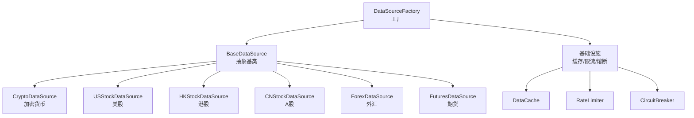
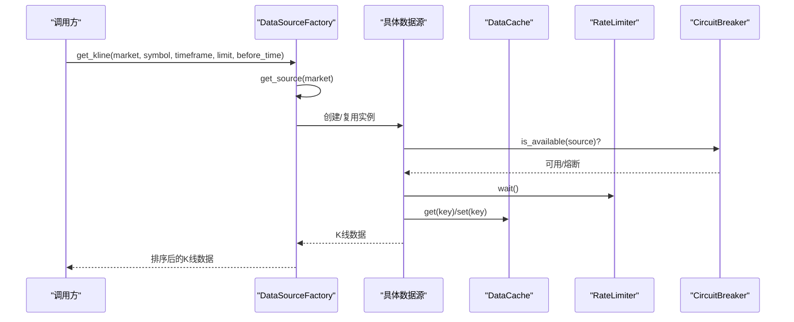
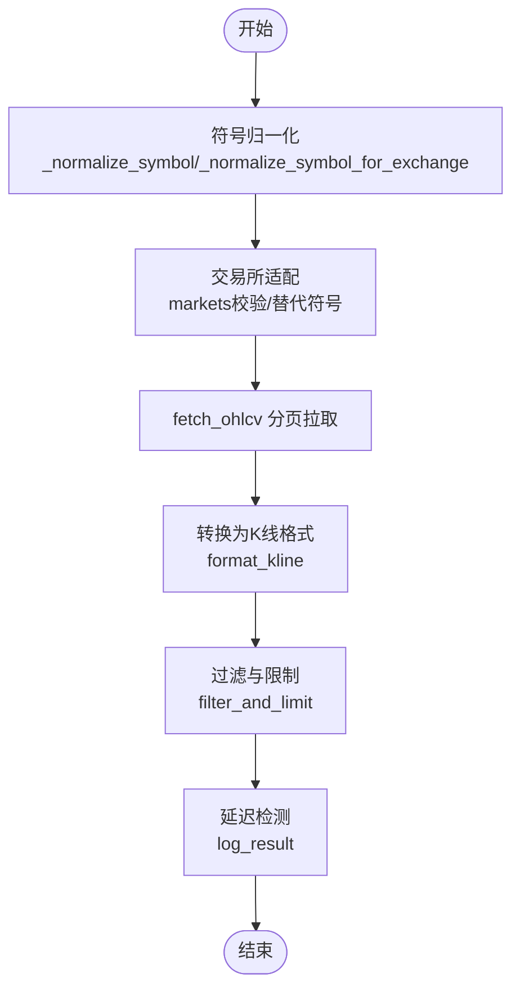
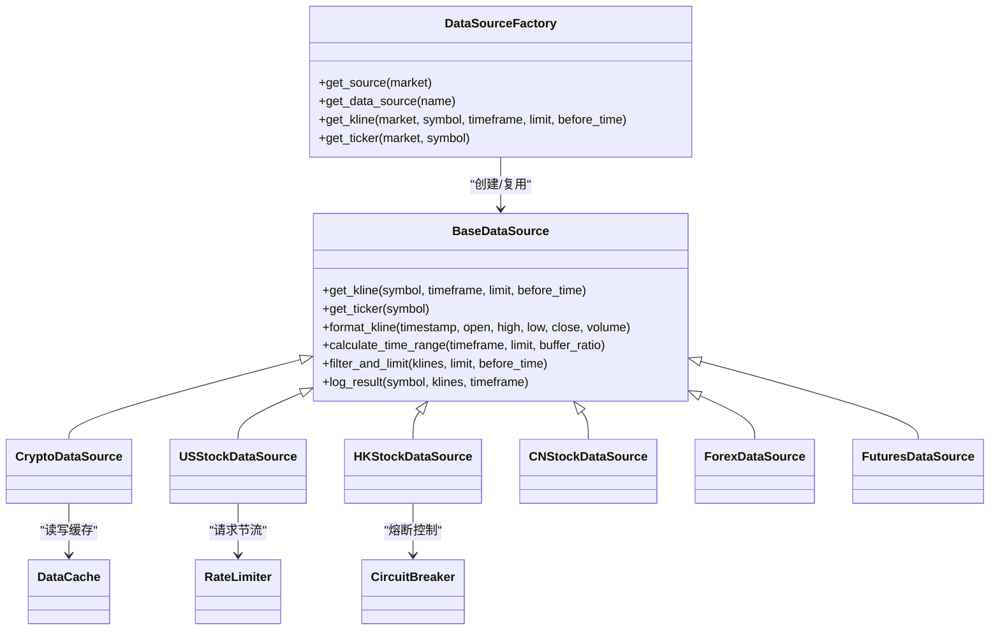

# 数据源适配器

<cite>
**本文档引用的文件**
- [factory.py](file://backend_api_python/app/data_sources/factory.py)
- [base.py](file://backend_api_python/app/data_sources/base.py)
- [__init__.py](file://backend_api_python/app/data_sources/__init__.py)
- [crypto.py](file://backend_api_python/app/data_sources/crypto.py)
- [forex.py](file://backend_api_python/app/data_sources/forex.py)
- [futures.py](file://backend_api_python/app/data_sources/futures.py)
- [cn_stock.py](file://backend_api_python/app/data_sources/cn_stock.py)
- [us_stock.py](file://backend_api_python/app/data_sources/us_stock.py)
- [hk_stock.py](file://backend_api_python/app/data_sources/hk_stock.py)
- [cache_manager.py](file://backend_api_python/app/data_sources/cache_manager.py)
- [rate_limiter.py](file://backend_api_python/app/data_sources/rate_limiter.py)
- [circuit_breaker.py](file://backend_api_python/app/data_sources/circuit_breaker.py)
- [data_sources.py](file://backend_api_python/app/config/data_sources.py)
- [tencent.py](file://backend_api_python/app/data_sources/tencent.py)
- [asia_stock_kline.py](file://backend_api_python/app/data_sources/asia_stock_kline.py)
</cite>

## 目录
1. [简介](#简介)
2. [项目结构](#项目结构)
3. [核心组件](#核心组件)
4. [架构总览](#架构总览)
5. [详细组件分析](#详细组件分析)
6. [依赖关系分析](#依赖关系分析)
7. [性能考虑](#性能考虑)
8. [故障排查指南](#故障排查指南)
9. [结论](#结论)
10. [附录](#附录)

## 简介
本文件系统性阐述 QuantDinger 后端数据源适配器体系，重点围绕 DataSourceFactory 工厂模式设计原理，详解各类市场数据源（加密货币、股票、外汇、期货等）的实现差异与共同特性，并提供新数据源集成指南、配置管理与扩展开发最佳实践。文档旨在帮助开发者快速理解与扩展数据源层，确保在多市场、多数据源环境下稳定、高性能地获取金融数据。

## 项目结构
数据源适配器位于 backend_api_python/app/data_sources 目录，采用“工厂 + 抽象基类 + 具体实现 + 基础设施”的分层组织：
- 工厂层：DataSourceFactory 负责按市场类型创建与复用数据源实例
- 抽象层：BaseDataSource 定义统一接口与通用能力（格式化、过滤、时间范围计算、延迟检测）
- 实现层：各市场具体数据源（Crypto、USStock、HKStock、CNStock、Forex、Futures 等）
- 基础设施层：缓存(DataCache)、限流(RateLimiter)、熔断(CircuitBreaker)、代理与重试策略

图表来源
- [factory.py:13-72](file://backend_api_python/app/data_sources/factory.py#L13-L72)
- [base.py:27-53](file://backend_api_python/app/data_sources/base.py#L27-L53)
- [cache_manager.py:44-174](file://backend_api_python/app/data_sources/cache_manager.py#L44-L174)
- [rate_limiter.py:109-164](file://backend_api_python/app/data_sources/rate_limiter.py#L109-L164)
- [circuit_breaker.py:31-147](file://backend_api_python/app/data_sources/circuit_breaker.py#L31-L147)

章节来源
- [factory.py:13-72](file://backend_api_python/app/data_sources/factory.py#L13-L72)
- [__init__.py:10-44](file://backend_api_python/app/data_sources/__init__.py#L10-L44)

## 核心组件
- 工厂模式（DataSourceFactory）
  - 提供 get_source(market) 与 get_data_source(name) 两种入口，内部缓存已创建实例，避免重复初始化
  - 支持便捷方法 get_kline 与 get_ticker，统一封装错误处理与日志记录
- 抽象基类（BaseDataSource）
  - 统一接口：get_kline(symbol, timeframe, limit, before_time)、可选 get_ticker(symbol)
  - 通用能力：格式化单条K线、计算时间范围、过滤与限制数据、延迟检测
- 基础设施
  - 缓存：DataCache（TTL/LRU/线程安全）、全局实时/日线/股票信息缓存
  - 限流：RateLimiter（最小间隔+抖动）、随机UA、指数退避重试
  - 熔断：CircuitBreaker（Closed/Open/HalfOpen状态机）

章节来源
- [factory.py:13-134](file://backend_api_python/app/data_sources/factory.py#L13-L134)
- [base.py:27-171](file://backend_api_python/app/data_sources/base.py#L27-L171)
- [cache_manager.py:44-233](file://backend_api_python/app/data_sources/cache_manager.py#L44-L233)
- [rate_limiter.py:109-273](file://backend_api_python/app/data_sources/rate_limiter.py#L109-L273)
- [circuit_breaker.py:31-175](file://backend_api_python/app/data_sources/circuit_breaker.py#L31-L175)

## 架构总览
工厂根据市场类型动态创建对应数据源实例，具体实现遵循统一抽象接口，基础设施贯穿于请求生命周期，保障稳定性与性能。

图表来源
- [factory.py:74-106](file://backend_api_python/app/data_sources/factory.py#L74-L106)
- [cache_manager.py:71-128](file://backend_api_python/app/data_sources/cache_manager.py#L71-L128)
- [rate_limiter.py:135-159](file://backend_api_python/app/data_sources/rate_limiter.py#L135-L159)
- [circuit_breaker.py:67-100](file://backend_api_python/app/data_sources/circuit_breaker.py#L67-L100)

## 详细组件分析

### 工厂模式与实例管理（DataSourceFactory）
- 设计要点
  - 单例式缓存：同一市场类型仅创建一个实例，降低资源占用
  - 名称兼容：get_data_source(name) 对历史调用路径保持向后兼容
  - 便捷方法：get_kline 与 get_ticker 统一错误处理与日志
- 错误处理
  - get_ticker 未实现时返回默认结构并记录警告
  - 其他异常捕获并返回空数据，避免影响上层流程

章节来源
- [factory.py:13-134](file://backend_api_python/app/data_sources/factory.py#L13-L134)

### 抽象基类接口规范（BaseDataSource）
- 必选接口
  - get_kline(symbol, timeframe, limit, before_time)：返回标准化K线列表
- 可选接口
  - get_ticker(symbol)：返回实时报价（默认抛出 NotImplmentedError）
- 通用能力
  - format_kline：统一四舍五入精度
  - calculate_time_range：基于时间周期估算请求窗口
  - filter_and_limit：按时间与数量过滤
  - log_result：基于时间窗阈值检测数据延迟

章节来源
- [base.py:27-171](file://backend_api_python/app/data_sources/base.py#L27-L171)

### 加密货币数据源（CryptoDataSource）
- 特性
  - 基于 CCXT，支持多交易所（默认可配置），动态加载 markets
  - 符号归一化与交易所适配：处理 BTCUSDT、BTC/USDT、BTC/USDT:USDT 等格式
  - 分页拉取 OHLCV，支持 before_time 历史回溯
  - get_ticker 通过 CCXT fetch_ticker 获取，失败时尝试替代符号
- 错误与降级
  - 符号无效时记录警告并返回默认值
  - 备用 fetch_ohlcv_fallback 保证在限流或异常时仍可获取部分数据

图表来源
- [crypto.py:70-298](file://backend_api_python/app/data_sources/crypto.py#L70-L298)

章节来源
- [crypto.py:16-388](file://backend_api_python/app/data_sources/crypto.py#L16-L388)

### 外汇数据源（ForexDataSource）
- 特性
  - 三级降级：Twelve Data → Tiingo → yfinance
  - 支持常用货币对映射与时间周期映射
  - 实时报价与K线均具备多源回退
- 降级策略
  - get_ticker：依次尝试 Twelve Data → Tiingo → yfinance
  - get_kline：优先 Twelve Data，其次 Tiingo（含周/月聚合），最后 yfinance
- 缓存与限流
  - ticker 结果短期缓存，减少重复请求
  - Tiingo 429 限流时返回缓存或降级处理

章节来源
- [forex.py:95-690](file://backend_api_python/app/data_sources/forex.py#L95-L690)

### 期货数据源（FuturesDataSource）
- 特性
  - 传统期货：Twelve Data → yfinance → Tiingo（贵金属）
  - 加密货币期货：CCXT（默认 Binance Futures）
- 选择逻辑
  - 通过符号特征判断：传统合约（如 GC、CL）走传统路径；否则走 CCXT
- 传统期货降级
  - get_ticker：Twelve Data → yfinance → Tiingo
  - get_kline：Twelve Data → yfinance → Tiingo（周/月聚合）

章节来源
- [futures.py:60-465](file://backend_api_python/app/data_sources/futures.py#L60-L465)

### 美股数据源（USStockDataSource）
- 特性
  - 优先 Finnhub（实时），降级 yfinance fast_info/info/history
  - 周期映射与天数估算，避免越界请求
- 降级链路
  - get_ticker：Finnhub → yfinance fast_info → yfinance info → 1 分钟历史近似
  - get_kline：yfinance → finnhub 日线（特定条件）

章节来源
- [us_stock.py:17-318](file://backend_api_python/app/data_sources/us_stock.py#L17-L318)

### A股/H股数据源（CNStockDataSource/HKStockDataSource）
- 特性
  - 多层降级：Twelve Data → 腾讯日/周 → yfinance → AkShare
  - 腾讯接口免密，适合国内用户稳定回退
- 统一流程
  - normalize_chart_timeframe → 多源拉取 → filter_and_limit

章节来源
- [cn_stock.py:30-100](file://backend_api_python/app/data_sources/cn_stock.py#L30-L100)
- [hk_stock.py:30-100](file://backend_api_python/app/data_sources/hk_stock.py#L30-L100)
- [asia_stock_kline.py:169-200](file://backend_api_python/app/data_sources/asia_stock_kline.py#L169-L200)
- [tencent.py:24-200](file://backend_api_python/app/data_sources/tencent.py#L24-L200)

### 基础设施组件
- 缓存（DataCache）
  - TTL 过期、LRU 淘汰、线程安全、命中统计
  - 提供实时/日线/股票信息三类全局缓存
- 限流（RateLimiter）
  - 最小间隔+抖动、随机 UA、指数退避重试
  - 针对不同接口提供专用限流器
- 熔断（CircuitBreaker）
  - Closed/Open/HalfOpen 状态机，冷却时间与半开尝试次数可配置

章节来源
- [cache_manager.py:44-233](file://backend_api_python/app/data_sources/cache_manager.py#L44-L233)
- [rate_limiter.py:109-273](file://backend_api_python/app/data_sources/rate_limiter.py#L109-L273)
- [circuit_breaker.py:31-175](file://backend_api_python/app/data_sources/circuit_breaker.py#L31-L175)

## 依赖关系分析
- 工厂与实现
  - 工厂通过字符串映射创建具体数据源，避免上层硬编码
- 抽象与实现
  - 所有实现均继承 BaseDataSource，确保接口一致性
- 基础设施协作
  - 数据源在请求前经限流器等待，熔断器决定是否跳过，缓存提供读写

图表来源
- [factory.py:13-72](file://backend_api_python/app/data_sources/factory.py#L13-L72)
- [base.py:27-171](file://backend_api_python/app/data_sources/base.py#L27-L171)
- [cache_manager.py:44-174](file://backend_api_python/app/data_sources/cache_manager.py#L44-L174)
- [rate_limiter.py:109-164](file://backend_api_python/app/data_sources/rate_limiter.py#L109-L164)
- [circuit_breaker.py:31-100](file://backend_api_python/app/data_sources/circuit_breaker.py#L31-L100)

## 性能考虑
- 请求节流与抖动
  - 使用 RateLimiter 控制最小间隔与随机抖动，降低被封禁风险
- 缓存策略
  - DataCache 提供 TTL 与 LRU，减少重复请求；针对高频实时数据设置较短 TTL
- 熔断机制
  - CircuitBreaker 在连续失败后进入熔断，冷却后半开试探，避免雪崩效应
- 数据过滤与限制
  - filter_and_limit 与 calculate_time_range 减少无效数据传输与处理

## 故障排查指南
- 常见问题定位
  - get_ticker 未实现：工厂层会记录警告并返回默认结构，确认目标市场是否支持实时报价
  - 符号无效：加密货币数据源会尝试替代符号，若仍失败，检查交易所 markets 与符号格式
  - 限流/封禁：查看限流器日志与熔断器状态，必要时调整冷却时间或更换代理
- 日志与监控
  - log_result 会基于时间窗阈值输出延迟警告，便于发现数据源异常
  - 缓存命中统计可用于评估缓存效果

章节来源
- [factory.py:108-133](file://backend_api_python/app/data_sources/factory.py#L108-L133)
- [base.py:133-171](file://backend_api_python/app/data_sources/base.py#L133-L171)
- [circuit_breaker.py:67-137](file://backend_api_python/app/data_sources/circuit_breaker.py#L67-L137)

## 结论
数据源适配器系统通过工厂模式与抽象基类实现了高内聚、低耦合的多市场数据接入框架。结合缓存、限流与熔断等基础设施，系统在稳定性与性能方面具备良好表现。新增数据源时，建议遵循统一接口、合理设计降级链路，并充分利用现有基础设施以提升可靠性。

## 附录

### 新数据源集成指南
- 实现步骤
  - 继承 BaseDataSource，实现 get_kline 与可选 get_ticker
  - 在工厂映射中注册新市场类型
  - 如需缓存/限流/熔断，按需引入基础设施
- 接口一致性
  - 严格遵守 get_kline 返回格式与时序要求
  - 使用 format_kline 与 filter_and_limit 保证输出一致
- 降级与容错
  - 设计多源回退策略，避免单点故障
  - 记录详细日志，便于问题追踪

章节来源
- [factory.py:49-71](file://backend_api_python/app/data_sources/factory.py#L49-L71)
- [base.py:32-132](file://backend_api_python/app/data_sources/base.py#L32-L132)

### 配置管理与最佳实践
- 配置项
  - 数据源超时、重试次数、回退系数等通过元类配置加载
  - CCXT 默认交易所、超时、代理等集中管理
- 最佳实践
  - 为不同数据源设置差异化 TTL 与限流策略
  - 在高并发场景下启用缓存与熔断，避免上游压力过大
  - 对历史回溯场景使用 calculate_time_range 估算窗口，避免越界

章节来源
- [data_sources.py:26-171](file://backend_api_python/app/config/data_sources.py#L26-L171)
- [rate_limiter.py:170-232](file://backend_api_python/app/data_sources/rate_limiter.py#L170-L232)
- [cache_manager.py:181-233](file://backend_api_python/app/data_sources/cache_manager.py#L181-L233)