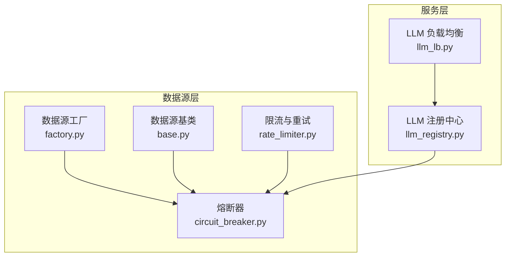
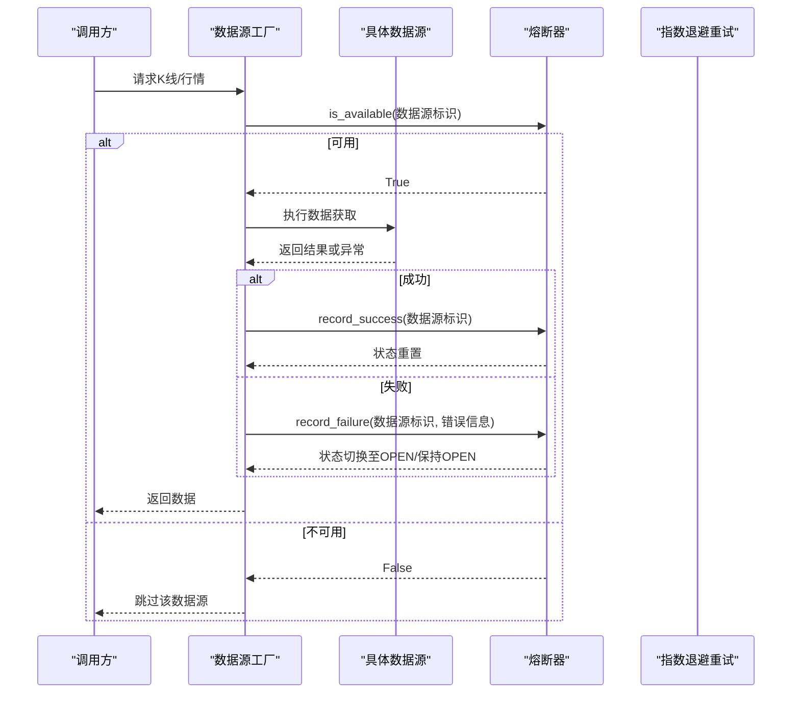
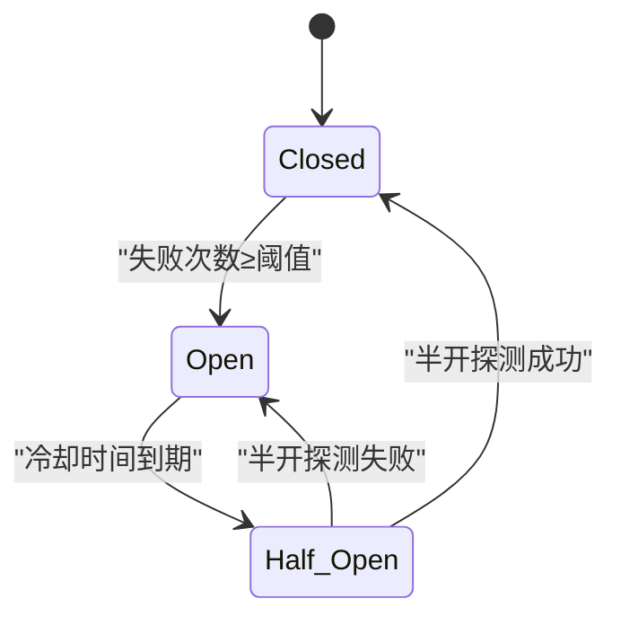
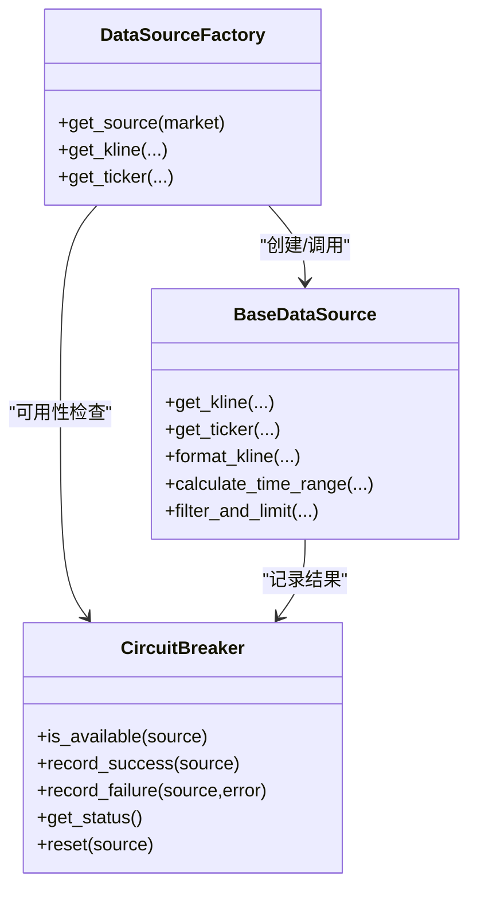
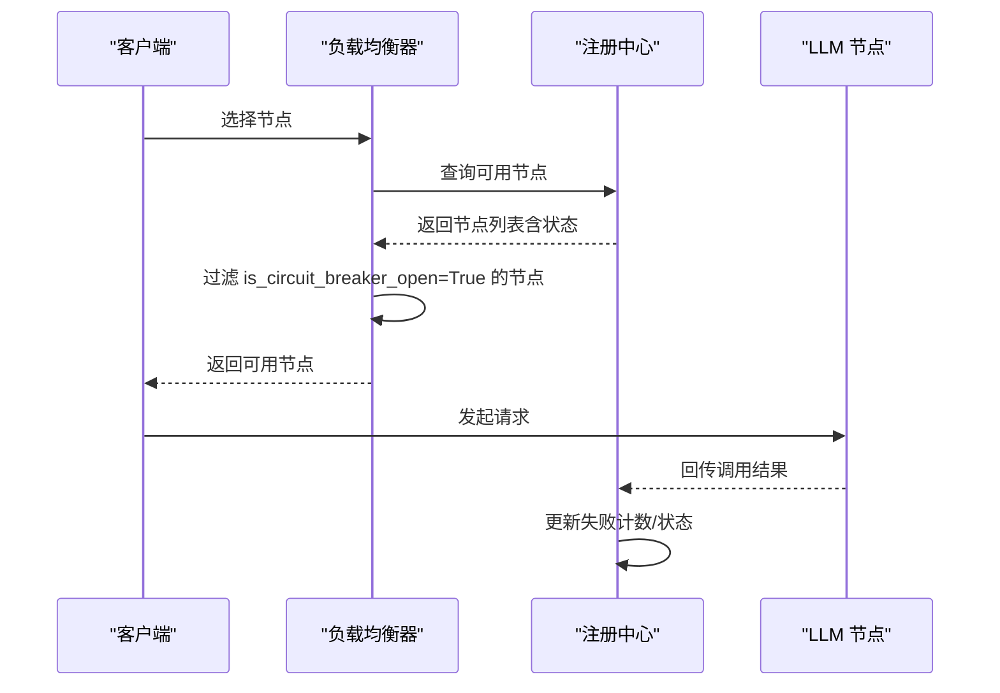
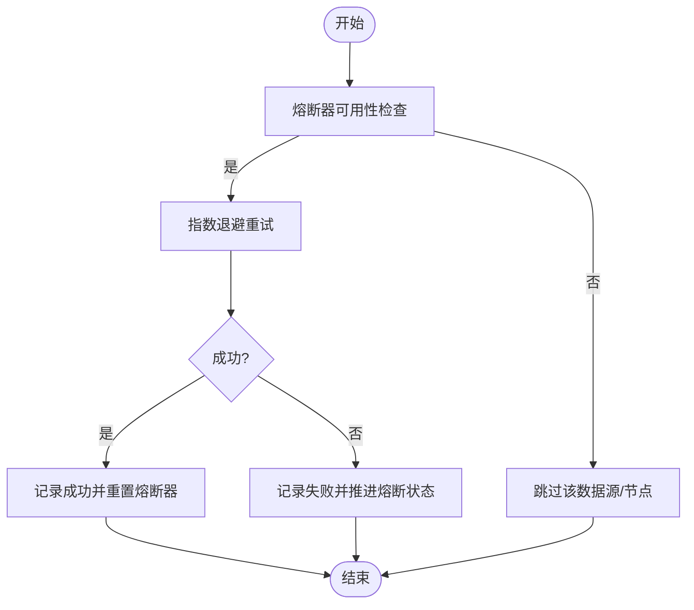
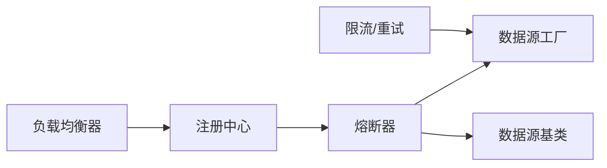

# 熔断器系统

<cite>
**本文引用的文件**
- [circuit_breaker.py](file://backend_api_python/app/data_sources/circuit_breaker.py)
- [__init__.py](file://backend_api_python/app/data_sources/__init__.py)
- [factory.py](file://backend_api_python/app/data_sources/factory.py)
- [base.py](file://backend_api_python/app/data_sources/base.py)
- [rate_limiter.py](file://backend_api_python/app/data_sources/rate_limiter.py)
- [llm_lb.py](file://backend_api_python/app/services/llm_lb.py)
- [llm_registry.py](file://backend_api_python/app/services/llm_registry.py)
</cite>

## 目录
1. [简介](#简介)
2. [项目结构](#项目结构)
3. [核心组件](#核心组件)
4. [架构总览](#架构总览)
5. [详细组件分析](#详细组件分析)
6. [依赖关系分析](#依赖关系分析)
7. [性能考量](#性能考量)
8. [故障排查指南](#故障排查指南)
9. [结论](#结论)
10. [附录](#附录)

## 简介
本文件系统性阐述 QuantDinger 后端中“熔断器”在数据源访问中的设计与实现，涵盖故障检测、自动降级、恢复机制、状态转换逻辑、失败率阈值与半开探测策略，并结合重试策略与高并发场景下的性能影响与优化建议，给出配置最佳实践与监控指标建议。

## 项目结构
熔断器相关代码集中在数据源模块，同时在 LLM 负载均衡与注册中心中也有配套使用，形成“服务层-数据源层”的协同防护。

图示来源
- [circuit_breaker.py:1-174](file://backend_api_python/app/data_sources/circuit_breaker.py#L1-L174)
- [factory.py:1-134](file://backend_api_python/app/data_sources/factory.py#L1-L134)
- [base.py:1-171](file://backend_api_python/app/data_sources/base.py#L1-L171)
- [rate_limiter.py:1-273](file://backend_api_python/app/data_sources/rate_limiter.py#L1-L273)
- [llm_lb.py:1-169](file://backend_api_python/app/services/llm_lb.py#L1-L169)
- [llm_registry.py:1-169](file://backend_api_python/app/services/llm_registry.py#L1-L169)

章节来源
- [circuit_breaker.py:1-174](file://backend_api_python/app/data_sources/circuit_breaker.py#L1-L174)
- [factory.py:1-134](file://backend_api_python/app/data_sources/factory.py#L1-L134)
- [base.py:1-171](file://backend_api_python/app/data_sources/base.py#L1-L171)
- [rate_limiter.py:1-273](file://backend_api_python/app/data_sources/rate_limiter.py#L1-L273)
- [llm_lb.py:1-169](file://backend_api_python/app/services/llm_lb.py#L1-L169)
- [llm_registry.py:1-169](file://backend_api_python/app/services/llm_registry.py#L1-L169)

## 核心组件
- 熔断器状态机与控制器：负责状态判定、失败计数、冷却时间与半开探测。
- 数据源层集成：通过工厂与基类在数据获取流程中进行可用性检查与结果记录。
- 服务层联动：LLM 负载均衡与注册中心基于熔断状态进行节点筛选与状态同步。
- 限流与重试：与熔断器共同构成“防封禁+弹性恢复”的组合拳。

章节来源
- [circuit_breaker.py:24-174](file://backend_api_python/app/data_sources/circuit_breaker.py#L24-L174)
- [llm_lb.py:7-169](file://backend_api_python/app/services/llm_lb.py#L7-L169)
- [llm_registry.py:11-169](file://backend_api_python/app/services/llm_registry.py#L11-L169)

## 架构总览
熔断器在数据源访问路径中的位置如下：

图示来源
- [factory.py:74-106](file://backend_api_python/app/data_sources/factory.py#L74-L106)
- [circuit_breaker.py:67-137](file://backend_api_python/app/data_sources/circuit_breaker.py#L67-L137)

## 详细组件分析

### 熔断器状态机与控制逻辑
- 状态枚举：Closed（正常）、Open（熔断）、Half-Open（半开试探）。
- 关键参数：
  - 失败阈值：连续失败达到阈值进入熔断。
  - 冷却时间：熔断持续时间，到期后进入半开。
  - 半开最大探测次数：半开状态下仅允许有限次探测。
- 核心方法：
  - is_available：根据当前状态与冷却时间决定是否放行。
  - record_success：半开成功则完全恢复，否则保持Closed。
  - record_failure：半开失败则继续熔断，达到阈值则进入熔断。
  - get_status/reset：导出状态与重置能力。

图示来源
- [circuit_breaker.py:24-137](file://backend_api_python/app/data_sources/circuit_breaker.py#L24-L137)

章节来源
- [circuit_breaker.py:31-158](file://backend_api_python/app/data_sources/circuit_breaker.py#L31-L158)

### 数据源层集成
- 工厂模式：统一入口获取数据源，便于在调用前做可用性检查。
- 基类接口：定义标准数据获取接口，便于在各实现中插入熔断器记录逻辑。
- 熔断器实例：提供全局实时行情熔断器，适配高频失败场景。

图示来源
- [factory.py:13-134](file://backend_api_python/app/data_sources/factory.py#L13-L134)
- [base.py:27-171](file://backend_api_python/app/data_sources/base.py#L27-L171)
- [circuit_breaker.py:31-158](file://backend_api_python/app/data_sources/circuit_breaker.py#L31-L158)

章节来源
- [factory.py:74-106](file://backend_api_python/app/data_sources/factory.py#L74-L106)
- [base.py:27-171](file://backend_api_python/app/data_sources/base.py#L27-L171)
- [circuit_breaker.py:164-174](file://backend_api_python/app/data_sources/circuit_breaker.py#L164-L174)

### 服务层联动（LLM 负载均衡与注册中心）
- 节点维度熔断：负载均衡器在选择节点时过滤掉处于熔断状态的节点。
- 注册中心维度熔断：根据失败次数将节点状态标记为熔断，LB 层据此过滤。
- 两者协同：LB 层优先剔除熔断节点，注册中心负责失败计数与状态持久化。

图示来源
- [llm_lb.py:43-56](file://backend_api_python/app/services/llm_lb.py#L43-L56)
- [llm_registry.py:57-58](file://backend_api_python/app/services/llm_registry.py#L57-L58)
- [llm_registry.py:153-158](file://backend_api_python/app/services/llm_registry.py#L153-L158)

章节来源
- [llm_lb.py:7-169](file://backend_api_python/app/services/llm_lb.py#L7-L169)
- [llm_registry.py:11-169](file://backend_api_python/app/services/llm_registry.py#L11-L169)

### 与重试策略的配合
- 熔断器侧重“短时拒绝+冷却恢复”，重试侧重“多次尝试降低瞬时失败概率”。
- 推荐顺序：先熔断器检查，再指数退避重试，最后降级或切换数据源。
- 注意：熔断器在Open状态下直接拒绝，避免无效重试造成资源浪费。

图示来源
- [circuit_breaker.py:67-137](file://backend_api_python/app/data_sources/circuit_breaker.py#L67-L137)
- [rate_limiter.py:170-231](file://backend_api_python/app/data_sources/rate_limiter.py#L170-L231)

章节来源
- [rate_limiter.py:170-231](file://backend_api_python/app/data_sources/rate_limiter.py#L170-L231)

## 依赖关系分析
- 数据源层：工厂依赖基类与熔断器；熔断器独立但被工厂与基类调用。
- 服务层：负载均衡器依赖注册中心；注册中心更新节点状态供 LB 过滤。
- 限流与重试：与熔断器并行工作，共同提升稳定性。

图示来源
- [circuit_breaker.py:1-174](file://backend_api_python/app/data_sources/circuit_breaker.py#L1-L174)
- [factory.py:1-134](file://backend_api_python/app/data_sources/factory.py#L1-L134)
- [base.py:1-171](file://backend_api_python/app/data_sources/base.py#L1-L171)
- [rate_limiter.py:1-273](file://backend_api_python/app/data_sources/rate_limiter.py#L1-L273)
- [llm_lb.py:1-169](file://backend_api_python/app/services/llm_lb.py#L1-L169)
- [llm_registry.py:1-169](file://backend_api_python/app/services/llm_registry.py#L1-L169)

章节来源
- [__init__.py:10-26](file://backend_api_python/app/data_sources/__init__.py#L10-L26)

## 性能考量
- 并发安全：熔断器内部状态为内存字典，适合单进程模型。若部署为多进程或多实例，需引入分布式存储以共享状态。
- 热点数据源：对高频失败的数据源启用更短冷却时间与更低阈值，快速止损；对稳定数据源可适当放宽。
- 半开探测：半开最大探测次数建议为1，避免放大请求压力。
- 与限流/重试配合：在高并发下，先用熔断器阻断，再用限流/重试缓解瞬时峰值，防止雪崩。
- 监控与告警：结合 get_status 输出关键指标，建立阈值告警与人工干预通道。

## 故障排查指南
- 症状：某数据源长时间不可用
  - 检查熔断器状态：调用 get_status 查看失败次数与最后错误。
  - 确认冷却时间是否已到：Open 状态需等待冷却到期才会进入半开。
  - 手动重置：必要时调用 reset 清空状态。
- 症状：半开后仍失败
  - 确认半开最大探测次数为1，避免重复放大请求。
  - 检查外部依赖（网络/第三方API）是否恢复。
- 症状：LLM 节点全部不可用
  - 检查注册中心失败计数与状态字段，确认是否存在批量熔断。
  - 负载均衡器是否正确过滤了 is_circuit_breaker_open=True 的节点。

章节来源
- [circuit_breaker.py:138-158](file://backend_api_python/app/data_sources/circuit_breaker.py#L138-L158)
- [llm_registry.py:153-158](file://backend_api_python/app/services/llm_registry.py#L153-L158)
- [llm_lb.py:43-56](file://backend_api_python/app/services/llm_lb.py#L43-L56)

## 结论
熔断器在本项目中承担了“快速止损+可控恢复”的关键角色，与限流、重试、缓存等策略协同，有效提升了数据源访问的稳定性与韧性。通过合理的阈值与冷却时间配置、半开探测策略以及完善的监控告警，可在高并发场景下显著降低雪崩风险并缩短恢复时间。

## 附录

### 配置最佳实践
- 失败阈值：对高频波动数据源可设较低阈值（如2），对稳定数据源可设较高阈值（如5~10）。
- 冷却时间：建议从几分钟起步，结合SLA与恢复速度动态调整。
- 半开探测：默认1次即可，避免对下游造成额外压力。
- 与重试配合：先熔断器，再指数退避重试，最后降级或切换数据源。
- 多实例部署：将状态持久化至共享存储，确保各实例对同一数据源的熔断状态一致。

### 监控指标建议
- 熔断器状态分布：Closed/Open/Half-Open 比例。
- 失败次数与最后错误：定位故障类型与热点。
- 冷却剩余时间：评估恢复进度。
- LLM 节点熔断比例：衡量整体可用性。