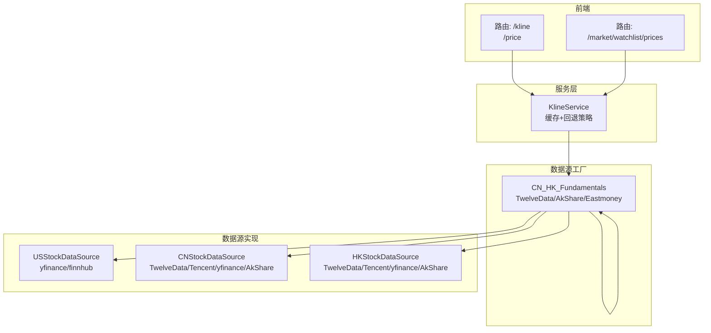
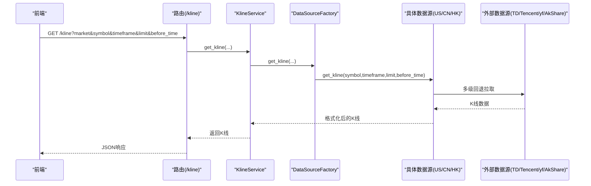
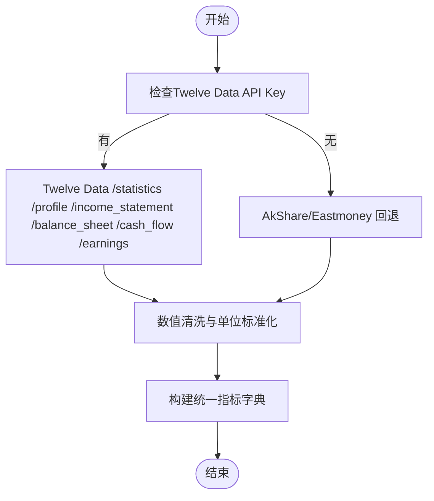
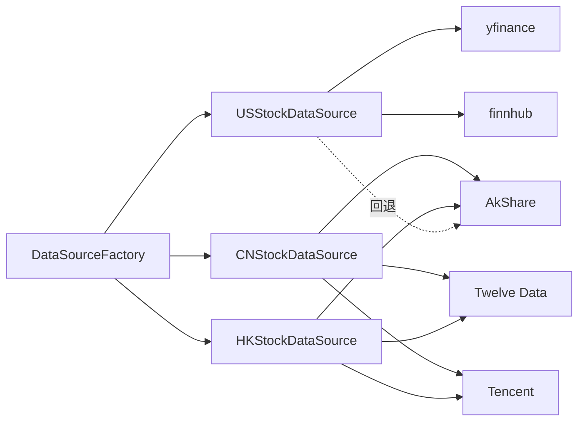

# 股票数据源

<cite>
**本文引用的文件**
- [backend_api_python/app/data_sources/base.py](file://backend_api_python/app/data_sources/base.py)
- [backend_api_python/app/data_sources/cn_stock.py](file://backend_api_python/app/data_sources/cn_stock.py)
- [backend_api_python/app/data_sources/hk_stock.py](file://backend_api_python/app/data_sources/hk_stock.py)
- [backend_api_python/app/data_sources/us_stock.py](file://backend_api_python/app/data_sources/us_stock.py)
- [backend_api_python/app/data_sources/cn_hk_fundamentals.py](file://backend_api_python/app/data_sources/cn_hk_fundamentals.py)
- [backend_api_python/app/data_sources/asia_stock_kline.py](file://backend_api_python/app/data_sources/asia_stock_kline.py)
- [backend_api_python/app/data_sources/tencent.py](file://backend_api_python/app/data_sources/tencent.py)
- [backend_api_python/app/data_sources/factory.py](file://backend_api_python/app/data_sources/factory.py)
- [backend_api_python/app/config/data_sources.py](file://backend_api_python/app/config/data_sources.py)
- [backend_api_python/app/services/kline.py](file://backend_api_python/app/services/kline.py)
- [backend_api_python/app/routes/kline.py](file://backend_api_python/app/routes/kline.py)
- [backend_api_python/app/routes/market.py](file://backend_api_python/app/routes/market.py)
</cite>

## 目录
1. [简介](#简介)
2. [项目结构](#项目结构)
3. [核心组件](#核心组件)
4. [架构总览](#架构总览)
5. [详细组件分析](#详细组件分析)
6. [依赖分析](#依赖分析)
7. [性能考量](#性能考量)
8. [故障排查指南](#故障排查指南)
9. [结论](#结论)
10. [附录](#附录)

## 简介
本文件面向多市场股票数据源的实现与使用，重点覆盖：
- 美国股票、港股、中国A股三类数据源的实现差异与适配策略
- 交易时间、休市规则、数据延迟处理等特性
- CN_HK_Fundamentals基础数据源的财务数据获取与处理机制
- 各市场数据格式差异、时区处理、分红送股等特殊事件处理
- 多市场数据统一化的实现方案与最佳实践

## 项目结构
后端采用模块化数据源设计，通过工厂模式按市场类型选择具体数据源，并在服务层统一缓存与调用路径。前端通过路由暴露统一接口，服务层再委派至数据源工厂。

图表来源
- [backend_api_python/app/routes/kline.py:17-132](file://backend_api_python/app/routes/kline.py#L17-L132)
- [backend_api_python/app/routes/market.py:642-752](file://backend_api_python/app/routes/market.py#L642-L752)
- [backend_api_python/app/services/kline.py:21-65](file://backend_api_python/app/services/kline.py#L21-L65)
- [backend_api_python/app/data_sources/factory.py:13-71](file://backend_api_python/app/data_sources/factory.py#L13-L71)

章节来源
- [backend_api_python/app/routes/kline.py:17-132](file://backend_api_python/app/routes/kline.py#L17-L132)
- [backend_api_python/app/routes/market.py:642-752](file://backend_api_python/app/routes/market.py#L642-L752)
- [backend_api_python/app/services/kline.py:21-65](file://backend_api_python/app/services/kline.py#L21-L65)
- [backend_api_python/app/data_sources/factory.py:13-71](file://backend_api_python/app/data_sources/factory.py#L13-L71)

## 核心组件
- 基类与通用能力
  - 统一接口与数据格式：提供K线获取、实时报价、格式化与过滤、时间范围计算、延迟检测等通用能力
  - 时间周期映射与缓冲：内置周期到秒数的映射，用于估算请求窗口与限制返回条数
  - 延迟检测：基于UTC时间比较，区分分钟/小时级与日/周级阈值，避免本地时区误差
- 工厂模式
  - 按市场类型创建具体数据源实例，统一对外接口
- 服务层
  - K线服务：统一缓存策略、回退策略（ticker→1分钟K线→日线）
  - 路由层：提供查询参数解析、错误处理与提示

章节来源
- [backend_api_python/app/data_sources/base.py:27-171](file://backend_api_python/app/data_sources/base.py#L27-L171)
- [backend_api_python/app/data_sources/factory.py:13-71](file://backend_api_python/app/data_sources/factory.py#L13-L71)
- [backend_api_python/app/services/kline.py:14-191](file://backend_api_python/app/services/kline.py#L14-L191)

## 架构总览
多市场数据源采用“主源+多级回退”的策略，确保在任一上游失败时仍可获得可用数据。美股以yfinance为主，辅以finnhub；A股/H股以TwelveData为主，辅以Tencent/yfinance/AkShare。财务数据由CN_HK_Fundamentals统一汇聚TwelveData与AkShare/Eastmoney。

图表来源
- [backend_api_python/app/routes/kline.py:17-132](file://backend_api_python/app/routes/kline.py#L17-L132)
- [backend_api_python/app/services/kline.py:21-65](file://backend_api_python/app/services/kline.py#L21-L65)
- [backend_api_python/app/data_sources/factory.py:74-105](file://backend_api_python/app/data_sources/factory.py#L74-L105)

## 详细组件分析

### 美股数据源（USStockDataSource）
- 主要数据源
  - yfinance：支持多周期，按天数窗口拉取，注意结束日期开闭区间差异
  - finnhub：日线增强，适合免费额度有限时的日线回退
- 实时报价回退策略
  - 优先：finnhub quote
  - 其次：yfinance fast_info
  - 再次：yfinance info
  - 最后：当日1分钟K线近似
- 交易时间与休市
  - 交易日/日历日比例约为5/7，周期换算考虑交易日折算
  - 对于分钟级数据，按交易分钟数估算窗口
- 数据格式与时区
  - DataFrame时间列可能为Datetime或Date，自动识别并转换为UTC秒
  - 日线数据以交易日为单位，注意yfinance end边界处理
- 延迟处理
  - 基于BaseDataSource的延迟检测，分钟/小时级与日线阈值不同

章节来源
- [backend_api_python/app/data_sources/us_stock.py:17-318](file://backend_api_python/app/data_sources/us_stock.py#L17-L318)
- [backend_api_python/app/data_sources/base.py:83-171](file://backend_api_python/app/data_sources/base.py#L83-L171)

### 港股数据源（HKStockDataSource）
- 主要数据源
  - Twelve Data：全球稳定，支持全周期
  - Tencent：日/周线快速替代，使用前复权
  - yfinance：全球可访问，支持CN/HK全周期
  - AkShare：分钟/小时回退，需注意海外稳定性
- 实时报价
  - 与A股类似，统一解析为last/change/percent/high/low/open/previousClose
- 数据格式与时区
  - Tencent日/周线返回本地时间字符串，解析为UTC秒
  - yfinance使用本地时间，转换为UTC
- 休市与延迟
  - 延迟检测与A股一致，日线阈值放宽以覆盖周末/节假日

章节来源
- [backend_api_python/app/data_sources/hk_stock.py:30-100](file://backend_api_python/app/data_sources/hk_stock.py#L30-L100)
- [backend_api_python/app/data_sources/tencent.py:148-239](file://backend_api_python/app/data_sources/tencent.py#L148-L239)
- [backend_api_python/app/data_sources/asia_stock_kline.py:169-264](file://backend_api_python/app/data_sources/asia_stock_kline.py#L169-L264)

### 中国A股数据源（CNStockDataSource）
- 主要数据源
  - Twelve Data：首选，全球稳定
  - Tencent：日/周线快速替代，qfq前复权
  - yfinance：全球可访问
  - AkShare：分钟/小时回退，海外稳定性差
- 实时报价
  - 解析Tencent报价为统一ticker字典
- 数据格式与时区
  - Tencent日/周线时间解析兼容多种格式
  - yfinance时间列自动识别
- 休市与延迟
  - 延迟检测与HK一致

章节来源
- [backend_api_python/app/data_sources/cn_stock.py:30-100](file://backend_api_python/app/data_sources/cn_stock.py#L30-L100)
- [backend_api_python/app/data_sources/tencent.py:148-239](file://backend_api_python/app/data_sources/tencent.py#L148-L239)
- [backend_api_python/app/data_sources/asia_stock_kline.py:169-264](file://backend_api_python/app/data_sources/asia_stock_kline.py#L169-L264)

### CN_HK_Fundamentals基础数据源
- 数据来源优先级
  - Twelve Data：统计/财务/公司档案/收益，全球稳定
  - AkShare/Eastmoney：国内站点直连，需临时清空代理环境变量
- 财务指标提取
  - 市值、PE/PB/PS/PEG、ROE/ROA、毛利率/运营利润率、收入/利润同比
  - 资产负债表：总负债/权益、流动比率、速动比率
  - 现金流：经营/自由现金流
  - 股本与流通：总股本、流通股本、流通市值
  - 股利：股息率/股息金额
- 结构化报表
  - 收入/资产/现金流量三表，含最新报告日期
- 特殊事件处理
  - 分红/送股：Twelve Data dividends_and_splits字段，统一为股息率/股息金额
  - 估值指标：Twelve Data statistics提供trailing/forward PE、PB、PS、PEG
- 数据清洗
  - 浮点清理：NaN/Inf过滤
  - 百分比/增长率：统一百分比化处理

图表来源
- [backend_api_python/app/data_sources/cn_hk_fundamentals.py:103-168](file://backend_api_python/app/data_sources/cn_hk_fundamentals.py#L103-L168)
- [backend_api_python/app/data_sources/cn_hk_fundamentals.py:171-268](file://backend_api_python/app/data_sources/cn_hk_fundamentals.py#L171-L268)
- [backend_api_python/app/data_sources/cn_hk_fundamentals.py:271-297](file://backend_api_python/app/data_sources/cn_hk_fundamentals.py#L271-L297)
- [backend_api_python/app/data_sources/cn_hk_fundamentals.py:300-342](file://backend_api_python/app/data_sources/cn_hk_fundamentals.py#L300-L342)

章节来源
- [backend_api_python/app/data_sources/cn_hk_fundamentals.py:103-342](file://backend_api_python/app/data_sources/cn_hk_fundamentals.py#L103-L342)

### 多级回退与统一化
- 回退链路
  - Twelve Data（付费，最稳定）→ Tencent（免费，日/周线）→ yfinance（全球可访问）→ AkShare（最后手段）
- 统一化策略
  - 输出格式：time、open、high、low、close、volume（四舍五入到精度）
  - 过滤与限制：按时间排序、按before_time过滤、限制返回条数
  - 延迟检测：基于UTC时间差，区分分钟/小时与日/周级别阈值
- 时区处理
  - 所有时间统一为UTC秒，避免本地时区差异导致的错误判断
- 特殊事件
  - 分红/送股：Twelve Data提供，统一为股息率/股息金额
  - 休市：延迟检测阈值放宽，覆盖周末/节假日

章节来源
- [backend_api_python/app/data_sources/base.py:64-131](file://backend_api_python/app/data_sources/base.py#L64-L131)
- [backend_api_python/app/data_sources/asia_stock_kline.py:169-264](file://backend_api_python/app/data_sources/asia_stock_kline.py#L169-L264)
- [backend_api_python/app/data_sources/tencent.py:148-239](file://backend_api_python/app/data_sources/tencent.py#L148-L239)

## 依赖分析
- 组件耦合
  - 数据源工厂与具体数据源解耦，便于扩展新市场
  - 服务层与数据源层解耦，统一缓存与回退策略
- 外部依赖
  - yfinance、finnhub、AkShare、Twelve Data、Tencent
- 可能的循环依赖
  - 未发现直接循环依赖，模块间通过导入分层组织

图表来源
- [backend_api_python/app/data_sources/factory.py:50-71](file://backend_api_python/app/data_sources/factory.py#L50-L71)
- [backend_api_python/app/data_sources/us_stock.py:47-56](file://backend_api_python/app/data_sources/us_stock.py#L47-L56)
- [backend_api_python/app/data_sources/cn_stock.py:64-99](file://backend_api_python/app/data_sources/cn_stock.py#L64-L99)
- [backend_api_python/app/data_sources/hk_stock.py:64-99](file://backend_api_python/app/data_sources/hk_stock.py#L64-L99)

章节来源
- [backend_api_python/app/data_sources/factory.py:50-71](file://backend_api_python/app/data_sources/factory.py#L50-L71)
- [backend_api_python/app/data_sources/us_stock.py:47-56](file://backend_api_python/app/data_sources/us_stock.py#L47-L56)
- [backend_api_python/app/data_sources/cn_stock.py:64-99](file://backend_api_python/app/data_sources/cn_stock.py#L64-L99)
- [backend_api_python/app/data_sources/hk_stock.py:64-99](file://backend_api_python/app/data_sources/hk_stock.py#L64-L99)

## 性能考量
- 缓存策略
  - K线缓存：针对最新数据按周期TTL缓存，历史数据不缓存
  - 实时价格缓存：ticker优先，短TTL（30秒）；K线回退同样短TTL
- 请求重试与退避
  - 外部请求具备指数退避与瞬时错误识别，降低抖动
- 窗口估算
  - 美股按交易日估算窗口，兼顾yfinance end边界
  - A/H股按周期秒数估算，结合Twelve Data/yfinance窗口
- 并发与限流
  - 路由层对批量价格请求使用线程池并发，设置超时保护

章节来源
- [backend_api_python/app/services/kline.py:17-65](file://backend_api_python/app/services/kline.py#L17-L65)
- [backend_api_python/app/routes/market.py:694-735](file://backend_api_python/app/routes/market.py#L694-L735)
- [backend_api_python/app/data_sources/asia_stock_kline.py:71-73](file://backend_api_python/app/data_sources/asia_stock_kline.py#L71-L73)
- [backend_api_python/app/data_sources/us_stock.py:180-218](file://backend_api_python/app/data_sources/us_stock.py#L180-L218)

## 故障排查指南
- 常见问题
  - Twelve Data配额不足：出现429/配额提示，切换回退链路
  - AkShare/Eastmoney海外不可达：临时清空代理环境变量后重试
  - yfinance速率限制：启用退避重试，必要时降低并发
  - finnhub权限不足：免费计划常见403，自动降级
- 定位方法
  - 查看日志中“Warning/Debug”级别消息，定位失败阶段
  - 检查before_time与limit组合是否导致窗口过大
  - 确认symbol编码（A/H股Tencent规范化）与周期别名（如1w/1d等）

章节来源
- [backend_api_python/app/data_sources/cn_hk_fundamentals.py:36-53](file://backend_api_python/app/data_sources/cn_hk_fundamentals.py#L36-L53)
- [backend_api_python/app/data_sources/asia_stock_kline.py:202-230](file://backend_api_python/app/data_sources/asia_stock_kline.py#L202-L230)
- [backend_api_python/app/data_sources/us_stock.py:93-96](file://backend_api_python/app/data_sources/us_stock.py#L93-L96)
- [backend_api_python/app/data_sources/tencent.py:73-105](file://backend_api_python/app/data_sources/tencent.py#L73-L105)

## 结论
该多市场股票数据源体系通过“主源+多级回退”与统一格式输出，实现了高可用与一致性。美股侧重yfinance/finnhub，A/H股侧重Twelve Data/Tencent，财务数据由CN_HK_Fundamentals统一汇聚Twelve Data与AkShare/Eastmoney。延迟检测、时区统一与特殊事件处理（分红/送股）进一步提升了数据质量与可用性。建议在生产环境中：
- 优先配置Twelve Data API Key，提升稳定性
- 针对海外部署，注意AkShare/Eastmoney代理绕过
- 合理设置缓存TTL与并发，平衡实时性与成本

## 附录

### 多市场数据统一化最佳实践
- 输出字段统一：time、open、high、low、close、volume
- 时间统一：全部转换为UTC秒
- 周期别名：支持1w/1d/1h/4h等别名映射
- 过滤与限制：按before_time过滤、限制返回条数
- 延迟检测：分钟/小时级与日/周级阈值差异化
- 特殊事件：统一为股息率/股息金额，避免重复计算

章节来源
- [backend_api_python/app/data_sources/base.py:64-131](file://backend_api_python/app/data_sources/base.py#L64-L131)
- [backend_api_python/app/data_sources/asia_stock_kline.py:92-99](file://backend_api_python/app/data_sources/asia_stock_kline.py#L92-L99)
- [backend_api_python/app/data_sources/cn_hk_fundamentals.py:162-168](file://backend_api_python/app/data_sources/cn_hk_fundamentals.py#L162-L168)