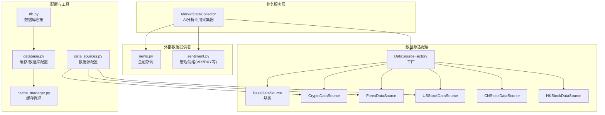
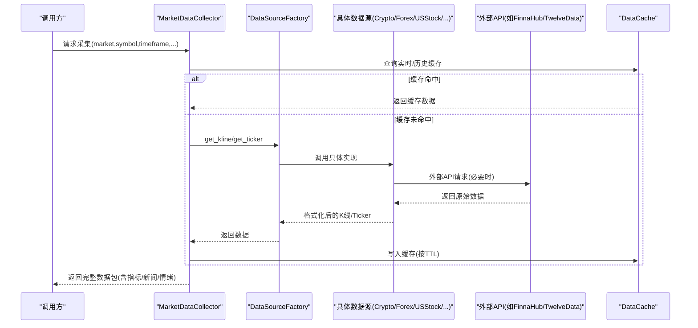
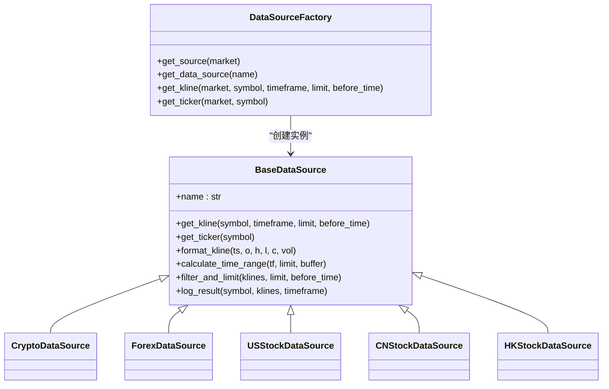
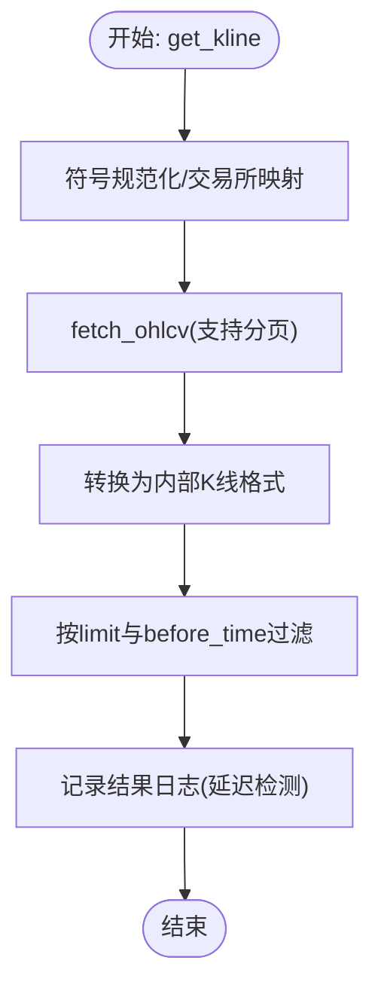
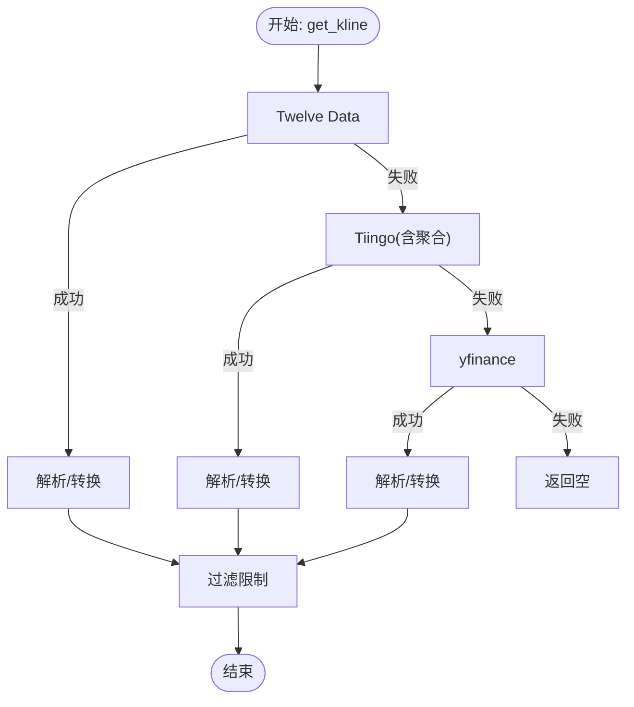
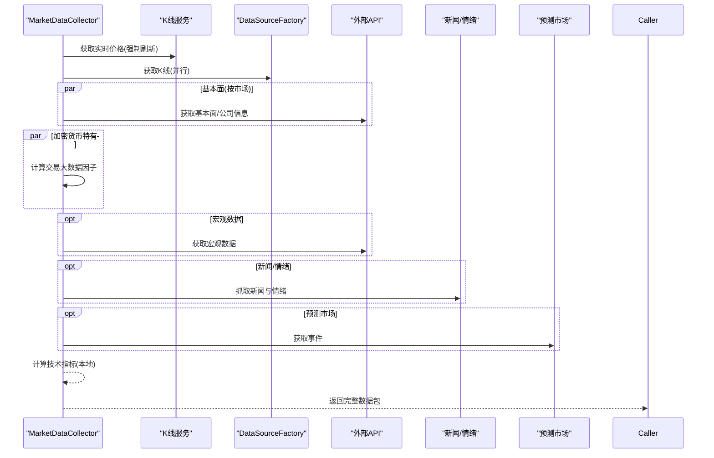
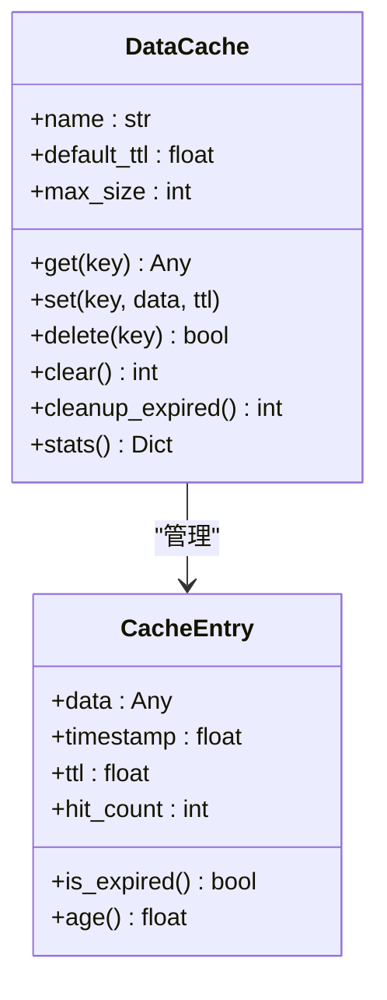
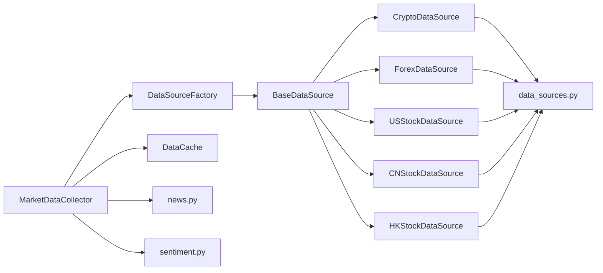

# 数据管理系统

<cite>
**本文档引用的文件**
- [backend_api_python/app/data_sources/base.py](file://backend_api_python/app/data_sources/base.py)
- [backend_api_python/app/data_sources/factory.py](file://backend_api_python/app/data_sources/factory.py)
- [backend_api_python/app/data_sources/cache_manager.py](file://backend_api_python/app/data_sources/cache_manager.py)
- [backend_api_python/app/services/market_data_collector.py](file://backend_api_python/app/services/market_data_collector.py)
- [backend_api_python/app/config/data_sources.py](file://backend_api_python/app/config/data_sources.py)
- [backend_api_python/app/data_sources/crypto.py](file://backend_api_python/app/data_sources/crypto.py)
- [backend_api_python/app/data_sources/forex.py](file://backend_api_python/app/data_sources/forex.py)
- [backend_api_python/app/data_sources/us_stock.py](file://backend_api_python/app/data_sources/us_stock.py)
- [backend_api_python/app/data_sources/cn_stock.py](file://backend_api_python/app/data_sources/cn_stock.py)
- [backend_api_python/app/data_sources/hk_stock.py](file://backend_api_python/app/data_sources/hk_stock.py)
- [backend_api_python/app/data_providers/news.py](file://backend_api_python/app/data_providers/news.py)
- [backend_api_python/app/data_providers/sentiment.py](file://backend_api_python/app/data_providers/sentiment.py)
- [backend_api_python/app/utils/db.py](file://backend_api_python/app/utils/db.py)
- [backend_api_python/app/config/database.py](file://backend_api_python/app/config/database.py)
- [backend_api_python/migrations/init.sql](file://backend_api_python/migrations/init.sql)
</cite>

## 目录
1. [简介](#简介)
2. [项目结构](#项目结构)
3. [核心组件](#核心组件)
4. [架构总览](#架构总览)
5. [详细组件分析](#详细组件分析)
6. [依赖关系分析](#依赖关系分析)
7. [性能考量](#性能考量)
8. [故障排查指南](#故障排查指南)
9. [结论](#结论)
10. [附录](#附录)

## 简介
QuantDinger 数据管理系统是一个面向量化交易与AI分析的综合数据平台，负责统一接入多市场数据源（加密货币、股票、外汇、商品/指数、预测市场等），提供标准化的K线与实时行情接口，并通过缓存与限流策略保障稳定性与性能。系统同时集成新闻与宏观情绪数据，为策略研究与自动化交易提供高质量、低延迟的数据基础。

## 项目结构
后端采用Python（Flask风格）组织，核心目录与职责如下：
- app/data_sources：数据源适配层，抽象统一接口并按市场类型实现具体适配器
- app/data_providers：外部数据提供者（新闻、宏观情绪等）
- app/services：业务服务层（如AI分析专用的市场数据采集器）
- app/config：配置中心（数据源、缓存、数据库等）
- app/utils：工具模块（数据库连接、缓存、HTTP等）
- migrations：PostgreSQL初始化与迁移脚本



**图示来源**
- [backend_api_python/app/data_sources/factory.py:13-134](file://backend_api_python/app/data_sources/factory.py#L13-L134)
- [backend_api_python/app/data_sources/base.py:27-171](file://backend_api_python/app/data_sources/base.py#L27-L171)
- [backend_api_python/app/data_sources/crypto.py:16-388](file://backend_api_python/app/data_sources/crypto.py#L16-L388)
- [backend_api_python/app/data_sources/forex.py:95-690](file://backend_api_python/app/data_sources/forex.py#L95-L690)
- [backend_api_python/app/data_sources/us_stock.py:17-318](file://backend_api_python/app/data_sources/us_stock.py#L17-L318)
- [backend_api_python/app/data_sources/cn_stock.py:30-100](file://backend_api_python/app/data_sources/cn_stock.py#L30-L100)
- [backend_api_python/app/data_sources/hk_stock.py:30-100](file://backend_api_python/app/data_sources/hk_stock.py#L30-L100)
- [backend_api_python/app/services/market_data_collector.py:34-225](file://backend_api_python/app/services/market_data_collector.py#L34-L225)
- [backend_api_python/app/data_providers/news.py:13-150](file://backend_api_python/app/data_providers/news.py#L13-L150)
- [backend_api_python/app/data_providers/sentiment.py:12-377](file://backend_api_python/app/data_providers/sentiment.py#L12-L377)
- [backend_api_python/app/config/data_sources.py:26-171](file://backend_api_python/app/config/data_sources.py#L26-L171)
- [backend_api_python/app/config/database.py:49-90](file://backend_api_python/app/config/database.py#L49-L90)
- [backend_api_python/app/utils/db.py:19-66](file://backend_api_python/app/utils/db.py#L19-L66)
- [backend_api_python/app/data_sources/cache_manager.py:44-233](file://backend_api_python/app/data_sources/cache_manager.py#L44-L233)

**章节来源**
- [backend_api_python/app/data_sources/factory.py:13-134](file://backend_api_python/app/data_sources/factory.py#L13-L134)
- [backend_api_python/app/data_sources/base.py:27-171](file://backend_api_python/app/data_sources/base.py#L27-L171)
- [backend_api_python/app/services/market_data_collector.py:34-225](file://backend_api_python/app/services/market_data_collector.py#L34-L225)

## 核心组件
- 数据源基类与工厂
  - BaseDataSource：定义统一接口（K线、Ticker、格式化、时间范围计算、过滤限制、延迟检测日志）
  - DataSourceFactory：按市场类型返回对应数据源实例，提供便捷的K线与Ticker获取方法
- 数据源适配器
  - 加密货币：基于CCXT，支持多交易所自动选择与符号规范化
  - 外汇：Twelve Data → Tiingo → yfinance 三级降级
  - 美股：yfinance + finnhub 两级降级
  - A股/H股：Twelve Data → 腾讯 → yfinance → AkShare 多层降级
- 业务采集器
  - MarketDataCollector：为AI分析提供一站式数据采集，含并行核心数据获取、技术指标本地计算、新闻与宏观情绪、预测市场数据
- 缓存与配置
  - DataCache：TTL + LRU + 线程安全，内置实时行情、K线、股票信息三类缓存
  - 配置中心：数据源超时、重试、速率限制、时间周期映射、缓存TTL等
- 数据库与索引
  - PostgreSQL初始化脚本：用户、策略、交易、监控、分析任务等表，配套索引

**章节来源**
- [backend_api_python/app/data_sources/base.py:27-171](file://backend_api_python/app/data_sources/base.py#L27-L171)
- [backend_api_python/app/data_sources/factory.py:13-134](file://backend_api_python/app/data_sources/factory.py#L13-L134)
- [backend_api_python/app/data_sources/crypto.py:16-388](file://backend_api_python/app/data_sources/crypto.py#L16-L388)
- [backend_api_python/app/data_sources/forex.py:95-690](file://backend_api_python/app/data_sources/forex.py#L95-L690)
- [backend_api_python/app/data_sources/us_stock.py:17-318](file://backend_api_python/app/data_sources/us_stock.py#L17-L318)
- [backend_api_python/app/data_sources/cn_stock.py:30-100](file://backend_api_python/app/data_sources/cn_stock.py#L30-L100)
- [backend_api_python/app/data_sources/hk_stock.py:30-100](file://backend_api_python/app/data_sources/hk_stock.py#L30-L100)
- [backend_api_python/app/services/market_data_collector.py:34-225](file://backend_api_python/app/services/market_data_collector.py#L34-L225)
- [backend_api_python/app/data_sources/cache_manager.py:44-233](file://backend_api_python/app/data_sources/cache_manager.py#L44-L233)
- [backend_api_python/app/config/data_sources.py:26-171](file://backend_api_python/app/config/data_sources.py#L26-L171)
- [backend_api_python/migrations/init.sql:1-800](file://backend_api_python/migrations/init.sql#L1-L800)

## 架构总览
系统采用“适配器 + 工厂 + 采集器”的分层架构：
- 适配层：统一接口 + 多数据源实现
- 控制层：工厂负责实例化与路由
- 采集层：业务服务按需并行拉取核心/辅助数据
- 缓存层：内存缓存降低重复请求
- 存储层：PostgreSQL持久化



**图示来源**
- [backend_api_python/app/services/market_data_collector.py:72-225](file://backend_api_python/app/services/market_data_collector.py#L72-L225)
- [backend_api_python/app/data_sources/factory.py:74-133](file://backend_api_python/app/data_sources/factory.py#L74-L133)
- [backend_api_python/app/data_sources/cache_manager.py:71-128](file://backend_api_python/app/data_sources/cache_manager.py#L71-L128)

## 详细组件分析

### 数据源基类与工厂
- BaseDataSource
  - 接口：get_kline、get_ticker（可选）、format_kline、calculate_time_range、filter_and_limit、log_result
  - 设计要点：统一时间戳、四舍五入精度、时间范围估算、按UTC比较延迟阈值、降级告警
- DataSourceFactory
  - 市场类型映射：Crypto、USStock、Forex、Futures、CNStock、HKStock
  - 便捷方法：get_kline、get_ticker，异常捕获与降级返回



**图示来源**
- [backend_api_python/app/data_sources/base.py:27-171](file://backend_api_python/app/data_sources/base.py#L27-L171)
- [backend_api_python/app/data_sources/factory.py:13-72](file://backend_api_python/app/data_sources/factory.py#L13-L72)

**章节来源**
- [backend_api_python/app/data_sources/base.py:27-171](file://backend_api_python/app/data_sources/base.py#L27-L171)
- [backend_api_python/app/data_sources/factory.py:13-134](file://backend_api_python/app/data_sources/factory.py#L13-L134)

### 加密货币数据源（CCXT）
- 特性
  - 符号规范化与交易所兼容映射
  - 分页获取历史K线，支持before_time回溯
  - 多级降级：CCXT → 备用实现
- 关键流程
  - 符号归一化 → 交易所映射 → fetch_ticker/fetch_ohlcv → 格式化 → 过滤限制 → 结果日志



**图示来源**
- [backend_api_python/app/data_sources/crypto.py:232-298](file://backend_api_python/app/data_sources/crypto.py#L232-L298)
- [backend_api_python/app/data_sources/crypto.py:299-387](file://backend_api_python/app/data_sources/crypto.py#L299-L387)

**章节来源**
- [backend_api_python/app/data_sources/crypto.py:16-388](file://backend_api_python/app/data_sources/crypto.py#L16-L388)

### 外汇数据源（Twelve Data → Tiingo → yfinance）
- 特性
  - 三级降级策略，优先Twelve Data，其次Tiingo，最后yfinance
  - 外汇Ticker与K线分别实现
  - Tiingo周线/月线通过日线聚合实现
- 关键流程
  - 逐级尝试 → 解析响应 → 转换为内部格式 → 过滤限制



**图示来源**
- [backend_api_python/app/data_sources/forex.py:303-326](file://backend_api_python/app/data_sources/forex.py#L303-L326)
- [backend_api_python/app/data_sources/forex.py:375-560](file://backend_api_python/app/data_sources/forex.py#L375-L560)
- [backend_api_python/app/data_sources/forex.py:644-690](file://backend_api_python/app/data_sources/forex.py#L644-L690)

**章节来源**
- [backend_api_python/app/data_sources/forex.py:95-690](file://backend_api_python/app/data_sources/forex.py#L95-L690)

### 美股数据源（yfinance + finnhub）
- 特性
  - 优先Finnhub（实时），降级yfinance fast_info/info/history
  - K线按周期映射与天数范围估算
- 关键流程
  - Finnhub → yfinance fast_info → yfinance info → yfinance history fallback

**章节来源**
- [backend_api_python/app/data_sources/us_stock.py:17-318](file://backend_api_python/app/data_sources/us_stock.py#L17-L318)

### A股/H股数据源（Twelve Data → 腾讯 → yfinance → AkShare）
- 特性
  - 多层降级，分钟/小时优先yfinance/AkShare，日/周线优先腾讯
  - 腾讯日/周线fqkline，Twelve Data为主（付费）

**章节来源**
- [backend_api_python/app/data_sources/cn_stock.py:30-100](file://backend_api_python/app/data_sources/cn_stock.py#L30-L100)
- [backend_api_python/app/data_sources/hk_stock.py:30-100](file://backend_api_python/app/data_sources/hk_stock.py#L30-L100)

### 市场数据采集器（AI分析专用）
- 职责
  - 统一数据源接入、并行获取核心数据、本地计算技术指标、抓取新闻与宏观情绪、整合预测市场数据
- 关键流程
  - 并行阶段1：价格/日K线/基本面（按市场类型）
  - 本地阶段1.5：加密货币交易大数据因子
  - 可选阶段2：宏观数据
  - 可选阶段3：新闻/情绪
  - 可选阶段4：预测市场事件
  - 统计耗时与成功率/失败项



**图示来源**
- [backend_api_python/app/services/market_data_collector.py:72-225](file://backend_api_python/app/services/market_data_collector.py#L72-L225)

**章节来源**
- [backend_api_python/app/services/market_data_collector.py:34-800](file://backend_api_python/app/services/market_data_collector.py#L34-L800)

### 缓存策略与管理
- DataCache
  - TTL过期、LRU淘汰、线程安全、命中/未命中统计
  - 三类全局缓存：实时行情、K线、股票信息
- 缓存TTL配置
  - K线按周期差异化TTL、分析缓存、价格缓存等



**图示来源**
- [backend_api_python/app/data_sources/cache_manager.py:44-233](file://backend_api_python/app/data_sources/cache_manager.py#L44-L233)

**章节来源**
- [backend_api_python/app/data_sources/cache_manager.py:44-233](file://backend_api_python/app/data_sources/cache_manager.py#L44-L233)
- [backend_api_python/app/config/database.py:49-90](file://backend_api_python/app/config/database.py#L49-L90)

### 数据提供者（新闻与宏观情绪）
- 新闻
  - 基于搜索服务抓取中英文关键词集合，去重与分类
- 宏观情绪
  - Fear & Greed、VIX、DXY、收益率曲线、VXN、GVZ、Put/Call比率等指标

**章节来源**
- [backend_api_python/app/data_providers/news.py:13-150](file://backend_api_python/app/data_providers/news.py#L13-L150)
- [backend_api_python/app/data_providers/sentiment.py:12-377](file://backend_api_python/app/data_providers/sentiment.py#L12-L377)

### 数据库设计与索引策略
- 用户与认证相关表：qd_users、qd_credits_log、qd_membership_orders、qd_usdt_orders、qd_oauth_states、qd_verification_codes、qd_login_attempts、qd_oauth_links、qd_security_logs
- 交易与策略相关表：qd_strategies_trading、qd_strategy_positions、qd_strategy_trades、pending_orders、qd_strategy_notifications、qd_strategy_logs
- 指标与社区：qd_indicator_codes
- 观察清单与分析：qd_watchlist、qd_analysis_tasks
- 回测：qd_backtest_runs、qd_backtest_trades、qd_backtest_equity_points
- 交易所凭证：qd_exchange_credentials
- 手工头寸与提醒：qd_manual_positions、qd_position_alerts、qd_position_monitors
- 市场标的种子数据：qd_market_symbols（含索引）
- 分析记忆：qd_analysis_memory（含JSONB字段）

```mermaid
erDiagram
QD_USERS {
serial id PK
varchar username UK
varchar password_hash
varchar email UK
varchar nickname
varchar avatar
varchar status
varchar role
decimal credits
timestamp vip_expires_at
varchar vip_plan
boolean vip_is_lifetime
timestamp vip_monthly_credits_last_grant
boolean email_verified
int referred_by
text notification_settings
text chart_templates
varchar timezone
int token_version
timestamp last_login_at
timestamp created_at
timestamp updated_at
}
QD_MARKET_SYMBOLS {
serial id PK
varchar market
varchar symbol
varchar name
varchar exchange
varchar currency
int is_active
int is_hot
int sort_order
timestamp created_at
}
IDX_USERS_REFERRAL ON QD_USERS(referred_by)
IDX_MARKETS_HOT ON QD_MARKET_SYMBOLS(market, is_hot)
```

**图示来源**
- [backend_api_python/migrations/init.sql:8-133](file://backend_api_python/migrations/init.sql#L8-L133)
- [backend_api_python/migrations/init.sql:619-773](file://backend_api_python/migrations/init.sql#L619-L773)

**章节来源**
- [backend_api_python/migrations/init.sql:1-800](file://backend_api_python/migrations/init.sql#L1-L800)
- [backend_api_python/app/utils/db.py:19-66](file://backend_api_python/app/utils/db.py#L19-L66)

## 依赖关系分析
- 组件耦合
  - MarketDataCollector依赖DataSourceFactory与各数据源实现，形成松耦合
  - 各数据源实现依赖配置模块（超时、速率限制、时间周期映射）
  - 缓存模块独立，既可被采集器使用，也可被其他模块复用
- 外部依赖
  - CCXT（加密货币）、requests/yfinance/finnhub（美股）、Twelve Data/Tiingo（外汇）、AkShare（A/H股补充）
- 潜在循环依赖
  - 未发现直接循环导入；工厂按需导入具体实现类



**图示来源**
- [backend_api_python/app/services/market_data_collector.py:26-52](file://backend_api_python/app/services/market_data_collector.py#L26-L52)
- [backend_api_python/app/data_sources/factory.py:49-72](file://backend_api_python/app/data_sources/factory.py#L49-L72)
- [backend_api_python/app/config/data_sources.py:26-171](file://backend_api_python/app/config/data_sources.py#L26-L171)
- [backend_api_python/app/data_sources/cache_manager.py:203-233](file://backend_api_python/app/data_sources/cache_manager.py#L203-L233)
- [backend_api_python/app/data_providers/news.py:18-70](file://backend_api_python/app/data_providers/news.py#L18-L70)
- [backend_api_python/app/data_providers/sentiment.py:12-42](file://backend_api_python/app/data_providers/sentiment.py#L12-L42)

**章节来源**
- [backend_api_python/app/services/market_data_collector.py:26-52](file://backend_api_python/app/services/market_data_collector.py#L26-L52)
- [backend_api_python/app/data_sources/factory.py:49-72](file://backend_api_python/app/data_sources/factory.py#L49-L72)

## 性能考量
- 并行化
  - MarketDataCollector在核心数据阶段使用线程池并行获取，缩短总等待时间
- 缓存
  - DataCache提供TTL与LRU，减少重复请求；K线缓存按周期差异化TTL
- 降级与容错
  - 多级降级策略（Twelve Data → Tiingo → yfinance；CCXT → 备用实现）
  - 异常捕获与默认返回，避免单点失败影响整体
- 限流与超时
  - 配置中心统一管理超时、重试次数、Backoff、速率限制
- 数据质量
  - 统一格式化、时间排序、按UTC比较延迟阈值、过滤限制

[本节为通用指导，无需特定文件引用]

## 故障排查指南
- 常见问题定位
  - 数据延迟：查看log_result输出，确认最新K线时间与当前UTC时间差是否超过阈值
  - 无数据：检查数据源返回与filter_and_limit逻辑，确认before_time与limit参数
  - 外部API错误：关注Finnhub/Twelve Data/Tiingo/yfinance等的错误码与速率限制
- 日志与监控
  - 采集器记录总耗时、成功/失败项列表
  - 缓存命中/未命中统计可用于评估缓存效果
- 配置检查
  - 确认API Key、代理设置、超时与重试配置
  - 数据库连接可用性与索引存在性

**章节来源**
- [backend_api_python/app/data_sources/base.py:133-171](file://backend_api_python/app/data_sources/base.py#L133-L171)
- [backend_api_python/app/services/market_data_collector.py:218-224](file://backend_api_python/app/services/market_data_collector.py#L218-L224)
- [backend_api_python/app/data_sources/cache_manager.py:160-174](file://backend_api_python/app/data_sources/cache_manager.py#L160-L174)

## 结论
QuantDinger数据管理系统通过“适配器 + 工厂 + 采集器”的架构实现了对多市场数据源的统一接入与高效利用。结合多级降级策略、缓存与限流、以及完善的日志与监控，系统在保证数据质量的同时兼顾了性能与稳定性。数据库层面的完整表结构与索引设计为长期运营提供了坚实基础。

[本节为总结，无需特定文件引用]

## 附录
- 支持的数据源类型
  - 加密货币：CCXT（多交易所）
  - 股票：美股（yfinance + finnhub）、A股/H股（Twelve Data → 腾讯 → yfinance → AkShare）
  - 外汇：Twelve Data → Tiingo → yfinance
  - 商品/指数：通过期货/宏观模块接入
  - 新闻与情绪：金融新闻、Fear & Greed、VIX、DXY、收益率曲线、VXN、GVZ、Put/Call比率等
- 数据质量与异常处理
  - 统一格式化、时间范围估算、延迟检测、降级返回、错误日志
- 性能优化建议
  - 合理设置缓存TTL与容量、并行化请求、外部API限流与重试、索引优化

[本节为概览，无需特定文件引用]