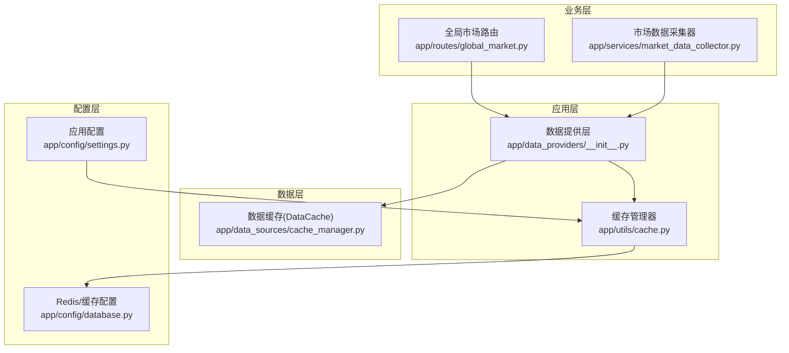
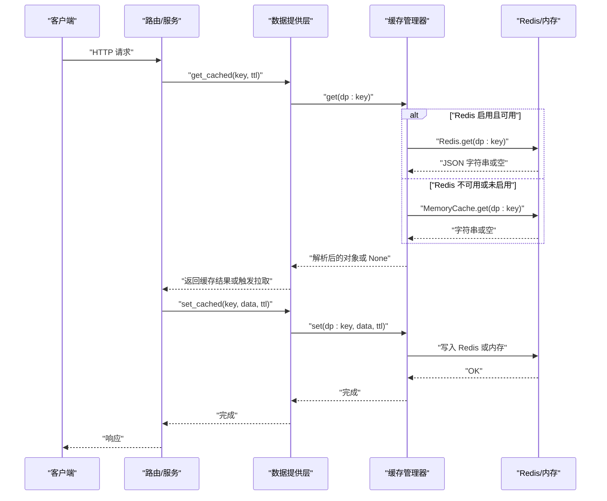
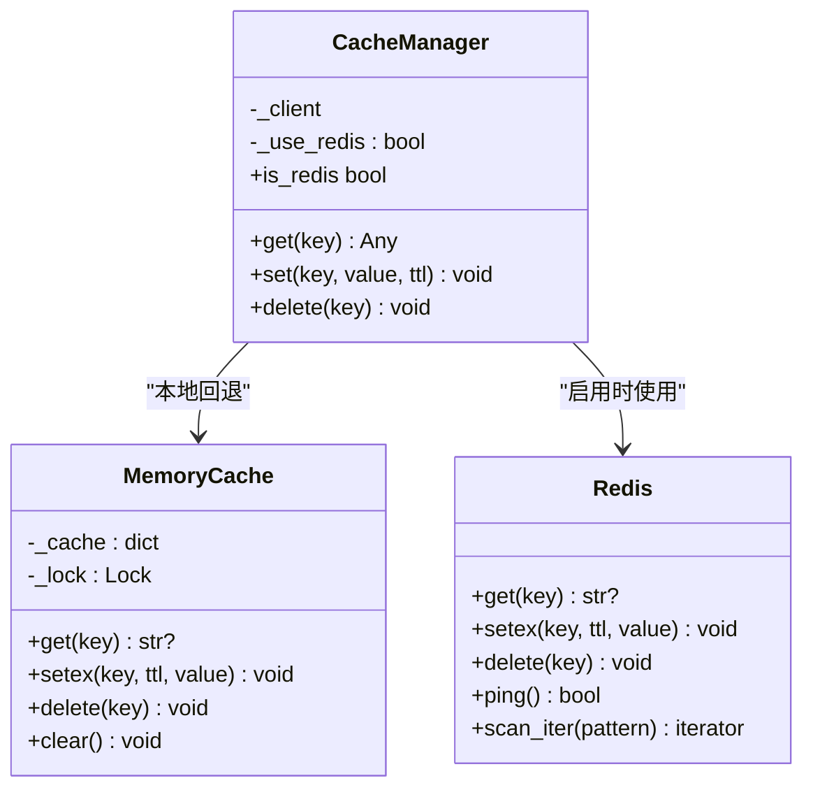
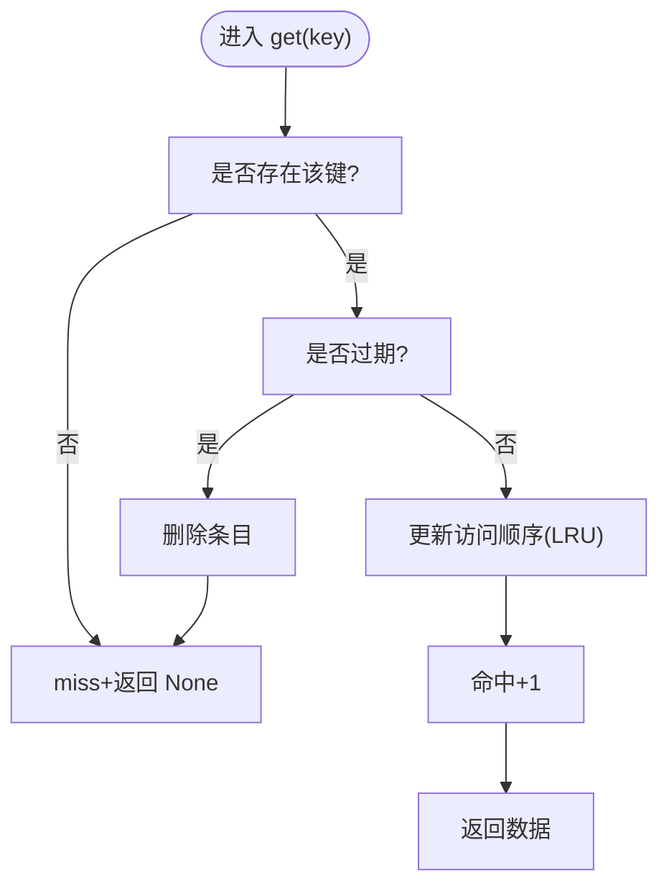
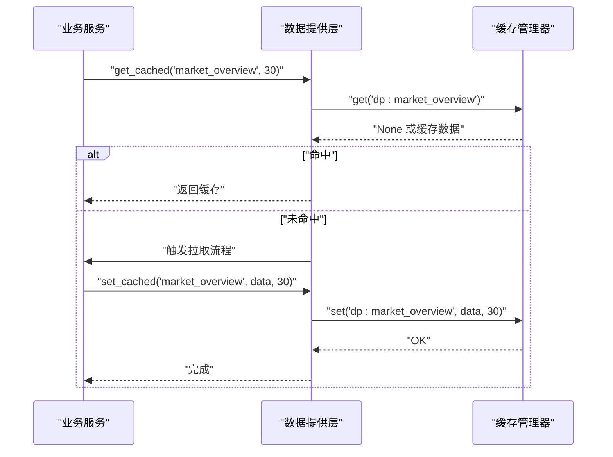
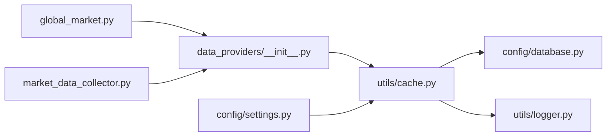

# 缓存管理

<cite>
**本文引用的文件**
- [backend_api_python/app/utils/cache.py](file://backend_api_python/app/utils/cache.py)
- [backend_api_python/app/data_sources/cache_manager.py](file://backend_api_python/app/data_sources/cache_manager.py)
- [backend_api_python/app/data_providers/__init__.py](file://backend_api_python/app/data_providers/__init__.py)
- [backend_api_python/app/config/database.py](file://backend_api_python/app/config/database.py)
- [backend_api_python/app/config/settings.py](file://backend_api_python/app/config/settings.py)
- [backend_api_python/app/routes/global_market.py](file://backend_api_python/app/routes/global_market.py)
- [backend_api_python/app/services/market_data_collector.py](file://backend_api_python/app/services/market_data_collector.py)
- [backend_api_python/app/utils/logger.py](file://backend_api_python/app/utils/logger.py)
</cite>

## 目录
1. [简介](#简介)
2. [项目结构](#项目结构)
3. [核心组件](#核心组件)
4. [架构总览](#架构总览)
5. [详细组件分析](#详细组件分析)
6. [依赖分析](#依赖分析)
7. [性能考虑](#性能考虑)
8. [故障排查指南](#故障排查指南)
9. [结论](#结论)
10. [附录](#附录)

## 简介
本文件系统性阐述 QuantDinger 后端的缓存管理体系，覆盖设计原则、实现机制、Redis 配置、缓存失效策略与一致性保障，并针对实时数据、历史数据与配置数据给出差异化策略。同时提供性能优化建议、监控指标与故障排查方法，帮助读者在不同运行环境下正确部署与维护缓存子系统。

## 项目结构
缓存相关能力分布在以下层次：
- 应用层：统一的缓存接口与装饰器，封装读写与清理逻辑
- 数据层：面向市场数据的本地内存缓存与 TTL/淘汰策略
- 配置层：Redis 与业务缓存的环境变量配置
- 路由与服务：具体业务接口与采集器对缓存的使用示例

**图表来源**
- [backend_api_python/app/data_providers/__init__.py:1-86](file://backend_api_python/app/data_providers/__init__.py#L1-L86)
- [backend_api_python/app/utils/cache.py:1-129](file://backend_api_python/app/utils/cache.py#L1-L129)
- [backend_api_python/app/data_sources/cache_manager.py:1-233](file://backend_api_python/app/data_sources/cache_manager.py#L1-L233)
- [backend_api_python/app/config/database.py:1-90](file://backend_api_python/app/config/database.py#L1-L90)
- [backend_api_python/app/config/settings.py:1-99](file://backend_api_python/app/config/settings.py#L1-L99)
- [backend_api_python/app/routes/global_market.py:1-200](file://backend_api_python/app/routes/global_market.py#L1-L200)
- [backend_api_python/app/services/market_data_collector.py:1730-1929](file://backend_api_python/app/services/market_data_collector.py#L1730-L1929)

**章节来源**
- [backend_api_python/app/data_providers/__init__.py:1-86](file://backend_api_python/app/data_providers/__init__.py#L1-L86)
- [backend_api_python/app/utils/cache.py:1-129](file://backend_api_python/app/utils/cache.py#L1-L129)
- [backend_api_python/app/data_sources/cache_manager.py:1-233](file://backend_api_python/app/data_sources/cache_manager.py#L1-L233)
- [backend_api_python/app/config/database.py:1-90](file://backend_api_python/app/config/database.py#L1-L90)
- [backend_api_python/app/config/settings.py:1-99](file://backend_api_python/app/config/settings.py#L1-L99)
- [backend_api_python/app/routes/global_market.py:1-200](file://backend_api_python/app/routes/global_market.py#L1-L200)
- [backend_api_python/app/services/market_data_collector.py:1730-1929](file://backend_api_python/app/services/market_data_collector.py#L1730-L1929)

## 核心组件
- 缓存管理器（CacheManager）
  - 单例模式，支持本地内存与 Redis 透明切换
  - 通过配置开关与环境变量控制启用与否
  - 提供 get/set/delete 接口，内部序列化/反序列化 JSON
- 内存缓存（MemoryCache）
  - 线程安全字典 + 过期时间戳，过期自动清理
- 数据缓存（DataCache）
  - 针对市场数据的本地内存缓存，具备 TTL、最大容量、LRU 淘汰、命中统计
- 数据提供层缓存接口（get_cached/set_cached/clear_cache）
  - 统一前缀 dp:，集中管理 TTL 与清理策略
- 配置层
  - Redis 连接参数与超时、连接池上限
  - 业务缓存 TTL 映射（K线、分析、价格等）

**章节来源**
- [backend_api_python/app/utils/cache.py:17-129](file://backend_api_python/app/utils/cache.py#L17-L129)
- [backend_api_python/app/data_sources/cache_manager.py:27-233](file://backend_api_python/app/data_sources/cache_manager.py#L27-L233)
- [backend_api_python/app/data_providers/__init__.py:23-78](file://backend_api_python/app/data_providers/__init__.py#L23-L78)
- [backend_api_python/app/config/database.py:6-90](file://backend_api_python/app/config/database.py#L6-L90)
- [backend_api_python/app/config/settings.py:74-91](file://backend_api_python/app/config/settings.py#L74-L91)

## 架构总览
缓存体系采用“应用层统一接口 + 本地优先 + 可选 Redis”的分层设计。默认使用内存缓存，仅在显式启用时连接 Redis；业务层通过数据提供层的 get/set/clear 接口进行读写，避免直接感知后端存储差异。

**图表来源**
- [backend_api_python/app/data_providers/__init__.py:45-58](file://backend_api_python/app/data_providers/__init__.py#L45-L58)
- [backend_api_python/app/utils/cache.py:100-124](file://backend_api_python/app/utils/cache.py#L100-L124)
- [backend_api_python/app/config/database.py:38-47](file://backend_api_python/app/config/database.py#L38-L47)

## 详细组件分析

### 缓存管理器（CacheManager）
- 设计要点
  - 单例懒加载，避免导入时副作用
  - 本地优先：默认使用 MemoryCache；当启用 Redis 且可连通时切换到 Redis
  - 异常降级：Redis 不可用时静默回退到内存缓存
- 关键行为
  - get：解码 JSON，处理过期
  - set：序列化 JSON，写入 Redis 或内存
  - delete：删除键
  - is_redis：指示当前后端类型
- 适用场景
  - 通用业务缓存（如全局市场概览、热点数据聚合）

**图表来源**
- [backend_api_python/app/utils/cache.py:49-129](file://backend_api_python/app/utils/cache.py#L49-L129)

**章节来源**
- [backend_api_python/app/utils/cache.py:49-129](file://backend_api_python/app/utils/cache.py#L49-L129)

### 数据缓存（DataCache）
- 设计要点
  - 面向市场数据的本地内存缓存，具备 TTL、最大容量、LRU 淘汰
  - 线程安全，支持清理过期、统计命中率
- 关键行为
  - get：命中返回数据，过期删除并返回 None
  - set：容量不足时按 LRU 淘汰最久未使用项
  - stats：返回命中/未命中次数、命中率、默认 TTL 等
- 适用场景
  - 实时行情、K线片段、股票基础信息等高频读取数据

**图表来源**
- [backend_api_python/app/data_sources/cache_manager.py:71-98](file://backend_api_python/app/data_sources/cache_manager.py#L71-L98)

**章节来源**
- [backend_api_python/app/data_sources/cache_manager.py:44-175](file://backend_api_python/app/data_sources/cache_manager.py#L44-L175)

### 数据提供层缓存接口（get_cached/set_cached/clear_cache）
- 设计要点
  - 统一键前缀 dp:，便于批量清理
  - TTL 映射集中管理，支持默认 TTL
  - clear_cache 支持 Redis 扫描删除与内存清空
- 关键行为
  - get_cached：带前缀读取，尊重写入时 TTL
  - set_cached：计算有效 TTL 并写入
  - clear_cache：根据后端类型选择清理策略

**图表来源**
- [backend_api_python/app/data_providers/__init__.py:45-78](file://backend_api_python/app/data_providers/__init__.py#L45-L78)
- [backend_api_python/app/routes/global_market.py:92-136](file://backend_api_python/app/routes/global_market.py#L92-L136)

**章节来源**
- [backend_api_python/app/data_providers/__init__.py:23-78](file://backend_api_python/app/data_providers/__init__.py#L23-L78)
- [backend_api_python/app/routes/global_market.py:92-136](file://backend_api_python/app/routes/global_market.py#L92-L136)

### Redis 配置与连接
- Redis 配置
  - 主机、端口、密码、DB、连接/套接字超时、最大连接数
  - 支持通过环境变量覆盖
- 连接策略
  - CacheManager 在启用时尝试 ping，失败则回退内存缓存
  - 日志记录连接状态与异常

**章节来源**
- [backend_api_python/app/config/database.py:6-47](file://backend_api_python/app/config/database.py#L6-L47)
- [backend_api_python/app/utils/cache.py:77-98](file://backend_api_python/app/utils/cache.py#L77-L98)

### 业务 TTL 与缓存策略
- 业务 TTL 映射
  - K线缓存 TTL：按周期映射（1分钟至日线）
  - 分析缓存 TTL：1小时
  - 价格缓存 TTL：10秒
  - 默认业务缓存 TTL：5分钟
- 路由与服务中的使用
  - 全局市场概览：30秒缓存
  - 宏观情绪数据：6小时缓存
  - 采集器复用全局缓存，避免重复拉取

**章节来源**
- [backend_api_python/app/config/database.py:58-85](file://backend_api_python/app/config/database.py#L58-L85)
- [backend_api_python/app/routes/global_market.py:92-136](file://backend_api_python/app/routes/global_market.py#L92-L136)
- [backend_api_python/app/services/market_data_collector.py:1752-1804](file://backend_api_python/app/services/market_data_collector.py#L1752-L1804)

## 依赖分析
- 组件耦合
  - 数据提供层依赖缓存管理器，但不感知后端类型
  - 路由与服务通过数据提供层间接使用缓存
  - 配置层独立于业务逻辑，通过环境变量驱动
- 外部依赖
  - Redis：可选依赖，启用时才引入
  - 日志：统一日志配置，过滤噪音

**图表来源**
- [backend_api_python/app/routes/global_market.py:34-51](file://backend_api_python/app/routes/global_market.py#L34-L51)
- [backend_api_python/app/services/market_data_collector.py:1740-1748](file://backend_api_python/app/services/market_data_collector.py#L1740-L1748)
- [backend_api_python/app/data_providers/__init__.py:39-42](file://backend_api_python/app/data_providers/__init__.py#L39-L42)
- [backend_api_python/app/utils/cache.py:78-98](file://backend_api_python/app/utils/cache.py#L78-L98)
- [backend_api_python/app/utils/logger.py:9-34](file://backend_api_python/app/utils/logger.py#L9-L34)

**章节来源**
- [backend_api_python/app/routes/global_market.py:34-51](file://backend_api_python/app/routes/global_market.py#L34-L51)
- [backend_api_python/app/services/market_data_collector.py:1740-1748](file://backend_api_python/app/services/market_data_collector.py#L1740-L1748)
- [backend_api_python/app/data_providers/__init__.py:39-42](file://backend_api_python/app/data_providers/__init__.py#L39-L42)
- [backend_api_python/app/utils/cache.py:78-98](file://backend_api_python/app/utils/cache.py#L78-L98)
- [backend_api_python/app/utils/logger.py:9-34](file://backend_api_python/app/utils/logger.py#L9-L34)

## 性能考虑
- 本地优先与降级
  - 默认内存缓存，避免网络抖动影响；Redis 不可用时自动回退
- TTL 策略
  - 实时数据短 TTL（如价格10秒），历史数据长 TTL（如宏观6小时）
  - 避免热点键过期风暴，合理分布过期时间
- LRU 淘汰
  - DataCache 控制最大容量，防止内存膨胀
- 并发与锁
  - MemoryCache 与 DataCache 均使用锁保护，确保线程安全
- 批量清理
  - clear_cache 对 Redis 使用扫描删除，对内存直接清空
- 日志与可观测性
  - 通过日志记录缓存命中/未命中、过期清理、连接状态

**章节来源**
- [backend_api_python/app/utils/cache.py:77-98](file://backend_api_python/app/utils/cache.py#L77-L98)
- [backend_api_python/app/data_sources/cache_manager.py:115-127](file://backend_api_python/app/data_sources/cache_manager.py#L115-L127)
- [backend_api_python/app/utils/logger.py:9-34](file://backend_api_python/app/utils/logger.py#L9-L34)

## 故障排查指南
- Redis 不可用
  - 现象：启动日志提示 Redis 可用但不可连通，随后使用内存缓存
  - 排查：检查主机、端口、密码、DB、超时与网络连通性
  - 参考：[backend_api_python/app/utils/cache.py:94-98](file://backend_api_python/app/utils/cache.py#L94-L98)
- 缓存未命中
  - 现象：业务接口频繁拉取外部数据
  - 排查：确认键前缀 dp: 是否一致、TTL 是否过短、是否被清理
  - 参考：[backend_api_python/app/data_providers/__init__.py:52](file://backend_api_python/app/data_providers/__init__.py#L52)
- 内存占用过高
  - 现象：DataCache 达到最大容量并持续淘汰
  - 排查：调整 max_size、清理策略或缩短默认 TTL
  - 参考：[backend_api_python/app/data_sources/cache_manager.py:115-118](file://backend_api_python/app/data_sources/cache_manager.py#L115-L118)
- 清理无效
  - 现象：调用 clear_cache 后仍存在旧数据
  - 排查：确认后端类型（Redis vs 内存）、键前缀是否匹配
  - 参考：[backend_api_python/app/data_providers/__init__.py:67-77](file://backend_api_python/app/data_providers/__init__.py#L67-L77)
- 日志定位
  - 使用统一日志配置，关注缓存相关 debug/INFO 级别输出
  - 参考：[backend_api_python/app/utils/logger.py:9-34](file://backend_api_python/app/utils/logger.py#L9-L34)

**章节来源**
- [backend_api_python/app/utils/cache.py:94-98](file://backend_api_python/app/utils/cache.py#L94-L98)
- [backend_api_python/app/data_providers/__init__.py:52](file://backend_api_python/app/data_providers/__init__.py#L52)
- [backend_api_python/app/data_sources/cache_manager.py:115-118](file://backend_api_python/app/data_sources/cache_manager.py#L115-L118)
- [backend_api_python/app/data_providers/__init__.py:67-77](file://backend_api_python/app/data_providers/__init__.py#L67-L77)
- [backend_api_python/app/utils/logger.py:9-34](file://backend_api_python/app/utils/logger.py#L9-L34)

## 结论
本缓存体系以“本地优先、可选 Redis、统一接口”为核心设计，既满足开发与单机场景的零依赖需求，又能在生产环境中通过 Redis 提升共享与持久化能力。配合 TTL、LRU 与统计指标，能够有效平衡性能与一致性。建议在生产中明确启用 Redis、合理设置 TTL 与容量阈值，并结合日志与监控持续优化。

## 附录

### 缓存策略建议（按数据类型）
- 实时数据（价格、指数）
  - TTL：短（如 10 秒）
  - 策略：高命中、低延迟，避免过期风暴
  - 参考：[backend_api_python/app/config/database.py:83-84](file://backend_api_python/app/config/database.py#L83-L84)
- 历史数据（K线、宏观指标）
  - TTL：按周期与重要性设定（如 5 分钟至 6 小时）
  - 策略：按需缓存、LRU 淘汰、定期清理过期
  - 参考：[backend_api_python/app/config/database.py:62-76](file://backend_api_python/app/config/database.py#L62-L76)
- 配置数据（策略模板、用户偏好）
  - TTL：中等（如 5 分钟）
  - 策略：集中管理 TTL 映射，变更时主动刷新
  - 参考：[backend_api_python/app/data_providers/__init__.py:23-34](file://backend_api_python/app/data_providers/__init__.py#L23-L34)

### 监控指标建议
- 命中率：命中数/(命中+未命中)
- 平均响应时间：缓存读取耗时
- 内存/连接使用：Redis 连接数、内存占用
- 清理频率：过期清理条目数
- 错误率：缓存读写异常次数

### 关键配置清单
- Redis
  - 主机、端口、密码、DB、连接/套接字超时、最大连接数
  - 参考：[backend_api_python/app/config/database.py:10-36](file://backend_api_python/app/config/database.py#L10-L36)
- 业务缓存
  - 开关、默认过期、K线/TTL 映射、分析/价格 TTL
  - 参考：[backend_api_python/app/config/database.py:52-85](file://backend_api_python/app/config/database.py#L52-L85)
- 应用功能开关
  - 缓存开关、请求日志开关
  - 参考：[backend_api_python/app/config/settings.py:76-90](file://backend_api_python/app/config/settings.py#L76-L90)