# AI工作流集成系统

<cite>
**本文档引用的文件**
- [backend_api_python/README.md](file://backend_api_python/README.md)
- [frontend/README.md](file://frontend/README.md)
- [backend_api_python/run.py](file://backend_api_python/run.py)
- [frontend/src/main.js](file://frontend/src/main.js)
- [backend_api_python/app/services/dify/workflow_executor.py](file://backend_api_python/app/services/dify/workflow_executor.py)
- [backend_api_python/app/routes/dify_workflow.py](file://backend_api_python/app/routes/dify_workflow.py)
- [backend_api_python/app/services/dify/dify_client.py](file://backend_api_python/app/services/dify/dify_client.py)
- [backend_api_python/app/services/dify/workflow_manager.py](file://backend_api_python/app/services/dify/workflow_manager.py)
- [backend_api_python/app/database/repositories/dify_workflow_repository.py](file://backend_api_python/app/database/repositories/dify_workflow_repository.py)
- [backend_api_python/app/models/dify.py](file://backend_api_python/app/models/dify.py)
- [frontend/src/api/dify.js](file://frontend/src/api/dify.js)
</cite>

## 目录
1. [简介](#简介)
2. [项目结构](#项目结构)
3. [核心组件](#核心组件)
4. [架构概览](#架构概览)
5. [详细组件分析](#详细组件分析)
6. [依赖关系分析](#依赖关系分析)
7. [性能考虑](#性能考虑)
8. [故障排除指南](#故障排除指南)
9. [结论](#结论)

## 简介

AI工作流集成系统是一个基于QuantDinger平台的全栈解决方案，专门设计用于集成和管理AI工作流，特别是与Dify平台的深度集成。该系统提供了完整的AI分析、工作流管理和执行功能，支持批处理和流式两种执行模式。

系统采用前后端分离架构，后端使用Python Flask框架，前端使用Vue.js技术栈，通过RESTful API进行通信。核心功能包括：

- **AI工作流管理**：注册、配置和管理Dify工作流
- **批处理执行**：同步执行AI工作流任务
- **流式执行**：异步流式数据传输支持
- **工作流日志**：完整的执行历史记录和监控
- **用户权限管理**：基于角色的访问控制
- **数据库集成**：PostgreSQL持久化存储

## 项目结构

整个项目采用模块化的分层架构设计，主要分为三个核心部分：

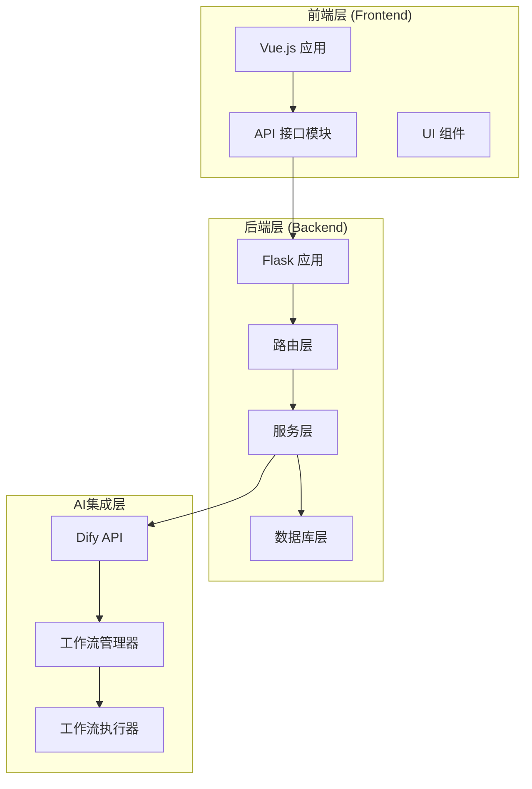

**图表来源**
- [backend_api_python/README.md:15-33](file://backend_api_python/README.md#L15-L33)
- [frontend/README.md:183-205](file://frontend/README.md#L183-L205)

### 后端架构层次

后端采用经典的三层架构模式：

1. **路由层**：处理HTTP请求和响应
2. **服务层**：业务逻辑处理和工作流管理
3. **数据访问层**：数据库操作和模型定义

### 前端架构层次

前端采用组件化开发模式：

1. **路由层**：页面导航和状态管理
2. **API层**：后端接口调用封装
3. **组件层**：可复用UI组件和页面视图

**章节来源**
- [backend_api_python/README.md:15-33](file://backend_api_python/README.md#L15-L33)
- [frontend/README.md:183-205](file://frontend/README.md#L183-L205)

## 核心组件

系统的核心组件围绕AI工作流的生命周期展开，包括创建、管理、执行和监控等完整流程。

### 工作流管理组件

工作流管理系统是整个AI集成的核心，负责工作流的全生命周期管理：

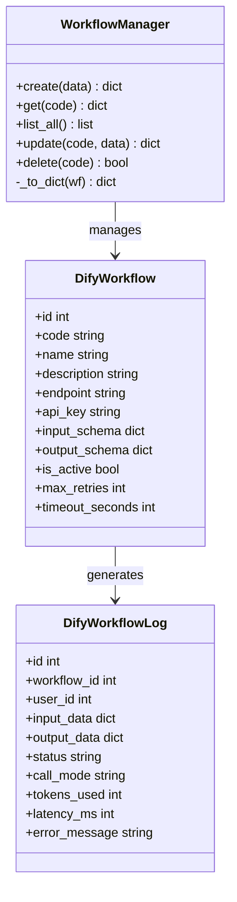

**图表来源**
- [backend_api_python/app/services/dify/workflow_manager.py:13-122](file://backend_api_python/app/services/dify/workflow_manager.py#L13-L122)
- [backend_api_python/app/models/dify.py:16-84](file://backend_api_python/app/models/dify.py#L16-L84)

### 工作流执行组件

工作流执行器提供灵活的执行模式支持：

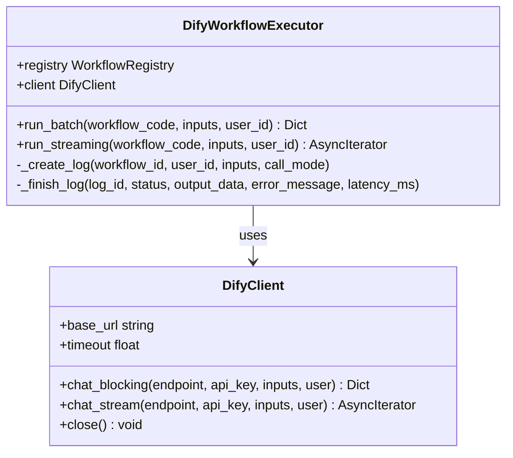

**图表来源**
- [backend_api_python/app/services/dify/workflow_executor.py:16-166](file://backend_api_python/app/services/dify/workflow_executor.py#L16-L166)
- [backend_api_python/app/services/dify/dify_client.py:17-108](file://backend_api_python/app/services/dify/dify_client.py#L17-L108)

### 数据模型组件

系统使用SQLAlchemy ORM进行数据持久化：

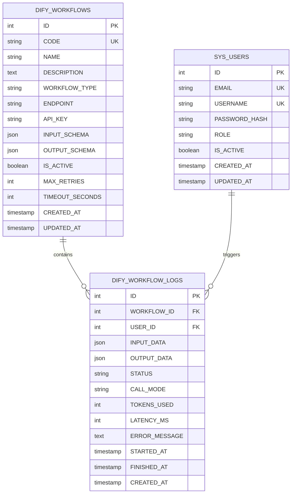

**图表来源**
- [backend_api_python/app/models/dify.py:16-84](file://backend_api_python/app/models/dify.py#L16-L84)

**章节来源**
- [backend_api_python/app/services/dify/workflow_manager.py:13-122](file://backend_api_python/app/services/dify/workflow_manager.py#L13-L122)
- [backend_api_python/app/services/dify/workflow_executor.py:16-166](file://backend_api_python/app/services/dify/workflow_executor.py#L16-L166)
- [backend_api_python/app/models/dify.py:16-84](file://backend_api_python/app/models/dify.py#L16-L84)

## 架构概览

系统采用微服务架构模式，通过清晰的边界划分实现松耦合的设计。

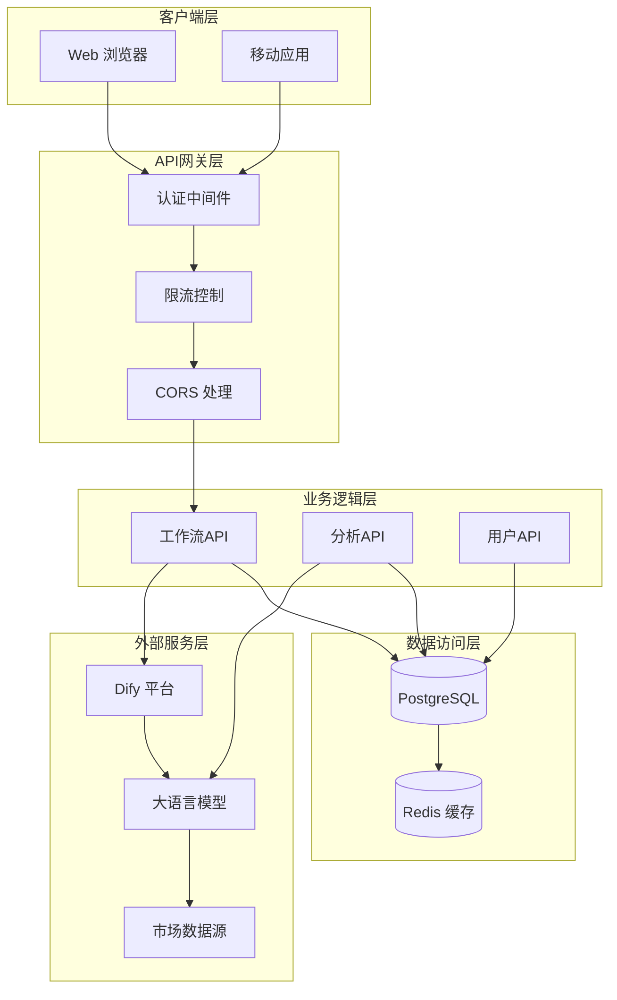

**图表来源**
- [backend_api_python/run.py:96-147](file://backend_api_python/run.py#L96-L147)
- [frontend/src/main.js:52-62](file://frontend/src/main.js#L52-L62)

### 数据流架构

系统内部的数据流遵循标准的RESTful API模式：

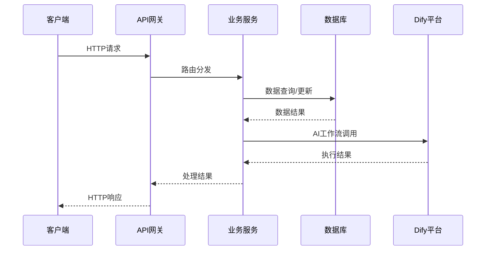

**图表来源**
- [backend_api_python/app/routes/dify_workflow.py:274-354](file://backend_api_python/app/routes/dify_workflow.py#L274-L354)

**章节来源**
- [backend_api_python/run.py:96-147](file://backend_api_python/run.py#L96-L147)
- [frontend/src/main.js:52-62](file://frontend/src/main.js#L52-L62)

## 详细组件分析

### 工作流执行流程

工作流执行是系统最核心的功能，支持两种执行模式：

#### 批处理执行模式

批处理模式适用于需要完整响应的场景：

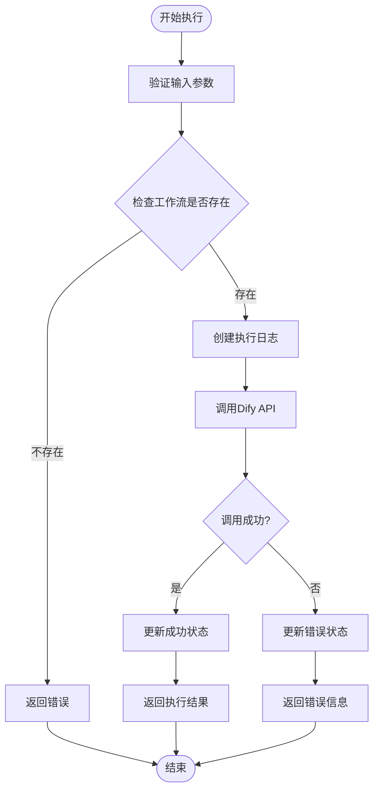

**图表来源**
- [backend_api_python/app/services/dify/workflow_executor.py:36-69](file://backend_api_python/app/services/dify/workflow_executor.py#L36-L69)

#### 流式执行模式

流式执行模式支持实时数据传输：

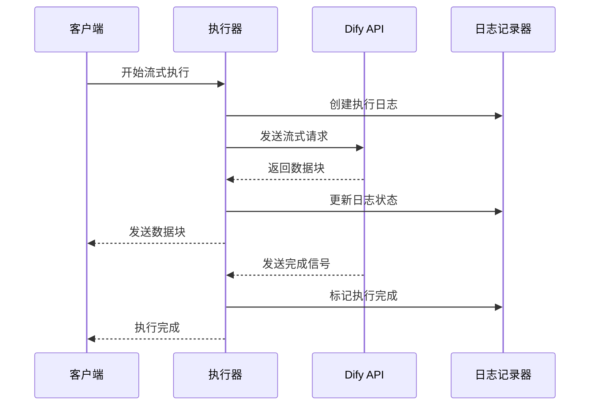

**图表来源**
- [backend_api_python/app/services/dify/workflow_executor.py:73-114](file://backend_api_python/app/services/dify/workflow_executor.py#L73-L114)

### API接口设计

系统提供完整的RESTful API接口：

| 端点 | 方法 | 描述 | 认证要求 |
|------|------|------|----------|
| `/api/dify/workflows` | GET | 获取所有工作流列表 | 是 |
| `/api/dify/workflows` | POST | 创建新工作流 | 是 |
| `/api/dify/workflows/{code}` | GET | 获取单个工作流详情 | 是 |
| `/api/dify/workflows/{code}` | PUT | 更新工作流配置 | 是 |
| `/api/dify/workflows/{code}` | DELETE | 删除工作流 | 是 |
| `/api/dify/workflows/{code}/run` | POST | 执行工作流 | 是 |
| `/api/dify/workflows/{code}/logs` | GET | 获取执行日志 | 是 |

**章节来源**
- [backend_api_python/app/routes/dify_workflow.py:25-268](file://backend_api_python/app/routes/dify_workflow.py#L25-L268)

### 前端集成

前端通过专门的API模块与后端交互：

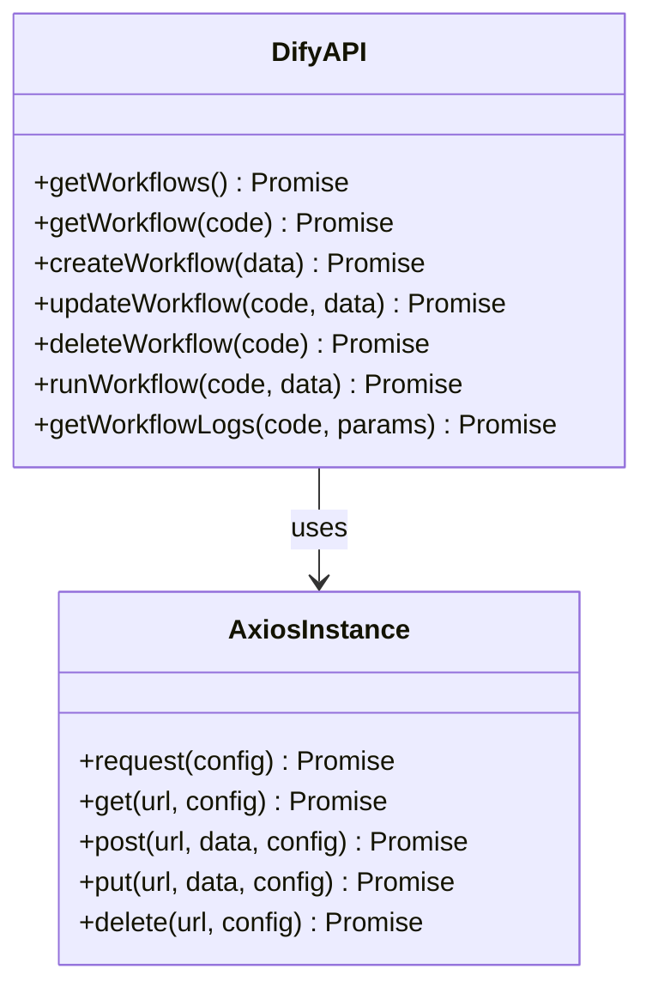

**图表来源**
- [frontend/src/api/dify.js:1-91](file://frontend/src/api/dify.js#L1-L91)

**章节来源**
- [frontend/src/api/dify.js:1-91](file://frontend/src/api/dify.js#L1-L91)

## 依赖关系分析

系统的关键依赖关系确保了模块间的松耦合和高内聚。

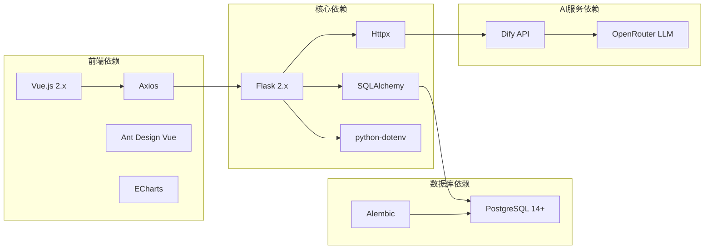

**图表来源**
- [backend_api_python/run.py:96-147](file://backend_api_python/run.py#L96-L147)
- [frontend/src/main.js:52-62](file://frontend/src/main.js#L52-L62)

### 数据库关系

系统使用关系型数据库存储工作流配置和执行日志：

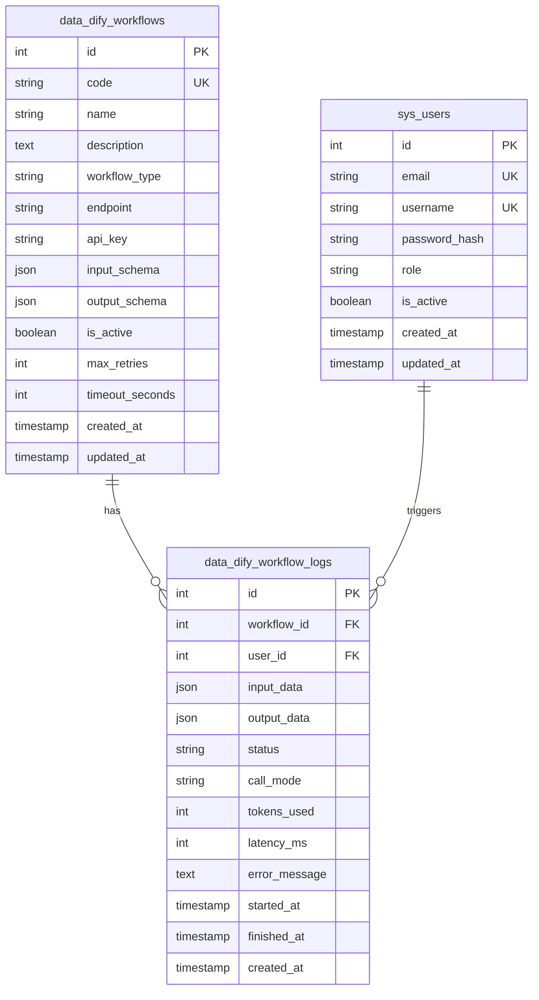

**图表来源**
- [backend_api_python/app/models/dify.py:16-84](file://backend_api_python/app/models/dify.py#L16-L84)

**章节来源**
- [backend_api_python/app/models/dify.py:16-84](file://backend_api_python/app/models/dify.py#L16-L84)

## 性能考虑

系统在设计时充分考虑了性能优化和可扩展性：

### 缓存策略

- **工作流配置缓存**：工作流配置在内存中缓存，减少数据库查询
- **API响应缓存**：频繁访问的数据使用Redis缓存
- **静态资源缓存**：前端静态资源设置合理的缓存头

### 连接池管理

- **数据库连接池**：使用SQLAlchemy连接池管理数据库连接
- **HTTP客户端连接池**：Httpx自动管理HTTP连接复用
- **线程池管理**：异步任务使用线程池避免阻塞

### 监控和日志

- **执行时间监控**：记录每个工作流执行的延迟时间
- **错误率统计**：跟踪API调用的成功率和失败率
- **资源使用监控**：监控内存和CPU使用情况

## 故障排除指南

### 常见问题及解决方案

#### 数据库连接问题

**症状**：应用启动时报数据库连接错误

**可能原因**：
- DATABASE_URL配置不正确
- PostgreSQL服务未启动
- 网络连接问题

**解决步骤**：
1. 检查.env文件中的DATABASE_URL配置
2. 验证PostgreSQL服务状态
3. 测试网络连通性

#### Dify API集成问题

**症状**：工作流执行失败，返回HTTP错误

**可能原因**：
- DIFY_API_BASE配置错误
- API密钥无效
- 网络代理配置问题

**解决步骤**：
1. 验证Dify服务可用性
2. 检查API密钥配置
3. 配置正确的网络代理

#### 权限认证问题

**症状**：API调用返回401未授权错误

**可能原因**：
- JWT令牌过期
- 用户权限不足
- 认证中间件配置错误

**解决步骤**：
1. 刷新JWT访问令牌
2. 检查用户角色权限
3. 验证认证配置

**章节来源**
- [backend_api_python/run.py:122-133](file://backend_api_python/run.py#L122-L133)

## 结论

AI工作流集成系统是一个功能完整、架构清晰的全栈解决方案。系统通过模块化设计实现了高度的可维护性和可扩展性，为AI工作流的集成和管理提供了强大的基础设施。

### 主要优势

1. **完整的生命周期管理**：从创建工作流到执行监控的全流程支持
2. **灵活的执行模式**：支持批处理和流式两种执行方式
3. **完善的监控体系**：详细的日志记录和性能监控
4. **安全可靠的架构**：基于角色的权限控制和数据加密
5. **良好的扩展性**：模块化设计便于功能扩展和定制

### 技术特色

- **前后端分离**：采用现代Web技术栈，提升开发效率
- **异步处理**：支持异步任务处理，提升系统响应性
- **数据库抽象**：使用ORM框架简化数据库操作
- **API标准化**：提供RESTful API接口，便于集成

该系统为量化交易和AI分析提供了坚实的技术基础，能够满足复杂金融应用场景的需求。