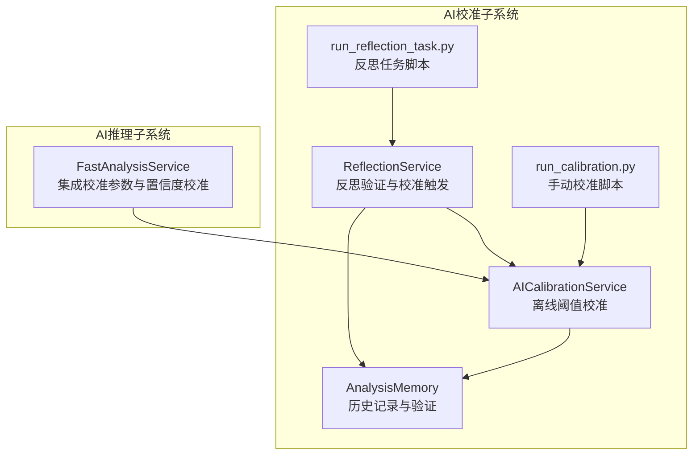
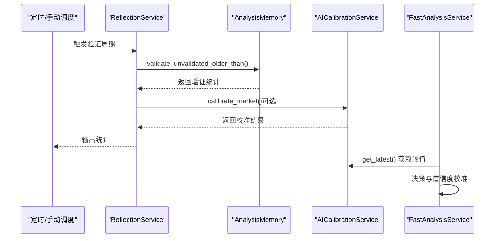
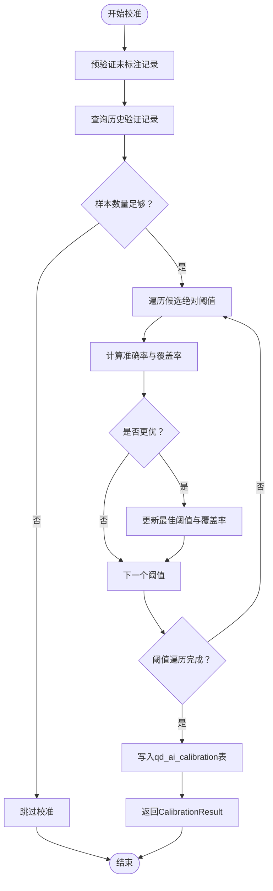
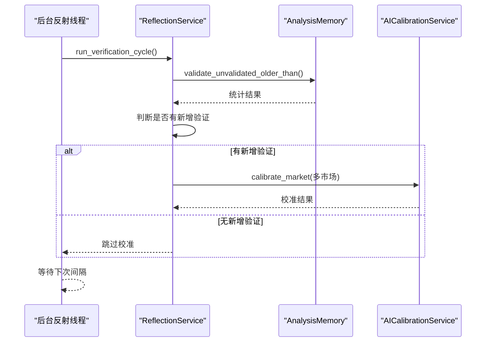
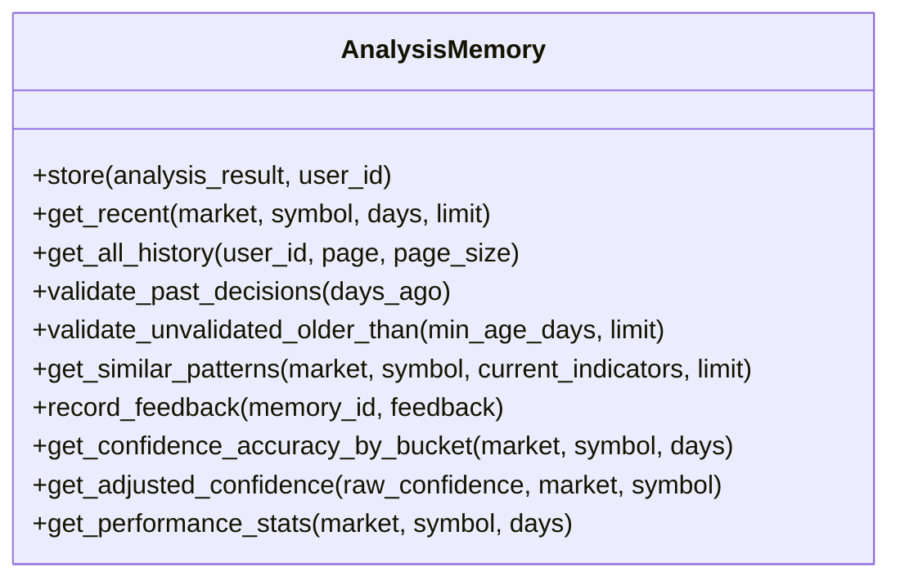
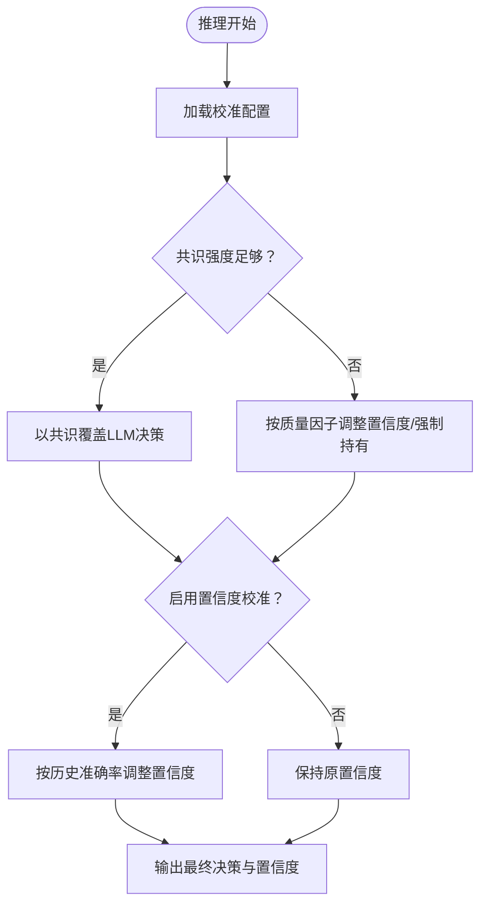
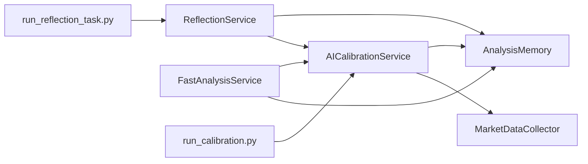

# AI校准系统

<cite>
**本文档引用的文件**
- [ai_calibration.py](file://backend_api_python/app/services/ai_calibration.py)
- [reflection.py](file://backend_api_python/app/services/reflection.py)
- [analysis_memory.py](file://backend_api_python/app/services/analysis_memory.py)
- [run_calibration.py](file://backend_api_python/scripts/run_calibration.py)
- [run_reflection_task.py](file://backend_api_python/scripts/run_reflection_task.py)
- [fast_analysis.py](file://backend_api_python/app/services/fast_analysis.py)
- [settings.py](file://backend_api_python/app/route/settings.py)
</cite>

## 目录
1. [简介](#简介)
2. [项目结构](#项目结构)
3. [核心组件](#核心组件)
4. [架构总览](#架构总览)
5. [详细组件分析](#详细组件分析)
6. [依赖关系分析](#依赖关系分析)
7. [性能考量](#性能考量)
8. [故障排查指南](#故障排查指南)
9. [结论](#结论)
10. [附录](#附录)

## 简介
本文件面向QuantDinger的AI校准系统，系统性阐述以下内容：
- AI校准机制的设计原理：基于历史分析结果的模型性能评估、参数阈值调整与反馈循环。
- 反思学习系统（Reflection System）的实现：历史记录验证、模式识别与学习算法。
- 使用示例：如何通过历史分析结果优化AI模型表现。
- 配置策略：校准策略配置、性能指标监控与自动化调整的最佳实践。

该系统通过“验证-校准-反馈”的闭环，使FastAnalysisService具备自适应能力，持续提升决策质量与稳定性。

## 项目结构
AI校准相关代码主要分布在后端Python服务层，涉及以下模块：
- AI校准服务：负责离线阈值搜索与参数持久化。
- 反思服务：周期性验证历史决策并触发校准。
- 分析记忆系统：存储与回溯历史分析记录，支持验证与统计。
- 脚本入口：手动执行校准与反思任务。
- FastAnalysis服务：集成校准参数，动态决策与置信度校准。

图表来源
- [ai_calibration.py:1-342](file://backend_api_python/app/services/ai_calibration.py#L1-L342)
- [reflection.py:1-101](file://backend_api_python/app/services/reflection.py#L1-L101)
- [analysis_memory.py:1-949](file://backend_api_python/app/services/analysis_memory.py#L1-L949)
- [run_calibration.py:1-36](file://backend_api_python/scripts/run_calibration.py#L1-L36)
- [run_reflection_task.py:1-34](file://backend_api_python/scripts/run_reflection_task.py#L1-L34)
- [fast_analysis.py:1300-1499](file://backend_api_python/app/services/fast_analysis.py#L1300-L1499)

章节来源
- [ai_calibration.py:1-342](file://backend_api_python/app/services/ai_calibration.py#L1-L342)
- [reflection.py:1-101](file://backend_api_python/app/services/reflection.py#L1-L101)
- [analysis_memory.py:1-949](file://backend_api_python/app/services/analysis_memory.py#L1-L949)
- [run_calibration.py:1-36](file://backend_api_python/scripts/run_calibration.py#L1-L36)
- [run_reflection_task.py:1-34](file://backend_api_python/scripts/run_reflection_task.py#L1-L34)
- [fast_analysis.py:1300-1499](file://backend_api_python/app/services/fast_analysis.py#L1300-L1499)

## 核心组件
- AICalibrationService：离线阈值校准，基于历史验证记录评估不同绝对阈值下的准确率与覆盖度，选择最优阈值并持久化。
- ReflectionService：周期性验证未标注的历史分析记录，统计正确率并按需触发AI校准。
- AnalysisMemory：分析记忆系统，负责历史记录的存储、检索、相似模式匹配与验证回填。
- FastAnalysisService：推理服务，集成校准参数，根据共识强度与质量因子决定是否强制共识决策，并进行置信度校准。
- 脚本入口：run_calibration.py与run_reflection_task.py分别提供手动与定时任务入口。

章节来源
- [ai_calibration.py:45-310](file://backend_api_python/app/services/ai_calibration.py#L45-L310)
- [reflection.py:22-75](file://backend_api_python/app/services/reflection.py#L22-L75)
- [analysis_memory.py:36-174](file://backend_api_python/app/services/analysis_memory.py#L36-L174)
- [fast_analysis.py:1308-1409](file://backend_api_python/app/services/fast_analysis.py#L1308-L1409)
- [run_calibration.py:18-31](file://backend_api_python/scripts/run_calibration.py#L18-L31)
- [run_reflection_task.py:11-29](file://backend_api_python/scripts/run_reflection_task.py#L11-L29)

## 架构总览
AI校准系统采用“验证-校准-反馈”闭环设计：
- 验证阶段：AnalysisMemory定期回填历史决策的正确性与实际收益。
- 校准阶段：AICalibrationService基于验证数据搜索最佳阈值，更新qd_ai_calibration表。
- 反馈阶段：ReflectionService周期性触发验证与校准，形成自动化闭环。
- 推理阶段：FastAnalysisService读取最新校准参数，动态调整决策与置信度。

图表来源
- [reflection.py:27-48](file://backend_api_python/app/services/reflection.py#L27-L48)
- [analysis_memory.py:701-778](file://backend_api_python/app/services/analysis_memory.py#L701-L778)
- [ai_calibration.py:163-310](file://backend_api_python/app/services/ai_calibration.py#L163-L310)
- [fast_analysis.py:1308-1409](file://backend_api_python/app/services/fast_analysis.py#L1308-L1409)

## 详细组件分析

### AI校准服务（AICalibrationService）
- 设计目标
  - 基于validated_at与actual_return_pct等字段，评估不同绝对阈值下预测决策的准确率。
  - 以consensus_score为主要客观信号，结合覆盖率与准确率择优。
- 关键流程
  - 预验证：优先回填历史未验证记录，确保样本有效性。
  - 数据筛选：限定时间窗口与有效字段，提取consensus_score与actual_return_pct。
  - 阈值搜索：遍历候选绝对阈值，计算准确率与覆盖度，择优并持久化。
- 参数与默认值
  - 默认阈值网格可通过环境变量覆盖。
  - 最小样本数与回看天数可配置。
- 输出
  - CalibrationResult包含市场、阈值、准确率、覆盖率、样本量等。

图表来源
- [ai_calibration.py:163-310](file://backend_api_python/app/services/ai_calibration.py#L163-L310)

章节来源
- [ai_calibration.py:37-42](file://backend_api_python/app/services/ai_calibration.py#L37-L42)
- [ai_calibration.py:132-145](file://backend_api_python/app/services/ai_calibration.py#L132-L145)
- [ai_calibration.py:147-162](file://backend_api_python/app/services/ai_calibration.py#L147-L162)
- [ai_calibration.py:163-310](file://backend_api_python/app/services/ai_calibration.py#L163-L310)

### 反思服务（ReflectionService）
- 设计目标
  - 定期验证历史未标注分析记录，统计正确率与错误率，作为学习数据。
  - 在有新验证时触发AI校准，形成自动化反馈循环。
- 关键流程
  - validate_unvalidated_older_than：批量回填历史记录的正确性与收益。
  - _maybe_run_calibration：按配置对多个市场执行离线校准。
  - 后台线程：按间隔周期运行，支持开关控制。

图表来源
- [reflection.py:27-75](file://backend_api_python/app/services/reflection.py#L27-L75)
- [analysis_memory.py:701-778](file://backend_api_python/app/services/analysis_memory.py#L701-L778)
- [ai_calibration.py:163-310](file://backend_api_python/app/services/ai_calibration.py#L163-L310)

章节来源
- [reflection.py:22-75](file://backend_api_python/app/services/reflection.py#L22-L75)
- [reflection.py:77-101](file://backend_api_python/app/services/reflection.py#L77-L101)

### 分析记忆系统（AnalysisMemory）
- 设计目标
  - 存储分析结果与共识指标，支持历史检索、相似模式匹配与验证回填。
- 关键功能
  - 存储与回填：将分析结果写入qd_analysis_memory，回填was_correct与actual_return_pct。
  - 相似模式匹配：基于RSI、MACD、MA趋势、波动等级等指标加权相似度。
  - 性能统计：按市场/符号聚合准确率、平均收益、决策分布与用户满意度。
  - 置信度校准：基于历史准确率对原始置信度进行调整。

图表来源
- [analysis_memory.py:36-949](file://backend_api_python/app/services/analysis_memory.py#L36-L949)

章节来源
- [analysis_memory.py:608-699](file://backend_api_python/app/services/analysis_memory.py#L608-L699)
- [analysis_memory.py:701-778](file://backend_api_python/app/services/analysis_memory.py#L701-L778)
- [analysis_memory.py:780-846](file://backend_api_python/app/services/analysis_memory.py#L780-L846)
- [analysis_memory.py:848-925](file://backend_api_python/app/services/analysis_memory.py#L848-L925)

### FastAnalysis服务中的校准集成
- 设计要点
  - 读取qd_ai_calibration最新配置，决定是否以共识覆盖LLM决策。
  - 当共识强度不足时，按质量因子调整置信度或强制持有。
  - 支持启用置信度校准，依据历史准确率对置信度进行缩放。
- 关键逻辑
  - _get_ai_calibration：带缓存读取最新阈值配置。
  - 决策与置信度：根据min_consensus_abs_override与quality_hold_threshold动态调整。
  - 置信度校准：ENABLE_CONFIDENCE_CALIBRATION开启时，按桶位历史准确率调整置信度。

图表来源
- [fast_analysis.py:1308-1409](file://backend_api_python/app/services/fast_analysis.py#L1308-L1409)
- [fast_analysis.py:2007-2028](file://backend_api_python/app/services/fast_analysis.py#L2007-L2028)

章节来源
- [fast_analysis.py:1308-1409](file://backend_api_python/app/services/fast_analysis.py#L1308-L1409)
- [fast_analysis.py:2007-2028](file://backend_api_python/app/services/fast_analysis.py#L2007-L2028)

### 脚本入口与自动化
- run_calibration.py：手动执行校准，支持单市场或多市场批量校准。
- run_reflection_task.py：本地运行反思验证任务，适合开发调试或一次性执行。
- 建议生产环境通过定时任务调度器（如cron）定期运行反思任务脚本。

章节来源
- [run_calibration.py:18-31](file://backend_api_python/scripts/run_calibration.py#L18-L31)
- [run_reflection_task.py:11-29](file://backend_api_python/scripts/run_reflection_task.py#L11-L29)

## 依赖关系分析
- AICalibrationService依赖AnalysisMemory进行历史数据验证与采样，依赖MarketDataCollector获取价格数据。
- ReflectionService依赖AnalysisMemory进行批量验证，并在有新增验证时触发AICalibrationService。
- FastAnalysisService依赖AICalibrationService获取阈值配置，并在必要时调用AnalysisMemory进行置信度校准。
- 脚本入口独立于服务层，通过导入服务模块执行离线任务。

图表来源
- [ai_calibration.py:30-31](file://backend_api_python/app/services/ai_calibration.py#L30-L31)
- [reflection.py:55-56](file://backend_api_python/app/services/reflection.py#L55-L56)
- [fast_analysis.py:2019-2020](file://backend_api_python/app/services/fast_analysis.py#L2019-L2020)

章节来源
- [ai_calibration.py:28-31](file://backend_api_python/app/services/ai_calibration.py#L28-L31)
- [reflection.py:50-74](file://backend_api_python/app/services/reflection.py#L50-L74)
- [fast_analysis.py:2019-2028](file://backend_api_python/app/services/fast_analysis.py#L2019-L2028)

## 性能考量
- 查询与索引
  - AnalysisMemory表包含针对market/symbol、created_at、validated_at等的索引，有助于快速筛选与排序。
  - 校准查询使用f-string拼接INTERVAL，注意SQL注入风险；当前实现为内部工具，建议严格限制输入范围。
- 缓存与TTL
  - FastAnalysisService对校准配置使用进程内缓存，TTL可配置，降低数据库访问压力。
- 并发与限流
  - 反思服务使用后台线程与事件等待，避免阻塞主线程；建议在高并发场景下增加队列与重试机制。
- 数据质量
  - 校准效果依赖历史记录的正确性与覆盖面，建议定期检查price_at_analysis与actual_return_pct的填充完整性。

[本节为通用性能讨论，不直接分析具体文件]

## 故障排查指南
- 校准失败
  - 现象：校准返回None或日志报错。
  - 排查：确认qd_analysis_memory中存在validated_at与actual_return_pct非空的历史记录；检查最小样本数与回看天数配置。
- 反思任务异常
  - 现象：反思验证统计为空或校准未触发。
  - 排查：确认ENABLE_REFLECTION_WORKER与REFLECTION_WORKER_INTERVAL_SEC配置；检查validate_unvalidated_older_than返回的统计。
- 置信度校准无效
  - 现象：ENABLE_CONFIDENCE_CALIBRATION开启但置信度未变化。
  - 排查：确认历史记录中confidence与was_correct字段存在且覆盖充足；检查get_confidence_accuracy_by_bucket返回桶映射。
- 数据库连接问题
  - 现象：所有服务均出现数据库错误。
  - 排查：检查DATABASE_URL与连接池配置；确认qd_analysis_memory与qd_ai_calibration表存在且权限正确。

章节来源
- [ai_calibration.py:216-218](file://backend_api_python/app/services/ai_calibration.py#L216-L218)
- [reflection.py:92-96](file://backend_api_python/app/services/reflection.py#L92-L96)
- [analysis_memory.py:780-820](file://backend_api_python/app/services/analysis_memory.py#L780-L820)

## 结论
QuantDinger的AI校准系统通过“验证-校准-反馈”的闭环，实现了对FastAnalysisService的自适应优化。AICalibrationService以历史验证数据驱动阈值搜索，ReflectionService保障数据新鲜度并触发自动化校准，AnalysisMemory提供强大的历史检索与统计能力，FastAnalysisService则将校准结果实时应用于决策与置信度调整。配合脚本入口与定时任务，系统可在生产环境中稳定运行并持续改进。

[本节为总结性内容，不直接分析具体文件]

## 附录

### 使用示例：通过历史分析结果优化AI模型表现
- 场景一：离线批量校准
  - 步骤：设置AI_CALIBRATION_MARKETS/Crypto,USStock，运行python scripts/run_calibration.py。
  - 作用：对指定市场执行离线阈值校准，生成qd_ai_calibration记录。
- 场景二：每日反思验证
  - 步骤：配置REFLECTION_WORKER_INTERVAL_SEC=86400，启动后台反射线程。
  - 作用：每日回填历史未验证记录并按需触发校准，形成自动化反馈。
- 场景三：置信度校准
  - 步骤：开启ENABLE_CONFIDENCE_CALIBRATION，FastAnalysisService将按历史准确率调整置信度。
  - 作用：缓解模型过度自信，提升置信度与实际表现的一致性。

章节来源
- [run_calibration.py:18-31](file://backend_api_python/scripts/run_calibration.py#L18-L31)
- [run_reflection_task.py:25-29](file://backend_api_python/scripts/run_reflection_task.py#L25-L29)
- [fast_analysis.py:1399-1409](file://backend_api_python/app/services/fast_analysis.py#L1399-L1409)

### 配置清单与最佳实践
- 校准策略配置
  - AI_CALIBRATION_MARKETS：逗号分隔的市场列表，默认"Crypto"。
  - AI_CALIBRATION_LOOKBACK_DAYS：校准回看天数，默认30。
  - AI_CALIBRATION_MIN_SAMPLES：最小样本数，默认80。
  - AI_CALIBRATION_CANDIDATE_ABS_THRESHOLDS：阈值候选网格，逗号分隔。
  - ENABLE_OFFLINE_AI_CALIBRATION：是否启用启动时离线校准，默认true。
- 反思与自动化
  - ENABLE_REFLECTION_WORKER：是否启用反思后台线程，默认true。
  - REFLECTION_WORKER_INTERVAL_SEC：反射任务间隔秒数，默认86400。
  - REFLECTION_MIN_AGE_DAYS：验证最小年龄天数，默认7。
  - REFLECTION_VALIDATE_LIMIT：每次验证最大条数，默认200。
- 推理与置信度
  - ENABLE_CONFIDENCE_CALIBRATION：是否启用置信度校准，默认false。
  - AI_CALIBRATION_CACHE_TTL_SEC：校准配置缓存TTL，默认300。

章节来源
- [settings.py:622-635](file://backend_api_python/app/route/settings.py#L622-L635)
- [reflection.py:34-35](file://backend_api_python/app/services/reflection.py#L34-L35)
- [fast_analysis.py:2012-2012](file://backend_api_python/app/services/fast_analysis.py#L2012-L2012)
- [ai_calibration.py:317-326](file://backend_api_python/app/services/ai_calibration.py#L317-L326)