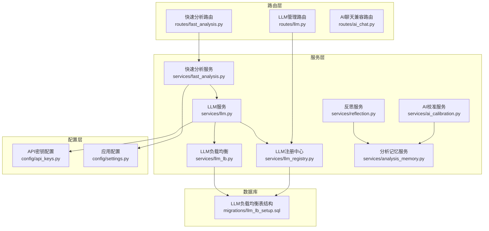
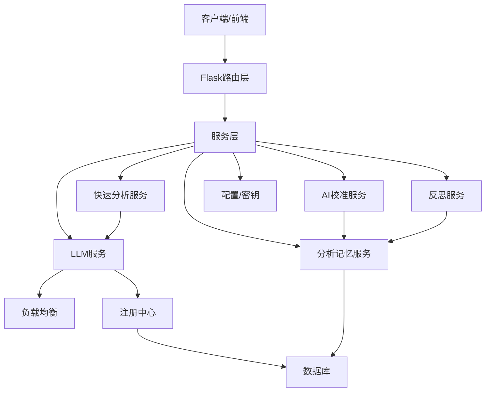
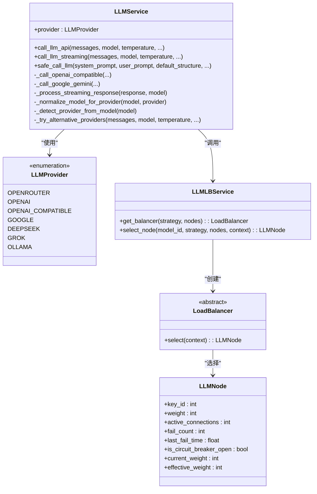
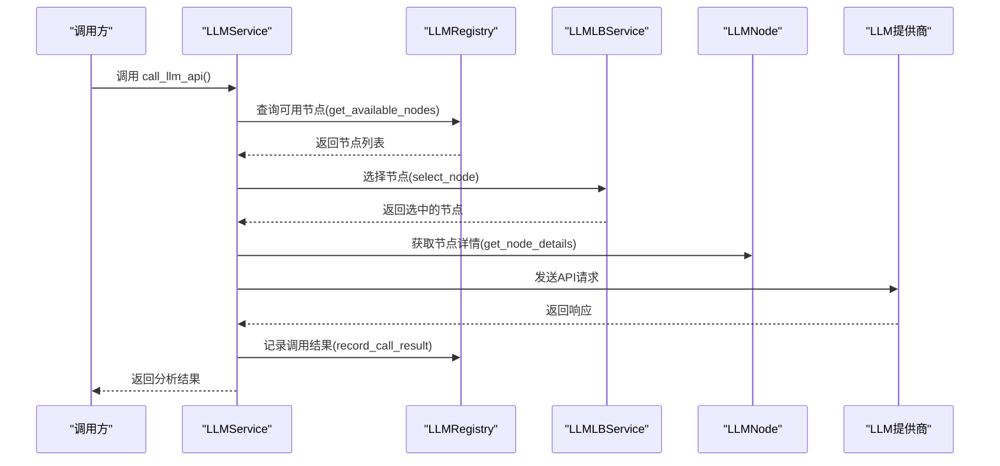
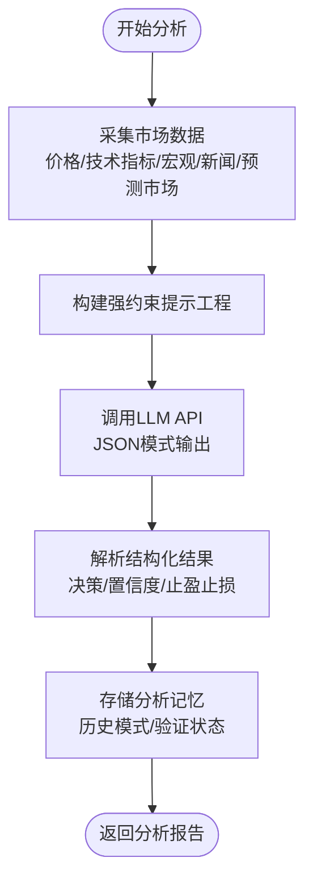
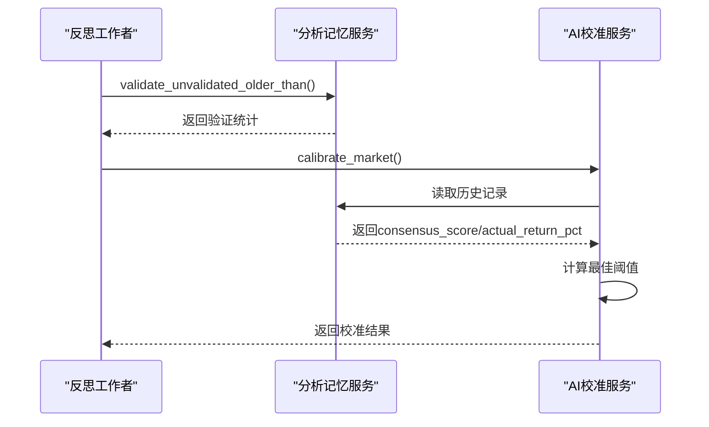
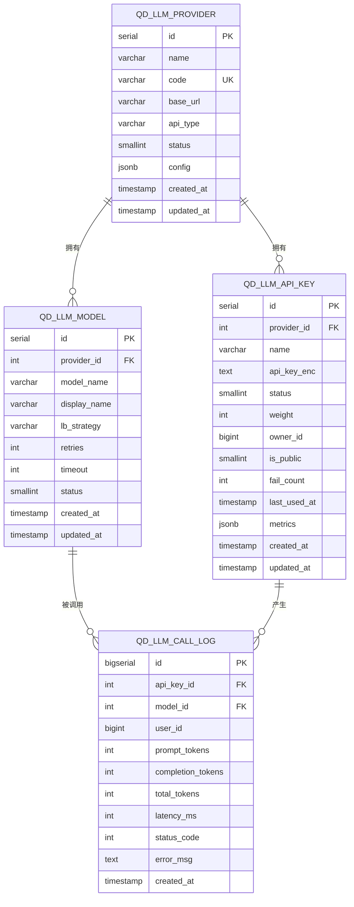
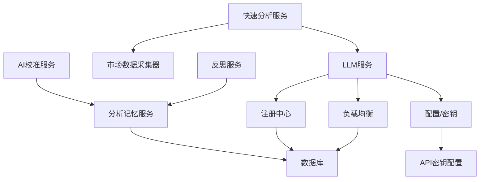
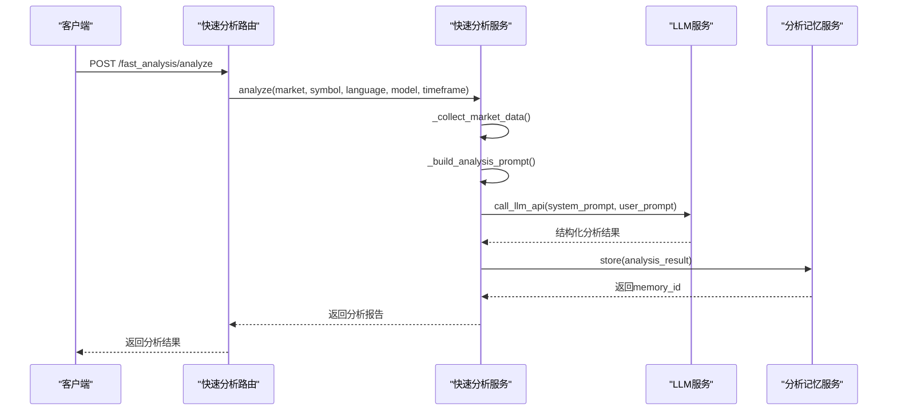

# AI研究分析系统

<cite>
**本文档引用的文件**
- [llm.py](file://backend_api_python/app/services/llm.py)
- [llm_lb.py](file://backend_api_python/app/services/llm_lb.py)
- [llm_registry.py](file://backend_api_python/app/services/llm_registry.py)
- [llm.py](file://backend_api_python/app/routes/llm.py)
- [fast_analysis.py](file://backend_api_python/app/services/fast_analysis.py)
- [fast_analysis.py](file://backend_api_python/app/routes/fast_analysis.py)
- [analysis_memory.py](file://backend_api_python/app/services/analysis_memory.py)
- [ai_calibration.py](file://backend_api_python/app/services/ai_calibration.py)
- [reflection.py](file://backend_api_python/app/services/reflection.py)
- [api_keys.py](file://backend_api_python/app/config/api_keys.py)
- [settings.py](file://backend_api_python/app/config/settings.py)
- [llm_lb_setup.sql](file://backend_api_python/migrations/llm_lb_setup.sql)
- [LLM 负载均衡调用系统设计方案.md](file://docs/LLM 负载均衡调用系统设计方案.md)
</cite>

## 目录
1. [简介](#简介)
2. [项目结构](#项目结构)
3. [核心组件](#核心组件)
4. [架构总览](#架构总览)
5. [详细组件分析](#详细组件分析)
6. [依赖关系分析](#依赖关系分析)
7. [性能考虑](#性能考虑)
8. [故障排除指南](#故障排除指南)
9. [结论](#结论)
10. [附录](#附录)

## 简介
QuantDinger的AI研究分析系统是一个面向金融市场的高性能分析平台，集成了多LLM提供商的统一调用能力、快速分析引擎、AI校准与反思学习机制。系统通过统一的数据采集层、单次LLM调用的强约束提示工程、以及基于历史决策的学习闭环，实现了从市场数据到可执行交易建议的自动化流程。

该系统的核心目标包括：
- 多LLM提供商集成与负载均衡调用
- 快速分析功能，支持实时市场数据与结构化输出
- AI校准机制，基于历史回测结果自动调整决策阈值
- 反思学习系统，持续验证与优化AI决策质量

## 项目结构
后端采用Flask微服务架构，主要模块分布如下：
- 服务层：LLM服务、快速分析服务、AI校准与反思服务、分析记忆服务
- 路由层：LLM管理路由、快速分析路由、AI聊天兼容路由
- 配置层：API密钥配置、应用配置
- 数据库：LLM负载均衡相关表结构与迁移脚本

**图表来源**
- [llm.py:1-723](file://backend_api_python/app/routes/llm.py#L1-L723)
- [fast_analysis.py:1-1004](file://backend_api_python/app/routes/fast_analysis.py#L1-L1004)
- [llm.py:1-813](file://backend_api_python/app/services/llm.py#L1-L813)
- [llm_lb.py:1-169](file://backend_api_python/app/services/llm_lb.py#L1-L169)
- [llm_registry.py:1-169](file://backend_api_python/app/services/llm_registry.py#L1-L169)
- [fast_analysis.py:1-2805](file://backend_api_python/app/services/fast_analysis.py#L1-L2805)
- [analysis_memory.py:1-949](file://backend_api_python/app/services/analysis_memory.py#L1-L949)
- [ai_calibration.py:1-342](file://backend_api_python/app/services/ai_calibration.py#L1-L342)
- [reflection.py:1-101](file://backend_api_python/app/services/reflection.py#L1-L101)
- [api_keys.py:1-164](file://backend_api_python/app/config/api_keys.py#L1-L164)
- [settings.py:1-99](file://backend_api_python/app/config/settings.py#L1-L99)
- [llm_lb_setup.sql:1-67](file://backend_api_python/migrations/llm_lb_setup.sql#L1-L67)

**章节来源**
- [llm.py:1-723](file://backend_api_python/app/routes/llm.py#L1-L723)
- [fast_analysis.py:1-1004](file://backend_api_python/app/routes/fast_analysis.py#L1-L1004)
- [llm.py:1-813](file://backend_api_python/app/services/llm.py#L1-L813)
- [llm_lb.py:1-169](file://backend_api_python/app/services/llm_lb.py#L1-L169)
- [llm_registry.py:1-169](file://backend_api_python/app/services/llm_registry.py#L1-L169)
- [fast_analysis.py:1-2805](file://backend_api_python/app/services/fast_analysis.py#L1-L2805)
- [analysis_memory.py:1-949](file://backend_api_python/app/services/analysis_memory.py#L1-L949)
- [ai_calibration.py:1-342](file://backend_api_python/app/services/ai_calibration.py#L1-L342)
- [reflection.py:1-101](file://backend_api_python/app/services/reflection.py#L1-L101)
- [api_keys.py:1-164](file://backend_api_python/app/config/api_keys.py#L1-L164)
- [settings.py:1-99](file://backend_api_python/app/config/settings.py#L1-L99)
- [llm_lb_setup.sql:1-67](file://backend_api_python/migrations/llm_lb_setup.sql#L1-L67)

## 核心组件
本节概述AI研究分析系统的关键组件及其职责：

- LLM服务（LLMService）
  - 支持多提供商（OpenRouter、OpenAI、Google Gemini、DeepSeek、Grok、Ollama）
  - 提供统一的API调用接口，支持JSON模式输出、流式响应、备用模型与替代提供商
  - 集成负载均衡与熔断机制，提升稳定性与可用性

- LLM负载均衡（LLMLBService）
  - 实现多种负载均衡策略：加权轮询、随机、一致性哈希、最少连接、轮询
  - 支持节点活跃连接数跟踪与熔断状态管理

- LLM注册中心（LLMRegistry）
  - 管理供应商、API密钥与模型配置
  - 提供可用节点查询、节点详情获取、调用结果记录与统计

- 快速分析服务（FastAnalysisService）
  - 统一数据采集层，整合价格、技术指标、宏观数据、新闻与预测市场数据
  - 单次LLM调用生成强约束结构化分析，包含决策、置信度、止盈止损与风险评估
  - 支持历史模式检索与相似条件匹配

- 分析记忆服务（AnalysisMemory）
  - 存储分析结果、历史模式、验证状态与用户反馈
  - 提供相似模式检索、批量验证与准确性统计

- AI校准与反思（AICalibrationService、ReflectionService）
  - 基于历史回测结果自动校准决策阈值
  - 定期验证未验证的历史决策并触发校准

- 配置与密钥管理
  - API密钥集中管理，支持环境变量与附加配置
  - 应用配置支持日志级别、速率限制、缓存开关等功能开关

**章节来源**
- [llm.py:73-813](file://backend_api_python/app/services/llm.py#L73-L813)
- [llm_lb.py:143-169](file://backend_api_python/app/services/llm_lb.py#L143-L169)
- [llm_registry.py:11-169](file://backend_api_python/app/services/llm_registry.py#L11-L169)
- [fast_analysis.py:186-2805](file://backend_api_python/app/services/fast_analysis.py#L186-L2805)
- [analysis_memory.py:36-949](file://backend_api_python/app/services/analysis_memory.py#L36-L949)
- [ai_calibration.py:57-342](file://backend_api_python/app/services/ai_calibration.py#L57-L342)
- [reflection.py:22-101](file://backend_api_python/app/services/reflection.py#L22-L101)
- [api_keys.py:148-164](file://backend_api_python/app/config/api_keys.py#L148-L164)
- [settings.py:1-99](file://backend_api_python/app/config/settings.py#L1-L99)

## 架构总览
系统采用分层架构，路由层负责请求接入与鉴权，服务层实现业务逻辑，配置层提供密钥与应用参数，数据库持久化负载均衡与分析记忆数据。

**图表来源**
- [llm.py:1-813](file://backend_api_python/app/services/llm.py#L1-L813)
- [llm_lb.py:1-169](file://backend_api_python/app/services/llm_lb.py#L1-L169)
- [llm_registry.py:1-169](file://backend_api_python/app/services/llm_registry.py#L1-L169)
- [fast_analysis.py:1-2805](file://backend_api_python/app/services/fast_analysis.py#L1-L2805)
- [analysis_memory.py:1-949](file://backend_api_python/app/services/analysis_memory.py#L1-L949)
- [ai_calibration.py:1-342](file://backend_api_python/app/services/ai_calibration.py#L1-L342)
- [reflection.py:1-101](file://backend_api_python/app/services/reflection.py#L1-L101)
- [api_keys.py:1-164](file://backend_api_python/app/config/api_keys.py#L1-L164)
- [settings.py:1-99](file://backend_api_python/app/config/settings.py#L1-L99)

## 详细组件分析

### LLM服务与多提供商集成
LLM服务封装了对多家LLM提供商的调用逻辑，支持OpenAI兼容API、Google Gemini等不同协议，并提供统一的错误处理与回退策略。

**图表来源**
- [llm.py:22-813](file://backend_api_python/app/services/llm.py#L22-L813)
- [llm_lb.py:7-169](file://backend_api_python/app/services/llm_lb.py#L7-L169)

**章节来源**
- [llm.py:73-813](file://backend_api_python/app/services/llm.py#L73-L813)
- [llm_lb.py:1-169](file://backend_api_python/app/services/llm_lb.py#L1-L169)

### LLM负载均衡调用系统
系统实现了多种负载均衡策略，结合熔断与重试机制，确保在多提供商、多密钥场景下的高可用与性能。

**图表来源**
- [llm.py:496-557](file://backend_api_python/app/services/llm.py#L496-L557)
- [llm_registry.py:18-169](file://backend_api_python/app/services/llm_registry.py#L18-L169)
- [llm_lb.py:163-169](file://backend_api_python/app/services/llm_lb.py#L163-L169)

**章节来源**
- [llm.py:496-557](file://backend_api_python/app/services/llm.py#L496-L557)
- [llm_registry.py:18-169](file://backend_api_python/app/services/llm_registry.py#L18-L169)
- [llm_lb.py:143-169](file://backend_api_python/app/services/llm_lb.py#L143-L169)

### 快速分析服务与强约束提示工程
快速分析服务通过统一数据采集器获取市场数据，构建强约束提示工程，单次LLM调用输出结构化分析结果。

**图表来源**
- [fast_analysis.py:203-761](file://backend_api_python/app/services/fast_analysis.py#L203-L761)
- [analysis_memory.py:175-235](file://backend_api_python/app/services/analysis_memory.py#L175-L235)

**章节来源**
- [fast_analysis.py:186-761](file://backend_api_python/app/services/fast_analysis.py#L186-L761)
- [analysis_memory.py:175-235](file://backend_api_python/app/services/analysis_memory.py#L175-L235)

### AI校准与反思学习系统
系统通过历史回测结果自动校准决策阈值，并定期验证未验证的历史决策，形成持续学习的闭环。

**图表来源**
- [reflection.py:27-75](file://backend_api_python/app/services/reflection.py#L27-L75)
- [analysis_memory.py:701-778](file://backend_api_python/app/services/analysis_memory.py#L701-L778)
- [ai_calibration.py:163-311](file://backend_api_python/app/services/ai_calibration.py#L163-L311)

**章节来源**
- [reflection.py:22-101](file://backend_api_python/app/services/reflection.py#L22-L101)
- [analysis_memory.py:701-778](file://backend_api_python/app/services/analysis_memory.py#L701-L778)
- [ai_calibration.py:163-311](file://backend_api_python/app/services/ai_calibration.py#L163-L311)

### LLM负载均衡数据库设计
系统通过标准化的数据库表结构管理LLM提供商、API密钥与模型配置，支持负载均衡策略与监控统计。

**图表来源**
- [llm_lb_setup.sql:1-67](file://backend_api_python/migrations/llm_lb_setup.sql#L1-L67)

**章节来源**
- [llm_lb_setup.sql:1-67](file://backend_api_python/migrations/llm_lb_setup.sql#L1-L67)

## 依赖关系分析
系统组件之间的依赖关系如下：

**图表来源**
- [llm.py:1-813](file://backend_api_python/app/services/llm.py#L1-L813)
- [llm_lb.py:1-169](file://backend_api_python/app/services/llm_lb.py#L1-L169)
- [llm_registry.py:1-169](file://backend_api_python/app/services/llm_registry.py#L1-L169)
- [fast_analysis.py:1-2805](file://backend_api_python/app/services/fast_analysis.py#L1-L2805)
- [analysis_memory.py:1-949](file://backend_api_python/app/services/analysis_memory.py#L1-L949)
- [ai_calibration.py:1-342](file://backend_api_python/app/services/ai_calibration.py#L1-L342)
- [reflection.py:1-101](file://backend_api_python/app/services/reflection.py#L1-L101)
- [api_keys.py:1-164](file://backend_api_python/app/config/api_keys.py#L1-L164)

**章节来源**
- [llm.py:1-813](file://backend_api_python/app/services/llm.py#L1-L813)
- [llm_lb.py:1-169](file://backend_api_python/app/services/llm_lb.py#L1-L169)
- [llm_registry.py:1-169](file://backend_api_python/app/services/llm_registry.py#L1-L169)
- [fast_analysis.py:1-2805](file://backend_api_python/app/services/fast_analysis.py#L1-L2805)
- [analysis_memory.py:1-949](file://backend_api_python/app/services/analysis_memory.py#L1-L949)
- [ai_calibration.py:1-342](file://backend_api_python/app/services/ai_calibration.py#L1-L342)
- [reflection.py:1-101](file://backend_api_python/app/services/reflection.py#L1-L101)
- [api_keys.py:1-164](file://backend_api_python/app/config/api_keys.py#L1-L164)

## 性能考虑
- 负载均衡策略选择
  - 加权轮询适合稳定且权重明确的场景
  - 一致性哈希适合需要会话粘性的场景
  - 最少连接适合高并发且节点性能差异较大的场景
- 超时与重试
  - 模型级超时与重试次数可在模型配置中调整
  - 熔断机制避免故障扩散，提升整体可用性
- 数据库索引与查询
  - 建议为LLM调用日志、API密钥状态等常用查询字段建立索引
- 缓存与日志
  - 可根据配置启用缓存与请求日志，平衡性能与可观测性

## 故障排除指南
- API密钥配置问题
  - 检查环境变量或附加配置中的密钥是否正确设置
  - 确认提供商代码与BaseURL配置一致
- 负载均衡与熔断
  - 查看API密钥状态是否被标记为熔断
  - 检查负载均衡策略与权重配置
- LLM调用异常
  - 关注402/403/404/429等状态码，按提示检查余额、权限与模型可用性
  - 开启流式响应时注意兼容性与错误处理
- 分析记忆与校准
  - 定期运行反思验证，确保历史决策得到及时验证
  - 校准阈值需满足最小样本数量要求

**章节来源**
- [llm.py:580-683](file://backend_api_python/app/services/llm.py#L580-L683)
- [llm_registry.py:112-169](file://backend_api_python/app/services/llm_registry.py#L112-L169)
- [reflection.py:27-75](file://backend_api_python/app/services/reflection.py#L27-L75)
- [analysis_memory.py:608-778](file://backend_api_python/app/services/analysis_memory.py#L608-L778)

## 结论
QuantDinger的AI研究分析系统通过多LLM提供商集成、统一的负载均衡与熔断机制、快速分析引擎与强约束提示工程，以及基于历史回测的AI校准与反思学习，构建了一个高效、稳健且可自我优化的金融分析平台。系统的设计兼顾了性能、可靠性与可扩展性，能够适应复杂的金融市场环境与多样化的业务需求。

## 附录

### API使用示例（自然语言生成市场分析报告）
以下为通过自然语言描述生成市场分析报告的典型流程：

**图表来源**
- [fast_analysis.py:113-346](file://backend_api_python/app/routes/fast_analysis.py#L113-L346)
- [fast_analysis.py:203-761](file://backend_api_python/app/services/fast_analysis.py#L203-L761)
- [llm.py:470-683](file://backend_api_python/app/services/llm.py#L470-L683)
- [analysis_memory.py:175-235](file://backend_api_python/app/services/analysis_memory.py#L175-L235)

**章节来源**
- [fast_analysis.py:113-346](file://backend_api_python/app/routes/fast_analysis.py#L113-L346)
- [fast_analysis.py:203-761](file://backend_api_python/app/services/fast_analysis.py#L203-L761)
- [llm.py:470-683](file://backend_api_python/app/services/llm.py#L470-L683)
- [analysis_memory.py:175-235](file://backend_api_python/app/services/analysis_memory.py#L175-L235)

### AI模型配置与调用频率限制
- 模型配置
  - 在模型表中配置负载均衡策略、重试次数与超时时间
  - 供应商表中配置BaseURL与API类型
  - API密钥表中配置权重与可见性
- 调用频率限制
  - 通过负载均衡策略与熔断机制控制调用频率
  - 可根据业务需求调整重试次数与超时时间
- 错误处理最佳实践
  - 优先使用备用模型与替代提供商
  - 记录调用日志与错误信息，便于追踪与分析
  - 定期清理与维护API密钥状态

**章节来源**
- [llm_lb_setup.sql:1-67](file://backend_api_python/migrations/llm_lb_setup.sql#L1-L67)
- [llm.py:580-683](file://backend_api_python/app/services/llm.py#L580-L683)
- [llm_registry.py:112-169](file://backend_api_python/app/services/llm_registry.py#L112-L169)