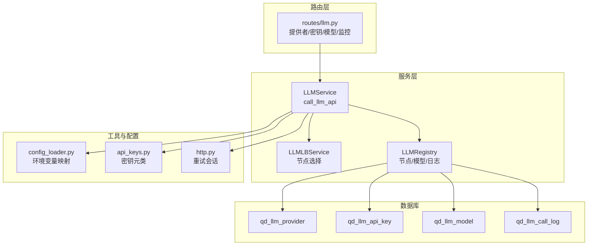
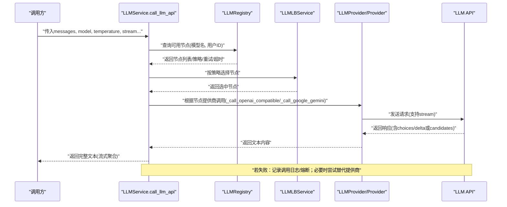
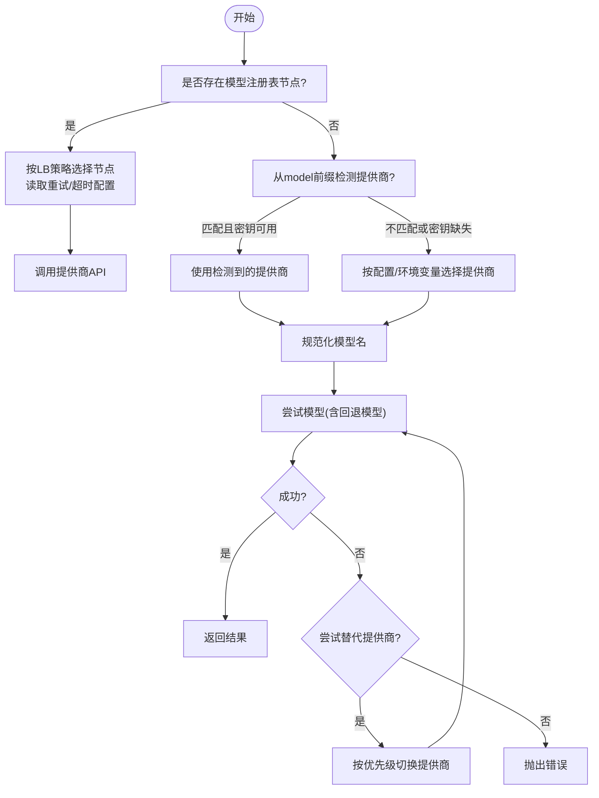
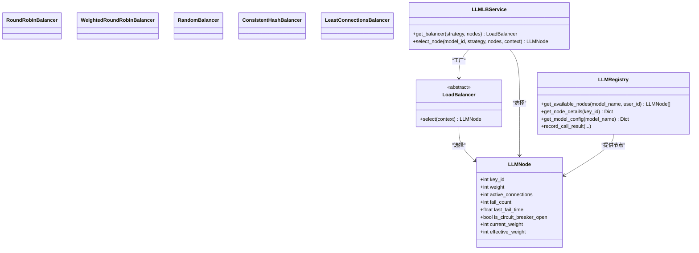
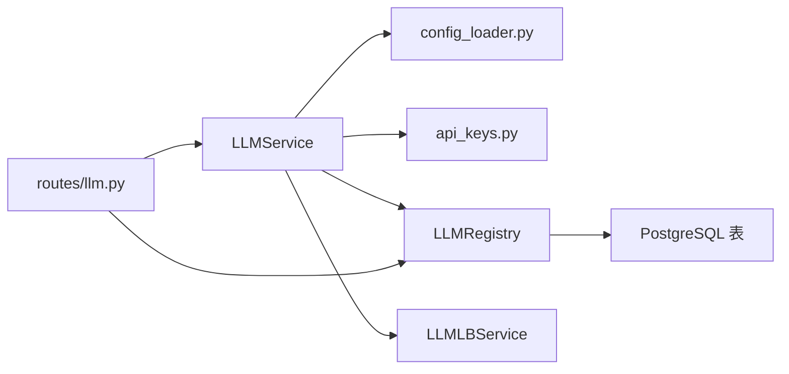

# LLM API调用机制

<cite>
**本文引用的文件列表**
- [llm.py](file://backend_api_python/app/services/llm.py)
- [llm_lb.py](file://backend_api_python/app/services/llm_lb.py)
- [llm_registry.py](file://backend_api_python/app/services/llm_registry.py)
- [llm.py（路由）](file://backend_api_python/app/routes/llm.py)
- [http.py](file://backend_api_python/app/utils/http.py)
- [api_keys.py](file://backend_api_python/app/config/api_keys.py)
- [config_loader.py](file://backend_api_python/app/utils/config_loader.py)
- [llm_lb_setup.sql](file://backend_api_python/migrations/llm_lb_setup.sql)
- [init.sql](file://backend_api_python/migrations/init.sql)
- [LLM_STREAMING_USAGE.md](file://backend_api_python/LLM_STREAMING_USAGE.md)
- [test_streaming.py](file://backend_api_python/test_streaming.py)
</cite>

## 目录
1. [简介](#简介)
2. [项目结构](#项目结构)
3. [核心组件](#核心组件)
4. [架构总览](#架构总览)
5. [详细组件分析](#详细组件分析)
6. [依赖关系分析](#依赖关系分析)
7. [性能考量](#性能考量)
8. [故障排查指南](#故障排查指南)
9. [结论](#结论)
10. [附录](#附录)

## 简介
本文件面向LLM API调用机制，聚焦于call_llm_api方法的完整实现，涵盖以下主题：
- 模型解析优先级与请求路由逻辑（负载均衡注册表 > 直接提供商检测 > 配置提供商 > 默认模型）
- OpenAI兼容API与Google Gemini API的差异化实现
- 流式响应处理机制与错误恢复策略
- 调用示例、错误码与超时处理
- 性能优化、重试与故障转移实践

## 项目结构
围绕LLM调用的核心代码位于后端Python服务中，主要文件如下：
- 服务层：app/services/llm.py（LLMService与call_llm_api）、app/services/llm_lb.py（负载均衡器）、app/services/llm_registry.py（注册中心）
- 路由层：app/routes/llm.py（提供者/密钥/模型/监控管理接口）
- 工具与配置：app/utils/http.py（HTTP重试会话）、app/utils/config_loader.py（环境变量映射）、app/config/api_keys.py（密钥元类）
- 数据库：migrations/llm_lb_setup.sql（LLM负载均衡相关表）、migrations/init.sql（初始化脚本）
- 文档与测试：LLM_STREAMING_USAGE.md（流式使用说明）、test_streaming.py（流式测试）

图示来源
- [llm.py](file://backend_api_python/app/services/llm.py)
- [llm_lb.py](file://backend_api_python/app/services/llm_lb.py)
- [llm_registry.py](file://backend_api_python/app/services/llm_registry.py)
- [config_loader.py](file://backend_api_python/app/utils/config_loader.py)
- [api_keys.py](file://backend_api_python/app/config/api_keys.py)
- [http.py](file://backend_api_python/app/utils/http.py)
- [llm.py（路由）](file://backend_api_python/app/routes/llm.py)
- [llm_lb_setup.sql](file://backend_api_python/migrations/llm_lb_setup.sql)

章节来源
- [llm.py](file://backend_api_python/app/services/llm.py)
- [llm_lb.py](file://backend_api_python/app/services/llm_lb.py)
- [llm_registry.py](file://backend_api_python/app/services/llm_registry.py)
- [llm.py（路由）](file://backend_api_python/app/routes/llm.py)
- [config_loader.py](file://backend_api_python/app/utils/config_loader.py)
- [api_keys.py](file://backend_api_python/app/config/api_keys.py)
- [http.py](file://backend_api_python/app/utils/http.py)
- [llm_lb_setup.sql](file://backend_api_python/migrations/llm_lb_setup.sql)

## 核心组件
- LLMService：统一LLM调用入口，负责模型解析、提供商选择、请求路由、错误处理与重试、流式处理。
- LLMLBService：基于策略的节点选择器，支持轮询、加权轮询、随机、一致性哈希、最少连接等。
- LLMRegistry：提供者/模型/密钥的注册与查询，记录调用日志与熔断状态。
- routes/llm.py：提供者、密钥、模型与监控的管理接口，配合LLMRegistry进行运维。
- config_loader.py：将环境变量映射为嵌套配置，供LLMService读取。
- api_keys.py：密钥元类，按优先级从环境变量或配置中获取各提供商密钥。
- http.py：全局重试会话，为外部HTTP调用提供基础重试能力（当前LLMService内部使用requests直连，未强制复用该会话）。

章节来源
- [llm.py](file://backend_api_python/app/services/llm.py)
- [llm_lb.py](file://backend_api_python/app/services/llm_lb.py)
- [llm_registry.py](file://backend_api_python/app/services/llm_registry.py)
- [llm.py（路由）](file://backend_api_python/app/routes/llm.py)
- [config_loader.py](file://backend_api_python/app/utils/config_loader.py)
- [api_keys.py](file://backend_api_python/app/config/api_keys.py)
- [http.py](file://backend_api_python/app/utils/http.py)

## 架构总览
下图展示了call_llm_api的调用流程与关键决策点，包括负载均衡注册表、模型解析、提供商选择、请求路由与错误恢复。

图示来源
- [llm.py](file://backend_api_python/app/services/llm.py)
- [llm_lb.py](file://backend_api_python/app/services/llm_lb.py)
- [llm_registry.py](file://backend_api_python/app/services/llm_registry.py)

## 详细组件分析

### call_llm_api 方法与模型解析优先级
- 负载均衡注册表优先：当指定model且存在注册表中的可用节点时，按模型配置的LB策略与重试/超时参数进行调用。
- 直接提供商检测：若model带有前缀（如openai/、google/、deepseek/、x-ai/），且对应提供商密钥已配置，则直接使用该提供商。
- 配置提供商：若未显式指定提供商，按配置或环境变量选择（优先级：DeepSeek > Grok > OpenAI > Google > OpenRouter）。
- 默认模型：若解析失败或不匹配，使用提供商默认模型或回退模型。
- 回退策略：对OpenAI兼容API，支持在当前提供商内尝试回退模型；对403/402等常见错误，可尝试替代提供商。

图示来源
- [llm.py](file://backend_api_python/app/services/llm.py)

章节来源
- [llm.py](file://backend_api_python/app/services/llm.py)

### OpenAI兼容API调用
- 请求路径：/chat/completions
- 请求头：Authorization: Bearer {api_key}，Content-Type: application/json
- 特殊头：OpenRouter需HTTP-Referer与X-Title
- JSON模式：通过response_format.json_schema请求更稳定的JSON输出
- 流式：stream=true，按Server-Sent Events格式逐块解析choices[0].delta.content
- 错误处理：捕获HTTP错误，解析error.message，针对OpenRouter给出针对性提示

章节来源
- [llm.py](file://backend_api_python/app/services/llm.py)

### Google Gemini API调用
- 请求路径：/models/{model}:generateContent?key={api_key}
- 消息格式转换：将OpenAI风格messages转换为Gemini contents/systemInstruction
- JSON模式：generationConfig.responseMimeType设为application/json
- 流式：当前未实现流式，若stream=True会降级为非流式

章节来源
- [llm.py](file://backend_api_python/app/services/llm.py)

### 流式响应处理机制
- SSE解析：逐行读取data: {...}，解析choices[0].delta.content
- 完成标记：遇到[DONE]结束
- 容错：解析失败时若已有部分内容，返回部分结果并记录警告
- 适配：当前返回完整文本，如需实时推送需在上层扩展WebSocket推送

章节来源
- [llm.py](file://backend_api_python/app/services/llm.py)
- [LLM_STREAMING_USAGE.md](file://backend_api_python/LLM_STREAMING_USAGE.md)

### 负载均衡与注册中心
- 注册中心（LLMRegistry）：
  - 查询可用节点：按模型名与权限过滤，返回权重、失败计数、熔断状态
  - 获取节点详情：解密API密钥与提供商信息
  - 记录调用结果：插入调用日志，更新密钥失败计数与熔断状态
- 负载均衡（LLMLBService）：
  - 支持策略：轮询、加权轮询、随机、一致性哈希、最少连接
  - 节点状态：活跃连接数、失败计数、熔断标志
- 数据库表：
  - qd_llm_provider：提供商信息
  - qd_llm_api_key：API密钥与权重、状态、失败计数
  - qd_llm_model：模型与LB策略、重试次数、超时
  - qd_llm_call_log：调用日志与统计

图示来源
- [llm_lb.py](file://backend_api_python/app/services/llm_lb.py)
- [llm_registry.py](file://backend_api_python/app/services/llm_registry.py)

章节来源
- [llm_lb.py](file://backend_api_python/app/services/llm_lb.py)
- [llm_registry.py](file://backend_api_python/app/services/llm_registry.py)
- [llm_lb_setup.sql](file://backend_api_python/migrations/llm_lb_setup.sql)

### 错误处理与重试机制
- HTTP错误：捕获HTTPError，记录状态码与错误详情，对402/403/404/429尝试回退或替代提供商
- JSON模式错误：对OpenAI兼容API，通过json_schema提升稳定性
- 流式错误：解析失败时返回部分结果，避免完全中断
- 熔断：连续失败达到阈值（如5次）进入熔断状态，停止使用该密钥
- 超时：按模型配置或提供商默认超时设置

章节来源
- [llm.py](file://backend_api_python/app/services/llm.py)
- [llm_registry.py](file://backend_api_python/app/services/llm_registry.py)

### 调用示例与最佳实践
- 非流式调用（默认）：适合短回复与JSON结构化输出
- 流式调用：适合长文本生成，内部聚合后再返回完整内容
- JSON模式：在分析场景中建议开启，提高稳定性
- 替代提供商：当403/402等错误发生时，自动尝试DeepSeek/Grok/OpenAI/Google/OpenRouter
- 超时与重试：根据业务场景调整模型配置的retries与timeout

章节来源
- [LLM_STREAMING_USAGE.md](file://backend_api_python/LLM_STREAMING_USAGE.md)
- [test_streaming.py](file://backend_api_python/test_streaming.py)

## 依赖关系分析
- LLMService依赖：
  - config_loader：读取环境变量映射的配置
  - api_keys：获取各提供商密钥
  - LLMRegistry：查询节点与记录调用
  - LLMLBService：节点选择
  - requests：HTTP调用
- LLMRegistry依赖数据库表：qd_llm_provider、qd_llm_api_key、qd_llm_model、qd_llm_call_log
- 路由层依赖LLMService与LLMRegistry，提供管理接口

图示来源
- [llm.py](file://backend_api_python/app/services/llm.py)
- [config_loader.py](file://backend_api_python/app/utils/config_loader.py)
- [api_keys.py](file://backend_api_python/app/config/api_keys.py)
- [llm_registry.py](file://backend_api_python/app/services/llm_registry.py)
- [llm.py（路由）](file://backend_api_python/app/routes/llm.py)
- [llm_lb_setup.sql](file://backend_api_python/migrations/llm_lb_setup.sql)

章节来源
- [llm.py](file://backend_api_python/app/services/llm.py)
- [llm_registry.py](file://backend_api_python/app/services/llm_registry.py)
- [llm.py（路由）](file://backend_api_python/app/routes/llm.py)
- [llm_lb_setup.sql](file://backend_api_python/migrations/llm_lb_setup.sql)

## 性能考量
- 流式 vs 非流式：流式模式在首字延迟上有优势，但总耗时与内存占用略高；当前实现仍返回完整内容，如需实时推送需扩展WebSocket
- 负载均衡策略：加权轮询、最少连接等策略可提升吞吐与稳定性；一致性哈希可保证用户视角的稳定性
- 超时与重试：合理设置模型超时与重试次数，避免长时间阻塞；对429限流进行退避
- 熔断：连续失败触发熔断，降低对下游的压力
- 缓存与配置：环境变量映射与配置缓存减少重复解析开销

## 故障排查指南
- 常见错误码与处理
  - 402/403：API密钥问题或余额不足，检查密钥配置与账户状态
  - 404：模型不可用或隐私限制，检查模型权限与提供商策略
  - 429：限流，适当增加重试间隔或切换提供商
- 日志与监控
  - 调用日志：记录状态码、错误信息、耗时，便于定位问题
  - 熔断状态：查看密钥状态是否被置为熔断
- 流式问题
  - 解析失败：检查SSE格式与choices/delta结构
  - 部分内容返回：确认容错策略与日志级别

章节来源
- [llm.py](file://backend_api_python/app/services/llm.py)
- [llm_registry.py](file://backend_api_python/app/services/llm_registry.py)
- [LLM_STREAMING_USAGE.md](file://backend_api_python/LLM_STREAMING_USAGE.md)

## 结论
本机制通过“负载均衡注册表优先”的策略，结合智能模型解析与提供商选择，实现了高可用、可扩展的LLM调用体系。OpenAI兼容与Google Gemini的差异化实现满足多提供商需求；流式处理与完善的错误恢复策略提升了用户体验与稳定性。配合数据库化的注册中心与路由管理接口，可实现灵活的运维与监控。

## 附录
- 数据库初始化与LLM负载均衡表结构参见migrations脚本
- 流式使用说明与测试样例参见LLM_STREAMING_USAGE.md与test_streaming.py

章节来源
- [llm_lb_setup.sql](file://backend_api_python/migrations/llm_lb_setup.sql)
- [init.sql](file://backend_api_python/migrations/init.sql)
- [LLM_STREAMING_USAGE.md](file://backend_api_python/LLM_STREAMING_USAGE.md)
- [test_streaming.py](file://backend_api_python/test_streaming.py)