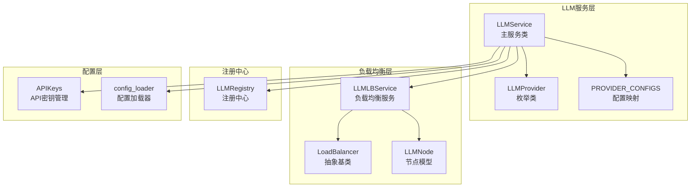
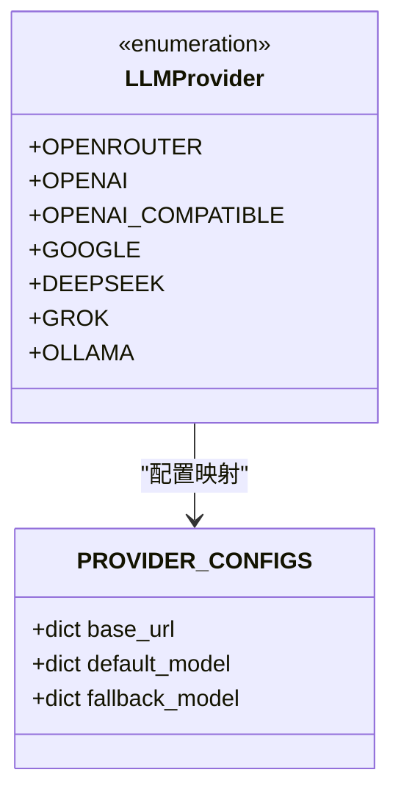
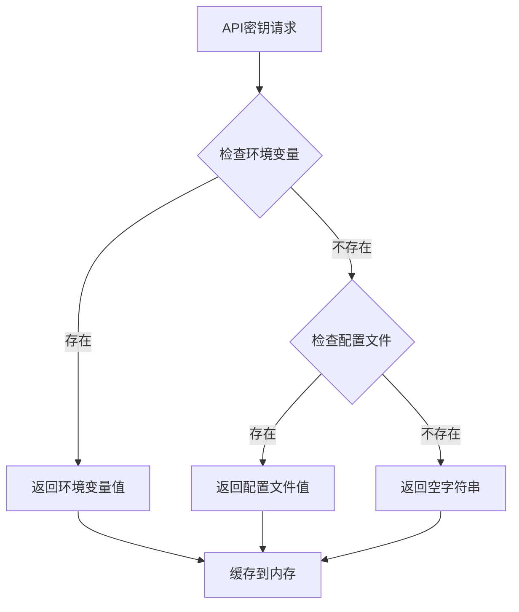
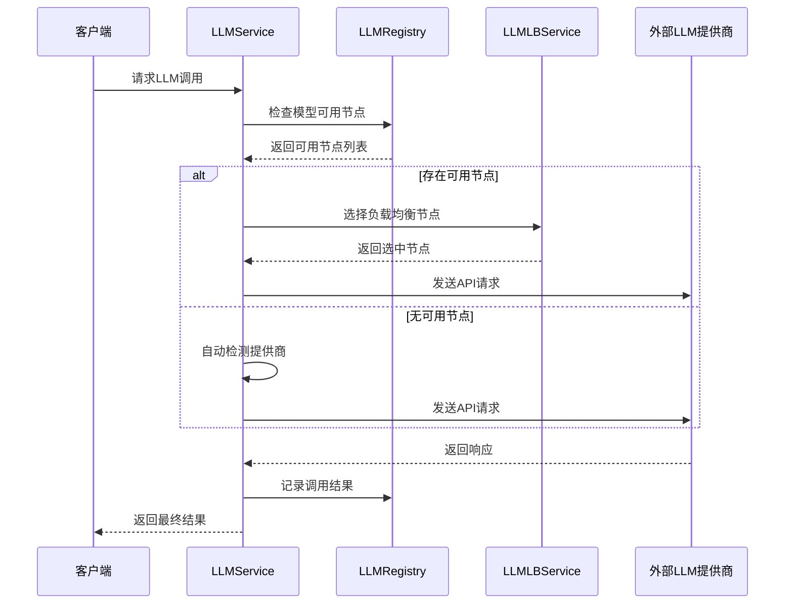
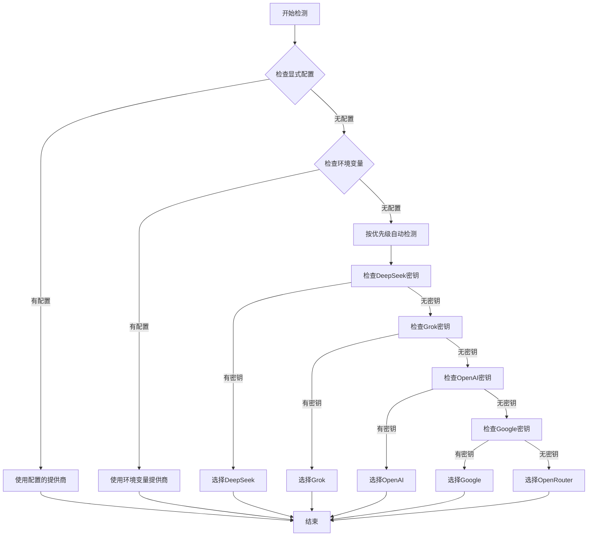
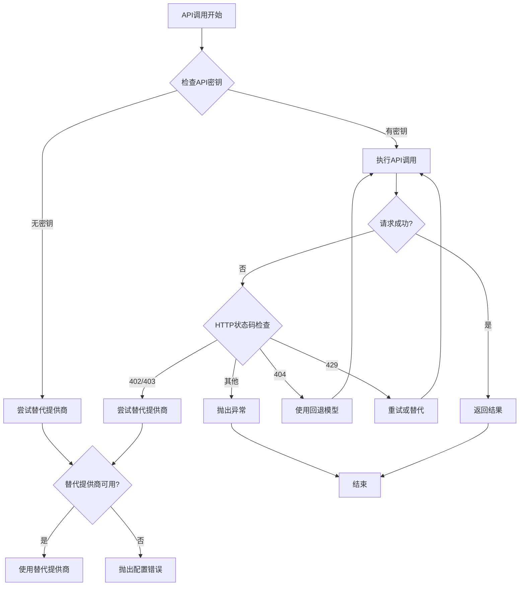
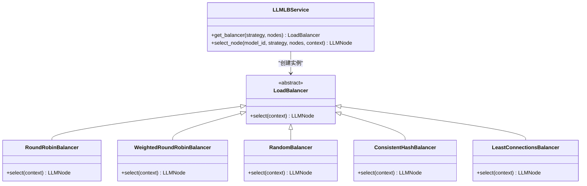
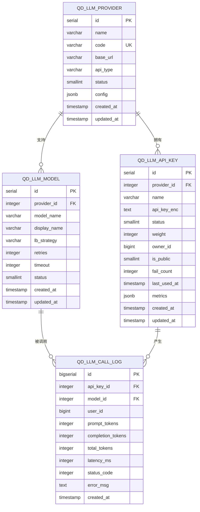
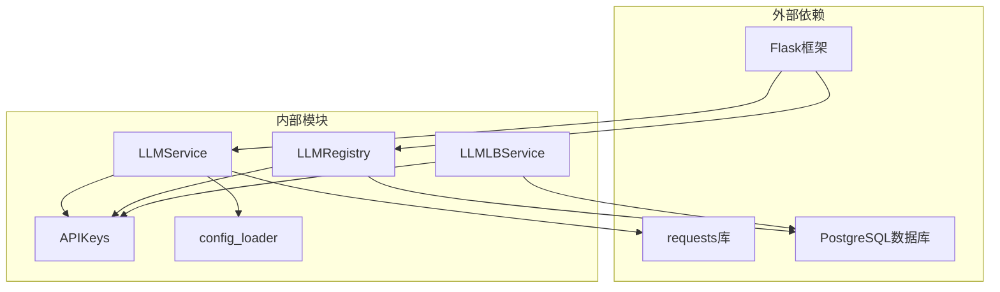

# LLM提供商管理

<cite>
**本文档引用的文件**
- [llm.py](file://backend_api_python/app/services/llm.py)
- [llm_registry.py](file://backend_api_python/app/services/llm_registry.py)
- [llm_lb.py](file://backend_api_python/app/services/llm_lb.py)
- [api_keys.py](file://backend_api_python/app/config/api_keys.py)
- [config_loader.py](file://backend_api_python/app/utils/config_loader.py)
- [llm.py](file://backend_api_python/app/routes/llm.py)
- [env.example](file://backend_api_python/env.example)
- [llm_lb_setup.sql](file://backend_api_python/migrations/llm_lb_setup.sql)
</cite>

## 目录
1. [简介](#简介)
2. [项目结构](#项目结构)
3. [核心组件](#核心组件)
4. [架构概览](#架构概览)
5. [详细组件分析](#详细组件分析)
6. [依赖关系分析](#依赖关系分析)
7. [性能考量](#性能考量)
8. [故障排除指南](#故障排除指南)
9. [结论](#结论)
10. [附录](#附录)

## 简介
本文件为QuantDinger项目的LLM提供商管理系统提供详细技术文档。该系统支持多家LLM提供商，包括OpenRouter、OpenAI、Google Gemini、DeepSeek、Grok和Ollama，并提供了智能的提供商自动检测机制、负载均衡策略和错误处理流程。

## 项目结构
LLM提供商管理系统主要分布在以下模块中：



**图表来源**
- [llm.py:22-70](file://backend_api_python/app/services/llm.py#L22-L70)
- [llm_lb.py:7-23](file://backend_api_python/app/services/llm_lb.py#L7-L23)
- [llm_registry.py:11-169](file://backend_api_python/app/services/llm_registry.py#L11-L169)

**章节来源**
- [llm.py:1-155](file://backend_api_python/app/services/llm.py#L1-L155)
- [llm_lb.py:1-169](file://backend_api_python/app/services/llm_lb.py#L1-L169)
- [llm_registry.py:1-169](file://backend_api_python/app/services/llm_registry.py#L1-L169)

## 核心组件

### LLMProvider枚举类设计
LLMProvider枚举类定义了系统支持的所有LLM提供商类型：



**图表来源**
- [llm.py:22-70](file://backend_api_python/app/services/llm.py#L22-L70)

系统支持的提供商类型及默认配置：
- **OpenRouter**: 支持多模型聚合，基础URL为openrouter.ai/api/v1
- **OpenAI**: 直连OpenAI API，支持gpt-4o系列模型
- **OpenAI-Compatible**: 自定义兼容接口，如NVIDIA GPUStack
- **Google Gemini**: Google的Gemini系列模型
- **DeepSeek**: 深度求索AI平台
- **Grok**: xAI的Grok模型
- **Ollama**: 本地模型运行服务

**章节来源**
- [llm.py:22-70](file://backend_api_python/app/services/llm.py#L22-L70)

### API密钥管理机制
API密钥通过元类APIKeys统一管理，支持环境变量和配置文件两种方式：



**图表来源**
- [api_keys.py:64-111](file://backend_api_python/app/config/api_keys.py#L64-L111)

**章节来源**
- [api_keys.py:1-164](file://backend_api_python/app/config/api_keys.py#L1-L164)

## 架构概览



**图表来源**
- [llm.py:486-562](file://backend_api_python/app/services/llm.py#L486-L562)
- [llm_lb.py:163-169](file://backend_api_python/app/services/llm_lb.py#L163-L169)
- [llm_registry.py:112-169](file://backend_api_python/app/services/llm_registry.py#L112-L169)

## 详细组件分析

### 提供商自动检测机制

系统实现了智能的提供商自动检测，具有明确的优先级顺序：



**图表来源**
- [llm.py:85-125](file://backend_api_python/app/services/llm.py#L85-L125)

自动检测的优先级顺序：DeepSeek > Grok > OpenAI > Google > OpenRouter

**章节来源**
- [llm.py:85-125](file://backend_api_python/app/services/llm.py#L85-L125)

### 错误处理与智能切换逻辑

系统实现了多层次的错误处理和智能切换机制：



**图表来源**
- [llm.py:586-722](file://backend_api_python/app/services/llm.py#L586-L722)

**章节来源**
- [llm.py:586-722](file://backend_api_python/app/services/llm.py#L586-L722)

### 负载均衡策略实现

系统支持多种负载均衡策略：



**图表来源**
- [llm_lb.py:24-169](file://backend_api_python/app/services/llm_lb.py#L24-L169)

支持的负载均衡策略：
- **轮询(Round Robin)**: 基础的轮询算法
- **加权轮询(Weighted Round Robin)**: 基于权重的平滑轮询
- **随机(Random)**: 基于权重的随机选择
- **一致性哈希(Consistent Hash)**: 基于用户ID的一致性哈希
- **最少连接(Least Connections)**: 选择活跃连接数最少的节点

**章节来源**
- [llm_lb.py:143-169](file://backend_api_python/app/services/llm_lb.py#L143-L169)

### 数据库架构设计

系统使用PostgreSQL存储LLM提供商相关信息：



**图表来源**
- [llm_lb_setup.sql:1-67](file://backend_api_python/migrations/llm_lb_setup.sql#L1-L67)

**章节来源**
- [llm_lb_setup.sql:1-67](file://backend_api_python/migrations/llm_lb_setup.sql#L1-L67)

## 依赖关系分析



**图表来源**
- [llm.py:1-18](file://backend_api_python/app/services/llm.py#L1-L18)
- [llm_registry.py:1-8](file://backend_api_python/app/services/llm_registry.py#L1-L8)

**章节来源**
- [llm.py:1-18](file://backend_api_python/app/services/llm.py#L1-L18)
- [llm_registry.py:1-8](file://backend_api_python/app/services/llm_registry.py#L1-L8)

## 性能考量

### 负载均衡性能优化
- **节点缓存**: LLMLBService维护节点缓存，避免重复查询
- **线程安全**: 使用锁机制确保并发安全性
- **熔断器**: 当节点连续失败达到阈值时自动熔断

### 缓存策略
- **配置缓存**: config_loader缓存解析后的配置
- **节点选择**: 负载均衡器实例复用

### 连接池管理
- **数据库连接池**: 使用ThreadedConnectionPool管理数据库连接
- **超时控制**: 每个提供商都有独立的超时配置

## 故障排除指南

### 常见问题诊断

**API密钥配置问题**
- 检查.env文件中的API密钥是否正确设置
- 验证API密钥格式和权限范围
- 确认提供商账户余额充足

**负载均衡问题**
- 检查数据库中API密钥的状态字段
- 验证权重配置是否合理
- 查看熔断器状态

**网络连接问题**
- 检查提供商的基础URL配置
- 验证防火墙和代理设置
- 确认DNS解析正常

**章节来源**
- [llm.py:677-683](file://backend_api_python/app/services/llm.py#L677-L683)

### 调试建议
1. 启用详细的日志记录
2. 检查API响应状态码
3. 验证模型名称前缀匹配
4. 监控负载均衡节点状态

## 结论

QuantDinger的LLM提供商管理系统提供了完整的企业级解决方案，具有以下特点：

1. **多提供商支持**: 支持主流LLM提供商，满足不同需求
2. **智能检测**: 自动检测可用提供商，减少人工配置
3. **高可用性**: 多层错误处理和智能切换机制
4. **可扩展性**: 模块化设计，易于添加新的提供商
5. **可观测性**: 完整的调用日志和监控指标

该系统适合需要管理多个LLM提供商的企业应用场景，提供了可靠的负载均衡和故障转移能力。

## 附录

### 配置示例

**环境变量配置示例**
```bash
# 设置默认提供商
LLM_PROVIDER=openrouter

# OpenRouter配置
OPENROUTER_API_KEY=your_openrouter_key_here
OPENROUTER_MODEL=openai/gpt-4o

# OpenAI配置
OPENAI_API_KEY=your_openai_key_here
OPENAI_MODEL=gpt-4o

# Google配置
GOOGLE_API_KEY=your_google_key_here
GOOGLE_MODEL=gemini-1.5-flash

# DeepSeek配置
DEEPSEEK_API_KEY=your_deepseek_key_here
DEEPSEEK_MODEL=deepseek-chat

# Grok配置
GROK_API_KEY=your_grok_key_here
GROK_MODEL=grok-beta
```

**配置文件结构**
```yaml
# LLM提供商配置
llm:
  provider: openrouter  # 默认提供商

openrouter:
  api_key: your_key
  model: openai/gpt-4o
  fallback_model: openai/gpt-4o-mini

openai:
  api_key: your_key
  model: gpt-4o
  fallback_model: gpt-4o-mini

google:
  api_key: your_key
  model: gemini-1.5-flash

deepseek:
  api_key: your_key
  model: deepseek-chat

grok:
  api_key: your_key
  model: grok-beta
```

**章节来源**
- [env.example:64-84](file://backend_api_python/env.example#L64-L84)
- [config_loader.py:60-104](file://backend_api_python/app/utils/config_loader.py#L60-L104)