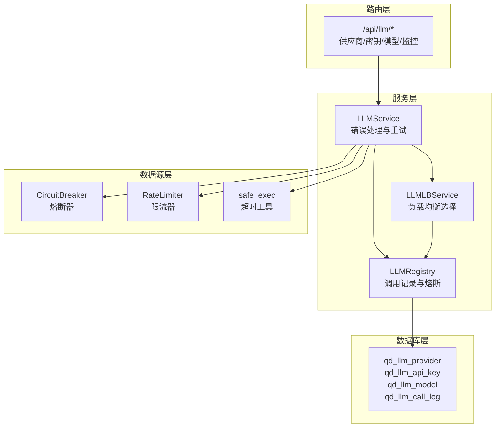
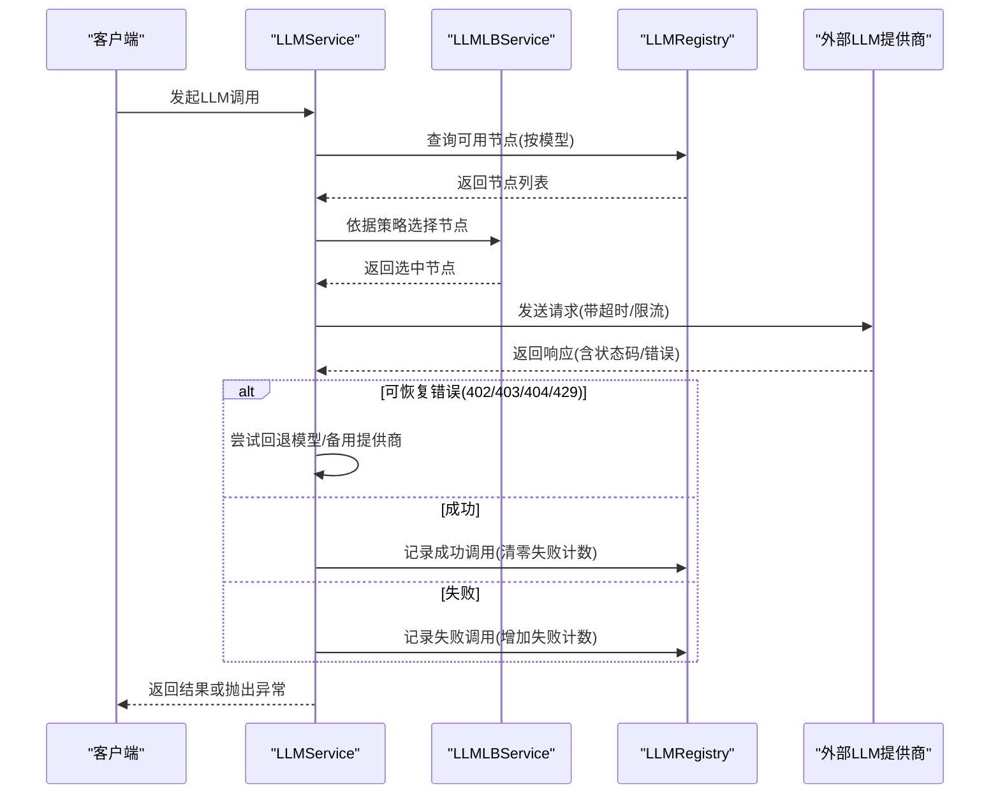
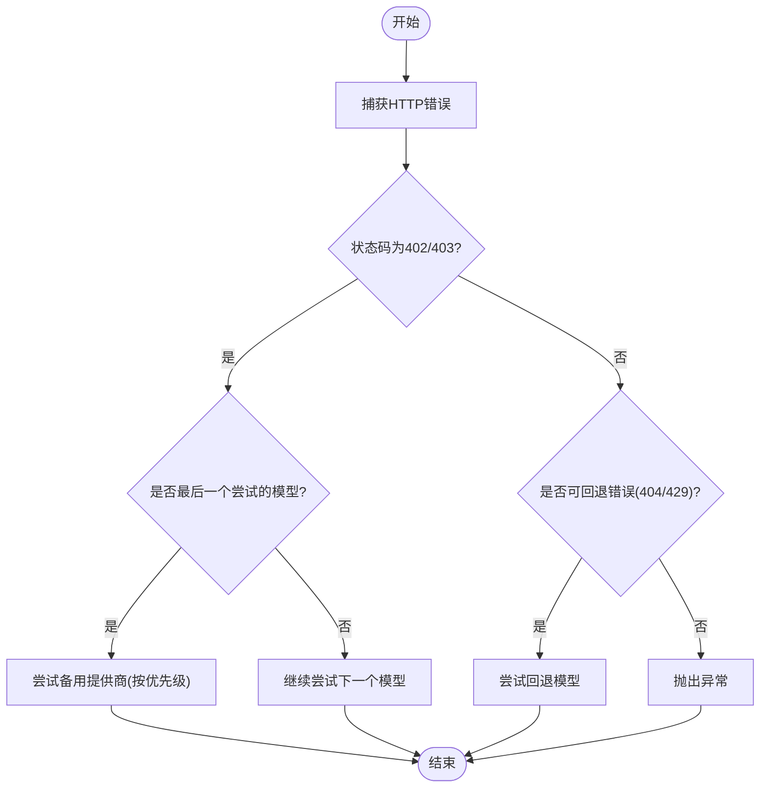
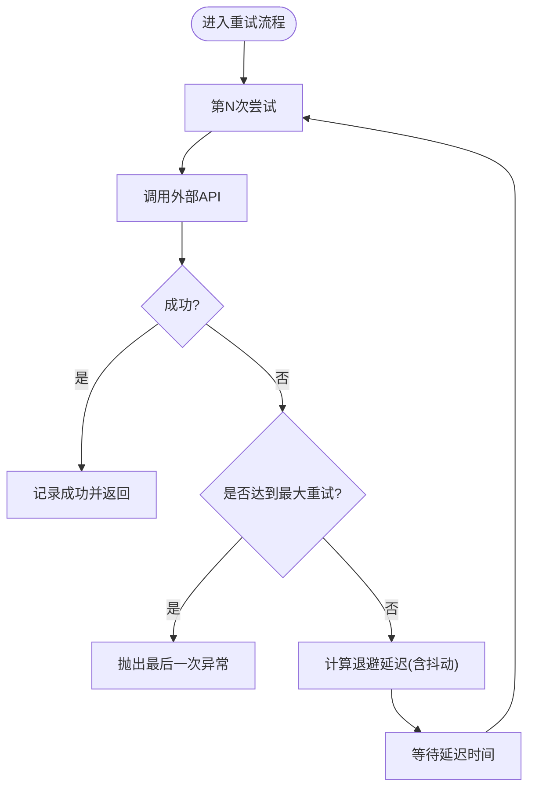
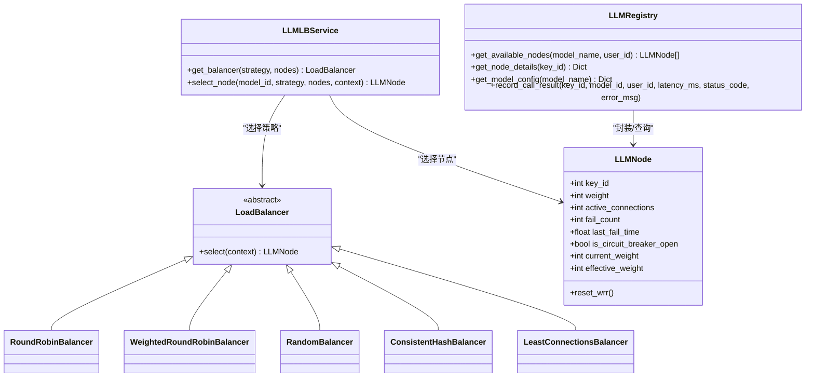
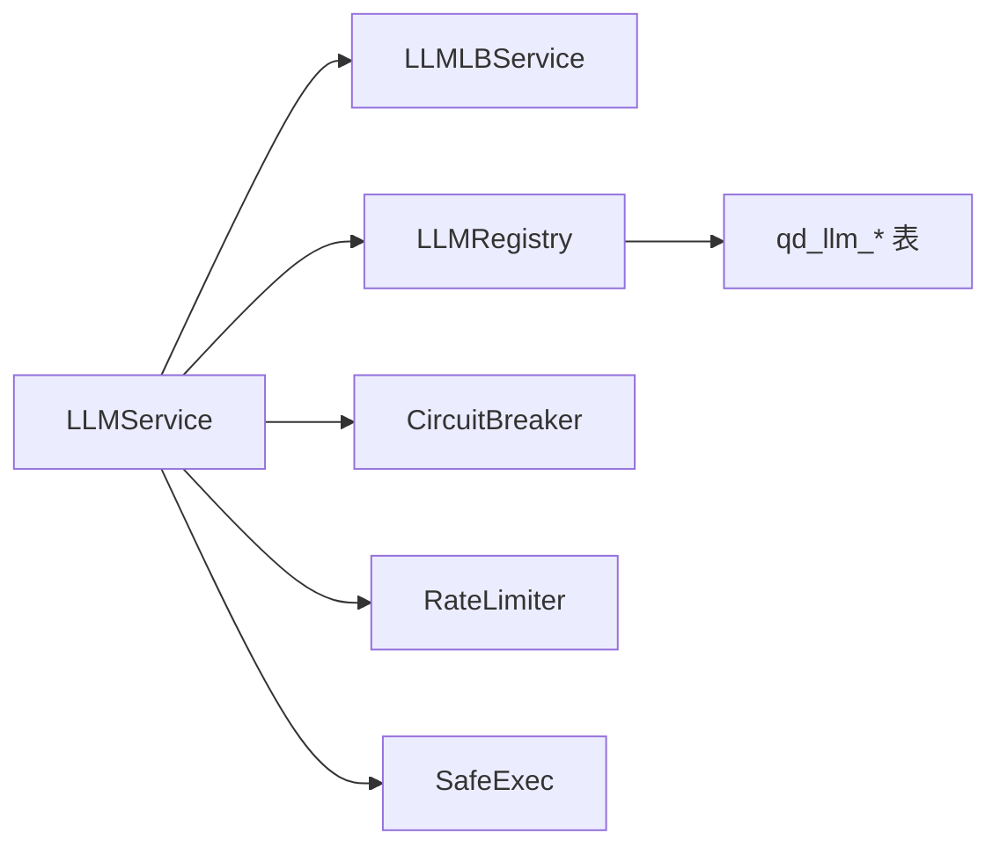

# LLM错误处理与重试

<cite>
**本文档引用的文件**
- [llm.py](file://backend_api_python/app/services/llm.py)
- [llm_lb.py](file://backend_api_python/app/services/llm_lb.py)
- [llm_registry.py](file://backend_api_python/app/services/llm_registry.py)
- [rate_limiter.py](file://backend_api_python/app/data_sources/rate_limiter.py)
- [circuit_breaker.py](file://backend_api_python/app/data_sources/circuit_breaker.py)
- [safe_exec.py](file://backend_api_python/app/utils/safe_exec.py)
- [llm.py](file://backend_api_python/app/routes/llm.py)
- [llm_lb_setup.sql](file://backend_api_python/migrations/llm_lb_setup.sql)
- [LLM 负载均衡调用系统设计方案.md](file://docs/LLM 负载均衡调用系统设计方案.md)
</cite>

## 目录
1. [简介](#简介)
2. [项目结构](#项目结构)
3. [核心组件](#核心组件)
4. [架构总览](#架构总览)
5. [详细组件分析](#详细组件分析)
6. [依赖关系分析](#依赖关系分析)
7. [性能考虑](#性能考虑)
8. [故障排查指南](#故障排查指南)
9. [结论](#结论)
10. [附录](#附录)

## 简介
本文件面向LLM错误处理与重试系统，系统性阐述HTTP错误码的差异化处理策略（如402/403 API密钥问题、404模型不存在、429速率限制等），以及备用提供商切换逻辑（优先级排序与自动故障转移）。同时提供指数退避重试、超时管理、降级策略的具体实现思路与最佳实践，并给出监控告警、日志记录与用户体验优化的指导。

## 项目结构
围绕LLM错误处理与重试的关键模块分布如下：
- 服务层：LLM调用与错误处理、负载均衡选择、注册中心记录
- 数据源层：熔断器、限流器、超时工具
- 路由层：供应商/密钥/模型管理与监控接口
- 数据库层：供应商、API密钥、模型、调用日志表及索引

图表来源
- [llm.py:470-722](file://backend_api_python/app/services/llm.py#L470-L722)
- [llm_lb.py:143-169](file://backend_api_python/app/services/llm_lb.py#L143-L169)
- [llm_registry.py:11-169](file://backend_api_python/app/services/llm_registry.py#L11-L169)
- [circuit_breaker.py:31-175](file://backend_api_python/app/data_sources/circuit_breaker.py#L31-L175)
- [rate_limiter.py:117-161](file://backend_api_python/app/data_sources/rate_limiter.py#L117-L161)
- [safe_exec.py:97-153](file://backend_api_python/app/utils/safe_exec.py#L97-L153)
- [llm.py:1-723](file://backend_api_python/app/routes/llm.py#L1-L723)
- [llm_lb_setup.sql:1-67](file://backend_api_python/migrations/llm_lb_setup.sql#L1-L67)

章节来源
- [llm.py:1-813](file://backend_api_python/app/services/llm.py#L1-L813)
- [llm_lb.py:1-169](file://backend_api_python/app/services/llm_lb.py#L1-L169)
- [llm_registry.py:1-169](file://backend_api_python/app/services/llm_registry.py#L1-L169)
- [llm.py:1-723](file://backend_api_python/app/routes/llm.py#L1-L723)
- [llm_lb_setup.sql:1-67](file://backend_api_python/migrations/llm_lb_setup.sql#L1-L67)

## 核心组件
- LLMService：统一LLM调用入口，负责错误分类、备用提供商切换、模型回退与重试策略
- LLMLBService：按策略选择API Key节点，支持轮询、加权轮询、随机、一致性哈希、最少连接
- LLMRegistry：查询可用节点、记录调用结果、维护熔断状态
- CircuitBreaker：对失败进行熔断/冷却/半开探测，避免雪崩
- RateLimiter：请求间最小间隔与抖动，缓解突发流量
- safe_exec：跨平台超时控制，防止长时间阻塞
- 路由接口：供应商/密钥/模型管理与24小时统计监控

章节来源
- [llm.py:73-800](file://backend_api_python/app/services/llm.py#L73-L800)
- [llm_lb.py:1-169](file://backend_api_python/app/services/llm_lb.py#L1-L169)
- [llm_registry.py:1-169](file://backend_api_python/app/services/llm_registry.py#L1-L169)
- [circuit_breaker.py:1-175](file://backend_api_python/app/data_sources/circuit_breaker.py#L1-L175)
- [rate_limiter.py:117-161](file://backend_api_python/app/data_sources/rate_limiter.py#L117-L161)
- [safe_exec.py:97-153](file://backend_api_python/app/utils/safe_exec.py#L97-L153)
- [llm.py:663-723](file://backend_api_python/app/routes/llm.py#L663-L723)

## 架构总览
系统采用“服务层统一调度 + 数据源层弹性保护 + 路由层配置管理”的分层架构。LLMService在调用前优先走负载均衡策略，若启用熔断则跳过；遇到可恢复错误时进行回退与重试；遇到402/403等明确的密钥问题时尝试备用提供商；最终将调用结果与错误信息写入注册中心，供监控与熔断判断。

图表来源
- [llm.py:470-722](file://backend_api_python/app/services/llm.py#L470-L722)
- [llm_lb.py:143-169](file://backend_api_python/app/services/llm_lb.py#L143-L169)
- [llm_registry.py:112-169](file://backend_api_python/app/services/llm_registry.py#L112-L169)

## 详细组件分析

### 错误码差异化处理策略
- 402/403（API密钥问题）：当当前提供商返回402/403且为最后一个尝试的模型时，触发备用提供商切换；同时记录错误以便熔断器判断
- 404（模型不存在）：视为可回退错误，尝试提供商默认回退模型
- 429（速率限制）：视为瞬时可恢复错误，结合指数退避与限流器进行重试
- 其他非2xx：根据响应体提取错误信息，必要时提示用户检查密钥与配额

章节来源
- [llm.py:638-683](file://backend_api_python/app/services/llm.py#L638-L683)

### 备用提供商切换逻辑
- 切换优先级：DeepSeek > Grok > OpenAI > Google > OpenRouter
- 触发条件：当前提供商返回402/403且已穷尽该提供商的所有候选模型
- 防止无限递归：备用流程中禁用再次尝试备用提供商

图表来源
- [llm.py:638-722](file://backend_api_python/app/services/llm.py#L638-L722)

章节来源
- [llm.py:685-722](file://backend_api_python/app/services/llm.py#L685-L722)

### 指数退避重试与超时管理
- 指数退避：基于装饰器实现，支持最大重试次数、基础延迟、最大延迟、指数基数与抖动
- 超时控制：跨平台超时上下文，支持Unix信号与线程定时器两种策略
- 限流器：最小请求间隔+随机抖动，平滑突发流量

图表来源
- [rate_limiter.py:167-231](file://backend_api_python/app/data_sources/rate_limiter.py#L167-L231)
- [safe_exec.py:97-153](file://backend_api_python/app/utils/safe_exec.py#L97-L153)

章节来源
- [rate_limiter.py:117-161](file://backend_api_python/app/data_sources/rate_limiter.py#L117-L161)
- [rate_limiter.py:167-231](file://backend_api_python/app/data_sources/rate_limiter.py#L167-L231)
- [safe_exec.py:97-153](file://backend_api_python/app/utils/safe_exec.py#L97-L153)

### 负载均衡与熔断策略
- 负载均衡策略：轮询、加权轮询、随机、一致性哈希、最少连接
- 熔断策略：连续失败阈值触发熔断，冷却时间后半开探测，半开成功则恢复，失败则继续熔断
- 注册中心：记录调用结果，更新节点失败计数与熔断状态

图表来源
- [llm_lb.py:7-169](file://backend_api_python/app/services/llm_lb.py#L7-L169)
- [llm_registry.py:11-169](file://backend_api_python/app/services/llm_registry.py#L11-L169)

章节来源
- [llm_lb.py:1-169](file://backend_api_python/app/services/llm_lb.py#L1-L169)
- [llm_registry.py:1-169](file://backend_api_python/app/services/llm_registry.py#L1-L169)
- [circuit_breaker.py:31-175](file://backend_api_python/app/data_sources/circuit_breaker.py#L31-L175)

### 监控告警与日志记录
- 调用日志：记录模型、提供商、用户、延迟、状态码、错误信息
- 统计接口：24小时维度的调用总数、平均延迟、成功率
- 熔断告警：节点连续失败触发熔断，记录警告日志

章节来源
- [llm_registry.py:112-169](file://backend_api_python/app/services/llm_registry.py#L112-L169)
- [llm.py:663-723](file://backend_api_python/app/routes/llm.py#L663-L723)

### 用户体验优化
- 流式输出：支持SSE流式响应，逐步返回内容，提升感知速度
- 失败提示：针对不同错误码给出明确指引（如检查密钥、余额、模型权限）
- 降级策略：在关键错误时返回部分结果或默认结构，保证基本可用

章节来源
- [llm.py:336-398](file://backend_api_python/app/services/llm.py#L336-L398)
- [llm.py:753-796](file://backend_api_python/app/services/llm.py#L753-L796)

## 依赖关系分析
- LLMService依赖LLMLBService与LLMRegistry进行节点选择与调用记录
- LLMRegistry依赖数据库表进行节点查询与状态更新
- CircuitBreaker独立运行，与LLMRegistry配合实现熔断
- RateLimiter与safe_exec为LLMService提供限流与超时保护

图表来源
- [llm.py:470-722](file://backend_api_python/app/services/llm.py#L470-L722)
- [llm_lb.py:143-169](file://backend_api_python/app/services/llm_lb.py#L143-L169)
- [llm_registry.py:11-169](file://backend_api_python/app/services/llm_registry.py#L11-L169)
- [circuit_breaker.py:31-175](file://backend_api_python/app/data_sources/circuit_breaker.py#L31-L175)
- [rate_limiter.py:117-161](file://backend_api_python/app/data_sources/rate_limiter.py#L117-L161)
- [safe_exec.py:97-153](file://backend_api_python/app/utils/safe_exec.py#L97-L153)

章节来源
- [llm.py:1-813](file://backend_api_python/app/services/llm.py#L1-L813)
- [llm_lb.py:1-169](file://backend_api_python/app/services/llm_lb.py#L1-L169)
- [llm_registry.py:1-169](file://backend_api_python/app/services/llm_registry.py#L1-L169)
- [circuit_breaker.py:1-175](file://backend_api_python/app/data_sources/circuit_breaker.py#L1-L175)
- [rate_limiter.py:117-161](file://backend_api_python/app/data_sources/rate_limiter.py#L117-L161)
- [safe_exec.py:97-153](file://backend_api_python/app/utils/safe_exec.py#L97-L153)

## 性能考虑
- 负载均衡策略选择：加权轮询适合多密钥权重场景；最少连接适合长会话；一致性哈希适合需要粘性的用户场景
- 熔断冷却时间：建议根据提供商SLA与业务峰值设定，避免频繁抖动
- 限流与退避：结合限流器与指数退避，既能保护上游，又能快速恢复
- 流式响应：减少首字节延迟，改善用户体验

## 故障排查指南
- API密钥问题（402/403）：检查密钥有效性、账户余额与模型权限；系统会自动尝试备用提供商
- 模型不存在（404）：确认模型名称与提供商匹配；系统会尝试回退模型
- 速率限制（429）：降低并发或延长退避间隔；检查限流器配置
- 超时与阻塞：启用safe_exec超时；检查网络与上游响应时间
- 熔断状态：关注节点失败计数与熔断状态；等待冷却时间后半开探测

章节来源
- [llm.py:638-683](file://backend_api_python/app/services/llm.py#L638-L683)
- [circuit_breaker.py:67-137](file://backend_api_python/app/data_sources/circuit_breaker.py#L67-L137)
- [safe_exec.py:97-153](file://backend_api_python/app/utils/safe_exec.py#L97-L153)

## 结论
本系统通过“错误分类 + 备用提供商 + 负载均衡 + 熔断 + 限流 + 退避 + 监控”的组合拳，实现了对LLM调用的高可用与可观测性。建议在生产环境中结合业务特点调整策略参数，并持续完善监控与告警体系。

## 附录
- 数据库表结构与索引：供应商、API密钥、模型、调用日志
- 设计方案文档：负载均衡策略与配置项说明

章节来源
- [llm_lb_setup.sql:1-67](file://backend_api_python/migrations/llm_lb_setup.sql#L1-L67)
- [LLM 负载均衡调用系统设计方案.md:1-91](file://docs/LLM 负载均衡调用系统设计方案.md#L1-L91)