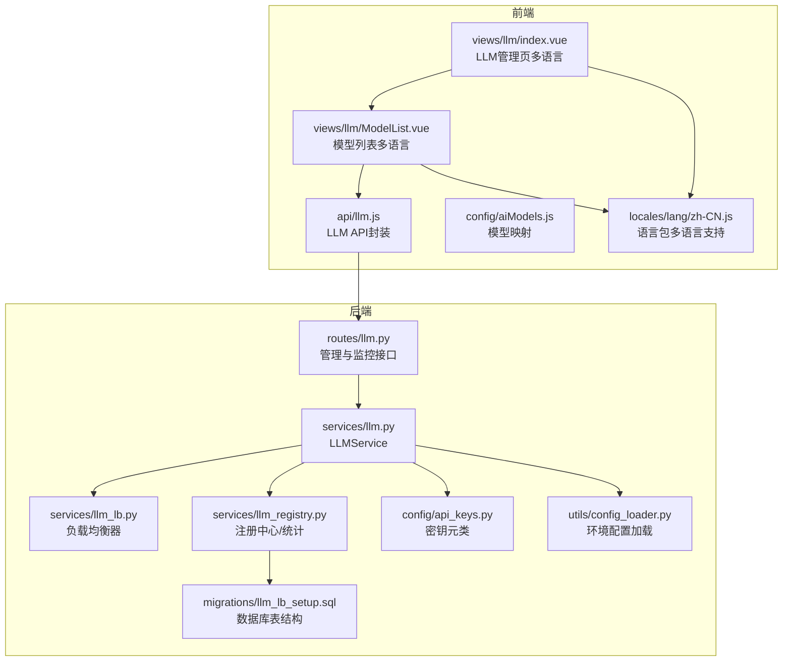
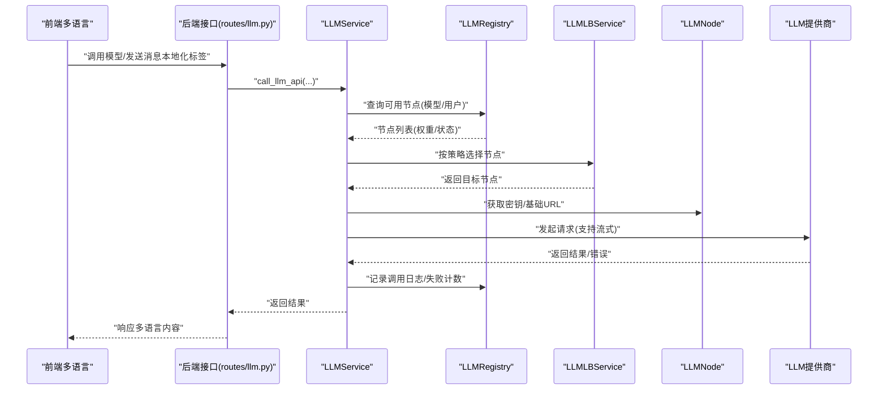
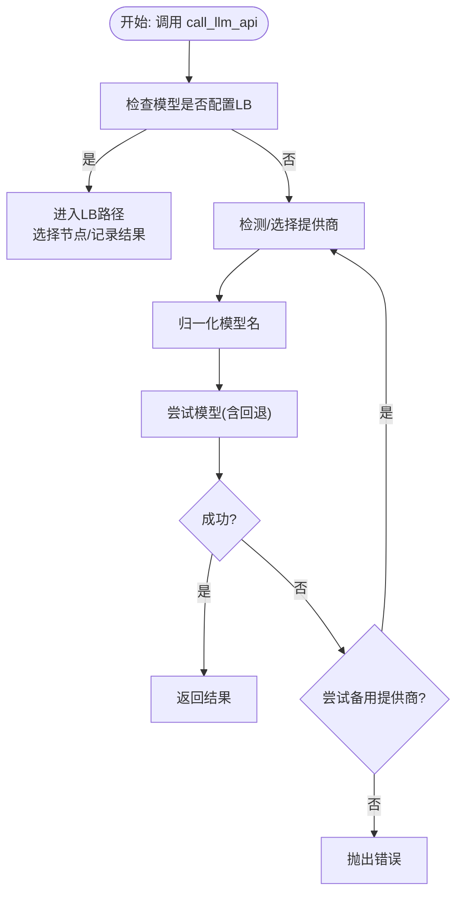
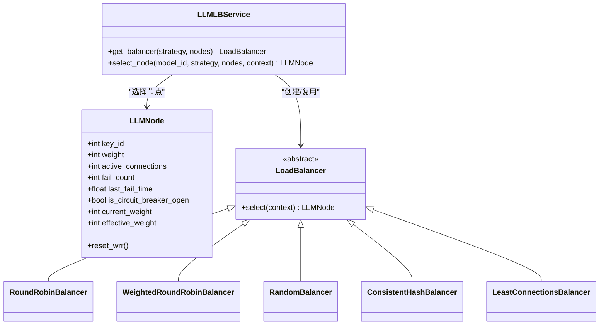
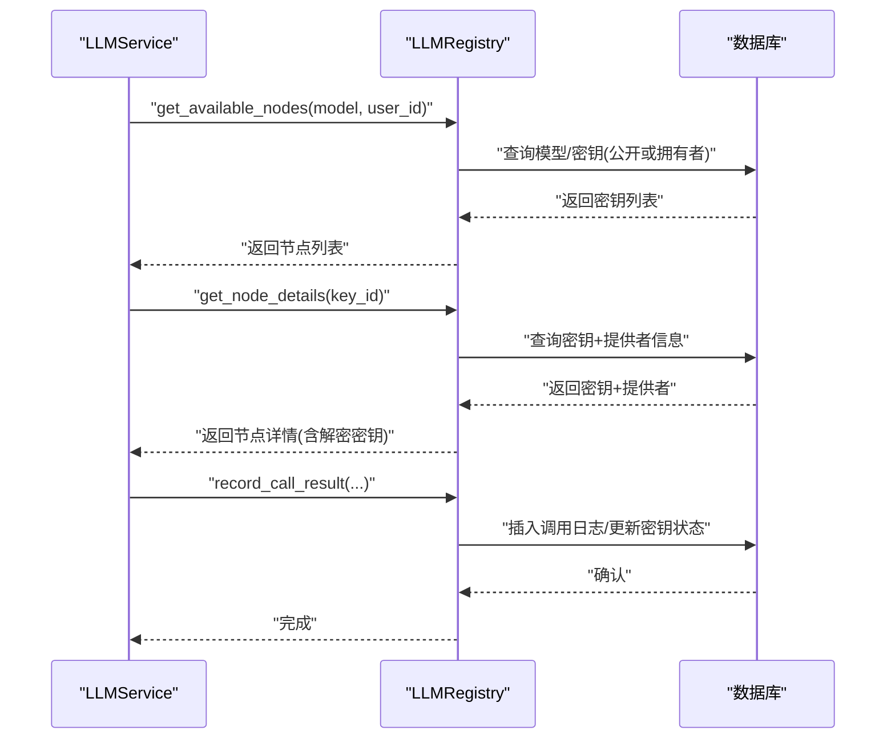
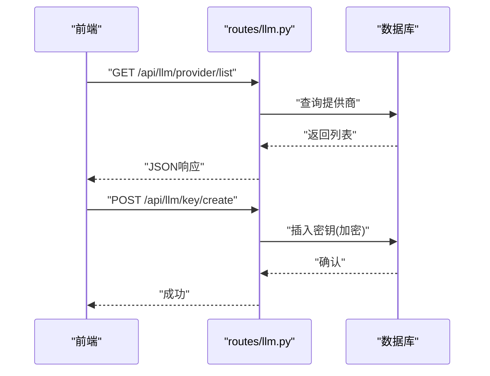
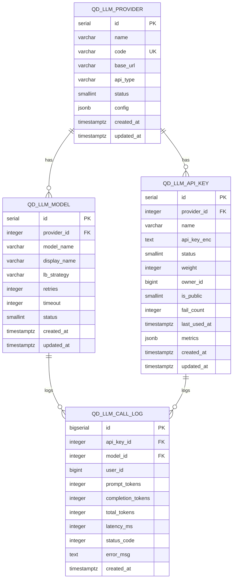
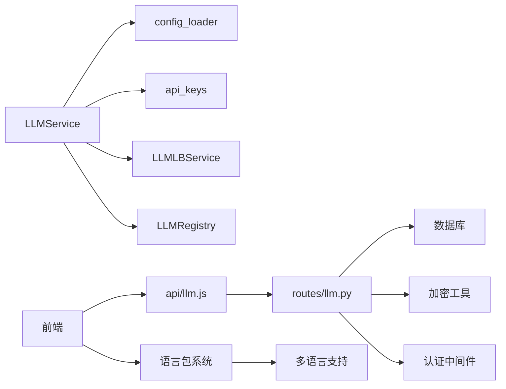

# LLM集成系统

<cite>
**本文档引用的文件**
- [backend_api_python/app/services/llm.py](file://backend_api_python/app/services/llm.py)
- [backend_api_python/app/services/llm_lb.py](file://backend_api_python/app/services/llm_lb.py)
- [backend_api_python/app/services/llm_registry.py](file://backend_api_python/app/services/llm_registry.py)
- [backend_api_python/app/routes/llm.py](file://backend_api_python/app/routes/llm.py)
- [backend_api_python/migrations/llm_lb_setup.sql](file://backend_api_python/migrations/llm_lb_setup.sql)
- [backend_api_python/app/config/api_keys.py](file://backend_api_python/app/config/api_keys.py)
- [backend_api_python/app/utils/config_loader.py](file://backend_api_python/app/utils/config_loader.py)
- [backend_api_python/env.example](file://backend_api_python/env.example)
- [backend_api_python/LLM_STREAMING_USAGE.md](file://backend_api_python/LLM_STREAMING_USAGE.md)
- [frontend/src/views/llm/index.vue](file://frontend/src/views/llm/index.vue)
- [frontend/src/views/llm/ModelList.vue](file://frontend/src/views/llm/ModelList.vue)
- [frontend/src/api/llm.js](file://frontend/src/api/llm.js)
- [frontend/src/config/aiModels.js](file://frontend/src/config/aiModels.js)
- [frontend/src/locales/lang/zh-CN.js](file://frontend/src/locales/lang/zh-CN.js)
</cite>

## 更新摘要
**所做更改**
- 更新LLM管理界面本地化支持，现支持多语言的模型展示和管理功能
- 新增LLM相关语言包键值，涵盖供应商、密钥、模型和统计页面的多语言翻译
- 完善前端LLM管理界面的国际化实现，包括标签页、表格列和操作按钮的本地化

## 目录
1. [简介](#简介)
2. [项目结构](#项目结构)
3. [核心组件](#核心组件)
4. [架构总览](#架构总览)
5. [详细组件分析](#详细组件分析)
6. [依赖关系分析](#依赖关系分析)
7. [性能考量](#性能考量)
8. [故障排查指南](#故障排查指南)
9. [结论](#结论)
10. [附录](#附录)

## 简介
本文件面向QuantDinger的LLM集成系统，系统性阐述LLMService的多提供商架构、模型选择与请求路由策略、以及基于数据库的负载均衡实现。文档覆盖以下关键主题：
- 多提供商支持：OpenAI、Gemini、DeepSeek、Grok、OpenRouter、OpenAI-Compatible、Ollama
- 模型选择与路由：基于模型名前缀自动识别提供商、权重轮询/随机/最少连接/一致性哈希等策略
- 负载均衡与熔断：节点权重、活跃连接数、失败计数与熔断器状态
- 配置与密钥管理：环境变量与配置映射、API密钥加密存储、前端管理界面
- 错误处理与重试：HTTP状态码分类、备用提供商切换、超时与回退模型
- 流式输出：SSE解析、部分结果容错、向后兼容
- **本地化支持**：LLM管理界面现已完全本地化，支持多语言的模型展示和管理功能

## 项目结构
后端采用Flask蓝图提供LLM管理与监控接口；服务层封装LLM调用、负载均衡与注册中心；前端提供LLM配置管理页面，现已支持多语言本地化。

**图表来源**
- [backend_api_python/app/routes/llm.py:1-723](file://backend_api_python/app/routes/llm.py#L1-L723)
- [backend_api_python/app/services/llm.py:1-813](file://backend_api_python/app/services/llm.py#L1-L813)
- [backend_api_python/app/services/llm_lb.py:1-169](file://backend_api_python/app/services/llm_lb.py#L1-L169)
- [backend_api_python/app/services/llm_registry.py:1-169](file://backend_api_python/app/services/llm_registry.py#L1-L169)
- [backend_api_python/app/config/api_keys.py:1-164](file://backend_api_python/app/config/api_keys.py#L1-L164)
- [backend_api_python/app/utils/config_loader.py:1-252](file://backend_api_python/app/utils/config_loader.py#L1-L252)
- [backend_api_python/migrations/llm_lb_setup.sql:1-67](file://backend_api_python/migrations/llm_lb_setup.sql#L1-L67)
- [frontend/src/views/llm/index.vue:1-78](file://frontend/src/views/llm/index.vue#L1-L78)
- [frontend/src/views/llm/ModelList.vue:1-162](file://frontend/src/views/llm/ModelList.vue#L1-L162)
- [frontend/src/api/llm.js:1-90](file://frontend/src/api/llm.js#L1-L90)
- [frontend/src/config/aiModels.js:1-42](file://frontend/src/config/aiModels.js#L1-L42)
- [frontend/src/locales/lang/zh-CN.js:4523-4551](file://frontend/src/locales/lang/zh-CN.js#L4523-L4551)

**章节来源**
- [backend_api_python/app/routes/llm.py:1-723](file://backend_api_python/app/routes/llm.py#L1-L723)
- [backend_api_python/app/services/llm.py:1-813](file://backend_api_python/app/services/llm.py#L1-L813)
- [backend_api_python/app/services/llm_lb.py:1-169](file://backend_api_python/app/services/llm_lb.py#L1-L169)
- [backend_api_python/app/services/llm_registry.py:1-169](file://backend_api_python/app/services/llm_registry.py#L1-L169)
- [backend_api_python/migrations/llm_lb_setup.sql:1-67](file://backend_api_python/migrations/llm_lb_setup.sql#L1-L67)
- [frontend/src/views/llm/index.vue:1-78](file://frontend/src/views/llm/index.vue#L1-L78)
- [frontend/src/views/llm/ModelList.vue:1-162](file://frontend/src/views/llm/ModelList.vue#L1-L162)
- [frontend/src/api/llm.js:1-90](file://frontend/src/api/llm.js#L1-L90)
- [frontend/src/config/aiModels.js:1-42](file://frontend/src/config/aiModels.js#L1-L42)
- [frontend/src/locales/lang/zh-CN.js:4523-4551](file://frontend/src/locales/lang/zh-CN.js#L4523-L4551)

## 核心组件
- LLMService：统一的LLM调用入口，负责提供商选择、模型归一化、请求路由、错误处理与备用提供商切换。
- LLMLBService：根据策略选择节点，支持轮询、加权轮询、随机、一致性哈希、最少连接。
- LLMRegistry：提供数据库访问与缓存，记录调用日志、统计失败次数、触发熔断。
- 路由层：提供LLM提供商、API密钥、模型与监控统计的REST接口。
- 配置系统：环境变量映射到嵌套配置，密钥通过元类按需加载，避免明文存储。
- **本地化系统**：前端语言包支持多语言，LLM管理界面完全本地化。

**章节来源**
- [backend_api_python/app/services/llm.py:73-813](file://backend_api_python/app/services/llm.py#L73-L813)
- [backend_api_python/app/services/llm_lb.py:143-169](file://backend_api_python/app/services/llm_lb.py#L143-L169)
- [backend_api_python/app/services/llm_registry.py:11-169](file://backend_api_python/app/services/llm_registry.py#L11-L169)
- [backend_api_python/app/routes/llm.py:1-723](file://backend_api_python/app/routes/llm.py#L1-L723)
- [backend_api_python/app/utils/config_loader.py:24-161](file://backend_api_python/app/utils/config_loader.py#L24-L161)
- [backend_api_python/app/config/api_keys.py:64-121](file://backend_api_python/app/config/api_keys.py#L64-L121)

## 架构总览
下图展示了从前端到后端的调用链路，以及负载均衡与注册中心的协作关系，包含本地化支持的完整流程。

**图表来源**
- [backend_api_python/app/routes/llm.py:470-683](file://backend_api_python/app/routes/llm.py#L470-L683)
- [backend_api_python/app/services/llm.py:470-683](file://backend_api_python/app/services/llm.py#L470-L683)
- [backend_api_python/app/services/llm_lb.py:143-169](file://backend_api_python/app/services/llm_lb.py#L143-L169)
- [backend_api_python/app/services/llm_registry.py:112-168](file://backend_api_python/app/services/llm_registry.py#L112-L168)

## 详细组件分析

### LLMService：多提供商与模型路由
- 提供商枚举与默认配置：内置OpenRouter、OpenAI、Google Gemini、DeepSeek、Grok、OpenAI-Compatible、Ollama的默认基地址与默认/回退模型。
- 提供商选择策略：
  - 显式指定：优先使用构造函数或配置中的提供商。
  - 自动检测：按DeepSeek > Grok > OpenAI > Google > OpenRouter顺序查找已配置密钥。
  - OpenAI-Compatible需显式设置BASE_URL。
- 模型归一化：当使用OpenRouter风格的"提供商/模型"格式时，自动提取实际模型名，并对不匹配当前提供商的模型使用默认模型。
- 请求路由与重试：
  - 若模型在注册中心配置了LB策略，则走负载均衡路径；否则走传统直连。
  - 对402/403等常见错误尝试备用提供商；对404/429等可回退错误尝试回退模型。
- 流式输出：统一处理SSE流，聚合内容并返回完整文本；若解析失败，返回已接收的部分内容并记录警告。
- 安全调用：提供安全解析JSON的方法，对无法解析的结果返回默认结构并记录日志。

**图表来源**
- [backend_api_python/app/services/llm.py:470-683](file://backend_api_python/app/services/llm.py#L470-L683)

**章节来源**
- [backend_api_python/app/services/llm.py:22-181](file://backend_api_python/app/services/llm.py#L22-L181)
- [backend_api_python/app/services/llm.py:470-683](file://backend_api_python/app/services/llm.py#L470-L683)
- [backend_api_python/LLM_STREAMING_USAGE.md:1-260](file://backend_api_python/LLM_STREAMING_USAGE.md#L1-L260)

### LLMLBService：负载均衡与节点管理
- LLMNode：封装密钥ID、权重、活跃连接数、失败计数、熔断状态与平滑加权轮询所需字段。
- LoadBalancer基类：定义select接口，子类实现具体策略。
- 策略实现：
  - 轮询(RoundRobin)：顺序选择可用节点。
  - 加权轮询(Smooth WRR)：按有效权重累计，选最大者并减去总权重。
  - 随机(Random)：按权重概率选择。
  - 一致性哈希(ConsistentHash)：基于用户ID等上下文进行哈希，保证同一用户稳定落在同一节点。
  - 最少连接(LeastConnections)：选择活跃连接数最少的节点。
- LLMLBService：根据策略类型返回对应负载均衡器实例，并复用实例以减少开销。

**图表来源**
- [backend_api_python/app/services/llm_lb.py:7-169](file://backend_api_python/app/services/llm_lb.py#L7-L169)

**章节来源**
- [backend_api_python/app/services/llm_lb.py:7-169](file://backend_api_python/app/services/llm_lb.py#L7-L169)

### LLMRegistry：注册中心与调用统计
- 节点发现：根据模型名与用户ID查询可用API密钥，过滤公开密钥或拥有者密钥。
- 节点详情：解密API密钥与提供者信息，供服务层调用。
- 模型配置：读取LB策略、重试次数、超时等配置。
- 调用记录：插入调用日志，更新密钥失败计数与状态；连续失败达到阈值触发熔断(状态置为熔断)。

**图表来源**
- [backend_api_python/app/services/llm_registry.py:18-168](file://backend_api_python/app/services/llm_registry.py#L18-L168)

**章节来源**
- [backend_api_python/app/services/llm_registry.py:18-168](file://backend_api_python/app/services/llm_registry.py#L18-L168)

### 路由层：LLM管理与监控
- 提供商管理：列出、创建、更新提供商，支持名称、编码、API类型、基础URL与状态。
- API密钥管理：列出、创建、更新密钥，支持权重、状态、备注、是否公开；创建时加密存储。
- 模型管理：列出、创建、更新模型，支持LB策略、重试次数、超时与状态。
- 监控统计：按模型与提供商统计近24小时调用次数、平均延迟与成功率。

**图表来源**
- [backend_api_python/app/routes/llm.py:13-224](file://backend_api_python/app/routes/llm.py#L13-L224)

**章节来源**
- [backend_api_python/app/routes/llm.py:13-723](file://backend_api_python/app/routes/llm.py#L13-L723)

### 数据库结构：LLM负载均衡表
- qd_llm_provider：提供商信息，含编码(code)、基础URL、API类型与状态。
- qd_llm_api_key：API密钥，加密存储，含权重、状态(正常/禁用/熔断)、失败计数、最后使用时间与指标。
- qd_llm_model：模型配置，含LB策略、重试次数、超时与状态。
- qd_llm_call_log：调用日志，记录令牌用量、延迟、状态码与错误信息。

**图表来源**
- [backend_api_python/migrations/llm_lb_setup.sql:4-67](file://backend_api_python/migrations/llm_lb_setup.sql#L4-L67)

**章节来源**
- [backend_api_python/migrations/llm_lb_setup.sql:1-67](file://backend_api_python/migrations/llm_lb_setup.sql#L1-L67)

### 配置与密钥管理
- 环境变量映射：通过配置加载器将环境变量映射为嵌套配置，涵盖各提供商的API Key、Base URL、模型、温度、超时等。
- 密钥元类：APIKeys类通过元类动态读取环境变量或配置文件中的密钥，避免硬编码。
- 示例配置：env.example提供各提供商的API Key与模型示例，便于本地快速部署。

**章节来源**
- [backend_api_python/app/utils/config_loader.py:60-148](file://backend_api_python/app/utils/config_loader.py#L60-L148)
- [backend_api_python/app/config/api_keys.py:64-121](file://backend_api_python/app/config/api_keys.py#L64-L121)
- [backend_api_python/env.example:64-95](file://backend_api_python/env.example#L64-L95)

### 前端管理界面
- 管理页：LLM管理页包含提供商、密钥、模型与统计四个标签页，全部支持多语言本地化。
- 模型列表：支持新增/编辑模型，配置LB策略、重试次数与超时；联动提供商下拉，所有文本标签均使用本地化翻译。
- API封装：统一的LLM API模块，封装列表、创建/更新与统计查询。
- 模型映射：前端维护OpenRouter风格的模型ID到显示名称的映射。
- **本地化实现**：通过语言包文件提供多语言支持，包括LLM页面标题、描述、表格列头、操作按钮等完整本地化内容。

**章节来源**
- [frontend/src/views/llm/index.vue:1-78](file://frontend/src/views/llm/index.vue#L1-L78)
- [frontend/src/views/llm/ModelList.vue:1-162](file://frontend/src/views/llm/ModelList.vue#L1-L162)
- [frontend/src/api/llm.js:1-90](file://frontend/src/api/llm.js#L1-L90)
- [frontend/src/config/aiModels.js:1-42](file://frontend/src/config/aiModels.js#L1-L42)
- [frontend/src/locales/lang/zh-CN.js:4523-4551](file://frontend/src/locales/lang/zh-CN.js#L4523-L4551)

## 依赖关系分析
- LLMService依赖：
  - 配置加载器：读取环境变量与配置文件，提供提供商与模型参数。
  - API密钥元类：按提供商获取密钥。
  - 负载均衡服务：选择节点。
  - 注册中心：查询可用节点与记录调用结果。
- 路由层依赖：
  - 数据库连接与加密工具：安全地存储与查询密钥。
  - 认证中间件：管理员权限控制提供商与模型管理接口。
- 前端依赖：
  - 统一API模块：与后端接口对接。
  - 模型映射：确保前端显示与后端模型命名一致。
  - **语言包系统**：提供多语言支持，LLM管理界面完全本地化。

**图表来源**
- [backend_api_python/app/services/llm.py:13-17](file://backend_api_python/app/services/llm.py#L13-L17)
- [backend_api_python/app/routes/llm.py:1-9](file://backend_api_python/app/routes/llm.py#L1-L9)
- [frontend/src/api/llm.js:1-14](file://frontend/src/api/llm.js#L1-L14)

**章节来源**
- [backend_api_python/app/services/llm.py:13-17](file://backend_api_python/app/services/llm.py#L13-L17)
- [backend_api_python/app/routes/llm.py:1-9](file://backend_api_python/app/routes/llm.py#L1-L9)
- [frontend/src/api/llm.js:1-14](file://frontend/src/api/llm.js#L1-L14)

## 性能考量
- 负载均衡策略选择：
  - 加权轮询：适合不同密钥额度差异较大的场景。
  - 最少连接：适合高并发且节点能力相近的场景。
  - 一致性哈希：适合需要用户会话粘性的场景。
- 超时与重试：
  - 模型级超时与重试次数可在模型配置中精细调整。
  - 熔断器在连续失败后自动阻断，避免雪崩效应。
- 流式输出：
  - SSE解析与累积在服务端完成，前端仍可获得完整文本；如需实时推送，可在上游扩展WebSocket推送逻辑。
- **本地化性能**：
  - 语言包按需加载，避免不必要的内存占用。
  - 多语言切换时使用缓存机制，提升切换性能。

## 故障排查指南
- 常见错误与提示：
  - 403/402：通常表示API密钥无效/过期、余额不足或无模型权限；检查对应提供商后台与密钥配置。
  - 404：模型不可用或隐私/数据策略限制；检查模型权限与隐私设置。
  - 429：速率限制；降低并发或提升配额。
- 熔断与恢复：
  - 连续失败达到阈值后密钥进入熔断状态；修复问题后等待自动恢复或手动调整状态。
- 流式处理：
  - 若流式解析失败但已接收部分内容，系统会返回部分结果并记录警告；可检查日志定位问题。
- **本地化问题**：
  - 如出现文本显示异常，检查对应语言包是否正确加载。
  - 确认浏览器语言设置与系统语言配置一致。

**章节来源**
- [backend_api_python/app/services/llm.py:246-274](file://backend_api_python/app/services/llm.py#L246-L274)
- [backend_api_python/app/services/llm_registry.py:153-158](file://backend_api_python/app/services/llm_registry.py#L153-L158)

## 结论
QuantDinger的LLM集成系统通过LLMService统一抽象多提供商调用，结合LLMLBService与LLMRegistry实现了灵活的负载均衡、熔断与监控。配合路由层与前端管理界面，用户可以方便地添加新提供商、配置API密钥与模型参数，并通过多种策略优化性能与稳定性。**最新的本地化改进使得LLM管理界面完全支持多语言，用户可以在不同语言环境下进行模型管理操作。**建议在生产环境中：
- 为不同提供商配置独立密钥与权重，启用加权轮询或最少连接策略。
- 设置合理的超时与重试次数，开启熔断器。
- 使用一致性哈希保障用户会话粘性。
- 开启流式输出以改善用户体验，同时保留非流式作为回退。
- **充分利用本地化功能，为不同地区用户提供母语界面体验。**

## 附录

### 添加新LLM提供商步骤
- 在LLMProvider枚举中新增提供商常量。
- 在PROVIDER_CONFIGS中添加默认基地址与默认/回退模型。
- 在env.example中添加该提供商的API Key与Base URL示例。
- 在前端模型映射中补充该提供商的模型ID到显示名称映射。
- 通过路由层创建提供商与模型配置，并在注册中心为该提供商创建API密钥。

**章节来源**
- [backend_api_python/app/services/llm.py:22-70](file://backend_api_python/app/services/llm.py#L22-L70)
- [backend_api_python/env.example:64-95](file://backend_api_python/env.example#L64-L95)
- [frontend/src/config/aiModels.js:1-42](file://frontend/src/config/aiModels.js#L1-L42)

### API使用方法与配置示例
- 环境变量配置：参考env.example，设置LLM_PROVIDER与各提供商的API Key与Base URL。
- 模型配置：在前端模型列表中选择LB策略、重试次数与超时。
- 调用示例：通过LLMService的call_llm_api方法传入messages与model，系统自动选择提供商与模型并返回结果。
- **本地化配置**：通过语言包系统实现多语言支持，LLM管理界面完全本地化。

**章节来源**
- [backend_api_python/env.example:64-95](file://backend_api_python/env.example#L64-L95)
- [frontend/src/views/llm/ModelList.vue:48-62](file://frontend/src/views/llm/ModelList.vue#L48-L62)
- [backend_api_python/app/services/llm.py:470-683](file://backend_api_python/app/services/llm.py#L470-L683)
- [frontend/src/locales/lang/zh-CN.js:4523-4551](file://frontend/src/locales/lang/zh-CN.js#L4523-L4551)

### 本地化实现细节
- **语言包结构**：LLM相关键值位于语言包文件中，包括页面标题、描述、表格列头、操作按钮等。
- **多语言支持**：前端通过Vue-i18n实现多语言切换，LLM管理界面的所有文本都支持本地化。
- **键值命名规范**：使用`llm.`前缀标识LLM相关翻译键，便于管理和维护。
- **界面元素本地化**：标签页、表格列、按钮文本、提示信息等全部支持多语言显示。

**章节来源**
- [frontend/src/locales/lang/zh-CN.js:4523-4551](file://frontend/src/locales/lang/zh-CN.js#L4523-L4551)
- [frontend/src/views/llm/index.vue:3-17](file://frontend/src/views/llm/index.vue#L3-L17)
- [frontend/src/views/llm/ModelList.vue:83-90](file://frontend/src/views/llm/ModelList.vue#L83-L90)