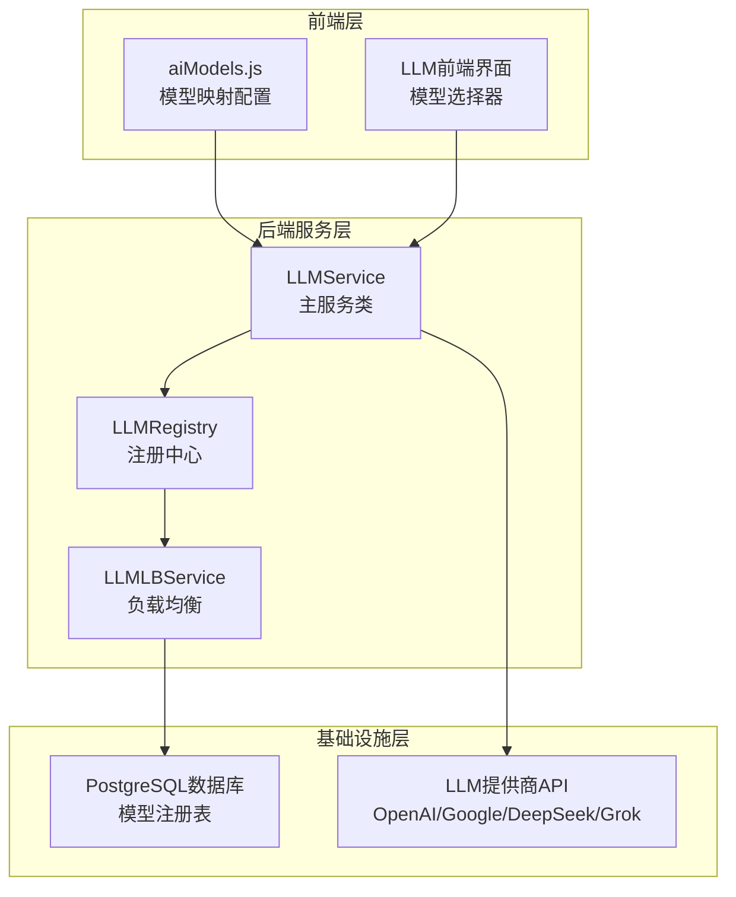
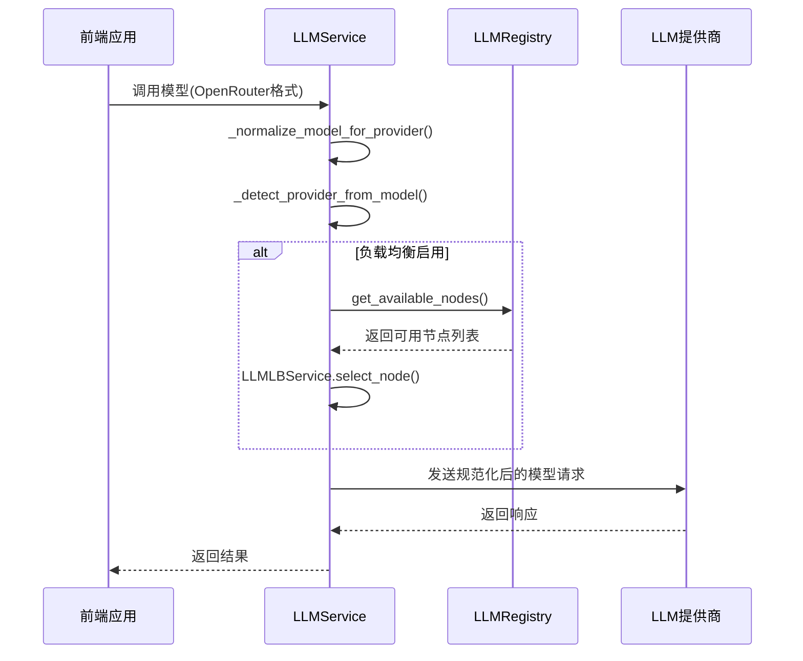
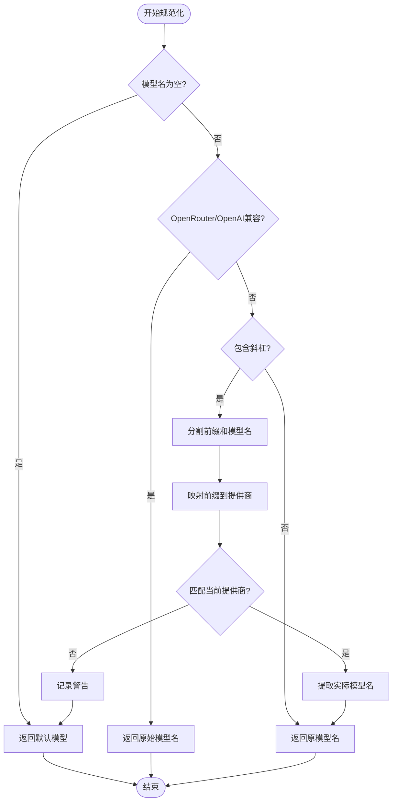
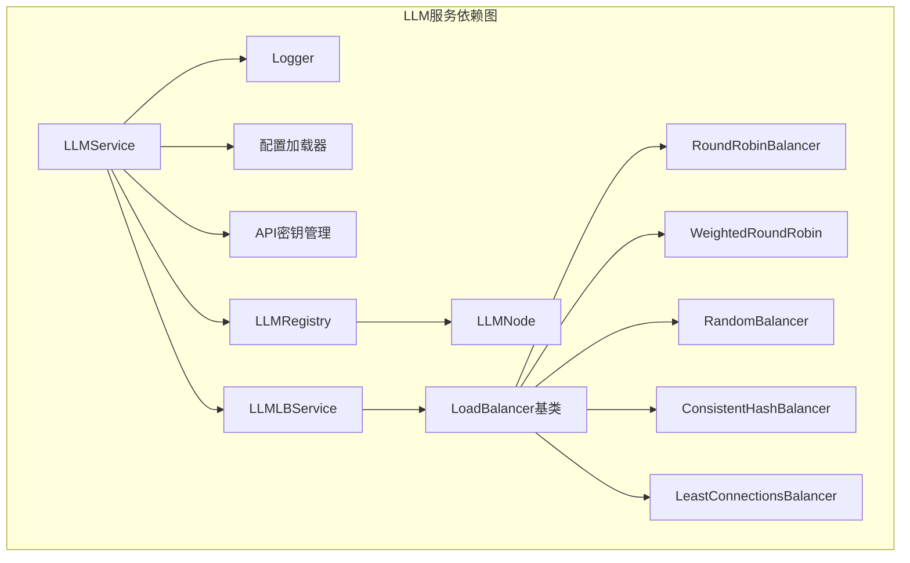
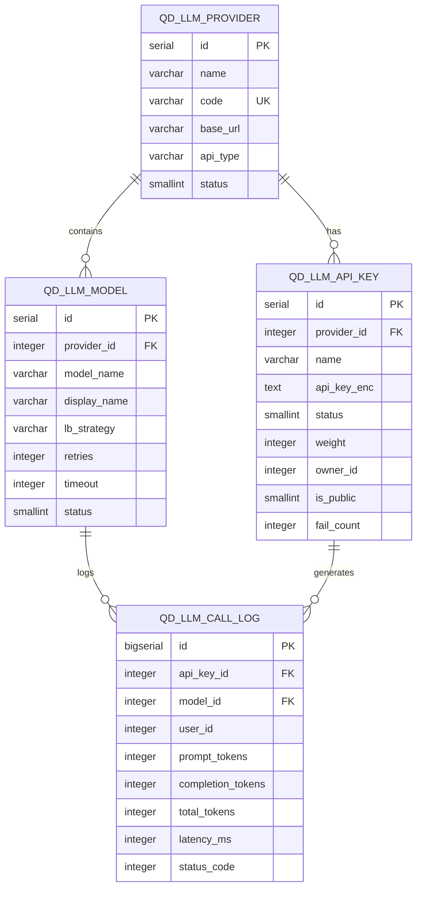

# 模型名称规范化

<cite>
**本文档引用的文件**
- [llm.py](file://backend_api_python/app/services/llm.py)
- [aiModels.js](file://frontend/src/config/aiModels.js)
- [llm_registry.py](file://backend_api_python/app/services/llm_registry.py)
- [llm_lb.py](file://backend_api_python/app/services/llm_lb.py)
- [llm.py](file://backend_api_python/app/routes/llm.py)
- [llm_lb_setup.sql](file://backend_api_python/migrations/llm_lb_setup.sql)
- [LLM_STREAMING_USAGE.md](file://backend_api_python/LLM_STREAMING_USAGE.md)
</cite>

## 目录
1. [简介](#简介)
2. [项目结构](#项目结构)
3. [核心组件](#核心组件)
4. [架构概览](#架构概览)
5. [详细组件分析](#详细组件分析)
6. [依赖分析](#依赖分析)
7. [性能考虑](#性能考虑)
8. [故障排除指南](#故障排除指南)
9. [结论](#结论)

## 简介

本文件详细解释了QuantDinger项目中LLM模型名称规范化系统的实现原理，重点分析`_normalize_model_for_provider`方法的工作机制。该系统负责将前端传入的OpenRouter格式模型名（如'openai/gpt-4o'）转换为各提供商特定格式，确保模型调用的正确性和兼容性。

系统支持多个LLM提供商，包括OpenRouter、OpenAI、Google、DeepSeek、Grok等，并通过统一的模型命名规范实现了跨平台的模型管理。前端使用OpenRouter风格的模型ID（如'openai/gpt-4o'），后端通过规范化逻辑将其转换为对应提供商的实际模型名称。

## 项目结构



**图表来源**
- [llm.py:73-813](file://backend_api_python/app/services/llm.py#L73-L813)
- [aiModels.js:1-42](file://frontend/src/config/aiModels.js#L1-L42)
- [llm_registry.py:11-169](file://backend_api_python/app/services/llm_registry.py#L11-L169)

**章节来源**
- [llm.py:1-813](file://backend_api_python/app/services/llm.py#L1-L813)
- [aiModels.js:1-42](file://frontend/src/config/aiModels.js#L1-L42)

## 核心组件

### LLMProvider枚举

系统定义了统一的提供商枚举，支持以下提供商：
- OPENROUTER：OpenRouter平台
- OPENAI：OpenAI平台
- OPENAI_COMPATIBLE：OpenAI兼容接口
- GOOGLE：Google Gemini
- DEEPSEEK：DeepSeek
- GROK：xAI Grok
- OLLAMA：本地Ollama服务

### 模型前缀映射机制

系统实现了完整的OpenRouter前缀到提供商的映射：

| OpenRouter前缀 | 对应提供商 | 支持的模型格式 |
|---------------|-----------|---------------|
| openai | OPENAI | gpt-4o, gpt-4o-mini等 |
| google | GOOGLE | gemini-1.5-flash, gemini-2.0-flash等 |
| deepseek | DEEPSEEK | deepseek-chat, deepseek-coder等 |
| x-ai | GROK | grok-beta, grok-4-fast等 |
| xai | GROK | grok-code-fast-1等 |

### 默认模型配置

每个提供商都有预设的默认模型和回退模型：
- OPENROUTER：openai/gpt-4o → openai/gpt-4o-mini
- OPENAI：gpt-4o → gpt-4o-mini
- GOOGLE：gemini-1.5-flash → gemini-1.5-flash
- DEEPSEEK：deepseek-chat → deepseek-chat
- GROK：grok-beta → grok-beta

**章节来源**
- [llm.py:22-70](file://backend_api_python/app/services/llm.py#L22-L70)
- [llm.py:399-445](file://backend_api_python/app/services/llm.py#L399-L445)

## 架构概览



**图表来源**
- [llm.py:470-683](file://backend_api_python/app/services/llm.py#L470-L683)
- [llm_registry.py:17-68](file://backend_api_python/app/services/llm_registry.py#L17-L68)
- [llm_lb.py:143-168](file://backend_api_python/app/services/llm_lb.py#L143-L168)

## 详细组件分析

### _normalize_model_for_provider方法详解

这是模型名称规范化的核心方法，实现了以下逻辑：

#### 输入验证和预处理
- 检查模型名是否为空，空值返回提供商默认模型
- 移除首尾空白字符
- 特殊处理OpenRouter和OpenAI兼容接口

#### OpenRouter格式解析
对于包含斜杠的OpenRouter格式（如'openai/gpt-4o'）：
1. 分割前缀和实际模型名
2. 将前缀转换为小写进行匹配
3. 使用映射表将前缀转换为对应的LLMProvider枚举

#### 匹配规则和错误处理
- 如果模型前缀与当前提供商匹配，提取实际模型名
- 如果不匹配，记录警告并使用提供商默认模型
- 防止将'openai/gpt-4o'发送给DeepSeek等不兼容的提供商

#### 兼容性检查流程



**图表来源**
- [llm.py:399-445](file://backend_api_python/app/services/llm.py#L399-L445)

**章节来源**
- [llm.py:399-445](file://backend_api_python/app/services/llm.py#L399-L445)

### _detect_provider_from_model方法

该方法用于从模型名推断对应的提供商：

#### 检测逻辑
- 验证输入有效性和斜杠存在性
- 提取第一个斜杠前的前缀
- 使用相同的映射表进行提供商检测
- 特殊处理某些提供商（Anthropic、Meta、Mistral仅通过OpenRouter）

#### 返回值
- 成功时返回对应的LLMProvider枚举
- 失败时返回None

**章节来源**
- [llm.py:447-468](file://backend_api_python/app/services/llm.py#L447-L468)

### 模型兼容性检查机制

系统实现了多层次的兼容性检查：

#### 1. 前缀匹配检查
```python
prefix_to_provider = {
    'openai': LLMProvider.OPENAI,
    'google': LLMProvider.GOOGLE,
    'deepseek': LLMProvider.DEEPSEEK,
    'x-ai': LLMProvider.GROK,
    'xai': LLMProvider.GROK,
}
```

#### 2. API密钥验证
- 自动检测可用的API密钥
- 优先级：DeepSeek > Grok > OpenAI > Google > OpenRouter
- 不支持的提供商会自动跳过

#### 3. 错误恢复策略
- 403/402错误：尝试替代提供商
- 404错误：使用回退模型
- 429错误：重试策略
- 其他错误：抛出异常

**章节来源**
- [llm.py:587-597](file://backend_api_python/app/services/llm.py#L587-L597)
- [llm.py:646-663](file://backend_api_python/app/services/llm.py#L646-L663)

## 依赖分析



**图表来源**
- [llm.py:1-19](file://backend_api_python/app/services/llm.py#L1-L19)
- [llm_registry.py:1-9](file://backend_api_python/app/services/llm_registry.py#L1-L9)
- [llm_lb.py:1-32](file://backend_api_python/app/services/llm_lb.py#L1-L32)

### 数据库模型关系



**图表来源**
- [llm_lb_setup.sql:3-60](file://backend_api_python/migrations/llm_lb_setup.sql#L3-L60)

**章节来源**
- [llm_lb_setup.sql:1-67](file://backend_api_python/migrations/llm_lb_setup.sql#L1-L67)

## 性能考虑

### 负载均衡策略

系统提供了多种负载均衡算法：

| 策略类型 | 描述 | 适用场景 |
|---------|------|----------|
| weighted_round_robin | 平滑加权轮询 | 需要按权重分配流量 |
| round_robin | 轮询调度 | 简单均匀分配 |
| random | 随机选择 | 高并发下的简单策略 |
| consistent_hash | 一致性哈希 | 用户会话粘性需求 |
| least_connections | 最少连接数 | 动态流量分配 |

### 缓存和连接管理

- LLMNode对象维护活跃连接数
- 熔断器机制防止故障扩散
- 失败计数和状态管理

### 流式处理优化

- SSE流式响应处理
- 部分内容返回机制
- 超时和重试策略

## 故障排除指南

### 常见问题和解决方案

#### 1. 模型名称不兼容错误
**症状**：`Model 'openai/gpt-4o' doesn't match provider 'DEEPSEEK', using default model`

**原因**：将OpenAI格式的模型名发送给了DeepSeek

**解决方法**：
- 确保前端使用正确的提供商前缀
- 检查模型映射配置
- 验证API密钥配置

#### 2. API密钥配置错误
**症状**：`API key not configured for provider: openai`

**原因**：缺少必要的API密钥

**解决方法**：
- 设置相应的环境变量
- 配置提供商API密钥
- 验证密钥有效性

#### 3. 网络连接超时
**症状**：请求超时或连接失败

**解决方法**：
- 检查网络连接
- 调整超时参数
- 验证提供商URL配置

#### 4. 流式响应处理错误
**症状**：流式响应解析失败

**解决方法**：
- 检查服务器SSE支持
- 验证响应格式
- 实现适当的错误恢复

**章节来源**
- [llm.py:441-442](file://backend_api_python/app/services/llm.py#L441-L442)
- [llm.py:582-597](file://backend_api_python/app/services/llm.py#L582-L597)
- [llm.py:387-397](file://backend_api_python/app/services/llm.py#L387-L397)

## 结论

QuantDinger的LLM模型名称规范化系统通过以下关键特性实现了高效的多提供商模型管理：

1. **统一的命名规范**：使用OpenRouter风格的模型ID，简化了跨平台的模型管理
2. **智能的前缀映射**：自动识别和转换不同提供商的模型前缀
3. **完善的错误处理**：提供多层次的错误恢复和回退机制
4. **灵活的配置选项**：支持自定义提供商、模型和API密钥配置
5. **可扩展的架构**：模块化设计便于添加新的提供商和功能

该系统确保了模型调用的正确性和可靠性，为QuantDinger的AI交易分析功能提供了坚实的技术基础。通过合理的错误预防和最佳实践，用户可以避免常见的配置问题，获得稳定可靠的LLM服务体验。