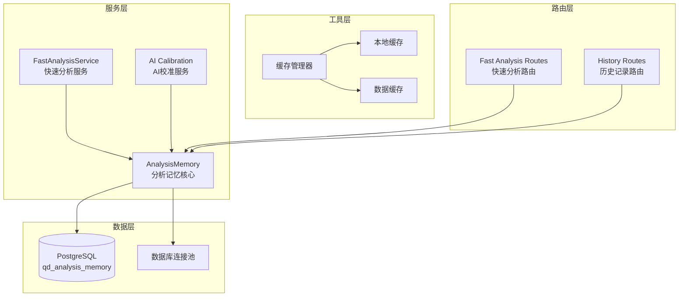
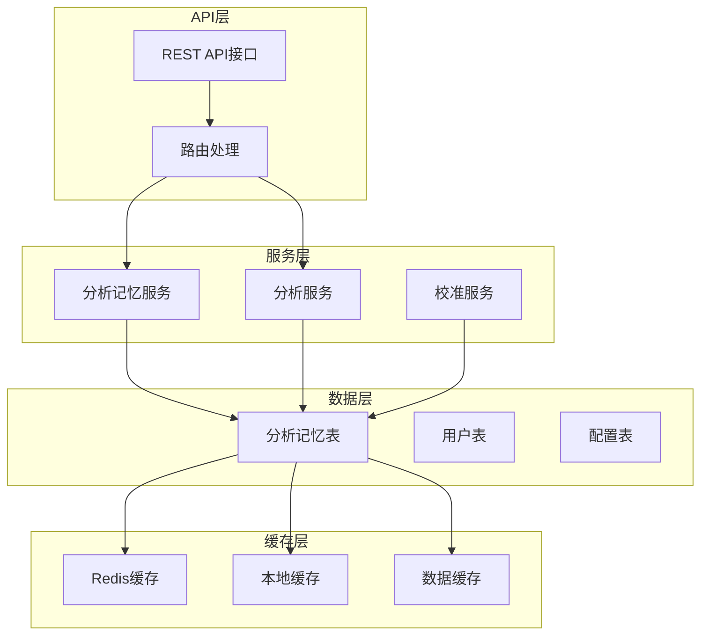
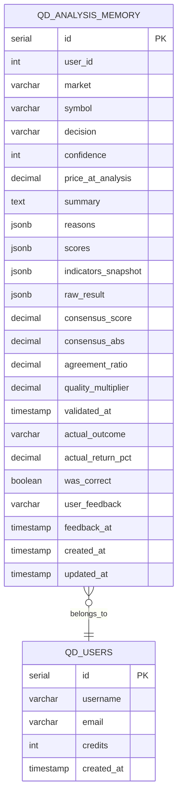
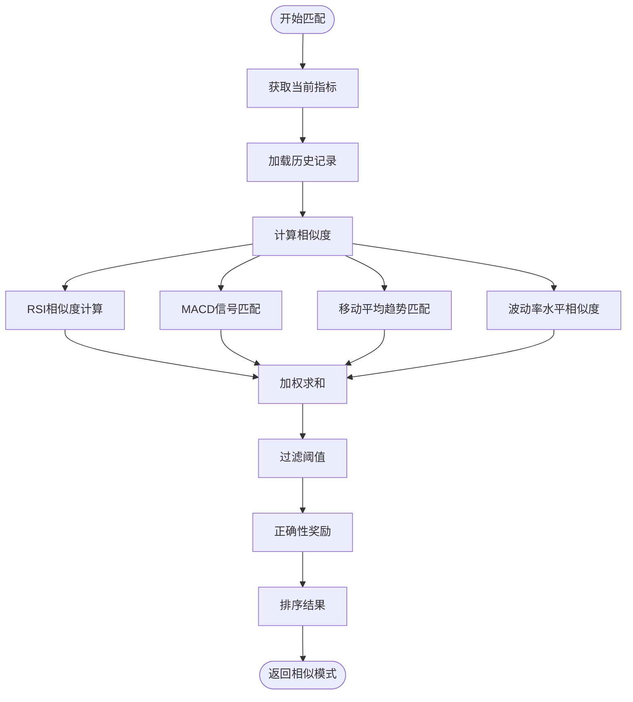
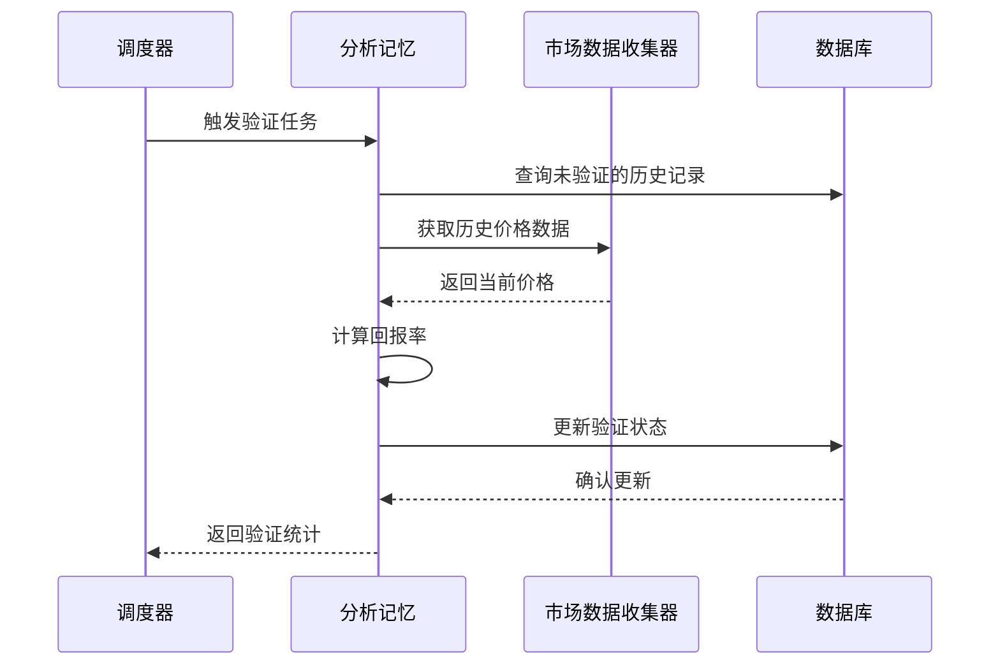
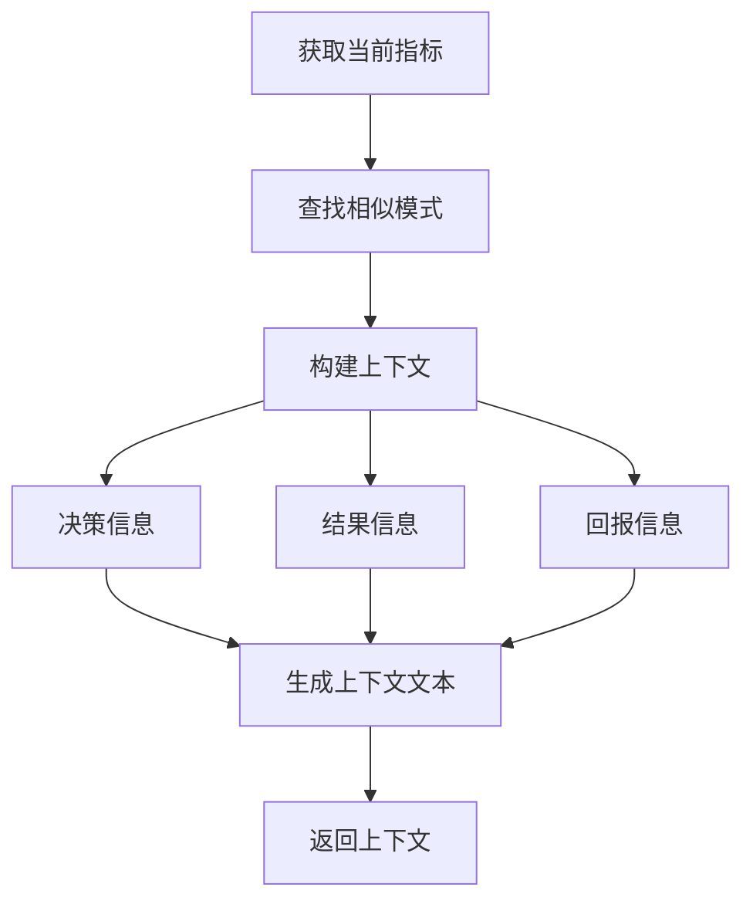
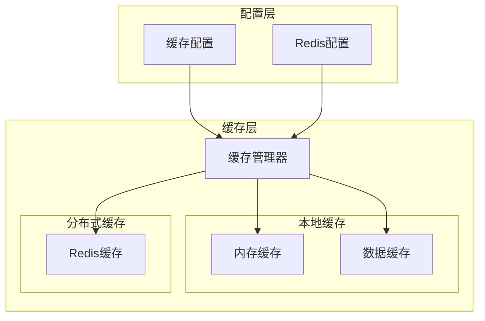
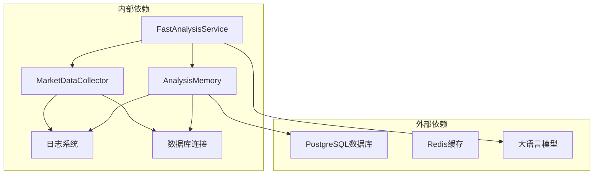

# 分析记忆系统

<cite>
**本文档引用的文件**
- [analysis_memory.py](file://backend_api_python/app/services/analysis_memory.py)
- [fast_analysis.py](file://backend_api_python/app/services/fast_analysis.py)
- [fast_analysis.py](file://backend_api_python/app/routes/fast_analysis.py)
- [db.py](file://backend_api_python/app/utils/db.py)
- [cache.py](file://backend_api_python/app/utils/cache.py)
- [cache_manager.py](file://backend_api_python/app/data_sources/cache_manager.py)
- [database.py](file://backend_api_python/app/config/database.py)
- [init.sql](file://backend_api_python/migrations/init.sql)
- [ai_calibration.py](file://backend_api_python/app/services/ai_calibration.py)
</cite>

## 目录
1. [简介](#简介)
2. [项目结构](#项目结构)
3. [核心组件](#核心组件)
4. [架构概览](#架构概览)
5. [详细组件分析](#详细组件分析)
6. [依赖关系分析](#依赖关系分析)
7. [性能考量](#性能考量)
8. [故障排除指南](#故障排除指南)
9. [结论](#结论)
10. [附录](#附录)

## 简介

QuantDinger的分析记忆系统是一个智能化的历史分析数据存储与检索框架，旨在通过机器学习和历史数据分析来提升AI交易决策的质量。该系统的核心目标包括：

- **历史分析数据存储**：完整记录每次AI分析的结果、决策依据和性能表现
- **相似模式匹配**：基于技术指标相似度算法，快速检索历史相似分析案例
- **决策结果跟踪**：自动验证历史决策的准确性，建立学习反馈循环
- **上下文构建**：为当前分析提供基于历史经验的智能上下文支持

系统采用PostgreSQL作为主要存储引擎，结合JSONB字段实现灵活的数据结构，支持复杂的分析结果存储和高效查询。

## 项目结构

分析记忆系统在QuantDinger项目中的组织结构如下：



**图表来源**
- [analysis_memory.py:36-44](file://backend_api_python/app/services/analysis_memory.py#L36-L44)
- [fast_analysis.py:186-200](file://backend_api_python/app/services/fast_analysis.py#L186-L200)
- [fast_analysis.py:924-955](file://backend_api_python/app/services/fast_analysis.py#L924-L955)

**章节来源**
- [analysis_memory.py:1-100](file://backend_api_python/app/services/analysis_memory.py#L1-L100)
- [fast_analysis.py:1-100](file://backend_api_python/app/services/fast_analysis.py#L1-L100)

## 核心组件

### AnalysisMemory 类

AnalysisMemory是分析记忆系统的核心类，负责所有历史分析数据的存储、检索和管理。其主要功能包括：

- **数据存储**：将完整的分析结果存储到PostgreSQL数据库
- **历史检索**：提供多种查询方式获取历史分析记录
- **相似模式匹配**：基于技术指标相似度算法查找类似历史案例
- **决策验证**：自动验证历史决策的准确性
- **性能统计**：计算AI性能指标和准确率

### FastAnalysisService 集成

FastAnalysisService与分析记忆系统的深度集成体现在：

- **自动存储**：每次分析完成后自动将结果存储到记忆系统
- **上下文构建**：在新分析中自动检索相关的历史模式
- **反馈循环**：支持用户对历史分析的反馈，形成学习闭环

### 缓存策略

系统实现了多层次的缓存策略：

- **本地内存缓存**：默认启用，提供快速的数据访问
- **Redis缓存**：可选启用，支持分布式缓存
- **数据缓存**：针对特定数据类型的专用缓存

**章节来源**
- [analysis_memory.py:36-235](file://backend_api_python/app/services/analysis_memory.py#L36-L235)
- [fast_analysis.py:1479-1490](file://backend_api_python/app/services/fast_analysis.py#L1479-L1490)

## 架构概览

分析记忆系统的整体架构采用分层设计，确保了系统的可扩展性和维护性：



**图表来源**
- [analysis_memory.py:45-174](file://backend_api_python/app/services/analysis_memory.py#L45-L174)
- [fast_analysis.py:924-1490](file://backend_api_python/app/services/fast_analysis.py#L924-L1490)

### 数据持久化架构

系统采用PostgreSQL作为主要存储引擎，设计了专门的分析记忆表：



**图表来源**
- [init.sql:779-800](file://backend_api_python/migrations/init.sql#L779-L800)

**章节来源**
- [init.sql:779-800](file://backend_api_python/migrations/init.sql#L779-L800)
- [analysis_memory.py:53-81](file://backend_api_python/app/services/analysis_memory.py#L53-L81)

## 详细组件分析

### 相似模式匹配算法

相似模式匹配是分析记忆系统的核心功能之一，通过多指标加权相似度算法实现：

#### 算法原理



**图表来源**
- [analysis_memory.py:512-583](file://backend_api_python/app/services/analysis_memory.py#L512-L583)

#### 相似度计算公式

系统采用多指标加权相似度计算：

- **RSI指标**：±15范围内的相似度，权重0.3
- **MACD信号**：精确匹配，权重0.3  
- **移动平均趋势**：精确匹配，权重0.25
- **波动率水平**：相似带匹配，权重0.15

相似度计算公式：
```
相似度 = Σ(指标相似度 × 权重)
```

其中，正确性奖励机制为历史正确的分析提供额外权重。

**章节来源**
- [analysis_memory.py:512-583](file://backend_api_python/app/services/analysis_memory.py#L512-L583)

### 决策验证机制

系统实现了自动化的决策验证机制，通过比较分析时的价格和后续的实际价格变化来验证决策准确性：

#### 验证流程



**图表来源**
- [analysis_memory.py:608-699](file://backend_api_python/app/services/analysis_memory.py#L608-L699)

#### 验证标准

验证采用动态阈值机制：
- **买入验证**：回报率 > 2%
- **卖出验证**：回报率 < -2%  
- **持有验证**：绝对回报率 ≤ 5%

**章节来源**
- [analysis_memory.py:608-777](file://backend_api_python/app/services/analysis_memory.py#L608-L777)

### 记忆上下文构建

系统能够为当前分析构建丰富的历史上下文信息：

#### 上下文构建流程



**图表来源**
- [fast_analysis.py:451-483](file://backend_api_python/app/services/fast_analysis.py#L451-L483)

#### 上下文内容

构建的上下文包含：
- **历史决策**：相似条件下的历史决策
- **实际结果**：历史决策的实际回报情况
- **决策依据**：历史决策的关键技术指标
- **性能表现**：历史决策的准确性统计

**章节来源**
- [fast_analysis.py:451-483](file://backend_api_python/app/services/fast_analysis.py#L451-L483)

### 缓存策略

系统实现了多层次的缓存策略来提升性能：

#### 缓存架构



**图表来源**
- [cache.py:49-99](file://backend_api_python/app/utils/cache.py#L49-L99)

#### 缓存配置

系统支持灵活的缓存配置：

- **本地缓存**：默认启用，适合单机部署
- **Redis缓存**：可选启用，支持分布式部署
- **数据缓存**：针对特定数据类型的专用缓存
- **缓存过期**：可配置的TTL（生存时间）

**章节来源**
- [cache.py:17-128](file://backend_api_python/app/utils/cache.py#L17-L128)
- [cache_manager.py:44-232](file://backend_api_python/app/data_sources/cache_manager.py#L44-L232)

## 依赖关系分析

分析记忆系统与其他组件的依赖关系如下：



**图表来源**
- [analysis_memory.py:16-19](file://backend_api_python/app/services/analysis_memory.py#L16-L19)
- [fast_analysis.py:18-22](file://backend_api_python/app/services/fast_analysis.py#L18-L22)

### 数据库依赖

系统对PostgreSQL的依赖主要体现在：

- **表结构定义**：专门的分析记忆表结构
- **JSONB支持**：利用PostgreSQL的JSONB类型存储复杂数据
- **索引优化**：为常用查询字段建立索引
- **事务处理**：保证数据一致性和完整性

**章节来源**
- [analysis_memory.py:45-174](file://backend_api_python/app/services/analysis_memory.py#L45-L174)
- [init.sql:779-800](file://backend_api_python/migrations/init.sql#L779-L800)

## 性能考量

分析记忆系统在设计时充分考虑了性能优化：

### 查询优化

系统通过以下方式优化查询性能：

- **索引策略**：为常用查询字段建立复合索引
- **查询限制**：合理限制查询结果数量
- **缓存机制**：多级缓存减少数据库访问
- **异步处理**：后台任务处理耗时操作

### 存储优化

存储层面的优化措施：

- **JSONB压缩**：PostgreSQL自动压缩JSONB数据
- **字段选择**：只存储必要的分析数据
- **数据类型优化**：使用合适的数据类型减少存储空间
- **定期清理**：自动清理过期的历史数据

### 并发处理

系统支持高并发场景：

- **连接池**：数据库连接池管理
- **锁机制**：适当的并发控制
- **异步队列**：后台任务异步处理
- **缓存一致性**：保证缓存数据的一致性

## 故障排除指南

### 常见问题及解决方案

#### 数据库连接问题

**问题症状**：无法连接到PostgreSQL数据库
**解决方法**：
1. 检查DATABASE_URL环境变量配置
2. 验证数据库服务状态
3. 确认网络连接正常
4. 检查防火墙设置

#### 缓存失效问题

**问题症状**：缓存数据不更新或过期
**解决方法**：
1. 检查缓存配置参数
2. 验证Redis服务状态（如果启用）
3. 清理缓存并重新加载
4. 检查缓存过期时间设置

#### 性能问题

**问题症状**：查询响应缓慢
**解决方法**：
1. 检查数据库索引是否完整
2. 优化查询语句
3. 增加缓存命中率
4. 调整数据库连接池大小

**章节来源**
- [analysis_memory.py:232-234](file://backend_api_python/app/services/analysis_memory.py#L232-L234)
- [cache.py:94-98](file://backend_api_python/app/utils/cache.py#L94-L98)

## 结论

QuantDinger的分析记忆系统通过智能化的历史数据管理和相似模式匹配算法，为AI交易决策提供了强大的知识支撑。系统的主要优势包括：

1. **完整的数据生命周期管理**：从数据收集、存储到分析验证的全流程管理
2. **智能相似度匹配**：基于多指标加权的相似度算法，提供精准的历史案例检索
3. **自动化的学习机制**：通过决策验证和反馈循环，持续提升AI决策质量
4. **高性能架构设计**：多级缓存和优化的数据库设计确保系统性能
5. **灵活的扩展能力**：模块化设计支持功能扩展和定制化需求

该系统为QuantDinger平台提供了坚实的知识基础，有助于提升AI交易决策的准确性和可靠性。

## 附录

### API使用示例

#### 查询历史分析记录

```javascript
// 获取指定符号的最近分析历史
GET /api/fast-analysis/history?market=Crypto&symbol=BTC/USDT&days=7&limit=10

// 获取用户的完整分析历史
GET /api/fast-analysis/history/all?page=1&pagesize=20
```

#### 获取相似模式

```javascript
// 获取相似的历史分析模式
GET /api/fast-analysis/similar?market=Crypto&symbol=BTC/USDT
```

#### 提交用户反馈

```javascript
// 提交对分析结果的反馈
POST /api/fast-analysis/feedback
{
    "memory_id": 123,
    "feedback": "helpful"
}
```

### 配置选项

系统支持多种配置选项：

- **缓存启用**：通过环境变量控制缓存功能
- **缓存过期时间**：可配置的TTL参数
- **分析缓存时间**：专门针对分析结果的缓存策略
- **Redis配置**：分布式缓存的详细配置参数

**章节来源**
- [fast_analysis.py:527-686](file://backend_api_python/app/routes/fast_analysis.py#L527-L686)
- [database.py:49-90](file://backend_api_python/app/config/database.py#L49-L90)