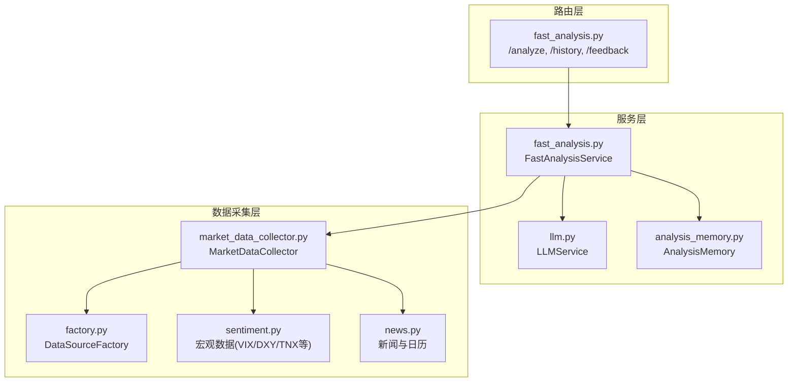
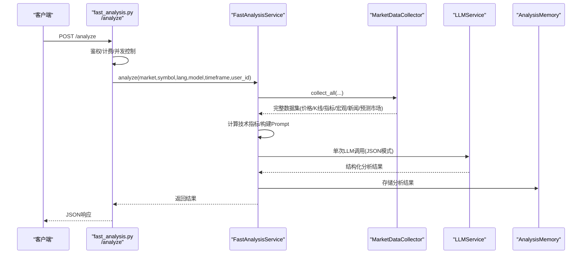
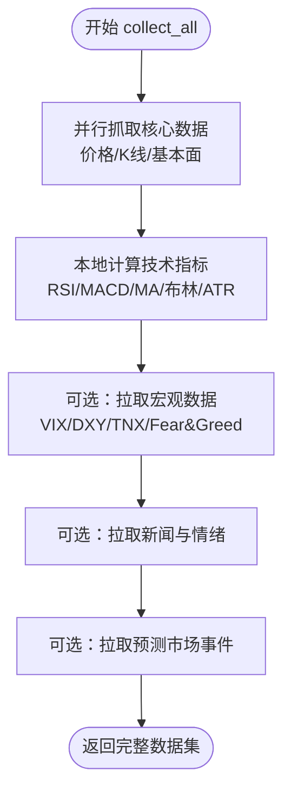
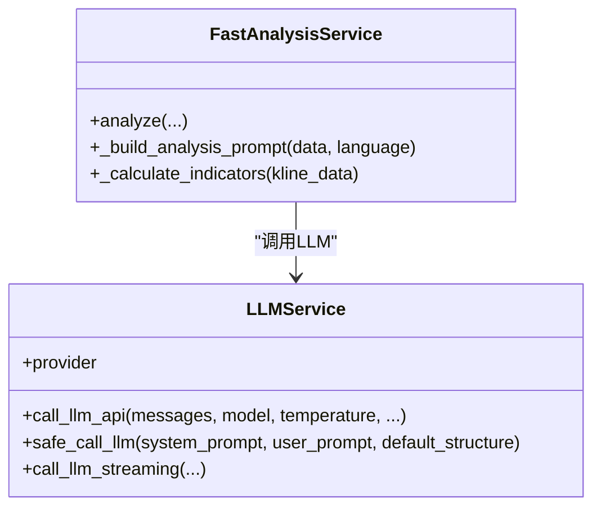
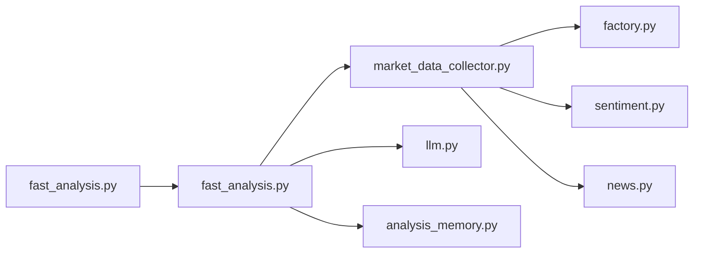

# 快速分析服务

<cite>
**本文引用的文件**
- [fast_analysis.py](file://backend_api_python/app/routes/fast_analysis.py)
- [fast_analysis.py](file://backend_api_python/app/services/fast_analysis.py)
- [market_data_collector.py](file://backend_api_python/app/services/market_data_collector.py)
- [llm.py](file://backend_api_python/app/services/llm.py)
- [analysis_memory.py](file://backend_api_python/app/services/analysis_memory.py)
- [factory.py](file://backend_api_python/app/data_sources/factory.py)
- [sentiment.py](file://backend_api_python/app/data_providers/sentiment.py)
- [news.py](file://backend_api_python/app/data_providers/news.py)
- [builtin_indicators.py](file://backend_api_python/app/services/builtin_indicators.py)
</cite>

## 目录
1. [简介](#简介)
2. [项目结构](#项目结构)
3. [核心组件](#核心组件)
4. [架构总览](#架构总览)
5. [详细组件分析](#详细组件分析)
6. [依赖关系分析](#依赖关系分析)
7. [性能考量](#性能考量)
8. [故障排查指南](#故障排查指南)
9. [结论](#结论)
10. [附录](#附录)

## 简介
本文件面向QuantDinger的“快速分析服务”，系统性阐述FastAnalysisService的架构设计与实现要点，重点覆盖：
- 统一数据采集器的使用与并行化策略
- 多维度数据分析流程（技术指标、宏观数据、新闻与预测市场）
- 单次LLM调用的Prompt工程与结构化输出
- 数据预处理、异常处理与性能优化最佳实践
- 完整API使用示例与自然语言描述到分析报告的端到端流程

## 项目结构
快速分析服务位于后端Python应用中，主要涉及以下模块：
- 路由层：提供REST接口，负责鉴权、计费、并发控制与异步任务提交
- 服务层：FastAnalysisService封装统一数据采集、指标计算、Prompt构建与LLM调用
- 数据采集层：MarketDataCollector统一接入K线、价格、技术指标、宏观、新闻与预测市场数据
- LLM服务层：LLMService多提供商适配、负载均衡与容错
- 记忆层：AnalysisMemory持久化历史分析、相似模式检索与校验

图表来源
- [fast_analysis.py:113-346](file://backend_api_python/app/routes/fast_analysis.py#L113-L346)
- [fast_analysis.py:186-233](file://backend_api_python/app/services/fast_analysis.py#L186-L233)
- [market_data_collector.py:72-224](file://backend_api_python/app/services/market_data_collector.py#L72-L224)
- [llm.py:73-126](file://backend_api_python/app/services/llm.py#L73-L126)
- [analysis_memory.py:36-174](file://backend_api_python/app/services/analysis_memory.py#L36-L174)
- [factory.py:13-71](file://backend_api_python/app/data_sources/factory.py#L13-L71)
- [sentiment.py:12-181](file://backend_api_python/app/data_providers/sentiment.py#L12-L181)
- [news.py:13-70](file://backend_api_python/app/data_providers/news.py#L13-L70)

章节来源
- [fast_analysis.py:113-346](file://backend_api_python/app/routes/fast_analysis.py#L113-L346)
- [fast_analysis.py:186-233](file://backend_api_python/app/services/fast_analysis.py#L186-L233)
- [market_data_collector.py:72-224](file://backend_api_python/app/services/market_data_collector.py#L72-L224)

## 核心组件
- 路由与并发控制
  - 提供POST /analyze与历史查询、反馈接口
  - 内存级“飞行中”锁防重，避免重复扣费
  - 支持同步与异步两种模式，异步模式通过后台线程执行并记录pending状态
- FastAnalysisService
  - 统一数据采集：调用MarketDataCollector，一次性收集价格、K线、技术指标、宏观、新闻、预测市场
  - 指标计算：本地计算RSI、MACD、移动平均、布林带、ATR、波动率等
  - Prompt工程：强约束规则、多因子融合、价格区间限制、语言指令强制
  - 单次LLM调用：要求严格JSON输出，失败自动回退默认结构
  - 记忆与学习：将结果持久化，相似模式检索，定期校验正确性
- MarketDataCollector
  - 并行抓取核心数据（价格/K线/基本面/技术指标）
  - 宏观数据复用全局缓存（VIX、DXY、TNX、Fear&Greed等）
  - 新闻与预测市场数据可选拉取
- LLMService
  - 多提供商支持（OpenRouter、OpenAI、Google、DeepSeek、Grok、Ollama）
  - 负载均衡与节点选择、自动备用提供商切换
  - JSON模式输出与流式响应支持
- AnalysisMemory
  - PostgreSQL持久化，支持相似模式检索、历史校验与反馈

章节来源
- [fast_analysis.py:113-346](file://backend_api_python/app/routes/fast_analysis.py#L113-L346)
- [fast_analysis.py:186-761](file://backend_api_python/app/services/fast_analysis.py#L186-L761)
- [market_data_collector.py:72-510](file://backend_api_python/app/services/market_data_collector.py#L72-L510)
- [llm.py:73-800](file://backend_api_python/app/services/llm.py#L73-L800)
- [analysis_memory.py:36-583](file://backend_api_python/app/services/analysis_memory.py#L36-L583)

## 架构总览
快速分析服务采用“统一数据采集 + 单次LLM调用”的高性能架构：
- 数据层：统一入口MarketDataCollector，内部并行拉取价格/K线/技术指标，并按需拉取宏观、新闻与预测市场
- 分析层：FastAnalysisService集中处理指标解读、Prompt构建与LLM调用，保证输出结构化
- 记忆层：AnalysisMemory记录历史分析，支持相似模式检索与长期校验
- 路由层：提供鉴权、计费、并发控制与异步任务管理

图表来源
- [fast_analysis.py:113-346](file://backend_api_python/app/routes/fast_analysis.py#L113-L346)
- [fast_analysis.py:186-761](file://backend_api_python/app/services/fast_analysis.py#L186-L761)
- [market_data_collector.py:72-224](file://backend_api_python/app/services/market_data_collector.py#L72-L224)
- [llm.py:470-796](file://backend_api_python/app/services/llm.py#L470-L796)
- [analysis_memory.py:175-234](file://backend_api_python/app/services/analysis_memory.py#L175-L234)

## 详细组件分析

### 组件A：统一数据采集器（MarketDataCollector）
- 设计理念：统一数据源、并行抓取、本地计算技术指标、可选拉取宏观与新闻
- 并行策略：核心数据（价格/K线/基本面）使用ThreadPoolExecutor并行获取，超时控制与失败回退
- 技术指标：本地计算RSI、MACD、MA、布林带、ATR、波动率、支撑阻力、交易建议等
- 宏观数据：复用全局缓存（VIX、DXY、TNX、Fear&Greed等）
- 新闻与预测市场：可选拉取，用于Prompt增强

图表来源
- [market_data_collector.py:72-224](file://backend_api_python/app/services/market_data_collector.py#L72-L224)
- [market_data_collector.py:299-510](file://backend_api_python/app/services/market_data_collector.py#L299-L510)
- [sentiment.py:12-181](file://backend_api_python/app/data_providers/sentiment.py#L12-L181)
- [news.py:13-70](file://backend_api_python/app/data_providers/news.py#L13-L70)

章节来源
- [market_data_collector.py:72-510](file://backend_api_python/app/services/market_data_collector.py#L72-L510)
- [sentiment.py:12-181](file://backend_api_python/app/data_providers/sentiment.py#L12-L181)
- [news.py:13-70](file://backend_api_python/app/data_providers/news.py#L13-L70)

### 组件B：技术指标计算（RSI、MACD、移动平均线等）
- RSI：Wilder平滑法，14日周期，超买/超卖阈值判定
- MACD：EMA12/EMA26/EMA9，金叉死叉与柱状图趋势
- 移动平均：MA5/MA10/MA20，趋势识别
- 布林带：20日SMA±2σ，宽度百分比
- ATR与波动率：Wilder ATR，20日窗口，换算波动率百分比
- 支撑/阻力：枢轴点、近期高低点、布林轨三者综合
- 交易建议：基于ATR与支撑阻力的止盈止损与RR比

章节来源
- [market_data_collector.py:310-510](file://backend_api_python/app/services/market_data_collector.py#L310-L510)
- [fast_analysis.py:234-356](file://backend_api_python/app/services/fast_analysis.py#L234-L356)

### 组件C：宏观数据整合（DXY、VIX、利率等）
- VIX：CBOE波动率指数，多源回退（yfinance/akshare），分档解读
- DXY：美元指数，多源回退（yfinance/akshare），强弱影响资产类别
- TNX：10年期美债收益率，计算2年期/10年期利差，倒挂预警
- Fear&Greed：加密恐惧贪婪指数
- Put/Call比率代理：VIX期限结构，短期恐慌/自满信号

章节来源
- [sentiment.py:45-377](file://backend_api_python/app/data_providers/sentiment.py#L45-L377)

### 组件D：新闻情感分析与重大事件检测
- 新闻来源：结构化搜索，去重与分类
- 地缘政治事件检测：正则与中文关键词匹配，区分严重与中等级别
- 情绪惩罚：根据事件严重程度对风险评估施加惩罚

章节来源
- [news.py:13-70](file://backend_api_python/app/data_providers/news.py#L13-L70)
- [fast_analysis.py:81-183](file://backend_api_python/app/services/fast_analysis.py#L81-L183)

### 组件E：预测市场数据处理
- 预测市场事件：相关事件与当前概率，作为市场共识参考
- 格式化：限定数量与长度，融入Prompt

章节来源
- [fast_analysis.py:374-385](file://backend_api_python/app/services/fast_analysis.py#L374-L385)

### 组件F：单次LLM调用与Prompt工程
- 强约束规则：多因子优先级、决策阈值、价格区间限制、语言强制
- 输出结构：严格JSON Schema，失败自动回退默认结构
- 多提供商：OpenRouter、OpenAI、Google、DeepSeek、Grok、Ollama
- 负载均衡：基于注册中心的节点选择与统计

图表来源
- [llm.py:73-796](file://backend_api_python/app/services/llm.py#L73-L796)
- [fast_analysis.py:486-761](file://backend_api_python/app/services/fast_analysis.py#L486-L761)

章节来源
- [llm.py:73-796](file://backend_api_python/app/services/llm.py#L73-L796)
- [fast_analysis.py:486-761](file://backend_api_python/app/services/fast_analysis.py#L486-L761)

### 组件G：记忆与学习（AnalysisMemory）
- 存储：决策、置信度、价格、摘要、原因、评分、指标快照、原始结果
- 查询：最近历史、分页查询、相似模式检索（多指标加权）
- 校验：定期回测历史决策，计算准确率与收益
- 反馈：用户反馈记录

章节来源
- [analysis_memory.py:36-583](file://backend_api_python/app/services/analysis_memory.py#L36-L583)

### 组件H：路由与并发控制（fast_analysis.py）
- /analyze：鉴权、计费、并发控制、异步提交、后台线程执行
- /history：按符号查询最近历史与分页查询
- /feedback：记录用户反馈
- 飞行中锁：防止同一用户对同一标的/周期重复分析导致的重复扣费

章节来源
- [fast_analysis.py:113-346](file://backend_api_python/app/routes/fast_analysis.py#L113-L346)
- [fast_analysis.py:527-754](file://backend_api_python/app/routes/fast_analysis.py#L527-L754)

## 依赖关系分析
- 组件耦合
  - FastAnalysisService依赖MarketDataCollector（数据）、LLMService（推理）、AnalysisMemory（存储）
  - MarketDataCollector依赖DataSourceFactory（统一数据源）、宏观与新闻提供者
  - 路由层依赖服务层与计费/内存服务
- 外部依赖
  - LLM提供商API（OpenRouter、OpenAI、Google、DeepSeek、Grok、Ollama）
  - yfinance、akshare等第三方库
  - PostgreSQL（AnalysisMemory）

图表来源
- [fast_analysis.py:113-346](file://backend_api_python/app/routes/fast_analysis.py#L113-L346)
- [fast_analysis.py:186-233](file://backend_api_python/app/services/fast_analysis.py#L186-L233)
- [market_data_collector.py:72-224](file://backend_api_python/app/services/market_data_collector.py#L72-L224)
- [llm.py:73-126](file://backend_api_python/app/services/llm.py#L73-L126)
- [analysis_memory.py:36-174](file://backend_api_python/app/services/analysis_memory.py#L36-L174)
- [factory.py:13-71](file://backend_api_python/app/data_sources/factory.py#L13-L71)
- [sentiment.py:12-181](file://backend_api_python/app/data_providers/sentiment.py#L12-L181)
- [news.py:13-70](file://backend_api_python/app/data_providers/news.py#L13-L70)

## 性能考量
- 并行抓取：核心数据使用线程池并行获取，缩短等待时间
- 本地指标计算：避免外部API依赖，降低延迟与错误面
- 超时与回退：各阶段设置合理超时与回退逻辑，提升鲁棒性
- 缓存复用：宏观数据与新闻数据复用全局缓存
- LLM优化：单次调用+JSON模式，减少Token消耗；负载均衡与备用提供商切换
- 内存与数据库：飞行中锁与异步任务避免重复计算与扣费

## 故障排查指南
- LLM调用失败
  - 检查API密钥配置与提供商可用性
  - 观察HTTP状态码（402/403/404/429）与错误信息
  - 启用备用提供商或回退模型
- 数据采集失败
  - 查看MarketDataCollector日志，确认超时与回退路径
  - 检查DataSourceFactory与具体数据源可用性
- 计费与退款
  - 路由层在异常时尝试自动退款，检查日志与账务服务
- 历史与反馈
  - 使用/history接口核对存储状态
  - 通过/feedback记录用户反馈，辅助后续校验

章节来源
- [llm.py:638-722](file://backend_api_python/app/services/llm.py#L638-L722)
- [fast_analysis.py:25-88](file://backend_api_python/app/routes/fast_analysis.py#L25-L88)
- [market_data_collector.py:155-224](file://backend_api_python/app/services/market_data_collector.py#L155-L224)
- [analysis_memory.py:438-510](file://backend_api_python/app/services/analysis_memory.py#L438-L510)

## 结论
快速分析服务通过“统一数据采集 + 单次LLM调用”的设计，在保证分析质量的同时显著提升了性能与稳定性。其关键优势包括：
- 统一数据源与并行抓取，确保数据一致性与时效性
- 本地指标计算与强约束Prompt，减少外部依赖与输出不确定性
- 多提供商LLM与负载均衡，提高可用性与成本可控性
- 记忆与校验机制，持续优化分析质量

## 附录

### API使用示例（自然语言到分析报告）
- 请求路径
  - POST /api/fast-analysis/analyze
- 请求体字段
  - market: 市场类型（如 USStock、Crypto、Forex、Futures）
  - symbol: 交易标的（如 AAPL、BTC/USD、EUR/USD）
  - language: 语言（如 zh-CN、en-US、ja-JP）
  - model: LLM模型（可选，遵循提供商规范）
  - timeframe: K线周期（如 1D，默认1D）
  - async_submit: 是否异步提交（布尔）
- 响应字段
  - code: 1表示成功，0表示失败
  - msg: 描述信息
  - data: 分析结果对象（包含决策、置信度、摘要、技术/基本面/情绪分析、入场/止损/止盈、时间框架、关键原因、风险、评分等）

章节来源
- [fast_analysis.py:113-346](file://backend_api_python/app/routes/fast_analysis.py#L113-L346)

### 技术指标计算方法（摘要）
- RSI：Wilder平滑，14日周期，超买/超卖阈值
- MACD：EMA12/EMA26/EMA9，金叉/死叉与柱状图趋势
- 移动平均：MA5/MA10/MA20，趋势识别
- 布林带：20日SMA±2σ，宽度百分比
- ATR与波动率：Wilder ATR，换算波动率百分比
- 支撑/阻力：枢轴点、近期高低点、布林轨综合
- 交易建议：基于ATR与支撑阻力的止盈止损与RR比

章节来源
- [market_data_collector.py:310-510](file://backend_api_python/app/services/market_data_collector.py#L310-L510)
- [fast_analysis.py:234-356](file://backend_api_python/app/services/fast_analysis.py#L234-L356)

### 宏观数据整合（摘要）
- VIX：波动率指数，分档解读与变化
- DXY：美元指数，强弱影响资产类别
- TNX：10年期美债收益率，利差与倒挂预警
- Fear&Greed：加密市场情绪指数
- Put/Call比率代理：VIX期限结构，短期恐慌/自满信号

章节来源
- [sentiment.py:45-377](file://backend_api_python/app/data_providers/sentiment.py#L45-L377)

### 新闻情感分析与预测市场
- 新闻：结构化搜索、去重与分类
- 地缘政治事件检测：正则与中文关键词匹配
- 预测市场：相关事件与概率，融入Prompt

章节来源
- [news.py:13-70](file://backend_api_python/app/data_providers/news.py#L13-L70)
- [fast_analysis.py:81-183](file://backend_api_python/app/services/fast_analysis.py#L81-L183)
- [fast_analysis.py:374-385](file://backend_api_python/app/services/fast_analysis.py#L374-L385)

### 数据预处理与异常处理最佳实践
- 数据预处理
  - 价格与K线数据清洗与类型转换
  - 技术指标计算采用稳健算法（Wilder平滑、EMA种子SMA）
  - 宏观与新闻数据采用多源回退策略
- 异常处理
  - 各阶段设置超时与失败回退
  - LLM调用失败自动回退默认结构
  - 计费失败不影响分析主流程，但记录日志并尝试退款

章节来源
- [market_data_collector.py:228-297](file://backend_api_python/app/services/market_data_collector.py#L228-L297)
- [llm.py:753-796](file://backend_api_python/app/services/llm.py#L753-L796)
- [fast_analysis.py:25-88](file://backend_api_python/app/routes/fast_analysis.py#L25-L88)