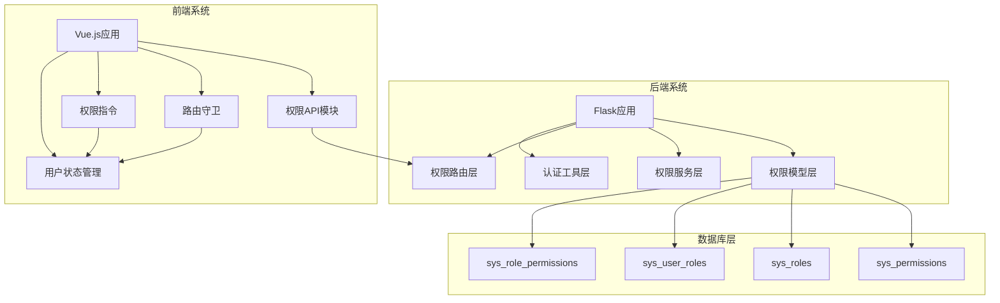
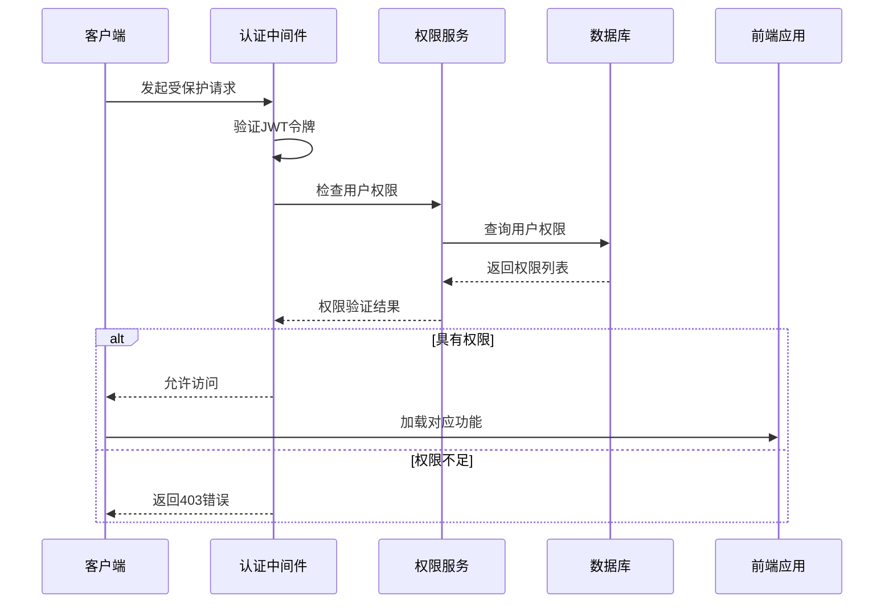
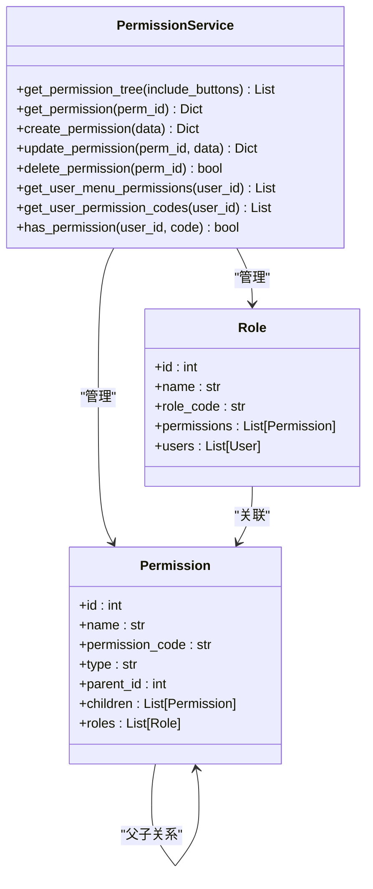
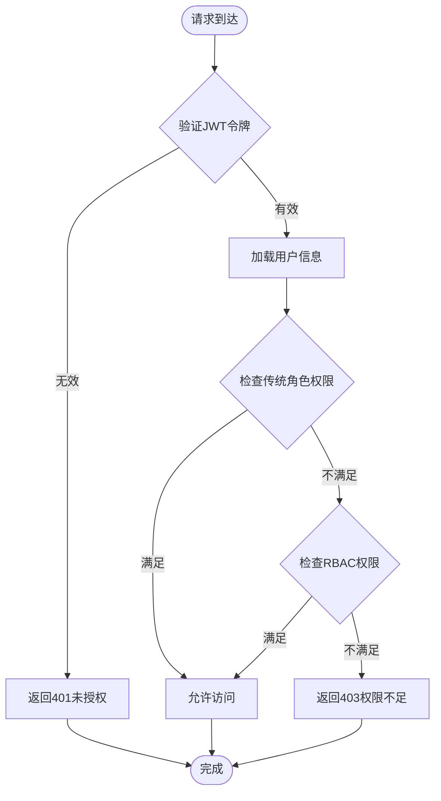
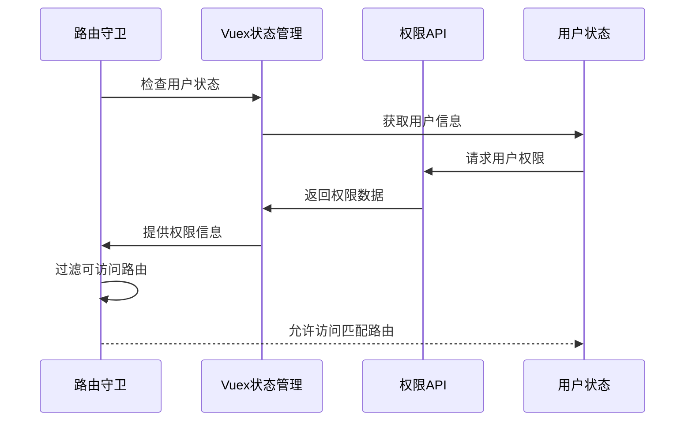
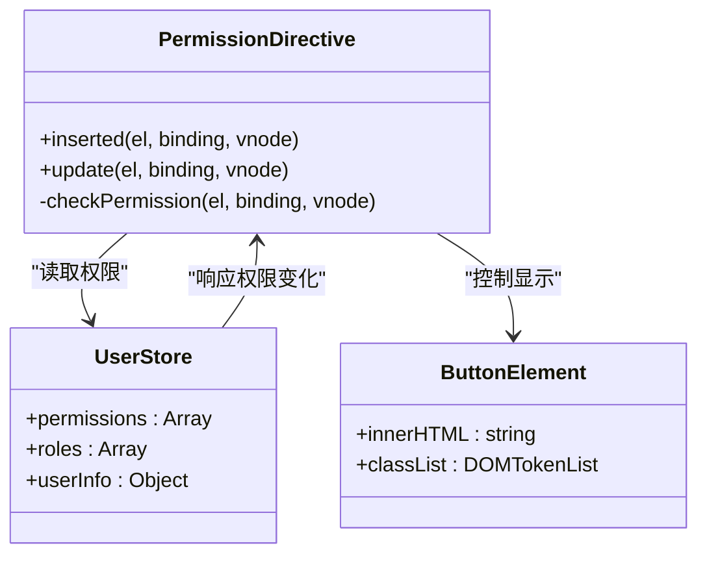
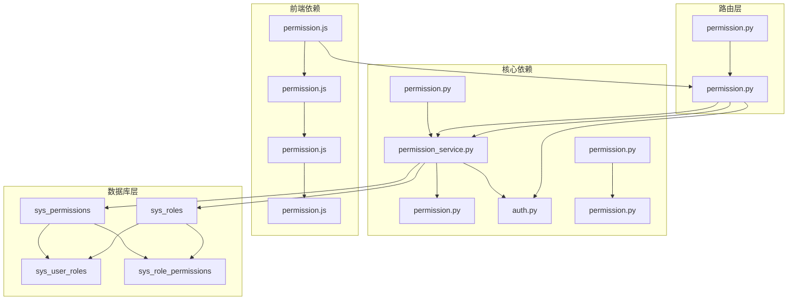

# RBAC权限系统

<cite>
**本文档引用的文件**
- [backend_api_python/app/models/permission.py](file://backend_api_python/app/models/permission.py)
- [backend_api_python/app/services/permission_service.py](file://backend_api_python/app/services/permission_service.py)
- [backend_api_python/app/routes/permission.py](file://backend_api_python/app/routes/permission.py)
- [backend_api_python/app/utils/auth.py](file://backend_api_python/app/utils/auth.py)
- [backend_api_python/migrations/002_rbac_init.sql](file://backend_api_python/migrations/002_rbac_init.sql)
- [frontend/src/api/permission.js](file://frontend/src/api/permission.js)
- [frontend/src/permission.js](file://frontend/src/permission.js)
- [frontend/src/directives/hasPermi.js](file://frontend/src/directives/hasPermi.js)
- [frontend/src/store/modules/user.js](file://frontend/src/store/modules/user.js)
- [frontend/src/router/generator-routers.js](file://frontend/src/router/generator-routers.js)
</cite>

## 目录
1. [简介](#简介)
2. [项目结构](#项目结构)
3. [核心组件](#核心组件)
4. [架构概览](#架构概览)
5. [详细组件分析](#详细组件分析)
6. [依赖关系分析](#依赖关系分析)
7. [性能考虑](#性能考虑)
8. [故障排除指南](#故障排除指南)
9. [结论](#结论)

## 简介

QuantDinger项目采用基于角色的访问控制（RBAC）权限管理系统，实现了完整的权限管理功能，包括权限树管理、角色管理、用户角色分配和权限验证。该系统支持多层次的权限控制，涵盖菜单权限、操作权限和数据权限，为金融量化交易平台提供了安全可靠的权限保障。

## 项目结构

RBAC权限系统主要分布在前后端两个部分：

**图表来源**
- [backend_api_python/app/models/permission.py:15-106](file://backend_api_python/app/models/permission.py#L15-L106)
- [frontend/src/api/permission.js:1-86](file://frontend/src/api/permission.js#L1-L86)

**章节来源**
- [backend_api_python/app/models/permission.py:1-106](file://backend_api_python/app/models/permission.py#L1-L106)
- [frontend/src/api/permission.js:1-86](file://frontend/src/api/permission.js#L1-L86)

## 核心组件

### 数据库模型设计

RBAC系统采用四张核心表实现完整的权限管理：

1. **sys_permissions** - 权限/菜单表，存储所有权限项
2. **sys_roles** - 角色表，定义系统角色
3. **sys_user_roles** - 用户-角色关联表，多对多关系
4. **sys_role_permissions** - 角色-权限关联表，多对多关系

### 权限类型分类

系统支持三种权限类型：
- **dir** - 目录类型，用于构建菜单树结构
- **menu** - 菜单项，对应具体的页面路由
- **button** - 按钮权限，用于细粒度的操作权限控制

**章节来源**
- [backend_api_python/app/models/permission.py:15-106](file://backend_api_python/app/models/permission.py#L15-L106)
- [backend_api_python/migrations/002_rbac_init.sql:9-42](file://backend_api_python/migrations/002_rbac_init.sql#L9-L42)

## 架构概览

RBAC权限系统采用分层架构设计，实现了前后端分离的权限控制机制：

**图表来源**
- [backend_api_python/app/utils/auth.py:124-172](file://backend_api_python/app/utils/auth.py#L124-L172)
- [backend_api_python/app/services/permission_service.py:331-334](file://backend_api_python/app/services/permission_service.py#L331-L334)

## 详细组件分析

### 后端权限服务

#### 权限树管理

权限服务提供了完整的权限树操作功能：

**图表来源**
- [backend_api_python/app/services/permission_service.py:16-346](file://backend_api_python/app/services/permission_service.py#L16-L346)
- [backend_api_python/app/models/permission.py:15-106](file://backend_api_python/app/models/permission.py#L15-L106)

#### 权限验证流程

系统实现了双重权限验证机制：

**图表来源**
- [backend_api_python/app/utils/auth.py:124-172](file://backend_api_python/app/utils/auth.py#L124-L172)

**章节来源**
- [backend_api_python/app/services/permission_service.py:65-334](file://backend_api_python/app/services/permission_service.py#L65-L334)
- [backend_api_python/app/utils/auth.py:124-172](file://backend_api_python/app/utils/auth.py#L124-L172)

### 前端权限控制

#### 路由权限管理

前端实现了基于角色的路由权限控制：

**图表来源**
- [frontend/src/permission.js:27-124](file://frontend/src/permission.js#L27-L124)
- [frontend/src/router/generator-routers.js:76-85](file://frontend/src/router/generator-routers.js#L76-L85)

#### 按钮级权限控制

前端提供了细粒度的按钮权限控制：

**图表来源**
- [frontend/src/directives/hasPermi.js:1-44](file://frontend/src/directives/hasPermi.js#L1-L44)

**章节来源**
- [frontend/src/permission.js:1-129](file://frontend/src/permission.js#L1-L129)
- [frontend/src/directives/hasPermi.js:1-44](file://frontend/src/directives/hasPermi.js#L1-L44)
- [frontend/src/router/generator-routers.js:1-86](file://frontend/src/router/generator-routers.js#L1-L86)

### 种子数据和角色分配

系统预定义了五种标准角色，每种角色拥有不同的权限组合：

| 角色 | 编码 | 描述 | 主要权限范围 |
|------|------|------|-------------|
| 超级管理员 | super_admin | 系统最高权限 | 全部功能权限 |
| 管理员 | admin | 系统管理权限 | 系统管理+数据分析+交易工具 |
| 交易员 | trader | 交易执行权限 | 分析工具+交易工具+个人中心 |
| 分析师 | analyst | 数据分析权限 | 分析工具+数据工具+AI配置+个人中心 |
| 普通用户 | user | 基础查看权限 | AI资产分析+指标IDE+个人中心 |

**章节来源**
- [backend_api_python/migrations/002_rbac_init.sql:117-329](file://backend_api_python/migrations/002_rbac_init.sql#L117-L329)

## 依赖关系分析

RBAC权限系统各组件之间的依赖关系如下：

**图表来源**
- [backend_api_python/app/models/permission.py:1-106](file://backend_api_python/app/models/permission.py#L1-L106)
- [backend_api_python/app/services/permission_service.py:1-346](file://backend_api_python/app/services/permission_service.py#L1-L346)
- [backend_api_python/app/routes/permission.py:1-277](file://backend_api_python/app/routes/permission.py#L1-L277)

**章节来源**
- [backend_api_python/app/models/permission.py:1-106](file://backend_api_python/app/models/permission.py#L1-L106)
- [backend_api_python/app/services/permission_service.py:1-346](file://backend_api_python/app/services/permission_service.py#L1-L346)
- [backend_api_python/app/routes/permission.py:1-277](file://backend_api_python/app/routes/permission.py#L1-L277)

## 性能考虑

### 查询优化策略

1. **索引优化**
   - 权限编码建立唯一索引，确保查询效率
   - 角色和权限关联表建立复合索引
   - 父权限ID建立索引，支持树形结构查询

2. **缓存策略**
   - 用户权限列表缓存7天
   - 路由配置按需生成，避免重复计算
   - JWT令牌版本控制，减少无效验证

3. **批量操作**
   - 角色权限分配采用批量插入
   - 用户角色分配支持批量更新
   - 权限树构建使用selectin加载策略

### 并发控制

系统采用以下并发控制机制：
- 数据库事务保证权限分配的一致性
- 唯一约束防止重复关联
- 原子操作确保权限变更的完整性

## 故障排除指南

### 常见问题及解决方案

#### 权限验证失败

**问题症状**：用户登录后无法访问某些功能页面

**排查步骤**：
1. 检查用户角色分配是否正确
2. 验证角色是否拥有相应的权限
3. 确认权限编码格式是否规范
4. 查看权限树结构是否完整

**解决方法**：
- 重新分配用户角色
- 更新角色权限配置
- 重新生成权限树缓存

#### 路由权限不生效

**问题症状**：前端显示了无权限的菜单项

**排查步骤**：
1. 检查前端路由配置中的meta.permission字段
2. 验证用户权限列表是否正确加载
3. 确认路由过滤逻辑是否正常工作

**解决方法**：
- 更新路由配置中的权限标识
- 清除浏览器缓存重新登录
- 检查权限API接口响应

#### 权限分配冲突

**问题症状**：角色权限分配后出现权限异常

**排查步骤**：
1. 检查sys_role_permissions表中的重复记录
2. 验证权限树的父子关系完整性
3. 确认权限编码的唯一性

**解决方法**：
- 删除重复的权限分配记录
- 重建权限树结构
- 重新同步权限数据

**章节来源**
- [backend_api_python/app/utils/auth.py:124-172](file://backend_api_python/app/utils/auth.py#L124-L172)
- [frontend/src/permission.js:70-91](file://frontend/src/permission.js#L70-L91)

## 结论

QuantDinger项目的RBAC权限系统实现了完整的权限管理功能，具有以下特点：

1. **完整的权限层次**：支持目录、菜单、按钮三个层级的权限控制
2. **灵活的角色管理**：预定义五种标准角色，支持自定义角色扩展
3. **前后端协同**：后端提供精确的权限验证，前端实现细粒度的界面控制
4. **高性能设计**：采用索引优化、缓存策略和批量操作提升系统性能
5. **安全可靠**：JWT令牌验证、权限验证失败降级处理、并发控制机制

该系统为金融量化交易平台提供了坚实的安全基础，能够有效保护系统资源，防止未授权访问，同时保持良好的用户体验和系统性能。