# Vue 3 前端重写

<cite>
**本文档引用的文件**
- [frontend/package.json](file://frontend/package.json)
- [frontend-v3/package.json](file://frontend-v3/package.json)
- [frontend/src/main.js](file://frontend/src/main.js)
- [frontend-v3/src/main.ts](file://frontend-v3/src/main.ts)
- [frontend/src/App.vue](file://frontend/src/App.vue)
- [frontend-v3/src/App.vue](file://frontend-v3/src/App.vue)
- [frontend/src/router/index.js](file://frontend/src/router/index.js)
- [frontend-v3/src/router/index.ts](file://frontend-v3/src/router/index.ts)
- [frontend/src/store/index.js](file://frontend/src/store/index.js)
- [frontend-v3/src/stores/app.ts](file://frontend-v3/src/stores/app.ts)
- [frontend/src/layouts/BasicLayout.vue](file://frontend/src/layouts/BasicLayout.vue)
- [frontend-v3/src/layouts/AppLayout.vue](file://frontend-v3/src/layouts/AppLayout.vue)
- [frontend/src/api/auth.js](file://frontend/src/api/auth.js)
- [frontend-v3/src/api/auth.ts](file://frontend-v3/src/api/auth.ts)
- [frontend/src/utils/request.js](file://frontend/src/utils/request.js)
- [frontend-v3/src/utils/request.ts](file://frontend-v3/src/utils/request.ts)
- [frontend/src/views/dashboard/index.vue](file://frontend/src/views/dashboard/index.vue)
- [frontend-v3/src/views/dashboard/index.vue](file://frontend-v3/src/views/dashboard/index.vue)
</cite>

## 目录
1. [项目概述](#项目概述)
2. [项目结构分析](#项目结构分析)
3. [核心组件对比](#核心组件对比)
4. [架构概览](#架构概览)
5. [详细组件分析](#详细组件分析)
6. [依赖关系分析](#依赖关系分析)
7. [性能考虑](#性能考虑)
8. [故障排除指南](#故障排除指南)
9. [结论](#结论)

## 项目概述

QuantDinger 是一个量化交易平台，正在进行从 Vue 2 到 Vue 3 的前端重写。该项目包含两个主要前端版本：

- **Vue 2 版本** (`frontend/`): 基于 Vue 2.6.14，使用 Vuex 状态管理
- **Vue 3 版本** (`frontend-v3/`): 基于 Vue 3.5.32，使用 Pinia 状态管理

本次重写涉及核心框架升级、状态管理重构、组件现代化以及整体架构优化。

## 项目结构分析

### 整体架构对比

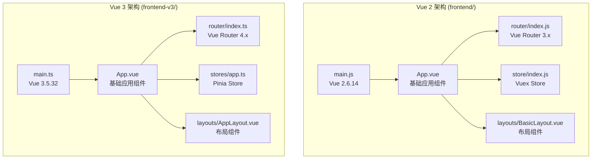

**图表来源**
- [frontend/src/main.js:1-62](file://frontend/src/main.js#L1-L62)
- [frontend-v3/src/main.ts:1-18](file://frontend-v3/src/main.ts#L1-L18)

### 核心依赖差异

| 依赖项 | Vue 2 版本 | Vue 3 版本 |
|--------|------------|------------|
| Vue 核心 | vue@2.6.14 | vue@3.5.32 |
| 路由 | vue-router@3.5.3 | vue-router@4.6.4 |
| 状态管理 | vuex@3.6.2 | pinia@3.0.4 |
| UI 框架 | ant-design-vue@1.7.8 | ant-design-vue@4.2.6 |
| 构建工具 | @vue/cli-service | vite + vue-tsc |

**章节来源**
- [frontend/package.json:1-85](file://frontend/package.json#L1-L85)
- [frontend-v3/package.json:1-44](file://frontend-v3/package.json#L1-L44)

## 核心组件对比

### 应用入口对比

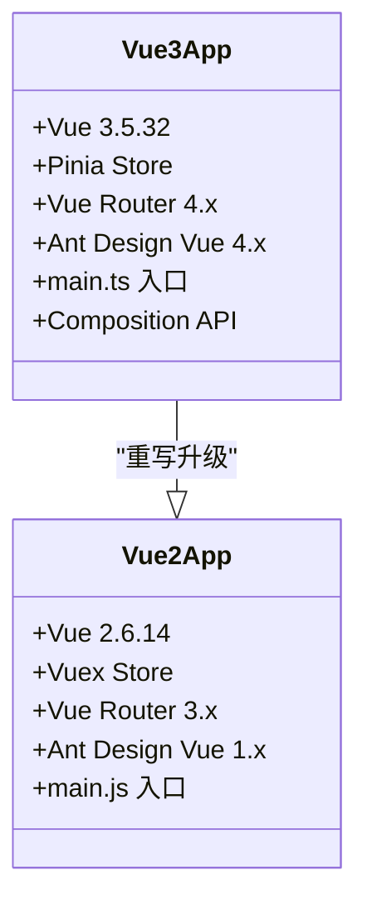

**图表来源**
- [frontend/src/main.js:1-62](file://frontend/src/main.js#L1-L62)
- [frontend-v3/src/main.ts:1-18](file://frontend-v3/src/main.ts#L1-L18)

### 路由系统对比

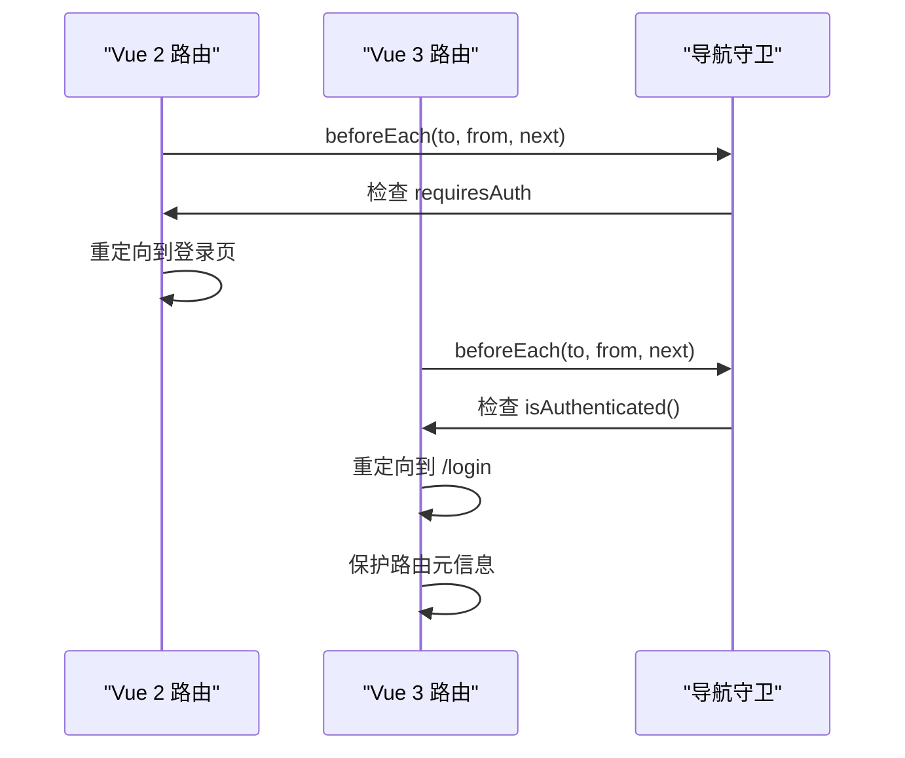

**图表来源**
- [frontend/src/router/index.js:176-194](file://frontend/src/router/index.js#L176-L194)
- [frontend-v3/src/router/index.ts:176-194](file://frontend-v3/src/router/index.ts#L176-L194)

**章节来源**
- [frontend/src/router/index.js:1-29](file://frontend/src/router/index.js#L1-L29)
- [frontend-v3/src/router/index.ts:1-197](file://frontend-v3/src/router/index.ts#L1-L197)

## 架构概览

### 状态管理架构

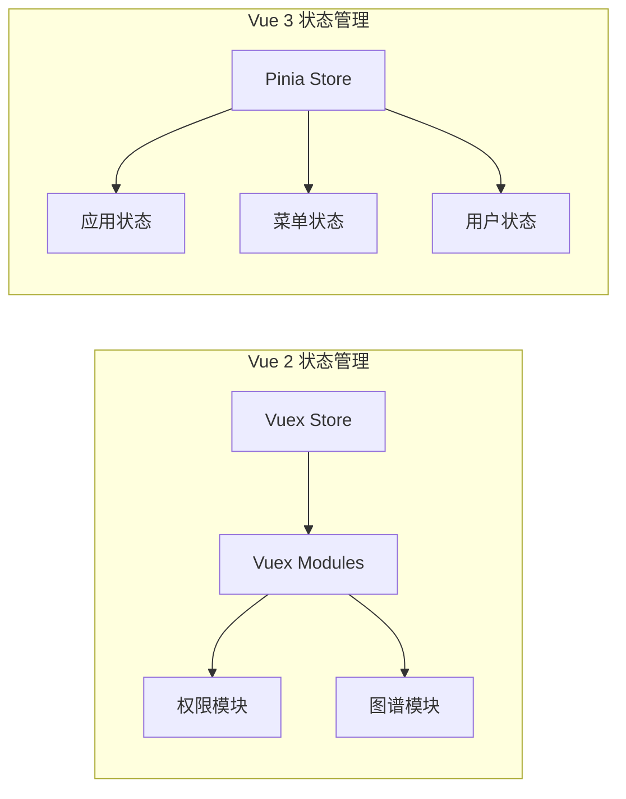

**图表来源**
- [frontend/src/store/index.js:20-31](file://frontend/src/store/index.js#L20-L31)
- [frontend-v3/src/stores/app.ts:6-37](file://frontend-v3/src/stores/app.ts#L6-L37)

### 布局系统对比

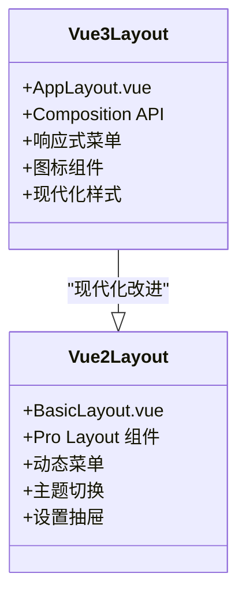

**图表来源**
- [frontend/src/layouts/BasicLayout.vue:1-800](file://frontend/src/layouts/BasicLayout.vue#L1-L800)
- [frontend-v3/src/layouts/AppLayout.vue:1-490](file://frontend-v3/src/layouts/AppLayout.vue#L1-L490)

**章节来源**
- [frontend/src/layouts/BasicLayout.vue:1-800](file://frontend/src/layouts/BasicLayout.vue#L1-L800)
- [frontend-v3/src/layouts/AppLayout.vue:1-490](file://frontend-v3/src/layouts/AppLayout.vue#L1-L490)

## 详细组件分析

### API 服务层对比

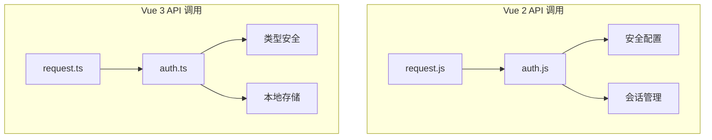

**图表来源**
- [frontend/src/utils/request.js:1-217](file://frontend/src/utils/request.js#L1-L217)
- [frontend-v3/src/utils/request.ts:1-176](file://frontend-v3/src/utils/request.ts#L1-L176)

#### 认证流程对比

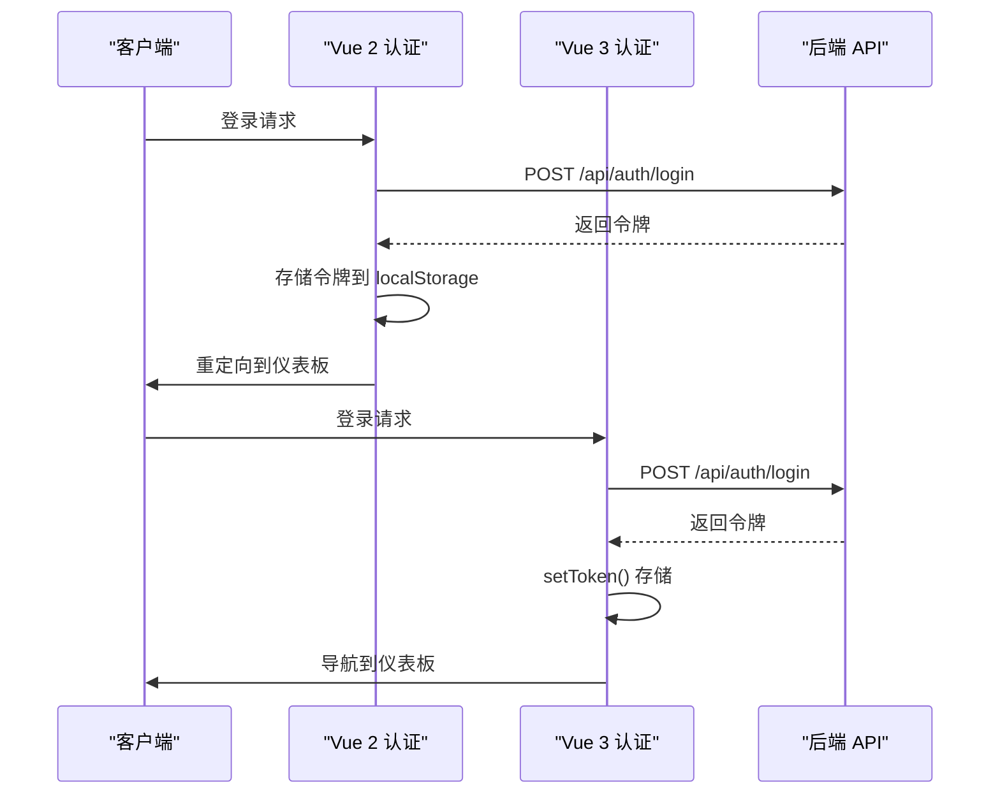

**图表来源**
- [frontend/src/api/auth.js:30-46](file://frontend/src/api/auth.js#L30-L46)
- [frontend-v3/src/api/auth.ts:9-25](file://frontend-v3/src/api/auth.ts#L9-L25)

**章节来源**
- [frontend/src/api/auth.js:1-132](file://frontend/src/api/auth.js#L1-L132)
- [frontend-v3/src/api/auth.ts:1-84](file://frontend-v3/src/api/auth.ts#L1-L84)

### 仪表板组件对比

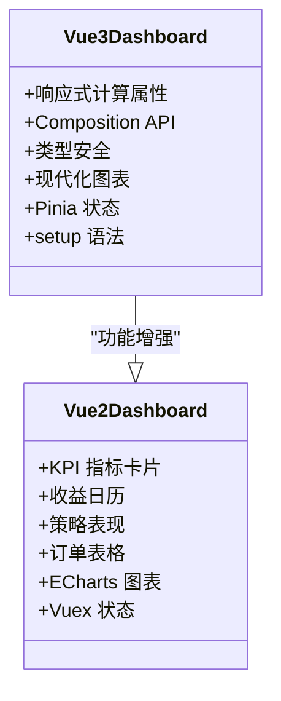

**图表来源**
- [frontend/src/views/dashboard/index.vue:1-800](file://frontend/src/views/dashboard/index.vue#L1-L800)
- [frontend-v3/src/views/dashboard/index.vue:1-800](file://frontend-v3/src/views/dashboard/index.vue#L1-L800)

**章节来源**
- [frontend/src/views/dashboard/index.vue:1-800](file://frontend/src/views/dashboard/index.vue#L1-L800)
- [frontend-v3/src/views/dashboard/index.vue:1-800](file://frontend-v3/src/views/dashboard/index.vue#L1-L800)

## 依赖关系分析

### 核心依赖迁移

```mermaid
graph TB
subgraph "Vue 2 依赖"
V2_Core[vue@2.6.14]
V2_Router[vue-router@3.5.3]
V2_Vuex[vuex@3.6.2]
V2_Antd[ant-design-vue@1.7.8]
V2_CLI[@vue/cli-service]
end
subgraph "Vue 3 依赖"
V3_Core[vue@3.5.32]
V3_Router[vue-router@4.6.4]
V3_Pinia[pinia@3.0.4]
V3_Antd[ant-design-vue@4.2.6]
V3_Vite[vite + vue-tsc]
end
V3_Core --> V2_Core
V3_Router --> V2_Router
V3_Pinia --> V2_Vuex
V3_Antd --> V2_Antd
V3_Vite --> V2_CLI
```

**图表来源**
- [frontend/package.json:15-48](file://frontend/package.json#L15-L48)
- [frontend-v3/package.json:11-34](file://frontend-v3/package.json#L11-L34)

### 状态管理迁移路径

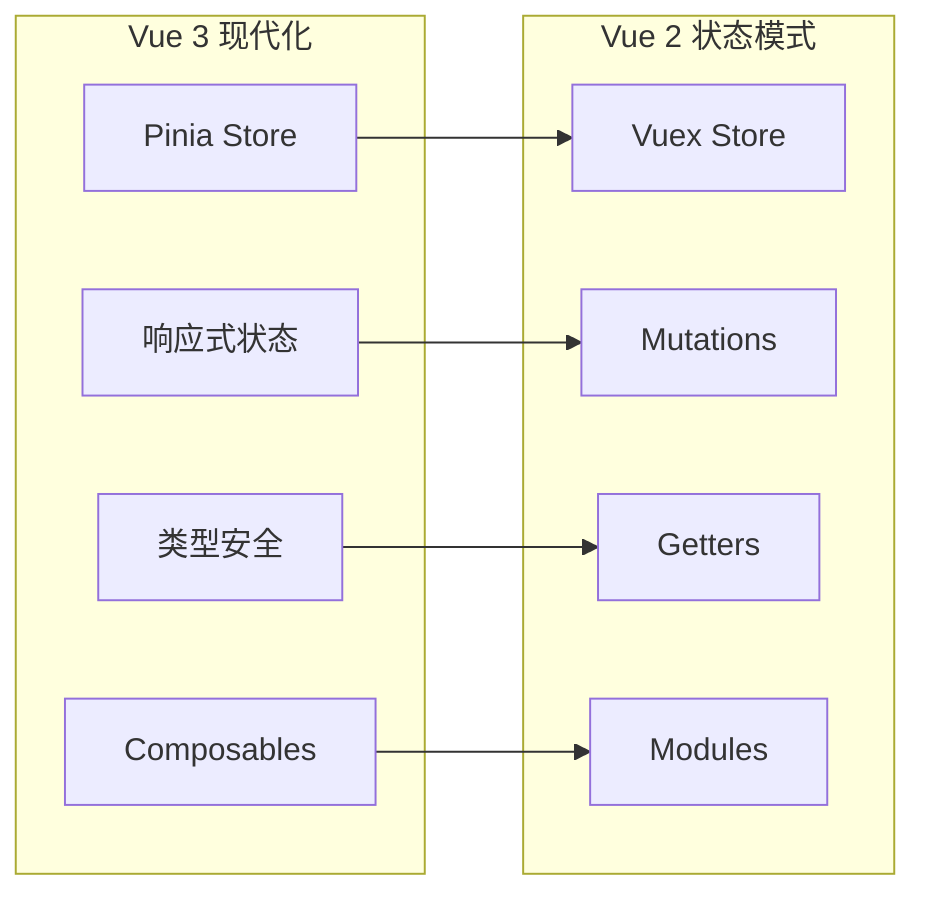

**图表来源**
- [frontend/src/store/index.js:20-31](file://frontend/src/store/index.js#L20-L31)
- [frontend-v3/src/stores/app.ts:6-37](file://frontend-v3/src/stores/app.ts#L6-L37)

**章节来源**
- [frontend/src/store/index.js:1-32](file://frontend/src/store/index.js#L1-L32)
- [frontend-v3/src/stores/app.ts:1-38](file://frontend-v3/src/stores/app.ts#L1-L38)

## 性能考虑

### 构建工具优化

Vue 3 版本采用 Vite 构建工具，相比 Vue CLI 具有以下优势：

- **更快的冷启动速度**: Vite 使用原生 ES 模块，启动时间显著减少
- **热更新性能提升**: 基于 ES 模块的热更新比 Webpack 更快
- **Tree Shaking**: 更好的代码分割和按需加载
- **TypeScript 支持**: 内置 TypeScript 编译和类型检查

### 状态管理性能

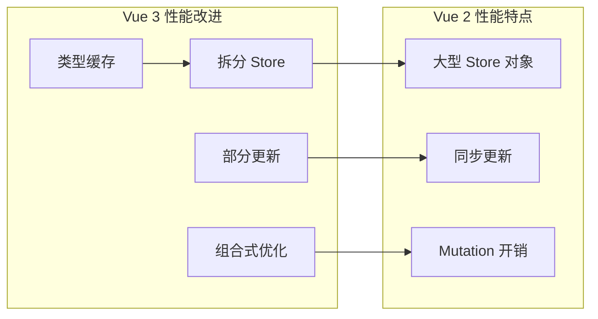

### 组件渲染优化

Vue 3 在组件渲染方面有显著改进：

- **Fragments 支持**: 减少不必要的包装元素
- **更好的调试工具**: Devtools 性能分析
- **更小的包体积**: Composition API 更加轻量
- **更好的 Tree Shaking**: 按需导入组件

## 故障排除指南

### 常见迁移问题

#### 1. 生命周期钩子差异

**Vue 2 问题**: `beforeDestroy` 需要清理定时器和事件监听器

**Vue 3 解决方案**: 使用 `onBeforeUnmount` 组合式函数

```javascript
// Vue 3 推荐做法
import { onBeforeUnmount } from 'vue'

onBeforeUnmount(() => {
  if (timer) {
    clearInterval(timer)
  }
})
```

#### 2. 状态管理迁移

**Vue 2**: 使用 `mapState` 和 `mapActions`

**Vue 3**: 使用 `useStore` 或直接导入 store

```typescript
// Vue 3 推荐做法
import { useAppStore } from '@/stores/app'

const appStore = useAppStore()
const theme = computed(() => appStore.theme)
```

#### 3. 组件通信

**Vue 2**: 通过 props 和 events 传递数据

**Vue 3**: 使用 provide/inject 或 Pinia store

```typescript
// Vue 3 provide/inject 示例
import { provide, inject } from 'vue'

provide('reload', handleRefresh)
const reload = inject('reload')
```

**章节来源**
- [frontend/src/utils/request.js:54-91](file://frontend/src/utils/request.js#L54-L91)
- [frontend-v3/src/utils/request.ts:117-155](file://frontend-v3/src/utils/request.ts#L117-L155)

### API 调用错误处理

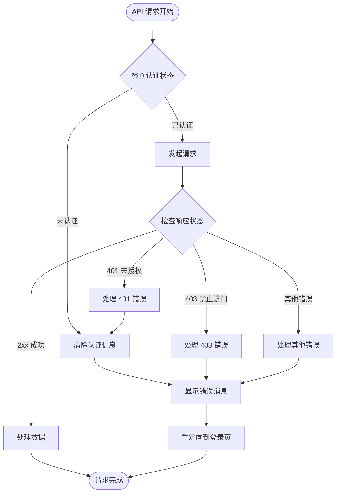

**图表来源**
- [frontend-v3/src/utils/request.ts:117-155](file://frontend-v3/src/utils/request.ts#L117-L155)

## 结论

Vue 3 前端重写项目展现了现代前端技术栈的最佳实践：

### 主要成就

1. **技术栈现代化**: 从 Vue 2 升级到 Vue 3，获得更好的性能和开发体验
2. **状态管理重构**: 从 Vuex 迁移到 Pinia，提供更好的 TypeScript 支持
3. **架构优化**: 采用 Composition API 和现代化的组件设计
4. **开发工具升级**: 使用 Vite 提供更快的开发体验

### 技术优势

- **性能提升**: Vue 3 的虚拟 DOM 优化和更好的响应式系统
- **开发体验**: 更好的 TypeScript 支持和开发工具链
- **维护性**: 更清晰的状态管理和组件架构
- **可扩展性**: 更灵活的架构设计支持未来功能扩展

### 未来发展方向

1. **持续优化**: 进一步优化性能和用户体验
2. **功能完善**: 完善从 Vue 2 到 Vue 3 的功能对齐
3. **测试覆盖**: 增强单元测试和集成测试覆盖率
4. **文档完善**: 补充详细的开发和部署文档

这次重写为 QuantDinger 项目奠定了坚实的技术基础，使其能够更好地支持未来的业务发展和技术演进。