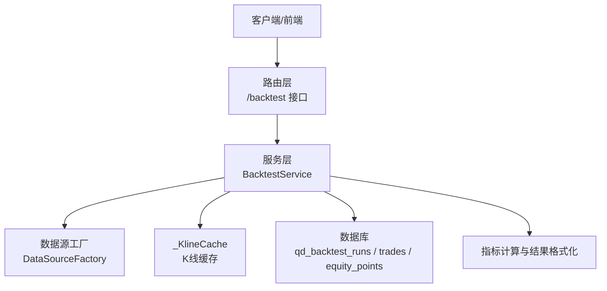
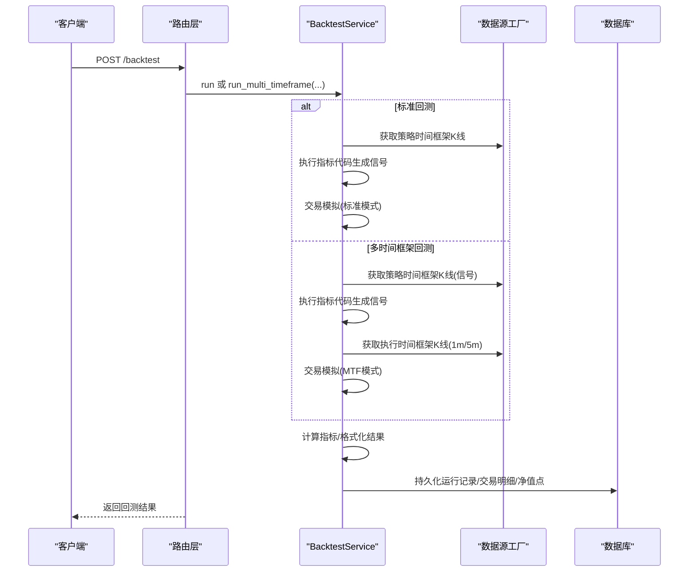
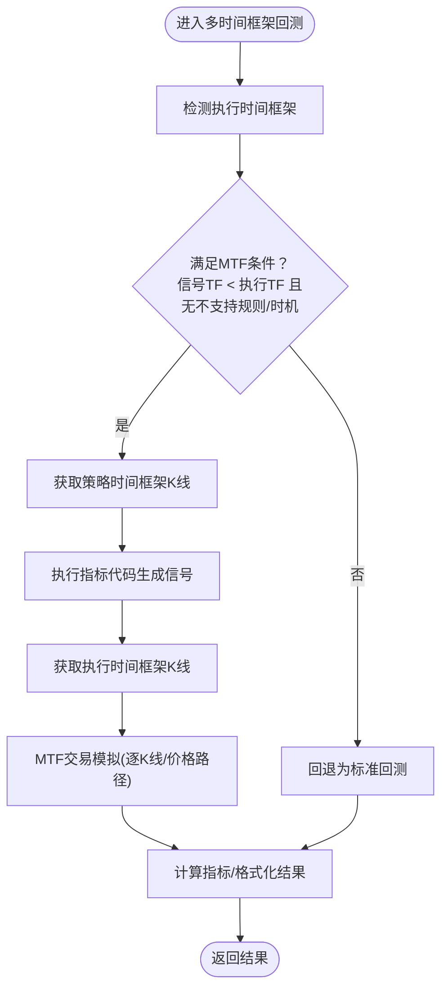
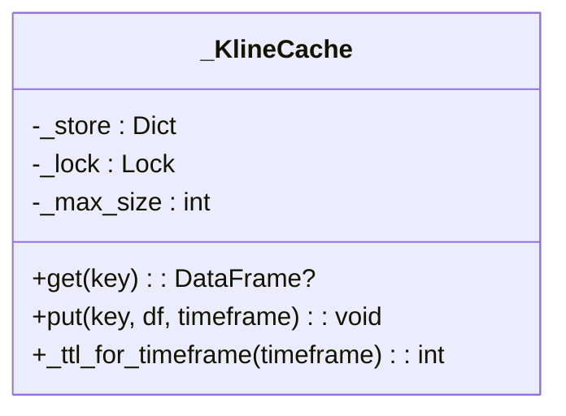
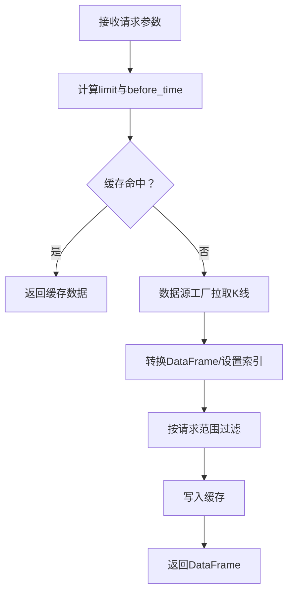
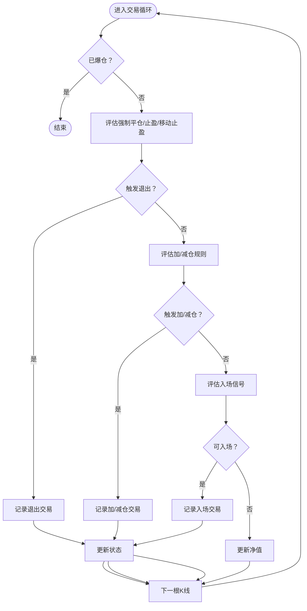
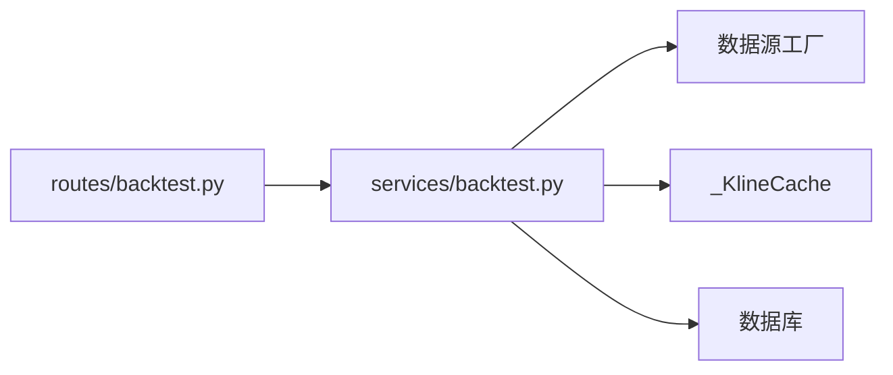

# 历史数据回测

<cite>
**本文引用的文件**
- [backend_api_python/app/services/backtest.py](file://backend_api_python/app/services/backtest.py)
- [backend_api_python/app/routes/backtest.py](file://backend_api_python/app/routes/backtest.py)
</cite>

## 目录
1. [简介](#简介)
2. [项目结构](#项目结构)
3. [核心组件](#核心组件)
4. [架构总览](#架构总览)
5. [详细组件分析](#详细组件分析)
6. [依赖关系分析](#依赖关系分析)
7. [性能考量](#性能考量)
8. [故障排查指南](#故障排查指南)
9. [结论](#结论)
10. [附录](#附录)

## 简介
本文件面向QuantDinger的历史数据回测功能，重点围绕BacktestService类展开，系统阐述其多时间框架回测机制、K线数据缓存策略、历史数据获取流程，以及从数据获取、信号生成到交易模拟的完整回测执行流程。文档还详细说明了多时间框架回测的实现原理（信号时间框架与执行时间框架的协调）、回测配置参数的作用与设置方法，并提供回测执行示例与结果解析，帮助用户理解各项指标含义。

## 项目结构
回测功能由后端服务模块与路由模块共同组成：
- 路由层负责接收请求、参数校验、调用服务层并持久化运行记录。
- 服务层负责数据获取、信号执行、交易模拟、指标计算与结果格式化。

图表来源
- [backend_api_python/app/routes/backtest.py:179-456](file://backend_api_python/app/routes/backtest.py#L179-L456)
- [backend_api_python/app/services/backtest.py:64-142](file://backend_api_python/app/services/backtest.py#L64-L142)

章节来源
- [backend_api_python/app/routes/backtest.py:179-456](file://backend_api_python/app/routes/backtest.py#L179-L456)
- [backend_api_python/app/services/backtest.py:64-142](file://backend_api_python/app/services/backtest.py#L64-L142)

## 核心组件
- BacktestService：回测引擎核心，负责多时间框架回测、信号执行、交易模拟、指标计算与结果格式化。
- _KlineCache：基于内存的K线缓存，带TTL与容量上限，避免重复外部API调用。
- 数据源工厂：统一获取K线数据，支持不同市场与时间框架。
- 运行持久化：将回测运行记录、交易明细与净值曲线写入数据库。

章节来源
- [backend_api_python/app/services/backtest.py:25-61](file://backend_api_python/app/services/backtest.py#L25-L61)
- [backend_api_python/app/services/backtest.py:1709-1854](file://backend_api_python/app/services/backtest.py#L1709-L1854)
- [backend_api_python/app/services/backtest.py:233-342](file://backend_api_python/app/services/backtest.py#L233-L342)

## 架构总览
回测执行的关键路径如下：
- 路由层接收请求，解析参数，调用BacktestService.run或run_multi_timeframe。
- 服务层根据策略时间框架获取信号K线，执行指标代码生成信号。
- 若启用多时间框架回测，则额外获取执行时间框架（1分钟/5分钟）K线，进行高精度交易模拟。
- 交易模拟完成后，计算指标并格式化结果，持久化运行记录。

图表来源
- [backend_api_python/app/routes/backtest.py:179-456](file://backend_api_python/app/routes/backtest.py#L179-L456)
- [backend_api_python/app/services/backtest.py:444-667](file://backend_api_python/app/services/backtest.py#L444-L667)
- [backend_api_python/app/services/backtest.py:1638-1707](file://backend_api_python/app/services/backtest.py#L1638-L1707)

## 详细组件分析

### BacktestService类与多时间框架回测
- 多时间框架选择逻辑：根据回测区间天数与市场类型自动选择执行时间框架（1分钟或5分钟），并返回精度信息。
- 回退策略：当不满足MTF条件（如信号时间框架不小于执行时间框架、存在某些扩展规则、信号执行时机不受支持等）时，自动回退为标准回测。
- 信号与执行分离：策略时间框架用于生成信号，执行时间框架用于精确模拟交易（逐K线、逐价格路径触发）。

图表来源
- [backend_api_python/app/services/backtest.py:444-667](file://backend_api_python/app/services/backtest.py#L444-L667)
- [backend_api_python/app/services/backtest.py:170-224](file://backend_api_python/app/services/backtest.py#L170-L224)

章节来源
- [backend_api_python/app/services/backtest.py:170-224](file://backend_api_python/app/services/backtest.py#L170-L224)
- [backend_api_python/app/services/backtest.py:444-554](file://backend_api_python/app/services/backtest.py#L444-L554)
- [backend_api_python/app/services/backtest.py:669-667](file://backend_api_python/app/services/backtest.py#L669-L667)

### K线数据缓存策略
- 缓存键：由市场、符号、时间框架与日期范围组合而成，确保跨日期/时间框架隔离。
- TTL策略：根据时间框架区分（日内5分钟，日线及以上30分钟），避免过期数据污染。
- 容量控制：达到最大容量时淘汰最旧条目，保证内存占用可控。
- 命中/未命中日志：便于诊断数据拉取效率与覆盖范围。

图表来源
- [backend_api_python/app/services/backtest.py:25-61](file://backend_api_python/app/services/backtest.py#L25-L61)

章节来源
- [backend_api_python/app/services/backtest.py:25-61](file://backend_api_python/app/services/backtest.py#L25-L61)
- [backend_api_python/app/services/backtest.py:1709-1854](file://backend_api_python/app/services/backtest.py#L1709-L1854)

### 历史数据获取流程
- 请求参数：起止日期、时间框架、市场、符号等。
- 数据拉取：通过数据源工厂按limit与before_time拉取K线，转换为DataFrame并设置时间索引。
- 范围对齐：严格按请求范围过滤，若上游数据不足则记录警告并尽可能回退到最新N根K线。
- 缓存命中：优先从缓存返回，避免重复拉取。

图表来源
- [backend_api_python/app/services/backtest.py:1709-1854](file://backend_api_python/app/services/backtest.py#L1709-L1854)

章节来源
- [backend_api_python/app/services/backtest.py:1709-1854](file://backend_api_python/app/services/backtest.py#L1709-L1854)

### 交易模拟与信号执行
- 信号格式：支持两类（4路标准化信号与buy/sell布尔列），内部统一转换为4路信号。
- 执行时机：支持“下一根K线开盘”等时机，避免前瞻性偏差。
- 风控与止盈止损：支持固定止损/止盈与移动止盈，优先级为止损>移动止盈>固定止盈。
- 加仓/减仓：支持趋势加仓、均值回归补仓、趋势减仓、不利减仓等规则，锚定价格与触发阈值。
- 爆仓处理：当资金不足以维持头寸时，标记爆仓并停止后续交易。

图表来源
- [backend_api_python/app/services/backtest.py:2383-3625](file://backend_api_python/app/services/backtest.py#L2383-L3625)

章节来源
- [backend_api_python/app/services/backtest.py:2383-3625](file://backend_api_python/app/services/backtest.py#L2383-L3625)

### 指标计算与结果格式化
- 指标计算：基于净值曲线与交易明细，计算总收益、年化收益、胜率、总交易数、最大回撤、夏普比率、盈亏比等。
- 结果格式化：将指标、交易明细、净值曲线与执行假设信息打包为统一结果结构。
- 执行假设：包含MTF是否启用、激活、回退原因、信号/执行时间框架等。

章节来源
- [backend_api_python/app/services/backtest.py:1638-1707](file://backend_api_python/app/services/backtest.py#L1638-L1707)
- [backend_api_python/app/services/backtest.py:669-667](file://backend_api_python/app/services/backtest.py#L669-L667)

### 路由层与运行持久化
- 路由层：接收请求、参数校验、调用BacktestService.run/run_multi_timeframe，支持历史查询与详情查询。
- 运行持久化：将回测运行记录、交易明细、净值点写入数据库，并生成运行ID以便后续查询。

章节来源
- [backend_api_python/app/routes/backtest.py:179-456](file://backend_api_python/app/routes/backtest.py#L179-L456)
- [backend_api_python/app/services/backtest.py:233-342](file://backend_api_python/app/services/backtest.py#L233-L342)

## 依赖关系分析
- 组件耦合：路由层仅作为入口，依赖服务层；服务层依赖数据源工厂与缓存；最终依赖数据库进行持久化。
- 外部依赖：数据源工厂负责对接上游K线数据；数据库表结构用于存储运行记录、交易明细与净值点。
- 可能的循环依赖：未发现循环导入；服务层内部方法相互调用，属于正常协作关系。

图表来源
- [backend_api_python/app/routes/backtest.py:179-456](file://backend_api_python/app/routes/backtest.py#L179-L456)
- [backend_api_python/app/services/backtest.py:64-142](file://backend_api_python/app/services/backtest.py#L64-L142)

章节来源
- [backend_api_python/app/routes/backtest.py:179-456](file://backend_api_python/app/routes/backtest.py#L179-L456)
- [backend_api_python/app/services/backtest.py:64-142](file://backend_api_python/app/services/backtest.py#L64-L142)

## 性能考量
- K线缓存：通过内存缓存与TTL降低重复拉取成本，建议合理设置回测窗口以充分利用缓存。
- MTF执行：在1分钟/5分钟范围内进行高精度模拟，会增加计算量；建议在长周期回测时谨慎启用MTF。
- 数据范围过滤：严格按请求范围过滤，避免不必要的全量数据处理。
- 并发与锁：缓存访问使用线程锁，注意在高并发场景下的竞争与性能影响。

## 故障排查指南
- 无信号或交易数极少：检查指标代码是否正确生成buy/sell或open_long/close_long等信号，确认索引匹配。
- 信号队列为空：检查信号时间框架与执行时间框架的关系，确认信号执行时机配置。
- 数据不足：当请求范围超出可用数据时，服务层会记录警告并尽可能回退到最新N根K线。
- 爆仓：当资金不足以维持头寸或触及强平线时，系统会记录爆仓并停止后续交易。
- 持久化失败：运行记录写入数据库失败时会记录警告，不影响回测结果计算。

章节来源
- [backend_api_python/app/services/backtest.py:876-901](file://backend_api_python/app/services/backtest.py#L876-L901)
- [backend_api_python/app/services/backtest.py:1816-1838](file://backend_api_python/app/services/backtest.py#L1816-L1838)
- [backend_api_python/app/services/backtest.py:2562-2580](file://backend_api_python/app/services/backtest.py#L2562-L2580)
- [backend_api_python/app/services/backtest.py:3458-3550](file://backend_api_python/app/services/backtest.py#L3458-L3550)

## 结论
BacktestService提供了完整的多时间框架回测能力，通过信号时间框架与执行时间框架的分离，实现了既高效又高精度的交易模拟。配合K线缓存、严格的数据范围过滤与完善的风控体系，能够稳定地支撑策略开发与验证。用户可通过合理的参数配置与执行时机选择，在性能与精度之间取得平衡。

## 附录

### 回测配置参数详解
- 初始资本：回测起始资金，默认值见接口定义。
- 手续费：每笔交易的费率，默认值见接口定义。
- 滑点：每笔交易的价格偏差，默认值见接口定义。
- 杠杆：交易杠杆倍数，默认值见接口定义。
- 交易方向：支持long、short、both三种方向。
- 策略配置（strategyConfig）：
  - 风控（risk）：止损百分比、止盈百分比、移动止盈开关与参数。
  - 执行（execution）：信号确认/执行时机（如next_bar_open）。
  - 仓位（position）：入场资金占比（entryPct）。
  - 规模（scale）：趋势加仓、均值回归补仓、趋势减仓、不利减仓的开关与参数。
- 多时间框架开关（enableMtf）：仅加密市场有效，默认开启。

章节来源
- [backend_api_python/app/routes/backtest.py:179-456](file://backend_api_python/app/routes/backtest.py#L179-L456)
- [backend_api_python/app/services/backtest.py:2417-2497](file://backend_api_python/app/services/backtest.py#L2417-L2497)

### 回测执行示例与结果解析
- 示例步骤：
  - 在路由层发起回测请求，传入指标代码、市场、符号、时间框架、起止日期、初始资本、手续费、滑点、杠杆、交易方向与策略配置。
  - 服务层根据请求参数选择标准回测或MTF回测，拉取K线、执行指标、模拟交易、计算指标并格式化结果。
  - 路由层将运行ID与结果返回给客户端。
- 结果字段说明（节选）：
  - totalReturn：总收益率
  - annualReturn：年化收益率
  - winRate：胜率
  - totalTrades：总交易数
  - maxDrawdown：最大回撤
  - sharpeRatio：夏普比率
  - profitFactor：盈亏比
  - precision_info：精度信息（MTF是否启用、执行时间框架、消息）
  - executionAssumptions：执行假设（MTF请求/激活、回退原因、信号/执行时间框架）

章节来源
- [backend_api_python/app/routes/backtest.py:179-456](file://backend_api_python/app/routes/backtest.py#L179-L456)
- [backend_api_python/app/services/backtest.py:1638-1707](file://backend_api_python/app/services/backtest.py#L1638-L1707)