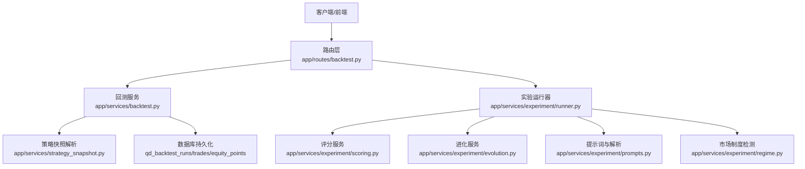
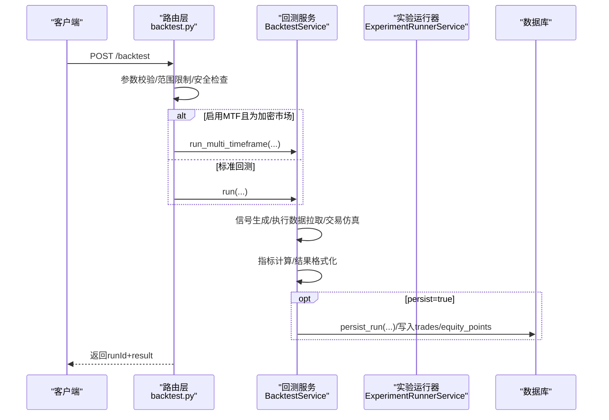
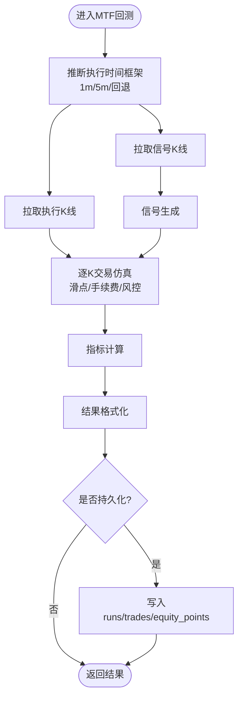
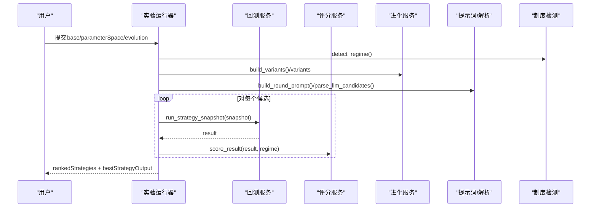
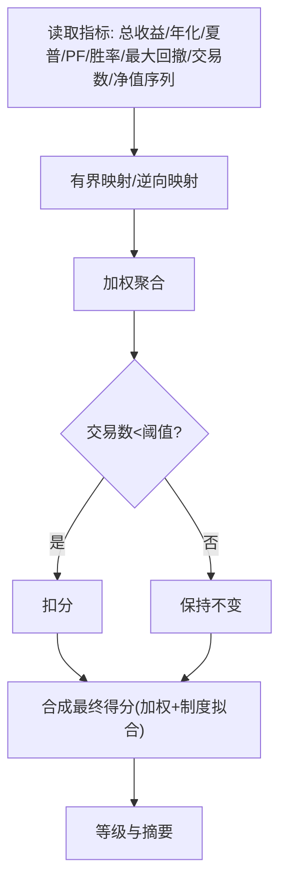
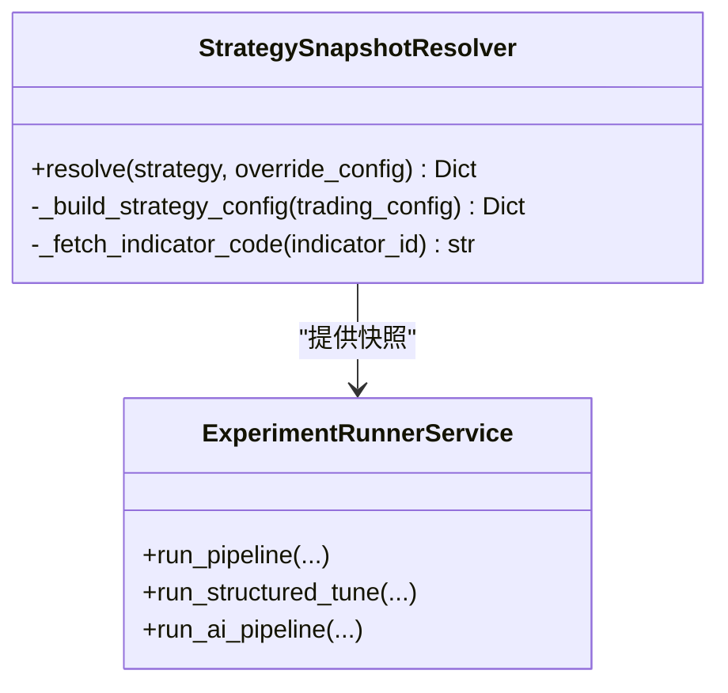
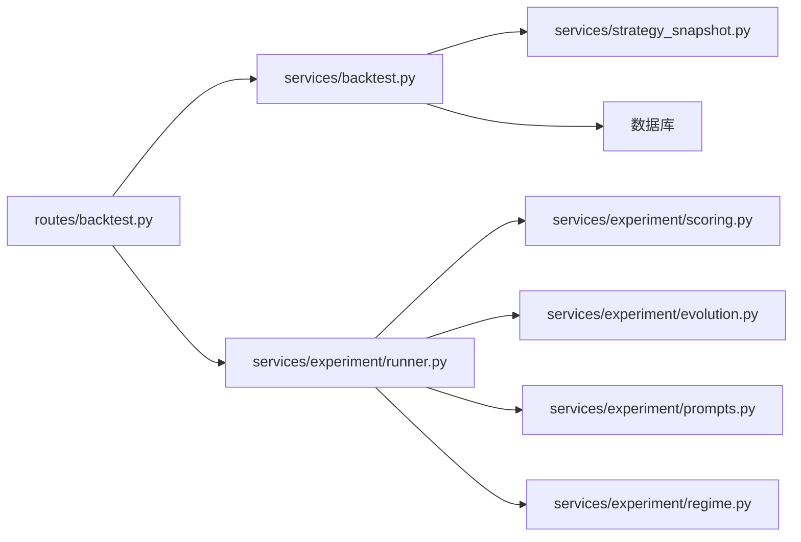

# 回测系统

<cite>
**本文引用的文件**   
- [app/services/backtest.py](file://backend_api_python/app/services/backtest.py)
- [app/routes/backtest.py](file://backend_api_python/app/routes/backtest.py)
- [app/services/experiment/runner.py](file://backend_api_python/app/services/experiment/runner.py)
- [app/services/experiment/scoring.py](file://backend_api_python/app/services/experiment/scoring.py)
- [app/services/experiment/evolution.py](file://backend_api_python/app/services/experiment/evolution.py)
- [app/services/experiment/prompts.py](file://backend_api_python/app/services/experiment/prompts.py)
- [app/services/experiment/regime.py](file://backend_api_python/app/services/experiment/regime.py)
- [app/services/strategy_snapshot.py](file://backend_api_python/app/services/strategy_snapshot.py)
- [tests/test_experiment_services.py](file://backend_api_python/tests/test_experiment_services.py)
</cite>

## 目录
1. [引言](#引言)
2. [项目结构](#项目结构)
3. [核心组件](#核心组件)
4. [架构总览](#架构总览)
5. [详细组件分析](#详细组件分析)
6. [依赖分析](#依赖分析)
7. [性能考量](#性能考量)
8. [故障排查指南](#故障排查指南)
9. [结论](#结论)
10. [附录：完整回测配置示例](#附录完整回测配置示例)

## 引言
本文件面向QuantDinger的回测系统，系统性阐述回测服务的架构设计与实现细节，包括历史数据处理、策略执行模拟、性能指标计算；实验运行器的工作流程（参数扫描、多策略对比、进化算法）、策略快照机制（保存与恢复）、实验评分体系与优化策略，以及完整的回测配置示例。

## 项目结构
回测系统主要由后端API路由、回测服务、实验编排服务、评分与进化工具、策略快照解析器等模块组成。核心交互链路为：HTTP路由接收请求 → 安全校验与参数校验 → 选择标准回测或高精度多时间框架回测 → 执行策略模拟与交易仿真 → 计算指标并格式化结果 → 可选持久化到数据库 → 返回结果。

图表来源
- [app/routes/backtest.py:179-456](file://backend_api_python/app/routes/backtest.py#L179-L456)
- [app/services/backtest.py:444-667](file://backend_api_python/app/services/backtest.py#L444-L667)
- [app/services/experiment/runner.py:32-237](file://backend_api_python/app/services/experiment/runner.py#L32-L237)
- [app/services/experiment/scoring.py:10-140](file://backend_api_python/app/services/experiment/scoring.py#L10-L140)
- [app/services/experiment/evolution.py:13-123](file://backend_api_python/app/services/experiment/evolution.py#L13-L123)
- [app/services/experiment/prompts.py:16-217](file://backend_api_python/app/services/experiment/prompts.py#L16-L217)
- [app/services/experiment/regime.py:21-170](file://backend_api_python/app/services/experiment/regime.py#L21-L170)
- [app/services/strategy_snapshot.py:7-220](file://backend_api_python/app/services/strategy_snapshot.py#L7-L220)

章节来源
- [app/routes/backtest.py:179-456](file://backend_api_python/app/routes/backtest.py#L179-L456)
- [app/services/backtest.py:444-667](file://backend_api_python/app/services/backtest.py#L444-L667)

## 核心组件
- 回测服务（BacktestService）
  - 支持标准回测与高精度多时间框架回测（MTF），自动根据回测区间与市场类型选择执行时间框架，提供精度信息与回退策略。
  - 提供信号生成、执行时间框架数据拉取、交易仿真、指标计算与结果格式化。
  - 支持持久化回测运行记录、交易明细与净值点。
- 实验运行器（ExperimentRunnerService）
  - 组织多轮AI驱动的参数搜索与评分排序，支持网格/随机搜索、手动变体注入、市场制度检测与生成器提示。
  - 将候选策略转换为“快照”并批量回测，评分后返回最佳策略输出。
- 评分服务（StrategyScoringService）
  - 将回测结果映射为多因子综合评分，包含回报、夏普比率、最大回撤、胜率、稳定性等，并考虑交易数量惩罚与市场制度拟合度。
- 进化服务（StrategyEvolutionService）
  - 从结构化的参数空间生成候选策略集，支持网格与随机两种策略空间探索方式。
- 提示词与解析（Prompts）
  - 构建LLM优化提示词，解析LLM响应为候选参数组合，规范风险参数边界。
- 市场制度检测（RegimeService）
  - 基于价格变化、EMA间隙、波动率、ATR、方向效率等特征识别趋势/震荡/高波动/盘整等制度状态。
- 策略快照解析（StrategySnapshotResolver）
  - 将存储的策略记录解析为回测可用的快照，统一风险/仓位/加仓/执行等配置字段。

章节来源
- [app/services/backtest.py:64-142](file://backend_api_python/app/services/backtest.py#L64-L142)
- [app/services/experiment/runner.py:32-237](file://backend_api_python/app/services/experiment/runner.py#L32-L237)
- [app/services/experiment/scoring.py:10-140](file://backend_api_python/app/services/experiment/scoring.py#L10-L140)
- [app/services/experiment/evolution.py:13-123](file://backend_api_python/app/services/experiment/evolution.py#L13-L123)
- [app/services/experiment/prompts.py:16-217](file://backend_api_python/app/services/experiment/prompts.py#L16-L217)
- [app/services/experiment/regime.py:21-170](file://backend_api_python/app/services/experiment/regime.py#L21-L170)
- [app/services/strategy_snapshot.py:7-220](file://backend_api_python/app/services/strategy_snapshot.py#L7-L220)

## 架构总览
回测系统采用“路由-服务-工具”的分层设计：
- 路由层负责请求接入、安全校验、参数校验与持久化开关控制。
- 服务层负责核心回测逻辑与实验编排。
- 工具层提供评分、进化、提示词、制度检测与快照解析等支撑能力。

图表来源
- [app/routes/backtest.py:179-456](file://backend_api_python/app/routes/backtest.py#L179-L456)
- [app/services/backtest.py:444-667](file://backend_api_python/app/services/backtest.py#L444-L667)

## 详细组件分析

### 回测服务（BacktestService）
- 多时间框架回测（MTF）
  - 自动推断执行时间框架（1分钟/5分钟），并提供精度信息与回退策略（当不满足条件或数据不可用时退回标准回测）。
  - 使用信号时间框架生成信号，执行时间框架进行逐K仿真，结合滑点与手续费精确模拟成交。
- 交易仿真与净值曲线
  - 支持多信号通道（如买入/卖出、多空开平）与双向模式，内置止盈止损、移动止盈、加减仓等规则。
  - 记录每笔交易的成交价、数量、利润与余额，生成净值曲线点序列。
- 指标计算与结果格式化
  - 计算总收益、年化收益、最大回撤、夏普比率、胜率、盈亏比、交易次数等指标，并格式化为统一结果结构。
- 数据持久化
  - 将回测运行记录、交易明细、净值点写入数据库，便于历史查询与复盘。

图表来源
- [app/services/backtest.py:444-667](file://backend_api_python/app/services/backtest.py#L444-L667)
- [app/services/backtest.py:669-4675](file://backend_api_python/app/services/backtest.py#L669-L4675)

章节来源
- [app/services/backtest.py:64-142](file://backend_api_python/app/services/backtest.py#L64-L142)
- [app/services/backtest.py:444-667](file://backend_api_python/app/services/backtest.py#L444-L667)
- [app/services/backtest.py:669-4675](file://backend_api_python/app/services/backtest.py#L669-L4675)

### 实验运行器（ExperimentRunnerService）
- 多轮AI优化管线
  - 先检测市场制度，构建提示词，调用LLM生成候选参数组合，批量回测并评分排序，支持早停与多轮迭代。
- 结构化参数扫描
  - 支持网格/随机搜索策略配置空间，允许注入手动变体，去重后统一回测评分。
- 快照构建与最佳输出
  - 将基础配置与候选参数合并为快照，返回最佳策略摘要与完整排名列表。

图表来源
- [app/services/experiment/runner.py:32-237](file://backend_api_python/app/services/experiment/runner.py#L32-L237)
- [app/services/experiment/runner.py:394-487](file://backend_api_python/app/services/experiment/runner.py#L394-L487)
- [app/services/experiment/evolution.py:13-123](file://backend_api_python/app/services/experiment/evolution.py#L13-L123)
- [app/services/experiment/prompts.py:16-217](file://backend_api_python/app/services/experiment/prompts.py#L16-L217)
- [app/services/experiment/regime.py:21-170](file://backend_api_python/app/services/experiment/regime.py#L21-L170)

章节来源
- [app/services/experiment/runner.py:32-237](file://backend_api_python/app/services/experiment/runner.py#L32-L237)
- [app/services/experiment/runner.py:394-487](file://backend_api_python/app/services/experiment/runner.py#L394-L487)

### 评分系统（StrategyScoringService）
- 多因子评分
  - 包含回报、年化回报、夏普比率、盈亏比、胜率、最大回撤、稳定性、样本量等维度，分别进行有界映射与逆向映射。
- 权重聚合与等级
  - 通过加权求和得到综合得分，并考虑交易数量惩罚与市场制度拟合度，输出等级与摘要指标。

图表来源
- [app/services/experiment/scoring.py:10-140](file://backend_api_python/app/services/experiment/scoring.py#L10-L140)

章节来源
- [app/services/experiment/scoring.py:10-140](file://backend_api_python/app/services/experiment/scoring.py#L10-L140)

### 策略快照机制（StrategySnapshotResolver）
- 解析策略记录为回测快照
  - 将策略的指标代码、交易配置、风险/仓位/加仓/执行等参数统一映射到快照结构，支持覆盖与默认值处理。
  - 自动推断市场/符号/时间框架/初始资金/杠杆/佣金/滑点/交易方向/MTF开关等。
- 与实验运行器协作
  - 实验运行器将候选参数合并到快照，交由回测服务执行。

图表来源
- [app/services/strategy_snapshot.py:7-220](file://backend_api_python/app/services/strategy_snapshot.py#L7-L220)
- [app/services/experiment/runner.py:32-237](file://backend_api_python/app/services/experiment/runner.py#L32-L237)

章节来源
- [app/services/strategy_snapshot.py:7-220](file://backend_api_python/app/services/strategy_snapshot.py#L7-L220)
- [app/services/experiment/runner.py:32-237](file://backend_api_python/app/services/experiment/runner.py#L32-L237)

### 路由层（Backtest API）
- 接口职责
  - 提供回测执行、历史查询、运行详情、精度信息查询等接口。
  - 在执行回测前进行参数校验、时间范围限制、安全检查与持久化开关控制。
- 精度信息
  - 根据市场类型与回测区间返回高精度/中精度/标准回测的建议与原因。

章节来源
- [app/routes/backtest.py:179-456](file://backend_api_python/app/routes/backtest.py#L179-L456)
- [app/routes/backtest.py:111-177](file://backend_api_python/app/routes/backtest.py#L111-L177)

## 依赖分析
- 组件耦合
  - 路由层依赖回测服务与安全校验；回测服务内部依赖数据源工厂、数据库连接与指标解析器。
  - 实验运行器依赖回测服务、评分服务、进化服务、提示词与制度检测服务。
- 外部依赖
  - 数据源工厂用于历史K线数据拉取；数据库用于持久化回测运行记录与明细。
- 循环依赖
  - 未发现循环依赖；模块间为单向依赖。

图表来源
- [app/routes/backtest.py:179-456](file://backend_api_python/app/routes/backtest.py#L179-L456)
- [app/services/backtest.py:444-667](file://backend_api_python/app/services/backtest.py#L444-L667)
- [app/services/experiment/runner.py:32-237](file://backend_api_python/app/services/experiment/runner.py#L32-L237)

章节来源
- [app/routes/backtest.py:179-456](file://backend_api_python/app/routes/backtest.py#L179-L456)
- [app/services/backtest.py:444-667](file://backend_api_python/app/services/backtest.py#L444-L667)
- [app/services/experiment/runner.py:32-237](file://backend_api_python/app/services/experiment/runner.py#L32-L237)

## 性能考量
- 多时间框架回测的适用性
  - 仅在加密市场且回测区间较短时启用高精度1分钟回测；长区间自动降级为5分钟回测，避免数据量过大导致性能问题。
- 缓存与索引
  - 回测服务对K线数据进行内存缓存与TTL控制，减少重复外部API调用；数据库为回测表建立索引提升查询性能。
- 指标计算与序列稳定性
  - 稳定性评分基于净值序列单调性，序列过短时采用保守打分，避免噪声干扰。
- 并行与流式
  - 实验运行器支持进度回调与流式事件推送，便于前端实时反馈。

[本节为通用指导，无需特定文件引用]

## 故障排查指南
- 回测参数错误
  - 路由层对必填参数与范围进行严格校验，若参数非法会返回明确错误信息。
- 数据缺失或不可用
  - MTF模式下若执行时间框架数据不可用，自动回退至标准回测并记录回退原因。
- 回测失败持久化
  - 路由层捕获异常并尝试写入失败记录，包含输入参数与错误信息，便于后续复盘。
- 评分异常
  - 评分服务对缺失或异常指标进行兜底处理，保证评分稳定。

章节来源
- [app/routes/backtest.py:415-456](file://backend_api_python/app/routes/backtest.py#L415-L456)
- [app/services/backtest.py:515-554](file://backend_api_python/app/services/backtest.py#L515-L554)
- [app/services/experiment/scoring.py:134-140](file://backend_api_python/app/services/experiment/scoring.py#L134-L140)

## 结论
QuantDinger回测系统通过“路由-服务-工具”分层设计，实现了从历史数据到策略模拟再到指标评分的完整闭环。实验运行器引入AI与进化算法，显著提升了参数搜索效率与策略质量。策略快照机制与评分体系为策略对比与优化提供了统一标准。建议在生产环境中结合缓存与索引策略，持续优化回测性能与稳定性。

[本节为总结性内容，无需特定文件引用]

## 附录：完整回测配置示例
以下为一次典型回测请求的配置要点（字段来自路由与回测服务）：
- 基础信息
  - indicatorCode：策略代码（需通过安全校验）
  - symbol：交易对（如 BTC/USDT）
  - market：市场类别（如 Crypto）
  - timeframe：策略信号时间框架（如 1D）
  - startDate/endDate：回测起止日期（注意路由层的时间范围限制）
- 资金与交易
  - initialCapital：初始资金（默认10000）
  - leverage：杠杆倍数（默认1）
  - commission：手续费率（默认0）
  - slippage：滑点（默认0）
  - tradeDirection：交易方向（long/short/both，默认long）
- 执行与精度
  - enableMtf：是否启用多时间框架回测（默认True，仅加密市场有效）
- 其他
  - indicatorId：若仅提供ID，后端会从本地库加载代码
  - persist：是否持久化（默认True）

章节来源
- [app/routes/backtest.py:179-456](file://backend_api_python/app/routes/backtest.py#L179-L456)
- [app/services/backtest.py:444-667](file://backend_api_python/app/services/backtest.py#L444-L667)