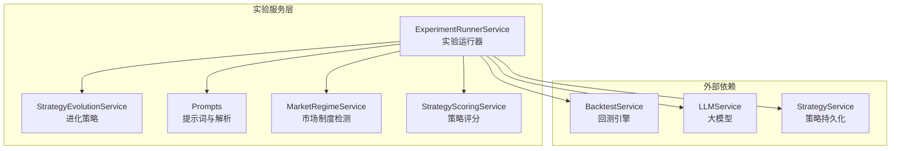
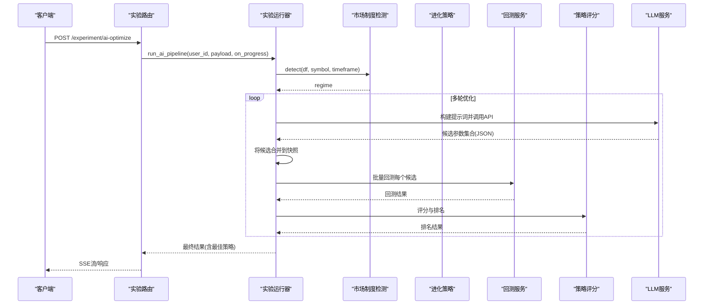
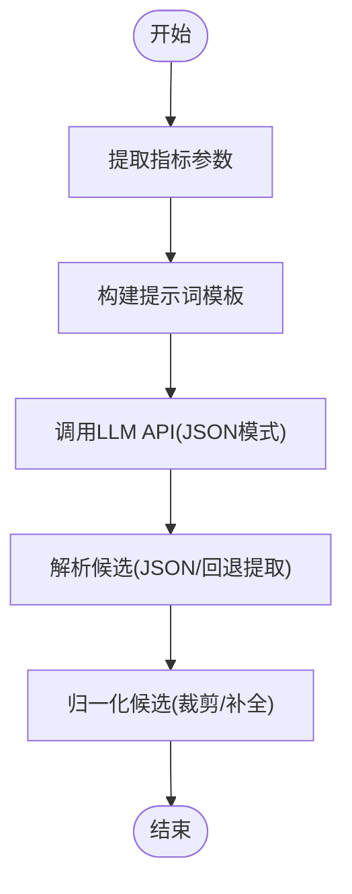
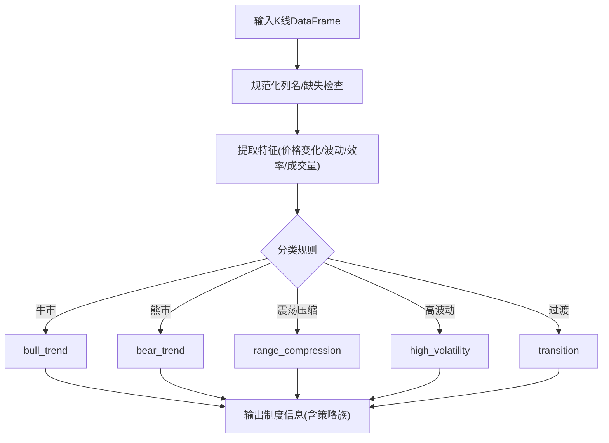
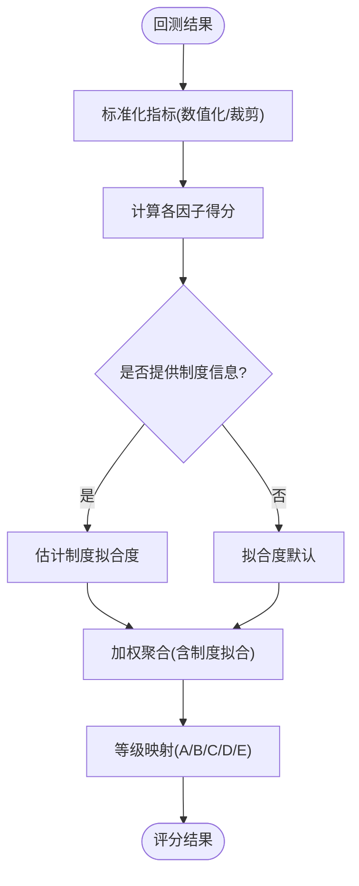
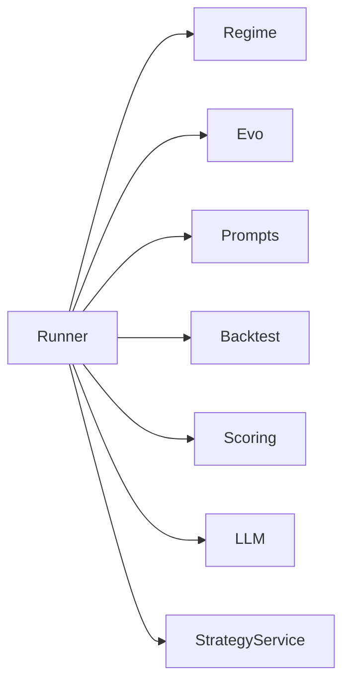
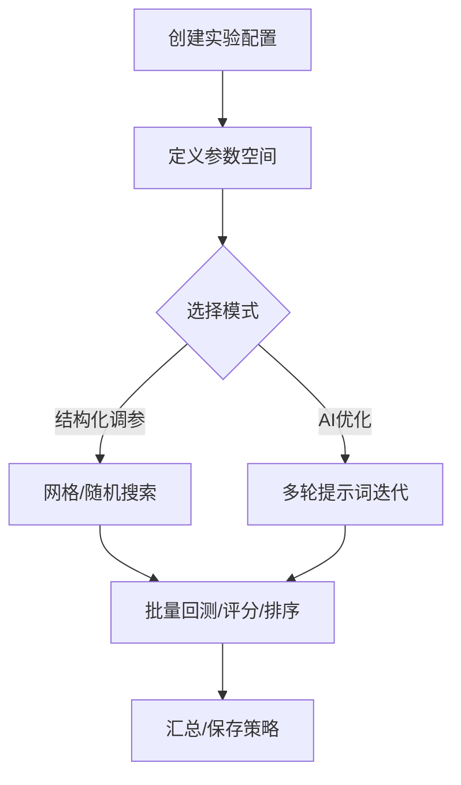

# 实验运行器

<cite>
**本文引用的文件**
- [实验服务导出](file://backend_api_python/app/services/experiment/__init__.py)
- [实验运行器服务](file://backend_api_python/app/services/experiment/runner.py)
- [进化策略服务](file://backend_api_python/app/services/experiment/evolution.py)
- [提示词与解析](file://backend_api_python/app/services/experiment/prompts.py)
- [市场制度检测](file://backend_api_python/app/services/experiment/regime.py)
- [策略评分服务](file://backend_api_python/app/services/experiment/scoring.py)
- [实验路由接口](file://backend_api_python/app/routes/experiment.py)
- [回测服务](file://backend_api_python/app/services/backtest.py)
- [实验服务单元测试](file://backend_api_python/tests/test_experiment_services.py)
- [截面动量RSI示例](file://docs/examples/cross_sectional_momentum_rsi.py)
</cite>

## 目录
1. [简介](#简介)
2. [项目结构](#项目结构)
3. [核心组件](#核心组件)
4. [架构总览](#架构总览)
5. [详细组件分析](#详细组件分析)
6. [依赖分析](#依赖分析)
7. [性能考量](#性能考量)
8. [故障排查指南](#故障排查指南)
9. [结论](#结论)
10. [附录](#附录)

## 简介
本文件面向QuantDinger的实验运行器系统，系统性阐述其架构设计与运行流程，重点覆盖以下方面：
- 参数扫描策略：网格搜索与随机搜索的参数空间定义与变体生成
- 多策略对比机制：批量回测、评分与排序
- 实验调度算法：从基础快照构建、候选集生成到回测与评分的流水线
- 进化算法在参数优化中的应用：种群初始化、适应度评估、选择交叉变异等步骤的映射与替代
- 实验提示词系统：通过自然语言描述自动构建实验配置与候选参数
- 完整实验流程：从实验配置创建、参数空间定义到实验执行与结果收集
- 实际案例：参数优化与策略自动化优化的实践示例

## 项目结构
实验运行器位于后端Python服务中，核心模块组织如下：
- 服务层：experiment子包下的runner、evolution、prompts、regime、scoring
- 路由层：experiment路由负责对外暴露实验相关API
- 依赖服务：回测服务、LLM服务（用于AI优化）、策略服务（保存最佳策略）

图表来源
- [实验运行器服务:32-609](file://backend_api_python/app/services/experiment/runner.py#L32-L609)
- [进化策略服务:13-123](file://backend_api_python/app/services/experiment/evolution.py#L13-L123)
- [提示词与解析:1-217](file://backend_api_python/app/services/experiment/prompts.py#L1-L217)
- [市场制度检测:21-170](file://backend_api_python/app/services/experiment/regime.py#L21-L170)
- [策略评分服务:10-140](file://backend_api_python/app/services/experiment/scoring.py#L10-L140)
- [回测服务:64-200](file://backend_api_python/app/services/backtest.py#L64-L200)

章节来源
- [实验服务导出:1-17](file://backend_api_python/app/services/experiment/__init__.py#L1-L17)
- [实验运行器服务:32-609](file://backend_api_python/app/services/experiment/runner.py#L32-L609)
- [实验路由接口:1-370](file://backend_api_python/app/routes/experiment.py#L1-L370)

## 核心组件
- 实验运行器服务：编排市场制度检测、批量回测、评分与进化策略，支持传统网格/随机搜索与AI多轮优化两种模式
- 进化策略服务：将参数空间转换为候选策略变体，支持网格与随机两种生成策略
- 提示词系统：从指标代码提取可调参数，结合市场制度与历史结果，构建LLM优化提示词，并解析LLM输出
- 市场制度检测：基于OHLC特征与规则分类，输出制度标签、置信度与策略族建议
- 策略评分服务：将回测结果映射为多因子评分与总体等级，支持按制度拟合加权
- 回测服务：提供K线数据拉取、回测执行与结果存储能力
- 路由接口：提供实验检测、管道运行、AI优化、结构化调参、保存策略等REST接口

章节来源
- [实验运行器服务:32-609](file://backend_api_python/app/services/experiment/runner.py#L32-L609)
- [进化策略服务:13-123](file://backend_api_python/app/services/experiment/evolution.py#L13-L123)
- [提示词与解析:1-217](file://backend_api_python/app/services/experiment/prompts.py#L1-L217)
- [市场制度检测:21-170](file://backend_api_python/app/services/experiment/regime.py#L21-L170)
- [策略评分服务:10-140](file://backend_api_python/app/services/experiment/scoring.py#L10-L140)
- [回测服务:64-200](file://backend_api_python/app/services/backtest.py#L64-L200)
- [实验路由接口:1-370](file://backend_api_python/app/routes/experiment.py#L1-L370)

## 架构总览
实验运行器采用“服务编排 + 多策略对比 + 评分排序”的流水线架构。AI优化模式引入多轮提示词迭代，逐步收敛到高分策略；结构化调参模式则直接在参数空间内进行网格或随机搜索。

图表来源
- [实验运行器服务:52-237](file://backend_api_python/app/services/experiment/runner.py#L52-L237)
- [提示词与解析:120-149](file://backend_api_python/app/services/experiment/prompts.py#L120-L149)
- [策略评分服务:23-82](file://backend_api_python/app/services/experiment/scoring.py#L23-L82)
- [实验路由接口:123-201](file://backend_api_python/app/routes/experiment.py#L123-L201)

## 详细组件分析

### 实验运行器服务（ExperimentRunnerService）
- 主要职责
  - 市场制度检测：基于K线数据提取特征并分类，返回制度标签、置信度与策略族建议
  - 候选生成：支持手动变体、参数空间网格/随机生成
  - 批量回测：对每个候选执行回测，抽取关键指标
  - 评分与排序：将回测指标映射为多因子评分与总体等级
  - AI多轮优化：构建提示词、调用LLM、解析候选、回测评分、早停控制
  - 结果输出：汇总每轮统计、全局最佳、排行榜与最佳策略摘要
  - 保存策略：将最佳候选持久化为策略记录

- 关键流程
  - 快照构建：从请求体或已有快照复制并注入用户ID、时间范围、交易参数等
  - 候选去重：以快照字符串为键去重，避免重复回测
  - 回测瘦身：仅保留关键指标，降低传输体积
  - 早停策略：当全局最佳超过阈值时提前结束

- API入口
  - /experiment/regime/detect：制度检测
  - /experiment/pipeline/run：传统管道（兼容）
  - /experiment/ai-optimize：AI多轮优化（SSE流）
  - /experiment/ai-optimize-sync：同步版本
  - /experiment/structured-tune：结构化网格/随机搜索
  - /experiment/save-strategy：保存最佳策略

章节来源
- [实验运行器服务:32-609](file://backend_api_python/app/services/experiment/runner.py#L32-L609)
- [实验路由接口:21-370](file://backend_api_python/app/routes/experiment.py#L21-L370)

### 进化策略服务（StrategyEvolutionService）
- 参数空间规范
  - 支持列表、元组、字典三类规格
  - 字典型规格包含最小值、最大值与步长，自动生成数值序列
  - 键路径支持“strategyConfig.”标准化为“strategy_config.”

- 变体生成
  - 网格策略：笛卡尔积展开，按上限截断
  - 随机策略：对每个键随机采样，生成指定数量变体
  - 嵌套设置：递归设置快照中的嵌套字段

- 复杂度分析
  - 网格策略：O(N1×N2×...×Nk)，受max_variants限制
  - 随机策略：O(k×N)，k为键数，N为变体数

章节来源
- [进化策略服务:13-123](file://backend_api_python/app/services/experiment/evolution.py#L13-L123)

### 提示词系统（Prompts）
- 指标参数提取
  - 解析指标代码中的@param注释，提取可调参数清单
- 提示词模板
  - 包含指标代码、可调参数、风险/仓位参数、市场制度、上一轮结果
  - 第一轮强调多样性，后续轮次强调学习与探索
- LLM响应解析
  - 严格JSON格式要求，支持多种包裹形式与回退提取
  - 归一化候选：校验与裁剪风险参数范围，确保结构一致性

图表来源
- [提示词与解析:67-217](file://backend_api_python/app/services/experiment/prompts.py#L67-L217)

章节来源
- [提示词与解析:1-217](file://backend_api_python/app/services/experiment/prompts.py#L1-L217)

### 市场制度检测（MarketRegimeService）
- 特征提取
  - 价格变化率、EMA间距百分比、真实波动率、ATR百分比、方向效率、成交量比率
- 分类规则
  - 基于特征阈值的规则分类，输出制度键、标签、置信度与策略族
- 分段分析
  - 将时间序列切分为若干片段，逐段检测并给出时间窗口

图表来源
- [市场制度检测:54-170](file://backend_api_python/app/services/experiment/regime.py#L54-L170)

章节来源
- [市场制度检测:21-170](file://backend_api_python/app/services/experiment/regime.py#L21-L170)

### 策略评分服务（StrategyScoringService）
- 多因子评分
  - 收益率、年化收益、夏普比率、盈亏比、胜率、最大回撤、稳定性、样本量
- 加权聚合
  - 默认权重向量聚合得到总体分数，并按制度拟合度进行加权
- 等级划分
  - A/B/C/D/E等级映射

图表来源
- [策略评分服务:23-140](file://backend_api_python/app/services/experiment/scoring.py#L23-L140)

章节来源
- [策略评分服务:10-140](file://backend_api_python/app/services/experiment/scoring.py#L10-L140)

### 回测服务（BacktestService）
- 数据与缓存
  - K线数据拉取与内存TTL缓存，减少重复外部调用
  - 时间框架与多时间框架回测配置
- 存储与索引
  - 回测运行表与交易、权益点表的结构化存储与索引
- 执行与推理
  - 交易方向推断、蜡烛内价格路径推断等辅助功能

章节来源
- [回测服务:25-200](file://backend_api_python/app/services/backtest.py#L25-L200)

### 实验路由接口（experiment routes）
- /experiment/regime/detect：制度检测
- /experiment/pipeline/run：传统网格搜索（兼容）
- /experiment/ai-optimize：AI多轮优化（SSE流）
- /experiment/ai-optimize-sync：同步版本
- /experiment/structured-tune：结构化网格/随机搜索
- /experiment/save-strategy：保存最佳策略

章节来源
- [实验路由接口:1-370](file://backend_api_python/app/routes/experiment.py#L1-L370)

## 依赖分析
- 组件耦合
  - 实验运行器聚合多个服务，耦合度中等，职责清晰
  - 进化策略与提示词系统独立，便于替换与扩展
- 外部依赖
  - LLM服务用于AI优化；回测服务依赖数据源工厂与数据库
- 循环依赖
  - 未发现循环导入或循环依赖

图表来源
- [实验运行器服务:13-46](file://backend_api_python/app/services/experiment/runner.py#L13-L46)

章节来源
- [实验运行器服务:13-46](file://backend_api_python/app/services/experiment/runner.py#L13-L46)

## 性能考量
- 回测瘦身：仅保留关键指标，降低网络传输与前端渲染压力
- 早停策略：达到阈值即停止，缩短等待时间
- 缓存与并发：K线缓存与SSE流式输出提升交互体验
- 参数空间控制：max_variants限制候选规模，避免指数爆炸

## 故障排查指南
- 制度检测失败
  - 检查K线数据完整性与列名规范化
  - 确认数据长度满足最低要求
- LLM调用失败
  - 核对系统提示词与JSON模式开关
  - 检查响应解析与候选归一化逻辑
- 回测异常
  - 查看回测服务日志与数据库存储状态
  - 确认时间范围与时间框架配置
- 保存策略失败
  - 确认最佳输出结构与必填字段

章节来源
- [实验运行器服务:88-208](file://backend_api_python/app/services/experiment/runner.py#L88-L208)
- [提示词与解析:152-185](file://backend_api_python/app/services/experiment/prompts.py#L152-L185)
- [实验路由接口:165-201](file://backend_api_python/app/routes/experiment.py#L165-L201)

## 结论
实验运行器通过“参数扫描 + 多策略对比 + 评分排序”的流水线，结合AI提示词系统与市场制度检测，实现了从自然语言描述到策略参数自动优化的闭环。进化策略服务提供了灵活的参数空间表达与变体生成能力，评分服务确保了结果的可比性与可解释性。整体架构清晰、扩展性强，适合进一步引入更复杂的优化算法（如遗传算法的交叉变异）以替代或增强现有网格/随机策略。

## 附录

### 实验运行流程（从配置到结果）
- 创建实验配置：提供指标代码、市场符号、时间范围、初始资金、手续费、滑点、杠杆、交易方向等
- 定义参数空间：支持列表/区间/字典型规格，键路径标准化
- 选择运行模式
  - 结构化调参：网格/随机搜索，直接返回评分与排行榜
  - AI优化：多轮提示词迭代，逐步收敛到高分策略
- 执行与收集
  - 批量回测 → 评分排序 → 全局最佳 → 结果汇总
- 保存策略
  - 将最佳候选持久化为策略记录，供后续实盘或复用

[本图为概念流程图，无需图表来源]

### 实际案例与示例
- 截面动量RSI示例：展示了如何对多个标的进行评分与排序，体现“对多个标的打分再排序”的基本写法，可用于理解策略指标的组合与排序思想
- 实验服务测试：验证了制度检测、评分与进化策略生成的基本行为，可作为集成测试参考

章节来源
- [截面动量RSI示例:1-71](file://docs/examples/cross_sectional_momentum_rsi.py#L1-L71)
- [实验服务单元测试:1-132](file://backend_api_python/tests/test_experiment_services.py#L1-L132)