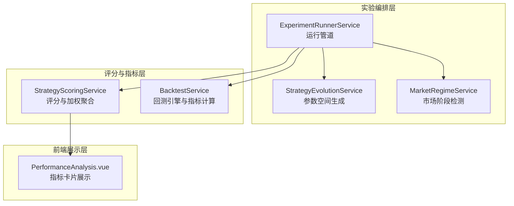
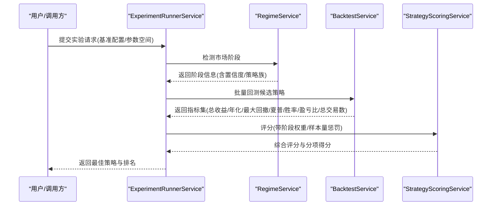
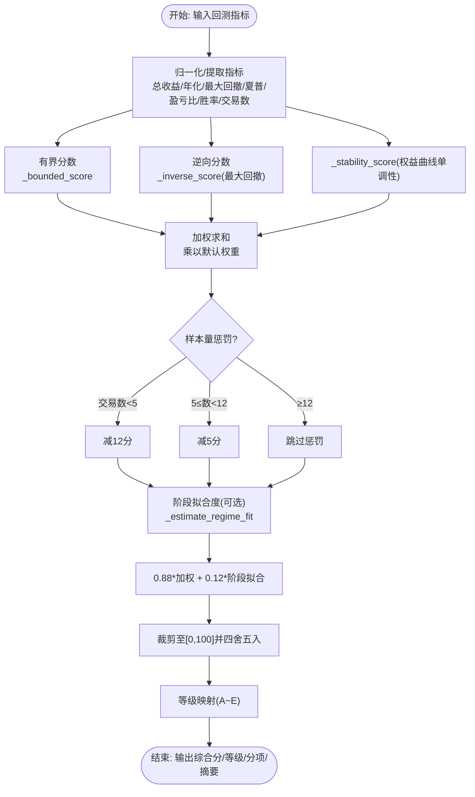
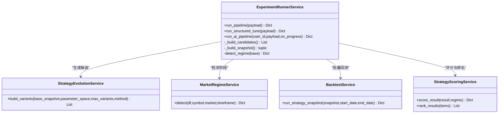
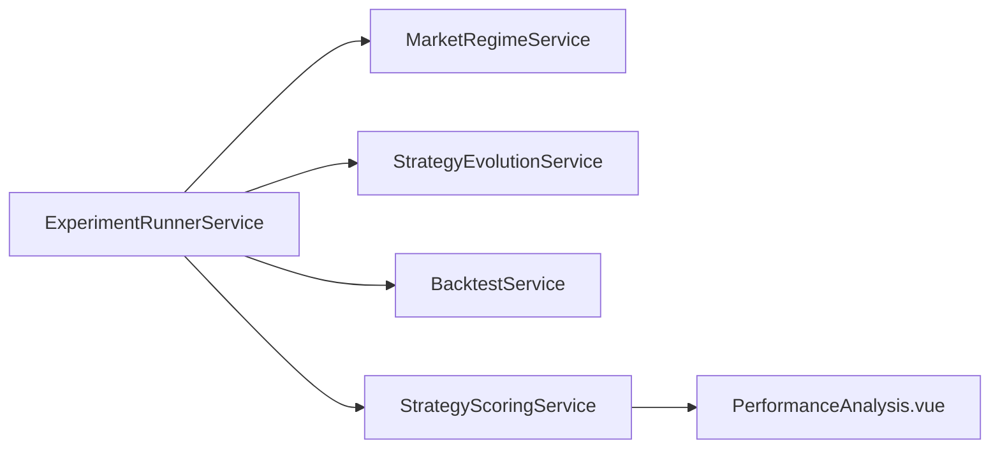

# 性能评分系统

<cite>
**本文引用的文件**
- [scoring.py](file://backend_api_python/app/services/experiment/scoring.py)
- [runner.py](file://backend_api_python/app/services/experiment/runner.py)
- [evolution.py](file://backend_api_python/app/services/experiment/evolution.py)
- [regime.py](file://backend_api_python/app/services/experiment/regime.py)
- [backtest.py](file://backend_api_python/app/services/backtest.py)
- [test_experiment_services.py](file://backend_api_python/tests/test_experiment_services.py)
- [PerformanceAnalysis.vue](file://frontend/src/views/trading-assistant/components/PerformanceAnalysis.vue)
</cite>

## 目录
1. [简介](#简介)
2. [项目结构](#项目结构)
3. [核心组件](#核心组件)
4. [架构总览](#架构总览)
5. [详细组件分析](#详细组件分析)
6. [依赖关系分析](#依赖关系分析)
7. [性能考量](#性能考量)
8. [故障排查指南](#故障排查指南)
9. [结论](#结论)
10. [附录](#附录)

## 简介
本文件系统性阐述 QuantDinger 的性能评分系统，覆盖多维度指标计算、权重分配策略、风险调整收益指标（夏普比率、索提诺比率、最大回撤）、策略表现评估（胜率、盈亏比、期望值）以及评分配置与策略筛选实践。文档以代码为依据，结合流程图与类图，帮助不同技术背景的读者快速理解并应用该评分体系。

## 项目结构
评分系统位于后端 Python 服务中，围绕“回测 → 指标计算 → 评分 → 排名 → 结果输出”的流水线组织，前端通过可视化组件展示关键指标。

图表来源
- [runner.py:32-609](file://backend_api_python/app/services/experiment/runner.py#L32-L609)
- [scoring.py:10-140](file://backend_api_python/app/services/experiment/scoring.py#L10-L140)
- [evolution.py:13-123](file://backend_api_python/app/services/experiment/evolution.py#L13-L123)
- [regime.py:21-156](file://backend_api_python/app/services/experiment/regime.py#L21-L156)
- [backtest.py:4700-4899](file://backend_api_python/app/services/backtest.py#L4700-L4899)
- [PerformanceAnalysis.vue:95-133](file://frontend/src/views/trading-assistant/components/PerformanceAnalysis.vue#L95-L133)

章节来源
- [runner.py:32-609](file://backend_api_python/app/services/experiment/runner.py#L32-L609)
- [scoring.py:10-140](file://backend_api_python/app/services/experiment/scoring.py#L10-L140)
- [evolution.py:13-123](file://backend_api_python/app/services/experiment/evolution.py#L13-L123)
- [regime.py:21-156](file://backend_api_python/app/services/experiment/regime.py#L21-L156)
- [backtest.py:4700-4899](file://backend_api_python/app/services/backtest.py#L4700-L4899)
- [PerformanceAnalysis.vue:95-133](file://frontend/src/views/trading-assistant/components/PerformanceAnalysis.vue#L95-L133)

## 核心组件
- StrategyScoringService：将回测结果映射为可比较的多因子综合评分，支持按市场阶段加权融合与样本量惩罚。
- ExperimentRunnerService：编排市场阶段检测、批量回测、评分与排名，支持结构化参数搜索与多轮 LLM 优化。
- StrategyEvolutionService：从参数空间生成候选策略变体（网格/随机），支持嵌套路径覆盖。
- MarketRegimeService：基于价格特征与波动性规则识别市场阶段（牛市、熊市、震荡压缩、高波动、过渡期）。
- BacktestService：执行回测并产出基础指标（总收益、年化收益、最大回撤、夏普比率、胜率、盈亏比、总交易数等）。

章节来源
- [scoring.py:10-140](file://backend_api_python/app/services/experiment/scoring.py#L10-L140)
- [runner.py:32-609](file://backend_api_python/app/services/experiment/runner.py#L32-L609)
- [evolution.py:13-123](file://backend_api_python/app/services/experiment/evolution.py#L13-L123)
- [regime.py:21-156](file://backend_api_python/app/services/experiment/regime.py#L21-L156)
- [backtest.py:4700-4899](file://backend_api_python/app/services/backtest.py#L4700-L4899)

## 架构总览
评分系统的关键流程如下：

图表来源
- [runner.py:346-392](file://backend_api_python/app/services/experiment/runner.py#L346-L392)
- [regime.py:54-75](file://backend_api_python/app/services/experiment/regime.py#L54-L75)
- [backtest.py:4700-4899](file://backend_api_python/app/services/backtest.py#L4700-L4899)
- [scoring.py:23-75](file://backend_api_python/app/services/experiment/scoring.py#L23-L75)

## 详细组件分析

### StrategyScoringService：评分与加权聚合
- 默认权重向量：return（0.22）、annual_return（0.12）、sharpe（0.18）、profit_factor（0.14）、win_rate（0.09）、drawdown（0.15）、stability（0.10）。权重之和为 1.0。
- 分项得分函数：
  - 有界分数（_bounded_score）：将指标映射到 [0,100] 区间，区间外截断。
  - 逆向分数（_inverse_score）：对最大回撤等负向指标做反转映射，使越小越好。
  - 稳定性分数（_stability_score）：基于权益曲线单调性比例计算，衡量趋势稳定性。
- 整体评分：
  - 先对各分项加权求和，再按样本量进行惩罚（交易数 < 5 减 12，< 12 减 5）。
  - 加入“阶段拟合度”（regime_fit）作为附加权重，占 0.12；最终综合分按 0.88:0.12 融合。
  - 最终得分经 min/max 截断至 [0,100]，并映射等级（A~E）。
- 辅助摘要：
  - 风险调整回报 = (夏普分数 + 回撤分数)/2
  - 一致性 = (胜率分数 + 稳定性分数)/2

图表来源
- [scoring.py:23-75](file://backend_api_python/app/services/experiment/scoring.py#L23-L75)
- [scoring.py:84-106](file://backend_api_python/app/services/experiment/scoring.py#L84-L106)
- [scoring.py:108-139](file://backend_api_python/app/services/experiment/scoring.py#L108-L139)

章节来源
- [scoring.py:10-140](file://backend_api_python/app/services/experiment/scoring.py#L10-L140)

### ExperimentRunnerService：实验编排与结果输出
- 支持两类运行模式：
  - 结构化调参（structured tune）：在参数空间内网格/随机生成候选，批量回测、评分、排名。
  - LLM 多轮优化：构建提示词，调用 LLM 生成候选参数集，回测评分，早期停止阈值控制。
- 关键步骤：
  - 构建快照（时间范围、市场、资金、手续费、杠杆、策略配置等）。
  - 市场阶段检测（用于评分时的阶段拟合度）。
  - 回测与指标计算（由 BacktestService 完成）。
  - 评分与排名（由 StrategyScoringService 完成）。
  - 输出最佳策略与前若干名候选，便于保存为正式策略或进一步优化。

图表来源
- [runner.py:32-609](file://backend_api_python/app/services/experiment/runner.py#L32-L609)
- [evolution.py:13-123](file://backend_api_python/app/services/experiment/evolution.py#L13-L123)
- [regime.py:21-156](file://backend_api_python/app/services/experiment/regime.py#L21-L156)
- [backtest.py:4700-4899](file://backend_api_python/app/services/backtest.py#L4700-L4899)
- [scoring.py:77-82](file://backend_api_python/app/services/experiment/scoring.py#L77-L82)

章节来源
- [runner.py:32-609](file://backend_api_python/app/services/experiment/runner.py#L32-L609)

### StrategyEvolutionService：参数空间生成
- 支持三种参数规范：
  - 列表：直接枚举。
  - 元组/字典：解析为范围序列（含最小值、最大值、步长）。
  - 单值：转为单元素列表。
- 两种生成方式：
  - 网格（itertools.product）：穷举所有组合。
  - 随机（random.choice）：在限制数量内随机采样。
- 嵌套路径覆盖：支持 strategy_config.risk.stopLossPct 等路径写入。

章节来源
- [evolution.py:13-123](file://backend_api_python/app/services/experiment/evolution.py#L13-L123)

### MarketRegimeService：市场阶段检测
- 特征提取与分类规则（示例）：
  - 牛/熊趋势：动量缺口、方向效率、变化幅度满足条件时判定。
  - 高波动：波动率/ATR 超阈值。
  - 震荡压缩：缺口与效率低、ATR 小。
  - 过渡期：其他情况。
- 输出包含版本、标签、置信度、策略族建议与分段结果。

章节来源
- [regime.py:21-156](file://backend_api_python/app/services/experiment/regime.py#L21-L156)

### BacktestService：指标计算与回测引擎
- 指标计算（_calculate_metrics）：
  - 总收益、年化收益（基于实际可用时间窗口）。
  - 最大回撤（基于权益曲线峰值回撤百分比）。
  - 夏普比率（基于周期收益序列，按时间框架年度化，无风险利率默认 0.02）。
  - 胜率（盈利交易数/总交易数×100）。
  - 盈亏比（总赢利/总亏损）。
  - 总交易数、总盈亏、总手续费。
- 夏普比率计算细节：
  - 过滤无效值（仅正权益值），避免除零。
  - 年化因子按时间框架预设（1m 至 1W）。
  - 返回 0 表示无法计算或无效。

章节来源
- [backtest.py:4700-4899](file://backend_api_python/app/services/backtest.py#L4700-L4899)

## 依赖关系分析
- 编排层依赖指标层与评分层；指标层依赖回测引擎；前端依赖指标展示组件。
- 评分层与回测层解耦，便于替换或扩展指标；阶段检测可选，不影响评分主流程。

图表来源
- [runner.py:32-609](file://backend_api_python/app/services/experiment/runner.py#L32-L609)
- [scoring.py:10-140](file://backend_api_python/app/services/experiment/scoring.py#L10-L140)
- [evolution.py:13-123](file://backend_api_python/app/services/experiment/evolution.py#L13-L123)
- [regime.py:21-156](file://backend_api_python/app/services/experiment/regime.py#L21-L156)
- [backtest.py:4700-4899](file://backend_api_python/app/services/backtest.py#L4700-L4899)
- [PerformanceAnalysis.vue:95-133](file://frontend/src/views/trading-assistant/components/PerformanceAnalysis.vue#L95-L133)

## 性能考量
- 计算复杂度
  - 评分：O(N)（N 为分项数，常数级），主要为线性加权与少量分支判断。
  - 夏普比率：O(T)（T 为权益曲线长度），涉及差分、均值与标准差计算。
  - 最大回撤：O(T)，一次遍历峰值与回撤。
- 数据规模
  - 权益曲线简化：超过阈值点数会进行抽样简化，降低前端传输与渲染压力。
- 并发与缓存
  - 回测服务内置 K 线缓存（按时间框架 TTL），减少重复外部请求。
- 可扩展性
  - 新增指标只需在回测层产出并在评分层映射为有界/逆向分数，保持评分一致性。

[本节为通用性能讨论，不直接分析具体文件]

## 故障排查指南
- 夏普比率为 0 或异常
  - 可能原因：权益曲线长度不足、全为非正值、收益序列无效。
  - 建议检查：时间框架选择、数据完整性、起止日期范围。
- 最大回撤异常
  - 可能原因：权益曲线为空或仅包含零值。
  - 建议检查：初始资本设置、交易是否产生有效净值。
- 评分过低或不稳定
  - 可能原因：样本量不足触发惩罚、阶段拟合度较低、分项指标极端。
  - 建议检查：参数空间是否合理、阶段检测是否准确、回测时间窗是否充分。
- 前端指标显示异常
  - 可能原因：指标未返回或为 NaN。
  - 建议检查：后端指标计算是否成功、前端格式化逻辑。

章节来源
- [backtest.py:4795-4847](file://backend_api_python/app/services/backtest.py#L4795-L4847)
- [backtest.py:4778-4793](file://backend_api_python/app/services/backtest.py#L4778-L4793)
- [PerformanceAnalysis.vue:95-133](file://frontend/src/views/trading-assistant/components/PerformanceAnalysis.vue#L95-L133)

## 结论
QuantDinger 的性能评分系统以稳健的多因子指标为基础，结合市场阶段与样本量惩罚，形成可解释、可对比且可优化的策略评估框架。通过结构化参数搜索与 LLM 多轮优化，用户可以高效筛选与迭代策略，提升策略筛选与优化效率。

[本节为总结性内容，不直接分析具体文件]

## 附录

### 多维度指标与权重设计说明
- 总收益与年化收益：衡量绝对收益能力，权重较高但受样本量影响。
- 夏普比率：衡量单位风险超额收益，强调风险调整后的表现。
- 盈亏比：衡量单次交易质量，反映策略的期望值倾向。
- 胜率：衡量交易频率下的正确概率，体现策略稳定性。
- 最大回撤：衡量最坏情形下的资金回撤，体现下行风险。
- 稳定性：衡量权益曲线单调性，反映趋势持续性与一致性。
- 样本量惩罚：保护小样本噪声，提高评分稳健性。
- 阶段拟合度：在牛市/熊市/震荡/高波动等环境下，动态调整权重侧重。

章节来源
- [scoring.py:13-21](file://backend_api_python/app/services/experiment/scoring.py#L13-L21)
- [scoring.py:44-47](file://backend_api_python/app/services/experiment/scoring.py#L44-L47)
- [scoring.py:59-64](file://backend_api_python/app/services/experiment/scoring.py#L59-L64)

### 风险调整收益指标实现要点
- 夏普比率
  - 计算周期收益序列，按时间框架年度化，采用无风险利率 0.02。
  - 过滤无效值，避免除零与 NaN。
- 索提诺比率
  - 当前实现未直接计算索提诺比率；若需引入，可在回测层计算下行偏差并替换夏普计算。
- 最大回撤
  - 基于权益曲线峰值回撤百分比，确保在负值情况下也能正确计算。

章节来源
- [backtest.py:4795-4847](file://backend_api_python/app/services/backtest.py#L4795-L4847)
- [backtest.py:4778-4793](file://backend_api_python/app/services/backtest.py#L4778-L4793)

### 策略表现评估体系
- 胜率：盈利交易数/总交易数×100。
- 盈亏比：总赢利/总亏损。
- 期望值：胜率×平均盈利 −（1−胜率）×平均亏损；可通过胜率与盈亏比推导。
- 综合摘要：
  - 风险调整回报 = (夏普分数 + 回撤分数)/2
  - 一致性 = (胜率分数 + 稳定性分数)/2

章节来源
- [backtest.py:4753-4764](file://backend_api_python/app/services/backtest.py#L4753-L4764)
- [scoring.py:70-74](file://backend_api_python/app/services/experiment/scoring.py#L70-L74)

### 评分系统配置与权重调整
- 默认权重向量见“核心组件”与“附录”中的权重表。
- 调整建议：
  - 风险偏好保守：提高 drawdown 权重，降低 return/annual_return 权重。
  - 追求稳定性：提高 stability 与 win_rate 权重，适当降低 shapre 权重。
  - 强调风险调整：提高 sharpe 权重，同时关注 drawdown。
- 参数空间与阶段拟合度
  - 使用 EvolutionService 在策略配置路径上生成候选（如止损、止盈、杠杆等）。
  - 结合 MarketRegimeService 的阶段信息，动态调整评分侧重点。

章节来源
- [scoring.py:13-21](file://backend_api_python/app/services/experiment/scoring.py#L13-L21)
- [runner.py:394-487](file://backend_api_python/app/services/experiment/runner.py#L394-L487)
- [evolution.py:16-37](file://backend_api_python/app/services/experiment/evolution.py#L16-L37)
- [regime.py:84-92](file://backend_api_python/app/services/experiment/regime.py#L84-L92)

### 实际评分计算示例与策略对比
- 示例输入（来自测试用例）：
  - 总收益：25，年化收益：35，最大回撤：8，夏普比率：1.8，胜率：56，盈亏比：1.9，总交易数：24，权益曲线：至少 3 个点。
- 预期输出：
  - 综合分 > 60，等级为 A/B/C。
  - 包含分项得分与摘要（风险调整回报、一致性）。
- 策略对比：
  - 使用 ExperimentRunnerService 的 run_structured_tune 或 run_pipeline，对多个候选排序，取前若干名进行对比分析。
  - 可结合前端 PerformanceAnalysis.vue 展示关键指标，辅助决策。

章节来源
- [test_experiment_services.py:31-75](file://backend_api_python/tests/test_experiment_services.py#L31-L75)
- [runner.py:346-392](file://backend_api_python/app/services/experiment/runner.py#L346-L392)
- [PerformanceAnalysis.vue:95-133](file://frontend/src/views/trading-assistant/components/PerformanceAnalysis.vue#L95-L133)