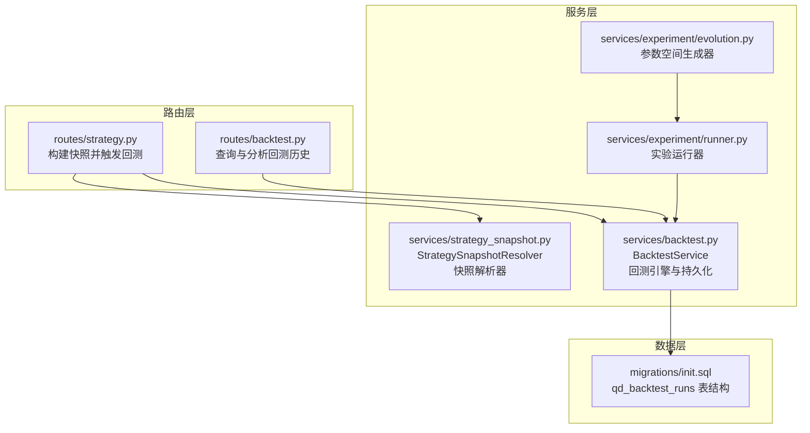
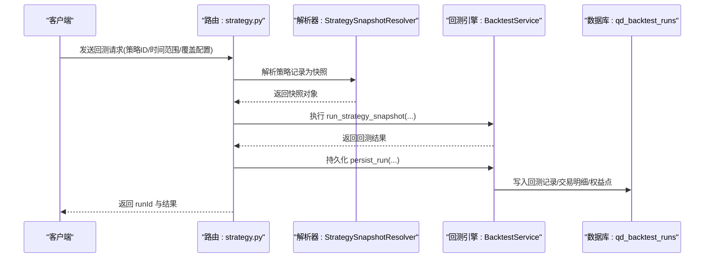
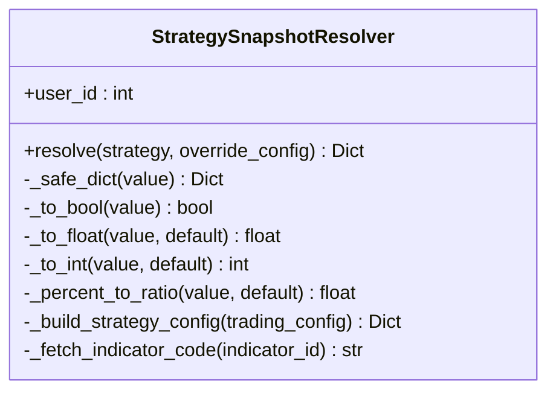
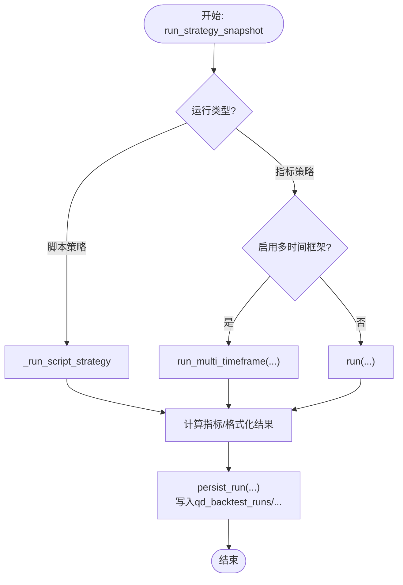
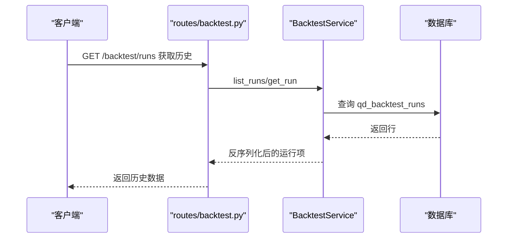
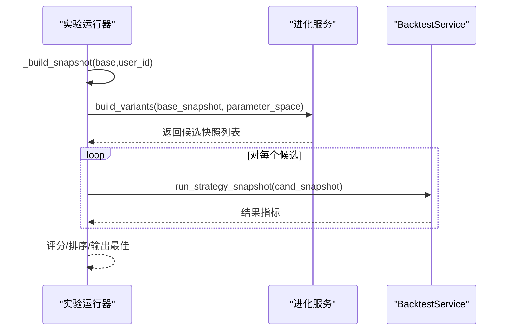
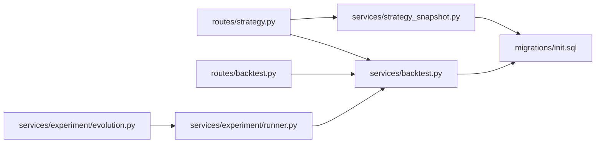

# 策略快照机制

<cite>
**本文引用的文件**
- [strategy_snapshot.py](file://backend_api_python/app/services/strategy_snapshot.py)
- [strategy.py](file://backend_api_python/app/routes/strategy.py)
- [backtest.py](file://backend_api_python/app/services/backtest.py)
- [backtest.py](file://backend_api_python/app/routes/backtest.py)
- [init.sql](file://backend_api_python/migrations/init.sql)
- [runner.py](file://backend_api_python/app/services/experiment/runner.py)
- [evolution.py](file://backend_api_python/app/services/experiment/evolution.py)
</cite>

## 目录
1. [简介](#简介)
2. [项目结构](#项目结构)
3. [核心组件](#核心组件)
4. [架构总览](#架构总览)
5. [详细组件分析](#详细组件分析)
6. [依赖分析](#依赖分析)
7. [性能考虑](#性能考虑)
8. [故障排查指南](#故障排查指南)
9. [结论](#结论)
10. [附录：快照操作示例与最佳实践](#附录快照操作示例与最佳实践)

## 简介
本文件系统性阐述 QuantDinger 中“策略快照”机制的设计与实现，覆盖以下方面：
- 快照的数据结构设计：策略参数、运行时状态、中间结果等关键信息的保存格式
- 快照的生命周期管理：创建时机、存储策略、清理规则与版本控制
- 快照恢复与回放：如何从快照数据重建策略运行环境并执行回测
- 实际操作示例：在策略开发、调试与回测中如何高效利用快照进行状态管理与结果复现

## 项目结构
围绕策略快照的关键代码分布在后端服务层与路由层：
- 路由层负责接收请求、解析参数并触发快照构建与回测执行
- 服务层负责将策略记录转换为可回测的快照对象，并执行回测与持久化
- 数据库迁移定义了快照相关表结构与字段

图表来源
- [strategy.py:510-571](file://backend_api_python/app/routes/strategy.py#L510-L571)
- [backtest.py:900-1035](file://backend_api_python/app/routes/backtest.py#L900-L1035)
- [strategy_snapshot.py:7-220](file://backend_api_python/app/services/strategy_snapshot.py#L7-L220)
- [backtest.py:64-142](file://backend_api_python/app/services/backtest.py#L64-L142)
- [init.sql:464-489](file://backend_api_python/migrations/init.sql#L464-L489)

章节来源
- [strategy.py:510-571](file://backend_api_python/app/routes/strategy.py#L510-L571)
- [backtest.py:900-1035](file://backend_api_python/app/routes/backtest.py#L900-L1035)
- [strategy_snapshot.py:7-220](file://backend_api_python/app/services/strategy_snapshot.py#L7-L220)
- [backtest.py:64-142](file://backend_api_python/app/services/backtest.py#L64-L142)
- [init.sql:464-489](file://backend_api_python/migrations/init.sql#L464-L489)

## 核心组件
- 快照解析器（StrategySnapshotResolver）：将策略记录转换为回测可用的快照对象，统一处理参数类型、默认值与跨市场符号解析
- 回测服务（BacktestService）：执行回测、计算指标、持久化回测结果与交易明细、权益曲线点
- 路由接口：提供策略回测入口与历史查询入口
- 数据库表：qd_backtest_runs、qd_backtest_trades、qd_backtest_equity_points

章节来源
- [strategy_snapshot.py:7-220](file://backend_api_python/app/services/strategy_snapshot.py#L7-L220)
- [backtest.py:64-142](file://backend_api_python/app/services/backtest.py#L64-L142)
- [strategy.py:510-571](file://backend_api_python/app/routes/strategy.py#L510-L571)
- [backtest.py:900-1035](file://backend_api_python/app/routes/backtest.py#L900-L1035)
- [init.sql:464-489](file://backend_api_python/migrations/init.sql#L464-L489)

## 架构总览
策略快照的端到端流程如下：

图表来源
- [strategy.py:510-571](file://backend_api_python/app/routes/strategy.py#L510-L571)
- [strategy_snapshot.py:116-220](file://backend_api_python/app/services/strategy_snapshot.py#L116-L220)
- [backtest.py:1457-1540](file://backend_api_python/app/services/backtest.py#L1457-L1540)
- [backtest.py:233-342](file://backend_api_python/app/services/backtest.py#L233-L342)

## 详细组件分析

### 组件A：StrategySnapshotResolver（快照解析器）
职责与行为
- 将策略记录中的字符串或字典形式的配置安全解析为字典
- 将字符串、布尔、数值、百分比等类型统一转换为回测所需的数值与布尔值
- 构建策略配置树（风险、仓位、加减仓规模、执行信号时机）
- 解析市场与符号（支持“市场:符号”的简写）
- 从指标库获取脚本源码（非脚本策略时）
- 生成完整的快照对象，包含元数据、市场配置、信号配置、策略配置与配置快照

关键数据结构
- 快照顶层字段：策略标识、名称、类型、模式、运行类型、市场、符号、时间框架、初始资金、手续费、滑点、杠杆、交易方向、是否启用多时间框架、指标ID/名称/参数、策略代码、策略配置、配置快照
- 配置快照（config_snapshot）：包含策略元信息、市场配置、信号配置、风险/仓位/加仓/减仓配置、执行配置

图表来源
- [strategy_snapshot.py:7-220](file://backend_api_python/app/services/strategy_snapshot.py#L7-L220)

章节来源
- [strategy_snapshot.py:7-220](file://backend_api_python/app/services/strategy_snapshot.py#L7-L220)

### 组件B：BacktestService（回测引擎与持久化）
职责与行为
- run_strategy_snapshot：根据快照选择单时间框架或多重时间框架回测路径，执行策略并返回指标、交易列表与权益曲线
- run/_run_script_strategy：加载K线数据、执行策略逻辑、模拟交易、计算指标、格式化结果
- persist_run：将回测运行记录、交易明细、权益曲线点写入数据库
- _hydrate_run_row：从数据库读取时反序列化 JSON 字段

数据库表结构要点
- qd_backtest_runs：保存回测运行元信息、策略配置、配置快照、引擎版本、代码哈希、状态与错误信息、结果JSON
- qd_backtest_trades：按运行ID存储每笔交易的详细信息
- qd_backtest_equity_points：按运行ID存储权益曲线采样点

图表来源
- [backtest.py:1457-1540](file://backend_api_python/app/services/backtest.py#L1457-L1540)
- [backtest.py:233-342](file://backend_api_python/app/services/backtest.py#L233-L342)
- [init.sql:464-489](file://backend_api_python/migrations/init.sql#L464-L489)

章节来源
- [backtest.py:1457-1540](file://backend_api_python/app/services/backtest.py#L1457-L1540)
- [backtest.py:233-342](file://backend_api_python/app/services/backtest.py#L233-L342)
- [init.sql:464-489](file://backend_api_python/migrations/init.sql#L464-L489)

### 组件C：路由层（策略回测与历史查询）
- 策略回测路由：校验日期范围、构建快照、调用回测引擎、持久化运行记录并返回结果
- 历史查询路由：从数据库读取回测运行记录，反序列化 JSON 字段，支持AI分析建议

图表来源
- [backtest.py:900-1035](file://backend_api_python/app/routes/backtest.py#L900-L1035)
- [backtest.py:344-418](file://backend_api_python/app/services/backtest.py#L344-L418)

章节来源
- [strategy.py:510-571](file://backend_api_python/app/routes/strategy.py#L510-L571)
- [backtest.py:900-1035](file://backend_api_python/app/routes/backtest.py#L900-L1035)
- [backtest.py:344-418](file://backend_api_python/app/services/backtest.py#L344-L418)

### 组件D：实验与参数空间（快照在自动化探索中的应用）
- 实验运行器：从基础快照出发，应用候选参数生成变体，逐个回测并评分，最终输出最佳策略
- 进化服务：基于参数空间网格/随机生成候选快照，支持嵌套键路径覆盖

图表来源
- [runner.py:150-237](file://backend_api_python/app/services/experiment/runner.py#L150-L237)
- [evolution.py:16-86](file://backend_api_python/app/services/experiment/evolution.py#L16-L86)

章节来源
- [runner.py:150-237](file://backend_api_python/app/services/experiment/runner.py#L150-L237)
- [evolution.py:16-86](file://backend_api_python/app/services/experiment/evolution.py#L16-L86)

## 依赖分析
- 路由依赖解析器与回测服务
- 回测服务依赖数据库连接、数据源工厂、指标参数解析器
- 快照解析器依赖数据库读取指标代码
- 实验运行器依赖回测服务与进化服务

图表来源
- [strategy.py:510-571](file://backend_api_python/app/routes/strategy.py#L510-L571)
- [strategy_snapshot.py:103-114](file://backend_api_python/app/services/strategy_snapshot.py#L103-L114)
- [backtest.py:88-142](file://backend_api_python/app/services/backtest.py#L88-L142)
- [init.sql:464-489](file://backend_api_python/migrations/init.sql#L464-L489)
- [runner.py:150-237](file://backend_api_python/app/services/experiment/runner.py#L150-L237)
- [evolution.py:16-86](file://backend_api_python/app/services/experiment/evolution.py#L16-L86)

章节来源
- [strategy.py:510-571](file://backend_api_python/app/routes/strategy.py#L510-L571)
- [strategy_snapshot.py:103-114](file://backend_api_python/app/services/strategy_snapshot.py#L103-L114)
- [backtest.py:88-142](file://backend_api_python/app/services/backtest.py#L88-L142)
- [init.sql:464-489](file://backend_api_python/migrations/init.sql#L464-L489)
- [runner.py:150-237](file://backend_api_python/app/services/experiment/runner.py#L150-L237)
- [evolution.py:16-86](file://backend_api_python/app/services/experiment/evolution.py#L16-L86)

## 性能考虑
- 多时间框架回测对数据量敏感，路由层对不同时间框架设置了最大回测天数限制，避免超大范围导致性能问题
- 回测服务内置K线缓存（按时间框架TTL），减少重复外部数据拉取
- 持久化阶段仅在成功状态时批量写入交易明细与权益点，降低IO开销

章节来源
- [strategy.py:525-544](file://backend_api_python/app/routes/strategy.py#L525-L544)
- [backtest.py:25-58](file://backend_api_python/app/services/backtest.py#L25-L58)

## 故障排查指南
常见问题与定位
- 快照构建失败：检查策略记录是否存在、指标代码是否可获取、市场与符号是否匹配
- 回测无成交：确认信号生成、资金充足性、滑点与手续费设置、执行时间框架
- 历史查询为空：确认用户ID、策略ID、过滤条件是否正确；检查数据库索引与字段反序列化

章节来源
- [strategy_snapshot.py:116-172](file://backend_api_python/app/services/strategy_snapshot.py#L116-L172)
- [backtest.py:1457-1454](file://backend_api_python/app/services/backtest.py#L1457-L1454)
- [backtest.py:916-929](file://backend_api_python/app/routes/backtest.py#L916-L929)

## 结论
策略快照机制通过“解析器 + 引擎 + 路由 + 数据库”的协同，实现了从策略记录到可复现回测的完整闭环。其优势在于：
- 统一的快照数据结构便于跨模块共享与持久化
- 明确的生命周期（构建 → 回测 → 持久化 → 查询）保障可追溯性
- 在实验探索中可快速生成参数变体并评估，提升策略优化效率

## 附录：快照操作示例与最佳实践
- 在策略回测中，先通过路由接口传入策略ID与起止日期，系统自动构建快照并执行回测，随后持久化运行记录
- 在实验探索中，以基础快照为起点，通过参数空间生成器批量生成候选快照，逐一回测并评分，最终保存最佳策略
- 在调试阶段，可直接读取历史回测记录，结合配置快照与结果JSON进行对比分析，快速定位问题

章节来源
- [strategy.py:510-571](file://backend_api_python/app/routes/strategy.py#L510-L571)
- [runner.py:150-237](file://backend_api_python/app/services/experiment/runner.py#L150-L237)
- [backtest.py:900-1035](file://backend_api_python/app/routes/backtest.py#L900-L1035)