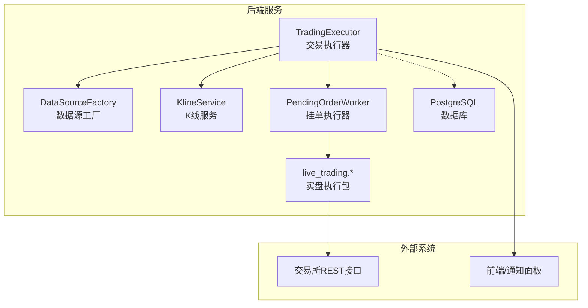
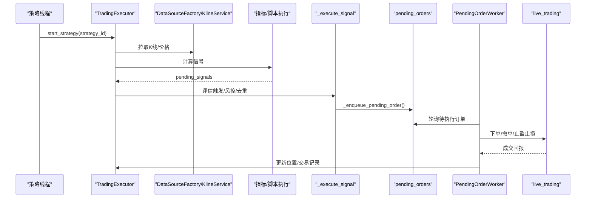
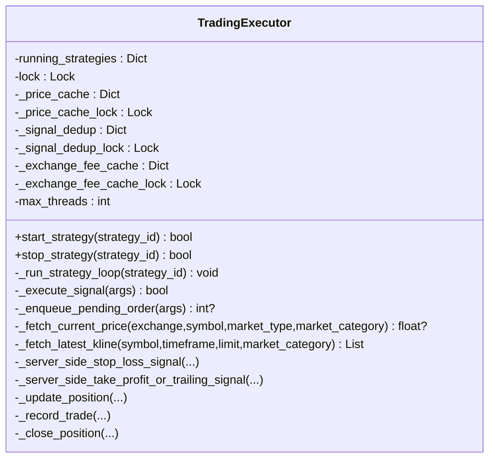
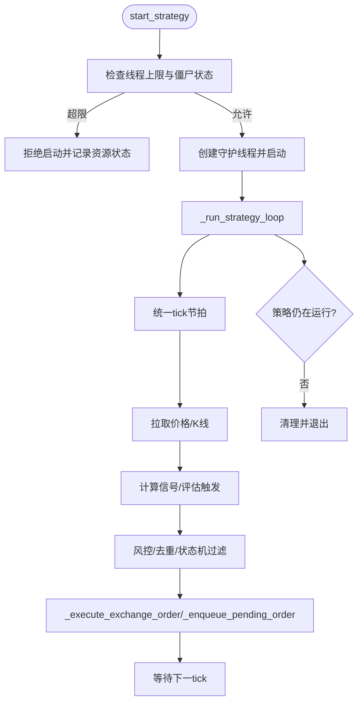
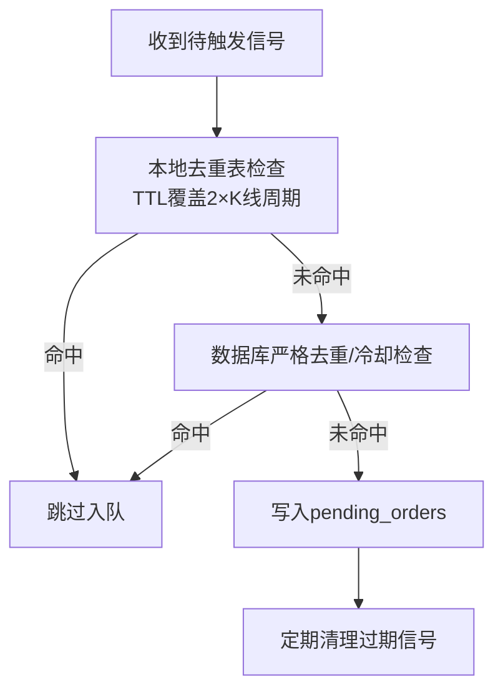
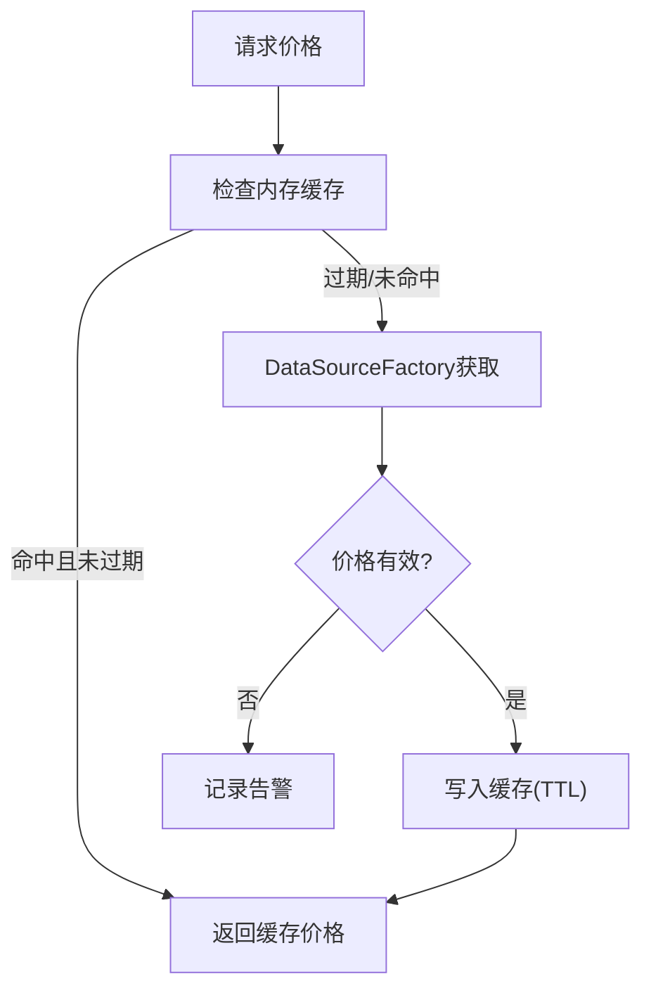
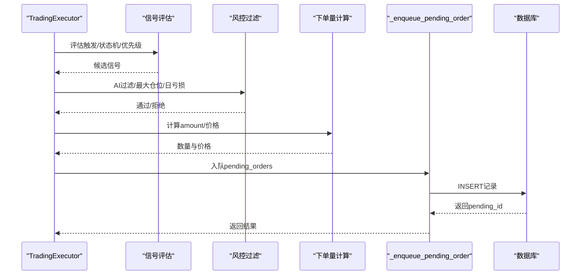
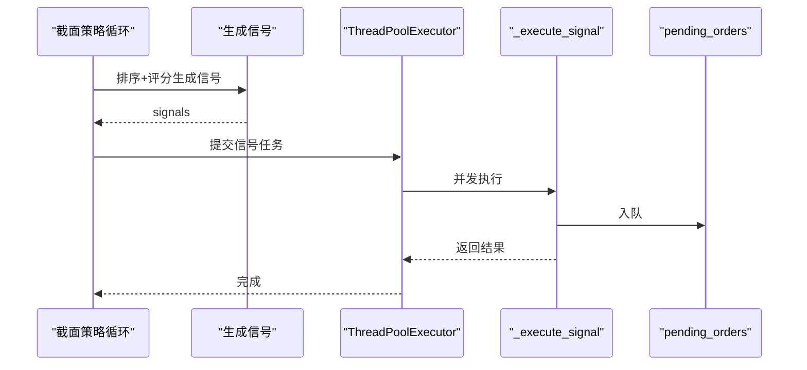
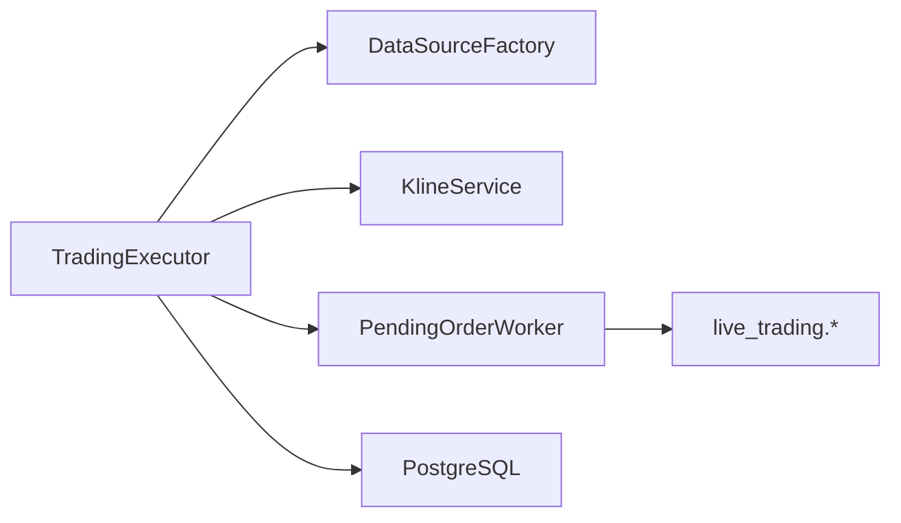

# 交易执行器核心

<cite>
**本文档引用的文件**
- [trading_executor.py](file://backend_api_python/app/services/trading_executor.py)
- [simulate_trading_executor.py](file://backend_api_python/scripts/simulate_trading_executor.py)
</cite>

## 目录
1. [简介](#简介)
2. [项目结构](#项目结构)
3. [核心组件](#核心组件)
4. [架构总览](#架构总览)
5. [详细组件分析](#详细组件分析)
6. [依赖关系分析](#依赖关系分析)
7. [性能考量](#性能考量)
8. [故障排查指南](#故障排查指南)
9. [结论](#结论)
10. [附录](#附录)

## 简介
本文件面向QuantDinger的交易执行器核心模块，系统性阐述TradingExecutor类的架构设计与实现细节，重点覆盖以下方面：
- 策略线程管理：启动/停止策略线程、线程生命周期与状态一致性校验
- 信号去重机制：基于策略、符号、信号类型与时间戳的双重去重（本地内存+数据库）
- 价格缓存系统：轻量级内存缓存与TTL控制，降低行情查询开销
- 资源限制控制：线程上限、CPU睡眠节流、内存与线程资源监控
- 交易执行流程：信号评估、触发判定、风控过滤、订单入队与状态更新
- 并发与线程安全：锁保护、原子操作、竞态规避
- 错误处理与可观测性：日志、心跳、资源状态打印、UI通知持久化
- 性能优化策略：批量截面策略、线程池并发执行、信号有效期与清理

## 项目结构
交易执行器位于后端Python服务中，核心文件为TradingExecutor类所在模块，配套有本地模拟脚本用于验证信号入队行为。

图示来源
- [trading_executor.py:1-120](file://backend_api_python/app/services/trading_executor.py#L1-L120)
- [trading_executor.py:1583-1597](file://backend_api_python/app/services/trading_executor.py#L1583-L1597)

章节来源
- [trading_executor.py:1-120](file://backend_api_python/app/services/trading_executor.py#L1-L120)

## 核心组件
- TradingExecutor：实时交易执行器，负责策略线程管理、信号生成与执行、风控与订单入队、位置与交易记录维护
- KlineService：K线缓存与获取
- DataSourceFactory：按市场类别选择合适的数据源
- PendingOrderWorker：轮询pending_orders并执行实盘下单
- 价格缓存：内存字典+TTL，避免频繁行情查询
- 信号去重：本地内存去重表 + 数据库严格去重约束
- 风控与AI过滤：最大仓位、日亏损、AI入口过滤
- 位置与交易记录：位置表、交易表、每日收益统计

章节来源
- [trading_executor.py:37-120](file://backend_api_python/app/services/trading_executor.py#L37-L120)
- [trading_executor.py:1624-1688](file://backend_api_python/app/services/trading_executor.py#L1624-L1688)
- [trading_executor.py:3076-3240](file://backend_api_python/app/services/trading_executor.py#L3076-L3240)

## 架构总览
交易执行器采用“策略线程 + 信号模式”的设计：
- 策略线程：每策略一个守护线程，按统一tick节奏拉取价格、计算指标/脚本、评估信号
- 信号模式：将信号转化为待执行订单记录入pending_orders，由PendingOrderWorker异步执行
- 实盘执行：PendingOrderWorker通过live_trading包对接各交易所REST客户端下单
- 数据层：K线与行情由数据源工厂与K线服务提供，位置与交易记录持久化至数据库

图示来源
- [trading_executor.py:775-1482](file://backend_api_python/app/services/trading_executor.py#L775-L1482)
- [trading_executor.py:2456-2787](file://backend_api_python/app/services/trading_executor.py#L2456-L2787)
- [trading_executor.py:3076-3240](file://backend_api_python/app/services/trading_executor.py#L3076-L3240)

## 详细组件分析

### TradingExecutor类
- 职责：策略线程生命周期管理、信号生成与执行、风控与订单入队、位置与交易记录维护
- 关键字段与锁：
  - running_strategies：{strategy_id: thread}，线程池与状态
  - lock：全局互斥锁，保护线程注册/清理
  - _price_cache/_price_cache_lock：内存价格缓存与TTL
  - _signal_dedup/_signal_dedup_lock：本地信号去重表
  - _exchange_fee_cache/_exchange_fee_cache_lock：按策略缓存手续费率
  - max_threads：线程上限
- 关键方法：
  - start_strategy/stop_strategy：线程启停与状态一致性校验
  - _run_strategy_loop：统一tick循环，拉价、拉K线、计算信号、评估触发、风控、入队
  - _execute_signal：下单前风控与计算，调用_execute_exchange_order入队
  - _enqueue_pending_order：写入pending_orders，严格去重与冷却控制
  - _fetch_current_price/_fetch_latest_kline：价格与K线获取，含缓存与TTL
  - _server_side_stop_loss_signal/_server_side_take_profit_or_trailing_signal：服务端止盈止损与追踪止盈
  - _update_position/_record_trade/_close_position：位置与交易记录维护

图示来源
- [trading_executor.py:37-120](file://backend_api_python/app/services/trading_executor.py#L37-L120)
- [trading_executor.py:775-1482](file://backend_api_python/app/services/trading_executor.py#L775-L1482)
- [trading_executor.py:2456-2787](file://backend_api_python/app/services/trading_executor.py#L2456-L2787)
- [trading_executor.py:3076-3240](file://backend_api_python/app/services/trading_executor.py#L3076-L3240)

章节来源
- [trading_executor.py:37-120](file://backend_api_python/app/services/trading_executor.py#L37-L120)
- [trading_executor.py:775-1482](file://backend_api_python/app/services/trading_executor.py#L775-L1482)

### 策略线程管理
- 启动：检查线程上限与僵尸状态，创建守护线程，注册到running_strategies
- 停止：更新数据库状态为stopped，移除运行列表，清理缓存
- 循环：统一tick节拍（默认10秒），拉取价格与K线，计算信号，评估触发，风控过滤，入队
- 资源监控：线程数与内存打印，定位“无法创建新线程/OOM”问题

图示来源
- [trading_executor.py:393-484](file://backend_api_python/app/services/trading_executor.py#L393-L484)
- [trading_executor.py:1063-1482](file://backend_api_python/app/services/trading_executor.py#L1063-L1482)

章节来源
- [trading_executor.py:393-484](file://backend_api_python/app/services/trading_executor.py#L393-L484)
- [trading_executor.py:1063-1482](file://backend_api_python/app/services/trading_executor.py#L1063-L1482)

### 信号去重机制
- 本地内存去重（_signal_dedup）：按策略+符号+信号类型+信号时间戳构建键，TTL覆盖至少两个K线周期
- 数据库严格去重（_enqueue_pending_order）：针对同K线（signal_ts>0）的开平仓信号进行严格去重；对进行中/待处理订单进行冷却控制
- 信号有效期清理：剔除过期信号，避免长时间滞留

图示来源
- [trading_executor.py:239-288](file://backend_api_python/app/services/trading_executor.py#L239-L288)
- [trading_executor.py:3116-3193](file://backend_api_python/app/services/trading_executor.py#L3116-L3193)
- [trading_executor.py:1239-1251](file://backend_api_python/app/services/trading_executor.py#L1239-L1251)

章节来源
- [trading_executor.py:239-288](file://backend_api_python/app/services/trading_executor.py#L239-L288)
- [trading_executor.py:3116-3193](file://backend_api_python/app/services/trading_executor.py#L3116-L3193)
- [trading_executor.py:1239-1251](file://backend_api_python/app/services/trading_executor.py#L1239-L1251)

### 价格缓存系统
- 缓存键：market_category:symbol（大写标准化，去除合约后缀）
- TTL：默认10秒，可通过环境变量PRICE_CACHE_TTL_SEC调整
- 命中优先：内存命中直接返回；过期则查询数据源并写入缓存
- 适用范围：K线服务与实时价格获取

图示来源
- [trading_executor.py:1646-1688](file://backend_api_python/app/services/trading_executor.py#L1646-L1688)

章节来源
- [trading_executor.py:1646-1688](file://backend_api_python/app/services/trading_executor.py#L1646-L1688)

### 交易执行流程
- 触发判定：根据信号类型与当前价格判断是否触发；支持立即触发与价格触及两种模式
- 状态机与优先级：严格的状态机（flat/long/short）+优先级（平仓>加仓>开仓），Bot模式可多信号
- 风控过滤：AI入口过滤、最大仓位、日亏损限制、现货禁止做空
- 订单入队：计算下单数量（按可用资金、杠杆、市价）、生成pending_orders记录
- 位置与交易记录：按信号类型更新位置、记录交易、计算收益与手续费

图示来源
- [trading_executor.py:1273-1442](file://backend_api_python/app/services/trading_executor.py#L1273-L1442)
- [trading_executor.py:2456-2787](file://backend_api_python/app/services/trading_executor.py#L2456-L2787)
- [trading_executor.py:3076-3240](file://backend_api_python/app/services/trading_executor.py#L3076-L3240)

章节来源
- [trading_executor.py:1273-1442](file://backend_api_python/app/services/trading_executor.py#L1273-L1442)
- [trading_executor.py:2456-2787](file://backend_api_python/app/services/trading_executor.py#L2456-L2787)
- [trading_executor.py:3076-3240](file://backend_api_python/app/services/trading_executor.py#L3076-L3240)

### 截面策略执行（并发优化）
- 批量截面信号：按排序生成做多/做空/平仓信号
- 线程池并发：最多10个线程并发执行信号，提升吞吐
- 严格去重：同K线信号在数据库层面严格去重

图示来源
- [trading_executor.py:3626-3833](file://backend_api_python/app/services/trading_executor.py#L3626-L3833)

章节来源
- [trading_executor.py:3626-3833](file://backend_api_python/app/services/trading_executor.py#L3626-L3833)

## 依赖关系分析
- 内部依赖
  - 数据源：DataSourceFactory（按市场类别选择数据源）、KlineService（K线缓存）
  - 执行链路：_execute_signal → _execute_exchange_order → _enqueue_pending_order → pending_orders
  - 位置与交易：_update_position/_record_trade/_close_position
- 外部依赖
  - PendingOrderWorker：轮询pending_orders并执行实盘下单
  - live_trading.*：各交易所REST客户端
  - 数据库：qd_strategies_trading、qd_strategy_positions、qd_strategy_trades、qd_strategy_notifications、pending_orders

图示来源
- [trading_executor.py:1583-1597](file://backend_api_python/app/services/trading_executor.py#L1583-L1597)

章节来源
- [trading_executor.py:1583-1597](file://backend_api_python/app/services/trading_executor.py#L1583-L1597)

## 性能考量
- 统一tick节拍：默认10秒，避免CPU自旋；每K线周期更新K线与指标
- 价格缓存：内存缓存+TTL，减少行情查询次数
- 信号有效期：剔除过期信号，避免堆积
- 并发优化：截面策略使用线程池并发执行信号
- 资源限制：线程上限、冷却与严格去重，防止队列洪泛
- 内存与线程监控：资源状态打印，辅助定位OOM与线程耗尽

章节来源
- [trading_executor.py:1047-1061](file://backend_api_python/app/services/trading_executor.py#L1047-L1061)
- [trading_executor.py:1646-1688](file://backend_api_python/app/services/trading_executor.py#L1646-L1688)
- [trading_executor.py:1239-1251](file://backend_api_python/app/services/trading_executor.py#L1239-L1251)
- [trading_executor.py:3626-3833](file://backend_api_python/app/services/trading_executor.py#L3626-L3833)
- [trading_executor.py:147-173](file://backend_api_python/app/services/trading_executor.py#L147-L173)

## 故障排查指南
- 线程无法启动/内存溢出
  - 现象：提示无法创建新线程或内存不足
  - 排查：检查STRATEGY_MAX_THREADS；观察资源状态打印；确认tick间隔与策略数量匹配
  - 参考：线程上限、资源状态打印、策略停止逻辑
- 信号重复入队
  - 现象：同一K线重复订单
  - 排查：检查本地去重表与数据库严格去重；确认signal_ts是否正确传递
  - 参考：本地去重、数据库严格去重、信号有效期清理
- 价格获取失败
  - 现象：告警“Failed to fetch price”
  - 排查：检查数据源可用性、缓存TTL、market_category映射
  - 参考：价格缓存与TTL、数据源工厂
- 订单未成交/延迟
  - 现象：pending_orders堆积
  - 排查：确认PendingOrderWorker运行状态、订单冷却与严格去重；检查交易所REST可用性
  - 参考：订单入队、PendingOrderWorker集成

章节来源
- [trading_executor.py:147-173](file://backend_api_python/app/services/trading_executor.py#L147-L173)
- [trading_executor.py:239-288](file://backend_api_python/app/services/trading_executor.py#L239-L288)
- [trading_executor.py:3116-3193](file://backend_api_python/app/services/trading_executor.py#L3116-L3193)
- [trading_executor.py:1646-1688](file://backend_api_python/app/services/trading_executor.py#L1646-L1688)

## 结论
TradingExecutor通过“策略线程 + 信号模式 + 严格风控 + 去重与缓存”的组合，实现了稳定高效的实时交易执行。其设计在保证安全性的同时兼顾性能，适合在本地部署与生产环境中运行。建议在高并发场景下合理设置线程上限与tick间隔，并结合数据库严格去重与AI过滤进一步提升稳定性与收益质量。

## 附录

### 配置参数说明
- 环境变量
  - STRATEGY_MAX_THREADS：单实例线程上限，默认64
  - STRATEGY_TICK_INTERVAL_SEC：统一tick间隔，默认10秒
  - PRICE_CACHE_TTL_SEC：价格缓存TTL，默认10秒
  - ORDER_MODE、MAKER_WAIT_SEC、MAKER_OFFSET_BPS：订单模式相关（环境变量配置）
- 策略配置（trading_config）
  - symbol、timeframe、market_type、leverage、trade_direction、initial_capital
  - entry_pct、stop_loss_pct、take_profit_pct、trailing_enabled、trailing_activation_pct、trailing_stop_pct
  - signal_mode/exit_signal_mode（confirmed/aggressive）
  - entry_trigger_mode/exit_trigger_mode（price/immediate）
  - max_position、max_daily_loss、commission、order_mode、bot_type等

章节来源
- [trading_executor.py:59-64](file://backend_api_python/app/services/trading_executor.py#L59-L64)
- [trading_executor.py:1047-1054](file://backend_api_python/app/services/trading_executor.py#L1047-L1054)
- [trading_executor.py:48-49](file://backend_api_python/app/services/trading_executor.py#L48-L49)
- [trading_executor.py:3069-3074](file://backend_api_python/app/services/trading_executor.py#L3069-L3074)

### 线程安全机制
- 全局互斥锁：保护running_strategies注册/清理
- 价格缓存锁：保护内存缓存读写
- 信号去重锁：保护本地去重表读写
- 交换费缓存锁：保护按策略缓存读写
- 数据库事务：订单入队与位置更新均在事务中执行

章节来源
- [trading_executor.py:42-64](file://backend_api_python/app/services/trading_executor.py#L42-L64)
- [trading_executor.py:1655-1684](file://backend_api_python/app/services/trading_executor.py#L1655-L1684)
- [trading_executor.py:3076-3240](file://backend_api_python/app/services/trading_executor.py#L3076-L3240)

### 错误处理策略
- 策略线程：捕获异常并记录，打印心跳日志，避免崩溃
- 信号执行：捕获异常并记录，返回失败，不阻塞主线程
- 数据库访问：失败时记录告警，尽量保证幂等与回滚
- 资源监控：线程/内存打印，辅助定位问题

章节来源
- [trading_executor.py:1453-1470](file://backend_api_python/app/services/trading_executor.py#L1453-L1470)
- [trading_executor.py:2783-2786](file://backend_api_python/app/services/trading_executor.py#L2783-L2786)
- [trading_executor.py:147-173](file://backend_api_python/app/services/trading_executor.py#L147-L173)

### 使用示例（本地模拟）
- 模拟脚本通过猴子补丁替换K线与价格获取，直接验证信号入队
- 设置较短tick间隔与禁用价格缓存，便于快速验证
- 最终查询pending_orders确认订单入队情况

章节来源
- [simulate_trading_executor.py:303-395](file://backend_api_python/scripts/simulate_trading_executor.py#L303-L395)