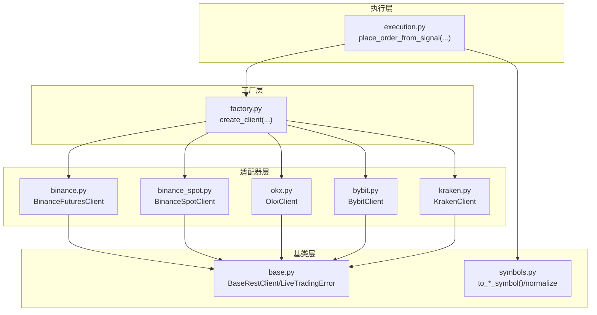
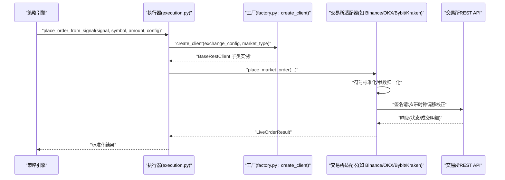
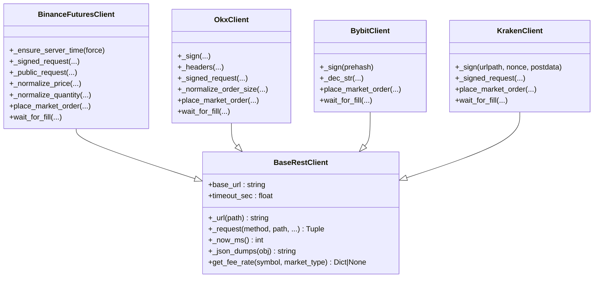
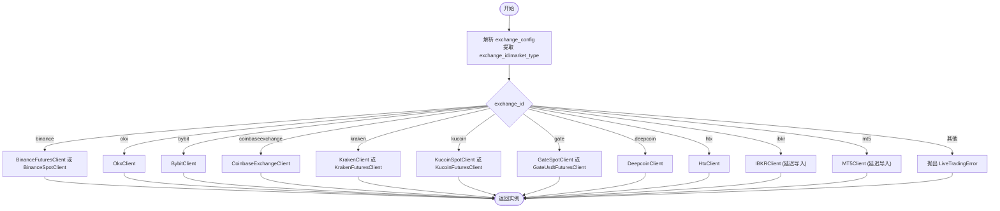
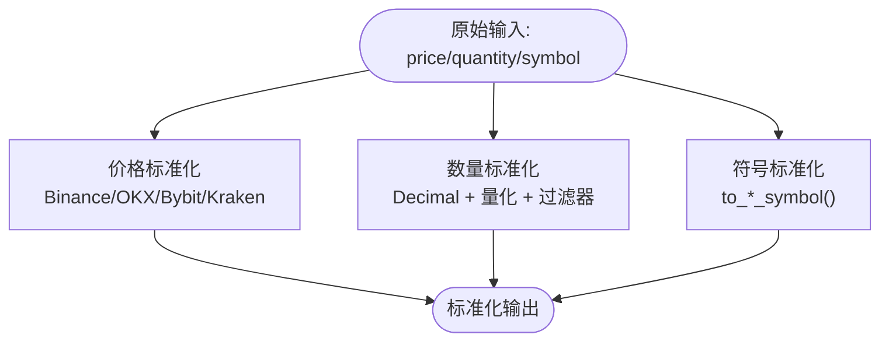
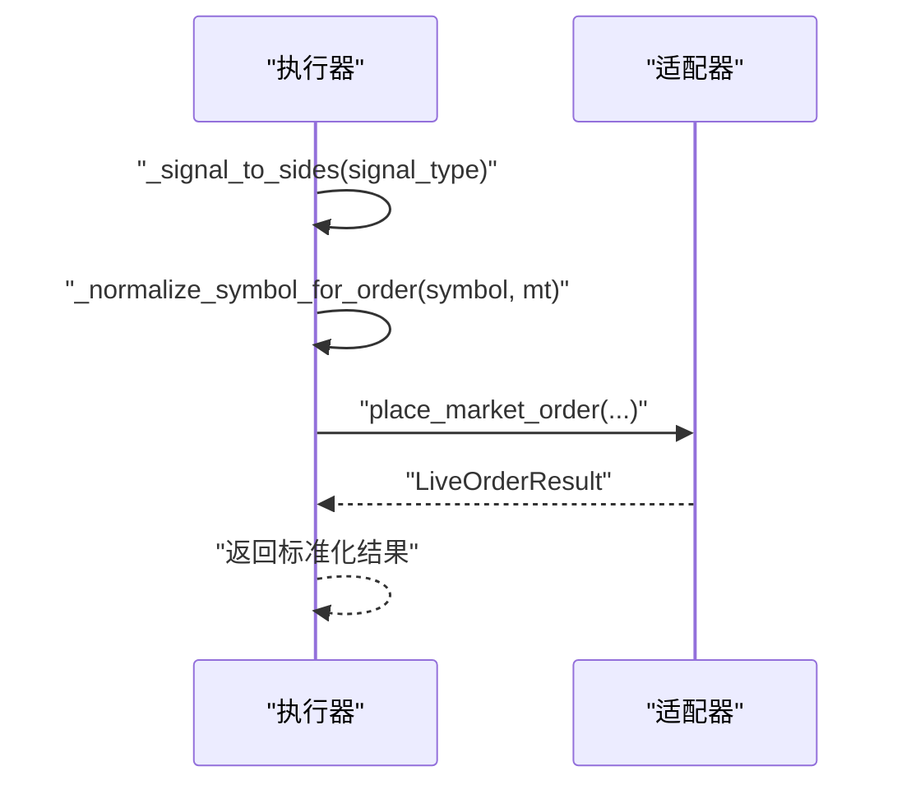
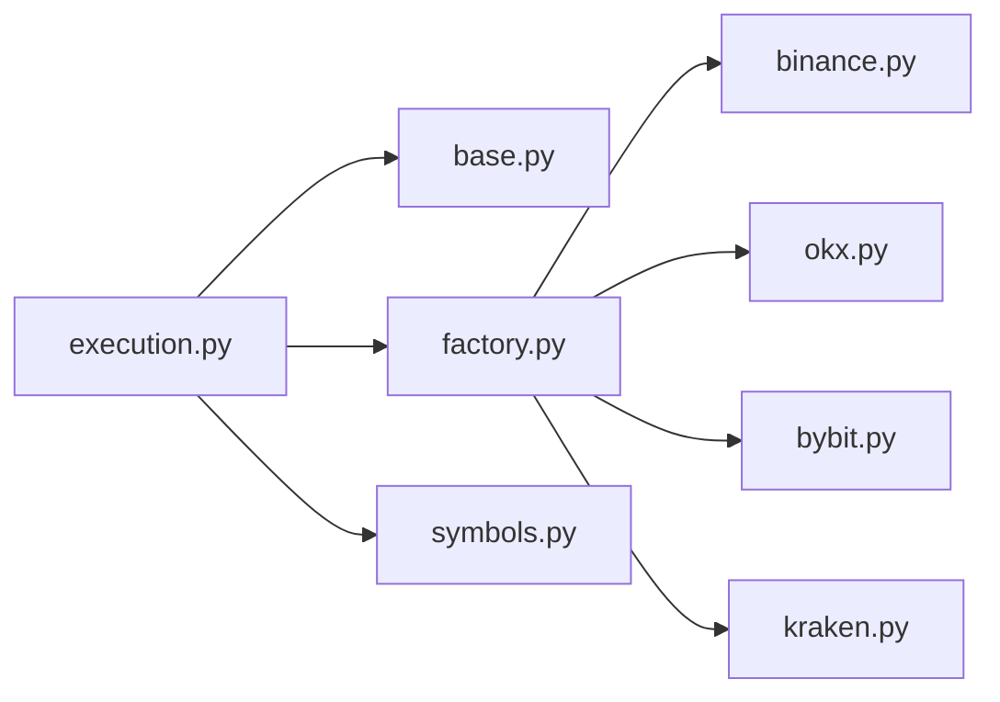

# 交易所适配器设计模式

<cite>
**本文档引用的文件**
- [base.py](file://backend_api_python/app/services/live_trading/base.py)
- [factory.py](file://backend_api_python/app/services/live_trading/factory.py)
- [execution.py](file://backend_api_python/app/services/live_trading/execution.py)
- [symbols.py](file://backend_api_python/app/services/live_trading/symbols.py)
- [binance.py](file://backend_api_python/app/services/live_trading/binance.py)
- [okx.py](file://backend_api_python/app/services/live_trading/okx.py)
- [bybit.py](file://backend_api_python/app/services/live_trading/bybit.py)
- [kraken.py](file://backend_api_python/app/services/live_trading/kraken.py)
- [binance_spot.py](file://backend_api_python/app/services/live_trading/binance_spot.py)
</cite>

## 目录
1. [引言](#引言)
2. [项目结构](#项目结构)
3. [核心组件](#核心组件)
4. [架构总览](#架构总览)
5. [详细组件分析](#详细组件分析)
6. [依赖关系分析](#依赖关系分析)
7. [性能考虑](#性能考虑)
8. [故障排查指南](#故障排查指南)
9. [结论](#结论)
10. [附录](#附录)

## 引言
本文件系统性阐述 QuantDinger 的“交易所适配器设计模式”，围绕统一的交易所接口抽象、工厂模式动态创建与管理、数据格式标准化、错误处理与重试策略、生命周期与资源清理以及自定义适配器开发指南展开。目标是帮助开发者在不改变上层策略逻辑的前提下，快速接入新的交易所或修改既有适配器。

## 项目结构
QuantDinger 的实盘交易模块位于 backend_api_python/app/services/live_trading 目录，采用“基类 + 工厂 + 具体适配器”的分层组织方式：
- 基类层：统一 REST 客户端与通用错误类型，提供签名、请求封装、时间同步等基础设施
- 适配器层：各交易所的具体实现（如 Binance、OKX、Bybit、Kraken 等）
- 工厂层：根据配置动态创建适配器实例，支持多市场类型（现货/永续）
- 执行层：将策略信号转化为具体下单调用，负责符号标准化与参数映射
- 符号层：提供跨交易所符号/产品ID的规范化工具

**图表来源**
- [factory.py:59-218](file://backend_api_python/app/services/live_trading/factory.py#L59-L218)
- [base.py:95-157](file://backend_api_python/app/services/live_trading/base.py#L95-L157)
- [execution.py:123-310](file://backend_api_python/app/services/live_trading/execution.py#L123-L310)
- [symbols.py:43-234](file://backend_api_python/app/services/live_trading/symbols.py#L43-L234)

**章节来源**
- [factory.py:1-355](file://backend_api_python/app/services/live_trading/factory.py#L1-L355)
- [base.py:1-158](file://backend_api_python/app/services/live_trading/base.py#L1-L158)
- [execution.py:1-426](file://backend_api_python/app/services/live_trading/execution.py#L1-L426)
- [symbols.py:1-235](file://backend_api_python/app/services/live_trading/symbols.py#L1-L235)

## 核心组件
- BaseRestClient：统一 REST 请求封装、签名、时间同步、错误解析与通用工具方法
- LiveTradingError：统一的交易异常类型，便于上层捕获与分类处理
- 适配器类族：各交易所继承 BaseRestClient，覆盖签名、请求路径、参数序列化、错误码映射、精度与过滤器处理
- 适配器工厂：create_client 根据 exchange_id 与 market_type 返回对应适配器实例
- 执行器：place_order_from_signal 将策略信号映射到具体交易所下单参数
- 符号规范化：to_*_symbol 系列函数将通用符号转换为交易所特定格式

**章节来源**
- [base.py:95-157](file://backend_api_python/app/services/live_trading/base.py#L95-L157)
- [factory.py:59-218](file://backend_api_python/app/services/live_trading/factory.py#L59-L218)
- [execution.py:123-310](file://backend_api_python/app/services/live_trading/execution.py#L123-L310)
- [symbols.py:43-234](file://backend_api_python/app/services/live_trading/symbols.py#L43-L234)

## 架构总览
下图展示了从策略信号到交易所下单的整体流程，以及适配器工厂与各交易所客户端之间的关系：

**图表来源**
- [execution.py:123-310](file://backend_api_python/app/services/live_trading/execution.py#L123-L310)
- [factory.py:59-218](file://backend_api_python/app/services/live_trading/factory.py#L59-L218)
- [binance.py:735-800](file://backend_api_python/app/services/live_trading/binance.py#L735-L800)
- [okx.py:551-617](file://backend_api_python/app/services/live_trading/okx.py#L551-L617)
- [bybit.py:1-200](file://backend_api_python/app/services/live_trading/bybit.py#L1-L200)
- [kraken.py:108-130](file://backend_api_python/app/services/live_trading/kraken.py#L108-L130)

## 详细组件分析

### 基类与通用能力（BaseRestClient）
- 统一请求封装：_request 方法负责超时、SSL 校验、JSON 解析与文本兜底
- 时间同步：通过 _ensure_server_time 对齐交易所服务器时间，避免时钟偏差导致的签名错误
- 精度与格式：提供 _dec_str/_to_dec/_floor_to_step 等工具，确保价格/数量满足交易所过滤器要求
- 错误处理：统一抛出 LiveTradingError，便于上层捕获与分类处理
- 证书与代理：_get_requests_verify 支持多种环境变量与系统证书路径，兼顾代理与企业 TLS 检查场景

**图表来源**
- [base.py:95-157](file://backend_api_python/app/services/live_trading/base.py#L95-L157)
- [binance.py:173-244](file://backend_api_python/app/services/live_trading/binance.py#L173-L244)
- [okx.py:289-384](file://backend_api_python/app/services/live_trading/okx.py#L289-L384)
- [bybit.py:172-200](file://backend_api_python/app/services/live_trading/bybit.py#L172-L200)
- [kraken.py:51-73](file://backend_api_python/app/services/live_trading/kraken.py#L51-L73)

**章节来源**
- [base.py:95-157](file://backend_api_python/app/services/live_trading/base.py#L95-L157)

### 适配器工厂模式（create_client）
- 输入：exchange_config 字典（包含 exchange_id、api_key、secret_key、passphrase、base_url、market_type 等）
- 选择逻辑：根据 exchange_id 与 market_type 返回对应适配器实例；支持现货/永续自动推断
- 特殊处理：
  - Demo 模式：按交易所规则自动切换测试网地址
  - 参数兼容：对大小写、键名差异进行容错处理
  - 动态导入：IBKR/MT5 仅在安装依赖时才导入，避免无依赖时报错
- 查询费率：query_fee_rate 提供一次性查询接口，失败时记录日志并返回 None

**图表来源**
- [factory.py:59-218](file://backend_api_python/app/services/live_trading/factory.py#L59-L218)

**章节来源**
- [factory.py:59-218](file://backend_api_python/app/services/live_trading/factory.py#L59-L218)

### 数据格式标准化（价格/数量/时间戳）
- 价格标准化：
  - Binance：依据 PRICE_FILTER.tickSize 与 symbol metadata.pricePrecision 下舍对齐
  - OKX：依据 instrument.lotSz 与最小精度，转换 base-asset 数量为合约数（永续）
  - Bybit：依据 qtyStep，严格控制小数位
  - Kraken：依据交易所对齐规则，提供签名与请求头
- 数量标准化：
  - 使用 Decimal 与量化操作，确保 stepSize/lotSize 精度约束
  - 永续合约按合约面值（ctVal）换算为基础资产数量
- 时间戳与签名：
  - Binance/OKX/Bybit/Kraken 均内置时间同步与签名逻辑，避免 -1021/-4061 等时钟相关错误
- 符号标准化：
  - to_binance_futures_symbol / to_okx_swap_inst_id / to_bybit_symbol / to_kraken_pair 等

**图表来源**
- [binance.py:331-426](file://backend_api_python/app/services/live_trading/binance.py#L331-L426)
- [okx.py:204-263](file://backend_api_python/app/services/live_trading/okx.py#L204-L263)
- [bybit.py:80-170](file://backend_api_python/app/services/live_trading/bybit.py#L80-L170)
- [kraken.py:51-73](file://backend_api_python/app/services/live_trading/kraken.py#L51-L73)
- [symbols.py:43-162](file://backend_api_python/app/services/live_trading/symbols.py#L43-L162)

**章节来源**
- [binance.py:331-426](file://backend_api_python/app/services/live_trading/binance.py#L331-L426)
- [okx.py:204-263](file://backend_api_python/app/services/live_trading/okx.py#L204-L263)
- [bybit.py:80-170](file://backend_api_python/app/services/live_trading/bybit.py#L80-L170)
- [kraken.py:51-73](file://backend_api_python/app/services/live_trading/kraken.py#L51-L73)
- [symbols.py:43-162](file://backend_api_python/app/services/live_trading/symbols.py#L43-L162)

### 执行器与信号到订单映射（place_order_from_signal）
- 信号到方向映射：open_long/add_long → buy；close_long/reduce_long → sell；短仓信号在现货市场被拒绝
- 符号标准化：_normalize_symbol_for_order 统一处理裸符号与后缀
- 参数映射：针对不同交易所的 size/qty/pos_side/td_mode/margin_mode 等字段做兼容
- 结果统一：返回 LiveOrderResult，包含 exchange_id、exchange_order_id、filled、avg_price、raw

**图表来源**
- [execution.py:85-173](file://backend_api_python/app/services/live_trading/execution.py#L85-L173)

**章节来源**
- [execution.py:123-310](file://backend_api_python/app/services/live_trading/execution.py#L123-L310)

### 错误处理与重试策略最佳实践
- 统一异常：所有适配器抛出 LiveTradingError，便于上层统一捕获
- 时钟同步重试：Binance/OKX/Bybit 在 -1021/-4061 等错误时自动重新同步时间并重试一次
- 限量轮询：wait_for_fill 默认轮询间隔与最大等待时间可配置，优先从 fills 获取成交均价与手续费
- 权限与参数校验：OKX 对权限错误给出明确指引；Bybit/OKX 对 posSide/tdMode 做兼容与校验
- 日志与降级：查询费率失败时记录调试日志并返回 None，不影响主流程

**章节来源**
- [binance.py:210-236](file://backend_api_python/app/services/live_trading/binance.py#L210-L236)
- [okx.py:337-384](file://backend_api_python/app/services/live_trading/okx.py#L337-L384)
- [bybit.py:1-200](file://backend_api_python/app/services/live_trading/bybit.py#L1-L200)
- [kraken.py:145-191](file://backend_api_python/app/services/live_trading/kraken.py#L145-L191)

### 生命周期管理与资源清理
- 连接与认证：
  - IBKR/MT5 在工厂中即时连接，失败即抛错，避免后台悬挂连接
  - 传统 REST 适配器通过 BaseRestClient 管理会话与超时
- 缓存与内存：
  - 适配器内部维护 symbol filters、instrument metadata、账户配置等缓存，带 TTL 控制
  - 通过 _inst_cache/_sym_filter_cache 等字典减少重复请求
- 证书与网络：
  - _get_requests_verify 统一解析 SSL 证书路径，支持代理与企业根证书场景
- 资源释放：
  - 本层未见显式 socket/连接池资源释放逻辑，建议在上层业务中按需关闭或复用连接

**章节来源**
- [factory.py:221-335](file://backend_api_python/app/services/live_trading/factory.py#L221-L335)
- [base.py:34-79](file://backend_api_python/app/services/live_trading/base.py#L34-L79)
- [binance.py:36-44](file://backend_api_python/app/services/live_trading/binance.py#L36-L44)
- [okx.py:49-62](file://backend_api_python/app/services/live_trading/okx.py#L49-L62)

### 自定义适配器开发指南
- 继承 BaseRestClient，至少实现以下方法：
  - _signed_request/_public_request：签名与公开请求封装
  - _dec_str/_to_dec/_floor_to_step：价格/数量标准化
  - get_ticker/get_account/get_fee_rate：基础能力
  - place_market_order/place_limit_order/wait_for_fill：下单与成交轮询
- 符号与参数映射：
  - 在 symbols.py 中新增 to_<exchange>_symbol 函数，或在适配器内实现映射
  - 在 execution.py 中扩展信号到参数的映射分支
- 错误与重试：
  - 明确交易所错误码与含义，必要时实现自动重试（如时钟同步）
- 测试与验证：
  - 使用工厂 create_client 创建实例，结合 get_ticker/get_account 验证连通性
  - 使用 wait_for_fill 验证成交回报与手续费获取

**章节来源**
- [base.py:95-157](file://backend_api_python/app/services/live_trading/base.py#L95-L157)
- [symbols.py:43-234](file://backend_api_python/app/services/live_trading/symbols.py#L43-L234)
- [execution.py:153-310](file://backend_api_python/app/services/live_trading/execution.py#L153-L310)

## 依赖关系分析
- 低耦合：适配器均继承 BaseRestClient，共享签名与请求封装逻辑
- 工厂集中：create_client 统一入口，屏蔽具体适配器差异
- 执行器解耦：execution.py 仅依赖 BaseRestClient 接口，不关心具体实现
- 符号层独立：symbols.py 专注符号转换，避免散落于各适配器

**图表来源**
- [execution.py:123-310](file://backend_api_python/app/services/live_trading/execution.py#L123-L310)
- [factory.py:59-218](file://backend_api_python/app/services/live_trading/factory.py#L59-L218)
- [base.py:95-157](file://backend_api_python/app/services/live_trading/base.py#L95-L157)
- [symbols.py:43-234](file://backend_api_python/app/services/live_trading/symbols.py#L43-L234)

**章节来源**
- [execution.py:1-426](file://backend_api_python/app/services/live_trading/execution.py#L1-L426)
- [factory.py:1-355](file://backend_api_python/app/services/live_trading/factory.py#L1-L355)
- [base.py:1-158](file://backend_api_python/app/services/live_trading/base.py#L1-L158)
- [symbols.py:1-235](file://backend_api_python/app/services/live_trading/symbols.py#L1-L235)

## 性能考虑
- 缓存策略：符号过滤器、账户配置、杠杆设置等带 TTL 缓存，显著降低请求频率
- 精度控制：使用 Decimal 与量化，避免浮点误差与多次往返请求
- 轮询优化：wait_for_fill 设置合理轮询间隔与最大等待时间，避免过度轮询
- 证书解析：_get_requests_verify 避免重复计算，全局缓存 verify 值

[本节为通用指导，无需列出具体文件来源]

## 故障排查指南
- 时钟相关错误（-1021/-4061）：检查本地时间与交易所时间偏移，确认 _ensure_server_time 是否生效
- 权限错误（401/50120）：确认 API Key 权限已开启交易权限
- 数量/价格精度不足：检查 PRICE_FILTER/LOT_SIZE/qtyStep 等过滤器，确保已按 step 对齐
- 符号格式错误：使用 symbols.py 中 to_*_symbol 规范化后再下单
- 代理与证书问题：设置 LIVE_TRADING_CA_BUNDLE 或使用系统证书路径

**章节来源**
- [binance.py:210-236](file://backend_api_python/app/services/live_trading/binance.py#L210-L236)
- [okx.py:337-384](file://backend_api_python/app/services/live_trading/okx.py#L337-L384)
- [kraken.py:145-191](file://backend_api_python/app/services/live_trading/kraken.py#L145-L191)
- [base.py:34-79](file://backend_api_python/app/services/live_trading/base.py#L34-L79)

## 结论
QuantDinger 的交易所适配器设计以 BaseRestClient 为核心，通过工厂模式实现多交易所、多市场的统一接入，配合符号标准化与严格的精度控制，有效降低了跨平台差异带来的复杂度。执行器层进一步将策略信号与下单参数解耦，使新增交易所或修改参数变得简单可控。建议在扩展新适配器时遵循现有模式，充分利用缓存、签名与错误处理机制，确保稳定性与性能。

[本节为总结，无需列出具体文件来源]

## 附录
- 关键实现路径参考：
  - [工厂创建适配器:59-218](file://backend_api_python/app/services/live_trading/factory.py#L59-L218)
  - [基类请求与签名:106-143](file://backend_api_python/app/services/live_trading/base.py#L106-L143)
  - [Binance 价格/数量标准化:331-426](file://backend_api_python/app/services/live_trading/binance.py#L331-L426)
  - [OKX 订单尺寸与签名:204-384](file://backend_api_python/app/services/live_trading/okx.py#L204-L384)
  - [Bybit 精度与签名:80-173](file://backend_api_python/app/services/live_trading/bybit.py#L80-L173)
  - [Kraken 签名与轮询:51-191](file://backend_api_python/app/services/live_trading/kraken.py#L51-L191)
  - [执行器信号映射:123-310](file://backend_api_python/app/services/live_trading/execution.py#L123-L310)
  - [符号标准化工具:43-234](file://backend_api_python/app/services/live_trading/symbols.py#L43-L234)

[本节为索引，无需列出具体文件来源]