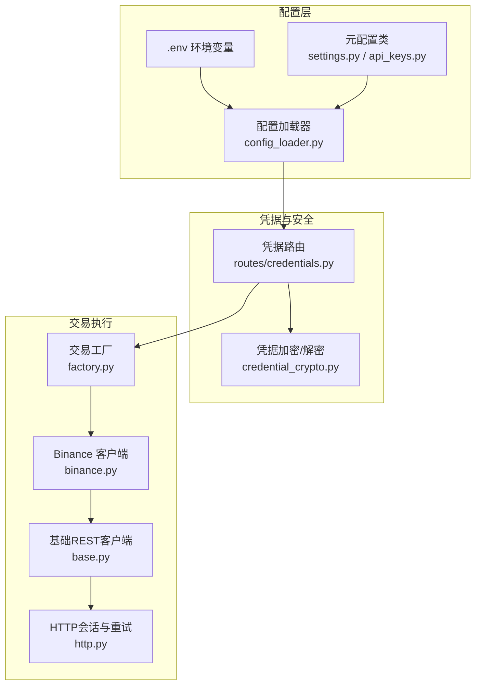
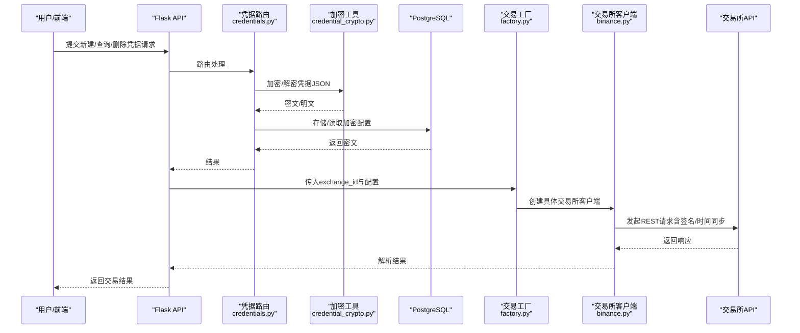
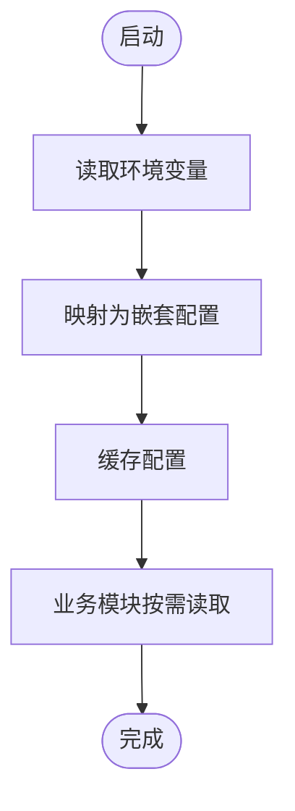
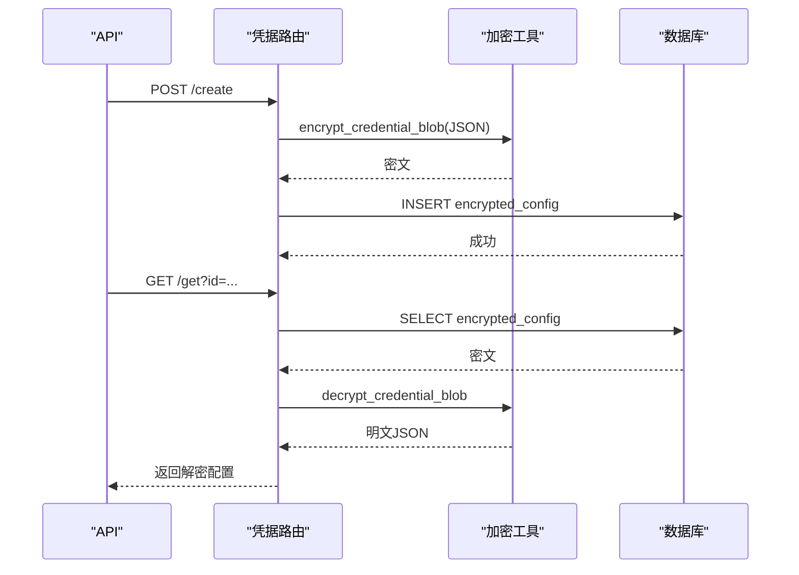
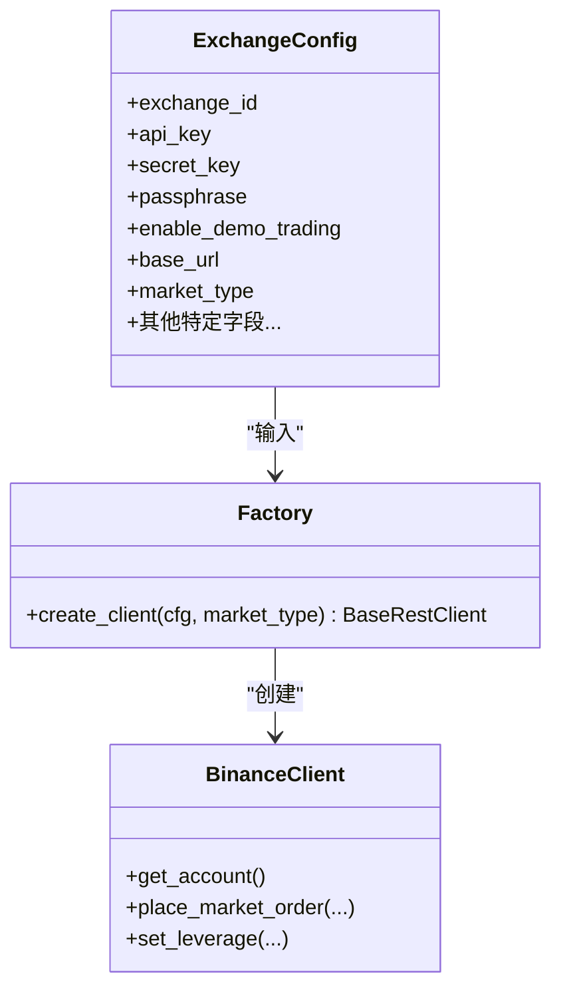
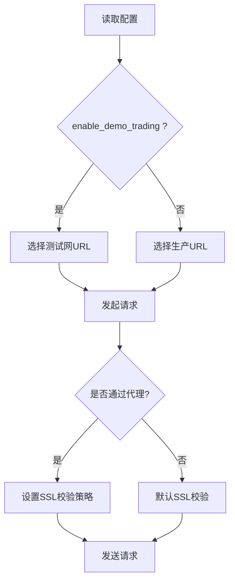
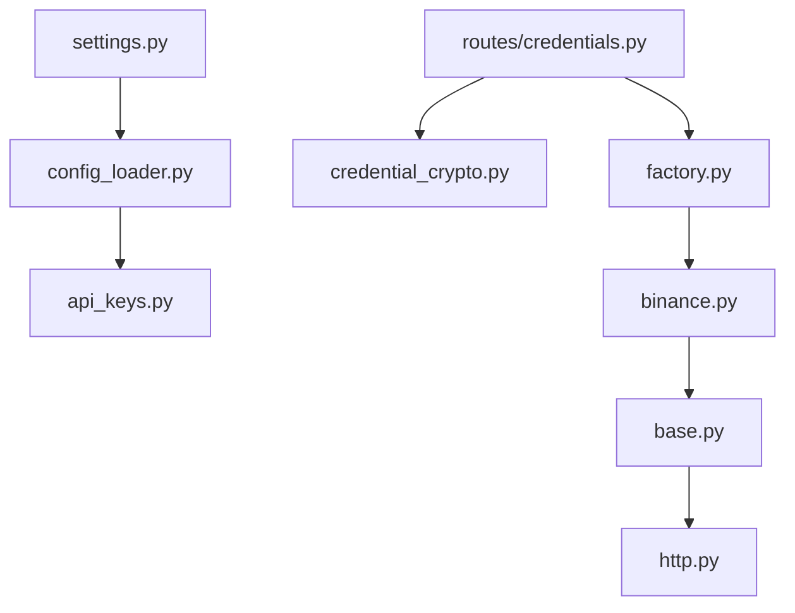

# 交易所配置管理

<cite>
**本文档引用的文件**
- [settings.py](file://backend_api_python/app/config/settings.py)
- [api_keys.py](file://backend_api_python/app/config/api_keys.py)
- [config_loader.py](file://backend_api_python/app/utils/config_loader.py)
- [credential_crypto.py](file://backend_api_python/app/utils/credential_crypto.py)
- [env.example](file://backend_api_python/env.example)
- [credentials.py](file://backend_api_python/app/routes/credentials.py)
- [factory.py](file://backend_api_python/app/services/live_trading/factory.py)
- [base.py](file://backend_api_python/app/services/live_trading/base.py)
- [binance.py](file://backend_api_python/app/services/live_trading/binance.py)
- [http.py](file://backend_api_python/app/utils/http.py)
</cite>

## 目录
1. [简介](#简介)
2. [项目结构](#项目结构)
3. [核心组件](#核心组件)
4. [架构总览](#架构总览)
5. [详细组件分析](#详细组件分析)
6. [依赖分析](#依赖分析)
7. [性能考虑](#性能考虑)
8. [故障排除指南](#故障排除指南)
9. [结论](#结论)
10. [附录](#附录)

## 简介
本文件面向QuantDinger的交易所配置管理，系统性说明各交易所的配置参数要求、API密钥设置、私有/公有API访问权限配置、安全存储与加密机制、网络环境（主网/测试网）与代理设置、配置验证与测试方法、常见错误排查以及多账户与批量配置的最佳实践。

## 项目结构
围绕“交易所配置管理”的关键目录与文件如下：
- 配置加载与环境变量映射：config_loader.py、api_keys.py、settings.py、env.example
- 凭据加密与存储：credential_crypto.py、routes/credentials.py
- 交易客户端工厂与具体交易所实现：services/live_trading/factory.py、services/live_trading/binance.py 等
- 网络与代理：services/live_trading/base.py、utils/http.py
- 示例与模板：env.example

**图表来源**
- [config_loader.py:1-252](file://backend_api_python/app/utils/config_loader.py#L1-L252)
- [api_keys.py:1-164](file://backend_api_python/app/config/api_keys.py#L1-L164)
- [settings.py:1-99](file://backend_api_python/app/config/settings.py#L1-L99)
- [credential_crypto.py:1-50](file://backend_api_python/app/utils/credential_crypto.py#L1-L50)
- [credentials.py:1-460](file://backend_api_python/app/routes/credentials.py#L1-L460)
- [factory.py:1-355](file://backend_api_python/app/services/live_trading/factory.py#L1-L355)
- [base.py:1-158](file://backend_api_python/app/services/live_trading/base.py#L1-L158)
- [binance.py:1-800](file://backend_api_python/app/services/live_trading/binance.py#L1-L800)
- [http.py:1-42](file://backend_api_python/app/utils/http.py#L1-L42)

**章节来源**
- [config_loader.py:1-252](file://backend_api_python/app/utils/config_loader.py#L1-L252)
- [env.example:1-268](file://backend_api_python/env.example#L1-L268)

## 核心组件
- 配置加载与环境变量映射：通过config_loader.py将环境变量映射为嵌套配置字典；api_keys.py集中管理第三方API密钥；settings.py提供应用级配置（主机、端口、日志、速率限制等）。
- 凭据安全存储：routes/credentials.py负责用户凭证的增删查；credential_crypto.py使用Fernet对称加密，基于SECRET_KEY派生密钥，确保敏感信息在数据库中以密文形式存储。
- 交易工厂与客户端：factory.py根据exchange_id与市场类型选择具体交易所客户端；binance.py等实现具体交易所的REST交互细节。
- 网络与代理：base.py解析LIVE_TRADING_SSL_VERIFY/LIVE_TRADING_CA_BUNDLE等环境变量，统一处理HTTPS证书校验；http.py提供带重试的全局Session。

**章节来源**
- [api_keys.py:1-164](file://backend_api_python/app/config/api_keys.py#L1-L164)
- [settings.py:1-99](file://backend_api_python/app/config/settings.py#L1-L99)
- [config_loader.py:1-252](file://backend_api_python/app/utils/config_loader.py#L1-L252)
- [credential_crypto.py:1-50](file://backend_api_python/app/utils/credential_crypto.py#L1-L50)
- [credentials.py:1-460](file://backend_api_python/app/routes/credentials.py#L1-L460)
- [factory.py:1-355](file://backend_api_python/app/services/live_trading/factory.py#L1-L355)
- [base.py:1-158](file://backend_api_python/app/services/live_trading/base.py#L1-L158)
- [http.py:1-42](file://backend_api_python/app/utils/http.py#L1-L42)

## 架构总览
下图展示了从环境变量到交易所客户端的完整链路，以及凭据的加密存储流程。

**图表来源**
- [credentials.py:170-312](file://backend_api_python/app/routes/credentials.py#L170-L312)
- [credential_crypto.py:25-50](file://backend_api_python/app/utils/credential_crypto.py#L25-L50)
- [factory.py:59-218](file://backend_api_python/app/services/live_trading/factory.py#L59-L218)
- [binance.py:24-35](file://backend_api_python/app/services/live_trading/binance.py#L24-L35)

## 详细组件分析

### 配置加载与环境变量映射
- config_loader.py负责将环境变量映射为点号分隔的嵌套键（如openrouter.api_key），并缓存解析结果，避免重复解析。
- 支持的键包括：LLM提供商、数据源超时与重试、CCXT默认交易所、Finnhub、Crypto Analytics、搜索服务等。
- api_keys.py通过元类动态读取环境变量或附加配置中的API密钥，支持逗号分隔的轮换密钥（如Tavily、SerpAPI）。
- settings.py提供应用级配置，如主机、端口、调试模式、日志级别、速率限制、功能开关等。

**图表来源**
- [config_loader.py:24-161](file://backend_api_python/app/utils/config_loader.py#L24-L161)
- [api_keys.py:7-164](file://backend_api_python/app/config/api_keys.py#L7-L164)
- [settings.py:6-99](file://backend_api_python/app/config/settings.py#L6-L99)

**章节来源**
- [config_loader.py:1-252](file://backend_api_python/app/utils/config_loader.py#L1-L252)
- [api_keys.py:1-164](file://backend_api_python/app/config/api_keys.py#L1-L164)
- [settings.py:1-99](file://backend_api_python/app/config/settings.py#L1-L99)

### 凭据安全存储与加密机制
- SECRET_KEY用于派生Fernet密钥（SHA-256 → URL安全Base64 → Fernet密钥）。若未设置，加密/解密会抛出异常。
- routes/credentials.py提供凭据列表、创建、删除、获取接口；创建时将配置JSON序列化后加密存储，获取时解密返回。
- 建议：
  - 不要频繁轮换SECRET_KEY；如需轮换，需重新加密所有现有凭据。
  - 对于生产环境，将.env置于受控位置，限制文件权限。

**图表来源**
- [credentials.py:170-312](file://backend_api_python/app/routes/credentials.py#L170-L312)
- [credential_crypto.py:17-50](file://backend_api_python/app/utils/credential_crypto.py#L17-L50)

**章节来源**
- [credential_crypto.py:1-50](file://backend_api_python/app/utils/credential_crypto.py#L1-L50)
- [credentials.py:1-460](file://backend_api_python/app/routes/credentials.py#L1-L460)

### 交易所配置参数与网络环境
- 通用参数（示例来自env.example）：
  - 代理：PROXY_URL（SOCKS5H示例）、LIVE_TRADING_CA_BUNDLE、LIVE_TRADING_SSL_VERIFY
  - 数据源：DATA_SOURCE_TIMEOUT、DATA_SOURCE_RETRY、DATA_SOURCE_RETRY_BACKOFF
  - CCXT：CCXT_DEFAULT_EXCHANGE、CCXT_TIMEOUT
- 交易所特定参数（以factory.py为例）：
  - Binance：exchange_id、api_key、secret_key、passphrase（可选）、enable_demo_trading、base_url（可选）、broker_id（可选）
  - OKX：exchange_id、api_key、secret_key、passphrase、base_url、broker_code、simulated_trading
  - Bitget：exchange_id、api_key、secret_key、passphrase、base_url、channel_api_code、simulated_trading、market_type
  - Bybit：exchange_id、api_key、secret_key、base_url、category（spot/linear）、recv_window_ms、broker_referer、hedge_mode
  - CoinbaseExchange：exchange_id、api_key、secret_key、passphrase、base_url（沙盒/生产）
  - Kraken：exchange_id、api_key、secret_key、base_url（spot）、futures_base_url（可选）
  - KuCoin：exchange_id、api_key、secret_key、passphrase、base_url（沙盒/生产）、futures_base_url（可选）
  - Gate：exchange_id、api_key、secret_key、base_url（沙盒/生产）、channel_id（可选）
  - Deepcoin：exchange_id、api_key、secret_key、passphrase、base_url、market_type
  - HTX：exchange_id、api_key、secret_key、base_url（现货）、futures_base_url（可选）、broker_id（可选）
  - IBKR：exchange_id、ibkr_host、ibkr_port、ibkr_client_id、ibkr_account
  - MT5：exchange_id、mt5_server、mt5_login、mt5_password、mt5_terminal_path、market_category（仅Forex）

**图表来源**
- [factory.py:59-218](file://backend_api_python/app/services/live_trading/factory.py#L59-L218)
- [binance.py:24-35](file://backend_api_python/app/services/live_trading/binance.py#L24-L35)

**章节来源**
- [env.example:104-118](file://backend_api_python/env.example#L104-L118)
- [env.example:196-206](file://backend_api_python/env.example#L196-L206)
- [env.example:203-204](file://backend_api_python/env.example#L203-L204)
- [factory.py:59-218](file://backend_api_python/app/services/live_trading/factory.py#L59-L218)

### 网络环境（主网/测试网）与代理设置
- 测试网切换：
  - enable_demo_trading为true时，各交易所客户端自动选择测试网URL（如Binance Demo、OKX Sandbox、Bybit Testnet等）。
  - 若交易所未内置测试网支持，需显式提供base_url（如Deepcoin、HTX）。
- 代理与证书：
  - PROXY_URL用于SOCKS5H等代理；LIVE_TRADING_SSL_VERIFY可禁用校验（开发/测试场景）；LIVE_TRADING_CA_BUNDLE指定PEM证书包。
  - base.py统一解析HTTPS证书校验策略，优先使用环境变量，其次系统CA，最后certifi。

**图表来源**
- [factory.py:73-83](file://backend_api_python/app/services/live_trading/factory.py#L73-L83)
- [base.py:34-79](file://backend_api_python/app/services/live_trading/base.py#L34-L79)
- [env.example:106-117](file://backend_api_python/env.example#L106-L117)

**章节来源**
- [factory.py:118-194](file://backend_api_python/app/services/live_trading/factory.py#L118-L194)
- [base.py:1-158](file://backend_api_python/app/services/live_trading/base.py#L1-L158)
- [env.example:104-118](file://backend_api_python/env.example#L104-L118)

### 配置验证与测试方法
- 凭据验证：
  - 使用routes/credentials.py的“获取凭据”接口，确认能成功解密并返回配置。
  - 检查IP白名单：/egress-ip接口返回服务器出口IP，便于在交易所后台添加白名单。
- 连接测试：
  - Binance：get_account()返回账户信息；ping()检查连通性。
  - 通用：BaseRestClient._request()返回状态码与解析结果，可用于快速验证。
- 建议流程：
  - 先在交易所开启测试网API并设置IP白名单。
  - 在本地或容器内设置PROXY_URL（如有）与LIVE_TRADING_CA_BUNDLE（如需）。
  - 通过factory.py创建客户端并调用get_account()进行认证测试。

**章节来源**
- [credentials.py:121-167](file://backend_api_python/app/routes/credentials.py#L121-L167)
- [binance.py:428-436](file://backend_api_python/app/services/live_trading/binance.py#L428-L436)
- [base.py:106-143](file://backend_api_python/app/services/live_trading/base.py#L106-L143)

### 常见配置错误与排查
- 缺少API密钥或密钥无效：
  - 检查env.example中对应键是否正确设置；确认API已启用并授予相应权限。
- 代理导致SSL证书错误：
  - 设置LIVE_TRADING_CA_BUNDLE指向正确的PEM证书包；或安装系统CA证书；避免长期使用LIVE_TRADING_SSL_VERIFY=false。
- 时间戳偏差导致签名错误（Binance -1021）：
  - 客户端会自动同步服务器时间；若仍失败，检查宿主机时间与NTP同步。
- 权限不足或IP未加入白名单：
  - 使用/egress-ip获取出口IP并添加至交易所白名单。
- 交易所测试网未配置：
  - 对于Deepcoin/HTX等，需显式提供测试网base_url。

**章节来源**
- [base.py:128-136](file://backend_api_python/app/services/live_trading/base.py#L128-L136)
- [binance.py:173-191](file://backend_api_python/app/services/live_trading/binance.py#L173-L191)
- [credentials.py:121-167](file://backend_api_python/app/routes/credentials.py#L121-L167)
- [factory.py:179-194](file://backend_api_python/app/services/live_trading/factory.py#L179-L194)

### 多账户管理与批量配置最佳实践
- 多账户：
  - 为每个账户创建独立的凭据记录，使用不同name区分；必要时为不同交易所分别保存。
- 批量配置：
  - 通过API批量创建/删除凭据；注意控制并发与速率限制。
- 安全与合规：
  - 严格保管.env与数据库备份；定期轮换API密钥；最小权限原则授予各账户。
- 环境隔离：
  - 开发/测试/生产三套.env；不同环境使用不同的SECRET_KEY与数据库实例。

**章节来源**
- [credentials.py:32-99](file://backend_api_python/app/routes/credentials.py#L32-L99)
- [credentials.py:315-373](file://backend_api_python/app/routes/credentials.py#L315-L373)

## 依赖分析
- 组件耦合：
  - config_loader.py与api_keys.py共同为上层模块提供配置；routes/credentials.py依赖credential_crypto.py进行加解密。
  - factory.py依赖具体交易所客户端实现；binance.py等实现依赖base.py提供的HTTP与签名逻辑。
- 外部依赖：
  - requests、urllib3.Retry用于HTTP重试；cryptography.Fernet用于对称加密；certifi用于证书包定位。

**图表来源**
- [config_loader.py:1-252](file://backend_api_python/app/utils/config_loader.py#L1-L252)
- [api_keys.py:1-164](file://backend_api_python/app/config/api_keys.py#L1-L164)
- [settings.py:1-99](file://backend_api_python/app/config/settings.py#L1-L99)
- [credentials.py:1-460](file://backend_api_python/app/routes/credentials.py#L1-L460)
- [credential_crypto.py:1-50](file://backend_api_python/app/utils/credential_crypto.py#L1-L50)
- [factory.py:1-355](file://backend_api_python/app/services/live_trading/factory.py#L1-L355)
- [binance.py:1-800](file://backend_api_python/app/services/live_trading/binance.py#L1-L800)
- [base.py:1-158](file://backend_api_python/app/services/live_trading/base.py#L1-L158)
- [http.py:1-42](file://backend_api_python/app/utils/http.py#L1-L42)

**章节来源**
- [config_loader.py:1-252](file://backend_api_python/app/utils/config_loader.py#L1-L252)
- [factory.py:1-355](file://backend_api_python/app/services/live_trading/factory.py#L1-L355)

## 性能考虑
- HTTP重试与超时：http.py提供带指数退避的重试策略；base.py统一设置verify，减少TLS握手开销。
- 配置缓存：config_loader.py缓存解析后的配置，降低重复解析成本。
- 交易所精度与过滤器：binance.py对价格/数量进行严格规范化，避免因精度问题导致的反复请求与错误。

**章节来源**
- [http.py:9-42](file://backend_api_python/app/utils/http.py#L9-L42)
- [config_loader.py:20-21](file://backend_api_python/app/utils/config_loader.py#L20-L21)
- [binance.py:264-426](file://backend_api_python/app/services/live_trading/binance.py#L264-L426)

## 故障排除指南
- 无法连接交易所：
  - 检查PROXY_URL与LIVE_TRADING_SSL_VERIFY设置；确认网络可达与证书链有效。
- 认证失败：
  - 确认API密钥、Passphrase与交易所权限；使用get_account()进行验证。
- 交易被拒：
  - 检查最小下单量/精度（LOT_SIZE/PRICE_FILTER）与最小成交额（MIN_NOTIONAL）；binance.py提供规范化逻辑。
- 速率限制：
  - 调整config_loader.py映射的app.rate_limit与ENABLE_CACHE、ENABLE_REQUEST_LOG等开关。

**章节来源**
- [base.py:34-79](file://backend_api_python/app/services/live_trading/base.py#L34-L79)
- [binance.py:428-436](file://backend_api_python/app/services/live_trading/binance.py#L428-L436)
- [binance.py:760-778](file://backend_api_python/app/services/live_trading/binance.py#L760-L778)
- [config_loader.py:106-109](file://backend_api_python/app/utils/config_loader.py#L106-L109)

## 结论
QuantDinger的交易所配置管理以“环境变量+附加配置”的方式实现灵活部署，辅以Fernet对称加密保障凭据安全。通过factory模式与标准化的REST客户端，系统支持多交易所、多市场的统一接入。结合代理与证书策略、严格的精度与过滤器处理，可在主网与测试网之间平滑切换，并具备良好的可维护性与安全性。

## 附录
- 环境变量参考（节选）：
  - SECRET_KEY、ADMIN_USER、ADMIN_PASSWORD、DATABASE_URL、FRONTEND_URL、OAUTH_ALLOWED_REDIRECTS、OAUTH_STATE_TTL_MINUTES、ENABLE_REGISTRATION
  - PROXY_URL、LIVE_TRADING_CA_BUNDLE、LIVE_TRADING_SSL_VERIFY
  - DATA_SOURCE_TIMEOUT、DATA_SOURCE_RETRY、DATA_SOURCE_RETRY_BACKOFF、CCXT_DEFAULT_EXCHANGE、CCXT_TIMEOUT
  - OPENROUTER_API_KEY、OPENAI_API_KEY、GOOGLE_API_KEY、DEEPSEEK_API_KEY、GROK_API_KEY、TAVILY_API_KEYS、SERPAPI_KEYS
  - LLM_PROVIDER、OPENROUTER_API_URL、OPENROUTER_TEMPERATURE、OPENROUTER_MAX_TOKENS、OPENROUTER_TIMEOUT、OPENROUTER_CONNECT_TIMEOUT、OPENAI_BASE_URL、DEEPSEEK_BASE_URL、GROK_BASE_URL

**章节来源**
- [env.example:1-268](file://backend_api_python/env.example#L1-L268)