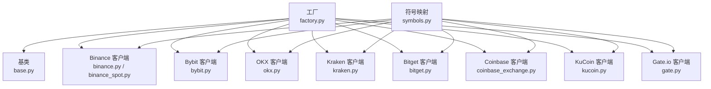
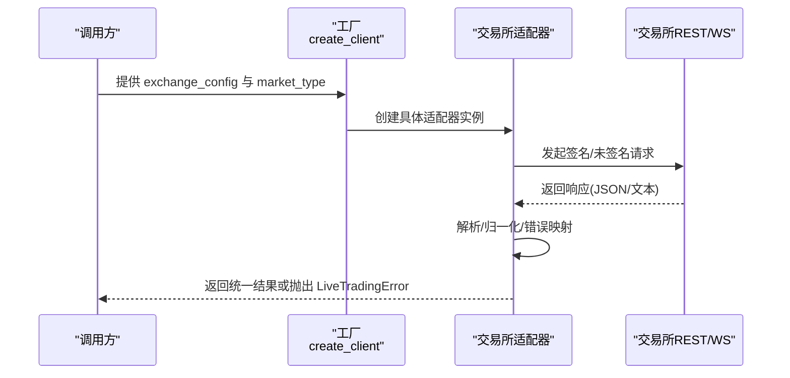
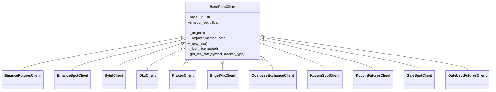
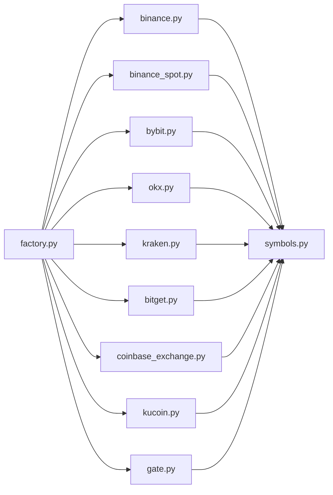

# 多交易所集成

<cite>
**本文档引用的文件**
- [factory.py](file://backend_api_python/app/services/live_trading/factory.py)
- [base.py](file://backend_api_python/app/services/live_trading/base.py)
- [symbols.py](file://backend_api_python/app/services/live_trading/symbols.py)
- [binance.py](file://backend_api_python/app/services/live_trading/binance.py)
- [binance_spot.py](file://backend_api_python/app/services/live_trading/binance_spot.py)
- [bybit.py](file://backend_api_python/app/services/live_trading/bybit.py)
- [okx.py](file://backend_api_python/app/services/live_trading/okx.py)
- [kraken.py](file://backend_api_python/app/services/live_trading/kraken.py)
- [bitget.py](file://backend_api_python/app/services/live_trading/bitget.py)
- [coinbase_exchange.py](file://backend_api_python/app/services/live_trading/coinbase_exchange.py)
- [kucoin.py](file://backend_api_python/app/services/live_trading/kucoin.py)
- [gate.py](file://backend_api_python/app/services/live_trading/gate.py)
</cite>

## 目录
1. [简介](#简介)
2. [项目结构](#项目结构)
3. [核心组件](#核心组件)
4. [架构总览](#架构总览)
5. [详细组件分析](#详细组件分析)
6. [依赖关系分析](#依赖关系分析)
7. [性能考虑](#性能考虑)
8. [故障排除指南](#故障排除指南)
9. [结论](#结论)
10. [附录](#附录)

## 简介
本文件系统性阐述 QuantDinger 的多交易所集成功能，覆盖支持的交易所（Binance、OKX、Bybit、Kraken、Bitget、Coinbase、KuCoin、Gate.io 等）、统一适配器设计模式、数据格式转换与错误处理机制、各交易所配置与连接参数、新增交易所接入流程与最佳实践，以及实际配置示例与故障排除建议。

## 项目结构
多交易所集成位于后端 Python 代码的 live_trading 子模块中，采用“工厂 + 统一基类 + 各交易所适配器”的分层架构：
- 工厂负责根据配置动态创建具体交易所客户端
- 基类提供统一的 REST 请求封装、签名与错误处理
- 各交易所适配器实现签名、精度归一化、错误映射与轮询等待填充等细节
- 符号规范化模块提供跨交易所的标准化映射

**图表来源**
- [factory.py:59-218](file://backend_api_python/app/services/live_trading/factory.py#L59-L218)
- [base.py:95-157](file://backend_api_python/app/services/live_trading/base.py#L95-L157)
- [symbols.py:43-234](file://backend_api_python/app/services/live_trading/symbols.py#L43-L234)

**章节来源**
- [factory.py:1-355](file://backend_api_python/app/services/live_trading/factory.py#L1-L355)
- [base.py:1-158](file://backend_api_python/app/services/live_trading/base.py#L1-L158)
- [symbols.py:1-235](file://backend_api_python/app/services/live_trading/symbols.py#L1-L235)

## 核心组件
- 工厂函数 create_client：依据 exchange_id 与市场类型（swap/spot）选择对应适配器，解析通用配置（API Key、Secret、Passphrase、Base URL、是否模拟交易等），并返回统一的 BaseRestClient 实例。
- BaseRestClient：提供统一的 HTTP 请求封装、TLS 证书验证策略、时间同步与签名辅助方法，以及可扩展的 fee 查询接口。
- 符号映射模块：提供 to_*_symbol / to_*_inst_id 等函数，将 UI/策略输入的符号标准化为各交易所格式。
- 各交易所适配器：实现各自签名算法、精度归一化（价格/数量步进）、最小下单量校验、账户配置读取、订单轮询等待成交、手续费估算与错误码映射。

**章节来源**
- [factory.py:59-218](file://backend_api_python/app/services/live_trading/factory.py#L59-L218)
- [base.py:95-157](file://backend_api_python/app/services/live_trading/base.py#L95-L157)
- [symbols.py:43-234](file://backend_api_python/app/services/live_trading/symbols.py#L43-L234)

## 架构总览
下图展示了工厂到各交易所适配器的调用关系与职责分工：

**图表来源**
- [factory.py:59-218](file://backend_api_python/app/services/live_trading/factory.py#L59-L218)
- [base.py:106-143](file://backend_api_python/app/services/live_trading/base.py#L106-L143)

## 详细组件分析

### 工厂与适配器设计模式
- 统一接口抽象：所有适配器继承 BaseRestClient，暴露 ping、get_ticker、place_market_order、place_limit_order、cancel_order、get_order、wait_for_fill、get_fee_rate 等方法，确保上层策略无需关心底层差异。
- 配置解析与兼容：工厂对 exchange_id 进行大小写归一化，从多种键名（如 apiKey、api_key、secret、secret_key 等）提取密钥；对 market_type 进行归一化（swap/perp/future 等映射为 swap）。
- 懒加载与可选依赖：对 IBKR、MT5 等外部库采用延迟导入，避免在不使用时产生依赖问题。
- 错误处理：统一包装为 LiveTradingError，保留原始错误文本以便诊断；部分适配器补充更友好的错误提示（如 Binance Spot -2015 的场景说明）。

**图表来源**
- [base.py:95-157](file://backend_api_python/app/services/live_trading/base.py#L95-L157)
- [binance.py:24-80](file://backend_api_python/app/services/live_trading/binance.py#L24-L80)
- [binance_spot.py:21-39](file://backend_api_python/app/services/live_trading/binance_spot.py#L21-L39)
- [bybit.py:27-61](file://backend_api_python/app/services/live_trading/bybit.py#L27-L61)
- [okx.py:25-63](file://backend_api_python/app/services/live_trading/okx.py#L25-L63)
- [kraken.py:26-37](file://backend_api_python/app/services/live_trading/kraken.py#L26-L37)
- [bitget.py:26-57](file://backend_api_python/app/services/live_trading/bitget.py#L26-L57)
- [coinbase_exchange.py:23-44](file://backend_api_python/app/services/live_trading/coinbase_exchange.py#L23-L44)
- [kucoin.py:24-40](file://backend_api_python/app/services/live_trading/kucoin.py#L24-L40)
- [gate.py:55-91](file://backend_api_python/app/services/live_trading/gate.py#L55-L91)

**章节来源**
- [factory.py:59-218](file://backend_api_python/app/services/live_trading/factory.py#L59-L218)
- [base.py:95-157](file://backend_api_python/app/services/live_trading/base.py#L95-L157)

### Binance（含现货与永续）
- 支持类型：现货（Spot）、USDT-M 永续（Futures）
- 关键特性：
  - 时间同步与 HMAC 签名（SHA256）
  - 公共/私有接口分离，私有请求自动注入 API Key 头与签名
  - 严格的价格/数量精度归一化（基于 exchangeInfo filters 与 meta 信息）
  - 最小下单量（MIN_NOTIONAL）校验与提示
  - 订单轮询等待成交，优先从 fills/userTrades 获取手续费
  - 支持 Broker ID 前缀化 client_order_id
- 配置要点：
  - base_url 可覆盖默认主网/沙盒地址
  - enable_demo_trading 控制沙盒
  - spot/futures broker_id 用于区分不同渠道
- 错误处理：
  - -1021 时自动重试并重新同步时间
  - Binance Spot 特定 -2015 错误提供详细排查提示

**章节来源**
- [binance.py:24-507](file://backend_api_python/app/services/live_trading/binance.py#L24-L507)
- [binance_spot.py:21-717](file://backend_api_python/app/services/live_trading/binance_spot.py#L21-L717)

### Bybit（v5）
- 支持类型：Spot、Linear（USDT 永续）
- 关键特性：
  - 时间同步（server time）与 HMAC 签名（SHA256）
  - 价格/数量精度按 instrument info 的 tick/step 归一化
  - 支持 hedge_mode 与 positionIdx 字段映射
  - 多级 ticker 获取回退策略（tickers -> orderbook -> category tickers）
  - 订单轮询等待成交，从 cumExecFee/cumFeeDetail 提取手续费
- 配置要点：
  - category: spot 或 linear
  - recv_window_ms 默认 12000ms，范围 5000~60000
  - broker_referer 用于渠道标识
  - hedge_mode 控制 hedge vs one-way 模式下的字段映射
- 错误处理：
  - 10002（时钟偏差）自动重试并重同步时间

**章节来源**
- [bybit.py:27-747](file://backend_api_python/app/services/live_trading/bybit.py#L27-L747)

### OKX（永续）
- 支持类型：Spot、Swap（永续）
- 关键特性：
  - RFC3339 时间戳与 HMAC 签名（SHA256）
  - 严格的价格/数量精度归一化（基于 instrument 信息）
  - 账户配置缓存（posMode、leverage 设置去抖）
  - SWAP 合约按 ctVal 转换 base-asset 数量与成交均价
  - 详细的错误码映射（如 50120 权限、51008 保证金不足）
- 配置要点：
  - simulated_trading 开启模拟交易
  - broker_code 用于标记来源
  - market_type: spot/swap 映射 instType
- 错误处理：
  - 对常见错误码提供明确的解决方案提示

**章节来源**
- [okx.py:25-824](file://backend_api_python/app/services/live_trading/okx.py#L25-L824)

### Kraken（现货）
- 支持类型：Spot
- 关键特性：
  - HMAC-SHA512 签名（URI + SHA256(nonce+postdata)）
  - AddOrder/CancelOrder/QueryOrders 接口封装
  - 基于 txid 的订单状态轮询与成交均价计算
  - 通过 fee 字段提取手续费（通常为报价货币）
- 配置要点：
  - base_url 默认主网，spot 仅支持 USDT 等对
- 错误处理：
  - 对 error 列表进行统一包装

**章节来源**
- [kraken.py:26-193](file://backend_api_python/app/services/live_trading/kraken.py#L26-L193)

### Bitget（混合永续）
- 支持类型：Mix USDT 永续
- 关键特性：
  - HMAC-SHA256 签名（timestamp + method + request_path + body）
  - 合约元数据缓存（size/price 步进、minSize 等）
  - 持仓模式（hedge_mode vs one_way_mode）与 position 字段映射
  - leverage 缓存，避免频繁设置
  - feeDetail 解析（支持列表/字符串）
- 配置要点：
  - channel_api_code 用于特定订单路径
  - simulated_trading 开启模拟交易
- 错误处理：
  - 40774（hedge/one-way 不匹配）自动切换字段重试

**章节来源**
- [bitget.py:26-1084](file://backend_api_python/app/services/live_trading/bitget.py#L26-L1084)

### Coinbase（现货）
- 支持类型：Spot
- 关键特性：
  - HMAC-SHA256 签名（base64_decode(secret)）
  - Orders 接口封装（market/limit）
  - 基于 filled_size/executed_value 计算平均价
  - 通过 fill_fees 提取手续费
- 配置要点：
  - base_url 可指向沙盒
- 错误处理：
  - 对 HTTP 与业务错误进行统一包装

**章节来源**
- [coinbase_exchange.py:23-209](file://backend_api_python/app/services/live_trading/coinbase_exchange.py#L23-L209)

### KuCoin（现货与永续）
- 支持类型：Spot、Futures（USDT 永续）
- 关键特性：
  - v2 签名（KC-API-SIGN = HMAC-SHA256；KC-API-PASSPHRASE = HMAC-SHA256(passphrase)）
  - Spot：limit/market 订单；market buy 支持 funds 字段
  - Futures：合约元数据缓存、base-qty 与 contracts 转换、leverage 设置
  - 基于 dealSize/dealValue 推导 filled/avg_price
- 配置要点：
  - Futures base_url 默认为 api-futures.kucoin.com
- 错误处理：
  - 对 HTTP 与业务错误进行统一包装

**章节来源**
- [kucoin.py:24-538](file://backend_api_python/app/services/live_trading/kucoin.py#L24-L538)

### Gate.io（现货与 USDT 永续）
- 支持类型：Spot、Futures USDT
- 关键特性：
  - HMAC-SHA512 签名（apiv4）
  - Spot：limit/market 订单，text 字段作为 client_order_id
  - Futures：支持 fractional contracts（通过 X-Gate-Size-Decimal: 1），按 quanto_multiplier/contract_size 转换 base-qty
  - 基于 filled_size（contracts）与 fill_price 计算 filled/avg_price
  - leverage 设置支持多种参数组合
- 配置要点：
  - channel_id 用于渠道标识
- 错误处理：
  - 对 HTTP 与业务错误进行统一包装

**章节来源**
- [gate.py:55-592](file://backend_api_python/app/services/live_trading/gate.py#L55-L592)

### 符号标准化与数据格式转换
- 统一输入：UI/策略传入的符号可能为 "SOL/USDT:USDT"、"SOL/USDT" 等
- 标准化输出：各交易所内部使用的 ID/Pair/Contract Code
- 常见映射：
  - Binance：USDT-M 永续为 "BASEQUOTE"（如 BTCUSDT）
  - OKX：Swap 为 "BASE-QUOTE-SWAP"，Spot 为 "BASE-QUOTE"
  - Bybit：v5 为 "BASEQUOTE"
  - Kraken：Spot 为 "XBTUSDT"（BTC->XBT 映射）
  - KuCoin：Spot 为 "BASE-QUOTE"，Futures 使用 "BASEQUOTE" + "M"
  - Gate：Spot/Futures 为 "BASE_QUOTE"
  - Coinbase：Spot 为 "BASE-QUOTE"
- 精度与步进：
  - 各适配器通过 exchange public API 获取 filters/step/precision 并进行量化与截断，避免 -1111 等精度错误

**章节来源**
- [symbols.py:16-234](file://backend_api_python/app/services/live_trading/symbols.py#L16-L234)

## 依赖关系分析
- 内聚性：各交易所适配器高度内聚，仅依赖 base.py 的通用能力与 symbols.py 的符号映射
- 耦合性：工厂与适配器之间通过字符串 exchange_id 解耦；适配器之间无直接依赖
- 外部依赖：各适配器仅依赖 requests 与标准库；对 IBKR/MT5 采用懒加载
- 循环依赖：无循环依赖，结构清晰

**图表来源**
- [factory.py:17-31](file://backend_api_python/app/services/live_trading/factory.py#L17-L31)
- [symbols.py:43-234](file://backend_api_python/app/services/live_trading/symbols.py#L43-L234)

**章节来源**
- [factory.py:17-31](file://backend_api_python/app/services/live_trading/factory.py#L17-L31)

## 性能考虑
- 请求缓存：
  - Binance/OKX/Bybit/Bitget/Gate 等适配器对公共元数据（filters/instruments/contracts）进行 TTL 缓存，降低重复查询开销
- 时间同步：
  - Binance/Bybit/Kraken 等主动同步服务器时间，减少 -1021/10002 等时钟偏差导致的重试
- 轮询等待：
  - 各适配器提供 wait_for_fill，合理设置轮询间隔与超时，避免过度拉取
- 证书验证：
  - 统一的 _get_requests_verify 逻辑，支持自定义 CA Bundle 与生产环境禁用校验的风险提示

**章节来源**
- [binance.py:36-48](file://backend_api_python/app/services/live_trading/binance.py#L36-L48)
- [bybit.py:67-72](file://backend_api_python/app/services/live_trading/bybit.py#L67-L72)
- [okx.py:49-63](file://backend_api_python/app/services/live_trading/okx.py#L49-L63)
- [bitget.py:58-71](file://backend_api_python/app/services/live_trading/bitget.py#L58-L71)
- [gate.py:293-314](file://backend_api_python/app/services/live_trading/gate.py#L293-L314)
- [base.py:34-79](file://backend_api_python/app/services/live_trading/base.py#L34-L79)

## 故障排除指南
- 通用排查
  - 检查 base_url 是否正确（主网/沙盒），特别是 Gate/HTX/Deepcoin 等需要显式 testnet 地址
  - 确认 API Key/Secret/Passphrase 是否完整、无多余空格
  - 核对 market_type 与交易所支持范围（如 Coinbase 仅支持 spot）
  - 检查网络代理与证书链，必要时设置 LIVE_TRADING_CA_BUNDLE
- 常见错误与对策
  - Binance -1021：自动重试并重新同步时间；检查本地时钟
  - Binance Spot -2015：确认 API 具备 Spot 权限、Demo 密钥用于 demo-api、IP 白名单正确
  - Bybit 10002：时钟偏差，自动重试并重同步时间
  - OKX 50120/51008：启用 Trade 权限或确保保证金充足
  - Gate Futures 400（fx-api）：确认使用正确的 futures 基础地址
  - Kraken/Bitget/KuCoin/Gate：检查签名参数顺序与编码一致性
- 日志与调试
  - 适配器内部记录关键参数与错误上下文，便于定位问题
  - 使用 query_fee_rate 快速验证账户费率配置

**章节来源**
- [binance_spot.py:200-217](file://backend_api_python/app/services/live_trading/binance_spot.py#L200-L217)
- [bybit.py:288-297](file://backend_api_python/app/services/live_trading/bybit.py#L288-L297)
- [okx.py:337-383](file://backend_api_python/app/services/live_trading/okx.py#L337-L383)
- [gate.py:279-286](file://backend_api_python/app/services/live_trading/gate.py#L279-L286)
- [base.py:128-136](file://backend_api_python/app/services/live_trading/base.py#L128-L136)

## 结论
QuantDinger 的多交易所集成以工厂模式为核心，通过统一基类与符号映射实现高内聚、低耦合的适配器体系。各交易所适配器针对其签名、精度与错误模型进行定制化封装，配合缓存、时间同步与稳健的错误处理，满足实盘交易的稳定性与性能需求。新增交易所时，遵循现有模式即可快速接入。

## 附录

### 支持的交易所与市场类型
- Binance：Spot、USDT-M Futures
- OKX：Spot、Swap（永续）
- Bybit：Spot、Linear（USDT 永续）
- Kraken：Spot
- Bitget：Mix USDT 永续
- Coinbase：Spot
- KuCoin：Spot、Futures（USDT 永续）
- Gate.io：Spot、Futures USDT
- IBKR（可选）：传统美股（TWS/Gateway）
- MT5（可选）：外汇（Forex）

**章节来源**
- [factory.py:4-8](file://backend_api_python/app/services/live_trading/factory.py#L4-L8)

### 工厂配置项与示例字段
- 通用字段
  - exchange_id：交易所标识（如 binance、okx、bybit 等）
  - api_key / secret_key / passphrase：API 凭证
  - base_url / futures_base_url：自定义 REST 基础地址
  - enable_demo_trading / enableDemoTrading：是否启用沙盒
  - market_type / defaultType：swap/spot/future/perp
- 各交易所特有字段
  - Binance：spot_broker_id、futures_broker_id
  - OKX：broker_code、simulated_trading
  - Bybit：bybit_referer、hedge_mode、recv_window_ms
  - Bitget：channel_api_code、simulated_trading
  - Coinbase：无额外必填字段（沙盒 base_url）
  - Kraken：无额外必填字段（沙盒通过主网密钥演示）
  - KuCoin：无额外必填字段（沙盒 base_url/futuresBaseUrl）
  - Gate：gate_channel_id
  - IBKR：ibkr_host、ibkr_port、ibkr_client_id、ibkr_account
  - MT5：mt5_login、mt5_password、mt5_server、mt5_terminal_path、market_category（必须为 Forex）

**章节来源**
- [factory.py:59-355](file://backend_api_python/app/services/live_trading/factory.py#L59-L355)

### 新增交易所接入流程与最佳实践
- 步骤
  1) 在 factory.py 中新增分支与参数解析
  2) 新建适配器类继承 BaseRestClient，实现签名、ticker、下单、取消、查询、轮询等待成交、手续费查询等方法
  3) 在 symbols.py 中增加 to_<exchange>_symbol / to_<exchange>_inst_id 等映射
  4) 单元测试：覆盖签名、精度归一化、错误码映射、轮询等待等场景
  5) 文档与示例：提供配置示例与常见问题解答
- 最佳实践
  - 保持方法签名一致，返回统一结构
  - 严格的价格/数量精度归一化，避免交易所拒绝
  - 缓存公共元数据，降低 API 调用频率
  - 对关键错误码提供用户可读的提示
  - 支持沙盒与主网切换，便于测试

**章节来源**
- [factory.py:59-218](file://backend_api_python/app/services/live_trading/factory.py#L59-L218)
- [base.py:95-157](file://backend_api_python/app/services/live_trading/base.py#L95-L157)
- [symbols.py:43-234](file://backend_api_python/app/services/live_trading/symbols.py#L43-L234)