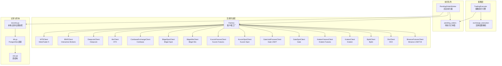
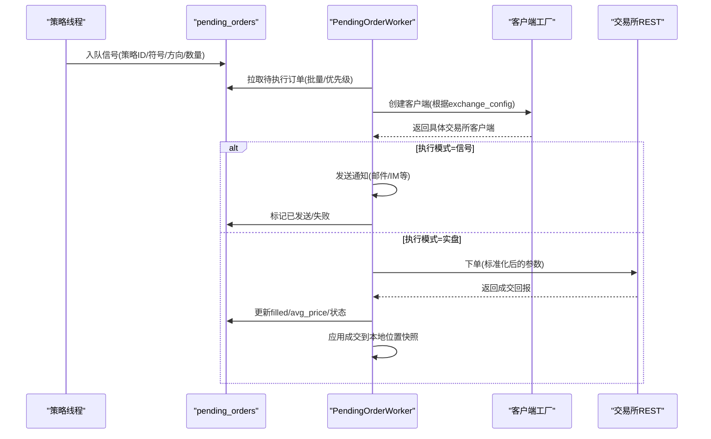
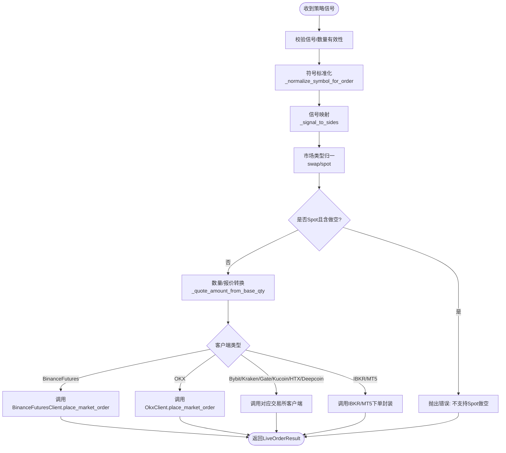
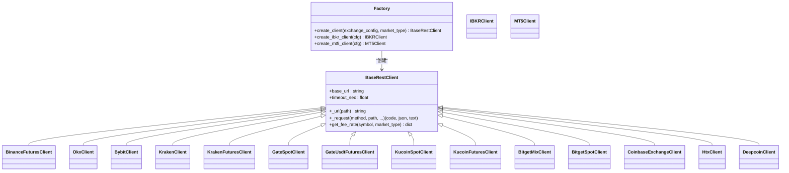
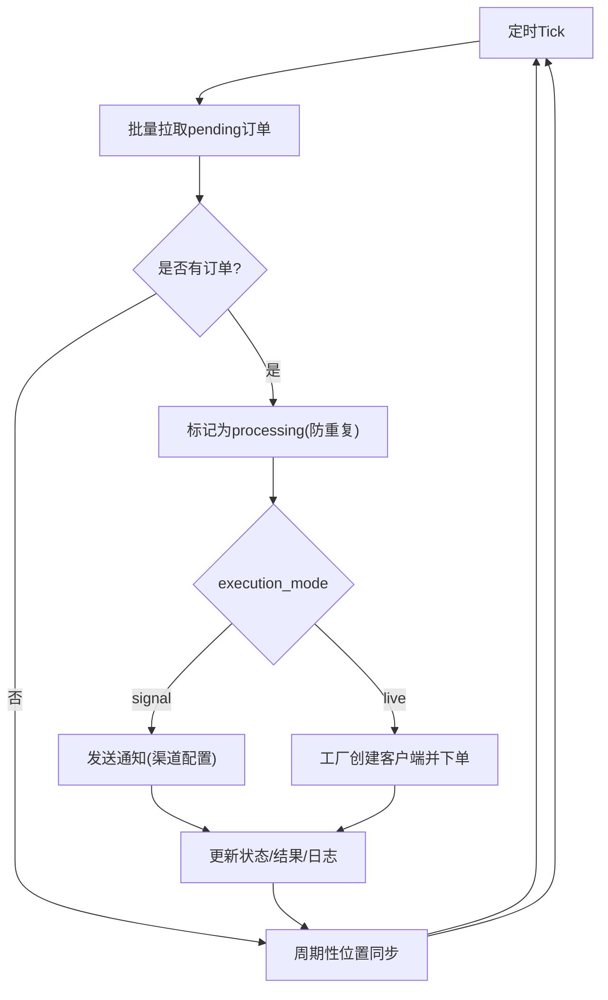
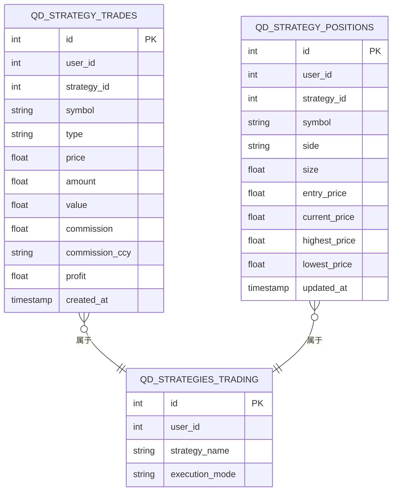
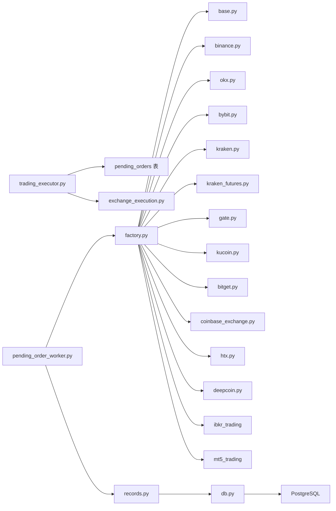

# 执行层集成机制

<cite>
**本文档引用的文件**
- [execution.py](file://backend_api_python/app/services/live_trading/execution.py)
- [factory.py](file://backend_api_python/app/services/live_trading/factory.py)
- [records.py](file://backend_api_python/app/services/live_trading/records.py)
- [exchange_execution.py](file://backend_api_python/app/services/exchange_execution.py)
- [pending_order_worker.py](file://backend_api_python/app/services/pending_order_worker.py)
- [trading_executor.py](file://backend_api_python/app/services/trading_executor.py)
- [base.py](file://backend_api_python/app/services/live_trading/base.py)
- [db.py](file://backend_api_python/app/utils/db.py)
- [init.sql](file://backend_api_python/migrations/init.sql)
- [binance.py](file://backend_api_python/app/services/live_trading/binance.py)
- [logger.py](file://backend_api_python/app/utils/logger.py)
</cite>

## 目录
1. [简介](#简介)
2. [项目结构](#项目结构)
3. [核心组件](#核心组件)
4. [架构总览](#架构总览)
5. [详细组件分析](#详细组件分析)
6. [依赖关系分析](#依赖关系分析)
7. [性能考虑](#性能考虑)
8. [故障排除指南](#故障排除指南)
9. [结论](#结论)

## 简介
本文件面向QuantDinger的执行层集成机制，系统性阐述统一执行层的设计与实现，覆盖以下主题：
- 订单路由与执行队列机制
- 跨交易所的订单标准化流程（价格精度、数量单位、时间格式）
- 执行记录的存储与查询（订单状态跟踪、历史数据管理）
- 性能监控与优化策略
- 异常处理与故障恢复
- 高并发场景下的稳定性最佳实践

执行层采用“策略信号入队 + 后台工作进程出队执行”的解耦架构，既支持信号通知模式（纸面交易），也支持真实交易模式（Live）。通过工厂模式与适配器模式，统一接入多家加密与传统市场。

## 项目结构
执行层相关代码主要分布在以下模块：
- live_trading子系统：统一REST客户端基类、各交易所适配器、订单路由与标准化、本地记录与位置快照
- pending_order_worker：轮询待执行订单队列，按执行模式派发
- trading_executor：策略执行引擎，负责生成信号、去重、入队
- exchange_execution：交换配置解析与安全日志
- 数据库迁移：定义pending_orders、策略日志、位置快照等核心表结构

**图示来源**
- [trading_executor.py:37-102](file://backend_api_python/app/services/trading_executor.py#L37-L102)
- [pending_order_worker.py:52-98](file://backend_api_python/app/services/pending_order_worker.py#L52-L98)
- [factory.py:59-218](file://backend_api_python/app/services/live_trading/factory.py#L59-L218)
- [records.py:85-184](file://backend_api_python/app/services/live_trading/records.py#L85-L184)
- [db.py:19-31](file://backend_api_python/app/utils/db.py#L19-L31)
- [init.sql:309-341](file://backend_api_python/migrations/init.sql#L309-L341)

**章节来源**
- [trading_executor.py:37-102](file://backend_api_python/app/services/trading_executor.py#L37-L102)
- [pending_order_worker.py:52-98](file://backend_api_python/app/services/pending_order_worker.py#L52-L98)
- [factory.py:59-218](file://backend_api_python/app/services/live_trading/factory.py#L59-L218)
- [records.py:85-184](file://backend_api_python/app/services/live_trading/records.py#L85-L184)
- [db.py:19-31](file://backend_api_python/app/utils/db.py#L19-L31)
- [init.sql:309-341](file://backend_api_python/migrations/init.sql#L309-L341)

## 核心组件
- 统一执行层入口：将策略信号转换为具体交易所的下单请求，负责跨交易所的参数标准化与路由
- 客户端工厂：根据配置动态创建不同交易所的REST客户端，支持加密/仿真/测试网
- 待执行订单队列：持久化的pending_orders表，承载所有待执行订单，支持优先级、重试与失败标记
- 后台执行器：周期性扫描队列，按执行模式（信号/实盘）进行派发
- 本地记录与位置快照：记录成交明细与本地持仓，支持最佳努力对齐与自愈
- 交换配置解析：合并策略配置与凭证密文，安全地输出日志

**章节来源**
- [execution.py:123-310](file://backend_api_python/app/services/live_trading/execution.py#L123-L310)
- [factory.py:59-218](file://backend_api_python/app/services/live_trading/factory.py#L59-L218)
- [pending_order_worker.py:637-800](file://backend_api_python/app/services/pending_order_worker.py#L637-L800)
- [records.py:85-184](file://backend_api_python/app/services/live_trading/records.py#L85-L184)
- [exchange_execution.py:118-148](file://backend_api_python/app/services/exchange_execution.py#L118-L148)

## 架构总览
执行层采用“策略线程 + 队列 + 后台工作进程”的三段式架构：
- 策略线程：计算信号、去重、入队
- 队列：pending_orders持久化存储，支持批量拉取与重试
- 后台工作进程：按执行模式派发，实盘模式通过工厂创建客户端并调用下单接口；信号模式发送通知

**图示来源**
- [trading_executor.py:775-800](file://backend_api_python/app/services/trading_executor.py#L775-L800)
- [pending_order_worker.py:107-122](file://backend_api_python/app/services/pending_order_worker.py#L107-L122)
- [pending_order_worker.py:712-799](file://backend_api_python/app/services/pending_order_worker.py#L712-L799)
- [factory.py:59-218](file://backend_api_python/app/services/live_trading/factory.py#L59-L218)

## 详细组件分析

### 统一执行层与订单路由
- 信号到订单映射：将策略信号类型（开多/加多/平多/减仓等）映射为交易所侧的side/pos_side/reduce_only
- 符号标准化：统一处理裸符号（如PI/USDT）、含后缀符号（如BTC/USDT:USDT）与大小写差异
- 数量与报价转换：针对部分交易所（如KuCoin/Gate/Bitget）在“买”方向下需要将基础币数量转换为报价金额
- 市场类型归一：将future/perp等统一为swap，spot保持不变
- 客户端路由：根据具体交易所类型调用对应客户端的下单方法

**图示来源**
- [execution.py:123-310](file://backend_api_python/app/services/live_trading/execution.py#L123-L310)
- [execution.py:41-82](file://backend_api_python/app/services/live_trading/execution.py#L41-L82)
- [execution.py:103-121](file://backend_api_python/app/services/live_trading/execution.py#L103-L121)
- [execution.py:313-366](file://backend_api_python/app/services/live_trading/execution.py#L313-L366)
- [execution.py:369-424](file://backend_api_python/app/services/live_trading/execution.py#L369-L424)

**章节来源**
- [execution.py:123-310](file://backend_api_python/app/services/live_trading/execution.py#L123-L310)
- [execution.py:41-82](file://backend_api_python/app/services/live_trading/execution.py#L41-L82)
- [execution.py:103-121](file://backend_api_python/app/services/live_trading/execution.py#L103-L121)
- [execution.py:313-366](file://backend_api_python/app/services/live_trading/execution.py#L313-L366)
- [execution.py:369-424](file://backend_api_python/app/services/live_trading/execution.py#L369-L424)

### 客户端工厂与多交易所适配
- 工厂职责：根据exchange_id与market_type选择合适的客户端；支持演示/仿真模式；延迟导入避免循环依赖
- 支持范围：Binance、OKX、Bitget、Bybit、Coinbase、Kraken、KuCoin、Gate、Deepcoin、HTX、IBKR、MT5
- 配置解析：统一提取api_key/secret/passphrase/base_url等参数，兼容多种键名
- 连接与校验：IBKR/MT5需即时连接；其他REST客户端按需创建

**图示来源**
- [factory.py:59-218](file://backend_api_python/app/services/live_trading/factory.py#L59-L218)
- [base.py:95-157](file://backend_api_python/app/services/live_trading/base.py#L95-L157)
- [binance.py:24-50](file://backend_api_python/app/services/live_trading/binance.py#L24-L50)

**章节来源**
- [factory.py:59-218](file://backend_api_python/app/services/live_trading/factory.py#L59-L218)
- [base.py:95-157](file://backend_api_python/app/services/live_trading/base.py#L95-L157)
- [binance.py:24-50](file://backend_api_python/app/services/live_trading/binance.py#L24-L50)

### 待执行订单队列与后台执行器
- 队列模型：pending_orders表，支持优先级、重试次数、状态（pending/processing/sent/failed/deferred）
- 扫描与去重：后台工作进程周期扫描，批量拉取并标记为processing；对同一蜡烛信号进行去重
- 执行模式：signal模式仅发送通知；live模式通过工厂创建客户端并执行下单
- 故障恢复：对长时间处于processing的订单进行自动requeue，避免死锁

**图示来源**
- [pending_order_worker.py:91-122](file://backend_api_python/app/services/pending_order_worker.py#L91-L122)
- [pending_order_worker.py:637-711](file://backend_api_python/app/services/pending_order_worker.py#L637-L711)
- [pending_order_worker.py:712-799](file://backend_api_python/app/services/pending_order_worker.py#L712-L799)

**章节来源**
- [pending_order_worker.py:91-122](file://backend_api_python/app/services/pending_order_worker.py#L91-L122)
- [pending_order_worker.py:637-711](file://backend_api_python/app/services/pending_order_worker.py#L637-L711)
- [pending_order_worker.py:712-799](file://backend_api_python/app/services/pending_order_worker.py#L712-L799)

### 本地记录与位置快照
- 交易记录：将成交明细写入qd_strategy_trades，包含用户ID、策略ID、符号、类型、价格、数量、价值、手续费等
- 位置快照：以策略+符号+方向为键，维护本地持仓size、entry_price、最高/最低价；支持ON CONFLICT更新
- 成交应用：根据信号类型（开仓/加仓/平仓/减仓）更新本地快照，计算平仓收益（基于本地entry_price）

**图示来源**
- [records.py:85-184](file://backend_api_python/app/services/live_trading/records.py#L85-L184)
- [init.sql:309-341](file://backend_api_python/migrations/init.sql#L309-L341)
- [init.sql:370-379](file://backend_api_python/migrations/init.sql#L370-L379)

**章节来源**
- [records.py:85-184](file://backend_api_python/app/services/live_trading/records.py#L85-L184)
- [init.sql:309-341](file://backend_api_python/migrations/init.sql#L309-L341)
- [init.sql:370-379](file://backend_api_python/migrations/init.sql#L370-L379)

### 交换配置解析与安全日志
- 配置合并：支持直接内联配置与凭证引用两种方式；凭证通过密文解密后与策略配置叠加
- 安全日志：对敏感字段（api_key/secret/passphrase）进行掩码输出
- 策略配置加载：一次性读取策略的exchange_config、trading_config、execution_mode、market_type等

**章节来源**
- [exchange_execution.py:118-148](file://backend_api_python/app/services/exchange_execution.py#L118-L148)
- [exchange_execution.py:59-92](file://backend_api_python/app/services/exchange_execution.py#L59-L92)

## 依赖关系分析
- 组件耦合
  - trading_executor与pending_order_worker通过数据库表进行松耦合
  - pending_order_worker依赖factory创建具体交易所客户端
  - records依赖db工具访问PostgreSQL
- 外部依赖
  - PostgreSQL作为持久化存储
  - 各交易所REST API（通过BaseRestClient及其子类）
  - 可选：IBKR/MT5客户端（延迟导入）

**图示来源**
- [trading_executor.py:37-102](file://backend_api_python/app/services/trading_executor.py#L37-L102)
- [pending_order_worker.py:52-98](file://backend_api_python/app/services/pending_order_worker.py#L52-L98)
- [factory.py:17-38](file://backend_api_python/app/services/live_trading/factory.py#L17-L38)
- [records.py:14-14](file://backend_api_python/app/services/live_trading/records.py#L14-L14)
- [db.py:19-31](file://backend_api_python/app/utils/db.py#L19-L31)

**章节来源**
- [trading_executor.py:37-102](file://backend_api_python/app/services/trading_executor.py#L37-L102)
- [pending_order_worker.py:52-98](file://backend_api_python/app/services/pending_order_worker.py#L52-L98)
- [factory.py:17-38](file://backend_api_python/app/services/live_trading/factory.py#L17-L38)
- [records.py:14-14](file://backend_api_python/app/services/live_trading/records.py#L14-L14)
- [db.py:19-31](file://backend_api_python/app/utils/db.py#L19-L31)

## 性能考虑
- 线程与资源限制
  - 策略线程上限通过环境变量控制，避免无限制创建导致“can't start new thread”或内存溢出
  - 内存与线程状态打印辅助定位资源瓶颈
- 缓存与去重
  - 价格缓存（内存）与信号去重（按策略+符号+信号+时间戳）降低重复下单与查询压力
  - 交易所费用缓存（按策略ID）减少重复查询
- 数据库访问
  - 连接池化与按需获取连接，避免长连接占用
  - 位置同步按间隔触发，避免高频查询
- 交易所API
  - Binance等客户端内置过滤缓存与时间偏移校正，减少无效请求
  - 数量/价格格式化严格遵循交易所步进与精度要求，避免下单失败

**章节来源**
- [trading_executor.py:40-68](file://backend_api_python/app/services/trading_executor.py#L40-L68)
- [trading_executor.py:233-289](file://backend_api_python/app/services/trading_executor.py#L233-L289)
- [binance.py:36-49](file://backend_api_python/app/services/live_trading/binance.py#L36-L49)

## 故障排除指南
- 常见错误与处理
  - 无效信号/数量：抛出LiveTradingError，阻止非法下单
  - 不支持的信号类型：如Spot做空、未知信号类型
  - 客户端类型不支持：抛出错误提示
  - 交易所连接失败：IBKR/MT5需检查终端/账户配置
- 日志与可观测性
  - 统一日志配置，支持文件滚动与级别过滤
  - 策略运行日志通过专用表记录，便于前端查看
- 自愈与恢复
  - pending_orders中processing超时自动requeue，避免死锁
  - 位置同步定期比对本地与交易所，删除“幽灵持仓”，更新尺寸与入场价
  - 信号去重避免同一蜡烛重复下单

**章节来源**
- [execution.py:100-101](file://backend_api_python/app/services/live_trading/execution.py#L100-L101)
- [pending_order_worker.py:640-683](file://backend_api_python/app/services/pending_order_worker.py#L640-L683)
- [pending_order_worker.py:138-137](file://backend_api_python/app/services/pending_order_worker.py#L138-L137)
- [logger.py:9-33](file://backend_api_python/app/utils/logger.py#L9-L33)

## 结论
QuantDinger的执行层通过“信号入队 + 后台执行 + 多交易所适配”的架构，实现了跨市场的统一执行能力。其关键优势在于：
- 统一的订单标准化流程，确保价格精度、数量单位与时间格式在多交易所间一致
- 健壮的队列与执行器，支持信号与实盘双模式，具备完善的去重、重试与自愈能力
- 本地记录与位置快照，保障UI显示与策略状态的可用性
- 良好的性能与稳定性设计，适合高并发场景

建议在生产环境中：
- 明确配置与凭证管理，启用SSL证书校验
- 合理设置线程上限与队列批大小
- 定期审查位置同步策略，确保与交易所实际持仓一致
- 建立完善的监控与告警，关注订单失败率与延迟