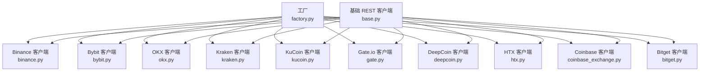
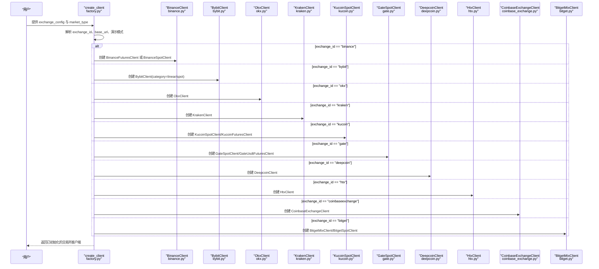
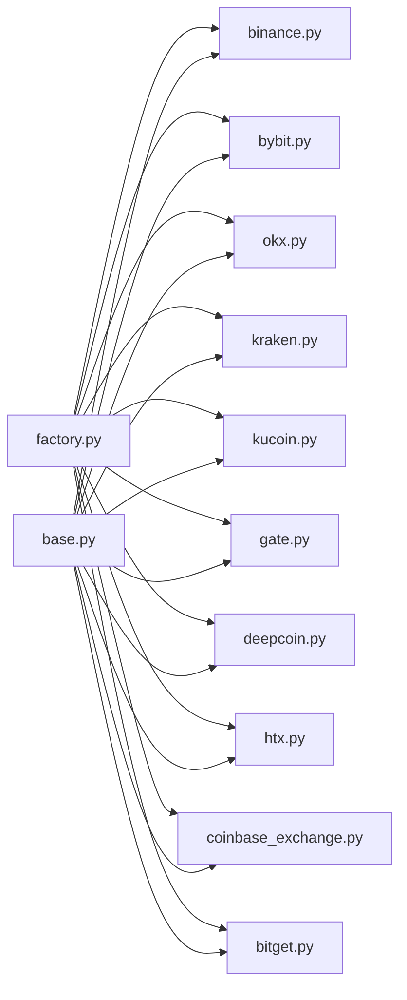

# 支持的交易所列表

<cite>
**本文档引用的文件**
- [factory.py](file://backend_api_python/app/services/live_trading/factory.py)
- [base.py](file://backend_api_python/app/services/live_trading/base.py)
- [binance.py](file://backend_api_python/app/services/live_trading/binance.py)
- [bybit.py](file://backend_api_python/app/services/live_trading/bybit.py)
- [okx.py](file://backend_api_python/app/services/live_trading/okx.py)
- [kraken.py](file://backend_api_python/app/services/live_trading/kraken.py)
- [kucoin.py](file://backend_api_python/app/services/live_trading/kucoin.py)
- [gate.py](file://backend_api_python/app/services/live_trading/gate.py)
- [deepcoin.py](file://backend_api_python/app/services/live_trading/deepcoin.py)
- [htx.py](file://backend_api_python/app/services/live_trading/htx.py)
- [coinbase_exchange.py](file://backend_api_python/app/services/live_trading/coinbase_exchange.py)
- [bitget.py](file://backend_api_python/app/services/live_trading/bitget.py)
</cite>

## 目录
1. [简介](#简介)
2. [项目结构](#项目结构)
3. [核心组件](#核心组件)
4. [架构总览](#架构总览)
5. [详细组件分析](#详细组件分析)
6. [依赖关系分析](#依赖关系分析)
7. [性能考虑](#性能考虑)
8. [故障排除指南](#故障排除指南)
9. [结论](#结论)

## 简介
本文件为 QuantDinger 支持的交易所提供全面、可操作的参考文档。内容覆盖以下交易所：Binance、Bybit、OKX、Kraken、KuCoin、Gate.io、HTX、DeepCoin、Coinbase、Bitget。针对每个交易所，文档说明其特点、支持的交易对类型、认证方式与连接参数、API 限制与特殊配置、数据获取能力、费率结构与最小交易量限制，并提供选择建议与常见问题排查方法。

## 项目结构
QuantDinger 的“实盘交易”模块采用工厂模式统一创建各交易所客户端，核心入口位于工厂文件中；每个交易所均实现独立的客户端类，继承基础 REST 客户端以复用通用请求与错误处理逻辑。

图表来源
- [factory.py:59-218](file://backend_api_python/app/services/live_trading/factory.py#L59-L218)
- [base.py:95-157](file://backend_api_python/app/services/live_trading/base.py#L95-L157)

章节来源
- [factory.py:1-355](file://backend_api_python/app/services/live_trading/factory.py#L1-L355)
- [base.py:1-158](file://backend_api_python/app/services/live_trading/base.py#L1-L158)

## 核心组件
- 工厂函数 create_client：根据 exchange_id 与市场类型（如 swap/spot）创建对应交易所客户端实例，负责解析配置、选择 baseURL、处理演示模式与特殊参数（如 Bybit 的 recvWindow、Gate 的 channel_id 等）。
- 基础客户端 BaseRestClient：封装通用 HTTP 请求、签名参数解析、SSL 验证策略、时间戳与重试辅助逻辑，为各交易所客户端提供一致的基础设施。

章节来源
- [factory.py:59-218](file://backend_api_python/app/services/live_trading/factory.py#L59-L218)
- [base.py:95-157](file://backend_api_python/app/services/live_trading/base.py#L95-L157)

## 架构总览
下图展示工厂到具体交易所客户端的创建流程与关键参数映射：

图表来源
- [factory.py:59-218](file://backend_api_python/app/services/live_trading/factory.py#L59-L218)

章节来源
- [factory.py:59-218](file://backend_api_python/app/services/live_trading/factory.py#L59-L218)

## 详细组件分析

### Binance（USDT-M 永续）
- 特点
  - 支持 USDT-M 永续合约与现货；提供深度价格与过滤器缓存，严格按步进与精度格式化下单参数。
  - 内置服务器时间同步与签名头，自动处理时钟偏移导致的 -1021 错误。
- 支持的交易对类型
  - 永续合约（swap）、现货（spot）。
- 认证与连接参数
  - 必需：api_key、secret_key；可选：base_url（默认生产）、enable_demo_trading（沙盒）、broker_id（用于前缀化 client_order_id）。
- API 限制与特殊配置
  - 通过 _sym_filter_cache 缓存 exchangeInfo 中的过滤器（LOT_SIZE/PRICE_FILTER 等），减少重复请求。
  - 支持设置杠杆、查询账户余额、用户成交记录、手续费率等。
- 数据获取能力
  - 获取标记价格、账户信息、用户成交、订单状态轮询、手续费率查询。
- 费率结构与最小交易量
  - 可通过 commissionRate 接口查询；最小下单量与精度由过滤器决定。
- 最佳实践
  - 使用 _normalize_quantity/_normalize_price 保证精度与步进合规；在 hedge 模式下显式 positionSide。

章节来源
- [binance.py:24-507](file://backend_api_python/app/services/live_trading/binance.py#L24-L507)

### Bybit（v5）
- 特点
  - v5 接口统一，支持线性永续与现货；严格校验本地时间与服务器时间差（retCode 10002）。
  - 支持多级缓存（instrument metadata、时间偏移）提升性能。
- 支持的交易对类型
  - 线性永续（linear）、现货（spot）。
- 认证与连接参数
  - 必需：api_key、secret_key；可选：base_url、category（linear/spot）、recv_window_ms、broker_referer、hedge_mode。
- API 限制与特殊配置
  - 时间同步：_time_offset_ms 与 _time_sync_ttl_sec 控制重试与刷新。
  - 位置模式：hedge_mode 影响 positionIdx 与 reduceOnly 字段。
- 数据获取能力
  - 获取行情、账户余额、订单查询、仓位查询、手续费率、设置杠杆。
- 费率结构与最小交易量
  - 通过 fee-rate 查询；数量与价格精度由 instrument info 的 qtyStep/priceFilter 决定。
- 最佳实践
  - 设置合适的 recv_window_ms（5–60 秒）；在 hedge 模式下正确传递 positionIdx。

章节来源
- [bybit.py:27-747](file://backend_api_python/app/services/live_trading/bybit.py#L27-L747)

### OKX（永续）
- 特点
  - 支持 SPOT/ SWAP；提供模拟交易开关；严格处理权限错误与保证金不足等错误码。
  - 支持账户配置缓存（posMode、leverage）避免频繁设置。
- 支持的交易对类型
  - 现货（SPOT）、永续（SWAP）。
- 认证与连接参数
  - 必需：api_key、secret_key、passphrase；可选：base_url、broker_code、simulated_trading。
- API 限制与特殊配置
  - 位置模式兼容：net_mode 与 long_short_mode 的 posSide 差异。
  - 杠杆设置带缓存，避免重复调用。
- 数据获取能力
  - 获取账户余额、手续费率、仓位、设置杠杆、下单、撤单、查询成交明细。
- 费率结构与最小交易量
  - 通过 trade-fee 查询；现货与永续的 lotSz/minSz 不同。
- 最佳实践
  - 在 long_short_mode 下必须指定 posSide；注意模拟交易与真实交易的差异。

章节来源
- [okx.py:25-800](file://backend_api_python/app/services/live_trading/okx.py#L25-L800)

### Kraken（现货）
- 特点
  - 仅支持现货；使用 HMAC-SHA512 签名；私有接口统一 POST。
- 支持的交易对类型
  - 现货（spot）。
- 认证与连接参数
  - 必需：api_key、secret_key（需 base64 解码）；可选：base_url。
- API 限制与特殊配置
  - nonce 严格递增；错误响应包含错误数组。
- 数据获取能力
  - 获取账户余额、下单（市价/限价）、撤单、查询订单、轮询成交。
- 费率结构与最小交易量
  - 未在代码中直接暴露费率接口；最小交易量与精度由交易对规则决定。
- 最佳实践
  - 正确构造 AddOrder 请求体与签名；注意 fee 字段单位。

章节来源
- [kraken.py:26-193](file://backend_api_python/app/services/live_trading/kraken.py#L26-L193)

### KuCoin（现货/USDT 永续）
- 特点
  - v2 签名；spot 与 futures 使用不同 base_url；futures 订单大小通常以“合约数”表示，需要从“基础币数量”转换。
- 支持的交易对类型
  - 现货（spot）、USDT 永续（futures）。
- 认证与连接参数
  - 必需：api_key、secret_key、passphrase；可选：base_url（spot/futures 分别默认）。
- API 限制与特殊配置
  - futures 合约元数据缓存；multiplier/lotSize 用于 base 到 contracts 的换算。
- 数据获取能力
  - 现货：下单、撤单、查询、成交明细；永续：账户、仓位、下单、撤单、查询、轮询。
- 费率结构与最小交易量
  - spot 通过 wallet/fee 查询；futures 通过合约详情查询；最小下单量与精度来自合约元数据。
- 最佳实践
  - 买入市价单时，size 表示资金总额（quote_size=True）；卖出市价单 size 表示基础币数量。

章节来源
- [kucoin.py:24-538](file://backend_api_python/app/services/live_trading/kucoin.py#L24-L538)

### Gate.io（现货/USDT 永续）
- 特点
  - v4 签名；USDT 永续支持小数合约下单（通过 X-Gate-Size-Decimal 头部）；合约元数据缓存。
- 支持的交易对类型
  - 现货（spot）、USDT 永续（futures）。
- 认证与连接参数
  - 必需：api_key、secret_key；可选：base_url、channel_id。
- API 限制与特殊配置
  - 小数合约下单需满足 order_size_min 的精度；通过 X-Gate-Size-Decimal 头部启用。
- 数据获取能力
  - 现货：下单、撤单、查询、轮询；永续：账户、仓位、下单、撤单、查询、轮询。
- 费率结构与最小交易量
  - 通过 wallet/fee 或 futures 合约详情查询；最小下单量与精度来自合约元数据。
- 最佳实践
  - 使用 _resolve_order_size 自动推导 size 字符串与是否需要小数头部。

章节来源
- [gate.py:55-592](file://backend_api_python/app/services/live_trading/gate.py#L55-L592)

### HTX（火币）
- 特点
  - 支持现货与 USDT 永续；多账户类型检测与切换；多端点回退策略（隔离/全仓）。
  - 对多资产保证金模式（联合保证金）进行兼容处理与错误提示。
- 支持的交易对类型
  - 现货（spot）、USDT 永续（swap）。
- 认证与连接参数
  - 必需：api_key、secret_key；可选：base_url（现货）、futures_base_url（永续）、market_type（swap/spot）、broker_id。
- API 限制与特殊配置
  - 账户类型检测与切换；杠杆设置带缓存；多端点回退以适配不同账户状态。
- 数据获取能力
  - 现货：账户、下单、撤单、查询；永续：账户、仓位、下单、撤单、查询、轮询。
- 费率结构与最小交易量
  - 通过合约信息与账户接口查询；最小下单量与精度来自合约元数据。
- 最佳实践
  - 在联合保证金模式下无法下单，需切换至单币种保证金；合理设置 client_order_id 格式。

章节来源
- [htx.py:30-799](file://backend_api_python/app/services/live_trading/htx.py#L30-L799)

### DeepCoin
- 特点
  - 支持现货与 USDT 永续；自定义签名算法（HMAC-SHA256）；提供 instrument 元数据缓存与杠杆设置缓存。
- 支持的交易对类型
  - 现货（spot）、USDT 永续（swap）。
- 认证与连接参数
  - 必需：api_key、secret_key；可选：base_url、market_type（swap/spot）、passphrase。
- API 限制与特殊配置
  - 通过 _inst_cache 与 _lev_cache 减少重复请求；支持 set_leverage 缓存。
- 数据获取能力
  - 账户、仓位、下单、撤单、查询、历史与待执行订单、轮询。
- 费率结构与最小交易量
  - 通过 instrument 与 trade 接口查询；最小下单量与精度来自合约元数据。
- 最佳实践
  - 注意 DC-ACCESS-* 头部与签名顺序；在 swap 模式下正确传入 posSide。

章节来源
- [deepcoin.py:31-739](file://backend_api_python/app/services/live_trading/deepcoin.py#L31-L739)

### Coinbase（现货）
- 特点
  - 使用 CB-ACCESS-* 头部签名；仅支持现货；GET 参数需纳入签名路径。
- 支持的交易对类型
  - 现货（spot）。
- 认证与连接参数
  - 必需：api_key、secret_key、passphrase；可选：base_url。
- API 限制与特殊配置
  - 签名需包含查询字符串；错误响应包含状态码与消息。
- 数据获取能力
  - 账户、下单、撤单、查询、轮询。
- 费率结构与最小交易量
  - 未在代码中直接暴露费率接口；最小交易量与精度由产品规则决定。
- 最佳实践
  - 确保签名路径与实际请求参数一致；注意 fee 字段单位。

章节来源
- [coinbase_exchange.py:23-209](file://backend_api_python/app/services/live_trading/coinbase_exchange.py#L23-L209)

### Bitget（USDT 永续）
- 特点
  - v2 mix 接口统一；支持 hedge_mode 与 one_way_mode；feeDetail 支持多条目汇总。
  - 支持通道 API Code（X-CHANNEL-API-CODE）在下单路径上。
- 支持的交易对类型
  - USDT 永续（USDT-FUTURES）。
- 认证与连接参数
  - 必需：api_key、secret_key、passphrase；可选：base_url、channel_api_code、simulated_trading。
- API 限制与特殊配置
  - 位置模式缓存；set-leverage 带缓存；hedge vs one-way 模式下单字段差异。
- 数据获取能力
  - 账户、仓位、手续费率、设置杠杆、下单、撤单、查询、轮询。
- 费率结构与最小交易量
  - 通过 trade-rate 查询；size 与 price 精度来自合约元数据。
- 最佳实践
  - 在 hedge_mode 下正确传递 tradeSide/open/close 与 side；在 one_way_mode 下使用 reduceOnly。

章节来源
- [bitget.py:26-800](file://backend_api_python/app/services/live_trading/bitget.py#L26-L800)

## 依赖关系分析
- 工厂与客户端
  - 工厂根据 exchange_id 动态导入并创建对应客户端；客户端均继承 BaseRestClient，共享请求与签名基础设施。
- 依赖链
  - factory.py 依赖各交易所客户端模块；
  - 各交易所客户端依赖 base.py 的 BaseRestClient；
  - 部分交易所客户端依赖符号规范化工具（如 to_binance_futures_symbol、to_bybit_symbol 等）。

图表来源
- [factory.py:18-30](file://backend_api_python/app/services/live_trading/factory.py#L18-L30)
- [base.py:95-157](file://backend_api_python/app/services/live_trading/base.py#L95-L157)

章节来源
- [factory.py:18-30](file://backend_api_python/app/services/live_trading/factory.py#L18-L30)
- [base.py:95-157](file://backend_api_python/app/services/live_trading/base.py#L95-L157)

## 性能考虑
- 缓存策略
  - 多数交易所客户端内置缓存（如 Binance 的 symbol filters、Bybit 的 instrument 信息、OKX 的账户配置、HTX 的合约信息与杠杆设置、DeepCoin 的 instrument 与杠杆设置、Gate 的合约元数据、Bitget 的合约与杠杆设置、KuCoin 的合约元数据等），显著降低重复请求次数。
- 时间同步
  - Binance、Bybit、OKX、HTX、DeepCoin、Bitget 等均提供时间同步或服务器时间对齐机制，避免因时钟偏差导致的签名失败。
- 并发与重试
  - 工厂与基础客户端提供统一的超时与 SSL 验证策略；部分客户端在特定错误码（如 Binance -1021、Bybit 10002）时自动重试。

## 故障排除指南
- 常见错误与定位
  - Binance：-1021 时钟偏移；通过 _ensure_server_time 强制刷新时间后重试。
  - Bybit：retCode 10002 时钟偏差；通过 _time_offset_ms 与 _time_sync_ttl_sec 控制重试。
  - OKX：50120 权限错误（需开启 Trade 权限）；51008 保证金不足（需增加 USDT 保证金）。
  - HTX：多资产保证金模式（联合保证金）导致无法下单；需切换至单币种保证金。
  - Kraken：私有接口仅支持 POST；secret_key 需 base64 解码。
  - KuCoin：futures 订单 size 通常为合约数，需从基础币数量换算；注意 funds 与 size 的区别。
  - Gate：USDT 永续小数合约下单需 X-Gate-Size-Decimal 头部；order_size_min 决定精度。
  - Coinbase：GET 参数需纳入签名路径；错误响应包含状态码与消息。
  - Bitget：hedge_mode 与 one_way_mode 的下单字段差异；feeDetail 可能为列表需汇总。
- SSL 与证书
  - 基础客户端支持 LIVE_TRADING_SSL_VERIFY 与 LIVE_TRADING_CA_BUNDLE 环境变量控制证书验证；在代理或企业 TLS 检查场景下建议设置 CA 包路径。

章节来源
- [binance.py:173-236](file://backend_api_python/app/services/live_trading/binance.py#L173-L236)
- [bybit.py:202-297](file://backend_api_python/app/services/live_trading/bybit.py#L202-L297)
- [okx.py:337-383](file://backend_api_python/app/services/live_trading/okx.py#L337-L383)
- [htx.py:234-276](file://backend_api_python/app/services/live_trading/htx.py#L234-L276)
- [kraken.py:51-73](file://backend_api_python/app/services/live_trading/kraken.py#L51-L73)
- [kucoin.py:134-159](file://backend_api_python/app/services/live_trading/kucoin.py#L134-L159)
- [gate.py:322-374](file://backend_api_python/app/services/live_trading/gate.py#L322-L374)
- [coinbase_exchange.py:62-78](file://backend_api_python/app/services/live_trading/coinbase_exchange.py#L62-L78)
- [bitget.py:304-314](file://backend_api_python/app/services/live_trading/bitget.py#L304-L314)
- [base.py:34-79](file://backend_api_python/app/services/live_trading/base.py#L34-L79)

## 结论
QuantDinger 对主流加密货币交易所提供了统一且健壮的客户端接入层，通过工厂模式与标准化的认证与请求流程，简化了多交易所集成与运维复杂度。各交易所客户端在精度控制、缓存策略、时间同步与错误处理方面各有侧重，用户可根据自身需求（如交易对类型、手续费结构、最小交易量、稳定性与合规要求）选择最适合的交易所。建议在生产环境中优先启用缓存与时间同步功能，并根据交易所特性正确配置认证参数与特殊选项。