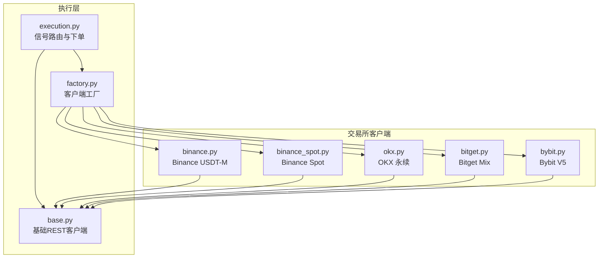
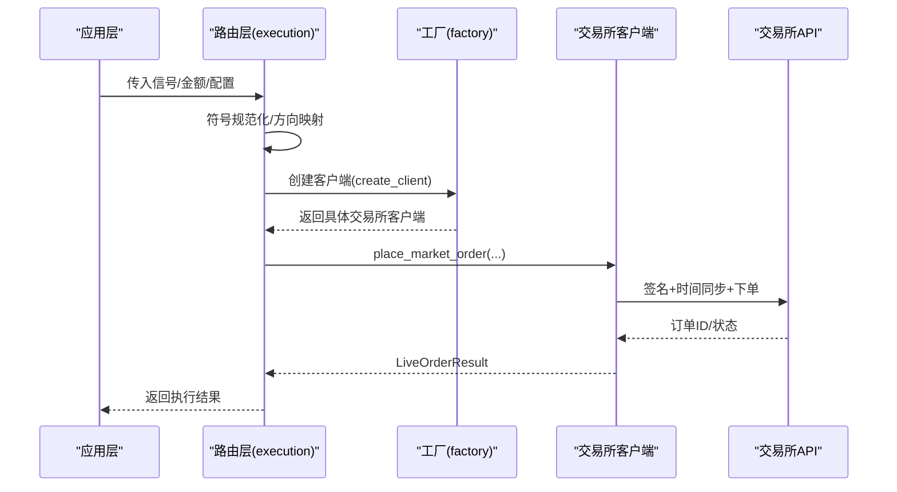
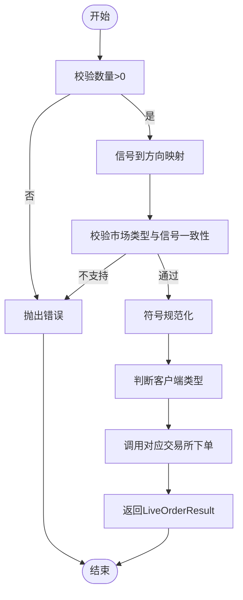
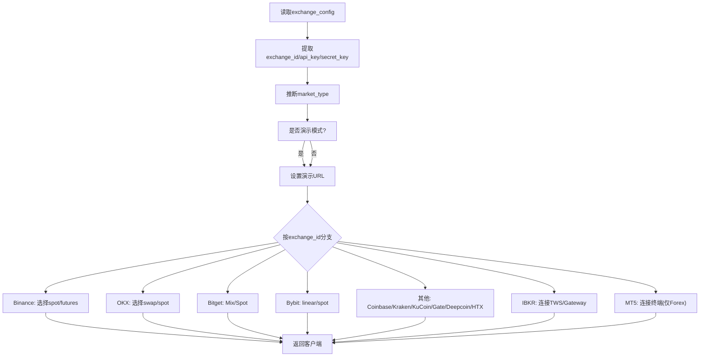
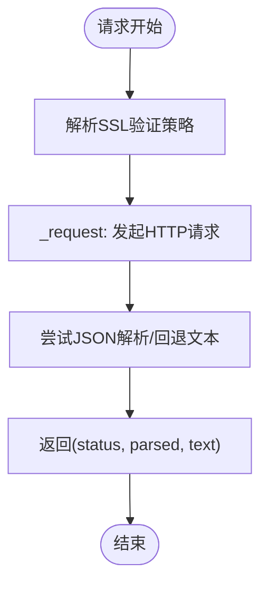
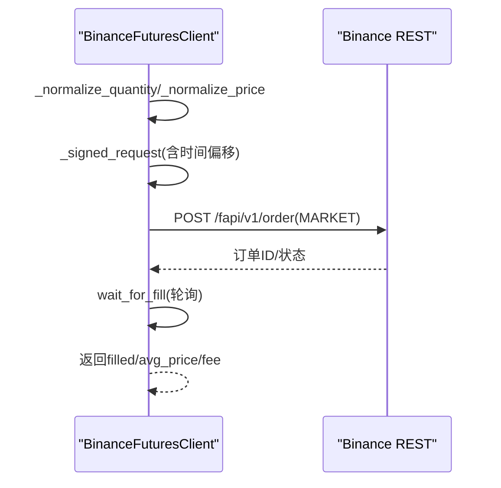
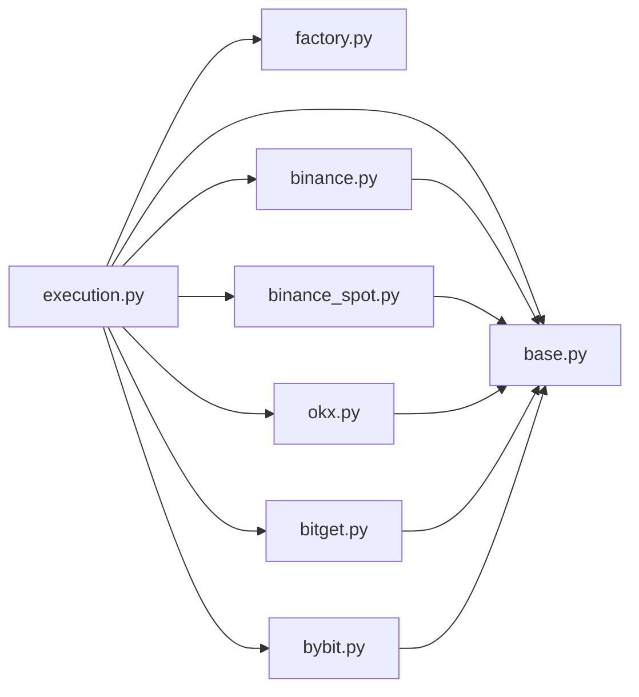

# 实时交易执行

<cite>
**本文引用的文件**
- [execution.py](file://backend_api_python/app/services/live_trading/execution.py)
- [factory.py](file://backend_api_python/app/services/live_trading/factory.py)
- [base.py](file://backend_api_python/app/services/live_trading/base.py)
- [binance.py](file://backend_api_python/app/services/live_trading/binance.py)
- [binance_spot.py](file://backend_api_python/app/services/live_trading/binance_spot.py)
- [okx.py](file://backend_api_python/app/services/live_trading/okx.py)
- [bitget.py](file://backend_api_python/app/services/live_trading/bitget.py)
- [bybit.py](file://backend_api_python/app/services/live_trading/bybit.py)
</cite>

## 目录
1. [简介](#简介)
2. [项目结构](#项目结构)
3. [核心组件](#核心组件)
4. [架构总览](#架构总览)
5. [详细组件分析](#详细组件分析)
6. [依赖关系分析](#依赖关系分析)
7. [性能考量](#性能考量)
8. [故障排查指南](#故障排查指南)
9. [结论](#结论)
10. [附录：交易配置示例](#附录交易配置示例)

## 简介
本文件面向QuantDinger的实时交易执行系统，聚焦“订单路由、执行算法与风险控制”的整体设计，覆盖多交易所（加密与传统）的集成方式、数据格式转换、API调用与错误处理策略，并给出挂单处理器的工作原理与执行队列管理思路。同时提供可直接落地的交易配置示例，涵盖资金管理、止损止盈、仓位控制与批量下单等关键能力。

## 项目结构
QuantDinger后端在“实时交易”模块下提供了统一的“信号到订单”的执行层，以及针对各交易所的直连客户端。核心文件组织如下：
- 执行入口与路由：execution.py
- 客户端工厂：factory.py
- 基类与通用工具：base.py
- 各交易所直连客户端：binance.py、binance_spot.py、okx.py、bitget.py、bybit.py

图表来源
- [execution.py:123-311](file://backend_api_python/app/services/live_trading/execution.py#L123-L311)
- [factory.py:59-218](file://backend_api_python/app/services/live_trading/factory.py#L59-L218)
- [base.py:95-157](file://backend_api_python/app/services/live_trading/base.py#L95-L157)

章节来源
- [execution.py:1-426](file://backend_api_python/app/services/live_trading/execution.py#L1-L426)
- [factory.py:1-355](file://backend_api_python/app/services/live_trading/factory.py#L1-L355)
- [base.py:1-158](file://backend_api_python/app/services/live_trading/base.py#L1-L158)

## 核心组件
- 信号到订单的统一入口：根据信号类型、金额、市场类型与交易所配置，选择具体交易所客户端并调用下单接口，返回标准化的LiveOrderResult。
- 客户端工厂：依据exchange_config自动创建对应交易所的直连客户端，支持多交易所、多市场类型（现货/永续）与演示模式。
- 基础REST客户端：封装HTTP请求、签名、时间同步、错误解析与SSL验证策略，为各交易所客户端提供一致的基础设施。

章节来源
- [execution.py:123-311](file://backend_api_python/app/services/live_trading/execution.py#L123-L311)
- [factory.py:59-218](file://backend_api_python/app/services/live_trading/factory.py#L59-L218)
- [base.py:95-157](file://backend_api_python/app/services/live_trading/base.py#L95-L157)

## 架构总览
执行链路自上而下分为三层：
- 应用层：接收策略信号与交易配置，调用下单入口。
- 路由层：将信号映射为交易所侧的参数，完成符号规范化、方向与开平仓语义转换。
- 执行层：通过工厂创建客户端，按交易所规范构造请求，签名与时间同步，提交订单并等待成交反馈。

图表来源
- [execution.py:123-311](file://backend_api_python/app/services/live_trading/execution.py#L123-L311)
- [factory.py:59-218](file://backend_api_python/app/services/live_trading/factory.py#L59-L218)
- [binance.py:735-800](file://backend_api_python/app/services/live_trading/binance.py#L735-L800)
- [okx.py:551-617](file://backend_api_python/app/services/live_trading/okx.py#L551-L617)
- [bitget.py:713-766](file://backend_api_python/app/services/live_trading/bitget.py#L713-L766)
- [bybit.py:509-547](file://backend_api_python/app/services/live_trading/bybit.py#L509-L547)

## 详细组件分析

### 组件A：信号路由与下单入口（execution）
- 功能要点
  - 将策略信号（如开多、平多等）映射为交易所侧的side/pos_side/reduce_only。
  - 对symbol进行统一规范化，兼容多种输入格式。
  - 根据market_type（swap/spot）与exchange_config决定下单路径。
  - 针对不同交易所客户端调用对应的下单方法，最终返回LiveOrderResult。
- 关键流程
  - 信号到方向映射：_signal_to_sides
  - 符号规范化：_normalize_symbol_for_order
  - 下单入口：place_order_from_signal
  - 特殊处理：IBKR/MT5的专用下单逻辑

图表来源
- [execution.py:85-101](file://backend_api_python/app/services/live_trading/execution.py#L85-L101)
- [execution.py:41-83](file://backend_api_python/app/services/live_trading/execution.py#L41-L83)
- [execution.py:123-311](file://backend_api_python/app/services/live_trading/execution.py#L123-L311)

章节来源
- [execution.py:1-426](file://backend_api_python/app/services/live_trading/execution.py#L1-L426)

### 组件B：客户端工厂（factory）
- 功能要点
  - 从exchange_config中提取必要字段，创建对应交易所客户端实例。
  - 支持多交易所与多市场类型（spot/swap），并处理演示模式与URL覆盖。
  - 提供查询手续费费率的便捷方法。
- 关键流程
  - 解析exchange_id/api_key/secret_key/passphrase/base_url等配置。
  - 根据exchange_id与market_type选择具体客户端构造函数。
  - 对IBKR/MT5进行额外校验与连接。

图表来源
- [factory.py:59-218](file://backend_api_python/app/services/live_trading/factory.py#L59-L218)
- [factory.py:221-335](file://backend_api_python/app/services/live_trading/factory.py#L221-L335)

章节来源
- [factory.py:1-355](file://backend_api_python/app/services/live_trading/factory.py#L1-L355)

### 组件C：基础REST客户端（base）
- 功能要点
  - 统一封装HTTP请求、超时、SSL验证策略（支持系统证书、PEM文件、禁用校验等）。
  - 提供统一的错误包装与日志记录。
  - 提供LiveOrderResult/LiveTradingError等通用类型。
- 关键流程
  - _get_requests_verify：解析LIVE_TRADING_SSL_VERIFY/CA_BUNDLE等环境变量，确定verify参数。
  - _request：发起请求，解析JSON或回退文本，返回状态码、解析结果与原始文本。
  - _now_ms/_json_dumps：提供毫秒时间戳与JSON序列化工具。

图表来源
- [base.py:34-79](file://backend_api_python/app/services/live_trading/base.py#L34-L79)
- [base.py:106-143](file://backend_api_python/app/services/live_trading/base.py#L106-L143)

章节来源
- [base.py:1-158](file://backend_api_python/app/services/live_trading/base.py#L1-L158)

### 组件D：Binance USDT-M 客户端（binance）
- 功能要点
  - 签名采用HMAC-SHA256，时间偏移对齐，避免-1021时钟偏差。
  - 严格的价格/数量精度与步进校验，遵循LOT_SIZE/PRICE_FILTER。
  - 支持最小成交额（MIN_NOTIONAL）校验与下单后佣金估算。
  - 提供wait_for_fill轮询获取已成交均价与手续费。
- 关键流程
  - _normalize_quantity/_normalize_price：按交易所过滤器对齐精度。
  - _signed_request：签名与重试（-1021时强制重新对时）。
  - place_market_order：构造参数、格式化client_order_id、处理positionSide。

图表来源
- [binance.py:735-800](file://backend_api_python/app/services/live_trading/binance.py#L735-L800)
- [binance.py:612-684](file://backend_api_python/app/services/live_trading/binance.py#L612-L684)

章节来源
- [binance.py:1-800](file://backend_api_python/app/services/live_trading/binance.py#L1-L800)

### 组件E：Binance Spot 客户端（binance_spot）
- 功能要点
  - 与USDT-M类似的签名与精度处理，但针对现货接口。
  - 提供limit/market下单、取消订单、查询账户与成交明细。
  - _hint_binance_spot_2015：对常见错误进行提示扩展。
- 关键流程
  - _normalize_quantity/_normalize_price：遵循exchangeInfo过滤器。
  - _signed_request：签名与-1021重试。
  - place_market_order：构造参数并返回LiveOrderResult。

章节来源
- [binance_spot.py:1-717](file://backend_api_python/app/services/live_trading/binance_spot.py#L1-L717)

### 组件F：OKX 客户端（okx）
- 功能要点
  - 使用HMAC-SHA256签名，时间戳为RFC3339毫秒格式。
  - 严格按instrument元数据对齐lotSz/minSz，支持spot与swap。
  - 支持posSide与marginMode解析，set_leverage缓存减少重复请求。
  - 提供wait_for_fill，优先从fills聚合成交与手续费。
- 关键流程
  - _normalize_order_size：按ctVal转换base量到合约数。
  - _signed_request：签名体与查询串严格匹配。
  - place_market_order：构造body并返回订单ID。

章节来源
- [okx.py:1-800](file://backend_api_python/app/services/live_trading/okx.py#L1-L800)

### 组件G：Bitget 客户端（bitget）
- 功能要点
  - 使用HMAC-SHA256签名，支持通道API码与模拟交易标记。
  - 混合合约下单需区分hedge与one-way模式，自动重试修正字段。
  - 支持feeDetail解析与set_leverage缓存。
- 关键流程
  - _normalize_size/_normalize_price：按contract元数据对齐。
  - _post_mix_place_order：当40774错误时自动切换字段组合。
  - place_market_order：构造body并返回订单ID。

章节来源
- [bitget.py:1-800](file://backend_api_python/app/services/live_trading/bitget.py#L1-L800)

### 组件H：Bybit V5 客户端（bybit）
- 功能要点
  - 使用HMAC-SHA256签名，严格的时间窗口与服务器时间对齐。
  - 价格/数量精度按instrument信息对齐，linear/spot分类处理。
  - 支持positionIdx（hedge模式）与reduceOnly。
- 关键流程
  - sync_server_time_offset：对齐服务器时间，避免retCode 10002。
  - _signed_request：签名预哈希与重试。
  - place_market_order：构造category/qty/price/positionIdx等参数。

章节来源
- [bybit.py:1-747](file://backend_api_python/app/services/live_trading/bybit.py#L1-L747)

## 依赖关系分析
- 组件耦合
  - execution依赖factory与各交易所客户端，形成“路由-执行”解耦。
  - 各交易所客户端均继承自BaseRestClient，共享签名、时间同步与错误处理。
- 外部依赖
  - requests（HTTP）、hmac/sha256（签名）、decimal（精度控制）、urllib.parse（参数编码）。
- 可能的循环依赖
  - execution中对部分客户端采用延迟导入，避免循环引用。

图表来源
- [execution.py:14-38](file://backend_api_python/app/services/live_trading/execution.py#L14-L38)
- [factory.py:17-30](file://backend_api_python/app/services/live_trading/factory.py#L17-L30)
- [base.py:18-21](file://backend_api_python/app/services/live_trading/base.py#L18-L21)

章节来源
- [execution.py:1-426](file://backend_api_python/app/services/live_trading/execution.py#L1-L426)
- [factory.py:1-355](file://backend_api_python/app/services/live_trading/factory.py#L1-L355)
- [base.py:1-158](file://backend_api_python/app/services/live_trading/base.py#L1-L158)

## 性能考量
- 请求与签名
  - 交易所客户端普遍采用“先对齐时间/签名，再请求”的策略，避免因时钟偏差导致的失败重试。
  - 对高频下单场景，建议复用客户端实例以减少初始化成本。
- 精度与步进
  - 在下单前严格按交易所过滤器对齐精度与步进，可显著降低下单失败率与后续补单成本。
- 缓存策略
  - 交易所客户端广泛使用缓存（如合约元数据、账户配置、杠杆设置），减少重复请求。
- 轮询与等待
  - wait_for_fill采用指数退避与最大等待时间，平衡实时性与资源占用。

## 故障排查指南
- 通用错误
  - SSL/TLS校验失败：检查LIVE_TRADING_SSL_VERIFY/CA_BUNDLE配置，或在开发环境临时关闭（不推荐生产）。
  - -1021时钟偏差（Binance）：客户端会自动重试并重新对时；若持续失败，请检查宿主机时间与网络代理。
  - 40774字段冲突（Bitget混合合约）：客户端会自动切换tradeSide/position字段组合；若仍失败，检查账户持仓模式。
  - 10002时钟偏差（Bybit）：客户端会自动对时并重试；请确认本地时间与NTP同步。
- 典型问题定位
  - “无效数量/价格”：检查符号规范化与精度对齐逻辑，确认step/minQty/priceFilter。
  - “最小成交额不满足”：Binance USDT-M下单前的MIN_NOTIONAL校验，适当提高下单金额。
  - “权限不足”：OKX常见50120权限错误，需在网站开启API权限。
- 日志与调试
  - 所有客户端均记录关键信息与错误上下文，便于定位问题。

章节来源
- [base.py:34-79](file://backend_api_python/app/services/live_trading/base.py#L34-L79)
- [binance.py:210-236](file://backend_api_python/app/services/live_trading/binance.py#L210-L236)
- [bitget.py:291-314](file://backend_api_python/app/services/live_trading/bitget.py#L291-L314)
- [bybit.py:202-297](file://backend_api_python/app/services/live_trading/bybit.py#L202-L297)
- [okx.py:337-383](file://backend_api_python/app/services/live_trading/okx.py#L337-L383)

## 结论
QuantDinger的实时交易执行系统通过“信号路由+客户端工厂+直连交易所”的架构，实现了对多交易所、多市场的统一接入与标准化执行。其关键优势在于：
- 明确的信号到订单映射与符号规范化，降低跨市场差异带来的歧义。
- 严格的精度与步进对齐，配合缓存与时间同步，提升下单成功率与稳定性。
- 统一的错误处理与日志体系，便于快速定位与修复问题。

## 附录：交易配置示例
以下为可直接参考的配置要点与示例说明（字段名称与含义以代码注释为准）。实际使用时请结合策略与账户安全设置，谨慎调整。

- 通用配置
  - exchange_id：交易所标识（如binance/okx/bitget/bybit/coinbase_exchange/kraken/kucoin/gate/deepcoin/htx/ibkr/mt5）
  - api_key/secret_key/passphrase：API密钥（部分交易所需要）
  - base_url/futures_base_url：自定义API地址（演示/测试网）
  - market_type/defaultType：swap/spot/perp/future
  - enable_demo_trading：启用演示模式
  - broker_id/broker_referer/channel_api_code：特定交易所的渠道/代理参数

- Binance（现货/永续）
  - spot_broker_id/futures_broker_id：用于区分不同渠道
  - 示例要点：确保API权限包含“Spot & Margin Trading”（现货）；永续下单前可设置leverage

- OKX（永续）
  - broker_code：用于标记来源
  - td_mode：cross/isolated
  - 示例要点：首次下单前建议set_leverage；注意posSide与账户posMode匹配

- Bitget（混合合约）
  - channel_api_code：通道API码
  - margin_coin/product_type/margin_mode：USDT-FUTURES/ISOLATED/CROSSED
  - 示例要点：下单前set_leverage；混合合约需根据账户模式选择tradeSide或reduceOnly

- Bybit（V5）
  - category：linear/spot
  - recv_window_ms：接收窗口（5~60秒）
  - broker_referer：渠道来源
  - 示例要点：首次请求会同步服务器时间；下单前确认positionIdx与reduceOnly

- Coinbase/Kraken/KuCoin/Gate/Deepcoin/HTX
  - 示例要点：按各自文档启用API权限；注意演示/正式网URL差异

- IBKR（美国股票）
  - ibkr_host/port/client_id/account：TWS/Gateway连接参数
  - 示例要点：仅支持多头开仓与平仓，不支持做空

- MT5（外汇）
  - mt5_login/password/server/terminal_path：终端连接参数
  - 示例要点：仅支持Forex市场类别；需Windows平台与MetaQuotes终端

- 资金管理与风控
  - 止损止盈：通过各交易所的计划委托/止盈止损单功能实现（如Bybit/OKX/Bitget）
  - 仓位控制：通过set_leverage与下单size控制；注意最小成交额与步进
  - 批量下单：在策略侧聚合同一信号的多个symbol，统一走execution入口，由各交易所客户端分别下单

- 实时数据流与WebSocket
  - 本仓库未提供WebSocket订阅实现；建议在前端或独立服务中维护WebSocket连接，后端通过REST执行下单。下单完成后可通过各交易所客户端的轮询接口（如wait_for_fill）获取成交与手续费。