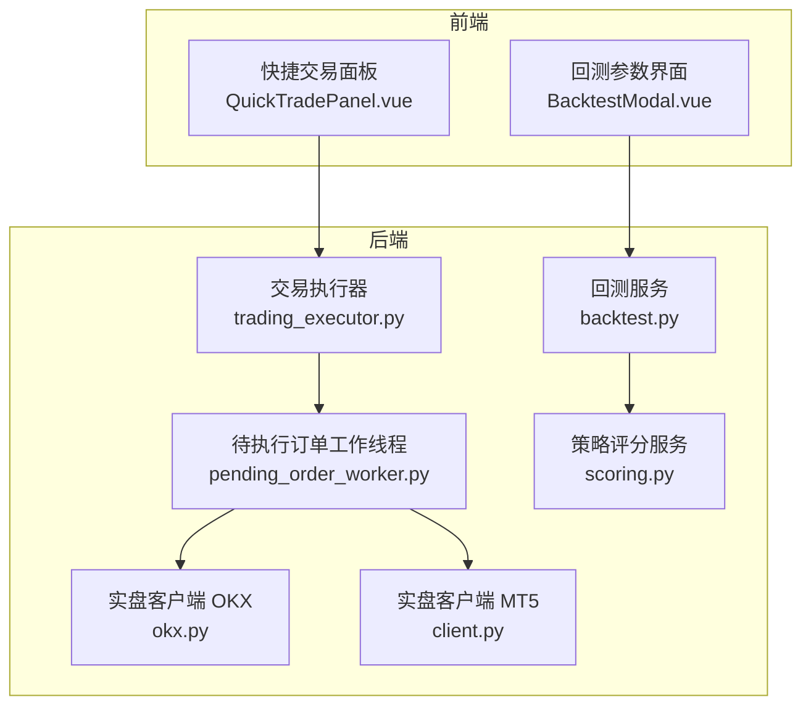
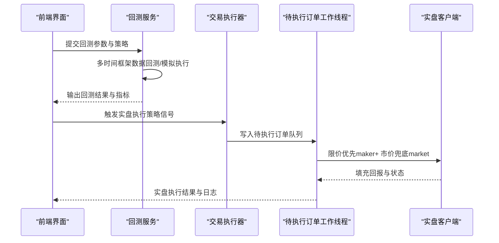
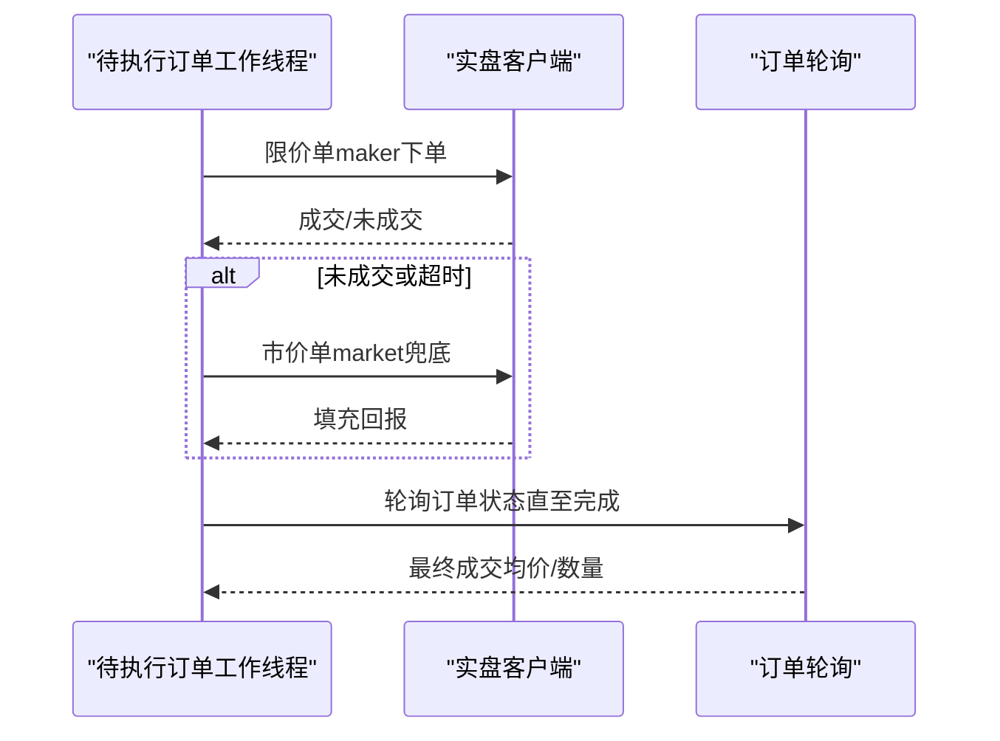
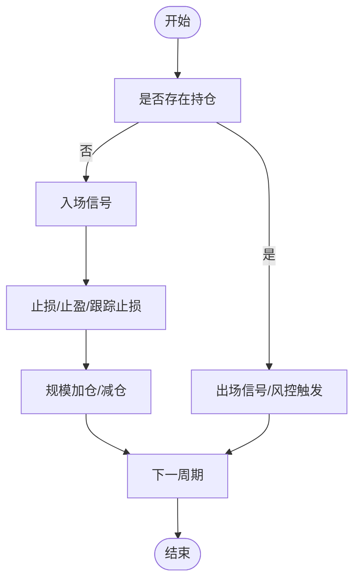
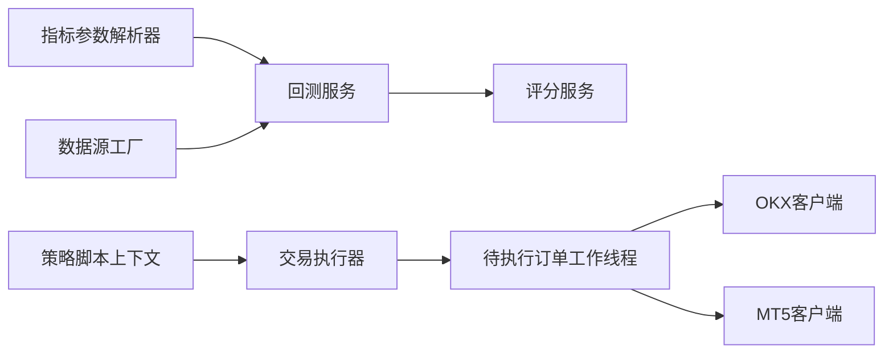

# 执行算法

<cite>
**本文引用的文件**
- [backtest.py](file://backend_api_python/app/services/backtest.py)
- [trading_executor.py](file://backend_api_python/app/services/trading_executor.py)
- [pending_order_worker.py](file://backend_api_python/app/services/pending_order_worker.py)
- [okx.py](file://backend_api_python/app/services/live_trading/okx.py)
- [client.py](file://backend_api_python/app/services/mt5_trading/client.py)
- [scoring.py](file://backend_api_python/app/services/experiment/scoring.py)
- [BacktestModal.vue](file://frontend/src/views/indicator-analysis/components/BacktestModal.vue)
- [QuickTradePanel.vue](file://frontend/src/components/QuickTradePanel/QuickTradePanel.vue)
</cite>

## 目录
1. [简介](#简介)
2. [项目结构](#项目结构)
3. [核心组件](#核心组件)
4. [架构总览](#架构总览)
5. [详细组件分析](#详细组件分析)
6. [依赖分析](#依赖分析)
7. [性能考量](#性能考量)
8. [故障排查指南](#故障排查指南)
9. [结论](#结论)
10. [附录](#附录)

## 简介
本文件面向QuantDinger的执行算法模块，系统化阐述市价单执行、限价单优化、成交量加权平均价格(VWAP)与时间加权平均价格(TWAP)在系统中的实现思路与可扩展路径。文档聚焦于以下方面：
- 执行算法的参数化配置与回测验证流程
- 市场条件适配策略（高波动、低流动性）
- 性能评估指标与回测方法
- 实盘执行链路与监控调整建议

说明：当前仓库未内置VWAP/TWAP的直接实现代码，但通过回测引擎与参数化规则，可将VWAP/TWAP作为“信号源”或“目标价格曲线”接入，从而在回测与实盘中以参数驱动的方式实现类似效果。

## 项目结构
执行算法相关的核心代码位于后端Python服务层，前端提供回测参数界面与快捷交易入口。关键模块如下：
- 回测引擎：负责多时间框架回测、信号执行、风险控制与交易模拟
- 实盘执行：统一挂单与成交处理，支持限价优先与市价兜底
- 参数界面：提供回测参数面板，映射到策略配置结构
- 评分体系：将回测结果转化为可比较的多因子评分

图表来源
- [backtest.py](file://backend_api_python/app/services/backtest.py)
- [trading_executor.py](file://backend_api_python/app/services/trading_executor.py)
- [pending_order_worker.py](file://backend_api_python/app/services/pending_order_worker.py)
- [okx.py](file://backend_api_python/app/services/live_trading/okx.py)
- [client.py](file://backend_api_python/app/services/mt5_trading/client.py)
- [BacktestModal.vue](file://frontend/src/views/indicator-analysis/components/BacktestModal.vue)
- [QuickTradePanel.vue](file://frontend/src/components/QuickTradePanel/QuickTradePanel.vue)

章节来源
- [backtest.py](file://backend_api_python/app/services/backtest.py)
- [trading_executor.py](file://backend_api_python/app/services/trading_executor.py)
- [pending_order_worker.py](file://backend_api_python/app/services/pending_order_worker.py)
- [BacktestModal.vue](file://frontend/src/views/indicator-analysis/components/BacktestModal.vue)
- [QuickTradePanel.vue](file://frontend/src/components/QuickTradePanel/QuickTradePanel.vue)

## 核心组件
- 回测服务（BacktestService）
  - 多时间框架回测、信号执行、风险控制、佣金与滑点建模、强制平仓与止盈止损、参数化规模加仓/减仓
  - 支持“下一根K线开盘执行”等执行时机设置，避免前瞻性偏误
- 交易执行器（TradingExecutor）
  - 将策略脚本生成的订单转换为标准化信号，写入待执行队列；支持脚本态与机器人脚本
- 待执行订单工作线程（PendingOrderWorker）
  - 限价优先、市价兜底的两阶段执行；支持多交易所客户端封装
- 实盘客户端（OKX/MT5）
  - 市价单下单、限价单下单、填充轮询与状态更新
- 评分服务（StrategyScoringService）
  - 将回测结果映射为多因子评分，辅助策略筛选与回归测试

章节来源
- [backtest.py](file://backend_api_python/app/services/backtest.py)
- [trading_executor.py](file://backend_api_python/app/services/trading_executor.py)
- [pending_order_worker.py](file://backend_api_python/app/services/pending_order_worker.py)
- [okx.py](file://backend_api_python/app/services/live_trading/okx.py)
- [client.py](file://backend_api_python/app/services/mt5_trading/client.py)
- [scoring.py](file://backend_api_python/app/services/experiment/scoring.py)

## 架构总览
执行算法在系统中的位置与交互如下：

图表来源
- [backtest.py](file://backend_api_python/app/services/backtest.py)
- [trading_executor.py](file://backend_api_python/app/services/trading_executor.py)
- [pending_order_worker.py](file://backend_api_python/app/services/pending_order_worker.py)
- [okx.py](file://backend_api_python/app/services/live_trading/okx.py)
- [client.py](file://backend_api_python/app/services/mt5_trading/client.py)

## 详细组件分析

### 市价单执行
- 回测侧：通过“下一根K线开盘执行”等时机设置，避免前瞻；市价成交按OHLC中的开盘价或收盘价建模，并叠加滑点与手续费
- 实盘侧：统一采用限价优先、市价兜底的两阶段执行；若限价阶段失败或超时，则自动转为市价单
- 关键要点
  - 限价偏移量（maker_offset）降低立即成交概率，减少滑点与冲击成本
  - 市价单在不同交易所/产品上遵循其最优下单模式（如IOC/Fok/返回等）

图表来源
- [pending_order_worker.py](file://backend_api_python/app/services/pending_order_worker.py)
- [okx.py](file://backend_api_python/app/services/live_trading/okx.py)
- [client.py](file://backend_api_python/app/services/mt5_trading/client.py)

章节来源
- [pending_order_worker.py](file://backend_api_python/app/services/pending_order_worker.py)
- [okx.py](file://backend_api_python/app/services/live_trading/okx.py)
- [client.py](file://backend_api_python/app/services/mt5_trading/client.py)

### 限价单优化
- 限价优先策略：在限价阶段尽量以对手价成交，减少滑点与冲击成本
- maker_offset：根据方向对参考价做微幅偏移，避免与市场最优价重叠导致立即成交
- 兜底机制：若限价阶段未能成交或超时，则自动切换市价单
- 适用场景：流动性充足、波动适中；在高波动或深度不足时，需谨慎设置偏移与等待时长

章节来源
- [pending_order_worker.py](file://backend_api_python/app/services/pending_order_worker.py)

### VWAP（成交量加权平均价格）算法
- 当前仓库未提供VWAP的直接实现代码。可采用以下参数化方式接入：
  - 将VWAP分解为“分时段目标价格”或“分档委托”：在每个时间窗口内，按成交量分布设定限价委托档位
  - 在回测中，将VWAP曲线作为“目标价格序列”，结合滑点与手续费进行模拟执行
  - 在实盘中，将VWAP曲线映射为限价委托档位，逐档挂单并轮询成交
- 参数建议
  - 执行时间窗口：按日频或更高频（如1分钟）划分；窗口内成交量权重决定每档下单比例
  - 滑点容忍度：根据流动性与波动率设置，避免过度偏离VWAP
  - 流动性考虑：在浅水区（低流动性）适当放宽档位间距与下单比例，提高成交概率

章节来源
- [backtest.py](file://backend_api_python/app/services/backtest.py)
- [BacktestModal.vue](file://frontend/src/views/indicator-analysis/components/BacktestModal.vue)

### TWAP（时间加权平均价格）算法
- 当前仓库未提供TWAP的直接实现代码。可采用以下参数化方式接入：
  - 将TWAP分解为“均匀时间间隔”的分档委托：在总执行时间内均匀分配下单次数
  - 在回测中，将TWAP曲线作为“目标价格序列”，结合滑点与手续费进行模拟执行
  - 在实盘中，将TWAP曲线映射为限价委托档位，按时间间隔逐档挂单
- 参数建议
  - 执行时间窗口：总时长与分档数决定每档间隔；短时高频适合高波动市场，长时低频适合低波动市场
  - 滑点容忍度：在高波动期适当收紧，低波动期可适度放宽
  - 流动性考虑：在低流动性期增加档位数量与放宽偏移，提升成交概率

章节来源
- [backtest.py](file://backend_api_python/app/services/backtest.py)
- [BacktestModal.vue](file://frontend/src/views/indicator-analysis/components/BacktestModal.vue)

### 风险控制与参数化规模
- 止损/止盈/跟踪止损：基于杠杆调整后的价格阈值，优先级为止损 > 跟踪止损 > 固定止盈
- 规模加仓/减仓：支持趋势加仓（价格上涨触发）、均值回归加仓（价格下跌触发）、趋势减仓（价格上涨触发）、不利减仓（价格下跌触发）
- 参数来源：回测参数界面映射到策略配置结构，供回测与实盘共同使用

图表来源
- [backtest.py](file://backend_api_python/app/services/backtest.py)

章节来源
- [backtest.py](file://backend_api_python/app/services/backtest.py)
- [BacktestModal.vue](file://frontend/src/views/indicator-analysis/components/BacktestModal.vue)

### 市场条件适配策略
- 高波动市场
  - 市价单：谨慎使用，优先限价优先+市价兜底；提高滑点容忍度与限价偏移
  - VWAP/TWAP：缩短执行窗口、增加档位数量、放宽每档下单比例
  - 风控：收紧止损/止盈阈值，启用跟踪止损
- 低流动性市场
  - 市价单：避免大额市价单；优先限价分档委托
  - VWAP/TWAP：缩小档位间距、延长执行时间、降低每档下单比例
  - 风控：严格止损，避免深度回调导致爆仓

章节来源
- [backtest.py](file://backend_api_python/app/services/backtest.py)
- [pending_order_worker.py](file://backend_api_python/app/services/pending_order_worker.py)

## 依赖分析
- 回测服务依赖数据源工厂与指标参数解析器，输出标准化回测结果
- 交易执行器依赖策略脚本上下文与脚本运行时状态，将脚本订单转换为标准信号
- 待执行订单工作线程依赖多交易所客户端，实现统一的限价优先+市价兜底执行
- 评分服务依赖回测结果，输出多因子评分与等级

图表来源
- [backtest.py](file://backend_api_python/app/services/backtest.py)
- [trading_executor.py](file://backend_api_python/app/services/trading_executor.py)
- [pending_order_worker.py](file://backend_api_python/app/services/pending_order_worker.py)
- [scoring.py](file://backend_api_python/app/services/experiment/scoring.py)

章节来源
- [backtest.py](file://backend_api_python/app/services/backtest.py)
- [trading_executor.py](file://backend_api_python/app/services/trading_executor.py)
- [pending_order_worker.py](file://backend_api_python/app/services/pending_order_worker.py)
- [scoring.py](file://backend_api_python/app/services/experiment/scoring.py)

## 性能考量
- 回测性能
  - 多时间框架回测：在1分钟与5分钟之间自动选择，兼顾精度与性能
  - 缓存与索引：K线缓存与数据库索引提升查询效率
- 执行性能
  - 限价优先+市价兜底：减少瞬时冲击，提高成交稳定性
  - 订单轮询与状态更新：在不同交易所间保持一致的轮询节奏
- 参数敏感性
  - maker_offset、滑点、手续费、执行档位与时间窗口对最终收益与回撤影响显著，需通过回测进行敏感性分析

章节来源
- [backtest.py](file://backend_api_python/app/services/backtest.py)
- [pending_order_worker.py](file://backend_api_python/app/services/pending_order_worker.py)

## 故障排查指南
- 市价单未成交或延迟
  - 检查maker_offset是否过大导致限价无法成交；确认等待时长与轮询间隔
  - 核对交易所下单模式（IOC/Fok/返回）与最小下单量
- 回测结果与实盘差异
  - 检查信号执行时机设置（下一根K线开盘 vs 当根K线收盘）
  - 对比滑点与手续费设置，确认是否一致
- 爆仓与强制平仓
  - 核对止损/跟踪止损阈值与杠杆的关系；关注回测末尾强制平仓逻辑
- 订单状态异常
  - 检查订单轮询与状态更新逻辑；确认交易所API响应与错误码

章节来源
- [pending_order_worker.py](file://backend_api_python/app/services/pending_order_worker.py)
- [okx.py](file://backend_api_python/app/services/live_trading/okx.py)
- [client.py](file://backend_api_python/app/services/mt5_trading/client.py)
- [backtest.py](file://backend_api_python/app/services/backtest.py)

## 结论
QuantDinger的执行算法模块以参数化为核心，通过回测引擎与实盘执行链路形成闭环。虽然当前未内置VWAP/TWAP的直接实现，但可通过“目标价格曲线+分档委托”的方式灵活接入，并结合滑点、手续费与流动性参数，在不同市场条件下实现稳健执行。建议在实盘前充分进行回测与压力测试，并建立动态监控与参数自适应机制。

## 附录

### 算法参数配置清单（示例）
- 执行时机
  - signalTiming：下一根K线开盘执行（推荐）
- 风险控制
  - stopLossPct、takeProfitPct、trailing.enabled、trailing.pct、trailing.activationPct
- 仓位管理
  - position.entryPct：入场占金比例
- 规模规则
  - trendAdd.enabled、stepPct、sizePct、maxTimes
  - dcaAdd.enabled、stepPct、sizePct、maxTimes
  - trendReduce.enabled、stepPct、sizePct、maxTimes
  - adverseReduce.enabled、stepPct、sizePct、maxTimes

章节来源
- [backtest.py](file://backend_api_python/app/services/backtest.py)
- [BacktestModal.vue](file://frontend/src/views/indicator-analysis/components/BacktestModal.vue)