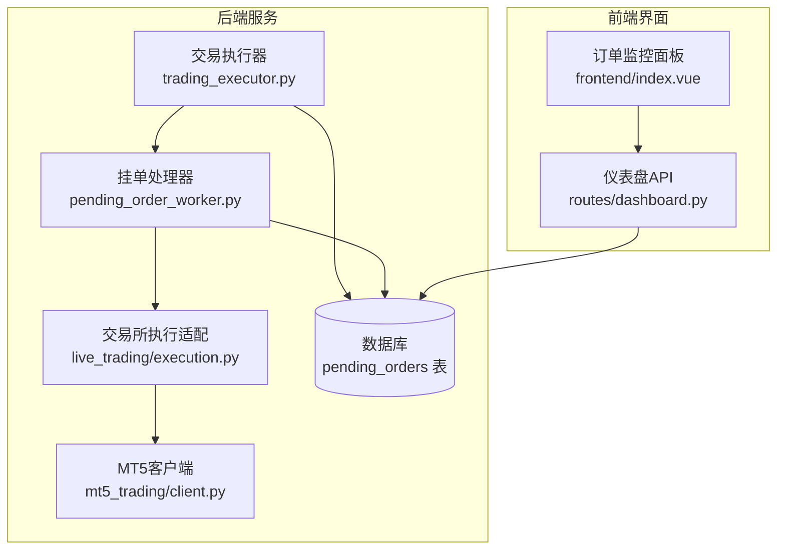
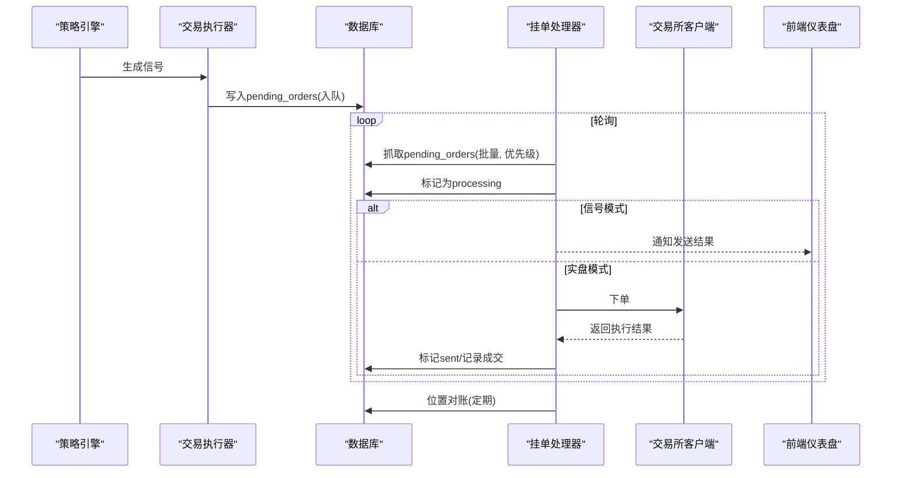
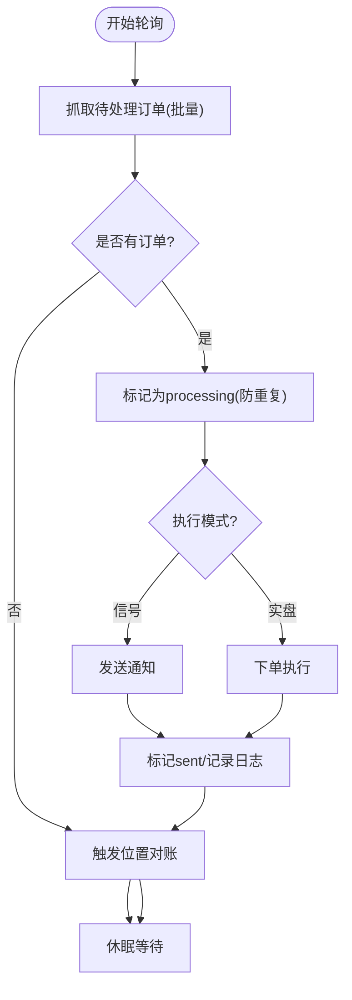
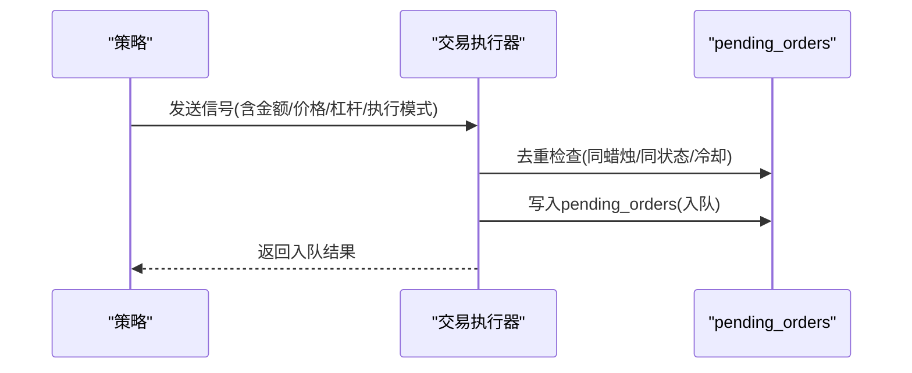
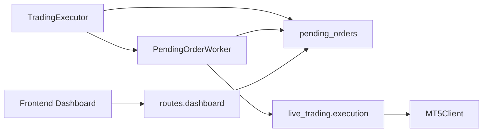

# 订单管理系统

<cite>
**本文引用的文件**
- [pending_order_worker.py](file://backend_api_python/app/services/pending_order_worker.py)
- [trading_executor.py](file://backend_api_python/app/services/trading_executor.py)
- [init.sql](file://backend_api_python/migrations/init.sql)
- [dashboard.py](file://backend_api_python/app/routes/dashboard.py)
- [dashboard.js](file://frontend/src/api/dashboard.js)
- [index.vue](file://frontend/src/views/dashboard/index.vue)
- [execution.py](file://backend_api_python/app/services/live_trading/execution.py)
- [client.py](file://backend_api_python/app/services/mt5_trading/client.py)
</cite>

## 目录
1. [简介](#简介)
2. [项目结构](#项目结构)
3. [核心组件](#核心组件)
4. [架构总览](#架构总览)
5. [详细组件分析](#详细组件分析)
6. [依赖分析](#依赖分析)
7. [性能考虑](#性能考虑)
8. [故障排查指南](#故障排查指南)
9. [结论](#结论)
10. [附录](#附录)

## 简介
本文件面向QuantDinger的订单管理系统，重点围绕挂单处理器（PendingOrderWorker）进行深入解析，涵盖订单队列管理、执行优先级排序与批量处理机制；详细阐述订单生命周期管理（从创建、排队、执行到完成）；解释状态跟踪、错误恢复与重试策略；说明订单配置项（止损止盈、时间有效性、条件订单支持）；并提供订单监控界面使用指南与性能优化建议。文档旨在帮助开发者与运营人员快速理解并高效运维该系统。

## 项目结构
QuantDinger后端采用Python服务层与前端Vue界面分离的架构：
- 后端服务层包含订单调度与执行逻辑（PendingOrderWorker、交易执行器、交易所适配器）
- 数据持久化通过PostgreSQL表实现，其中pending_orders为核心队列表
- 前端提供仪表盘，展示待执行订单、历史交易与实时监控

图表来源
- [pending_order_worker.py:52-122](file://backend_api_python/app/services/pending_order_worker.py#L52-L122)
- [trading_executor.py:3076-3275](file://backend_api_python/app/services/trading_executor.py#L3076-L3275)
- [execution.py:123-200](file://backend_api_python/app/services/live_trading/execution.py#L123-L200)
- [client.py:260-293](file://backend_api_python/app/services/mt5_trading/client.py#L260-L293)
- [init.sql:309-338](file://backend_api_python/migrations/init.sql#L309-L338)
- [dashboard.py:621-775](file://backend_api_python/app/routes/dashboard.py#L621-L775)
- [index.vue:409-511](file://frontend/src/views/dashboard/index.vue#L409-L511)

章节来源
- [pending_order_worker.py:52-122](file://backend_api_python/app/services/pending_order_worker.py#L52-L122)
- [trading_executor.py:3076-3275](file://backend_api_python/app/services/trading_executor.py#L3076-L3275)
- [init.sql:309-338](file://backend_api_python/migrations/init.sql#L309-L338)
- [dashboard.py:621-775](file://backend_api_python/app/routes/dashboard.py#L621-L775)
- [index.vue:409-511](file://frontend/src/views/dashboard/index.vue#L409-L511)

## 核心组件
- 挂单处理器（PendingOrderWorker）
  - 定期轮询pending_orders表，按优先级与ID顺序批量抓取待处理订单
  - 支持“信号模式”通知与“实盘模式”下单执行
  - 提供位置对账（Position Sync）以保持本地与交易所一致
  - 具备“过期回收”与“失败重试”能力
- 交易执行器（TradingExecutor）
  - 将策略信号转换为待入队的挂单记录，并写入pending_orders
  - 提供去重与冷却保护，避免重复入队
  - 在实盘模式下仅入队，不直接下单，由挂单处理器统一执行
- 交易所执行适配（live_trading/execution.py）
  - 统一抽象不同交易所下单接口，支持币安、OKX、Bitget、Bybit、Coinbase、Kraken、KuCoin、Gate、Deepcoin、HTX、IBKR、MT5等
  - 负责下单参数标准化、精度校验与错误处理
- 数据模型（pending_orders）
  - 存储待执行订单的元数据、状态、尝试次数、错误信息、交易所映射等
- 仪表盘（Dashboard）
  - 提供待执行订单查询、删除、状态展示与错误提示
  - 前端轮询刷新，支持声音提醒与分页

章节来源
- [pending_order_worker.py:52-122](file://backend_api_python/app/services/pending_order_worker.py#L52-L122)
- [trading_executor.py:3076-3275](file://backend_api_python/app/services/trading_executor.py#L3076-L3275)
- [execution.py:123-200](file://backend_api_python/app/services/live_trading/execution.py#L123-L200)
- [init.sql:309-338](file://backend_api_python/migrations/init.sql#L309-L338)
- [dashboard.py:621-775](file://backend_api_python/app/routes/dashboard.py#L621-L775)
- [index.vue:409-511](file://frontend/src/views/dashboard/index.vue#L409-L511)

## 架构总览
挂单处理器作为订单执行的核心调度器，负责：
- 从pending_orders表中抓取待处理订单（批量、带优先级）
- 标记为processing并执行下单或通知
- 成功后标记为sent，失败则记录错误或延迟重试
- 定期进行位置对账，修复“幽灵持仓”

图表来源
- [trading_executor.py:3076-3275](file://backend_api_python/app/services/trading_executor.py#L3076-L3275)
- [pending_order_worker.py:91-122](file://backend_api_python/app/services/pending_order_worker.py#L91-L122)
- [execution.py:123-200](file://backend_api_python/app/services/live_trading/execution.py#L123-L200)
- [dashboard.py:621-775](file://backend_api_python/app/routes/dashboard.py#L621-L775)

## 详细组件分析

### 挂单处理器（PendingOrderWorker）
- 轮询与批量
  - 以固定轮询间隔扫描pending_orders表，按priority降序、id升序抓取，限制batch_size
  - 若无待处理订单，则触发位置对账
- 过期回收
  - 对于超过阈值未更新的processing订单，自动回滚为pending，避免死锁
- 执行路径
  - 信号模式：通过通知器发送信号，成功后标记sent
  - 实盘模式：通过交易所客户端下单，记录成交与错误
- 错误与重试
  - 失败时记录last_error，增加attempts，不超过max_attempts
  - deferred状态用于显式延迟处理
- 位置对账
  - 定期拉取各交易所仓位，与本地qd_strategy_positions比对，删除/更新/插入以保持一致

图表来源
- [pending_order_worker.py:91-122](file://backend_api_python/app/services/pending_order_worker.py#L91-L122)
- [pending_order_worker.py:637-799](file://backend_api_python/app/services/pending_order_worker.py#L637-L799)

章节来源
- [pending_order_worker.py:52-122](file://backend_api_python/app/services/pending_order_worker.py#L52-L122)
- [pending_order_worker.py:637-799](file://backend_api_python/app/services/pending_order_worker.py#L637-L799)
- [pending_order_worker.py:138-636](file://backend_api_python/app/services/pending_order_worker.py#L138-L636)

### 交易执行器（TradingExecutor）
- 入队逻辑
  - 将策略信号封装为payload，写入pending_orders
  - 去重与冷却：基于signal_ts或策略+标的+信号类型进行去重，避免重复入队
- 实盘模式
  - 仅入队，不直接下单，交由挂单处理器统一执行
- 信号模式
  - 直接发送通知，不涉及真实交易

图表来源
- [trading_executor.py:3076-3275](file://backend_api_python/app/services/trading_executor.py#L3076-L3275)

章节来源
- [trading_executor.py:3076-3275](file://backend_api_python/app/services/trading_executor.py#L3076-L3275)

### 交易所执行适配（live_trading/execution.py）
- 统一抽象
  - 针对不同交易所实现下单参数标准化、精度校验与错误处理
- 支持范围
  - 币安、OKX、Bitget、Bybit、Coinbase、Kraken、KuCoin、Gate、Deepcoin、HTX、IBKR、MT5
- 参数规范
  - 符号格式规范化、方向与开平仓映射、市价单/限价单、减少仓单等

章节来源
- [execution.py:123-200](file://backend_api_python/app/services/live_trading/execution.py#L123-L200)

### 数据模型（pending_orders）
- 关键字段
  - 用户/策略/标的/信号类型/金额/价格/执行模式/状态/优先级/尝试次数/最大尝试/错误信息/交易所映射/成交统计/时间戳
- 索引
  - user_id、status、strategy_id等索引提升查询效率
- 生命周期
  - pending -> processing -> sent/completed 或 failed/deferred

章节来源
- [init.sql:309-338](file://backend_api_python/migrations/init.sql#L309-L338)

### 仪表盘与监控
- 后端接口
  - 获取待执行订单列表、分页、删除（非processing）
- 前端展示
  - 订单表格、状态标签、错误提示、通知渠道图标、时间信息
- 轮询与提醒
  - 前端定时轮询，支持声音提醒开关

章节来源
- [dashboard.py:621-775](file://backend_api_python/app/routes/dashboard.py#L621-L775)
- [dashboard.js:2-30](file://frontend/src/api/dashboard.js#L2-L30)
- [index.vue:409-511](file://frontend/src/views/dashboard/index.vue#L409-L511)

## 依赖分析
- 组件耦合
  - TradingExecutor与PendingOrderWorker通过pending_orders表解耦
  - PendingOrderWorker依赖交易所客户端与通知器
  - 前端通过API访问后端仪表盘接口
- 外部依赖
  - PostgreSQL数据库
  - 各类交易所REST SDK（币安、OKX、Bitget、Bybit、Coinbase、Kraken、KuCoin、Gate、Deepcoin、HTX、IBKR、MT5）

图表来源
- [trading_executor.py:3076-3275](file://backend_api_python/app/services/trading_executor.py#L3076-L3275)
- [pending_order_worker.py:52-122](file://backend_api_python/app/services/pending_order_worker.py#L52-L122)
- [execution.py:123-200](file://backend_api_python/app/services/live_trading/execution.py#L123-L200)
- [dashboard.py:621-775](file://backend_api_python/app/routes/dashboard.py#L621-L775)

## 性能考虑
- 批量处理
  - 使用batch_size限制每次处理数量，避免一次性占用过多资源
- 优先级排序
  - 通过priority降序、id升序保证高优先级订单优先执行
- 去重与冷却
  - 入队前的去重与冷却策略降低重复请求与数据库压力
- 位置对账频率
  - POSITION_SYNC_INTERVAL_SEC控制对账周期，避免频繁拉取交易所仓位
- 数据库索引
  - 为user_id、status、strategy_id建立索引，提升查询性能

章节来源
- [pending_order_worker.py:52-122](file://backend_api_python/app/services/pending_order_worker.py#L52-L122)
- [trading_executor.py:3076-3275](file://backend_api_python/app/services/trading_executor.py#L3076-L3275)
- [init.sql:340-342](file://backend_api_python/migrations/init.sql#L340-L342)

## 故障排查指南
- 常见问题
  - 订单长时间处于processing：检查PENDING_ORDER_STALE_SEC是否生效，确认挂单处理器进程健康
  - 订单失败：查看last_error字段，结合交易所返回信息定位原因
  - 无法删除订单：若状态为processing则不可删除，需等待处理完成
  - 位置不一致：启用位置对账，检查交易所连接与权限
- 排查步骤
  - 查看pending_orders表状态与错误信息
  - 检查挂单处理器日志与轮询间隔
  - 核对策略执行模式与交易所配置
  - 前端仪表盘查看订单状态与错误提示

章节来源
- [pending_order_worker.py:637-799](file://backend_api_python/app/services/pending_order_worker.py#L637-L799)
- [dashboard.py:778-842](file://backend_api_python/app/routes/dashboard.py#L778-L842)

## 结论
QuantDinger的订单管理系统通过挂单处理器实现了稳定、可扩展的订单队列管理与执行调度。其设计强调：
- 明确的生命周期与状态机
- 可配置的优先级与批量处理
- 强健的错误恢复与重试机制
- 丰富的监控与可视化
- 与多交易所的适配与抽象

对于用户与开发者而言，理解挂单处理器的工作原理、掌握仪表盘监控方法、合理配置参数与策略，是保障系统稳定运行的关键。

## 附录

### 订单生命周期管理
- 创建：策略产生信号，交易执行器写入pending_orders
- 排队：按priority与id排序，等待处理
- 执行：信号模式发送通知；实盘模式通过交易所客户端下单
- 完成：记录成交、更新本地头寸快照、标记sent
- 失败/延迟：记录错误、增加尝试次数、必要时deferred

章节来源
- [trading_executor.py:3076-3275](file://backend_api_python/app/services/trading_executor.py#L3076-L3275)
- [pending_order_worker.py:712-799](file://backend_api_python/app/services/pending_order_worker.py#L712-L799)

### 订单状态跟踪与错误恢复
- 状态字段：pending、processing、sent、failed、deferred
- 错误恢复：过期回收、失败重试、位置对账
- 日志与通知：策略日志、通知器消息、仪表盘错误提示

章节来源
- [pending_order_worker.py:637-799](file://backend_api_python/app/services/pending_order_worker.py#L637-L799)
- [dashboard.py:621-775](file://backend_api_python/app/routes/dashboard.py#L621-L775)

### 订单配置选项说明
- 止损止盈
  - 系统支持止损、止盈与追踪止损的策略计算与回测逻辑（参考回测模块）
  - 实盘下单时可通过下单参数传递止损止盈价格
- 时间有效性
  - 交易所下单参数包含有效期（如GTC）与成交方式（如FOK/IOC/返回）
- 条件订单
  - 通过策略信号类型与参数组合实现条件触发（如开仓/减仓/加仓）
- 执行模式
  - signal：仅通知，不实盘
  - live：入队等待挂单处理器执行

章节来源
- [execution.py:123-200](file://backend_api_python/app/services/live_trading/execution.py#L123-L200)
- [client.py:260-293](file://backend_api_python/app/services/mt5_trading/client.py#L260-L293)

### 订单监控界面使用指南
- 访问路径：仪表盘“待执行订单”
- 功能要点：
  - 分页浏览、状态筛选、错误查看
  - 删除待处理订单（processing除外）
  - 声音提醒开关
- 数据来源：后端dashboard接口返回，前端轮询刷新

章节来源
- [dashboard.py:621-775](file://backend_api_python/app/routes/dashboard.py#L621-L775)
- [dashboard.js:2-30](file://frontend/src/api/dashboard.js#L2-L30)
- [index.vue:409-511](file://frontend/src/views/dashboard/index.vue#L409-L511)