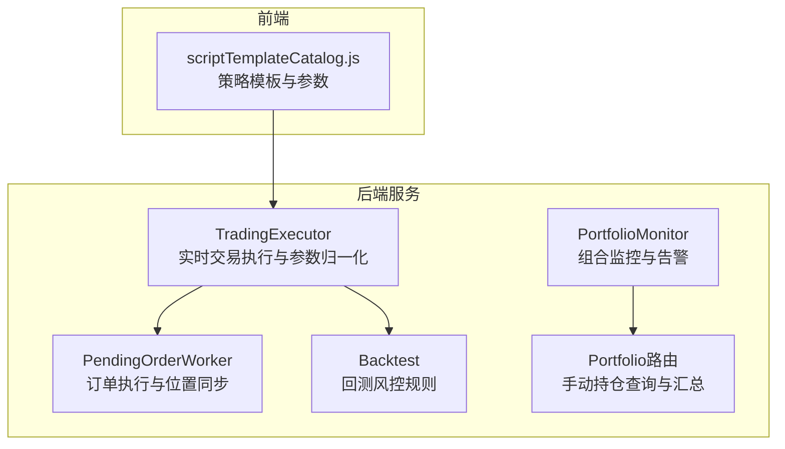
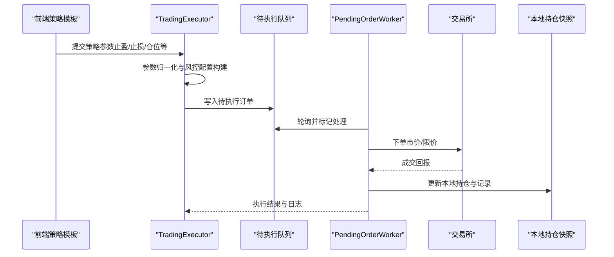
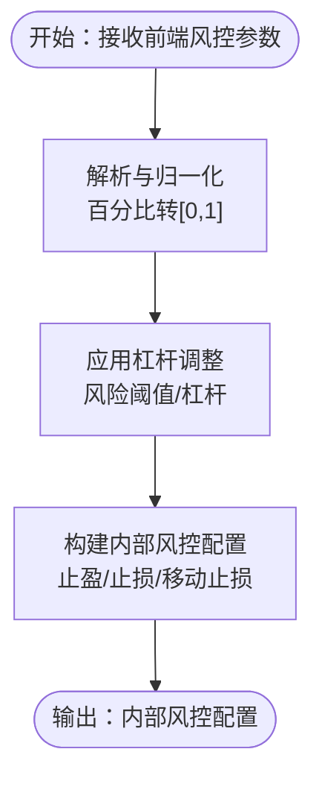
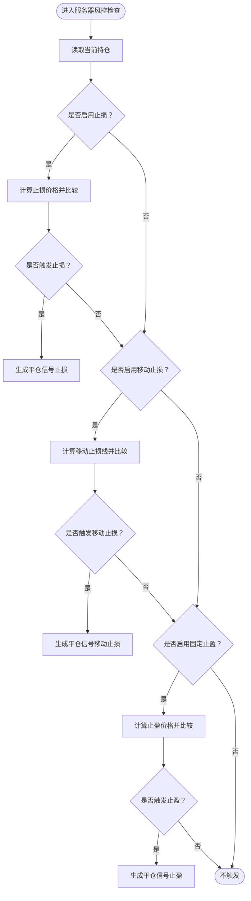
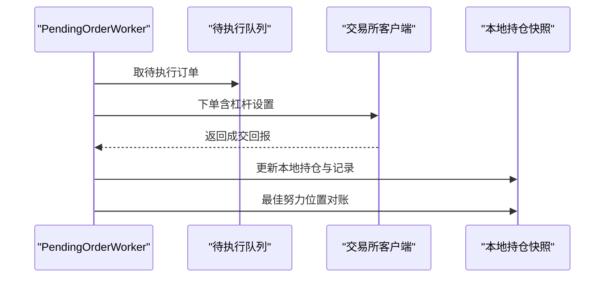
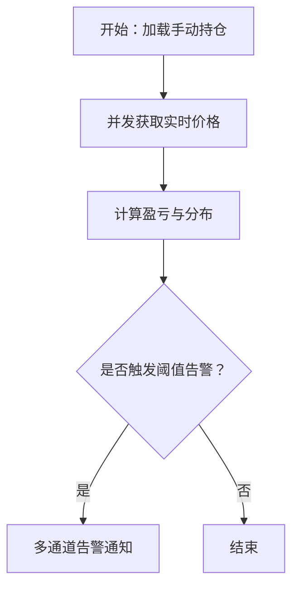
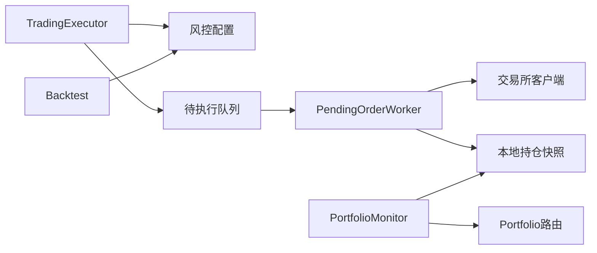

# 风险控制系统

<cite>
**本文档引用的文件**
- [trading_executor.py](file://backend_api_python/app/services/trading_executor.py)
- [pending_order_worker.py](file://backend_api_python/app/services/pending_order_worker.py)
- [portfolio_monitor.py](file://backend_api_python/app/services/portfolio_monitor.py)
- [portfolio.py](file://backend_api_python/app/routes/portfolio.py)
- [scriptTemplateCatalog.js](file://frontend/src/views/trading-assistant/components/scriptTemplateCatalog.js)
- [backtest.py](file://backend_api_python/app/services/backtest.py)
</cite>

## 目录
1. [简介](#简介)
2. [项目结构](#项目结构)
3. [核心组件](#核心组件)
4. [架构总览](#架构总览)
5. [详细组件分析](#详细组件分析)
6. [依赖关系分析](#依赖关系分析)
7. [性能考虑](#性能考虑)
8. [故障排除指南](#故障排除指南)
9. [结论](#结论)

## 简介
本文件为QuantDinger的风险控制系统提供综合性技术文档，覆盖仓位管理、止损止盈自动执行、服务器端止盈止亏、最大回撤控制以及资金管理策略。文档同时说明风险控制参数的配置方法（如最大仓位比例、止损百分比、止盈目标、移动止损等），并给出趋势跟踪、均值回归、套利与网格策略的风险管理实现要点。最后提供风险监控指标计算与实时告警机制的配置指南。

## 项目结构
QuantDinger后端采用分层设计，风险控制相关逻辑主要分布在以下模块：
- 实时交易执行与风控：TradingExecutor（信号生成与参数归一化）、PendingOrderWorker（订单执行与位置同步）
- 组合监控与告警：PortfolioMonitor（AI驱动的组合分析与告警）、Portfolio路由（手动持仓查询与汇总）
- 前端策略模板：scriptTemplateCatalog.js（内置策略模板及参数定义）

图表来源
- [trading_executor.py:307-391](file://backend_api_python/app/services/trading_executor.py#L307-L391)
- [pending_order_worker.py:52-122](file://backend_api_python/app/services/pending_order_worker.py#L52-L122)
- [portfolio_monitor.py:1-80](file://backend_api_python/app/services/portfolio_monitor.py#L1-L80)
- [portfolio.py:142-290](file://backend_api_python/app/routes/portfolio.py#L142-L290)
- [backtest.py:2437-2460](file://backend_api_python/app/services/backtest.py#L2437-L2460)
- [scriptTemplateCatalog.js:1-538](file://frontend/src/views/trading-assistant/components/scriptTemplateCatalog.js#L1-L538)

章节来源
- [trading_executor.py:1-120](file://backend_api_python/app/services/trading_executor.py#L1-L120)
- [pending_order_worker.py:1-120](file://backend_api_python/app/services/pending_order_worker.py#L1-L120)
- [portfolio_monitor.py:1-80](file://backend_api_python/app/services/portfolio_monitor.py#L1-L80)
- [portfolio.py:1-80](file://backend_api_python/app/routes/portfolio.py#L1-L80)
- [backtest.py:2437-2460](file://backend_api_python/app/services/backtest.py#L2437-L2460)
- [scriptTemplateCatalog.js:1-60](file://frontend/src/views/trading-assistant/components/scriptTemplateCatalog.js#L1-L60)

## 核心组件
- 交易执行与参数归一化：负责将前端传入的风控参数转换为内部结构，支持止盈、止损、移动止损、加减仓等配置。
- 订单执行与位置同步：负责将待执行订单派发到交易所，处理成交回报，更新本地持仓快照，并进行最佳努力的位置对账。
- 组合监控与告警：基于手动持仓构建组合概览，计算盈亏与分布，并通过多通道发送告警。
- 回测风控规则：提供与实盘一致的风控计算方式，包括杠杆对风险阈值的影响与冲突处理。

章节来源
- [trading_executor.py:307-391](file://backend_api_python/app/services/trading_executor.py#L307-L391)
- [pending_order_worker.py:138-200](file://backend_api_python/app/services/pending_order_worker.py#L138-L200)
- [portfolio_monitor.py:400-480](file://backend_api_python/app/services/portfolio_monitor.py#L400-L480)
- [backtest.py:2437-2460](file://backend_api_python/app/services/backtest.py#L2437-L2460)

## 架构总览
风险控制在系统中的流转如下：
- 前端策略模板定义参数（如止盈、止损、仓位比例等），经TradingExecutor归一化为内部配置。
- TradingExecutor根据策略信号与风控配置生成待执行订单，写入待执行队列。
- PendingOrderWorker轮询队列，按执行模式派发订单至交易所，处理成交回报并更新本地持仓。
- PortfolioMonitor基于手动持仓与实时行情计算组合指标并触发告警。
- 回测模块提供一致的风控计算基准，确保实盘与回测一致性。

图表来源
- [trading_executor.py:307-391](file://backend_api_python/app/services/trading_executor.py#L307-L391)
- [pending_order_worker.py:100-122](file://backend_api_python/app/services/pending_order_worker.py#L100-L122)
- [pending_order_worker.py:712-800](file://backend_api_python/app/services/pending_order_worker.py#L712-L800)

## 详细组件分析

### 交易执行与风控参数归一化
- 参数来源：前端Trading Assistant与策略模板，包含止盈、止损、移动止损、加仓/减仓等。
- 归一化逻辑：将百分比输入转换为[0,1]区间，处理0~100与0~1两种单位；对移动止损激活阈值与止盈阈值进行一致性处理。
- 风险阈值与杠杆：风险百分比基于保证金收益定义，需除以杠杆转换为价格变动阈值，以符合用户预期。

图表来源
- [trading_executor.py:290-306](file://backend_api_python/app/services/trading_executor.py#L290-L306)
- [trading_executor.py:307-391](file://backend_api_python/app/services/trading_executor.py#L307-L391)
- [backtest.py:2446-2452](file://backend_api_python/app/services/backtest.py#L2446-L2452)

章节来源
- [trading_executor.py:290-391](file://backend_api_python/app/services/trading_executor.py#L290-L391)
- [backtest.py:2446-2452](file://backend_api_python/app/services/backtest.py#L2446-L2452)

### 服务器端止盈止亏与移动止损
- 服务器侧风控：在实时执行过程中，基于当前价格与持仓状态动态判断是否触发止盈/止损/移动止损。
- 触发条件：止盈/止损基于入场价与风险阈值；移动止损基于最高价与激活阈值。
- 冲突处理：当启用移动止损时，固定止盈优先级降低，避免歧义。

图表来源
- [trading_executor.py:1708-1745](file://backend_api_python/app/services/trading_executor.py#L1708-L1745)
- [trading_executor.py:1899-1928](file://backend_api_python/app/services/trading_executor.py#L1899-L1928)
- [backtest.py:2437-2453](file://backend_api_python/app/services/backtest.py#L2437-L2453)

章节来源
- [trading_executor.py:1708-1928](file://backend_api_python/app/services/trading_executor.py#L1708-L1928)
- [backtest.py:2437-2453](file://backend_api_python/app/services/backtest.py#L2437-L2453)

### 订单执行与位置同步
- 订单派发：PendingOrderWorker轮询待执行队列，按执行模式派发信号或实盘订单。
- 交易所适配：针对不同交易所（如Binance、OKX、Bybit等）设置杠杆、下单与成交查询流程。
- 位置同步：定期与交易所对账，删除“幽灵持仓”，更新大小与入场价，确保本地快照与实际一致。

图表来源
- [pending_order_worker.py:100-122](file://backend_api_python/app/services/pending_order_worker.py#L100-L122)
- [pending_order_worker.py:138-200](file://backend_api_python/app/services/pending_order_worker.py#L138-L200)
- [pending_order_worker.py:1700-2070](file://backend_api_python/app/services/pending_order_worker.py#L1700-L2070)

章节来源
- [pending_order_worker.py:100-200](file://backend_api_python/app/services/pending_order_worker.py#L100-L200)
- [pending_order_worker.py:1700-2070](file://backend_api_python/app/services/pending_order_worker.py#L1700-L2070)

### 组合监控与告警
- 手动持仓管理：提供增删改查接口，支持批量并发获取实时价格并计算盈亏。
- 组合概览：汇总总成本、总市值、总盈亏与市场分布。
- 告警机制：支持多通道（邮件、Telegram、Webhook、站内）告警，支持本地化消息模板。

图表来源
- [portfolio.py:142-290](file://backend_api_python/app/routes/portfolio.py#L142-L290)
- [portfolio.py:595-754](file://backend_api_python/app/routes/portfolio.py#L595-L754)
- [portfolio_monitor.py:28-62](file://backend_api_python/app/services/portfolio_monitor.py#L28-L62)
- [portfolio_monitor.py:400-480](file://backend_api_python/app/services/portfolio_monitor.py#L400-L480)

章节来源
- [portfolio.py:142-290](file://backend_api_python/app/routes/portfolio.py#L142-L290)
- [portfolio.py:595-754](file://backend_api_python/app/routes/portfolio.py#L595-L754)
- [portfolio_monitor.py:28-62](file://backend_api_python/app/services/portfolio_monitor.py#L28-L62)
- [portfolio_monitor.py:400-480](file://backend_api_python/app/services/portfolio_monitor.py#L400-L480)

### 风险控制参数配置方法
- 止损止盈：支持百分比与移动止损；百分比输入可为0~1或0~100，系统自动归一化。
- 杠杆影响：风险阈值按杠杆折算，避免高杠杆放大波动带来的误触发。
- 加减仓：支持趋势加仓、DCA加仓、趋势减仓与不利减仓，配合步进幅度与次数上限。
- 服务器侧风控：可启用服务器端止盈止亏，结合移动止损与固定止盈的优先级处理。

章节来源
- [trading_executor.py:307-391](file://backend_api_python/app/services/trading_executor.py#L307-L391)
- [backtest.py:2437-2453](file://backend_api_python/app/services/backtest.py#L2437-L2453)

### 不同类型交易策略的风险控制实现方案
- 趋势跟踪策略
  - 关键点：EMA交叉入场，固定止盈止损；建议结合移动止损提高稳定性。
  - 参数示例：快速/慢速周期、仓位比例、止盈/止损百分比。
- 均值回归策略
  - 关键点：布林带下轨买入、上轨卖出；严格止盈止损控制回撤。
  - 参数示例：周期、标准差倍数、仓位比例、止盈/止损百分比。
- 套利与网格策略
  - 关键点：网格上下边界与级别，入场后按利润百分比止盈/止损；注意单边风险与资金占用。
  - 参数示例：网格上限/下限、级别数、单笔下单金额、止盈/止损百分比。
- DCA与马丁格尔
  - 关键点：DCA需设定最大订单数与间隔；马丁格尔需设置层数上限与冷却期，防止连续爆仓。

章节来源
- [scriptTemplateCatalog.js:1-538](file://frontend/src/views/trading-assistant/components/scriptTemplateCatalog.js#L1-L538)

## 依赖关系分析
- TradingExecutor依赖参数解析与归一化逻辑，输出内部风控配置供后续执行。
- PendingOrderWorker依赖交易所客户端与本地数据库，负责订单执行与位置同步。
- PortfolioMonitor依赖手动持仓表与实时行情服务，负责组合概览与告警。
- 回测模块提供一致的风控计算方式，确保实盘与回测一致性。

图表来源
- [trading_executor.py:307-391](file://backend_api_python/app/services/trading_executor.py#L307-L391)
- [pending_order_worker.py:52-122](file://backend_api_python/app/services/pending_order_worker.py#L52-L122)
- [portfolio_monitor.py:1-80](file://backend_api_python/app/services/portfolio_monitor.py#L1-L80)
- [portfolio.py:142-290](file://backend_api_python/app/routes/portfolio.py#L142-L290)
- [backtest.py:2437-2453](file://backend_api_python/app/services/backtest.py#L2437-L2453)

章节来源
- [trading_executor.py:307-391](file://backend_api_python/app/services/trading_executor.py#L307-L391)
- [pending_order_worker.py:52-122](file://backend_api_python/app/services/pending_order_worker.py#L52-L122)
- [portfolio_monitor.py:1-80](file://backend_api_python/app/services/portfolio_monitor.py#L1-L80)
- [portfolio.py:142-290](file://backend_api_python/app/routes/portfolio.py#L142-L290)
- [backtest.py:2437-2453](file://backend_api_python/app/services/backtest.py#L2437-L2453)

## 性能考虑
- 并发与限流：手动持仓价格获取采用线程池并发，受环境变量控制；请求间隔限制避免触发外部API限流。
- 位置同步频率：支持配置同步间隔，避免频繁对账造成压力。
- 线程与资源：交易执行器限制线程上限，防止资源耗尽；记录线程与内存状态便于诊断。

## 故障排除指南
- 订单执行失败：检查交易所客户端配置、杠杆设置与下单参数；查看执行阶段日志与错误码。
- 位置不同步：确认位置同步开关与策略符号白名单；必要时手动触发目标策略同步。
- 告警通道无效：检查用户通知设置与通道凭据；若所有通道不可达，系统会自动启用浏览器站内通知。
- 风控误触发：核对止盈/止损百分比与杠杆设置；确认是否启用移动止损及其激活阈值。

章节来源
- [pending_order_worker.py:138-200](file://backend_api_python/app/services/pending_order_worker.py#L138-L200)
- [pending_order_worker.py:1700-2070](file://backend_api_python/app/services/pending_order_worker.py#L1700-L2070)
- [portfolio_monitor.py:68-129](file://backend_api_python/app/services/portfolio_monitor.py#L68-L129)
- [portfolio.py:28-40](file://backend_api_python/app/routes/portfolio.py#L28-L40)

## 结论
QuantDinger的风险控制系统通过参数归一化、服务器端风控、订单执行与位置同步、组合监控与告警形成闭环。系统支持多种风控策略与参数组合，兼顾实盘稳定性与回测一致性。建议在部署时合理配置杠杆、止盈止损与移动止损参数，并结合组合监控告警机制，持续优化策略表现与资金安全。