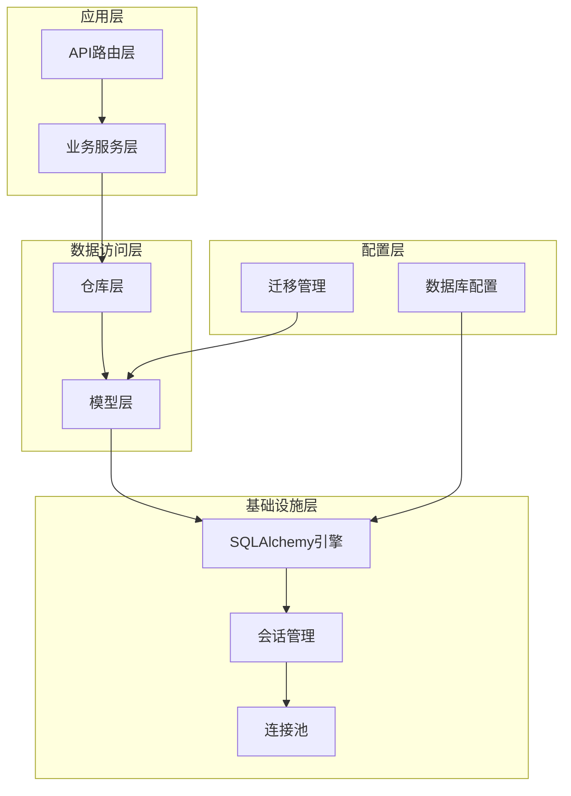
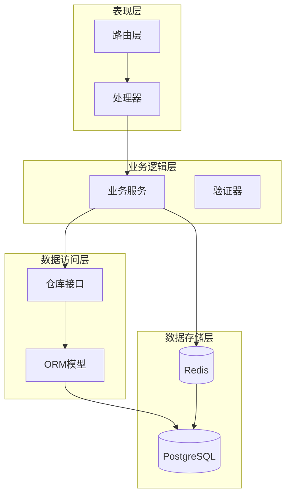
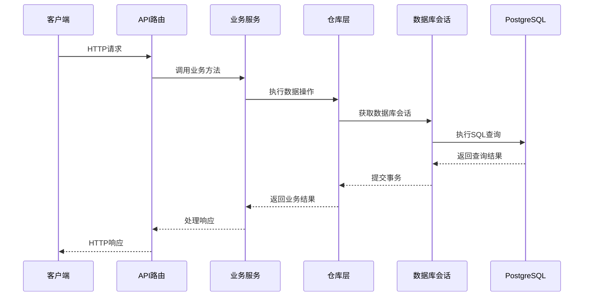
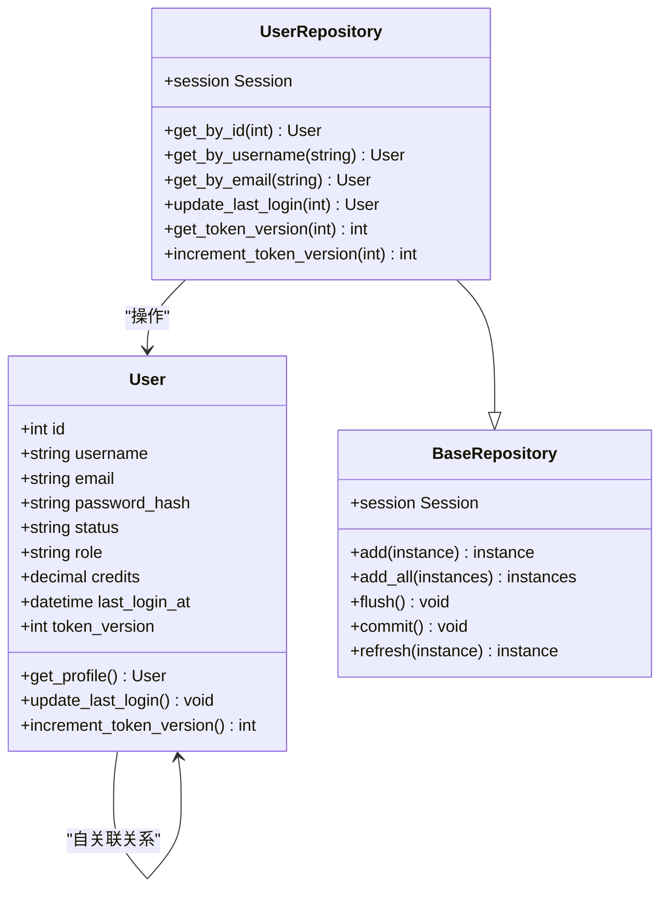
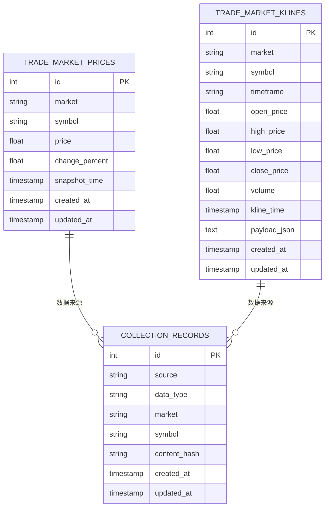
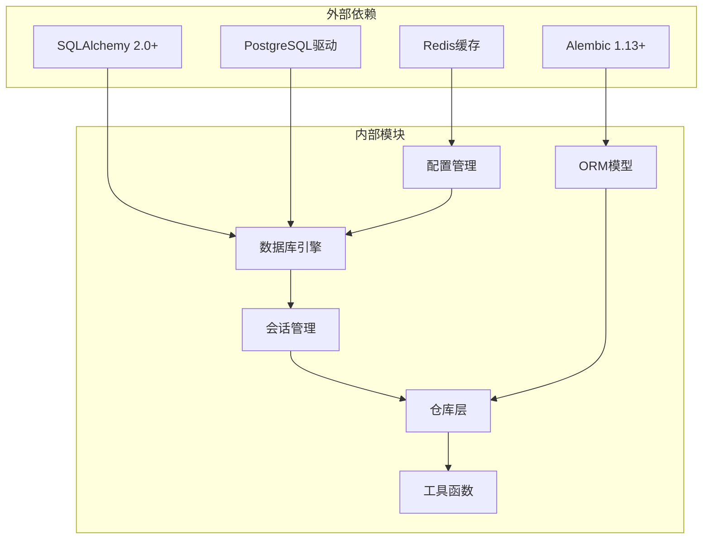

# 数据库现代化与ORM架构

<cite>
**本文档引用的文件**
- [engine.py](file://backend_api_python/app/database/engine.py)
- [session.py](file://backend_api_python/app/database/session.py)
- [database.py](file://backend_api_python/app/config/database.py)
- [env.py](file://backend_api_python/migrations/env.py)
- [base.py](file://backend_api_python/app/models/base.py)
- [__init__.py](file://backend_api_python/app/models/__init__.py)
- [base.py](file://backend_api_python/app/database/repositories/base.py)
- [001_initial_schema.py](file://backend_api_python/migrations/versions/001_initial_schema.py)
- [db.py](file://backend_api_python/app/utils/db.py)
- [db_postgres.py](file://backend_api_python/app/utils/db_postgres.py)
- [user.py](file://backend_api_python/app/models/user.py)
- [user_repository.py](file://backend_api_python/app/database/repositories/user_repository.py)
- [market.py](file://backend_api_python/app/models/market.py)
- [market_repository.py](file://backend_api_python/app/database/repositories/market_repository.py)
- [requirements.txt](file://backend_api_python/requirements.txt)
</cite>

## 目录
1. [简介](#简介)
2. [项目结构](#项目结构)
3. [核心组件](#核心组件)
4. [架构概览](#架构概览)
5. [详细组件分析](#详细组件分析)
6. [依赖关系分析](#依赖关系分析)
7. [性能考虑](#性能考虑)
8. [故障排除指南](#故障排除指南)
9. [结论](#结论)

## 简介

QuantDinger项目正在经历一次全面的数据库现代化转型，从传统的直接SQL查询转向现代的ORM（对象关系映射）架构。该项目采用SQLAlchemy作为主要的ORM框架，结合Alembic进行数据库迁移管理，实现了从传统连接池模式到现代ORM模式的平滑过渡。

本次文档深入分析了项目的数据库现代化架构，包括SQLAlchemy引擎配置、会话管理、模型定义、仓库模式实现以及完整的迁移策略。该架构支持多用户模式、连接池优化、事务管理和错误处理，为金融数据处理和交易系统提供了可靠的数据基础设施。

## 项目结构

项目采用了模块化的数据库架构设计，主要分为以下几个层次：

**图表来源**
- [engine.py:1-52](file://backend_api_python/app/database/engine.py#L1-L52)
- [session.py:1-26](file://backend_api_python/app/database/session.py#L1-L26)
- [database.py:1-105](file://backend_api_python/app/config/database.py#L1-L105)

**章节来源**
- [engine.py:1-52](file://backend_api_python/app/database/engine.py#L1-L52)
- [session.py:1-26](file://backend_api_python/app/database/session.py#L1-L26)
- [database.py:1-105](file://backend_api_python/app/config/database.py#L1-L105)

## 核心组件

### SQLAlchemy引擎配置

项目的核心是高度优化的SQLAlchemy引擎配置，支持多种数据库连接方式和连接池管理：

**连接池特性：**
- 支持最小连接数和最大连接数配置
- 连接超时和健康检查机制
- 自动预连接和连接复用
- 时区设置和连接参数优化

**环境变量配置：**
- `DB_POOL_MIN`: 最小连接数，默认5
- `DB_POOL_MAX`: 最大连接数，默认50  
- `DB_POOL_ACQUIRE_TIMEOUT`: 获取连接超时时间，默认10秒
- `DATABASE_URL`: 数据库连接字符串

### 会话管理

项目实现了基于上下文管理器的会话管理模式，确保事务的完整性和资源的正确释放：

**会话生命周期：**
- 自动事务提交和回滚
- 异常处理和资源清理
- 连接池集成和重用
- 线程安全保证

### 模型基类和混入

通过统一的模型基类和时间戳混入，项目实现了代码复用和标准化：

**TimestampMixin功能：**
- 自动创建时间和更新时间记录
- 服务器端默认值设置
- UTC时区支持
- 数据库级时间戳更新

**章节来源**
- [engine.py:19-47](file://backend_api_python/app/database/engine.py#L19-L47)
- [session.py:8-22](file://backend_api_python/app/database/session.py#L8-L22)
- [base.py:8-19](file://backend_api_python/app/models/base.py#L8-L19)

## 架构概览

项目采用分层架构设计，实现了清晰的关注点分离：

**图表来源**
- [user_repository.py:1-38](file://backend_api_python/app/database/repositories/user_repository.py#L1-L38)
- [market_repository.py:1-35](file://backend_api_python/app/database/repositories/market_repository.py#L1-L35)
- [database.py:38-104](file://backend_api_python/app/config/database.py#L38-L104)

### 数据流序列

**图表来源**
- [session.py:8-22](file://backend_api_python/app/database/session.py#L8-L22)
- [user_repository.py:8-38](file://backend_api_python/app/database/repositories/user_repository.py#L8-L38)

## 详细组件分析

### 用户模型与仓库

用户管理系统是项目的核心数据实体之一，展示了完整的ORM设计模式：

**图表来源**
- [user.py:28-77](file://backend_api_python/app/models/user.py#L28-L77)
- [user_repository.py:8-38](file://backend_api_python/app/database/repositories/user_repository.py#L8-L38)
- [base_repository.py:4-25](file://backend_api_python/app/database/repositories/base.py#L4-L25)

#### 用户模型特性

**字段设计：**
- 基础认证信息：用户名、邮箱、密码哈希
- 用户状态管理：账户状态、角色权限
- 信用积分系统：VIP等级和积分管理
- 个人资料：头像、昵称、生物信息
- 安全控制：登录时间、令牌版本

**关系映射：**
- 一对多关系：用户与各种业务实体
- 多对多关系：用户与角色
- 自引用关系：推荐系统

#### 仓库模式实现

**查询优化：**
- 使用select表达式进行精确查询
- func.lower()函数用于大小写不敏感搜索
- scalar_one_or_none()确保单一结果
- lazy="selectin"优化N+1查询问题

**事务管理：**
- 自动事务提交和回滚
- flush()确保数据持久化
- 异常处理保证数据一致性

**章节来源**
- [user.py:28-77](file://backend_api_python/app/models/user.py#L28-L77)
- [user_repository.py:8-38](file://backend_api_python/app/database/repositories/user_repository.py#L8-L38)

### 市场数据模型

市场数据处理是量化交易系统的核心，项目实现了完整的K线数据和实时价格管理：

**图表来源**
- [market.py:11-36](file://backend_api_python/app/models/market.py#L11-L36)
- [market_repository.py:8-35](file://backend_api_python/app/database/repositories/market_repository.py#L8-L35)

#### 数据模型设计

**MarketPrice模型：**
- 实时价格追踪：开盘价、最高价、最低价、收盘价
- 变化率计算：涨跌幅百分比
- 时间戳管理：快照时间和数据更新时间
- 数值精度控制：高精度浮点数存储

**MarketKline模型：**
- 多时间框架支持：1分钟到日线级别
- OHLCV数据结构：开盘、最高、最低、收盘、成交量
- JSON负载存储：扩展数据字段
- 时间索引优化：快速查询和分析

**CollectionRecord模型：**
- 内容去重：基于内容哈希的重复检测
- 数据溯源：来源标识和类型标记
- 关系建立：与具体市场数据的关联

**章节来源**
- [market.py:11-36](file://backend_api_python/app/models/market.py#L11-L36)
- [market_repository.py:8-35](file://backend_api_python/app/database/repositories/market_repository.py#L8-L35)

### 迁移管理架构

项目使用Alembic进行数据库结构变更管理，实现了版本化的数据库演进：

**图表来源**
- [env.py:24-45](file://backend_api_python/migrations/env.py#L24-L45)
- [001_initial_schema.py:93-107](file://backend_api_python/migrations/versions/001_initial_schema.py#L93-L107)

#### 迁移策略

**版本管理：**
- 单一版本策略：将多个表合并到一个版本中
- 依赖关系管理：确保表创建顺序正确
- 回滚能力：支持完整的降级操作

**自动化流程：**
- 模型注册：自动发现和注册所有ORM模型
- 表对比：智能检测缺失或多余的数据库表
- 安全执行：在事务中执行迁移操作

**章节来源**
- [env.py:1-46](file://backend_api_python/migrations/env.py#L1-L46)
- [001_initial_schema.py:1-107](file://backend_api_python/migrations/versions/001_initial_schema.py#L1-L107)

## 依赖关系分析

项目数据库架构的依赖关系体现了清晰的分层设计：

**图表来源**
- [requirements.txt:12-29](file://backend_api_python/requirements.txt#L12-L29)
- [engine.py:8-10](file://backend_api_python/app/database/engine.py#L8-L10)

### 核心依赖特性

**SQLAlchemy集成：**
- 版本兼容性：支持2.0+新特性
- 异步支持：future=True启用新式API
- 类型安全：Mypy友好的类型注解

**迁移工具：**
- 自动化：无需手动编写SQL
- 版本控制：Git友好的文本文件
- 安全性：事务保护的变更操作

**缓存集成：**
- 多级缓存：内存和Redis双重缓存
- TTL管理：灵活的过期时间配置
- 业务适配：针对不同数据类型的缓存策略

**章节来源**
- [requirements.txt:1-53](file://backend_api_python/requirements.txt#L1-L53)
- [database.py:38-104](file://backend_api_python/app/config/database.py#L38-L104)

## 性能考虑

项目在数据库性能方面采用了多项优化策略：

### 连接池优化

**动态连接池：**
- 自适应连接数量：根据负载动态调整
- 健康检查：定期验证连接有效性
- 超时处理：优雅处理连接获取超时
- 线程安全：支持多线程并发访问

**连接复用：**
- 连接池复用：避免频繁连接建立
- 事务持久化：长事务的连接保持
- 资源清理：及时释放空闲连接

### 查询优化

**批量操作：**
- 批量插入：add_all()减少数据库往返
- 批量查询：selectin加载优化N+1问题
- 原子操作：单事务内的批量处理

**索引策略：**
- 高频查询字段索引
- 复合索引优化复杂查询
- 唯一约束保证数据完整性

### 缓存策略

**多层缓存架构：**
- 应用层缓存：进程内缓存热点数据
- 分布式缓存：Redis集群缓存共享数据
- TTL管理：智能过期策略
- 缓存失效：基于数据变更的主动失效

## 故障排除指南

### 连接问题诊断

**常见连接错误：**
- `DATABASE_URL`环境变量未设置
- 数据库服务不可达
- 认证凭据错误
- 连接池耗尽

**诊断步骤：**
1. 验证数据库URL格式正确性
2. 检查网络连通性和防火墙设置
3. 确认数据库用户权限
4. 监控连接池使用情况

### 事务管理

**事务异常处理：**
- 自动回滚机制
- 异常传播和日志记录
- 资源清理保证
- 幂等性设计

**最佳实践：**
- 短事务原则
- 死锁预防
- 错误重试机制
- 事务边界清晰

### 性能监控

**关键指标：**
- 连接池利用率
- 查询响应时间
- 缓存命中率
- 错误率统计

**监控建议：**
- 实时告警设置
- 性能基准测试
- 压力测试执行
- 指标可视化展示

**章节来源**
- [db.py:62-78](file://backend_api_python/app/utils/db.py#L62-L78)
- [db_postgres.py:184-235](file://backend_api_python/app/utils/db_postgres.py#L184-L235)

## 结论

QuantDinger项目的数据库现代化架构展现了从传统数据库访问模式向现代ORM架构的成功转型。通过SQLAlchemy的深度集成、Alembic的迁移管理、以及精心设计的仓库模式，项目实现了：

**技术优势：**
- 类型安全的ORM操作
- 自动化的数据库迁移
- 高效的连接池管理
- 完善的事务处理
- 灵活的缓存策略

**架构特点：**
- 清晰的分层设计
- 良好的可扩展性
- 优秀的性能表现
- 完善的错误处理
- 详细的文档支持

这套架构为金融数据处理和交易系统提供了坚实的技术基础，支持高并发、低延迟的数据访问需求，同时保持了代码的可维护性和可扩展性。随着项目的持续发展，这套数据库架构将继续支撑QuantDinger在量化交易领域的创新和发展。