# 数据库现代化与ORM架构

<cite>
**本文档引用的文件**
- [engine.py](file://backend/app/database/engine.py)
- [session.py](file://backend/app/database/session.py)
- [database.py](file://backend/app/config/database.py)
- [env.py](file://backend/migrations/env.py)
- [base.py](file://backend/app/models/base.py)
- [__init__.py](file://backend/app/models/__init__.py)
- [base.py](file://backend/app/database/repositories/base.py)
- [market_symbol_repository.py](file://backend/app/database/repositories/market_symbol_repository.py)
- [order_repository.py](file://backend/app/database/repositories/order_repository.py)
- [portfolio_repository.py](file://backend/app/database/repositories/portfolio_repository.py)
- [trade_repository.py](file://backend/app/database/repositories/trade_repository.py)
- [strategy_repository.py](file://backend/app/database/repositories/strategy_repository.py)
- [polymarket_repository.py](file://backend/app/database/repositories/polymarket_repository.py)
- [market_symbol.py](file://backend/app/models/market_symbol.py)
- [order.py](file://backend/app/models/order.py)
- [trading.py](file://backend/app/models/trading.py)
- [strategy.py](file://backend/app/models/strategy.py)
- [polymarket.py](file://backend/app/models/polymarket.py)
- [001_initial_schema.py](file://backend/migrations/versions/001_initial_schema.py)
- [db.py](file://backend/app/utils/db.py)
- [db_postgres.py](file://backend/app/utils/db_postgres.py)
- [requirements.txt](file://backend/requirements.txt)
</cite>

## 更新摘要
**所做更改**
- 新增了六个核心仓库类的详细分析：MarketSymbolRepository、OrderRepository、PortfolioRepository、TradeRepository、StrategyRepository、PolymarketRepository
- 更新了ORM架构图以反映新的仓库模式设计
- 增强了交易系统和策略管理的数据库访问层说明
- 添加了多市场符号管理和多币种交易支持的架构说明
- 更新了Polymarket数据模型和AI分析功能的实现细节

## 目录
1. [简介](#简介)
2. [项目结构](#项目结构)
3. [核心组件](#核心组件)
4. [架构概览](#架构概览)
5. [详细组件分析](#详细组件分析)
6. [依赖关系分析](#依赖关系分析)
7. [性能考虑](#性能考虑)
8. [故障排除指南](#故障排除指南)
9. [结论](#结论)

## 简介

QuantDinger项目正在进行全面的数据库现代化转型，从传统的直接SQL查询转向现代的ORM（对象关系映射）架构。该项目采用SQLAlchemy作为主要的ORM框架，结合Alembic进行数据库迁移管理，实现了从传统连接池模式到现代ORM模式的平滑过渡。

本次更新重点关注基于Applied Changes的数据库现代化架构重构，重点反映了从原始SQL查询到ORM Repository模式的重大转变。新架构引入了专门的仓库类来处理不同业务领域的数据访问需求，包括市场符号管理、订单处理、投资组合监控、交易记录、策略管理和Polymarket数据分析等核心功能。

该架构支持多用户模式、连接池优化、事务管理和错误处理，为金融数据处理和交易系统提供了可靠的数据基础设施。新的仓库模式实现了更好的关注点分离，每个仓库类专注于特定的业务领域，提高了代码的可维护性和可扩展性。

## 项目结构

项目采用了高度模块化的数据库架构设计，主要分为以下几个层次：

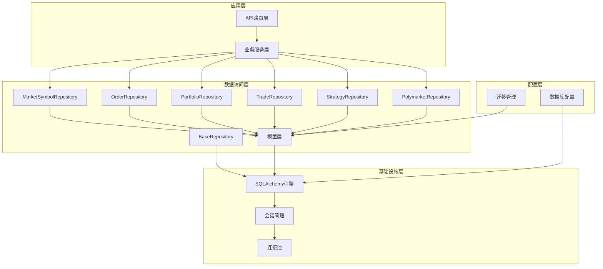

**图表来源**
- [market_symbol_repository.py:8-87](file://backend/app/database/repositories/market_symbol_repository.py#L8-L87)
- [order_repository.py:10-150](file://backend/app/database/repositories/order_repository.py#L10-L150)
- [portfolio_repository.py:9-81](file://backend/app/database/repositories/portfolio_repository.py#L9-L81)
- [trade_repository.py:10-79](file://backend/app/database/repositories/trade_repository.py#L10-L79)
- [strategy_repository.py:10-128](file://backend/app/database/repositories/strategy_repository.py#L10-L128)
- [polymarket_repository.py:13-132](file://backend/app/database/repositories/polymarket_repository.py#L13-L132)

**章节来源**
- [engine.py:1-52](file://backend/app/database/engine.py#L1-L52)
- [session.py:1-26](file://backend/app/database/session.py#L1-L26)
- [database.py:1-105](file://backend/app/config/database.py#L1-L105)

## 核心组件

### SQLAlchemy引擎配置

项目的核心是高度优化的SQLAlchemy引擎配置，支持多种数据库连接方式和连接池管理：

**连接池特性：**
- 支持最小连接数和最大连接数配置
- 连接超时和健康检查机制
- 自动预连接和连接复用
- 时区设置和连接参数优化

**环境变量配置：**
- `DB_POOL_MIN`: 最小连接数，默认5
- `DB_POOL_MAX`: 最大连接数，默认50  
- `DB_POOL_ACQUIRE_TIMEOUT`: 获取连接超时时间，默认10秒
- `DATABASE_URL`: 数据库连接字符串

### 会话管理

项目实现了基于上下文管理器的会话管理模式，确保事务的完整性和资源的正确释放：

**会话生命周期：**
- 自动事务提交和回滚
- 异常处理和资源清理
- 连接池集成和重用
- 线程安全保证

### 基础仓库类

新的仓库模式引入了统一的基础仓库类，提供通用的数据访问功能：

**BaseRepository功能：**
- 统一的会话管理
- 基本的CRUD操作封装
- 事务处理和数据持久化
- 资源清理和异常处理

**章节来源**
- [engine.py:19-47](file://backend/app/database/engine.py#L19-L47)
- [session.py:8-22](file://backend/app/database/session.py#L8-L22)
- [base.py:4-25](file://backend/app/database/repositories/base.py#L4-L25)

## 架构概览

项目采用分层架构设计，实现了清晰的关注点分离。新的仓库模式进一步强化了这种分层结构：

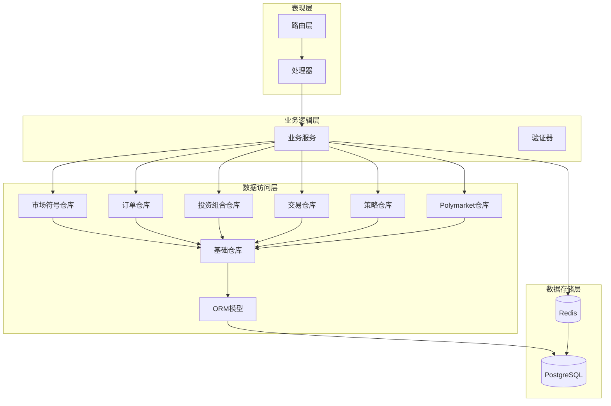

**图表来源**
- [market_symbol_repository.py:8-87](file://backend/app/database/repositories/market_symbol_repository.py#L8-L87)
- [order_repository.py:10-150](file://backend/app/database/repositories/order_repository.py#L10-L150)
- [portfolio_repository.py:9-81](file://backend/app/database/repositories/portfolio_repository.py#L9-L81)
- [trade_repository.py:10-79](file://backend/app/database/repositories/trade_repository.py#L10-L79)
- [strategy_repository.py:10-128](file://backend/app/database/repositories/strategy_repository.py#L10-L128)
- [polymarket_repository.py:13-132](file://backend/app/database/repositories/polymarket_repository.py#L13-L132)

### 数据流序列

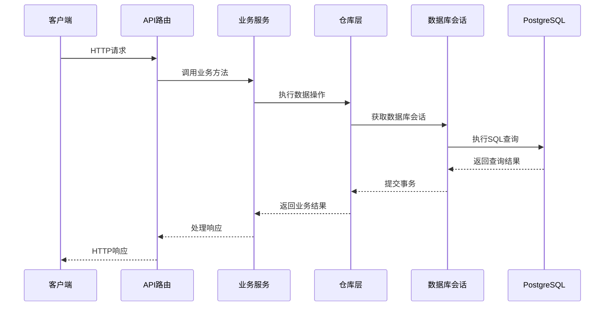

**图表来源**
- [session.py:8-22](file://backend/app/database/session.py#L8-L22)
- [market_symbol_repository.py:8-87](file://backend/app/database/repositories/market_symbol_repository.py#L8-L87)

## 详细组件分析

### 市场符号管理仓库

MarketSymbolRepository是新引入的核心仓库类，专门负责多市场符号的管理：

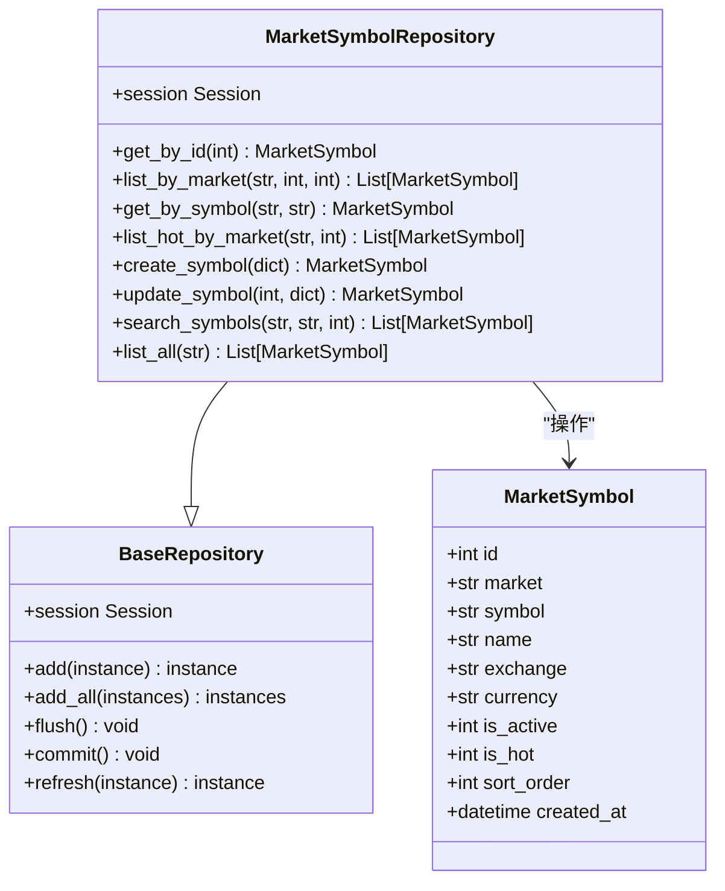

**图表来源**
- [market_symbol_repository.py:8-87](file://backend/app/database/repositories/market_symbol_repository.py#L8-L87)
- [market_symbol.py:10-28](file://backend/app/models/market_symbol.py#L10-L28)
- [base.py:4-25](file://backend/app/database/repositories/base.py#L4-L25)

#### 市场符号模型特性

**字段设计：**
- 市场标识：支持多市场类型（Crypto、Forex、Indices等）
- 符号管理：唯一约束确保符号在市场内的唯一性
- 状态控制：活跃状态和热门标记
- 排序机制：支持自定义排序优先级
- 多语言支持：名称和交易所信息

**索引优化：**
- 唯一约束：市场+符号的复合唯一性
- 性能索引：市场字段和热门标记的联合索引
- 查询优化：按市场分类和排序的索引设计

**仓库功能：**
- 精确查询：按ID和符号的快速检索
- 条件过滤：支持活跃状态和热门标记筛选
- 模糊搜索：支持符号和名称的模糊匹配
- 分页查询：支持大规模数据的分页处理

**章节来源**
- [market_symbol_repository.py:8-87](file://backend/app/database/repositories/market_symbol_repository.py#L8-L87)
- [market_symbol.py:10-28](file://backend/app/models/market_symbol.py#L10-L28)

### 订单处理仓库

OrderRepository是交易系统的核心仓库类，处理挂单和快捷交易：

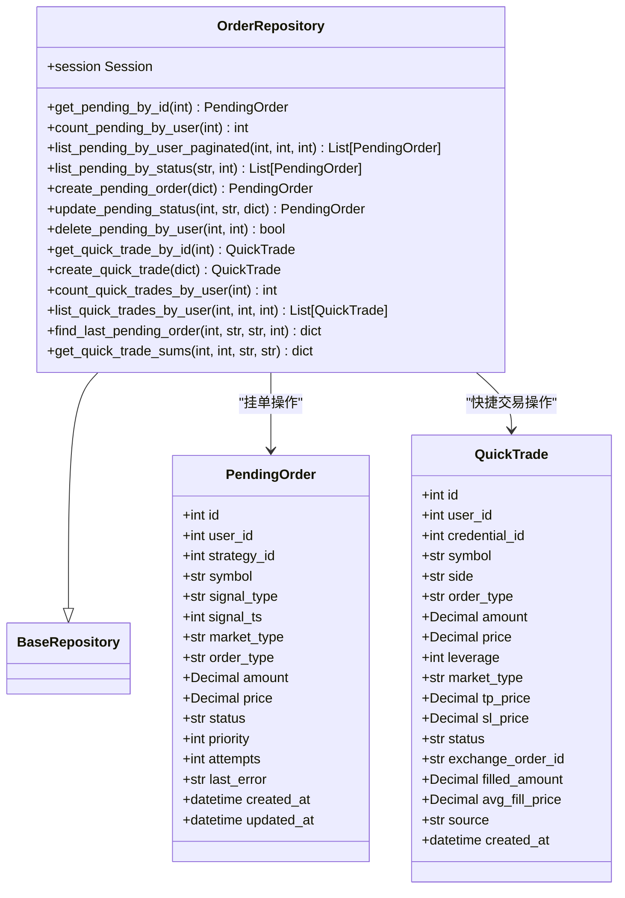

**图表来源**
- [order_repository.py:10-150](file://backend/app/database/repositories/order_repository.py#L10-L150)
- [order.py:21-92](file://backend/app/models/order.py#L21-L92)
- [base.py:4-25](file://backend/app/database/repositories/base.py#L4-L25)

#### 订单模型设计

**挂单管理：**
- 状态跟踪：pending、processing、failed等状态管理
- 优先级调度：支持优先级队列处理
- 重试机制：最大尝试次数和错误记录
- 信号去重：基于信号类型和时间戳的去重检查

**快捷交易：**
- 多交易所支持：支持多个加密货币交易所
- 止损止盈：支持TP/SL订单设置
- 快速执行：简化交易流程
- 交易历史：完整的交易记录追踪

**高级功能：**
- 交易去重：防止重复下单的智能检测
- 成交汇总：按用户和资产的成交统计
- 分页查询：支持大量订单的历史查询

**章节来源**
- [order_repository.py:10-150](file://backend/app/database/repositories/order_repository.py#L10-L150)
- [order.py:21-92](file://backend/app/models/order.py#L21-L92)

### 投资组合管理仓库

PortfolioRepository提供投资组合和挂单的综合管理：

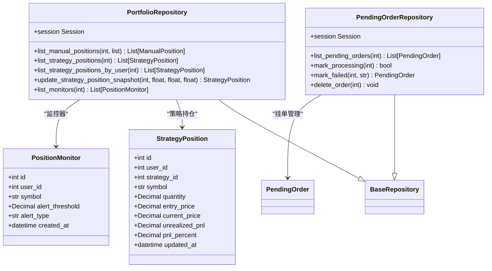

**图表来源**
- [portfolio_repository.py:9-81](file://backend/app/database/repositories/portfolio_repository.py#L9-L81)
- [base.py:4-25](file://backend/app/database/repositories/base.py#L4-L25)

#### 投资组合功能

**策略持仓管理：**
- 实时价格更新：支持持仓的实时价值计算
- 盈亏监控：浮动盈亏和收益率计算
- 用户关联：支持按用户维度的持仓查询
- 性能排序：按最后更新时间排序

**挂单处理：**
- 状态转换：挂单状态的生命周期管理
- 失败处理：错误信息的记录和追踪
- 批量操作：支持挂单的批量删除

**章节来源**
- [portfolio_repository.py:9-81](file://backend/app/database/repositories/portfolio_repository.py#L9-L81)

### 交易记录仓库

TradeRepository专门处理策略交易的记录和统计：

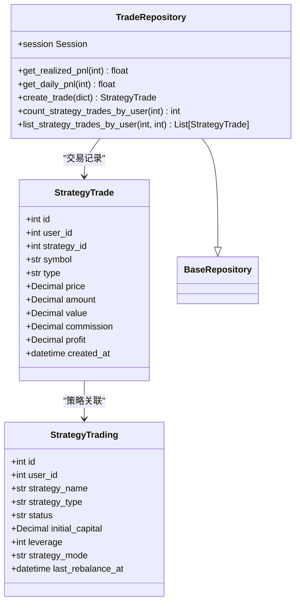

**图表来源**
- [trade_repository.py:10-79](file://backend/app/database/repositories/trade_repository.py#L10-L79)
- [trading.py:34-57](file://backend/app/models/trading.py#L34-L57)
- [strategy.py:32-68](file://backend/app/models/strategy.py#L32-L68)

#### 交易统计功能

**收益计算：**
- 实现收益：已实现的利润减去手续费
- 日内收益：当日的交易收益统计
- 精确计算：使用Decimal确保财务计算精度

**交易历史：**
- 用户关联：支持按用户维度的交易查询
- 策略关联：支持按策略维度的交易统计
- 时间过滤：支持日期范围的交易查询

**章节来源**
- [trade_repository.py:10-79](file://backend/app/database/repositories/trade_repository.py#L10-L79)
- [trading.py:34-57](file://backend/app/models/trading.py#L34-L57)

### 策略管理仓库

StrategyRepository提供策略的完整生命周期管理：

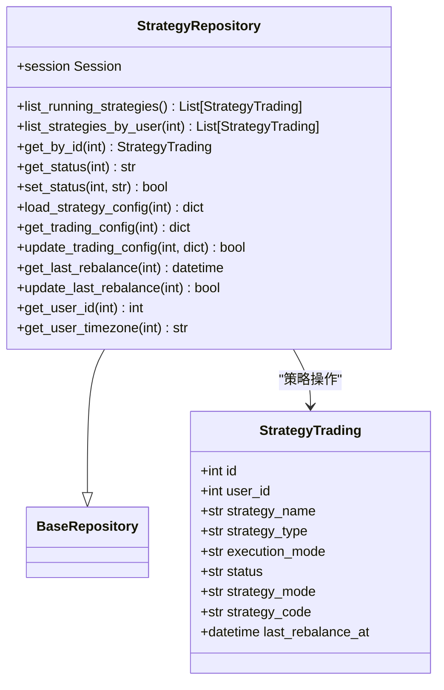

**图表来源**
- [strategy_repository.py:10-128](file://backend/app/database/repositories/strategy_repository.py#L10-L128)
- [strategy.py:32-68](file://backend/app/models/strategy.py#L32-L68)

#### 策略配置管理

**配置解析：**
- JSON字段处理：支持复杂的JSON配置结构
- 类型转换：自动处理数据类型转换
- 默认值处理：确保配置的完整性

**运行监控：**
- 状态管理：策略运行状态的实时监控
- 重平衡：支持策略的定期重平衡
- 用户关联：支持按用户维度的策略管理

**章节来源**
- [strategy_repository.py:10-128](file://backend/app/database/repositories/strategy_repository.py#L10-L128)
- [strategy.py:32-68](file://backend/app/models/strategy.py#L32-L68)

### Polymarket数据分析仓库

PolymarketRepository处理去中心化预测市场的数据管理：

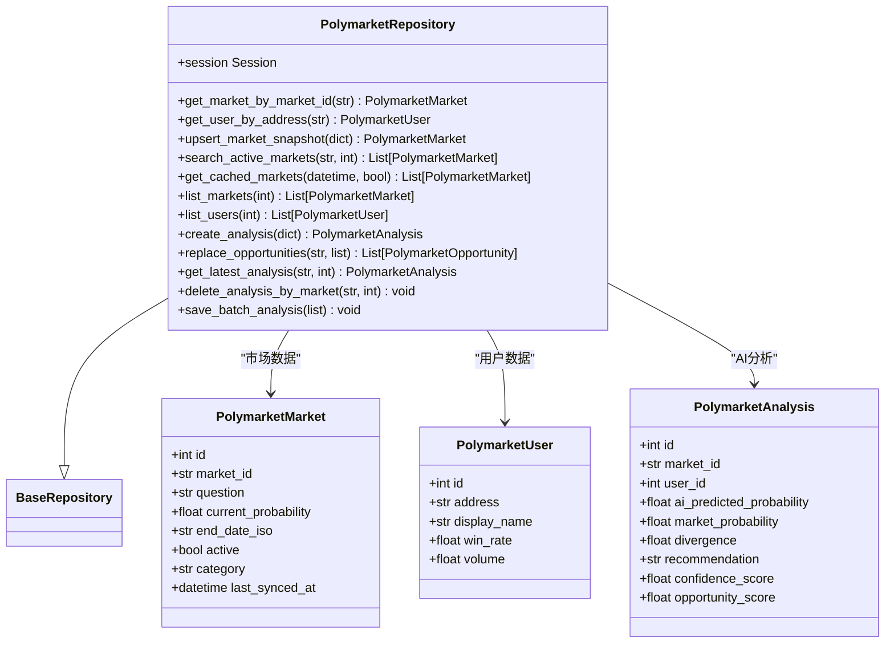

**图表来源**
- [polymarket_repository.py:13-132](file://backend/app/database/repositories/polymarket_repository.py#L13-L132)
- [polymarket.py:16-70](file://backend/app/models/polymarket.py#L16-L70)

#### Polymarket数据模型

**市场数据管理：**
- 市场快照：支持市场的Upsert操作
- 活跃市场：支持活跃状态的市场查询
- 缓存管理：支持基于时间的缓存查询

**AI分析功能：**
- 批量分析：支持批量AI分析的保存
- 去重处理：自动删除旧的分析记录
- 关联分析：支持市场和用户维度的分析

**用户管理：**
- 用户追踪：基于地址的用户识别
- 绩效统计：支持胜率和交易量统计
- 数据同步：支持用户数据的实时更新

**章节来源**
- [polymarket_repository.py:13-132](file://backend/app/database/repositories/polymarket_repository.py#L13-L132)
- [polymarket.py:16-70](file://backend/app/models/polymarket.py#L16-L70)

### 迁移管理架构

项目使用Alembic进行数据库结构变更管理，实现了版本化的数据库演进：

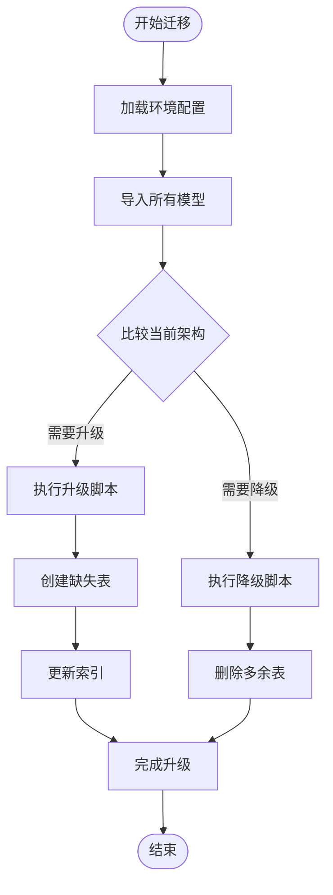

**图表来源**
- [env.py:24-45](file://backend/migrations/env.py#L24-L45)
- [001_initial_schema.py:93-107](file://backend/migrations/versions/001_initial_schema.py#L93-L107)

#### 迁移策略

**版本管理：**
- 单一版本策略：将多个表合并到一个版本中
- 依赖关系管理：确保表创建顺序正确
- 回滚能力：支持完整的降级操作

**自动化流程：**
- 模型注册：自动发现和注册所有ORM模型
- 表对比：智能检测缺失或多余的数据库表
- 安全执行：在事务中执行迁移操作

**章节来源**
- [env.py:1-46](file://backend/migrations/env.py#L1-L46)
- [001_initial_schema.py:1-107](file://backend/migrations/versions/001_initial_schema.py#L1-L107)

## 依赖关系分析

项目数据库架构的依赖关系体现了清晰的分层设计和新的仓库模式：

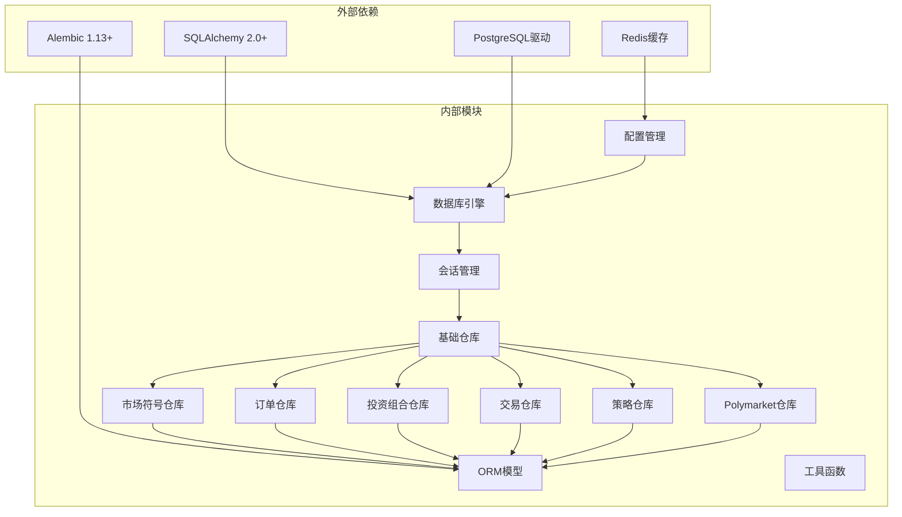

**图表来源**
- [requirements.txt:12-29](file://backend/requirements.txt#L12-L29)
- [engine.py:8-10](file://backend/app/database/engine.py#L8-L10)

### 核心依赖特性

**SQLAlchemy集成：**
- 版本兼容性：支持2.0+新特性
- 异步支持：future=True启用新式API
- 类型安全：Mypy友好的类型注解

**迁移工具：**
- 自动化：无需手动编写SQL
- 版本控制：Git友好的文本文件
- 安全性：事务保护的变更操作

**缓存集成：**
- 多级缓存：内存和Redis双重缓存
- TTL管理：灵活的过期时间配置
- 业务适配：针对不同数据类型的缓存策略

**章节来源**
- [requirements.txt:1-53](file://backend/requirements.txt#L1-L53)
- [database.py:38-104](file://backend/app/config/database.py#L38-L104)

## 性能考虑

项目在数据库性能方面采用了多项优化策略，特别是新的仓库模式带来的性能提升：

### 连接池优化

**动态连接池：**
- 自适应连接数量：根据负载动态调整
- 健康检查：定期验证连接有效性
- 超时处理：优雅处理连接获取超时
- 线程安全：支持多线程并发访问

**连接复用：**
- 连接池复用：避免频繁连接建立
- 事务持久化：长事务的连接保持
- 资源清理：及时释放空闲连接

### 查询优化

**批量操作：**
- 批量插入：add_all()减少数据库往返
- 批量查询：selectin加载优化N+1问题
- 原子操作：单事务内的批量处理

**索引策略：**
- 高频查询字段索引
- 复合索引优化复杂查询
- 唯一约束保证数据完整性

### 缓存策略

**多层缓存架构：**
- 应用层缓存：进程内缓存热点数据
- 分布式缓存：Redis集群缓存共享数据
- TTL管理：智能过期策略
- 缓存失效：基于数据变更的主动失效

**仓库层优化：**
- 查询缓存：常用查询结果的缓存
- 结果集优化：分页和限制的合理使用
- 连接池优化：仓库实例的连接复用

## 故障排除指南

### 连接问题诊断

**常见连接错误：**
- `DATABASE_URL`环境变量未设置
- 数据库服务不可达
- 认证凭据错误
- 连接池耗尽

**诊断步骤：**
1. 验证数据库URL格式正确性
2. 检查网络连通性和防火墙设置
3. 确认数据库用户权限
4. 监控连接池使用情况

### 事务管理

**事务异常处理：**
- 自动回滚机制
- 异常传播和日志记录
- 资源清理保证
- 幂等性设计

**最佳实践：**
- 短事务原则
- 死锁预防
- 错误重试机制
- 事务边界清晰

### 性能监控

**关键指标：**
- 连接池利用率
- 查询响应时间
- 缓存命中率
- 错误率统计

**监控建议：**
- 实时告警设置
- 性能基准测试
- 压力测试执行
- 指标可视化展示

**章节来源**
- [db.py:62-78](file://backend/app/utils/db.py#L62-L78)
- [db_postgres.py:184-235](file://backend/app/utils/db_postgres.py#L184-L235)

## 结论

QuantDinger项目的数据库现代化架构展现了从传统数据库访问模式向现代ORM架构的成功转型。通过SQLAlchemy的深度集成、Alembic的迁移管理、以及精心设计的仓库模式，项目实现了显著的技术进步：

**技术优势：**
- 类型安全的ORM操作
- 自动化的数据库迁移
- 高效的连接池管理
- 完善的事务处理
- 灵活的缓存策略
- 专业的仓库模式设计

**架构特点：**
- 清晰的分层设计
- 良好的可扩展性
- 优秀的性能表现
- 完善的错误处理
- 详细的文档支持
- 专业化的业务领域划分

**新增功能的价值：**
- **市场符号管理**：支持多市场符号的统一管理
- **订单处理优化**：专业的挂单和快捷交易处理
- **投资组合监控**：实时的投资组合状态跟踪
- **交易统计分析**：精确的收益计算和历史查询
- **策略生命周期管理**：完整的策略配置和监控
- **Polymarket数据分析**：去中心化市场的AI分析支持

这套架构为金融数据处理和交易系统提供了坚实的技术基础，支持高并发、低延迟的数据访问需求，同时保持了代码的可维护性和可扩展性。新的仓库模式特别适合量化交易系统的复杂数据访问需求，为QuantDinger在量化交易领域的创新和发展奠定了坚实的数据库基础。