# 数据库现代化与ORM架构

<cite>
**本文档引用的文件**
- [engine.py](file://backend/app/database/engine.py)
- [session.py](file://backend/app/database/session.py)
- [database.py](file://backend/app/config/database.py)
- [env.py](file://backend/migrations/env.py)
- [base.py](file://backend/app/models/base.py)
- [base.py](file://backend/app/database/repositories/base.py)
- [sync_repository.py](file://backend/app/database/repositories/sync_repository.py)
- [sync_task.py](file://backend/app/models/sync_task.py)
- [sync_scheduler.py](file://backend/app/services/sync_scheduler.py)
- [sync.py](file://backend/app/routes/sync.py)
- [quality_monitor.py](file://backend/app/graph/quality_monitor.py)
- [graph_config.py](file://backend/app/config/graph_config.py)
- [graphiti_gateway.py](file://backend/app/graph/graphiti_gateway.py)
- [001_initial_schema.py](file://backend/migrations/versions/001_initial_schema.py)
- [002_sync_timestamp_columns.py](file://backend/migrations/versions/002_sync_timestamp_columns.py)
- [db.py](file://backend/app/utils/db.py)
- [db_postgres.py](file://backend/app/utils/db_postgres.py)
- [requirements.txt](file://backend/requirements.txt)
</cite>

## 更新摘要
**所做更改**
- 新增了同步作业管理系统的设计分析，包括SyncScheduler、SyncRepository和SyncTaskExecutor架构
- 增加了执行历史追踪机制的详细说明，涵盖SyncRun模型和运行状态管理
- 新增了知识图谱质量监控系统，包括GraphQualityMonitor和阈值控制系统
- 更新了数据库迁移架构，增加了002_sync_timestamp_columns迁移版本
- 扩展了仓库模式以支持新的同步和监控功能
- 增强了数据库基础设施的可观测性和可维护性

## 目录
1. [简介](#简介)
2. [项目结构](#项目结构)
3. [核心组件](#核心组件)
4. [架构概览](#架构概览)
5. [详细组件分析](#详细组件分析)
6. [同步作业管理系统](#同步作业管理系统)
7. [执行历史追踪机制](#执行历史追踪机制)
8. [知识图谱质量监控](#知识图谱质量监控)
9. [数据库迁移架构](#数据库迁移架构)
10. [依赖关系分析](#依赖关系分析)
11. [性能考虑](#性能考虑)
12. [故障排除指南](#故障排除指南)
13. [结论](#结论)

## 简介

QuantDinger项目正在进行全面的数据库现代化转型，从传统的直接SQL查询转向现代的ORM（对象关系映射）架构。该项目采用SQLAlchemy作为主要的ORM框架，结合Alembic进行数据库迁移管理，实现了从传统连接池模式到现代ORM模式的平滑过渡。

本次更新重点关注基于Applied Changes的数据库基础设施重大更新，特别是新增的同步作业管理系统、执行历史追踪机制和知识图谱质量监控系统。这些新增功能为项目提供了更强大的数据管理能力和系统可观测性。

新架构引入了专门的仓库类来处理不同业务领域的数据访问需求，包括指标社区管理、市场符号管理、订单处理、投资组合监控、交易记录、策略管理、Polymarket数据分析、**同步作业管理**和**知识图谱质量监控**等核心功能。

该架构支持多用户模式、连接池优化、事务管理和错误处理，为金融数据处理和交易系统提供了可靠的数据基础设施。新的仓库模式实现了更好的关注点分离，每个仓库类专注于特定的业务领域，提高了代码的可维护性和可扩展性。

## 项目结构

项目采用了高度模块化的数据库架构设计，主要分为以下几个层次：

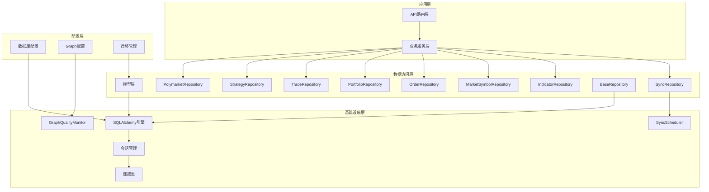
```mermaid
graph TB
subgraph "应用层"
API[API路由层]
Services[业务服务层]
end
subgraph "数据访问层"
SyncRepo[SyncRepository]
IndicatorRepo[IndicatorRepository]
MarketRepo[MarketSymbolRepository]
OrderRepo[OrderRepository]
PortfolioRepo[PortfolioRepository]
TradeRepo[TradeRepository]
StrategyRepo[StrategyRepository]
PolymarketRepo[PolymarketRepository]
BaseRepo[BaseRepository]
Models[模型层]
end
subgraph "基础设施层"
Engine[SQLAlchemy引擎]
Session[会话管理]
Pool[连接池]
Scheduler[SyncScheduler]
QualityMonitor[GraphQualityMonitor]
end
subgraph "配置层"
Config[数据库配置]
GraphConfig[Graph配置]
Migrations[迁移管理]
end
API --> Services
Services --> SyncRepo
Services --> IndicatorRepo
Services --> MarketRepo
Services --> OrderRepo
Services --> PortfolioRepo
Services --> TradeRepo
Services --> StrategyRepo
Services --> PolymarketRepo
SyncRepo --> Scheduler
BaseRepo --> Engine
Models --> Engine
Engine --> Session
Session --> Pool
Config --> Engine
GraphConfig --> QualityMonitor
Migrations --> Models
```

**图表来源**
- [sync_repository.py:10-115](file://backend/app/database/repositories/sync_repository.py#L10-L115)
- [sync_scheduler.py:217-307](file://backend/app/services/sync_scheduler.py#L217-L307)
- [quality_monitor.py:11-78](file://backend/app/graph/quality_monitor.py#L11-L78)

**章节来源**
- [engine.py:1-52](file://backend/app/database/engine.py#L1-L52)
- [session.py:1-26](file://backend/app/database/session.py#L1-L26)
- [database.py:1-105](file://backend/app/config/database.py#L1-L105)

## 核心组件

### SQLAlchemy引擎配置

项目的核心是高度优化的SQLAlchemy引擎配置，支持多种数据库连接方式和连接池管理：

**连接池特性：**
- 支持最小连接数和最大连接数配置
- 连接超时和健康检查机制
- 自动预连接和连接复用
- 时区设置和连接参数优化

**环境变量配置：**
- `DB_POOL_MIN`: 最小连接数，默认5
- `DB_POOL_MAX`: 最大连接数，默认50  
- `DB_POOL_ACQUIRE_TIMEOUT`: 获取连接超时时间，默认10秒
- `DATABASE_URL`: 数据库连接字符串

### 会话管理

项目实现了基于上下文管理器的会话管理模式，确保事务的完整性和资源的正确释放：

**会话生命周期：**
- 自动事务提交和回滚
- 异常处理和资源清理
- 连接池集成和重用
- 线程安全保证

### 基础仓库类

新的仓库模式引入了统一的基础仓库类，提供通用的数据访问功能：

**BaseRepository功能：**
- 统一的会话管理
- 基本的CRUD操作封装
- 事务处理和数据持久化
- 资源清理和异常处理

**章节来源**
- [engine.py:19-47](file://backend/app/database/engine.py#L19-L47)
- [session.py:8-22](file://backend/app/database/session.py#L8-L22)
- [base.py:4-25](file://backend/app/database/repositories/base.py#L4-L25)

## 架构概览

项目采用分层架构设计，实现了清晰的关注点分离。新的仓库模式进一步强化了这种分层结构：

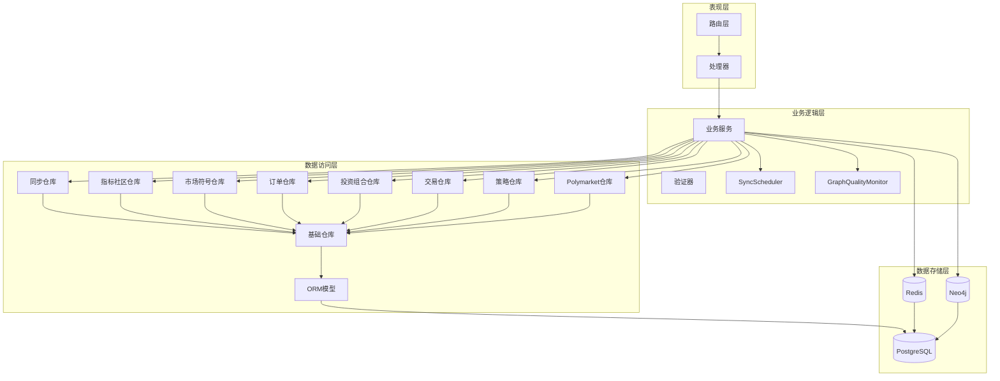
```mermaid
graph TD
subgraph "表现层"
Routes[路由层]
Handlers[处理器]
end
subgraph "业务逻辑层"
Business[业务服务]
Validators[验证器]
Scheduler[SyncScheduler]
QualityMonitor[GraphQualityMonitor]
end
subgraph "数据访问层"
SyncRepo[同步仓库]
IndicatorRepo[指标社区仓库]
MarketRepo[市场符号仓库]
OrderRepo[订单仓库]
PortfolioRepo[投资组合仓库]
TradeRepo[交易仓库]
StrategyRepo[策略仓库]
PolymarketRepo[Polymarket仓库]
BaseRepo[基础仓库]
Model[ORM模型]
end
subgraph "数据存储层"
DB[(PostgreSQL)]
Cache[(Redis)]
GraphDB[(Neo4j)]
end
Routes --> Handlers
Handlers --> Business
Business --> SyncRepo
Business --> IndicatorRepo
Business --> MarketRepo
Business --> OrderRepo
Business --> PortfolioRepo
Business --> TradeRepo
Business --> StrategyRepo
Business --> PolymarketRepo
Business --> Scheduler
Business --> QualityMonitor
SyncRepo --> BaseRepo
IndicatorRepo --> BaseRepo
MarketRepo --> BaseRepo
OrderRepo --> BaseRepo
PortfolioRepo --> BaseRepo
TradeRepo --> BaseRepo
StrategyRepo --> BaseRepo
PolymarketRepo --> BaseRepo
BaseRepo --> Model
Model --> DB
Business --> Cache
Cache --> DB
Business --> GraphDB
GraphDB --> DB
```

**图表来源**
- [sync_scheduler.py:217-307](file://backend/app/services/sync_scheduler.py#L217-L307)
- [quality_monitor.py:11-78](file://backend/app/graph/quality_monitor.py#L11-L78)

### 数据流序列

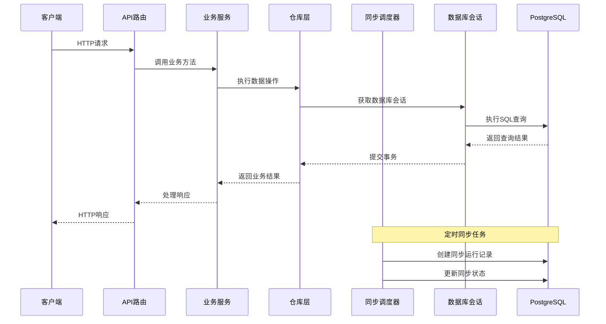
```mermaid
sequenceDiagram
participant Client as 客户端
participant API as API路由
participant Service as 业务服务
participant Repo as 仓库层
participant Scheduler as 同步调度器
participant Session as 数据库会话
participant DB as PostgreSQL
Client->>API : HTTP请求
API->>Service : 调用业务方法
Service->>Repo : 执行数据操作
Repo->>Session : 获取数据库会话
Session->>DB : 执行SQL查询
DB-->>Session : 返回查询结果
Session-->>Repo : 提交事务
Repo-->>Service : 返回业务结果
Service-->>API : 处理响应
API-->>Client : HTTP响应
Note over Scheduler,DB : 定时同步任务
Scheduler->>DB : 创建同步运行记录
Scheduler->>DB : 更新同步状态
```

**图表来源**
- [session.py:8-22](file://backend/app/database/session.py#L8-L22)
- [sync_scheduler.py:138-204](file://backend/app/services/sync_scheduler.py#L138-L204)

## 详细组件分析

### 指标社区管理仓库

IndicatorRepository是新引入的核心仓库类，专门负责指标社区的完整管理：

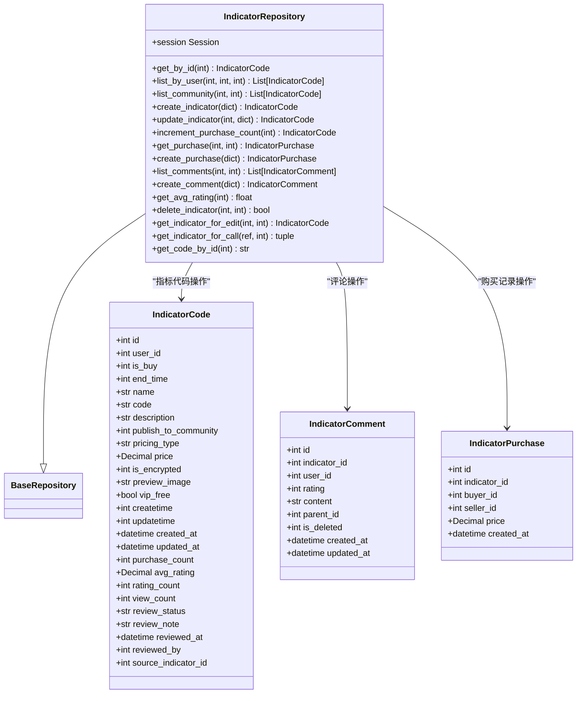
```mermaid
classDiagram
class IndicatorRepository {
+session Session
+get_by_id(int) IndicatorCode
+list_by_user(int, int, int) List[IndicatorCode]
+list_community(int, int) List[IndicatorCode]
+create_indicator(dict) IndicatorCode
+update_indicator(int, dict) IndicatorCode
+increment_purchase_count(int) IndicatorCode
+get_purchase(int, int) IndicatorPurchase
+create_purchase(dict) IndicatorPurchase
+list_comments(int, int) List[IndicatorComment]
+create_comment(dict) IndicatorComment
+get_avg_rating(int) float
+delete_indicator(int, int) bool
+get_indicator_for_edit(int, int) IndicatorCode
+get_indicator_for_call(ref, int) tuple
+get_code_by_id(int) str
}
class IndicatorCode {
+int id
+int user_id
+int is_buy
+int end_time
+str name
+str code
+str description
+int publish_to_community
+str pricing_type
+Decimal price
+int is_encrypted
+str preview_image
+bool vip_free
+int createtime
+int updatetime
+datetime created_at
+datetime updated_at
+int purchase_count
+Decimal avg_rating
+int rating_count
+int view_count
+str review_status
+str review_note
+datetime reviewed_at
+int reviewed_by
+int source_indicator_id
}
class IndicatorComment {
+int id
+int indicator_id
+int user_id
+int rating
+str content
+int parent_id
+int is_deleted
+datetime created_at
+datetime updated_at
}
class IndicatorPurchase {
+int id
+int indicator_id
+int buyer_id
+int seller_id
+Decimal price
+datetime created_at
}
IndicatorRepository --|> BaseRepository
IndicatorRepository --> IndicatorCode : "指标代码操作"
IndicatorRepository --> IndicatorComment : "评论操作"
IndicatorRepository --> IndicatorPurchase : "购买记录操作"
```

**图表来源**
- [indicator_repository.py:8-169](file://backend/app/database/repositories/indicator_repository.py#L8-L169)
- [indicator_full.py:19-90](file://backend/app/models/indicator_full.py#L19-L90)
- [base.py:4-25](file://backend/app/database/repositories/base.py#L4-L25)

#### 指标社区模型特性

**指标代码管理：**
- 用户所有权：每个指标都关联到创建用户
- 发布控制：支持社区发布和审核状态管理
- 付费功能：支持免费和付费指标的差异化管理
- 统计数据：内置购买次数、评分、浏览量等统计数据

**购买和评论系统：**
- 购买记录：完整的购买历史追踪
- 评分系统：1-5星评分和评论管理
- 删除机制：支持软删除的评论管理
- 关系映射：指标与用户、购买记录的多对多关系

**高级功能：**
- 社区浏览：支持按购买量排序的社区指标列表
- 权限控制：编辑权限检查和购买副本保护
- 智能查找：支持ID和名称的双模式查找
- 代码获取：提供无权限检查的原始代码获取

**章节来源**
- [indicator_repository.py:8-169](file://backend/app/database/repositories/indicator_repository.py#L8-L169)
- [indicator_full.py:19-90](file://backend/app/models/indicator_full.py#L19-L90)

### 市场符号管理仓库

MarketSymbolRepository是新引入的核心仓库类，专门负责多市场符号的管理：

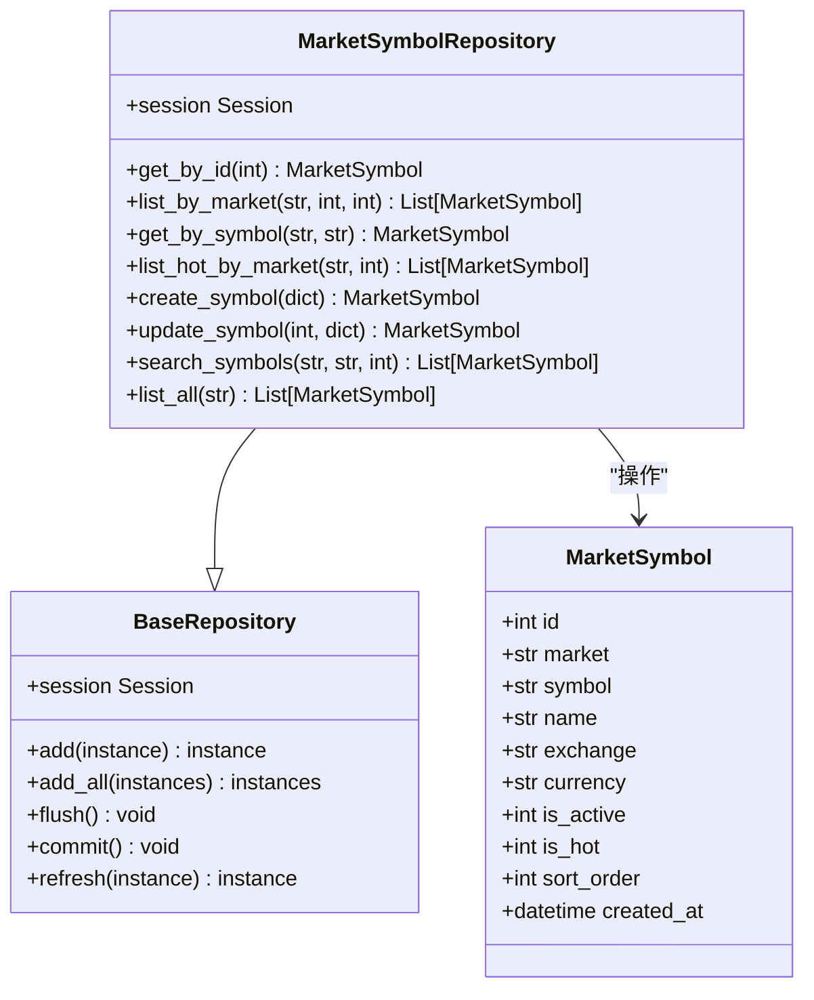
```mermaid
classDiagram
class MarketSymbolRepository {
+session Session
+get_by_id(int) MarketSymbol
+list_by_market(str, int, int) List[MarketSymbol]
+get_by_symbol(str, str) MarketSymbol
+list_hot_by_market(str, int) List[MarketSymbol]
+create_symbol(dict) MarketSymbol
+update_symbol(int, dict) MarketSymbol
+search_symbols(str, str, int) List[MarketSymbol]
+list_all(str) List[MarketSymbol]
}
class MarketSymbol {
+int id
+str market
+str symbol
+str name
+str exchange
+str currency
+int is_active
+int is_hot
+int sort_order
+datetime created_at
}
class BaseRepository {
+session Session
+add(instance) instance
+add_all(instances) instances
+flush() void
+commit() void
+refresh(instance) instance
}
MarketSymbolRepository --|> BaseRepository
MarketSymbolRepository --> MarketSymbol : "操作"
```

**图表来源**
- [market_symbol_repository.py:8-87](file://backend/app/database/repositories/market_symbol_repository.py#L8-L87)
- [market_symbol.py:10-28](file://backend/app/models/market_symbol.py#L10-L28)
- [base.py:4-25](file://backend/app/database/repositories/base.py#L4-L25)

#### 市场符号模型特性

**字段设计：**
- 市场标识：支持多市场类型（Crypto、Forex、Indices等）
- 符号管理：唯一约束确保符号在市场内的唯一性
- 状态控制：活跃状态和热门标记
- 排序机制：支持自定义排序优先级
- 多语言支持：名称和交易所信息

**索引优化：**
- 唯一约束：市场+符号的复合唯一性
- 性能索引：市场字段和热门标记的联合索引
- 查询优化：按市场分类和排序的索引设计

**仓库功能：**
- 精确查询：按ID和符号的快速检索
- 条件过滤：支持活跃状态和热门标记筛选
- 模糊搜索：支持符号和名称的模糊匹配
- 分页查询：支持大规模数据的分页处理

**章节来源**
- [market_symbol_repository.py:8-87](file://backend/app/database/repositories/market_symbol_repository.py#L8-L87)
- [market_symbol.py:10-28](file://backend/app/models/market_symbol.py#L10-L28)

### 订单处理仓库

OrderRepository是交易系统的核心仓库类，处理挂单和快捷交易：

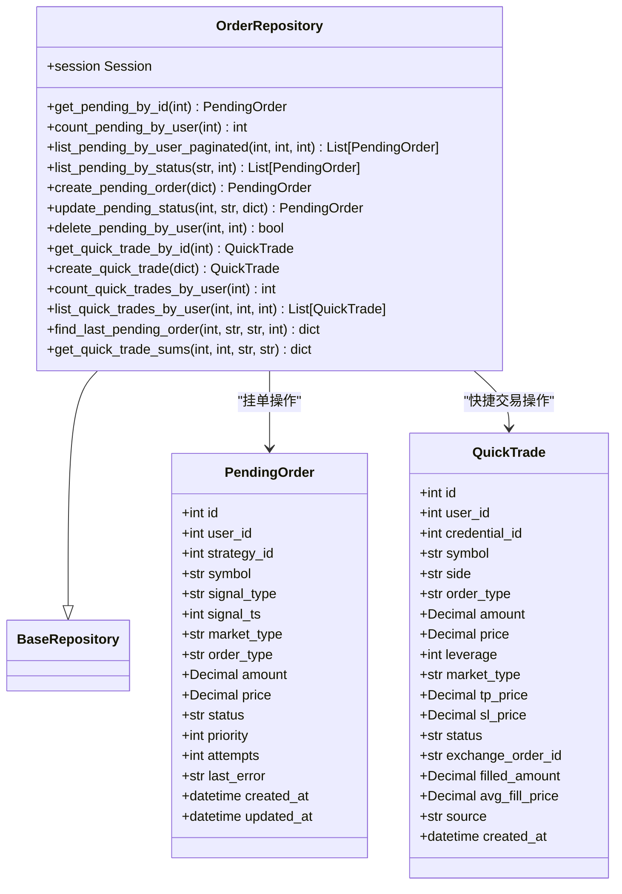
```mermaid
classDiagram
class OrderRepository {
+session Session
+get_pending_by_id(int) PendingOrder
+count_pending_by_user(int) int
+list_pending_by_user_paginated(int, int, int) List[PendingOrder]
+list_pending_by_status(str, int) List[PendingOrder]
+create_pending_order(dict) PendingOrder
+update_pending_status(int, str, dict) PendingOrder
+delete_pending_by_user(int, int) bool
+get_quick_trade_by_id(int) QuickTrade
+create_quick_trade(dict) QuickTrade
+count_quick_trades_by_user(int) int
+list_quick_trades_by_user(int, int, int) List[QuickTrade]
+find_last_pending_order(int, str, str, int) dict
+get_quick_trade_sums(int, int, str, str) dict
}
class PendingOrder {
+int id
+int user_id
+int strategy_id
+str symbol
+str signal_type
+int signal_ts
+str market_type
+str order_type
+Decimal amount
+Decimal price
+str status
+int priority
+int attempts
+str last_error
+datetime created_at
+datetime updated_at
}
class QuickTrade {
+int id
+int user_id
+int credential_id
+str symbol
+str side
+str order_type
+Decimal amount
+Decimal price
+int leverage
+str market_type
+Decimal tp_price
+Decimal sl_price
+str status
+str exchange_order_id
+Decimal filled_amount
+Decimal avg_fill_price
+str source
+datetime created_at
}
OrderRepository --|> BaseRepository
OrderRepository --> PendingOrder : "挂单操作"
OrderRepository --> QuickTrade : "快捷交易操作"
```

**图表来源**
- [order_repository.py:10-150](file://backend/app/database/repositories/order_repository.py#L10-L150)
- [order.py:21-92](file://backend/app/models/order.py#L21-L92)
- [base.py:4-25](file://backend/app/database/repositories/base.py#L4-L25)

#### 订单模型设计

**挂单管理：**
- 状态跟踪：pending、processing、failed等状态管理
- 优先级调度：支持优先级队列处理
- 重试机制：最大尝试次数和错误记录
- 信号去重：基于信号类型和时间戳的去重检查

**快捷交易：**
- 多交易所支持：支持多个加密货币交易所
- 止损止盈：支持TP/SL订单设置
- 快速执行：简化交易流程
- 交易历史：完整的交易记录追踪

**高级功能：**
- 交易去重：防止重复下单的智能检测
- 成交汇总：按用户和资产的成交统计
- 分页查询：支持大量订单的历史查询

**章节来源**
- [order_repository.py:10-150](file://backend/app/database/repositories/order_repository.py#L10-L150)
- [order.py:21-92](file://backend/app/models/order.py#L21-L92)

### 投资组合管理仓库

PortfolioRepository提供投资组合和挂单的综合管理：

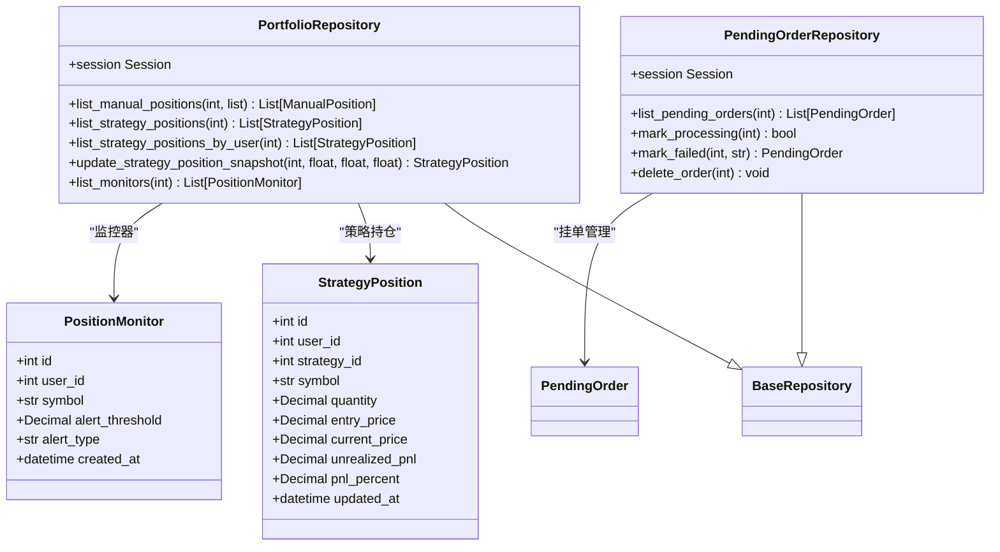
```mermaid
classDiagram
class PortfolioRepository {
+session Session
+list_manual_positions(int, list) List[ManualPosition]
+list_strategy_positions(int) List[StrategyPosition]
+list_strategy_positions_by_user(int) List[StrategyPosition]
+update_strategy_position_snapshot(int, float, float, float) StrategyPosition
+list_monitors(int) List[PositionMonitor]
}
class PendingOrderRepository {
+session Session
+list_pending_orders(int) List[PendingOrder]
+mark_processing(int) bool
+mark_failed(int, str) PendingOrder
+delete_order(int) void
}
class StrategyPosition {
+int id
+int user_id
+int strategy_id
+str symbol
+Decimal quantity
+Decimal entry_price
+Decimal current_price
+Decimal unrealized_pnl
+Decimal pnl_percent
+datetime updated_at
}
class PositionMonitor {
+int id
+int user_id
+str symbol
+Decimal alert_threshold
+str alert_type
+datetime created_at
}
PortfolioRepository --|> BaseRepository
PendingOrderRepository --|> BaseRepository
PortfolioRepository --> StrategyPosition : "策略持仓"
PortfolioRepository --> PositionMonitor : "监控器"
PendingOrderRepository --> PendingOrder : "挂单管理"
```

**图表来源**
- [portfolio_repository.py:9-81](file://backend/app/database/repositories/portfolio_repository.py#L9-L81)
- [base.py:4-25](file://backend/app/database/repositories/base.py#L4-L25)

#### 投资组合功能

**策略持仓管理：**
- 实时价格更新：支持持仓的实时价值计算
- 盈亏监控：浮动盈亏和收益率计算
- 用户关联：支持按用户维度的持仓查询
- 性能排序：按最后更新时间排序

**挂单处理：**
- 状态转换：挂单状态的生命周期管理
- 失败处理：错误信息的记录和追踪
- 批量操作：支持挂单的批量删除

**章节来源**
- [portfolio_repository.py:9-81](file://backend/app/database/repositories/portfolio_repository.py#L9-L81)

### 交易记录仓库

TradeRepository专门处理策略交易的记录和统计：

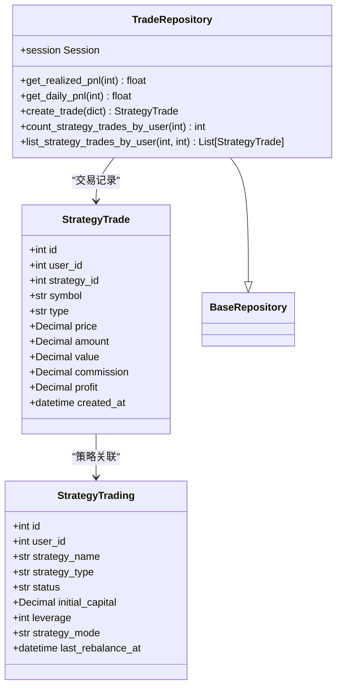
```mermaid
classDiagram
class TradeRepository {
+session Session
+get_realized_pnl(int) float
+get_daily_pnl(int) float
+create_trade(dict) StrategyTrade
+count_strategy_trades_by_user(int) int
+list_strategy_trades_by_user(int, int) List[StrategyTrade]
}
class StrategyTrade {
+int id
+int user_id
+int strategy_id
+str symbol
+str type
+Decimal price
+Decimal amount
+Decimal value
+Decimal commission
+Decimal profit
+datetime created_at
}
class StrategyTrading {
+int id
+int user_id
+str strategy_name
+str strategy_type
+str status
+Decimal initial_capital
+int leverage
+str strategy_mode
+datetime last_rebalance_at
}
TradeRepository --|> BaseRepository
TradeRepository --> StrategyTrade : "交易记录"
StrategyTrade --> StrategyTrading : "策略关联"
```

**图表来源**
- [trade_repository.py:10-79](file://backend/app/database/repositories/trade_repository.py#L10-L79)
- [trading.py:34-57](file://backend/app/models/trading.py#L34-L57)
- [strategy.py:32-68](file://backend/app/models/strategy.py#L32-L68)

#### 交易统计功能

**收益计算：**
- 实现收益：已实现的利润减去手续费
- 日内收益：当日的交易收益统计
- 精确计算：使用Decimal确保财务计算精度

**交易历史：**
- 用户关联：支持按用户维度的交易查询
- 策略关联：支持按策略维度的交易统计
- 时间过滤：支持日期范围的交易查询

**章节来源**
- [trade_repository.py:10-79](file://backend/app/database/repositories/trade_repository.py#L10-L79)
- [trading.py:34-57](file://backend/app/models/trading.py#L34-L57)

### 策略管理仓库

StrategyRepository提供策略的完整生命周期管理：

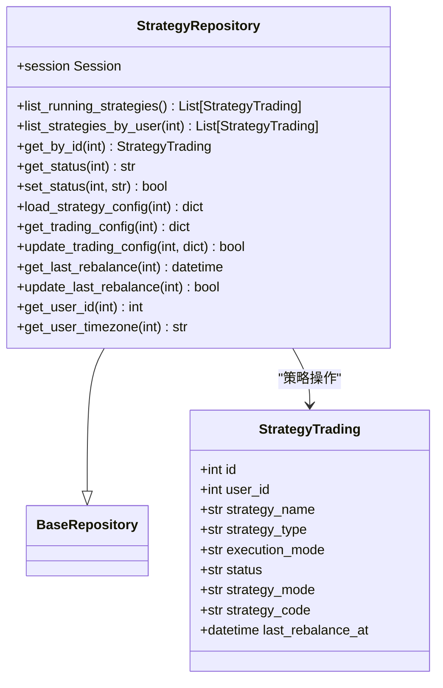
```mermaid
classDiagram
class StrategyRepository {
+session Session
+list_running_strategies() List[StrategyTrading]
+list_strategies_by_user(int) List[StrategyTrading]
+get_by_id(int) StrategyTrading
+get_status(int) str
+set_status(int, str) bool
+load_strategy_config(int) dict
+get_trading_config(int) dict
+update_trading_config(int, dict) bool
+get_last_rebalance(int) datetime
+update_last_rebalance(int) bool
+get_user_id(int) int
+get_user_timezone(int) str
}
class StrategyTrading {
+int id
+int user_id
+str strategy_name
+str strategy_type
+str execution_mode
+str status
+str strategy_mode
+str strategy_code
+datetime last_rebalance_at
}
StrategyRepository --|> BaseRepository
StrategyRepository --> StrategyTrading : "策略操作"
```

**图表来源**
- [strategy_repository.py:10-128](file://backend/app/database/repositories/strategy_repository.py#L10-L128)
- [strategy.py:32-68](file://backend/app/models/strategy.py#L32-L68)

#### 策略配置管理

**配置解析：**
- JSON字段处理：支持复杂的JSON配置结构
- 类型转换：自动处理数据类型转换
- 默认值处理：确保配置的完整性

**运行监控：**
- 状态管理：策略运行状态的实时监控
- 重平衡：支持策略的定期重平衡
- 用户关联：支持按用户维度的策略管理

**章节来源**
- [strategy_repository.py:10-128](file://backend/app/database/repositories/strategy_repository.py#L10-L128)
- [strategy.py:32-68](file://backend/app/models/strategy.py#L32-L68)

### Polymarket数据分析仓库

PolymarketRepository处理去中心化预测市场的数据管理：

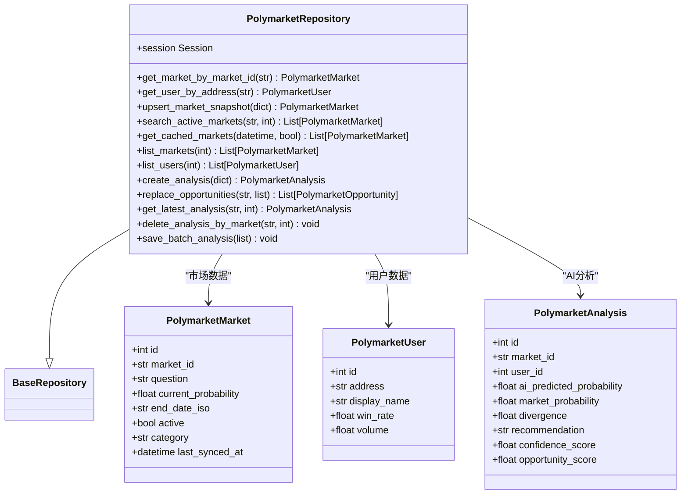
```mermaid
classDiagram
class PolymarketRepository {
+session Session
+get_market_by_market_id(str) PolymarketMarket
+get_user_by_address(str) PolymarketUser
+upsert_market_snapshot(dict) PolymarketMarket
+search_active_markets(str, int) List[PolymarketMarket]
+get_cached_markets(datetime, bool) List[PolymarketMarket]
+list_markets(int) List[PolymarketMarket]
+list_users(int) List[PolymarketUser]
+create_analysis(dict) PolymarketAnalysis
+replace_opportunities(str, list) List[PolymarketOpportunity]
+get_latest_analysis(str, int) PolymarketAnalysis
+delete_analysis_by_market(str, int) void
+save_batch_analysis(list) void
}
class PolymarketMarket {
+int id
+str market_id
+str question
+float current_probability
+str end_date_iso
+bool active
+str category
+datetime last_synced_at
}
class PolymarketUser {
+int id
+str address
+str display_name
+float win_rate
+float volume
}
class PolymarketAnalysis {
+int id
+str market_id
+int user_id
+float ai_predicted_probability
+float market_probability
+float divergence
+str recommendation
+float confidence_score
+float opportunity_score
}
PolymarketRepository --|> BaseRepository
PolymarketRepository --> PolymarketMarket : "市场数据"
PolymarketRepository --> PolymarketUser : "用户数据"
PolymarketRepository --> PolymarketAnalysis : "AI分析"
```

**图表来源**
- [polymarket_repository.py:13-132](file://backend/app/database/repositories/polymarket_repository.py#L13-L132)
- [polymarket.py:16-70](file://backend/app/models/polymarket.py#L16-L70)

#### Polymarket数据模型

**市场数据管理：**
- 市场快照：支持市场的Upsert操作
- 活跃市场：支持活跃状态的市场查询
- 缓存管理：支持基于时间的缓存查询

**AI分析功能：**
- 批量分析：支持批量AI分析的保存
- 去重处理：自动删除旧的分析记录
- 关联分析：支持市场和用户维度的分析

**用户管理：**
- 用户追踪：基于地址的用户识别
- 绩效统计：支持胜率和交易量统计
- 数据同步：支持用户数据的实时更新

**章节来源**
- [polymarket_repository.py:13-132](file://backend/app/database/repositories/polymarket_repository.py#L13-L132)
- [polymarket.py:16-70](file://backend/app/models/polymarket.py#L16-L70)

## 同步作业管理系统

### SyncScheduler架构设计

SyncScheduler是项目中新引入的核心组件，负责管理各种数据源的同步作业：

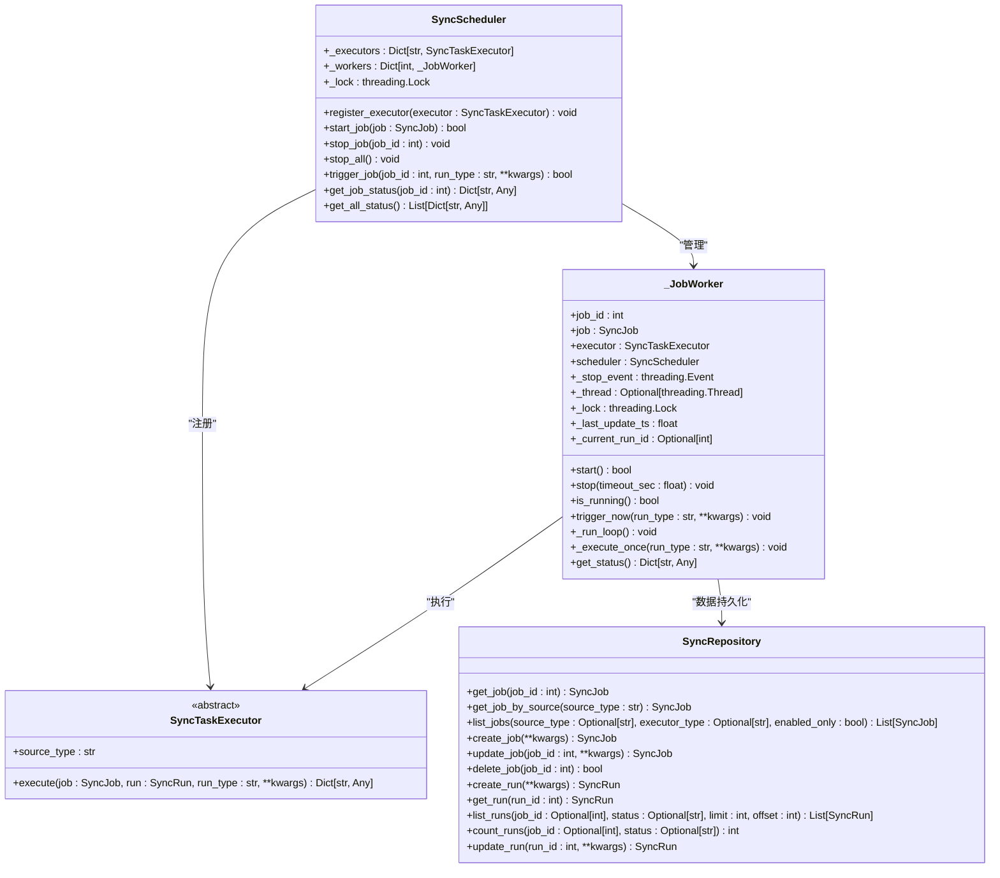
```mermaid
classDiagram
class SyncScheduler {
+_executors : Dict[str, SyncTaskExecutor]
+_workers : Dict[int, _JobWorker]
+_lock : threading.Lock
+register_executor(executor : SyncTaskExecutor) void
+start_job(job : SyncJob) bool
+stop_job(job_id : int) void
+stop_all() void
+trigger_job(job_id : int, run_type : str, **kwargs) bool
+get_job_status(job_id : int) Dict[str, Any]
+get_all_status() List[Dict[str, Any]]
}
class _JobWorker {
+job_id : int
+job : SyncJob
+executor : SyncTaskExecutor
+scheduler : SyncScheduler
+_stop_event : threading.Event
+_thread : Optional[threading.Thread]
+_lock : threading.Lock
+_last_update_ts : float
+_current_run_id : Optional[int]
+start() bool
+stop(timeout_sec : float) void
+is_running() bool
+trigger_now(run_type : str, **kwargs) void
+_run_loop() void
+_execute_once(run_type : str, **kwargs) void
+get_status() Dict[str, Any]
}
class SyncTaskExecutor {
<<abstract>>
+source_type : str
+execute(job : SyncJob, run : SyncRun, run_type : str, **kwargs) Dict[str, Any]
}
class SyncRepository {
+get_job(job_id : int) SyncJob
+get_job_by_source(source_type : str) SyncJob
+list_jobs(source_type : Optional[str], executor_type : Optional[str], enabled_only : bool) List[SyncJob]
+create_job(**kwargs) SyncJob
+update_job(job_id : int, **kwargs) SyncJob
+delete_job(job_id : int) bool
+create_run(**kwargs) SyncRun
+get_run(run_id : int) SyncRun
+list_runs(job_id : Optional[int], status : Optional[str], limit : int, offset : int) List[SyncRun]
+count_runs(job_id : Optional[int], status : Optional[str]) int
+update_run(run_id : int, **kwargs) SyncRun
}
SyncScheduler --> _JobWorker : "管理"
SyncScheduler --> SyncTaskExecutor : "注册"
_JobWorker --> SyncTaskExecutor : "执行"
_JobWorker --> SyncRepository : "数据持久化"
```

**图表来源**
- [sync_scheduler.py:217-307](file://backend/app/services/sync_scheduler.py#L217-L307)
- [sync_scheduler.py:54-215](file://backend/app/services/sync_scheduler.py#L54-L215)
- [sync_repository.py:10-115](file://backend/app/database/repositories/sync_repository.py#L10-L115)

#### 同步作业生命周期

**作业创建和管理：**
- 动态注册：支持不同数据源类型的执行器注册
- 工作线程：每个作业对应独立的后台工作线程
- 状态监控：实时监控作业执行状态和性能指标
- 资源管理：自动管理线程生命周期和资源清理

**执行流程：**
- 定时触发：基于间隔分钟数的定时执行
- 手动触发：支持即时执行和参数传递
- 运行记录：自动创建和更新运行历史
- 错误处理：完善的异常捕获和错误恢复机制

**章节来源**
- [sync_scheduler.py:217-307](file://backend/app/services/sync_scheduler.py#L217-L307)
- [sync_scheduler.py:54-215](file://backend/app/services/sync_scheduler.py#L54-L215)

### SyncRepository数据访问层

SyncRepository提供了同步作业的完整数据访问功能：

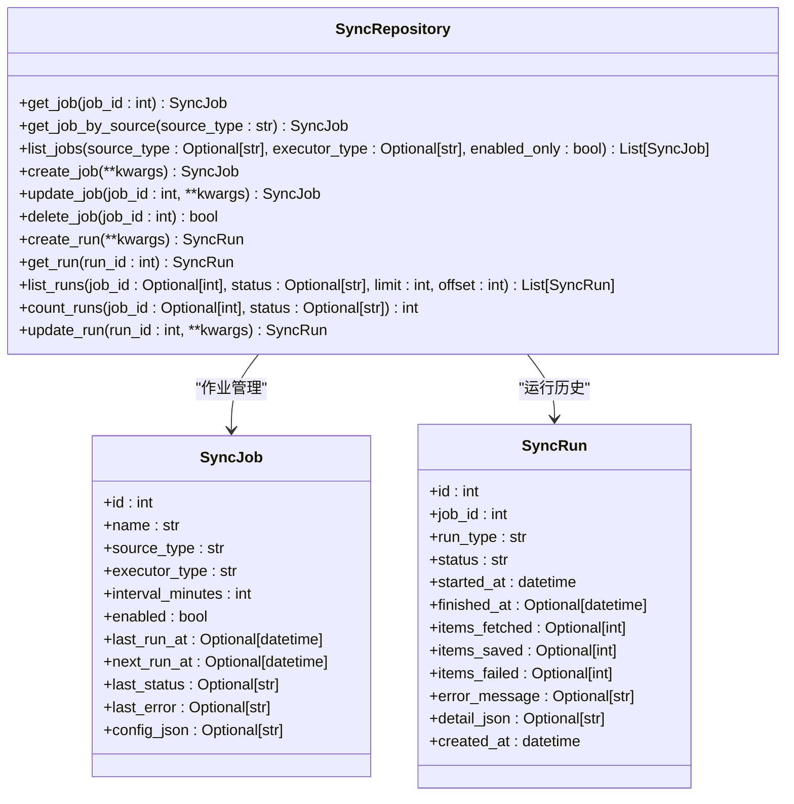
```mermaid
classDiagram
class SyncRepository {
+get_job(job_id : int) SyncJob
+get_job_by_source(source_type : str) SyncJob
+list_jobs(source_type : Optional[str], executor_type : Optional[str], enabled_only : bool) List[SyncJob]
+create_job(**kwargs) SyncJob
+update_job(job_id : int, **kwargs) SyncJob
+delete_job(job_id : int) bool
+create_run(**kwargs) SyncRun
+get_run(run_id : int) SyncRun
+list_runs(job_id : Optional[int], status : Optional[str], limit : int, offset : int) List[SyncRun]
+count_runs(job_id : Optional[int], status : Optional[str]) int
+update_run(run_id : int, **kwargs) SyncRun
}
class SyncJob {
+id : int
+name : str
+source_type : str
+executor_type : str
+interval_minutes : int
+enabled : bool
+last_run_at : Optional[datetime]
+next_run_at : Optional[datetime]
+last_status : Optional[str]
+last_error : Optional[str]
+config_json : Optional[str]
}
class SyncRun {
+id : int
+job_id : int
+run_type : str
+status : str
+started_at : datetime
+finished_at : Optional[datetime]
+items_fetched : Optional[int]
+items_saved : Optional[int]
+items_failed : Optional[int]
+error_message : Optional[str]
+detail_json : Optional[str]
+created_at : datetime
}
SyncRepository --> SyncJob : "作业管理"
SyncRepository --> SyncRun : "运行历史"
```

**图表来源**
- [sync_repository.py:10-115](file://backend/app/database/repositories/sync_repository.py#L10-L115)
- [sync_task.py:12-61](file://backend/app/models/sync_task.py#L12-L61)

#### 作业配置管理

**作业属性：**
- 名称标识：支持自定义作业名称
- 数据源类型：区分不同数据源的同步需求
- 执行器类型：指定对应的执行器实现
- 执行间隔：支持分钟级的灵活调度
- 启用状态：支持作业的动态启停控制

**运行状态追踪：**
- 执行类型：支持增量和全量两种执行模式
- 状态管理：running、completed、failed等多种状态
- 性能指标：记录抓取、保存、失败的项目数量
- 错误信息：完整的错误堆栈和详细信息

**章节来源**
- [sync_repository.py:10-115](file://backend/app/database/repositories/sync_repository.py#L10-L115)
- [sync_task.py:12-61](file://backend/app/models/sync_task.py#L12-L61)

## 执行历史追踪机制

### SyncRun模型设计

SyncRun模型提供了完整的同步执行历史追踪能力：

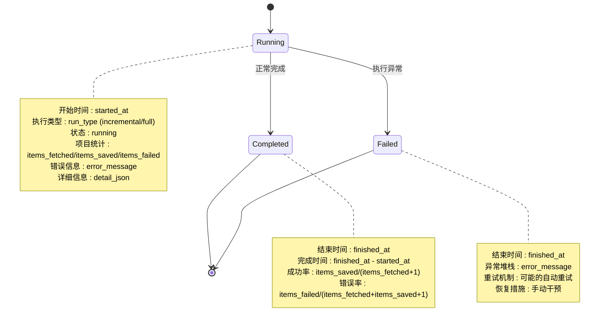
```mermaid
stateDiagram-v2
[*] --> Running
Running --> Completed : 正常完成
Running --> Failed : 执行异常
Completed --> [*]
Failed --> [*]
note right of Running
开始时间 : started_at
执行类型 : run_type (incremental/full)
状态 : running
项目统计 : items_fetched/items_saved/items_failed
错误信息 : error_message
详细信息 : detail_json
end note
note right of Completed
结束时间 : finished_at
完成时间 : finished_at - started_at
成功率 : items_saved/(items_fetched+1)
错误率 : items_failed/(items_fetched+items_saved+1)
end note
note right of Failed
结束时间 : finished_at
异常堆栈 : error_message
重试机制 : 可能的自动重试
恢复措施 : 手动干预
end note
```

**图表来源**
- [sync_task.py:37-61](file://backend/app/models/sync_task.py#L37-L61)
- [sync_scheduler.py:138-204](file://backend/app/services/sync_scheduler.py#L138-L204)

#### 运行历史功能

**状态转换：**
- 自动状态管理：执行器返回的状态自动写入数据库
- 时间戳追踪：精确记录开始和结束时间
- 性能指标：自动统计执行过程中的关键指标
- 错误处理：完整的异常信息记录和追踪

**查询接口：**
- 条件过滤：支持按作业ID、状态、时间范围查询
- 分页查询：支持大量历史记录的高效查询
- 统计分析：支持按天、小时等维度的统计分析
- 导出功能：支持历史数据的导出和备份

**监控告警：**
- 失败检测：自动检测执行失败的作业
- 性能监控：监控执行时间和成功率
- 超时告警：检测长时间运行的作业
- 资源监控：监控数据库连接和内存使用

**章节来源**
- [sync_task.py:37-61](file://backend/app/models/sync_task.py#L37-L61)
- [sync_scheduler.py:138-204](file://backend/app/services/sync_scheduler.py#L138-L204)

### API接口设计

项目提供了完整的同步作业管理API接口：

```mermaid
graph LR
subgraph "同步作业管理API"
CreateJob[POST /sync/jobs] --> SyncRepo[SyncRepository]
ListJobs[GET /sync/jobs] --> SyncRepo
UpdateJob[PUT /sync/jobs/{id}] --> SyncRepo
DeleteJob[DELETE /sync/jobs/{id}] --> SyncRepo
TriggerJob[POST /sync/jobs/{id}/trigger] --> SyncScheduler
GetStatus[GET /sync/status] --> SyncScheduler
ListRuns[GET /sync/runs] --> SyncRepo
CountRuns[GET /sync/runs/count] --> SyncRepo
GetRun[GET /sync/runs/{id}] --> SyncRepo
UpdateRun[PUT /sync/runs/{id}] --> SyncRepo
end
```

**图表来源**
- [sync.py:178-219](file://backend/app/routes/sync.py#L178-L219)

#### 接口功能

**作业管理接口：**
- 创建作业：支持完整的作业配置创建
- 列出作业：支持条件过滤和分页查询
- 更新作业：支持动态修改作业配置
- 删除作业：支持作业的彻底删除
- 触发执行：支持手动触发作业执行

**运行历史接口：**
- 查询历史：支持按条件查询执行历史
- 统计分析：支持执行成功率和性能统计
- 详情查看：支持单次执行的详细信息查看
- 状态监控：支持实时状态查询和监控

**章节来源**
- [sync.py:178-219](file://backend/app/routes/sync.py#L178-L219)

## 知识图谱质量监控

### GraphQualityMonitor架构设计

GraphQualityMonitor是项目中新引入的知识图谱质量监控系统，用于决定何时启用Graphiti的高级功能：

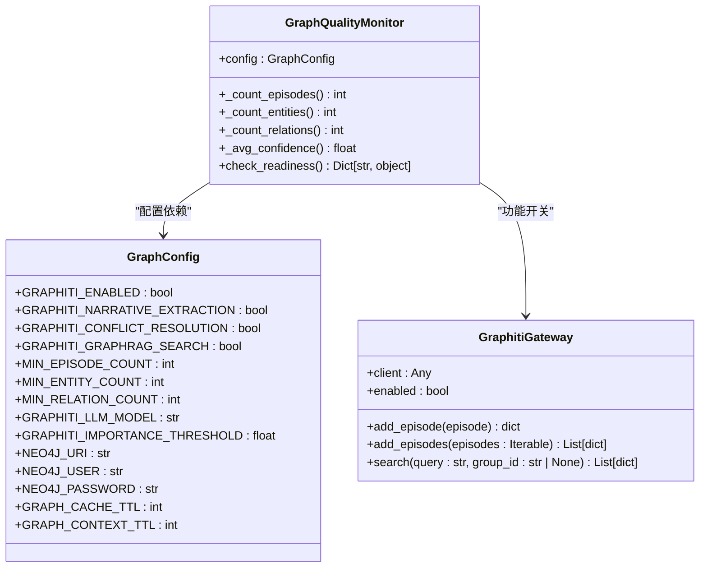
```mermaid
classDiagram
class GraphQualityMonitor {
+config : GraphConfig
+_count_episodes() int
+_count_entities() int
+_count_relations() int
+_avg_confidence() float
+check_readiness() Dict[str, object]
}
class GraphConfig {
+GRAPHITI_ENABLED : bool
+GRAPHITI_NARRATIVE_EXTRACTION : bool
+GRAPHITI_CONFLICT_RESOLUTION : bool
+GRAPHITI_GRAPHRAG_SEARCH : bool
+MIN_EPISODE_COUNT : int
+MIN_ENTITY_COUNT : int
+MIN_RELATION_COUNT : int
+GRAPHITI_LLM_MODEL : str
+GRAPHITI_IMPORTANCE_THRESHOLD : float
+NEO4J_URI : str
+NEO4J_USER : str
+NEO4J_PASSWORD : str
+GRAPH_CACHE_TTL : int
+GRAPH_CONTEXT_TTL : int
}
class GraphitiGateway {
+client : Any
+enabled : bool
+add_episode(episode) dict
+add_episodes(episodes : Iterable) List[dict]
+search(query : str, group_id : str | None) List[dict]
}
GraphQualityMonitor --> GraphConfig : "配置依赖"
GraphQualityMonitor --> GraphitiGateway : "功能开关"
```

**图表来源**
- [quality_monitor.py:11-78](file://backend/app/graph/quality_monitor.py#L11-L78)
- [graph_config.py:5-41](file://backend/app/config/graph_config.py#L5-L41)
- [graphiti_gateway.py:10-48](file://backend/app/graph/graphiti_gateway.py#L10-L48)

#### 质量阈值检查

**监控指标：**
- 事件数量：Episodes的数量阈值检查
- 实体数量：Entities的数量阈值检查
- 关系数量：RELATES_TO关系的数量阈值检查
- 置信度平均值：事件置信度的平均值检查

**阈值配置：**
- 可配置的阈值：支持通过环境变量配置
- 动态调整：支持运行时调整阈值
- 分阶段启用：支持渐进式功能启用
- 自动决策：基于阈值自动判断功能可用性

**章节来源**
- [quality_monitor.py:11-78](file://backend/app/graph/quality_monitor.py#L11-L78)
- [graph_config.py:5-41](file://backend/app/config/graph_config.py#L5-L41)

### 质量报告接口

项目提供了知识图谱质量报告的API接口：

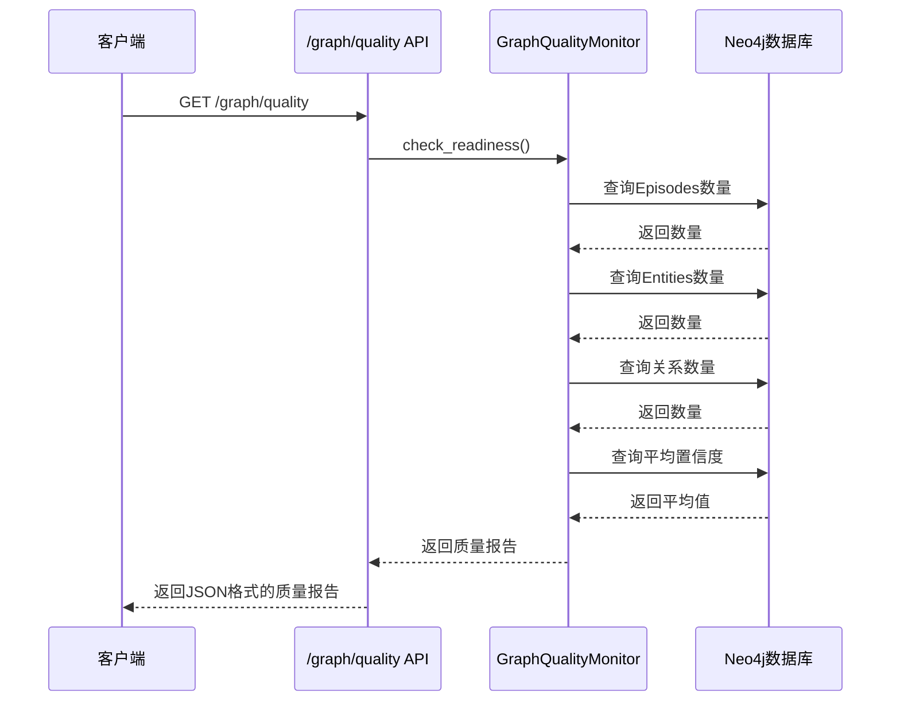
```mermaid
sequenceDiagram
participant Client as 客户端
participant API as /graph/quality API
participant Monitor as GraphQualityMonitor
participant Neo4j as Neo4j数据库
Client->>API : GET /graph/quality
API->>Monitor : check_readiness()
Monitor->>Neo4j : 查询Episodes数量
Neo4j-->>Monitor : 返回数量
Monitor->>Neo4j : 查询Entities数量
Neo4j-->>Monitor : 返回数量
Monitor->>Neo4j : 查询关系数量
Neo4j-->>Monitor : 返回数量
Monitor->>Neo4j : 查询平均置信度
Neo4j-->>Monitor : 返回平均值
Monitor-->>API : 返回质量报告
API-->>Client : 返回JSON格式的质量报告
```

**图表来源**
- [quality_monitor.py:38-78](file://backend/app/graph/quality_monitor.py#L38-L78)
- [graph_analysis.py:309-342](file://backend/app/route/graph_analysis.py#L309-L342)

#### 质量报告内容

**基础统计：**
- 事件计数：当前Episodes的总数
- 实体计数：当前Entities的总数
- 关系列数：当前RELATES_TO关系的总数
- 平均置信度：所有Episodes的平均置信度

**阈值对比：**
- 阈值配置：各阈值的配置值
- 达成状态：各项阈值是否达成
- 整体状态：是否满足整体启用条件

**功能状态：**
- 是否就绪：是否可以启用高级功能
- 建议操作：基于质量报告的建议
- 启用条件：当前距离启用条件的距离

**章节来源**
- [quality_monitor.py:38-78](file://backend/app/graph/quality_monitor.py#L38-L78)
- [graph_analysis.py:309-342](file://backend/app/route/graph_analysis.py#L309-L342)

## 数据库迁移架构

### 迁移版本管理

项目使用Alembic进行数据库结构变更管理，实现了版本化的数据库演进：

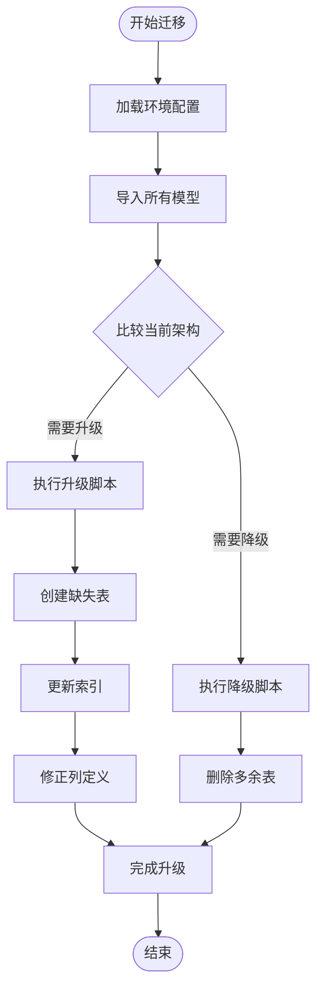
```mermaid
flowchart TD
Start([开始迁移]) --> LoadEnv[加载环境配置]
LoadEnv --> ImportModels[导入所有模型]
ImportModels --> CompareSchema{比较当前架构}
CompareSchema --> |需要升级| Upgrade[执行升级脚本]
CompareSchema --> |需要降级| Downgrade[执行降级脚本]
Upgrade --> CreateTables[创建缺失表]
CreateTables --> UpdateIndexes[更新索引]
UpdateIndexes --> CorrectColumns[修正列定义]
CorrectColumns --> Complete[完成升级]
Downgrade --> DropTables[删除多余表]
DropTables --> Complete
Complete --> End([结束])
```

**图表来源**
- [env.py:24-45](file://backend/migrations/env.py#L24-L45)
- [001_initial_schema.py:93-107](file://backend/migrations/versions/001_initial_schema.py#L93-L107)
- [002_sync_timestamp_columns.py:17-143](file://backend/migrations/versions/002_sync_timestamp_columns.py#L17-L143)

#### 迁移策略

**版本管理：**
- 单一版本策略：将多个表合并到一个版本中
- 依赖关系管理：确保表创建顺序正确
- 回滚能力：支持完整的降级操作

**自动化流程：**
- 模型注册：自动发现和注册所有ORM模型
- 表对比：智能检测缺失或多余的数据库表
- 安全执行：在事务中执行迁移操作

**修正性迁移：**
- 时间戳列修正：为现有表添加缺失的updated_at列
- 表结构优化：修正不一致的表结构定义
- 数据一致性：确保模型定义与实际数据库结构一致

**章节来源**
- [env.py:1-46](file://backend/migrations/env.py#L1-L46)
- [001_initial_schema.py:1-107](file://backend/migrations/versions/001_initial_schema.py#L1-L107)
- [002_sync_timestamp_columns.py:17-143](file://backend/migrations/versions/002_sync_timestamp_columns.py#L17-L143)

### 迁移执行流程

**升级流程：**
1. 连接数据库并获取绑定连接
2. 检测缺少updated_at列的表
3. 为每个缺失的表添加updated_at列
4. 为qd_graph_jobs表添加缺失的列
5. 处理qd_polymarket_asset_opportunities表重命名
6. 移除qd_polymarket_markets表的额外列

**降级流程：**
- 不提供降级操作，因为这是修正性迁移
- 仅记录迁移操作，不执行实际的降级

**章节来源**
- [002_sync_timestamp_columns.py:17-143](file://backend/migrations/versions/002_sync_timestamp_columns.py#L17-L143)

## 依赖关系分析

项目数据库架构的依赖关系体现了清晰的分层设计和新的仓库模式：

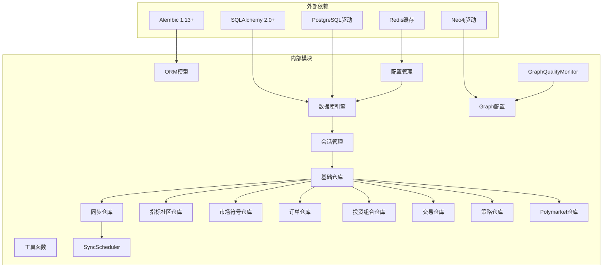
```mermaid
graph TB
subgraph "外部依赖"
SQLAlchemy[SQLAlchemy 2.0+]
Alembic[Alembic 1.13+]
PostgreSQL[PostgreSQL驱动]
Redis[Redis缓存]
Neo4j[Neo4j驱动]
end
subgraph "内部模块"
Engine[数据库引擎]
Session[会话管理]
BaseRepo[基础仓库]
SyncRepo[同步仓库]
IndicatorRepo[指标社区仓库]
MarketRepo[市场符号仓库]
OrderRepo[订单仓库]
PortfolioRepo[投资组合仓库]
TradeRepo[交易仓库]
StrategyRepo[策略仓库]
PolymarketRepo[Polymarket仓库]
Models[ORM模型]
Utils[工具函数]
Config[配置管理]
GraphConfig[Graph配置]
Scheduler[SyncScheduler]
QualityMonitor[GraphQualityMonitor]
end
SQLAlchemy --> Engine
Alembic --> Models
PostgreSQL --> Engine
Redis --> Config
Neo4j --> GraphConfig
Engine --> Session
Session --> BaseRepo
BaseRepo --> SyncRepo
BaseRepo --> IndicatorRepo
BaseRepo --> MarketRepo
BaseRepo --> OrderRepo
BaseRepo --> PortfolioRepo
BaseRepo --> TradeRepo
BaseRepo --> StrategyRepo
BaseRepo --> PolymarketRepo
SyncRepo --> Scheduler
QualityMonitor --> GraphConfig
Config --> Engine
```

**图表来源**
- [requirements.txt:12-29](file://backend/requirements.txt#L12-L29)
- [engine.py:8-10](file://backend/app/database/engine.py#L8-L10)

### 核心依赖特性

**SQLAlchemy集成：**
- 版本兼容性：支持2.0+新特性
- 异步支持：future=True启用新式API
- 类型安全：Mypy友好的类型注解

**迁移工具：**
- 自动化：无需手动编写SQL
- 版本控制：Git友好的文本文件
- 安全性：事务保护的变更操作

**缓存集成：**
- 多级缓存：内存和Redis双重缓存
- TTL管理：灵活的过期时间配置
- 业务适配：针对不同数据类型的缓存策略

**图数据库集成：**
- Neo4j连接：支持知识图谱数据存储
- 配置管理：集中化的图数据库配置
- 功能开关：支持Graphiti功能的动态启用

**章节来源**
- [requirements.txt:1-53](file://backend/requirements.txt#L1-L53)
- [database.py:38-104](file://backend/app/config/database.py#L38-L104)

## 性能考虑

项目在数据库性能方面采用了多项优化策略，特别是新的仓库模式和同步作业管理带来的性能提升：

### 连接池优化

**动态连接池：**
- 自适应连接数量：根据负载动态调整
- 健康检查：定期验证连接有效性
- 超时处理：优雅处理连接获取超时
- 线程安全：支持多线程并发访问

**连接复用：**
- 连接池复用：避免频繁连接建立
- 事务持久化：长事务的连接保持
- 资源清理：及时释放空闲连接

### 查询优化

**批量操作：**
- 批量插入：add_all()减少数据库往返
- 批量查询：selectin加载优化N+1问题
- 原子操作：单事务内的批量处理

**索引策略：**
- 高频查询字段索引
- 复合索引优化复杂查询
- 唯一约束保证数据完整性

### 缓存策略

**多层缓存架构：**
- 应用层缓存：进程内缓存热点数据
- 分布式缓存：Redis集群缓存共享数据
- TTL管理：智能过期策略
- 缓存失效：基于数据变更的主动失效

**仓库层优化：**
- 查询缓存：常用查询结果的缓存
- 结果集优化：分页和限制的合理使用
- 连接池优化：仓库实例的连接复用

### 同步作业性能

**并发控制：**
- 线程安全：使用锁保护共享资源
- 资源隔离：每个作业独立的工作线程
- 内存管理：及时清理不再使用的资源
- 超时控制：防止无限等待和阻塞

**监控优化：**
- 轻量级监控：最小化监控对性能的影响
- 异步记录：使用异步方式记录运行状态
- 采样策略：对高频操作进行采样记录
- 告警抑制：避免重复告警造成性能影响

## 故障排除指南

### 连接问题诊断

**常见连接错误：**
- `DATABASE_URL`环境变量未设置
- 数据库服务不可达
- 认证凭据错误
- 连接池耗尽

**诊断步骤：**
1. 验证数据库URL格式正确性
2. 检查网络连通性和防火墙设置
3. 确认数据库用户权限
4. 监控连接池使用情况

### 事务管理

**事务异常处理：**
- 自动回滚机制
- 异常传播和日志记录
- 资源清理保证
- 幂等性设计

**最佳实践：**
- 短事务原则
- 死锁预防
- 错误重试机制
- 事务边界清晰

### 同步作业故障排除

**作业执行失败：**
- 检查执行器注册状态
- 验证作业配置的正确性
- 查看运行历史中的错误信息
- 监控数据库连接状态

**性能问题诊断：**
- 监控作业执行时间
- 检查数据库查询性能
- 分析内存使用情况
- 评估并发执行效果

**监控告警：**
- 设置合理的阈值
- 配置告警通知机制
- 建立故障处理流程
- 定期审查监控效果

### 知识图谱质量监控

**监控失效：**
- 检查Neo4j连接状态
- 验证Cypher查询的正确性
- 确认阈值配置的合理性
- 监控Graphiti功能开关

**质量报告异常：**
- 验证数据库连接
- 检查查询权限
- 确认数据完整性
- 分析查询性能

**章节来源**
- [db.py:62-78](file://backend/app/utils/db.py#L62-L78)
- [db_postgres.py:184-235](file://backend/app/utils/db_postgres.py#L184-L235)

## 结论

QuantDinger项目的数据库现代化架构展现了从传统数据库访问模式向现代ORM架构的成功转型。通过SQLAlchemy的深度集成、Alembic的迁移管理、以及精心设计的仓库模式，项目实现了显著的技术进步。

**技术优势：**
- 类型安全的ORM操作
- 自动化的数据库迁移
- 高效的连接池管理
- 完善的事务处理
- 灵活的缓存策略
- 专业的仓库模式设计
- **强大的同步作业管理**
- **完善的执行历史追踪**
- **智能的知识图谱质量监控**

**架构特点：**
- 清晰的分层设计
- 良好的可扩展性
- 优秀的性能表现
- 完善的错误处理
- 详细的文档支持
- 专业化的业务领域划分
- **全面的系统可观测性**

**新增功能的价值：**
- **同步作业管理**：支持多数据源的定时同步和手动触发
- **执行历史追踪**：完整的运行状态和性能指标记录
- **知识图谱质量监控**：基于阈值的智能功能启用决策
- **修正性迁移**：自动修复数据库结构不一致问题
- **增强的监控告警**：全面的系统健康状态监控

这套架构为金融数据处理和交易系统提供了坚实的技术基础，支持高并发、低延迟的数据访问需求，同时保持了代码的可维护性和可扩展性。新的仓库模式和同步作业管理特别适合量化交易系统的复杂数据访问需求，为QuantDinger在量化交易领域的创新和发展奠定了坚实的数据库基础。

通过新增的同步作业管理和知识图谱质量监控功能，项目不仅提升了数据管理的自动化程度，还增强了系统的智能化水平，为未来的功能扩展和技术演进提供了良好的基础。