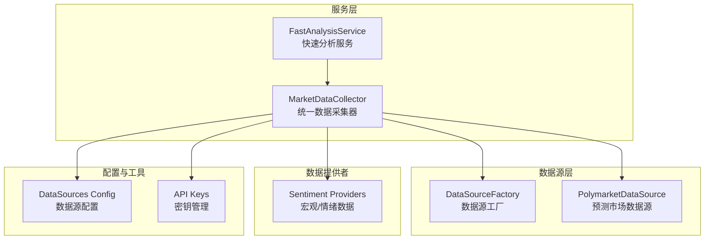
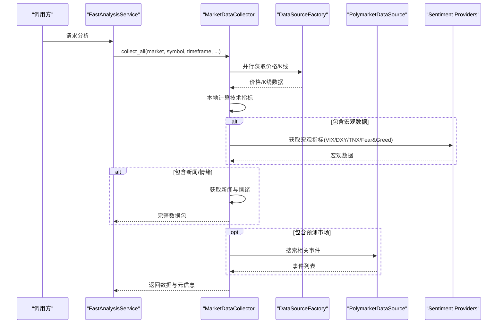
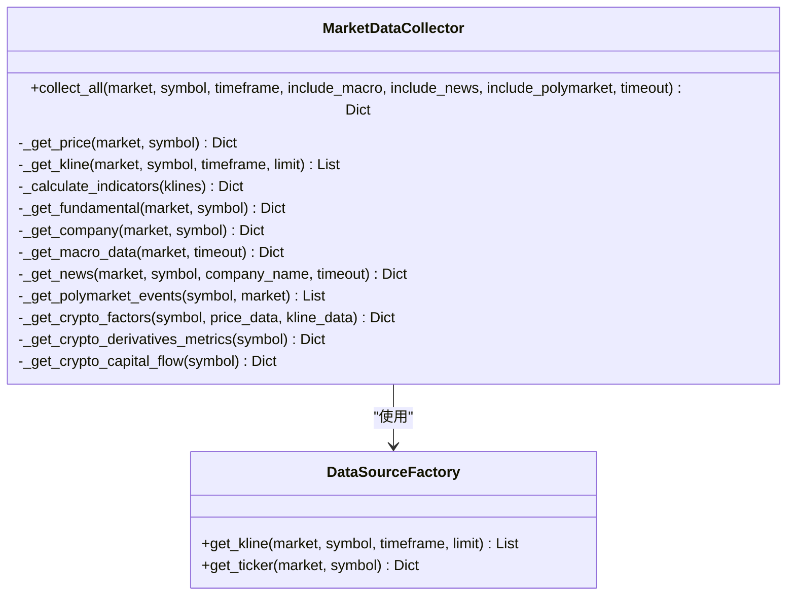
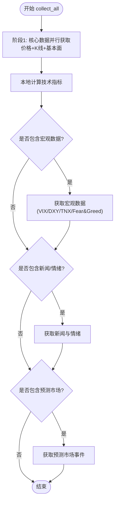
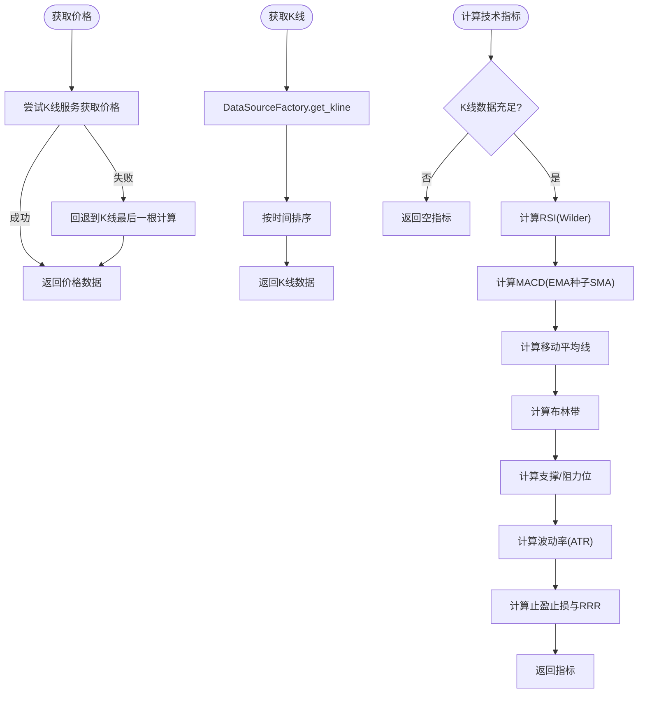
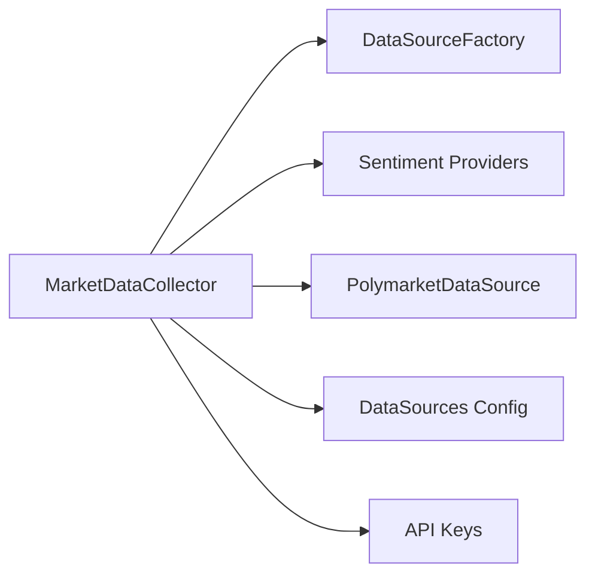

# 市场数据采集器

<cite>
**本文档引用的文件**
- [market_data_collector.py](file://backend_api_python/app/services/market_data_collector.py)
- [factory.py](file://backend_api_python/app/data_sources/factory.py)
- [sentiment.py](file://backend_api_python/app/data_providers/sentiment.py)
- [fast_analysis.py](file://backend_api_python/app/services/fast_analysis.py)
- [data_sources.py](file://backend_api_python/app/config/data_sources.py)
- [api_keys.py](file://backend_api_python/app/config/api_keys.py)
- [polymarket.py](file://backend_api_python/app/data_sources/polymarket.py)
- [adanos_sentiment.py](file://backend_api_python/app/data_providers/adanos_sentiment.py)
</cite>

## 目录
1. [简介](#简介)
2. [项目结构](#项目结构)
3. [核心组件](#核心组件)
4. [架构概览](#架构概览)
5. [详细组件分析](#详细组件分析)
6. [依赖关系分析](#依赖关系分析)
7. [性能考量](#性能考量)
8. [故障排除指南](#故障排除指南)
9. [结论](#结论)
10. [附录](#附录)

## 简介
本文件面向QuantDinger的AI分析系统，系统性阐述MarketDataCollector类的设计理念、架构模式与实现细节。该采集器专为AI分析场景设计，强调“数据为王、统一数据源、复用全球金融板块、快速稳定”。其核心目标是为AI分析提供完整、准确、及时的市场数据，涵盖四个数据层次：核心数据（必须成功）、分析数据（增强）、宏观数据（可选）、情绪数据（可选），并通过并行机制提升采集效率。

## 项目结构
MarketDataCollector位于后端Python服务层，与数据源工厂、全局宏观数据提供者、预测市场数据源等模块协同工作，形成统一的数据采集与预处理流水线。

**图表来源**
- [market_data_collector.py:34-2217](file://backend_api_python/app/services/market_data_collector.py#L34-L2217)
- [factory.py:13-134](file://backend_api_python/app/data_sources/factory.py#L13-L134)
- [sentiment.py:12-377](file://backend_api_python/app/data_providers/sentiment.py#L12-L377)
- [fast_analysis.py:186-232](file://backend_api_python/app/services/fast_analysis.py#L186-L232)
- [data_sources.py:26-171](file://backend_api_python/app/config/data_sources.py#L26-L171)

**章节来源**
- [market_data_collector.py:1-15](file://backend_api_python/app/services/market_data_collector.py#L1-L15)
- [factory.py:13-134](file://backend_api_python/app/data_sources/factory.py#L13-L134)
- [sentiment.py:12-377](file://backend_api_python/app/data_providers/sentiment.py#L12-L377)
- [fast_analysis.py:186-232](file://backend_api_python/app/services/fast_analysis.py#L186-L232)
- [data_sources.py:26-171](file://backend_api_python/app/config/data_sources.py#L26-L171)

## 核心组件
- MarketDataCollector：统一数据采集器，负责并行获取核心数据（价格/K线）、计算技术指标、采集基本面、宏观数据、情绪数据与预测市场数据，并记录元数据与耗时。
- DataSourceFactory：根据市场类型返回对应的数据源，统一K线与实时报价获取入口。
- 全球宏观/情绪提供者：复用全局市场模块的缓存与计算，提供VIX、DXY、TNX、Fear&Greed等宏观指标。
- 预测市场数据源：通过Polymarket数据源获取相关预测市场事件，支持关键词搜索与URL构建。
- 配置与密钥：集中管理数据源超时、重试、限流与API密钥。

**章节来源**
- [market_data_collector.py:34-2217](file://backend_api_python/app/services/market_data_collector.py#L34-L2217)
- [factory.py:13-134](file://backend_api_python/app/data_sources/factory.py#L13-L134)
- [sentiment.py:12-377](file://backend_api_python/app/data_providers/sentiment.py#L12-L377)
- [polymarket.py](file://backend_api_python/app/data_sources/polymarket.py)

## 架构概览
MarketDataCollector采用“阶段化并行采集 + 本地指标计算”的架构模式，确保在保证数据质量的同时最大化吞吐与稳定性。

**图表来源**
- [market_data_collector.py:72-224](file://backend_api_python/app/services/market_data_collector.py#L72-L224)
- [factory.py:74-105](file://backend_api_python/app/data_sources/factory.py#L74-L105)
- [sentiment.py:12-377](file://backend_api_python/app/data_providers/sentiment.py#L12-L377)
- [polymarket.py](file://backend_api_python/app/data_sources/polymarket.py)

**章节来源**
- [market_data_collector.py:72-224](file://backend_api_python/app/services/market_data_collector.py#L72-L224)
- [fast_analysis.py:203-232](file://backend_api_python/app/services/fast_analysis.py#L203-L232)

## 详细组件分析

### MarketDataCollector 类设计与职责
- 设计理念：统一数据源、复用全球金融板块、快速稳定、数据为王。
- 数据层次：
  - 核心数据：价格、K线、技术指标（本地计算）
  - 分析数据：技术指标、基本面（公司信息、财务数据）
  - 宏观数据：VIX、DXY、TNX、Fear&Greed（复用全局缓存）
  - 情绪数据：新闻、市场情绪（Finnhub + 搜索引擎）
  - 预测市场：相关预测市场事件（Polymarket）

**图表来源**
- [market_data_collector.py:34-2217](file://backend_api_python/app/services/market_data_collector.py#L34-L2217)
- [factory.py:13-134](file://backend_api_python/app/data_sources/factory.py#L13-L134)

**章节来源**
- [market_data_collector.py:34-2217](file://backend_api_python/app/services/market_data_collector.py#L34-L2217)

### 数据层次与并行机制
- 核心数据阶段（并行）：价格与K线并行获取，失败时回退到备用方案；随后本地计算技术指标。
- 基本面阶段：根据市场类型（US/CN/HK/Crypto）分别获取公司信息与财务数据。
- 宏观数据阶段：复用全局市场模块的缓存与计算，快速并行获取关键指标。
- 情绪数据阶段：优先Finnhub结构化新闻与社交情绪，不足时通过搜索引擎补充。
- 预测市场阶段：提取关键词，限制搜索数量，使用缓存加速。

**图表来源**
- [market_data_collector.py:72-224](file://backend_api_python/app/services/market_data_collector.py#L72-L224)

**章节来源**
- [market_data_collector.py:72-224](file://backend_api_python/app/services/market_data_collector.py#L72-L224)

### 核心数据获取流程
- 实时价格获取：
  - 优先使用K线服务获取实时价格，失败时回退到K线最后一根K计算价格与涨跌幅。
  - 安全转换数值类型，确保返回字段一致性。
- K线数据获取：
  - 通过数据源工厂统一获取，按时间排序，保证顺序正确。
- 技术指标计算（本地）：
  - RSI（Wilder平滑）、MACD（EMA种子SMA）、移动平均线、布林带、ATR（Wilder）、支撑/阻力位、波动率、止盈止损建议、成交量比率、价格位置、整体趋势等。
  - 指标口径与常见行情终端对齐，输出结构符合前端FastAnalysisReport期望。

**图表来源**
- [market_data_collector.py:228-510](file://backend_api_python/app/services/market_data_collector.py#L228-L510)
- [factory.py:74-105](file://backend_api_python/app/data_sources/factory.py#L74-L105)

**章节来源**
- [market_data_collector.py:228-510](file://backend_api_python/app/services/market_data_collector.py#L228-L510)
- [factory.py:74-105](file://backend_api_python/app/data_sources/factory.py#L74-L105)

### 宏观数据与情绪数据
- 宏观数据：复用全局市场模块的缓存与计算，快速并行获取VIX、DXY、TNX、Fear&Greed，统一格式输出。
- 情绪数据：优先Finnhub结构化新闻与社交情绪，不足时通过搜索引擎补充，并过滤全球重大事件新闻。

**章节来源**
- [market_data_collector.py:1729-1876](file://backend_api_python/app/services/market_data_collector.py#L1729-L1876)
- [sentiment.py:12-377](file://backend_api_python/app/data_providers/sentiment.py#L12-L377)

### 预测市场数据
- 通过Polymarket数据源搜索相关事件，限制关键词数量与搜索结果，使用缓存加速，构建事件URL。
- 输出包含市场ID、问题、概率、成交量、流动性、分类与URL等字段。

**章节来源**
- [market_data_collector.py:2086-2205](file://backend_api_python/app/services/market_data_collector.py#L2086-L2205)
- [polymarket.py](file://backend_api_python/app/data_sources/polymarket.py)

## 依赖关系分析
- 与数据源工厂：统一获取K线与实时报价，保证与K线模块、自选列表一致。
- 与全局宏观/情绪提供者：复用缓存，降低API调用频率，提升稳定性。
- 与预测市场数据源：独立模块，支持关键词搜索与缓存。
- 与配置与密钥：集中管理超时、重试、限流与API密钥，便于运维与扩展。

**图表来源**
- [market_data_collector.py:26-31](file://backend_api_python/app/services/market_data_collector.py#L26-L31)
- [data_sources.py:26-171](file://backend_api_python/app/config/data_sources.py#L26-L171)
- [api_keys.py](file://backend_api_python/app/config/api_keys.py)

**章节来源**
- [market_data_collector.py:26-31](file://backend_api_python/app/services/market_data_collector.py#L26-L31)
- [data_sources.py:26-171](file://backend_api_python/app/config/data_sources.py#L26-L171)

## 性能考量
- 并行采集：核心数据阶段使用线程池并行获取价格/K线，缩短总等待时间。
- 本地指标计算：避免外部API依赖，提升响应速度与稳定性。
- 缓存复用：宏观数据与预测市场事件使用缓存，减少API调用与网络开销。
- 超时控制：各阶段设置合理超时，防止阻塞影响整体性能。
- 降级策略：价格获取失败时回退到K线最后一根，确保核心数据可用。

**章节来源**
- [market_data_collector.py:128-157](file://backend_api_python/app/services/market_data_collector.py#L128-L157)
- [market_data_collector.py:258-283](file://backend_api_python/app/services/market_data_collector.py#L258-L283)
- [market_data_collector.py:1808-1862](file://backend_api_python/app/services/market_data_collector.py#L1808-L1862)

## 故障排除指南
- API密钥缺失或无效：
  - 检查Finnyhub、Coinglass、CryptoQuant等API密钥配置。
  - 若密钥缺失，相关功能将自动降级或跳过。
- 数据获取超时：
  - 调整全局数据源超时配置，或在调用collect_all时增加timeout参数。
- 宏观数据为空：
  - 确认全局市场模块缓存是否可用；必要时检查网络与第三方API状态。
- 新闻/情绪数据不足：
  - 确认Finnhub可用性；若不可用，搜索引擎会自动补充。
- 预测市场事件为空：
  - 检查Polymarket数据源可用性与关键词提取逻辑，适当放宽关键词数量。

**章节来源**
- [data_sources.py:8-23](file://backend_api_python/app/config/data_sources.py#L8-L23)
- [market_data_collector.py:1217-1265](file://backend_api_python/app/services/market_data_collector.py#L1217-L1265)
- [market_data_collector.py:1966-2008](file://backend_api_python/app/services/market_data_collector.py#L1966-L2008)

## 结论
MarketDataCollector通过“统一数据源 + 并行采集 + 本地指标计算 + 缓存复用”的架构，在保证数据质量的前提下显著提升了AI分析的响应速度与稳定性。其清晰的数据层次划分与完善的降级策略，使其能够适应复杂多变的市场环境，为QuantDinger的AI分析提供了坚实的数据基础。

## 附录

### API接口文档：collect_all
- 方法签名
  - collect_all(market, symbol, timeframe="1D", include_macro=True, include_news=True, include_polymarket=True, timeout=30)
- 参数说明
  - market: 市场类型（USStock、Crypto、Forex、Futures、CNStock、HKStock）
  - symbol: 标的代码
  - timeframe: K线周期，默认"1D"
  - include_macro: 是否包含宏观数据，默认True
  - include_news: 是否包含新闻/情绪，默认True
  - include_polymarket: 是否包含预测市场数据，默认True
  - timeout: 总超时时间（秒），默认30
- 返回数据结构（简化）
  - 基本字段：market、symbol、timeframe、collected_at
  - 核心数据：price、kline、indicators
  - 分析数据：fundamental、company、crypto_factors
  - 宏观数据：macro
  - 情绪数据：news、sentiment
  - 预测市场：polymarket
  - 元数据：_meta.success_items、_meta.failed_items、_meta.duration_ms
- 错误处理
  - 各阶段失败会记录到_meta.failed_items，不影响其他阶段数据返回
  - 超时控制：阶段内设置不同超时，防止阻塞
  - 降级策略：价格获取失败回退到K线最后一根；新闻不足时搜索引擎补充

**章节来源**
- [market_data_collector.py:72-224](file://backend_api_python/app/services/market_data_collector.py#L72-L224)

### 实际使用示例（AI分析集成）
- FastAnalysisService通过统一数据采集器获取数据，然后构建提示词并调用LLM生成结构化分析报告。
- 示例流程：调用collect_all → 格式化技术指标 → 构建系统提示词 → LLM推理 → 输出JSON结构化结果。

**章节来源**
- [fast_analysis.py:203-232](file://backend_api_python/app/services/fast_analysis.py#L203-L232)
- [fast_analysis.py:486-761](file://backend_api_python/app/services/fast_analysis.py#L486-L761)