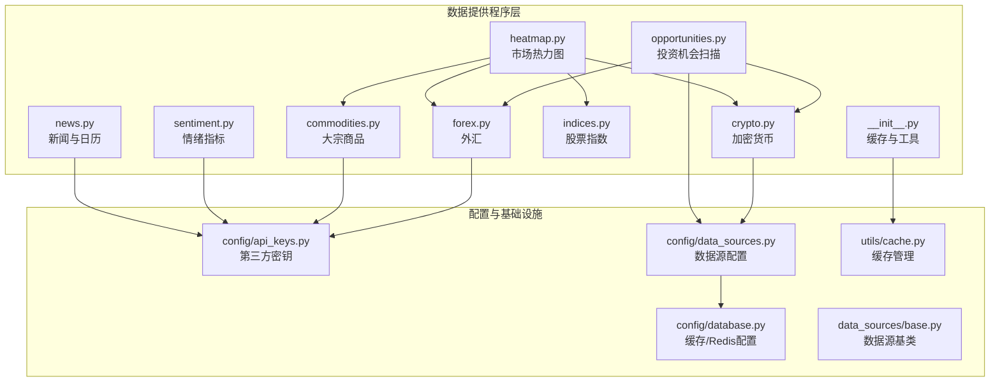
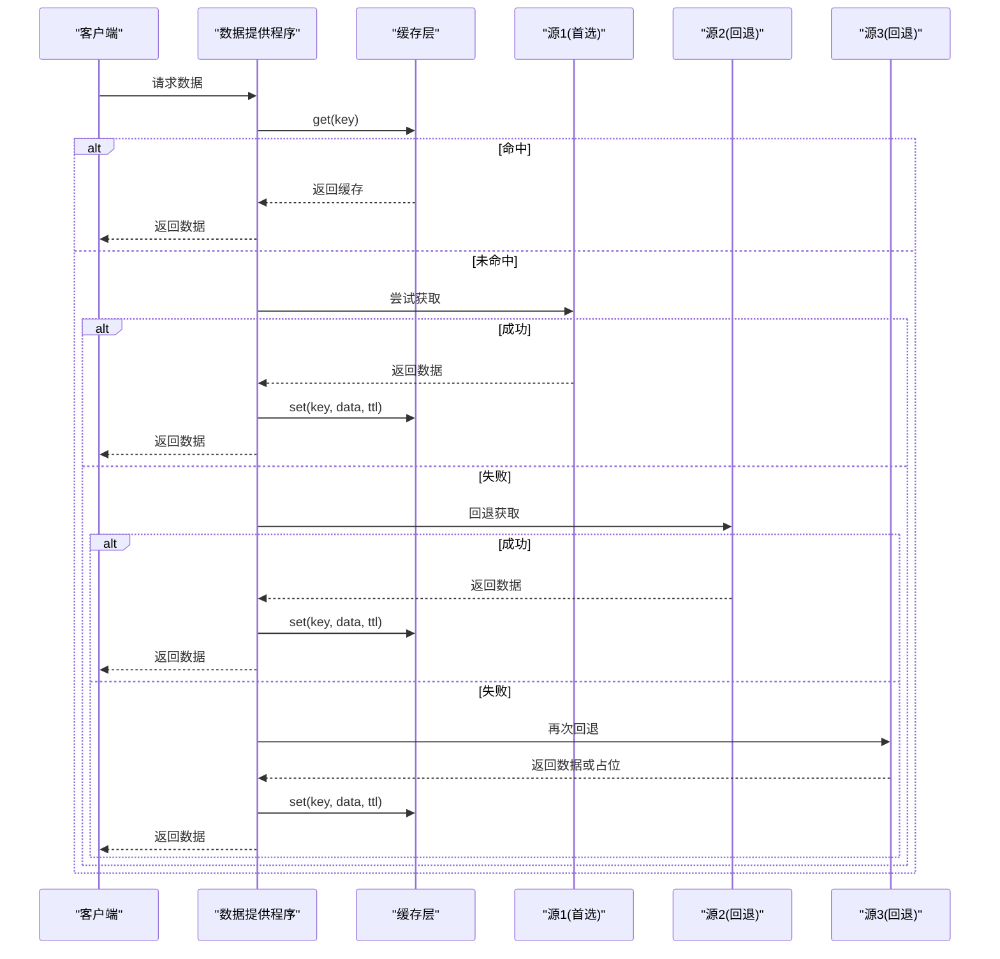
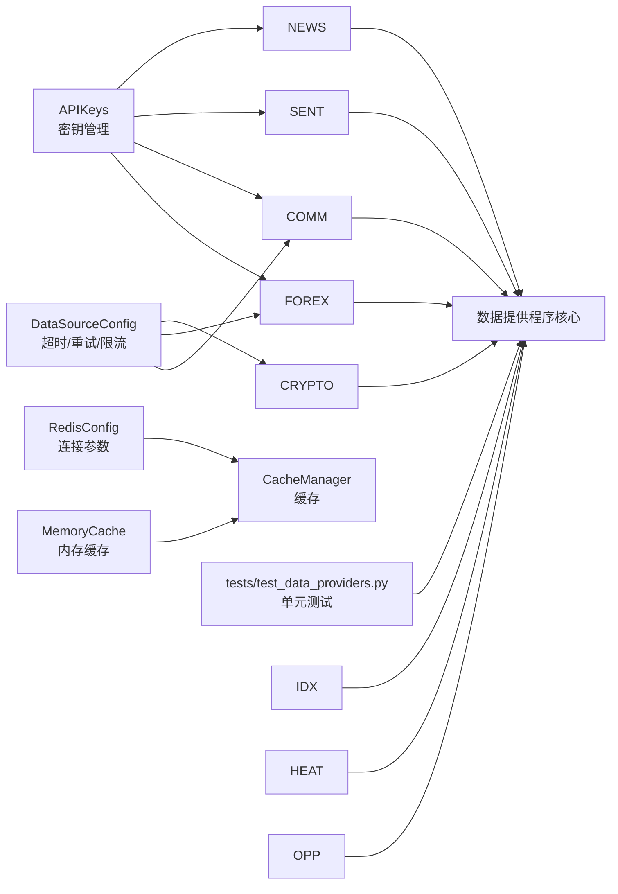

# 数据提供程序

<cite>
**本文引用的文件**
- [data_providers/__init__.py](file://backend_api_python/app/data_providers/__init__.py)
- [data_providers/news.py](file://backend_api_python/app/data_providers/news.py)
- [data_providers/sentiment.py](file://backend_api_python/app/data_providers/sentiment.py)
- [data_providers/commodities.py](file://backend_api_python/app/data_providers/commodities.py)
- [data_providers/indices.py](file://backend_api_python/app/data_providers/indices.py)
- [data_providers/heatmap.py](file://backend_api_python/app/data_providers/heatmap.py)
- [data_providers/opportunities.py](file://backend_api_python/app/data_providers/opportunities.py)
- [data_providers/crypto.py](file://backend_api_python/app/data_providers/crypto.py)
- [data_providers/forex.py](file://backend_api_python/app/data_providers/forex.py)
- [config/api_keys.py](file://backend_api_python/app/config/api_keys.py)
- [config/data_sources.py](file://backend_api_python/app/config/data_sources.py)
- [config/database.py](file://backend_api_python/app/config/database.py)
- [utils/cache.py](file://backend_api_python/app/utils/cache.py)
- [data_sources/base.py](file://backend_api_python/app/data_sources/base.py)
- [tests/test_data_providers.py](file://backend_api_python/tests/test_data_providers.py)
</cite>

## 目录
1. [简介](#简介)
2. [项目结构](#项目结构)
3. [核心组件](#核心组件)
4. [架构总览](#架构总览)
5. [详细组件分析](#详细组件分析)
6. [依赖分析](#依赖分析)
7. [性能考虑](#性能考虑)
8. [故障排查指南](#故障排查指南)
9. [结论](#结论)
10. [附录](#附录)

## 简介
本文件系统性梳理 QuantDinger 后端“数据提供程序”层的设计与实现，覆盖新闻、市场情绪、大宗商品、指数、市场热力图与投资机会等多类数据的采集、聚合与输出流程。文档重点说明：
- 各数据提供程序的职责边界与数据获取机制
- API 接口与返回数据格式
- 更新频率与缓存策略
- 配置项与使用示例
- 数据质量控制、错误处理与清洗机制
- 扩展新数据提供程序的开发指南与最佳实践

## 项目结构
数据提供程序位于后端 Python 应用的 app/data_providers 目录，采用按领域拆分的模块化组织方式，辅以统一的缓存与工具层。

**图表来源**
- [data_providers/__init__.py:1-86](file://backend_api_python/app/data_providers/__init__.py#L1-L86)
- [data_providers/heatmap.py:1-147](file://backend_api_python/app/data_providers/heatmap.py#L1-L147)
- [data_providers/opportunities.py:1-360](file://backend_api_python/app/data_providers/opportunities.py#L1-L360)
- [data_providers/news.py:1-150](file://backend_api_python/app/data_providers/news.py#L1-L150)
- [data_providers/sentiment.py:1-377](file://backend_api_python/app/data_providers/sentiment.py#L1-L377)
- [data_providers/commodities.py:1-181](file://backend_api_python/app/data_providers/commodities.py#L1-L181)
- [data_providers/indices.py:1-88](file://backend_api_python/app/data_providers/indices.py#L1-L88)
- [data_providers/crypto.py:1-232](file://backend_api_python/app/data_providers/crypto.py#L1-L232)
- [data_providers/forex.py:1-172](file://backend_api_python/app/data_providers/forex.py#L1-L172)
- [config/api_keys.py:1-164](file://backend_api_python/app/config/api_keys.py#L1-L164)
- [config/data_sources.py:1-171](file://backend_api_python/app/config/data_sources.py#L1-L171)
- [config/database.py:1-90](file://backend_api_python/app/config/database.py#L1-L90)
- [utils/cache.py:1-129](file://backend_api_python/app/utils/cache.py#L1-L129)
- [data_sources/base.py:1-171](file://backend_api_python/app/data_sources/base.py#L1-L171)

**章节来源**
- [data_providers/__init__.py:1-86](file://backend_api_python/app/data_providers/__init__.py#L1-L86)
- [data_providers/heatmap.py:1-147](file://backend_api_python/app/data_providers/heatmap.py#L1-L147)
- [data_providers/opportunities.py:1-360](file://backend_api_python/app/data_providers/opportunities.py#L1-L360)

## 核心组件
- 统一缓存与工具层
  - 提供缓存键前缀 dp: 的封装、默认 TTL 映射、清空缓存、安全数值转换等通用能力。
  - TTL 映射覆盖：加密货币热力图、外汇、指数、市场概览、商品、金融新闻、经济日历、市场情绪、交易机会等。
- 缓存管理器
  - 支持本地内存缓存与 Redis 缓存双栈，优先本地内存，可按需启用 Redis。
  - 提供 get/set/delete 与 TTL 控制，异常静默处理，保证服务启动不阻塞。

**章节来源**
- [data_providers/__init__.py:23-86](file://backend_api_python/app/data_providers/__init__.py#L23-L86)
- [utils/cache.py:49-129](file://backend_api_python/app/utils/cache.py#L49-L129)
- [config/database.py:49-90](file://backend_api_python/app/config/database.py#L49-L90)

## 架构总览
数据提供程序通过“多源回退 + 统一聚合”的模式，确保在任一上游数据源不可用时仍能返回稳定数据。热点数据通过缓存层加速访问，并在必要时进行清理。

**图表来源**
- [data_providers/commodities.py:155-181](file://backend_api_python/app/data_providers/commodities.py#L155-L181)
- [data_providers/forex.py:154-172](file://backend_api_python/app/data_providers/forex.py#L154-L172)
- [data_providers/crypto.py:118-170](file://backend_api_python/app/data_providers/crypto.py#L118-L170)
- [data_providers/__init__.py:45-58](file://backend_api_python/app/data_providers/__init__.py#L45-L58)

## 详细组件分析

### 新闻与经济日历
- 功能
  - 金融新闻抓取：基于搜索服务按关键词检索，自动去重，按语言分类返回。
  - 经济日历：生成模拟事件，标注重要性、预期/前值、影响方向与描述，支持中英文。
- 接口
  - fetch_financial_news(lang: "all"|"cn"|"en") -> Dict[str, List[Dict]]
  - get_economic_calendar() -> List[Dict]
- 数据格式
  - 新闻：标题、链接、摘要、来源、发布时间、分类、语言等字段。
  - 日历：名称、国家、日期时间、重要性、实际/预期/前值、影响描述、是否已发布等。
- 更新频率
  - 新闻：按请求触发，缓存 TTL 为 180 秒。
  - 日历：按请求触发，缓存 TTL 为 3600 秒。
- 错误处理
  - 搜索异常与解析异常均被吞并，保证主流程不中断；日志记录错误信息。
- 使用示例
  - 在路由或服务中调用对应函数，直接获得结构化数据。

**章节来源**
- [data_providers/news.py:13-150](file://backend_api_python/app/data_providers/news.py#L13-L150)
- [data_providers/__init__.py:23-36](file://backend_api_python/app/data_providers/__init__.py#L23-L36)

### 市场情绪指标
- 功能
  - 恐惧与贪婪指数、VIX、美元指数(DXY)、收益率曲线(10Y-2Y)、VXN、GVZ、期权Put/Call比率等。
  - 多源回退：优先 yfinance，其次 akshare 或替代 API，最后返回默认值。
- 接口
  - fetch_fear_greed_index() -> Dict
  - fetch_vix() -> Dict
  - fetch_dollar_index() -> Dict
  - fetch_yield_curve() -> Dict
  - fetch_vxn() -> Dict
  - fetch_gvz() -> Dict
  - fetch_put_call_ratio() -> Dict
- 数据格式
  - 数值、变化百分比、级别分类、解释文本（中英文）、时间戳等。
- 更新频率
  - 默认缓存 TTL 为 21600 秒；部分指标有独立缓存策略。
- 错误处理
  - 超时、网络异常、解析异常均捕获并记录；失败时返回默认值，避免中断。
- 使用示例
  - 在情绪面板或策略中调用相应函数，获取标准化指标。

**章节来源**
- [data_providers/sentiment.py:12-377](file://backend_api_python/app/data_providers/sentiment.py#L12-L377)
- [data_providers/__init__.py:23-36](file://backend_api_python/app/data_providers/__init__.py#L23-L36)

### 大宗商品
- 功能
  - 金、银、WTI、布伦特、铜、天然气等商品价格与涨跌幅。
  - 多源回退：Twelve Data → yfinance → Tiingo FX（贵金属）。
- 接口
  - fetch_commodities() -> List[Dict]
- 数据格式
  - 符号、名称（中英文）、价格、涨跌幅、单位、类别等。
- 更新频率
  - 默认缓存 TTL 为 120 秒。
- 错误处理
  - 单品失败不影响整体；若全部失败，返回占位数据。
- 使用示例
  - 在商品面板或热力图中调用，获取标准化商品行情。

**章节来源**
- [data_providers/commodities.py:13-181](file://backend_api_python/app/data_providers/commodities.py#L13-L181)
- [data_providers/__init__.py:23-36](file://backend_api_python/app/data_providers/__init__.py#L23-L36)

### 股票指数
- 功能
  - 主要全球股指（标普、道琼斯、纳指、DAX、富时100、CAC40、日经225、KOSPI、ASX200、SENSEX）。
- 接口
  - fetch_stock_indices() -> List[Dict]
- 数据格式
  - 符号、名称（中英文）、价格、涨跌幅、地区、旗帜、经纬度、类别等。
- 更新频率
  - 默认缓存 TTL 为 120 秒。
- 错误处理
  - 单指数失败不影响其他；缺失时填充默认值。
- 使用示例
  - 在指数面板或热力图中调用。

**章节来源**
- [data_providers/indices.py:11-88](file://backend_api_python/app/data_providers/indices.py#L11-L88)
- [data_providers/__init__.py:23-36](file://backend_api_python/app/data_providers/__init__.py#L23-L36)

### 市场热力图
- 功能
  - 聚合加密货币、外汇、大宗商品、指数与板块（ETF）涨跌幅，形成统一热力图。
  - 加密货币优先使用热力图专用接口，回退到价格接口；外汇与商品从缓存读取；指数复用概览缓存；板块通过 ETF 行情计算。
- 接口
  - generate_heatmap_data() -> Dict[str, Any]
- 数据格式
  - crypto/sectors/forex/commodities/indices 字段，每项包含名称、数值（涨跌幅）、价格、单位等。
- 更新频率
  - 各子域独立 TTL：加密货币热力图 300s，外汇/商品/指数/市场概览 120s。
- 错误处理
  - 子域失败不影响整体；未命中缓存时尝试回退源。
- 使用示例
  - 在热力图页面调用，一次性获取全量热力图数据。

**章节来源**
- [data_providers/heatmap.py:20-147](file://backend_api_python/app/data_providers/heatmap.py#L20-L147)
- [data_providers/__init__.py:23-36](file://backend_api_python/app/data_providers/__init__.py#L23-L36)

### 投资机会扫描
- 功能
  - 跨市场机会扫描：加密货币、美股、港股/沪深、外汇、预测市场 Polymarket。
  - 自动化规则：根据涨跌幅阈值识别超买/超卖/动量/震荡等信号，给出强度与影响方向。
- 接口
  - analyze_opportunities_crypto(list)
  - analyze_opportunities_stocks(list)
  - analyze_opportunities_local_stocks(list, market)
  - analyze_opportunities_forex(list)
  - analyze_opportunities_polymarket(list)
- 数据格式
  - 每条机会包含：符号、名称、价格、涨跌幅、信号、强度、原因、影响、市场、时间戳等。
- 更新频率
  - 各市场缓存 TTL：股票机会 3600s，外汇 3600s，本地股票机会按市场缓存。
- 错误处理
  - 子域失败记录日志并跳过；最终返回汇总列表。
- 使用示例
  - 在机会面板或策略中调用，传入空列表接收结果。

**章节来源**
- [data_providers/opportunities.py:131-360](file://backend_api_python/app/data_providers/opportunities.py#L131-L360)
- [data_providers/__init__.py:23-36](file://backend_api_python/app/data_providers/__init__.py#L23-L36)

### 加密货币
- 功能
  - 价格与涨跌幅：优先 CCXT（系统已有数据源），回退 yfinance，再回退 CoinGecko。
  - 热力图：CoinGecko 与 CoinCap 两种来源，带重试。
- 接口
  - fetch_crypto_prices() -> List[Dict]
  - fetch_crypto_heatmap_coingecko() -> List[Dict]
  - fetch_crypto_heatmap_coincap() -> List[Dict]
  - fetch_crypto_prices_ccxt() -> List[Dict]
  - fetch_crypto_prices_yfinance() -> List[Dict]
- 数据格式
  - 符号、名称、价格、24/7日涨跌幅、市值、成交量、图片、类别等。
- 更新频率
  - 价格接口默认 TTL 为 300s（热力图）或 3600s（股票机会）。
- 错误处理
  - 多源回退，失败返回占位数据。
- 使用示例
  - 在加密货币面板或热力图中调用。

**章节来源**
- [data_providers/crypto.py:13-232](file://backend_api_python/app/data_providers/crypto.py#L13-L232)
- [data_providers/__init__.py:23-36](file://backend_api_python/app/data_providers/__init__.py#L23-L36)

### 外汇
- 功能
  - 主要货币对（EUR/USD、GBP/USD、USD/JPY、USD/CNH、AUD/USD、USD/CAD、USD/CHF、NZD/USD）。
  - 多源回退：Twelve Data → yfinance → Tiingo FX。
- 接口
  - fetch_forex_pairs() -> List[Dict]
- 数据格式
  - 符号、名称（中英文）、价格、涨跌幅、基础/计价货币、类别等。
- 更新频率
  - 默认 TTL 为 120s。
- 错误处理
  - 单对失败不影响整体；若全部失败，返回空列表。
- 使用示例
  - 在外汇面板或热力图中调用。

**章节来源**
- [data_providers/forex.py:13-172](file://backend_api_python/app/data_providers/forex.py#L13-L172)
- [data_providers/__init__.py:23-36](file://backend_api_python/app/data_providers/__init__.py#L23-L36)

## 依赖分析
- 配置体系
  - API 密钥：集中于 APIKeys 元类，支持环境变量与附加配置文件双重来源，便于轮换与私有化部署。
  - 数据源配置：统一管理超时、重试、限流、代理等参数，便于全局一致性控制。
  - 缓存/Redis：可选启用，本地优先，失败自动降级为内存缓存。
- 数据源基类
  - 定义 K 线与最新行情接口规范，提供时间范围计算、过滤与延迟告警等通用逻辑。
- 测试验证
  - 对缓存层、安全数值转换、经济日历、Adanos 情绪接口等进行单元测试，覆盖边界与错误场景。

**图表来源**
- [config/api_keys.py:1-164](file://backend_api_python/app/config/api_keys.py#L1-L164)
- [config/data_sources.py:1-171](file://backend_api_python/app/config/data_sources.py#L1-L171)
- [config/database.py:1-90](file://backend_api_python/app/config/database.py#L1-L90)
- [utils/cache.py:49-129](file://backend_api_python/app/utils/cache.py#L49-L129)
- [tests/test_data_providers.py:1-193](file://backend_api_python/tests/test_data_providers.py#L1-L193)

**章节来源**
- [config/api_keys.py:1-164](file://backend_api_python/app/config/api_keys.py#L1-L164)
- [config/data_sources.py:1-171](file://backend_api_python/app/config/data_sources.py#L1-L171)
- [config/database.py:1-90](file://backend_api_python/app/config/database.py#L1-L90)
- [utils/cache.py:1-129](file://backend_api_python/app/utils/cache.py#L1-L129)
- [data_sources/base.py:1-171](file://backend_api_python/app/data_sources/base.py#L1-L171)
- [tests/test_data_providers.py:1-193](file://backend_api_python/tests/test_data_providers.py#L1-L193)

## 性能考虑
- 缓存策略
  - 为高频访问数据设置合理 TTL，减少外部 API 压力；热点数据（如加密货币热力图）短 TTL 保障时效性。
  - 支持 Redis 与内存双栈，生产环境建议启用 Redis 以提升并发与共享能力。
- 多源回退
  - 通过回退链路降低单点故障影响，提高可用性；同时避免重复请求，优先命中缓存。
- 数据清洗与安全
  - safe_float 与去重逻辑确保返回数据类型一致、无重复项。
- 延迟检测
  - 数据源基类提供 K 线延迟检测与告警，帮助定位数据源异常。

**章节来源**
- [data_providers/__init__.py:23-86](file://backend_api_python/app/data_providers/__init__.py#L23-L86)
- [utils/cache.py:1-129](file://backend_api_python/app/utils/cache.py#L1-L129)
- [data_sources/base.py:133-171](file://backend_api_python/app/data_sources/base.py#L133-L171)

## 故障排查指南
- 常见问题
  - 外部 API 超时/限流：检查 DataSourceConfig 中的超时与重试配置，必要时调整限流参数。
  - 缓存不可用：确认 CACHE_ENABLED 与 Redis 连接参数，若 Redis 不可用会自动降级为内存缓存。
  - 密钥缺失：检查 APIKeys 对应环境变量或附加配置，确保密钥存在且有效。
- 定位手段
  - 查看日志：各模块均有详细日志记录请求状态与异常信息。
  - 单元测试：参考测试用例快速验证缓存、数值转换与情绪接口行为。
- 快速修复
  - 清理缓存：调用 clear_cache 清除所有 dp:* 键，强制重新拉取。
  - 降低阈值：机会扫描阈值可根据市场波动性调整，避免误报。

**章节来源**
- [tests/test_data_providers.py:1-193](file://backend_api_python/tests/test_data_providers.py#L1-L193)
- [data_providers/__init__.py:61-78](file://backend_api_python/app/data_providers/__init__.py#L61-L78)
- [config/database.py:53-90](file://backend_api_python/app/config/database.py#L53-L90)

## 结论
QuantDinger 的数据提供程序层通过“多源回退 + 统一缓存 + 规范化输出”的设计，在保证稳定性的同时兼顾了灵活性与可扩展性。针对不同数据域（新闻、情绪、商品、指数、热力图、机会）提供了清晰的职责划分与一致的接口契约，便于前端与策略层消费。

## 附录

### 配置选项与使用示例

- 环境变量与配置文件
  - API 密钥：TWELVE_DATA_API_KEY、TIINGO_API_KEY、FINNHUB_API_KEY、ADANOS_API_KEY 等。
  - 缓存开关：CACHE_ENABLED=true/false，默认关闭。
  - Redis 参数：REDIS_HOST、REDIS_PORT、REDIS_PASSWORD、REDIS_DB、REDIS_CONNECT_TIMEOUT、REDIS_SOCKET_TIMEOUT。
  - 数据源参数：DATA_SOURCE_TIMEOUT、DATA_SOURCE_RETRY、DATA_SOURCE_RETRY_BACKOFF、FINNHUB_TIMEOUT、FINNHUB_RATE_LIMIT、TIINGO_TIMEOUT、YFINANCE_TIMEOUT、CCXT_TIMEOUT、CCXT_DEFAULT_EXCHANGE、PROXY_URL 等。
- 使用示例（路径）
  - 获取加密货币价格：调用 [fetch_crypto_prices:118-170](file://backend_api_python/app/data_providers/crypto.py#L118-L170)
  - 获取外汇货币对：调用 [fetch_forex_pairs:154-172](file://backend_api_python/app/data_providers/forex.py#L154-L172)
  - 获取大宗商品行情：调用 [fetch_commodities:155-181](file://backend_api_python/app/data_providers/commodities.py#L155-L181)
  - 获取股票指数：调用 [fetch_stock_indices:30-88](file://backend_api_python/app/data_providers/indices.py#L30-L88)
  - 生成热力图：调用 [generate_heatmap_data:20-147](file://backend_api_python/app/data_providers/heatmap.py#L20-L147)
  - 扫描投资机会：调用 [analyze_opportunities_*:131-360](file://backend_api_python/app/data_providers/opportunities.py#L131-L360)
  - 获取新闻与日历：调用 [fetch_financial_news:13-70](file://backend_api_python/app/data_providers/news.py#L13-L70)、[get_economic_calendar:90-150](file://backend_api_python/app/data_providers/news.py#L90-L150)
  - 获取情绪指标：调用 [fetch_*:12-377](file://backend_api_python/app/data_providers/sentiment.py#L12-L377)

**章节来源**
- [config/api_keys.py:1-164](file://backend_api_python/app/config/api_keys.py#L1-L164)
- [config/data_sources.py:1-171](file://backend_api_python/app/config/data_sources.py#L1-L171)
- [config/database.py:1-90](file://backend_api_python/app/config/database.py#L1-L90)
- [data_providers/crypto.py:118-170](file://backend_api_python/app/data_providers/crypto.py#L118-L170)
- [data_providers/forex.py:154-172](file://backend_api_python/app/data_providers/forex.py#L154-L172)
- [data_providers/commodities.py:155-181](file://backend_api_python/app/data_providers/commodities.py#L155-L181)
- [data_providers/indices.py:30-88](file://backend_api_python/app/data_providers/indices.py#L30-L88)
- [data_providers/heatmap.py:20-147](file://backend_api_python/app/data_providers/heatmap.py#L20-L147)
- [data_providers/opportunities.py:131-360](file://backend_api_python/app/data_providers/opportunities.py#L131-L360)
- [data_providers/news.py:13-150](file://backend_api_python/app/data_providers/news.py#L13-L150)
- [data_providers/sentiment.py:12-377](file://backend_api_python/app/data_providers/sentiment.py#L12-L377)

### 扩展新数据提供程序开发指南与最佳实践
- 设计原则
  - 单一职责：每个模块聚焦一个数据域，接口清晰、返回结构一致。
  - 多源回退：至少提供两级回退（首选 + 备选），失败时返回占位数据并记录日志。
  - 缓存优先：对高频数据设置合理 TTL；使用统一缓存工具层封装 get/set/clear。
  - 类型安全：使用 safe_float 等工具进行数值清洗，避免 NaN/Inf。
- 接口约定
  - 函数命名语义化，返回结构化字典/列表；必要时提供独立的“热力图专用”接口。
  - 对外暴露的函数作为 API，内部实现拆分为 _fetch_* 辅助函数。
- 配置与密钥
  - 通过 APIKeys 元类集中管理密钥，支持环境变量与附加配置文件。
  - 对外依赖的第三方 API 参数（超时、限流、代理）统一收敛至 DataSourceConfig。
- 测试与监控
  - 编写单元测试覆盖正常/异常/边界场景；利用现有测试框架验证缓存与数值转换。
  - 在关键路径添加日志，便于问题定位与性能观测。
- 参考实现
  - 商品、外汇、加密货币模块展示了多源回退与缓存的最佳实践。
  - 热力图模块展示了聚合策略与缓存复用。

**章节来源**
- [data_providers/commodities.py:155-181](file://backend_api_python/app/data_providers/commodities.py#L155-L181)
- [data_providers/forex.py:154-172](file://backend_api_python/app/data_providers/forex.py#L154-L172)
- [data_providers/crypto.py:118-170](file://backend_api_python/app/data_providers/crypto.py#L118-L170)
- [data_providers/heatmap.py:20-147](file://backend_api_python/app/data_providers/heatmap.py#L20-L147)
- [config/api_keys.py:1-164](file://backend_api_python/app/config/api_keys.py#L1-L164)
- [config/data_sources.py:1-171](file://backend_api_python/app/config/data_sources.py#L1-L171)
- [tests/test_data_providers.py:1-193](file://backend_api_python/tests/test_data_providers.py#L1-L193)