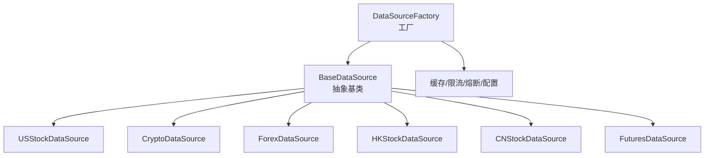
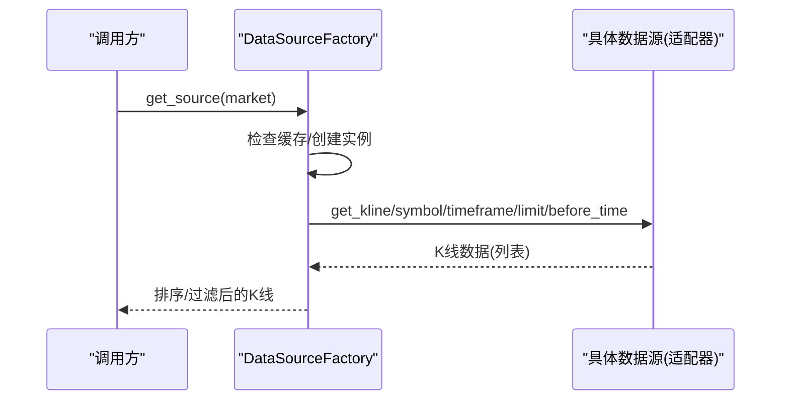
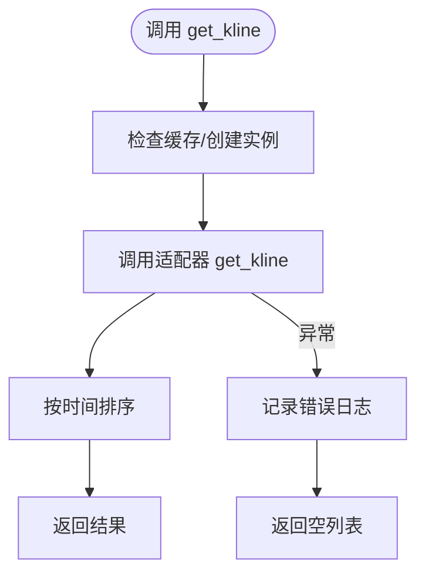
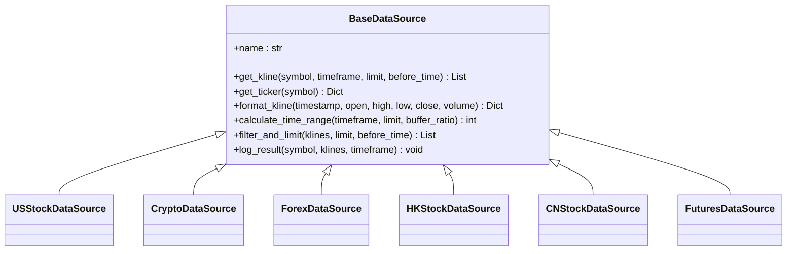
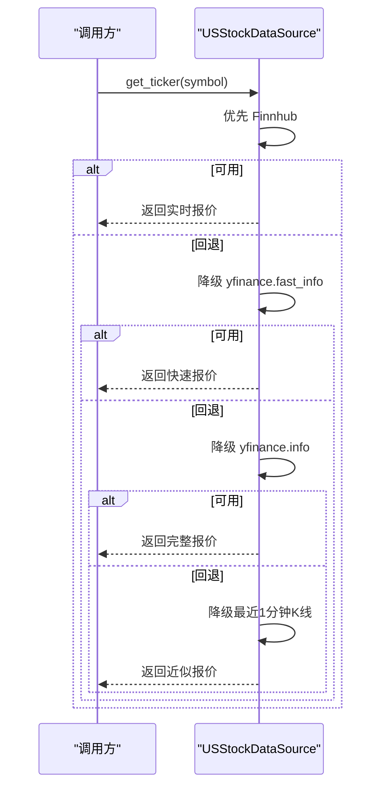
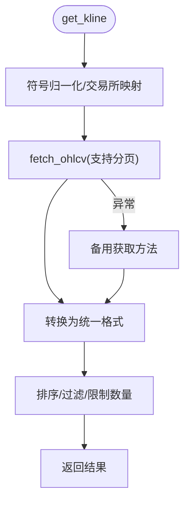
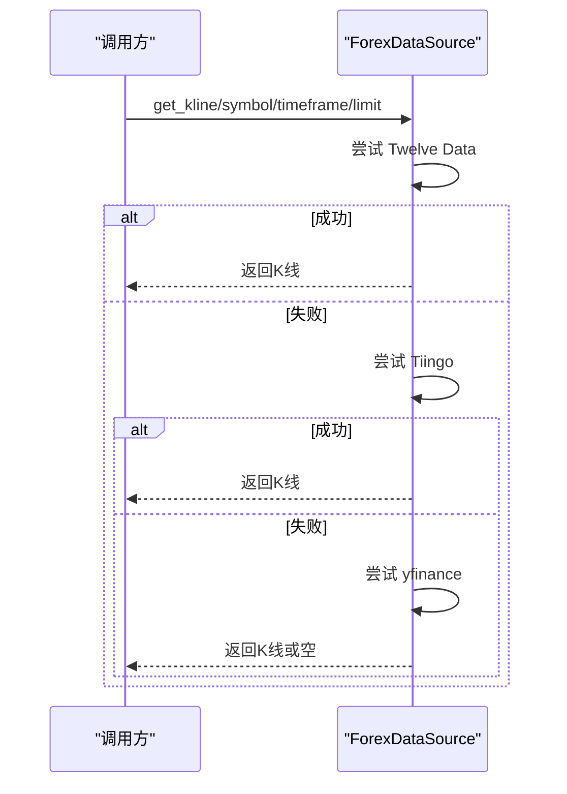
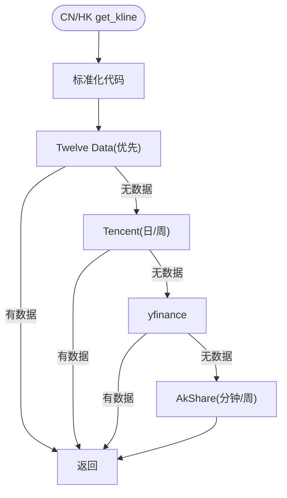
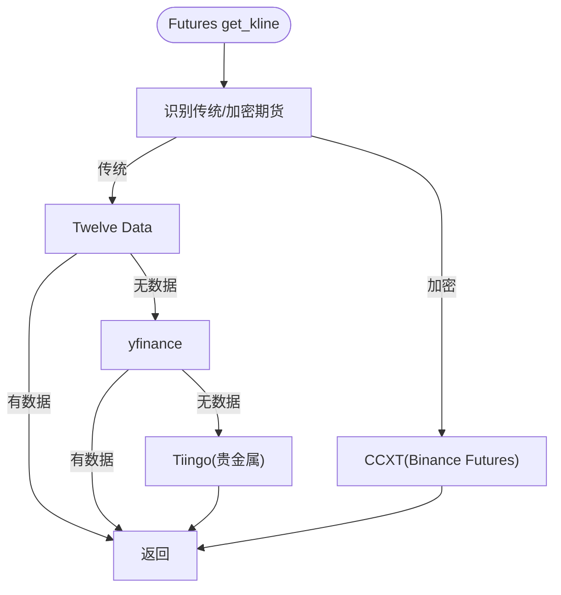
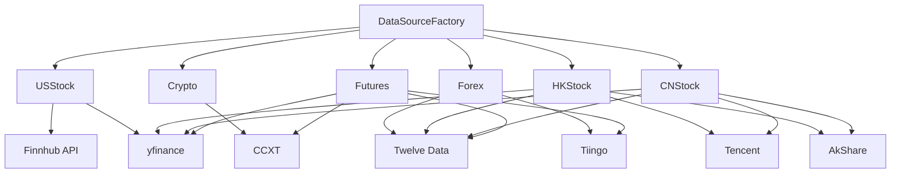

# 数据源工厂模式

<cite>
**本文引用的文件**
- [factory.py](file://backend_api_python/app/data_sources/factory.py)
- [base.py](file://backend_api_python/app/data_sources/base.py)
- [__init__.py](file://backend_api_python/app/data_sources/__init__.py)
- [crypto.py](file://backend_api_python/app/data_sources/crypto.py)
- [us_stock.py](file://backend_api_python/app/data_sources/us_stock.py)
- [cn_stock.py](file://backend_api_python/app/data_sources/cn_stock.py)
- [hk_stock.py](file://backend_api_python/app/data_sources/hk_stock.py)
- [forex.py](file://backend_api_python/app/data_sources/forex.py)
- [futures.py](file://backend_api_python/app/data_sources/futures.py)
- [data_sources.py](file://backend_api_python/app/config/data_sources.py)
- [cache_manager.py](file://backend_api_python/app/data_sources/cache_manager.py)
- [rate_limiter.py](file://backend_api_python/app/data_sources/rate_limiter.py)
- [circuit_breaker.py](file://backend_api_python/app/data_sources/circuit_breaker.py)
- [tencent.py](file://backend_api_python/app/data_sources/tencent.py)
- [asia_stock_kline.py](file://backend_api_python/app/data_sources/asia_stock_kline.py)
</cite>

## 目录
1. [简介](#简介)
2. [项目结构](#项目结构)
3. [核心组件](#核心组件)
4. [架构总览](#架构总览)
5. [详细组件分析](#详细组件分析)
6. [依赖分析](#依赖分析)
7. [性能考虑](#性能考虑)
8. [故障排查指南](#故障排查指南)
9. [结论](#结论)
10. [附录](#附录)

## 简介
本文件系统性阐述 QuantDinger 后端的数据源工厂模式与适配器体系，重点覆盖：
- DataSourceFactory 的工厂方法设计与市场类型路由机制
- BaseDataSource 抽象基类的统一接口与通用能力
- USStock、Crypto、Forex、HKStock、CNStock、Futures 等市场的数据适配器实现差异
- 数据源切换、错误处理与熔断/限流/缓存等工程化保障
- 实际配置示例与扩展新数据源的开发指南

## 项目结构
数据源相关代码集中在 backend_api_python/app/data_sources 目录，采用“工厂 + 抽象基类 + 多适配器”的分层组织：
- 工厂层：DataSourceFactory 提供统一入口，按市场类型创建具体数据源实例
- 基类层：BaseDataSource 定义统一接口与通用工具（格式化、过滤、时间范围估算、延迟检测）
- 适配器层：各市场专用实现（USStock、Crypto、Forex、HKStock、CNStock、Futures）
- 工程化支撑：缓存、限流、熔断、配置等

图表来源
- [factory.py:13-134](file://backend_api_python/app/data_sources/factory.py#L13-L134)
- [base.py:27-171](file://backend_api_python/app/data_sources/base.py#L27-L171)
- [__init__.py:10-44](file://backend_api_python/app/data_sources/__init__.py#L10-L44)

章节来源
- [factory.py:13-134](file://backend_api_python/app/data_sources/factory.py#L13-L134)
- [base.py:27-171](file://backend_api_python/app/data_sources/base.py#L27-L171)
- [__init__.py:10-44](file://backend_api_python/app/data_sources/__init__.py#L10-L44)

## 核心组件
- 工厂类 DataSourceFactory
  - 提供 get_source(market) 按市场类型创建并缓存数据源实例
  - 提供 get_data_source(name) 向后兼容旧调用（如“binance”等）
  - 提供 get_kline()/get_ticker() 快捷方法，内置错误捕获与日志
- 抽象基类 BaseDataSource
  - 统一接口：get_kline(symbol, timeframe, limit, before_time)、可选 get_ticker(symbol)
  - 通用工具：format_kline、calculate_time_range、filter_and_limit、log_result
- 适配器实现
  - USStock：优先 Finnhub，回退 yfinance；支持分钟/日线等周期
  - Crypto：基于 CCXT，符号归一化、交易所差异适配、分页拉取
  - Forex：Twelve Data → Tiingo → yfinance 三级降级
  - HK/CN Stock：Twelve Data → Tencent → yfinance → AkShare 多层降级
  - Futures：传统期货（Twelve Data → yfinance → Tiingo）与加密货币期货（CCXT）

章节来源
- [factory.py:13-134](file://backend_api_python/app/data_sources/factory.py#L13-L134)
- [base.py:27-171](file://backend_api_python/app/data_sources/base.py#L27-L171)
- [us_stock.py:17-318](file://backend_api_python/app/data_sources/us_stock.py#L17-L318)
- [crypto.py:16-388](file://backend_api_python/app/data_sources/crypto.py#L16-L388)
- [forex.py:95-690](file://backend_api_python/app/data_sources/forex.py#L95-L690)
- [hk_stock.py:30-100](file://backend_api_python/app/data_sources/hk_stock.py#L30-L100)
- [cn_stock.py:30-100](file://backend_api_python/app/data_sources/cn_stock.py#L30-L100)
- [futures.py:60-465](file://backend_api_python/app/data_sources/futures.py#L60-L465)

## 架构总览
工厂模式通过 DataSourceFactory 将“调用方”与“具体数据源实现”解耦。调用方仅需传入市场类型或名称，工厂负责创建/复用实例，并委托具体适配器完成数据获取。

图表来源
- [factory.py:18-106](file://backend_api_python/app/data_sources/factory.py#L18-L106)
- [base.py:32-53](file://backend_api_python/app/data_sources/base.py#L32-L53)

章节来源
- [factory.py:18-106](file://backend_api_python/app/data_sources/factory.py#L18-L106)
- [base.py:32-53](file://backend_api_python/app/data_sources/base.py#L32-L53)

## 详细组件分析

### 工厂类 DataSourceFactory
- 设计要点
  - 单例式缓存：内部维护市场到实例的映射，避免重复创建
  - 市场路由：支持 Crypto、CNStock、HKStock、USStock、Forex、Futures
  - 向后兼容：get_data_source(name) 对接历史调用（如“binance”）
  - 快捷方法：get_kline/get_ticker 内置排序、过滤与异常兜底
- 错误处理
  - 具体适配器抛出异常时记录错误日志并返回空结果
  - get_ticker 对未实现场景给出默认回退

图表来源
- [factory.py:74-106](file://backend_api_python/app/data_sources/factory.py#L74-L106)

章节来源
- [factory.py:13-134](file://backend_api_python/app/data_sources/factory.py#L13-L134)

### 抽象基类 BaseDataSource
- 接口契约
  - get_kline：统一返回包含 time/open/high/low/close/volume 的字典列表
  - get_ticker：可选实现，返回包含最新价等字段的字典
- 通用能力
  - format_kline：统一数值精度与字段命名
  - calculate_time_range：按周期与数量估算请求窗口
  - filter_and_limit：按时间边界与数量上限裁剪
  - log_result：检测数据延迟并发出告警

图表来源
- [base.py:27-171](file://backend_api_python/app/data_sources/base.py#L27-L171)
- [us_stock.py:17-318](file://backend_api_python/app/data_sources/us_stock.py#L17-L318)
- [crypto.py:16-388](file://backend_api_python/app/data_sources/crypto.py#L16-L388)
- [forex.py:95-690](file://backend_api_python/app/data_sources/forex.py#L95-L690)
- [hk_stock.py:30-100](file://backend_api_python/app/data_sources/hk_stock.py#L30-L100)
- [cn_stock.py:30-100](file://backend_api_python/app/data_sources/cn_stock.py#L30-L100)
- [futures.py:60-465](file://backend_api_python/app/data_sources/futures.py#L60-L465)

章节来源
- [base.py:27-171](file://backend_api_python/app/data_sources/base.py#L27-L171)

### US 股数据源（USStock）
- 优先级：Finnhub（实时）→ yfinance.fast_info → yfinance.info → 历史1分钟回退
- 周期映射与天数估算：针对分钟/小时/日/周周期分别计算请求天数
- 输出：统一格式字典，包含 last/change/changePercent/high/low/open/previousClose

图表来源
- [us_stock.py:58-168](file://backend_api_python/app/data_sources/us_stock.py#L58-L168)

章节来源
- [us_stock.py:17-318](file://backend_api_python/app/data_sources/us_stock.py#L17-L318)

### 加密货币数据源（Crypto）
- 适配器：基于 CCXT，支持多交易所（默认可配置）
- 符号归一化：处理 BTCUSDT、BTC/USDT、BTC/USDT:USDT 等多种输入
- 交易所差异：针对 Coinbase、Kraken 等特殊映射进行修正
- 分页拉取：当指定 before_time 时，按时间窗口分批请求直至覆盖完整范围
- 输出：统一格式 K 线列表

图表来源
- [crypto.py:232-297](file://backend_api_python/app/data_sources/crypto.py#L232-L297)
- [crypto.py:299-386](file://backend_api_python/app/data_sources/crypto.py#L299-L386)

章节来源
- [crypto.py:16-388](file://backend_api_python/app/data_sources/crypto.py#L16-L388)

### 外汇数据源（Forex）
- 三级降级：Twelve Data → Tiingo → yfinance
- 缓存：全局缓存（TTL）提升高频查询性能
- 周期与符号映射：内部维护映射表以适配不同数据源的周期/符号规范
- 聚合：Tiingo 周/月线通过日线聚合生成

图表来源
- [forex.py:303-325](file://backend_api_python/app/data_sources/forex.py#L303-L325)
- [forex.py:327-373](file://backend_api_python/app/data_sources/forex.py#L327-L373)
- [forex.py:375-560](file://backend_api_python/app/data_sources/forex.py#L375-L560)
- [forex.py:644-689](file://backend_api_python/app/data_sources/forex.py#L644-L689)

章节来源
- [forex.py:95-690](file://backend_api_python/app/data_sources/forex.py#L95-L690)

### 港/美股票数据源（HK/CN）
- 多层降级：Twelve Data → Tencent → yfinance → AkShare
- CN/HK 代码标准化：统一转换为腾讯风格代码，再映射到 yfinance/Twelve Data
- 输出：统一格式 K 线列表

图表来源
- [cn_stock.py:53-99](file://backend_api_python/app/data_sources/cn_stock.py#L53-L99)
- [hk_stock.py:53-99](file://backend_api_python/app/data_sources/hk_stock.py#L53-L99)
- [tencent.py:24-239](file://backend_api_python/app/data_sources/tencent.py#L24-L239)
- [asia_stock_kline.py:169-264](file://backend_api_python/app/data_sources/asia_stock_kline.py#L169-L264)
- [asia_stock_kline.py:355-408](file://backend_api_python/app/data_sources/asia_stock_kline.py#L355-L408)
- [asia_stock_kline.py:485-530](file://backend_api_python/app/data_sources/asia_stock_kline.py#L485-L530)
- [asia_stock_kline.py:533-592](file://backend_api_python/app/data_sources/asia_stock_kline.py#L533-L592)

章节来源
- [cn_stock.py:30-100](file://backend_api_python/app/data_sources/cn_stock.py#L30-L100)
- [hk_stock.py:30-100](file://backend_api_python/app/data_sources/hk_stock.py#L30-L100)
- [tencent.py:24-239](file://backend_api_python/app/data_sources/tencent.py#L24-L239)
- [asia_stock_kline.py:169-592](file://backend_api_python/app/data_sources/asia_stock_kline.py#L169-L592)

### 期货数据源（Futures）
- 传统期货：Twelve Data → yfinance → Tiingo（贵金属）
- 加密货币期货：CCXT（默认 Binance Futures）
- 符号与周期映射：针对 CCXT 与 yfinance 的差异进行适配

图表来源
- [futures.py:217-237](file://backend_api_python/app/data_sources/futures.py#L217-L237)
- [futures.py:239-258](file://backend_api_python/app/data_sources/futures.py#L239-L258)
- [futures.py:415-463](file://backend_api_python/app/data_sources/futures.py#L415-L463)

章节来源
- [futures.py:60-465](file://backend_api_python/app/data_sources/futures.py#L60-L465)

## 依赖分析
- 工厂与适配器
  - 工厂通过字符串路由创建具体适配器实例，耦合度低，便于扩展
- 适配器与外部服务
  - USStock：Finnhub、yfinance
  - Crypto：CCXT（可配置交易所）
  - Forex：Twelve Data、Tiingo、yfinance
  - HK/CN：Twelve Data、Tencent、yfinance、AkShare
  - Futures：Twelve Data、yfinance、Tiingo、CCXT
- 工程化组件
  - 缓存：DataCache（TTL/LRU）
  - 限流：RateLimiter（随机抖动、指数退避）
  - 熔断：CircuitBreaker（三态状态机）
  - 配置：CCXTConfig、YFinanceConfig、TiingoConfig、AkshareConfig 等

图表来源
- [factory.py:49-71](file://backend_api_python/app/data_sources/factory.py#L49-L71)
- [us_stock.py:47-56](file://backend_api_python/app/data_sources/us_stock.py#L47-L56)
- [crypto.py:40-48](file://backend_api_python/app/data_sources/crypto.py#L40-L48)
- [forex.py:113-118](file://backend_api_python/app/data_sources/forex.py#L113-L118)
- [hk_stock.py:64-78](file://backend_api_python/app/data_sources/hk_stock.py#L64-L78)
- [cn_stock.py:64-68](file://backend_api_python/app/data_sources/cn_stock.py#L64-L68)
- [futures.py:90-106](file://backend_api_python/app/data_sources/futures.py#L90-L106)

章节来源
- [factory.py:49-71](file://backend_api_python/app/data_sources/factory.py#L49-L71)
- [data_sources.py:101-150](file://backend_api_python/app/config/data_sources.py#L101-L150)

## 性能考虑
- 缓存策略
  - DataCache：TTL 过期 + LRU 淘汰，支持统计与清理
  - 适用场景：实时行情（20分钟）、K线（5分钟）、股票信息（24小时）
- 限流与防封禁
  - RateLimiter：最小间隔 + 随机抖动 + 指数退避重试
  - 请求头轮换与随机 User-Agent，降低被封风险
- 熔断保护
  - CircuitBreaker：失败阈值触发熔断，冷却后半开试探，成功恢复
- 数据获取优化
  - BaseDataSource：统一格式化、过滤与时间范围估算，减少下游重复处理
  - Crypto/Futures：分页拉取与窗口估算，避免超大请求

章节来源
- [cache_manager.py:44-233](file://backend_api_python/app/data_sources/cache_manager.py#L44-L233)
- [rate_limiter.py:109-273](file://backend_api_python/app/data_sources/rate_limiter.py#L109-L273)
- [circuit_breaker.py:31-175](file://backend_api_python/app/data_sources/circuit_breaker.py#L31-L175)
- [base.py:64-131](file://backend_api_python/app/data_sources/base.py#L64-L131)

## 故障排查指南
- 常见问题定位
  - get_ticker 未实现：工厂层会记录告警并返回默认结构
  - 数据为空：检查 before_time/limit/timeframe 是否合理；查看 log_result 的延迟告警
  - 外部服务错误：Twelve Data/Tiingo/yfinance/CCXT 等接口异常，结合日志与熔断状态排查
- 工具与开关
  - 缓存统计：DataCache.stats 查看命中率
  - 熔断状态：CircuitBreaker.get_status 查看各数据源状态
  - 限流与重试：确认 RateLimiter 配置与 retry_with_backoff 使用

章节来源
- [factory.py:108-132](file://backend_api_python/app/data_sources/factory.py#L108-L132)
- [base.py:133-169](file://backend_api_python/app/data_sources/base.py#L133-L169)
- [cache_manager.py:160-174](file://backend_api_python/app/data_sources/cache_manager.py#L160-L174)
- [circuit_breaker.py:138-147](file://backend_api_python/app/data_sources/circuit_breaker.py#L138-L147)

## 结论
QuantDinger 的数据源工厂模式通过清晰的抽象与工厂路由，实现了多市场、多数据源的统一接入。配合缓存、限流、熔断与多层降级策略，系统在稳定性、性能与可扩展性方面均具备良好表现。建议在新增数据源时遵循 BaseDataSource 接口与通用工具，确保一致的体验与可观测性。

## 附录

### 配置示例与环境变量
- 通用数据源配置（通过配置元类加载）
  - DATA_SOURCE_TIMEOUT、DATA_SOURCE_RETRY、DATA_SOURCE_RETRY_BACKOFF
- CCXT 配置
  - CCXT_DEFAULT_EXCHANGE、CCXT_TIMEOUT、CCXT_ENABLE_RATE_LIMIT、PROXY_URL/HTTPS_PROXY/HTTP_PROXY/ALL_PROXY
- yfinance、Tiingo、YFinance、AkShare 配置
  - 各自的 TIMEOUT、INTERVAL_MAP、PERIOD_MAP 等
- 外汇与期货特有
  - TWELVE_DATA_API_KEY（Twelve Data）
  - FINNHUB_API_KEY（Finnhub，用于美股实时报价）
  - TIINGO_API_KEY（Tiingo，部分外汇/贵金属数据）

章节来源
- [data_sources.py:26-171](file://backend_api_python/app/config/data_sources.py#L26-L171)

### 扩展新数据源开发指南
- 实现步骤
  - 新建适配器类继承 BaseDataSource，实现 get_kline 与可选 get_ticker
  - 在工厂类 DataSourceFactory._create_source 中添加市场分支
  - 如需缓存/限流/熔断，请在适配器中使用 DataCache/RateLimiter/CircuitBreaker
  - 在 __all__ 中导出新适配器，保持模块接口一致性
- 接口与工具
  - 使用 format_kline 统一输出格式
  - 使用 calculate_time_range/filter_and_limit 控制请求窗口与结果规模
  - 使用 log_result 记录延迟与告警
- 测试与验证
  - 单元测试覆盖 get_kline/get_ticker 的关键路径
  - 集成测试验证 before_time/limit/timeframe 的组合场景
  - 性能测试关注缓存命中率与响应时间

章节来源
- [factory.py:49-71](file://backend_api_python/app/data_sources/factory.py#L49-L71)
- [base.py:32-131](file://backend_api_python/app/data_sources/base.py#L32-L131)
- [__init__.py:28-44](file://backend_api_python/app/data_sources/__init__.py#L28-L44)