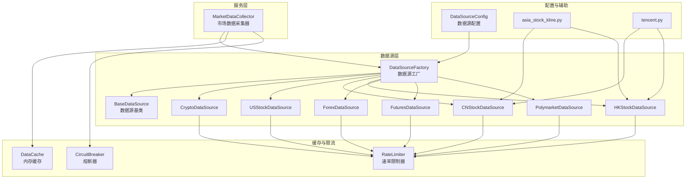
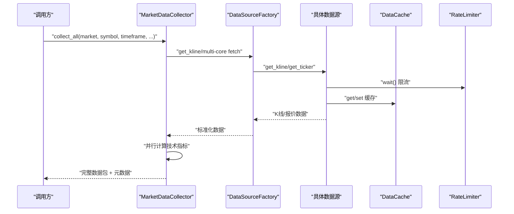
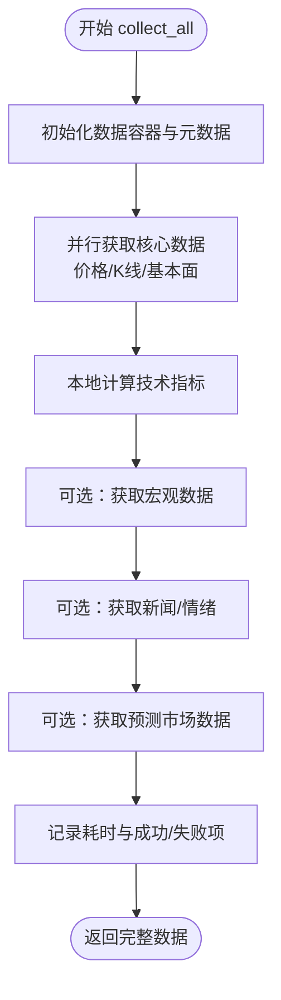
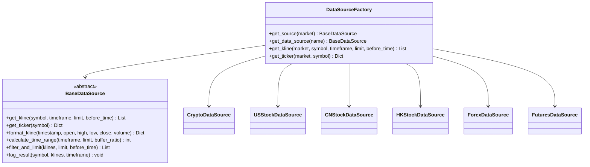
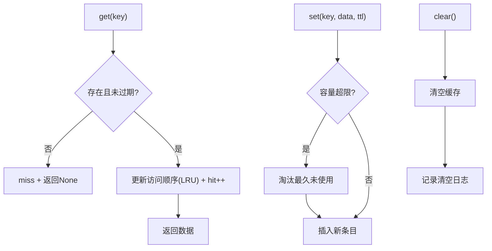
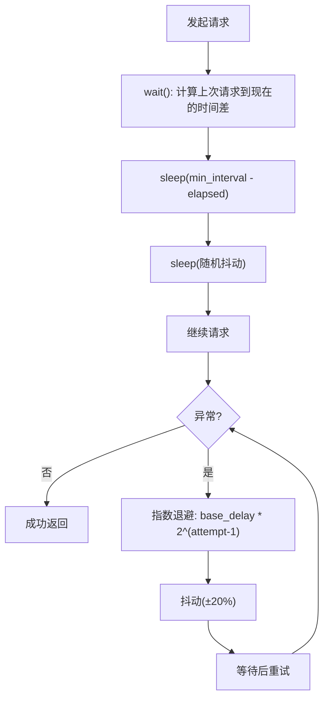
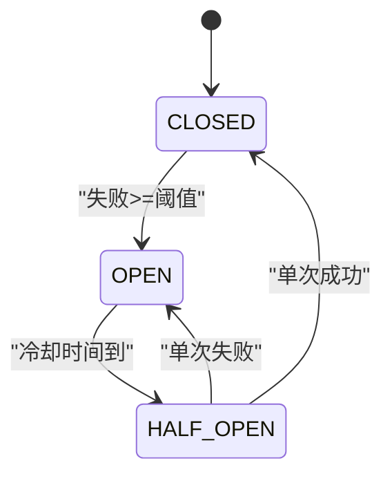
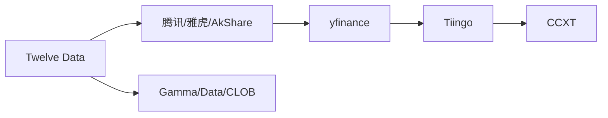
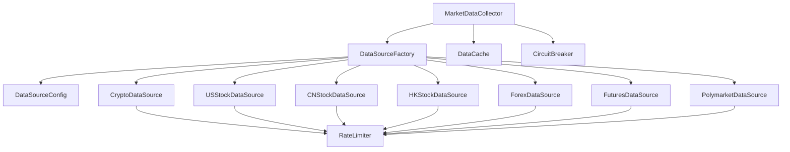

# 数据管理系统

<cite>
**本文档引用的文件**
- [market_data_collector.py](file://backend_api_python/app/services/market_data_collector.py)
- [factory.py](file://backend_api_python/app/data_sources/factory.py)
- [cache_manager.py](file://backend_api_python/app/data_sources/cache_manager.py)
- [rate_limiter.py](file://backend_api_python/app/data_sources/rate_limiter.py)
- [base.py](file://backend_api_python/app/data_sources/base.py)
- [crypto.py](file://backend_api_python/app/data_sources/crypto.py)
- [us_stock.py](file://backend_api_python/app/data_sources/us_stock.py)
- [cn_stock.py](file://backend_api_python/app/data_sources/cn_stock.py)
- [hk_stock.py](file://backend_api_python/app/data_sources/hk_stock.py)
- [forex.py](file://backend_api_python/app/data_sources/forex.py)
- [futures.py](file://backend_api_python/app/data_sources/futures.py)
- [polymarket.py](file://backend_api_python/app/data_sources/polymarket.py)
- [data_sources.py](file://backend_api_python/app/config/data_sources.py)
- [asia_stock_kline.py](file://backend_api_python/app/data_sources/asia_stock_kline.py)
- [tencent.py](file://backend_api_python/app/data_sources/tencent.py)
- [circuit_breaker.py](file://backend_api_python/app/data_sources/circuit_breaker.py)
</cite>

## 目录
1. [引言](#引言)
2. [项目结构](#项目结构)
3. [核心组件](#核心组件)
4. [架构概览](#架构概览)
5. [详细组件分析](#详细组件分析)
6. [依赖关系分析](#依赖关系分析)
7. [性能考量](#性能考量)
8. [故障排除指南](#故障排除指南)
9. [结论](#结论)
10. [附录](#附录)

## 引言
本文件面向QuantDinger的数据管理系统，重点阐述市场数据采集器的架构设计与实现细节，包括多数据源适配、实时数据获取、历史数据存储、缓存管理、速率限制与熔断保护等。文档旨在帮助开发者快速理解系统如何在多市场、多数据源环境下稳定地采集与整合数据，并提供可扩展的设计思路与最佳实践。

## 项目结构
后端Python服务位于`backend_api_python/app`目录，数据管理相关的核心代码分布在以下子模块：
- 服务层：市场数据采集器（AI分析专用）
- 数据源层：抽象基类、工厂模式、各市场具体实现
- 缓存与限流：内存缓存、速率限制器、熔断器
- 配置层：数据源配置与环境变量集成
- 辅助模块：多市场K线回退策略、腾讯数据助手

**图表来源**
- [market_data_collector.py:34-224](file://backend_api_python/app/services/market_data_collector.py#L34-L224)
- [factory.py:13-133](file://backend_api_python/app/data_sources/factory.py#L13-L133)
- [cache_manager.py:44-174](file://backend_api_python/app/data_sources/cache_manager.py#L44-L174)
- [rate_limiter.py:109-272](file://backend_api_python/app/data_sources/rate_limiter.py#L109-L272)
- [circuit_breaker.py:31-174](file://backend_api_python/app/data_sources/circuit_breaker.py#L31-L174)
- [data_sources.py:26-170](file://backend_api_python/app/config/data_sources.py#L26-L170)

**章节来源**
- [market_data_collector.py:1-224](file://backend_api_python/app/services/market_data_collector.py#L1-L224)
- [factory.py:1-134](file://backend_api_python/app/data_sources/factory.py#L1-L134)
- [cache_manager.py:1-233](file://backend_api_python/app/data_sources/cache_manager.py#L1-L233)
- [rate_limiter.py:1-273](file://backend_api_python/app/data_sources/rate_limiter.py#L1-L273)
- [circuit_breaker.py:1-175](file://backend_api_python/app/data_sources/circuit_breaker.py#L1-L175)
- [data_sources.py:1-171](file://backend_api_python/app/config/data_sources.py#L1-L171)

## 核心组件
- 市场数据采集器（MarketDataCollector）：统一入口，负责并行获取核心数据（价格、K线、技术指标）、基本面、宏观、情绪与预测市场数据，并记录元数据与耗时。
- 数据源工厂（DataSourceFactory）：基于市场类型动态创建与复用数据源实例，提供便捷的K线与实时报价获取接口。
- 数据源基类（BaseDataSource）：定义统一接口与通用能力（格式化K线、时间窗口计算、过滤限制、结果日志）。
- 各市场数据源：针对加密货币、美股、A/H股、外汇、期货等市场的具体实现，包含多层回退策略与符号规范化。
- 缓存管理器（DataCache）：内存级缓存，支持TTL过期、LRU淘汰、命中统计与线程安全。
- 速率限制器（RateLimiter）：请求间隔控制、抖动、指数退避重试与UA池轮换。
- 熔断器（CircuitBreaker）：基于状态机的熔断/冷却/半开探测策略，避免连续失败导致的资源浪费。
- 配置模块（DataSourceConfig）：集中管理各数据源的超时、重试、时间周期映射等配置。

**章节来源**
- [market_data_collector.py:34-224](file://backend_api_python/app/services/market_data_collector.py#L34-L224)
- [factory.py:13-133](file://backend_api_python/app/data_sources/factory.py#L13-L133)
- [base.py:27-171](file://backend_api_python/app/data_sources/base.py#L27-L171)
- [cache_manager.py:44-174](file://backend_api_python/app/data_sources/cache_manager.py#L44-L174)
- [rate_limiter.py:109-272](file://backend_api_python/app/data_sources/rate_limiter.py#L109-L272)
- [circuit_breaker.py:31-174](file://backend_api_python/app/data_sources/circuit_breaker.py#L31-L174)
- [data_sources.py:26-170](file://backend_api_python/app/config/data_sources.py#L26-L170)

## 架构概览
系统采用“服务层统一编排 + 数据源层多实现 + 缓存/限流/熔断协同”的分层架构。服务层通过工厂模式解耦市场类型与具体数据源，利用缓存与限流降低对外部API的压力，结合熔断器提升稳定性。

**图表来源**
- [market_data_collector.py:72-224](file://backend_api_python/app/services/market_data_collector.py#L72-L224)
- [factory.py:74-133](file://backend_api_python/app/data_sources/factory.py#L74-L133)
- [cache_manager.py:71-128](file://backend_api_python/app/data_sources/cache_manager.py#L71-L128)
- [rate_limiter.py:135-159](file://backend_api_python/app/data_sources/rate_limiter.py#L135-L159)

## 详细组件分析

### 市场数据采集器（AI分析专用）
职责与流程
- 统一入口：接收市场、标的、周期等参数，组织并行任务，汇总核心数据、技术指标、基本面、宏观、情绪与预测市场数据。
- 并行策略：核心数据（价格、K线、基本面）使用线程池并发获取，缩短总耗时。
- 技术指标：在本地计算RSI、MACD、移动平均、布林带、ATR、波动率、支撑阻力与止盈止损建议等，不依赖外部API。
- 可选模块：宏观数据（复用全局缓存）、新闻/情绪、预测市场（Polymarket）。

关键实现要点
- 价格获取优先使用K线服务与实时报价，失败时回退到K线最后一根。
- K线获取统一走工厂接口，保证与K线模块一致性。
- 指标口径与前端报告对齐，提供信号与趋势标注。
- 元数据记录成功/失败项与总耗时，便于监控与诊断。

**图表来源**
- [market_data_collector.py:72-224](file://backend_api_python/app/services/market_data_collector.py#L72-L224)

**章节来源**
- [market_data_collector.py:34-224](file://backend_api_python/app/services/market_data_collector.py#L34-L224)

### 数据源工厂模式
设计目标
- 解耦市场类型与具体数据源实现，支持按需创建与复用。
- 提供便捷的K线与实时报价获取接口，内部自动排序与异常处理。

工厂实现
- get_source：按市场类型创建并缓存数据源实例。
- get_kline/get_ticker：统一路由到具体数据源，处理NotImplemented与异常。
- 兼容旧接口：get_data_source支持历史命名风格。

**图表来源**
- [factory.py:13-133](file://backend_api_python/app/data_sources/factory.py#L13-L133)
- [base.py:27-171](file://backend_api_python/app/data_sources/base.py#L27-L171)
- [crypto.py:16-53](file://backend_api_python/app/data_sources/crypto.py#L16-L53)
- [us_stock.py:17-57](file://backend_api_python/app/data_sources/us_stock.py#L17-L57)
- [cn_stock.py:30-62](file://backend_api_python/app/data_sources/cn_stock.py#L30-L62)
- [hk_stock.py:30-62](file://backend_api_python/app/data_sources/hk_stock.py#L30-L62)
- [forex.py:95-118](file://backend_api_python/app/data_sources/forex.py#L95-L118)
- [futures.py:60-97](file://backend_api_python/app/data_sources/futures.py#L60-L97)

**章节来源**
- [factory.py:13-133](file://backend_api_python/app/data_sources/factory.py#L13-L133)
- [base.py:27-171](file://backend_api_python/app/data_sources/base.py#L27-L171)

### 缓存管理器（内存缓存）
特性
- TTL过期与LRU淘汰：支持默认TTL、最大容量与线程安全。
- 分类缓存：实时行情、K线、股票信息分别配置不同TTL与容量。
- 统计与可观测：命中/未命中计数、命中率、默认TTL等。

使用场景
- K线数据缓存：按symbol:timeframe:limit: before_time生成键，避免重复请求。
- 实时行情缓存：高频报价短期缓存，降低外部依赖压力。
- 股票信息缓存：基础信息长期缓存，减少重复解析。

**图表来源**
- [cache_manager.py:71-174](file://backend_api_python/app/data_sources/cache_manager.py#L71-L174)

**章节来源**
- [cache_manager.py:44-233](file://backend_api_python/app/data_sources/cache_manager.py#L44-L233)

### 速率限制器（防封禁策略）
能力
- 请求间隔控制：最小间隔等待与抖动，模拟人类行为。
- 指数退避重试：失败时按2^N增长等待，上限保护与随机抖动。
- UA池轮换：随机User-Agent，降低被识别风险。
- 多实例策略：针对不同数据源设置不同限流强度。

**图表来源**
- [rate_limiter.py:135-231](file://backend_api_python/app/data_sources/rate_limiter.py#L135-L231)

**章节来源**
- [rate_limiter.py:109-272](file://backend_api_python/app/data_sources/rate_limiter.py#L109-L272)

### 熔断器（CircuitBreaker）
状态机
- CLOSED：正常状态，可请求。
- OPEN：熔断状态，冷却时间未到则跳过。
- HALF_OPEN：冷却结束后的试探状态，单次尝试后决定恢复或继续熔断。

策略
- 连续失败达到阈值进入熔断，冷却结束后进入半开。
- 半开成功则完全恢复，失败则继续熔断。
- 支持按数据源维度独立管理状态。

**图表来源**
- [circuit_breaker.py:24-100](file://backend_api_python/app/data_sources/circuit_breaker.py#L24-L100)

**章节来源**
- [circuit_breaker.py:31-174](file://backend_api_python/app/data_sources/circuit_breaker.py#L31-L174)

### 多数据源适配与回退策略
- 加密货币（Crypto）：CCXT统一接入，符号规范化与交易所差异适配，支持分页历史数据拉取。
- 美股（USStock）：优先Finnhub，降级yfinance fast_info/info/1分钟回放。
- A/H股（CN/HK）：TwelveData为主（付费可靠），辅以腾讯日/周线、yfinance、AkShare。
- 外汇（Forex）：TwelveData → Tiingo → yfinance，支持周/月聚合。
- 期货（Futures）：传统商品期货（TwelveData/yfinance/Tiingo），加密货币期货（CCXT Binance Futures）。
- 预测市场（Polymarket）：Gamma/Data/CLOB API组合，数据库缓存加速。

**图表来源**
- [us_stock.py:48-56](file://backend_api_python/app/data_sources/us_stock.py#L48-L56)
- [cn_stock.py:64-69](file://backend_api_python/app/data_sources/cn_stock.py#L64-L69)
- [hk_stock.py:64-69](file://backend_api_python/app/data_sources/hk_stock.py#L64-L69)
- [forex.py:131-135](file://backend_api_python/app/data_sources/forex.py#L131-L135)
- [futures.py:247-251](file://backend_api_python/app/data_sources/futures.py#L247-L251)
- [polymarket.py:450-453](file://backend_api_python/app/data_sources/polymarket.py#L450-L453)

**章节来源**
- [crypto.py:232-297](file://backend_api_python/app/data_sources/crypto.py#L232-L297)
- [us_stock.py:170-218](file://backend_api_python/app/data_sources/us_stock.py#L170-L218)
- [cn_stock.py:53-99](file://backend_api_python/app/data_sources/cn_stock.py#L53-L99)
- [hk_stock.py:53-99](file://backend_api_python/app/data_sources/hk_stock.py#L53-L99)
- [forex.py:303-325](file://backend_api_python/app/data_sources/forex.py#L303-L325)
- [futures.py:217-237](file://backend_api_python/app/data_sources/futures.py#L217-L237)
- [polymarket.py:35-87](file://backend_api_python/app/data_sources/polymarket.py#L35-L87)

### 技术指标计算（本地化）
- RSI（Wilder平滑）：首段均幅为前N期简单平均，后续递推。
- MACD（EMA种子SMA）：DIF=EMA12-EMA26，DEA=EMA9(DIF)，柱=DIF-DEA。
- 移动平均：SMA（5/10/20），趋势判定。
- 布林带：20日收盘SMA±2×总体标准差。
- ATR（Wilder）：首ATR=前N期TR简单平均，后续递推。
- 支撑/阻力：枢轴点、近期高/低、布林上下轨综合。
- 波动率：ATR/价格百分比。
- 止损/止盈：2×ATR或支撑/阻力，取更保守值，计算RR比。

**章节来源**
- [market_data_collector.py:299-510](file://backend_api_python/app/services/market_data_collector.py#L299-L510)

## 依赖关系分析
- 服务层依赖工厂与缓存/限流/熔断模块，实现“编排+保护”。
- 数据源层依赖配置模块与第三方库（ccxt、yfinance、requests等）。
- 各市场数据源共享基类接口，确保一致性与可替换性。
- 缓存键生成遵循统一规范，避免冲突。

**图表来源**
- [market_data_collector.py:26-52](file://backend_api_python/app/services/market_data_collector.py#L26-L52)
- [factory.py:13-71](file://backend_api_python/app/data_sources/factory.py#L13-L71)
- [data_sources.py:26-170](file://backend_api_python/app/config/data_sources.py#L26-L170)

**章节来源**
- [market_data_collector.py:17-52](file://backend_api_python/app/services/market_data_collector.py#L17-L52)
- [factory.py:13-71](file://backend_api_python/app/data_sources/factory.py#L13-L71)
- [data_sources.py:26-170](file://backend_api_python/app/config/data_sources.py#L26-L170)

## 性能考量
- 并行化：核心数据阶段使用线程池并行获取，显著降低总耗时。
- 本地化指标：技术指标在本地计算，避免外部依赖，提升稳定性与速度。
- 缓存策略：针对高频数据（实时/日线）设置合理TTL与容量，减少重复请求。
- 限流与熔断：防止API限流与雪崩效应，保障系统健康运行。
- 符号与周期映射：统一映射减少歧义，避免无效请求。
- 历史数据分页：加密货币与期货支持分页拉取，避免超限与超时。

## 故障排除指南
常见问题与定位
- API限流/429：启用指数退避与UA轮换，必要时降低请求频率或切换数据源。
- 数据为空/延迟：检查log_result输出的最新bar时间差阈值，确认数据源可用性。
- 熔断触发：查看熔断器状态，等待冷却时间或修复后手动重置。
- 缓存命中率低：核对缓存键生成规则与TTL设置，避免键冲突与过期过快。
- 多层回退失败：逐层检查TwelveData、腾讯、yfinance、AkShare的可用性与配置。

**章节来源**
- [base.py:133-170](file://backend_api_python/app/data_sources/base.py#L133-L170)
- [rate_limiter.py:170-231](file://backend_api_python/app/data_sources/rate_limiter.py#L170-L231)
- [circuit_breaker.py:138-157](file://backend_api_python/app/data_sources/circuit_breaker.py#L138-L157)
- [cache_manager.py:160-174](file://backend_api_python/app/data_sources/cache_manager.py#L160-L174)

## 结论
QuantDinger的数据管理系统通过“服务编排 + 工厂模式 + 缓存/限流/熔断”的组合，实现了多市场、多数据源的稳定与高性能数据采集。本地化指标计算与多层回退策略进一步提升了系统的鲁棒性与可维护性。建议在生产环境中结合监控与日志，持续优化缓存策略与限流参数，以适应不同市场与业务场景的需求。

## 附录

### 数据配置示例（概念性说明）
- 市场类型：Crypto、USStock、CNStock、HKStock、Forex、Futures、Polymarket
- 关键参数：超时、重试次数、指数退避、时间周期映射、代理配置
- 缓存策略：实时行情（20分钟TTL）、K线（5分钟TTL）、股票信息（24小时TTL）
- 限流策略：不同数据源差异化配置，UA池轮换，抖动与指数退避
- 熔断策略：失败阈值、冷却时间、半开探测次数

**章节来源**
- [data_sources.py:26-170](file://backend_api_python/app/config/data_sources.py#L26-L170)
- [cache_manager.py:181-215](file://backend_api_python/app/data_sources/cache_manager.py#L181-L215)
- [rate_limiter.py:238-272](file://backend_api_python/app/data_sources/rate_limiter.py#L238-L272)
- [circuit_breaker.py:164-174](file://backend_api_python/app/data_sources/circuit_breaker.py#L164-L174)