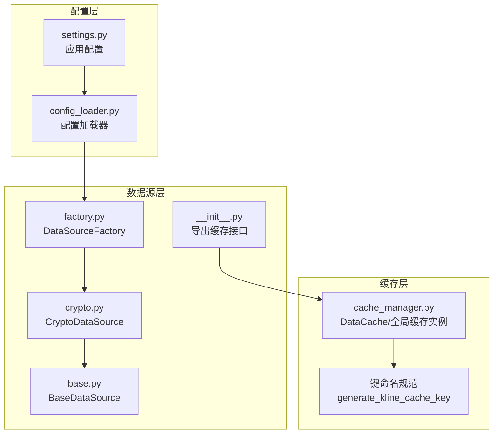
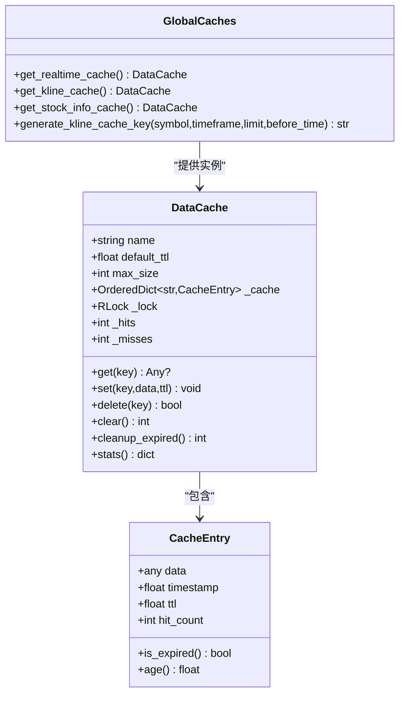
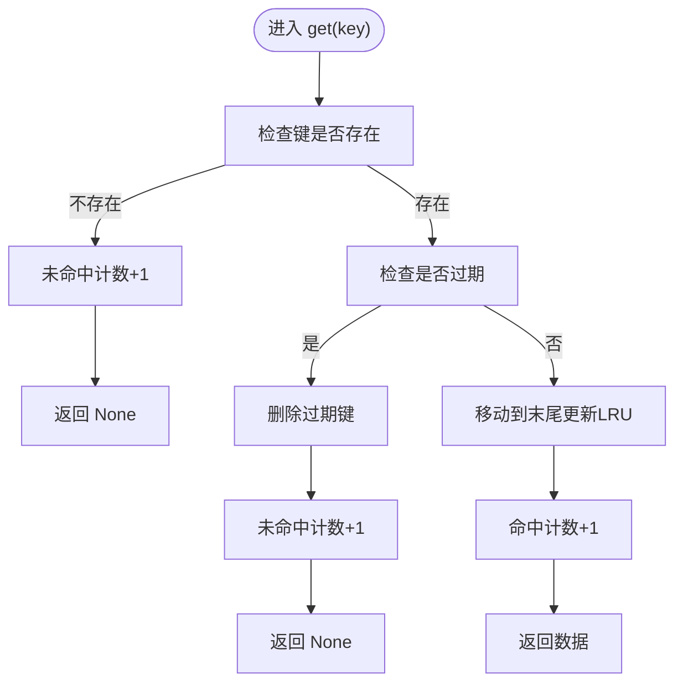
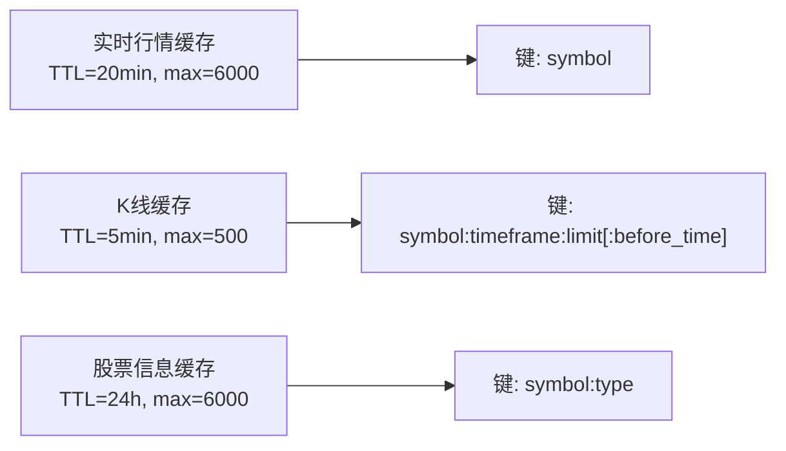
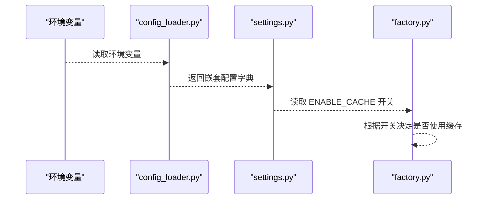
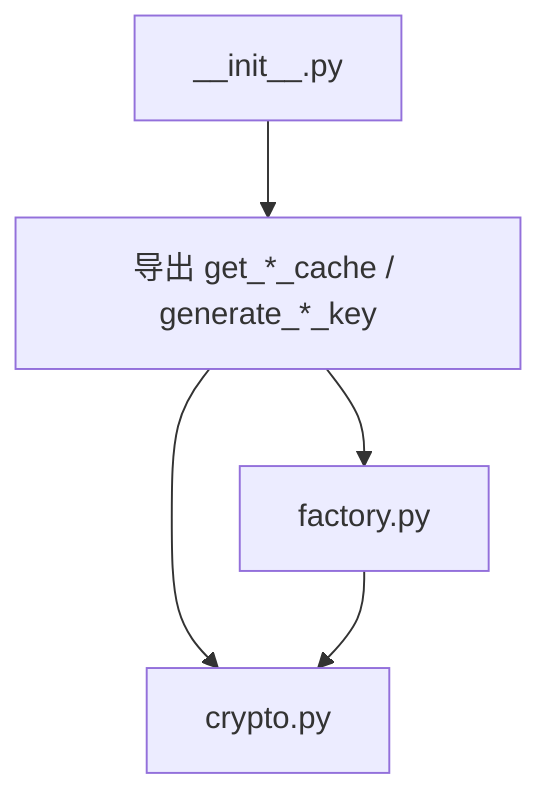

# 缓存管理器

<cite>
**本文引用的文件**
- [cache_manager.py](file://backend_api_python/app/data_sources/cache_manager.py)
- [settings.py](file://backend_api_python/app/config/settings.py)
- [config_loader.py](file://backend_api_python/app/utils/config_loader.py)
- [factory.py](file://backend_api_python/app/data_sources/factory.py)
- [crypto.py](file://backend_api_python/app/data_sources/crypto.py)
- [base.py](file://backend_api_python/app/data_sources/base.py)
- [__init__.py](file://backend_api_python/app/data_sources/__init__.py)
</cite>

## 目录
1. [简介](#简介)
2. [项目结构](#项目结构)
3. [核心组件](#核心组件)
4. [架构总览](#架构总览)
5. [详细组件分析](#详细组件分析)
6. [依赖关系分析](#依赖关系分析)
7. [性能考量](#性能考量)
8. [故障排查指南](#故障排查指南)
9. [结论](#结论)
10. [附录](#附录)

## 简介
本文件面向 QuantDinger 的缓存管理器，系统性阐述其架构设计与实现细节，涵盖内存缓存、键命名规范、失效与更新策略、配置项、性能监控与命中率统计、故障恢复机制，并提供实际使用示例与优化建议。当前仓库实现采用纯内存缓存（基于有序字典与线程锁），未包含 Redis 或持久化缓存的直接实现，但通过全局缓存实例与键空间分区为后续扩展预留了清晰接口。

## 项目结构
缓存管理器位于数据源模块下，配合配置加载器与工厂模式共同工作：
- 缓存管理器：提供内存缓存、TTL 过期、LRU 淘汰、线程安全与命中率统计
- 配置加载器：从环境变量与附加配置中读取功能开关与通用参数
- 工厂与具体数据源：在数据获取流程中按需使用缓存实例

图表来源
- [settings.py:1-99](file://backend_api_python/app/config/settings.py#L1-L99)
- [config_loader.py:1-252](file://backend_api_python/app/utils/config_loader.py#L1-L252)
- [cache_manager.py:1-233](file://backend_api_python/app/data_sources/cache_manager.py#L1-L233)
- [factory.py:1-134](file://backend_api_python/app/data_sources/factory.py#L1-L134)
- [crypto.py:1-388](file://backend_api_python/app/data_sources/crypto.py#L1-L388)
- [base.py:1-171](file://backend_api_python/app/data_sources/base.py#L1-L171)
- [__init__.py:1-45](file://backend_api_python/app/data_sources/__init__.py#L1-L45)

章节来源
- [cache_manager.py:1-233](file://backend_api_python/app/data_sources/cache_manager.py#L1-L233)
- [settings.py:1-99](file://backend_api_python/app/config/settings.py#L1-L99)
- [config_loader.py:1-252](file://backend_api_python/app/utils/config_loader.py#L1-L252)
- [factory.py:1-134](file://backend_api_python/app/data_sources/factory.py#L1-L134)
- [crypto.py:1-388](file://backend_api_python/app/data_sources/crypto.py#L1-L388)
- [base.py:1-171](file://backend_api_python/app/data_sources/base.py#L1-L171)
- [__init__.py:1-45](file://backend_api_python/app/data_sources/__init__.py#L1-L45)

## 核心组件
- DataCache：内存缓存核心，支持 TTL 过期、最大容量限制、LRU 淘汰、线程安全、命中统计
- 全局缓存实例：按数据类型分区（实时行情、K线、股票信息），分别配置默认 TTL 与容量上限
- 键命名规范：K线键采用“symbol:timeframe:limit[:before_time]”格式，便于检索与清理
- 配置开关：通过配置加载器与环境变量控制缓存启用状态

章节来源
- [cache_manager.py:44-175](file://backend_api_python/app/data_sources/cache_manager.py#L44-L175)
- [cache_manager.py:181-216](file://backend_api_python/app/data_sources/cache_manager.py#L181-L216)
- [cache_manager.py:218-233](file://backend_api_python/app/data_sources/cache_manager.py#L218-L233)
- [settings.py:77-82](file://backend_api_python/app/config/settings.py#L77-L82)
- [config_loader.py:107-109](file://backend_api_python/app/utils/config_loader.py#L107-L109)

## 架构总览
缓存管理器采用“内存缓存 + 键空间分区”的多层策略：
- 第一层：按业务域划分缓存实例（实时、K线、股票信息）
- 第二层：每实例内维护有序字典，实现 LRU 淘汰与 TTL 过期
- 第三层：线程安全的读写与统计，支持运行时清理与命中率统计

图表来源
- [cache_manager.py:27-42](file://backend_api_python/app/data_sources/cache_manager.py#L27-L42)
- [cache_manager.py:44-175](file://backend_api_python/app/data_sources/cache_manager.py#L44-L175)
- [cache_manager.py:181-233](file://backend_api_python/app/data_sources/cache_manager.py#L181-L233)

## 详细组件分析

### DataCache 类
- 设计要点
  - 使用有序字典维护访问顺序，实现 LRU 淘汰
  - 每条目保存数据、时间戳与 TTL，支持过期检测与年龄计算
  - 通过可重入锁保证并发安全
  - 提供命中/未命中计数与命中率统计
- 关键方法
  - get：命中返回数据并更新访问顺序与命中计数；过期或不存在返回 None 并增加未命中计数
  - set：容量超限时淘汰最久未使用项；支持自定义 TTL 或使用默认 TTL
  - delete/clear：删除单条或清空全部
  - cleanup_expired：主动清理过期条目
  - stats：返回名称、当前大小、最大容量、命中/未命中次数、命中率与默认 TTL

图表来源
- [cache_manager.py:71-98](file://backend_api_python/app/data_sources/cache_manager.py#L71-L98)

章节来源
- [cache_manager.py:44-175](file://backend_api_python/app/data_sources/cache_manager.py#L44-L175)

### 全局缓存实例与键空间分区
- 实时行情缓存：默认 TTL 20 分钟，最大 6000 条
- K线数据缓存：默认 TTL 5 分钟，最大 500 条（按交易对）
- 股票信息缓存：默认 TTL 24 小时，最大 6000 条
- 键命名规范：K线键采用“symbol:timeframe:limit[:before_time]”，便于区分不同查询参数组合

图表来源
- [cache_manager.py:181-216](file://backend_api_python/app/data_sources/cache_manager.py#L181-L216)
- [cache_manager.py:218-233](file://backend_api_python/app/data_sources/cache_manager.py#L218-L233)

章节来源
- [cache_manager.py:181-216](file://backend_api_python/app/data_sources/cache_manager.py#L181-L216)
- [cache_manager.py:218-233](file://backend_api_python/app/data_sources/cache_manager.py#L218-L233)

### 配置与开关
- 缓存启用开关：通过配置加载器读取“app.enable_cache”，支持环境变量与附加配置
- 日志级别与请求日志：通过“app.enable_request_log”控制请求日志输出
- 其他相关配置：速率限制等可通过相同机制读取

图表来源
- [config_loader.py:24-161](file://backend_api_python/app/utils/config_loader.py#L24-L161)
- [settings.py:77-82](file://backend_api_python/app/config/settings.py#L77-L82)
- [factory.py:1-134](file://backend_api_python/app/data_sources/factory.py#L1-L134)

章节来源
- [config_loader.py:24-161](file://backend_api_python/app/utils/config_loader.py#L24-L161)
- [settings.py:77-82](file://backend_api_python/app/config/settings.py#L77-L82)
- [factory.py:1-134](file://backend_api_python/app/data_sources/factory.py#L1-L134)

### 使用示例与最佳实践
- 在数据获取流程中使用缓存的典型步骤
  - 生成键：使用 K线键生成函数将 symbol、timeframe、limit、before_time 组合为唯一键
  - 读取缓存：调用相应缓存实例的 get(key) 获取数据
  - 未命中时：从数据源拉取数据并调用 set(key, data, ttl) 写入缓存
  - 定期清理：调用 cleanup_expired() 主动清理过期条目
- 最佳实践
  - 为高频查询设置合理 TTL，避免过短导致频繁回源、过长导致数据陈旧
  - 根据业务场景调整 max_size，平衡内存占用与命中率
  - 对于历史回测场景，结合 before_time 参数生成稳定键，提升复用率
  - 使用 stats() 输出命中率，持续优化 TTL 与容量

章节来源
- [cache_manager.py:71-128](file://backend_api_python/app/data_sources/cache_manager.py#L71-L128)
- [cache_manager.py:146-174](file://backend_api_python/app/data_sources/cache_manager.py#L146-L174)
- [cache_manager.py:218-233](file://backend_api_python/app/data_sources/cache_manager.py#L218-L233)

## 依赖关系分析
- 导出与使用
  - 数据源模块通过 __init__.py 导出缓存接口，供工厂与具体数据源使用
  - 工厂模式在获取数据时可选择性地使用缓存实例
- 外部依赖
  - 无 Redis 或持久化存储的直接实现，当前为纯内存缓存
  - 可通过扩展全局缓存实例或引入外部缓存客户端实现多层缓存

图表来源
- [__init__.py:15-26](file://backend_api_python/app/data_sources/__init__.py#L15-L26)
- [factory.py:1-134](file://backend_api_python/app/data_sources/factory.py#L1-L134)
- [crypto.py:1-388](file://backend_api_python/app/data_sources/crypto.py#L1-L388)

章节来源
- [__init__.py:15-26](file://backend_api_python/app/data_sources/__init__.py#L15-L26)
- [factory.py:1-134](file://backend_api_python/app/data_sources/factory.py#L1-L134)
- [crypto.py:1-388](file://backend_api_python/app/data_sources/crypto.py#L1-L388)

## 性能考量
- 命中率统计
  - 通过 _hits 与 _misses 计算命中率，用于评估缓存效果
  - 建议定期输出 stats() 结果，观察不同键空间的命中趋势
- 内存与吞吐
  - LRU 淘汰与最大容量限制降低内存压力
  - 线程锁保障并发安全，但会带来一定开销；建议在高并发场景评估锁粒度
- TTL 与容量调优
  - 高频小窗口查询适合短 TTL 与较小容量
  - 历史回测适合较长 TTL 与较大容量，结合键命名避免冲突
- 主动清理
  - 定期调用 cleanup_expired() 减少无效条目，维持缓存健康度

章节来源
- [cache_manager.py:160-174](file://backend_api_python/app/data_sources/cache_manager.py#L160-L174)
- [cache_manager.py:146-158](file://backend_api_python/app/data_sources/cache_manager.py#L146-L158)

## 故障排查指南
- 常见问题
  - 缓存未生效：检查 ENABLE_CACHE 是否开启，确认配置加载器正确解析
  - 命中率低：检查键命名是否稳定、TTL 是否过短、容量是否过小
  - 内存增长：检查是否频繁新增键空间或未及时清理过期项
- 排查步骤
  - 查看日志：缓存命中/过期/淘汰均有日志输出，定位异常行为
  - 使用 stats()：对比命中与未命中次数，评估策略有效性
  - 主动清理：调用 cleanup_expired() 后再次观察命中率变化
- 建议
  - 为关键路径添加缓存命中率监控指标
  - 对历史回测场景固定 before_time，提升键复用率

章节来源
- [cache_manager.py:71-98](file://backend_api_python/app/data_sources/cache_manager.py#L71-L98)
- [cache_manager.py:114-127](file://backend_api_python/app/data_sources/cache_manager.py#L114-L127)
- [cache_manager.py:146-158](file://backend_api_python/app/data_sources/cache_manager.py#L146-L158)

## 结论
QuantDinger 的缓存管理器以 DataCache 为核心，采用内存缓存与键空间分区策略，具备 TTL 过期、LRU 淘汰与线程安全等特性，并提供命中率统计与主动清理能力。当前实现未包含 Redis 或持久化缓存，但通过全局缓存实例与清晰的键命名规范为后续扩展提供了良好基础。建议结合业务场景持续优化 TTL 与容量，并通过 stats() 与日志进行监控与调优。

## 附录

### 缓存配置选项清单
- 缓存启用开关：app.enable_cache（布尔）
- 请求日志开关：app.enable_request_log（布尔）
- 全局缓存实例参数
  - 实时行情缓存：默认 TTL 20 分钟，最大 6000 条
  - K线缓存：默认 TTL 5 分钟，最大 500 条
  - 股票信息缓存：默认 TTL 24 小时，最大 6000 条
- 键命名规范
  - K线键：symbol:timeframe:limit[:before_time]

章节来源
- [settings.py:77-82](file://backend_api_python/app/config/settings.py#L77-L82)
- [config_loader.py:107-109](file://backend_api_python/app/utils/config_loader.py#L107-L109)
- [cache_manager.py:181-216](file://backend_api_python/app/data_sources/cache_manager.py#L181-L216)
- [cache_manager.py:218-233](file://backend_api_python/app/data_sources/cache_manager.py#L218-L233)