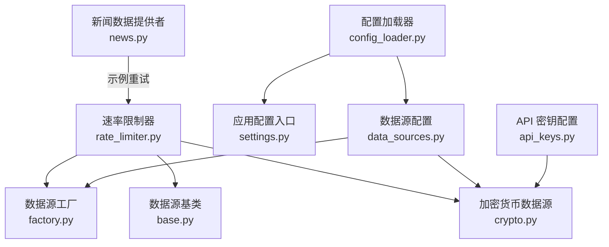
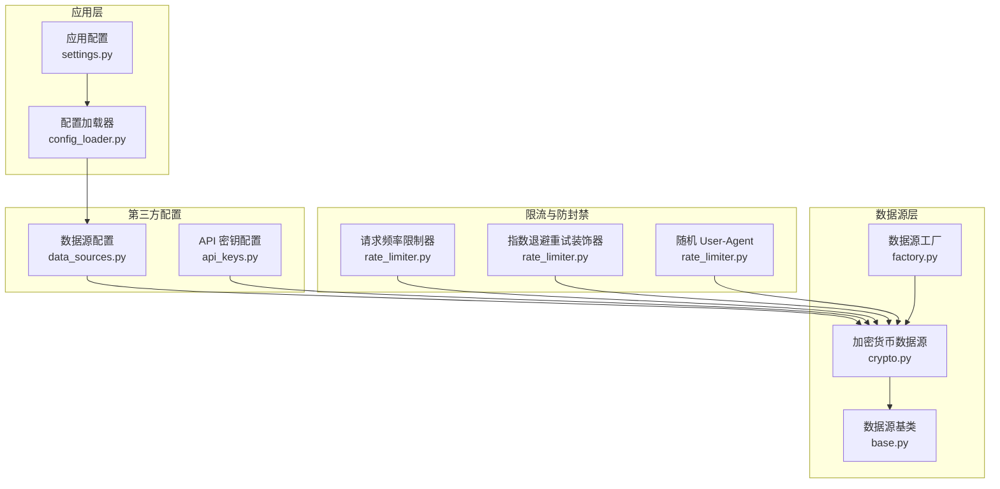
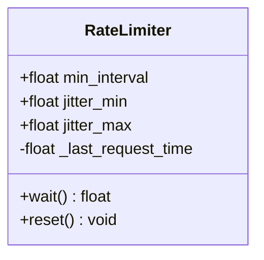
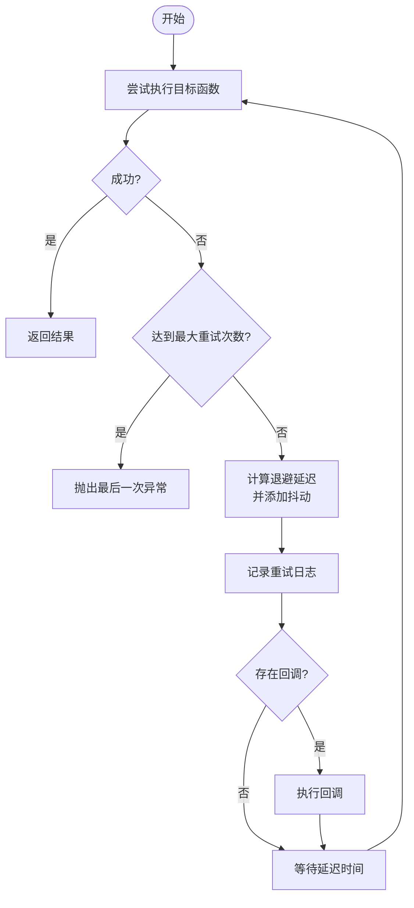
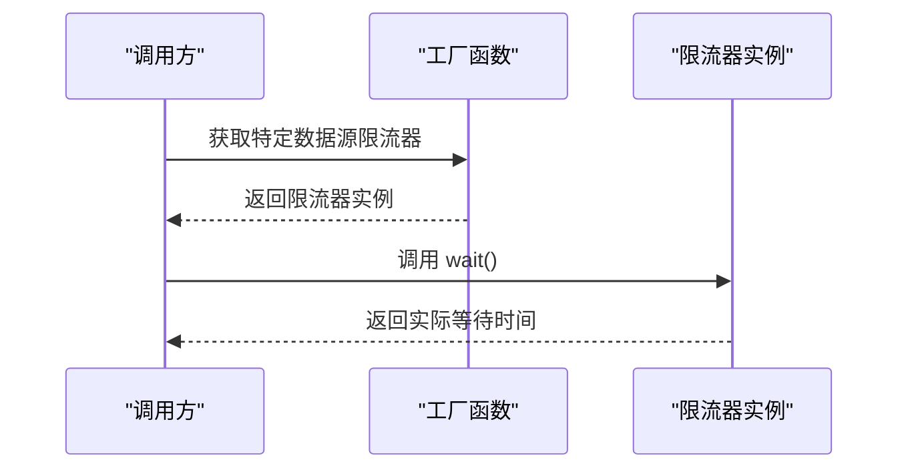
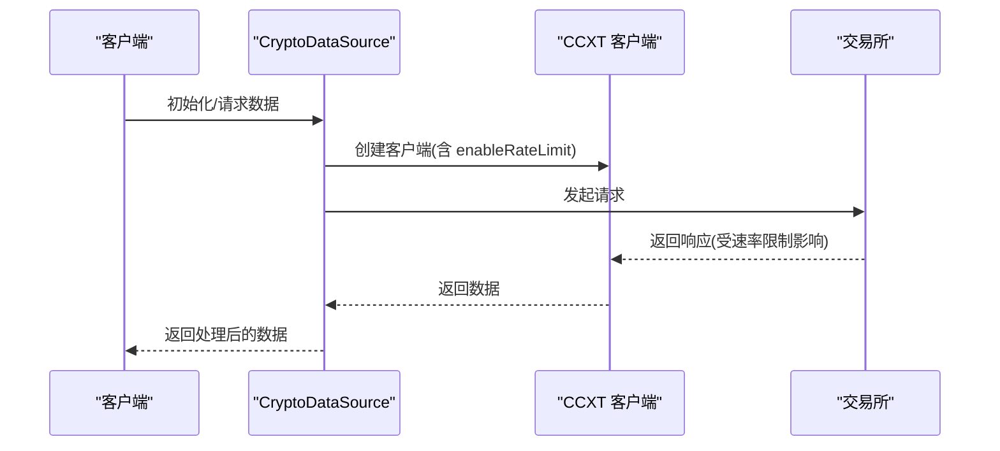
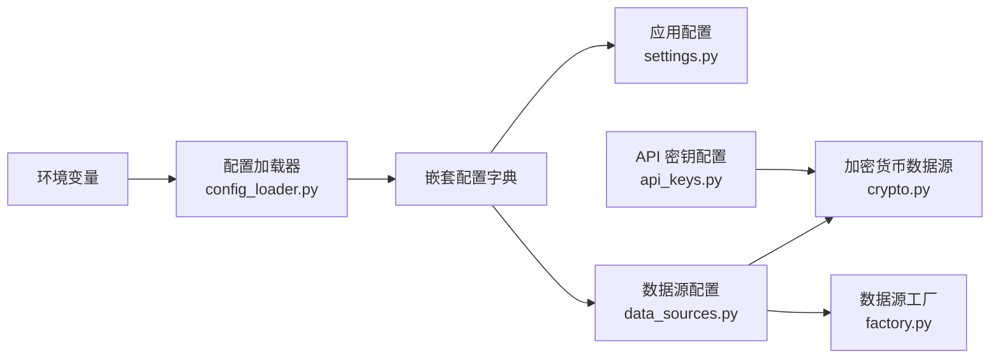
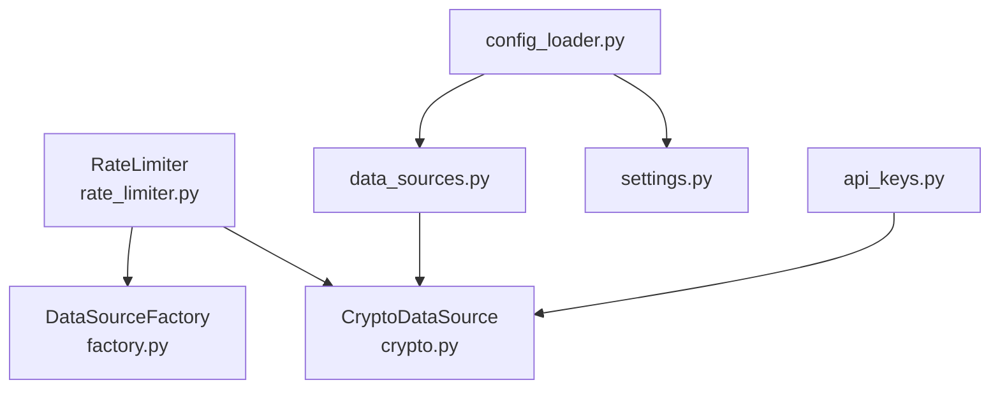

# 速率限制器

<cite>
**本文引用的文件**
- [rate_limiter.py](file://backend_api_python/app/data_sources/rate_limiter.py)
- [config_loader.py](file://backend_api_python/app/utils/config_loader.py)
- [settings.py](file://backend_api_python/app/config/settings.py)
- [data_sources.py](file://backend_api_python/app/config/data_sources.py)
- [base.py](file://backend_api_python/app/data_sources/base.py)
- [crypto.py](file://backend_api_python/app/data_sources/crypto.py)
- [api_keys.py](file://backend_api_python/app/config/api_keys.py)
- [factory.py](file://backend_api_python/app/data_sources/factory.py)
- [news.py](file://backend_api_python/app/data_providers/news.py)
</cite>

## 目录
1. [简介](#简介)
2. [项目结构](#项目结构)
3. [核心组件](#核心组件)
4. [架构总览](#架构总览)
5. [详细组件分析](#详细组件分析)
6. [依赖关系分析](#依赖关系分析)
7. [性能考量](#性能考量)
8. [故障排查指南](#故障排查指南)
9. [结论](#结论)
10. [附录](#附录)

## 简介
本文件面向 QuantDinger 的速率限制与防封禁能力，系统性梳理当前实现中的请求频率控制、指数退避重试、随机 User-Agent 与随机抖动等策略，并结合配置体系说明如何为不同 API 提供商（如 CCXT、Finnhub、Akshare 等）进行速率限制与配额管理。文档同时给出可操作的配置项、使用示例与异常处理建议，帮助开发者在数据获取过程中正确应用速率限制，降低被限流或封禁的风险。

## 项目结构
与速率限制相关的关键文件分布如下：
- 速率限制与防封禁策略：backend_api_python/app/data_sources/rate_limiter.py
- 配置加载与环境变量映射：backend_api_python/app/utils/config_loader.py
- 应用层通用配置入口：backend_api_python/app/config/settings.py
- 数据源专用配置（含 CCXT、Finnhub、Akshare 等）：backend_api_python/app/config/data_sources.py
- 数据源基类与通用逻辑：backend_api_python/app/data_sources/base.py
- 加密货币数据源（CCXT 集成）：backend_api_python/app/data_sources/crypto.py
- API 密钥配置与加载：backend_api_python/app/config/api_keys.py
- 数据源工厂：backend_api_python/app/data_sources/factory.py
- 示例数据提供者（新闻等）：backend_api_python/app/data_providers/news.py

**图表来源**
- [rate_limiter.py:109-273](file://backend_api_python/app/data_sources/rate_limiter.py#L109-L273)
- [base.py:27-171](file://backend_api_python/app/data_sources/base.py#L27-L171)
- [crypto.py:16-49](file://backend_api_python/app/data_sources/crypto.py#L16-L49)
- [factory.py:13-72](file://backend_api_python/app/data_sources/factory.py#L13-L72)
- [config_loader.py:24-161](file://backend_api_python/app/utils/config_loader.py#L24-L161)
- [settings.py:66-91](file://backend_api_python/app/config/settings.py#L66-L91)
- [data_sources.py:100-150](file://backend_api_python/app/config/data_sources.py#L100-L150)
- [api_keys.py:148-164](file://backend_api_python/app/config/api_keys.py#L148-L164)
- [news.py:13-70](file://backend_api_python/app/data_providers/news.py#L13-L70)

**章节来源**
- [rate_limiter.py:1-273](file://backend_api_python/app/data_sources/rate_limiter.py#L1-L273)
- [config_loader.py:1-252](file://backend_api_python/app/utils/config_loader.py#L1-L252)
- [settings.py:1-99](file://backend_api_python/app/config/settings.py#L1-L99)
- [data_sources.py:1-171](file://backend_api_python/app/config/data_sources.py#L1-L171)
- [base.py:1-171](file://backend_api_python/app/data_sources/base.py#L1-L171)
- [crypto.py:1-388](file://backend_api_python/app/data_sources/crypto.py#L1-L388)
- [api_keys.py:1-164](file://backend_api_python/app/config/api_keys.py#L1-L164)
- [factory.py:1-134](file://backend_api_python/app/data_sources/factory.py#L1-L134)
- [news.py:1-150](file://backend_api_python/app/data_providers/news.py#L1-L150)

## 核心组件
- 请求频率限制器（RateLimiter）
  - 通过最小请求间隔与随机抖动，确保请求之间有一定的时间间隔，降低被检测为自动化脚本的概率。
  - 提供重置能力，便于在长时间运行任务中重新初始化状态。
- 指数退避重试装饰器（retry_with_backoff）
  - 对指定异常类型进行指数退避重试，支持最大重试次数、基础延迟、最大延迟与抖动范围。
  - 支持重试回调钩子，便于记录与监控。
- 全局限流器实例
  - 针对不同数据源（如东方财富、腾讯财经、Akshare）提供预设的限流器实例，便于直接复用。
- CCXT 集成
  - 通过 CCXTConfig.ENABLE_RATE_LIMIT 控制是否启用底层交易所的速率限制，配合 CryptoDataSource 使用。
- 配置体系
  - 通过环境变量与嵌套配置映射，集中管理速率限制、超时、重试等参数。
- 防封禁策略
  - 随机 User-Agent 切换、随机抖动、指数退避重试等组合策略，提升稳定性与合规性。

**章节来源**
- [rate_limiter.py:109-273](file://backend_api_python/app/data_sources/rate_limiter.py#L109-L273)
- [data_sources.py:114-116](file://backend_api_python/app/config/data_sources.py#L114-L116)
- [crypto.py:28-31](file://backend_api_python/app/data_sources/crypto.py#L28-L31)

## 架构总览
下图展示了速率限制在系统中的位置与交互关系：

**图表来源**
- [settings.py:66-91](file://backend_api_python/app/config/settings.py#L66-L91)
- [config_loader.py:24-161](file://backend_api_python/app/utils/config_loader.py#L24-L161)
- [data_sources.py:100-150](file://backend_api_python/app/config/data_sources.py#L100-L150)
- [base.py:27-171](file://backend_api_python/app/data_sources/base.py#L27-L171)
- [crypto.py:16-49](file://backend_api_python/app/data_sources/crypto.py#L16-L49)
- [factory.py:13-72](file://backend_api_python/app/data_sources/factory.py#L13-L72)
- [rate_limiter.py:109-273](file://backend_api_python/app/data_sources/rate_limiter.py#L109-L273)
- [api_keys.py:148-164](file://backend_api_python/app/config/api_keys.py#L148-L164)

## 详细组件分析

### 请求频率限制器（RateLimiter）
- 设计要点
  - 记录上次请求时间，计算与最小间隔的差值，必要时阻塞等待。
  - 在每次请求后追加随机抖动，使请求节奏更接近人类行为。
  - 提供 reset 方法，便于在长时间任务中重置状态。
- 关键参数
  - 最小请求间隔、抖动范围（上下界）。
- 使用场景
  - 适用于对请求频率敏感的 API，避免触发限流。
- 注意事项
  - 抖动会增加整体耗时，需在稳定性与效率间权衡。

**图表来源**
- [rate_limiter.py:109-164](file://backend_api_python/app/data_sources/rate_limiter.py#L109-L164)

**章节来源**
- [rate_limiter.py:109-164](file://backend_api_python/app/data_sources/rate_limiter.py#L109-L164)

### 指数退避重试装饰器（retry_with_backoff）
- 设计要点
  - 对指定异常类型进行指数退避重试，支持最大重试次数与最大延迟。
  - 在每次重试前添加 ±20% 的抖动，避免“群体重试”现象。
  - 支持重试回调钩子，便于记录与监控。
- 关键参数
  - 最大重试次数、基础延迟、最大延迟、指数基数、异常类型集合。
- 使用场景
  - 网络波动、上游服务不稳定、临时性错误等。
- 注意事项
  - 需明确哪些异常应重试，避免对不可恢复错误重复尝试。

**图表来源**
- [rate_limiter.py:170-231](file://backend_api_python/app/data_sources/rate_limiter.py#L170-L231)

**章节来源**
- [rate_limiter.py:170-231](file://backend_api_python/app/data_sources/rate_limiter.py#L170-L231)

### 全局限流器实例
- 设计要点
  - 针对不同数据源提供预设限流器实例，减少重复配置。
  - 通过工厂函数暴露，便于在各数据源中直接获取。
- 实例说明
  - 东方财富限流器、腾讯财经限流器、Akshare 限流器。
- 使用场景
  - 在高频数据拉取场景中，按数据源选择合适的限流器。

**图表来源**
- [rate_limiter.py:238-273](file://backend_api_python/app/data_sources/rate_limiter.py#L238-L273)

**章节来源**
- [rate_limiter.py:238-273](file://backend_api_python/app/data_sources/rate_limiter.py#L238-L273)

### CCXT 速率限制集成
- 设计要点
  - 通过 CCXTConfig.ENABLE_RATE_LIMIT 控制是否启用底层交易所的速率限制。
  - CryptoDataSource 在初始化时将该配置传递给 CCXT 客户端。
- 关键参数
  - enableRateLimit（布尔）、timeout、proxy 等。
- 使用场景
  - 与 CCXT 交易所对接时，优先使用其内置的速率限制机制。

**图表来源**
- [crypto.py:28-31](file://backend_api_python/app/data_sources/crypto.py#L28-L31)
- [data_sources.py:114-116](file://backend_api_python/app/config/data_sources.py#L114-L116)

**章节来源**
- [crypto.py:28-31](file://backend_api_python/app/data_sources/crypto.py#L28-L31)
- [data_sources.py:114-116](file://backend_api_python/app/config/data_sources.py#L114-L116)

### 配置体系与策略
- 应用层配置入口
  - 通过 settings.Config 暴露 RATE_LIMIT、ENABLE_CACHE、ENABLE_REQUEST_LOG 等应用级开关。
- 配置加载器
  - 将环境变量映射为嵌套配置字典，支持多种数据源的超时、重试、速率限制等参数。
- 数据源配置
  - CCXTConfig、FinnhubConfig、AkshareConfig 等分别定义各自的时间窗、超时与速率限制策略。
- API 密钥配置
  - 通过 APIKeys 类与配置加载器结合，支持多提供商密钥轮换与校验。

**图表来源**
- [config_loader.py:24-161](file://backend_api_python/app/utils/config_loader.py#L24-L161)
- [settings.py:66-91](file://backend_api_python/app/config/settings.py#L66-L91)
- [data_sources.py:100-150](file://backend_api_python/app/config/data_sources.py#L100-L150)
- [api_keys.py:148-164](file://backend_api_python/app/config/api_keys.py#L148-L164)
- [crypto.py:16-49](file://backend_api_python/app/data_sources/crypto.py#L16-L49)
- [factory.py:13-72](file://backend_api_python/app/data_sources/factory.py#L13-L72)

**章节来源**
- [config_loader.py:24-161](file://backend_api_python/app/utils/config_loader.py#L24-L161)
- [settings.py:66-91](file://backend_api_python/app/config/settings.py#L66-L91)
- [data_sources.py:100-150](file://backend_api_python/app/config/data_sources.py#L100-L150)
- [api_keys.py:148-164](file://backend_api_python/app/config/api_keys.py#L148-L164)
- [crypto.py:16-49](file://backend_api_python/app/data_sources/crypto.py#L16-L49)
- [factory.py:13-72](file://backend_api_python/app/data_sources/factory.py#L13-L72)

## 依赖关系分析
- 组件耦合
  - RateLimiter 与 CryptoDataSource 通过工厂函数与配置间接耦合，便于替换与扩展。
  - 配置加载器为上层模块提供统一的配置访问接口，降低硬编码风险。
- 外部依赖
  - CCXT 作为加密货币数据源的外部依赖，其速率限制策略直接影响系统整体限流效果。
- 循环依赖
  - 当前结构未发现循环导入，配置加载器采用惰性加载与缓存，避免重复解析。

**图表来源**
- [rate_limiter.py:109-273](file://backend_api_python/app/data_sources/rate_limiter.py#L109-L273)
- [crypto.py:16-49](file://backend_api_python/app/data_sources/crypto.py#L16-L49)
- [factory.py:13-72](file://backend_api_python/app/data_sources/factory.py#L13-L72)
- [config_loader.py:24-161](file://backend_api_python/app/utils/config_loader.py#L24-L161)
- [settings.py:66-91](file://backend_api_python/app/config/settings.py#L66-L91)
- [data_sources.py:100-150](file://backend_api_python/app/config/data_sources.py#L100-L150)
- [api_keys.py:148-164](file://backend_api_python/app/config/api_keys.py#L148-L164)

**章节来源**
- [rate_limiter.py:109-273](file://backend_api_python/app/data_sources/rate_limiter.py#L109-L273)
- [crypto.py:16-49](file://backend_api_python/app/data_sources/crypto.py#L16-L49)
- [factory.py:13-72](file://backend_api_python/app/data_sources/factory.py#L13-L72)
- [config_loader.py:24-161](file://backend_api_python/app/utils/config_loader.py#L24-L161)
- [settings.py:66-91](file://backend_api_python/app/config/settings.py#L66-L91)
- [data_sources.py:100-150](file://backend_api_python/app/config/data_sources.py#L100-L150)
- [api_keys.py:148-164](file://backend_api_python/app/config/api_keys.py#L148-L164)

## 性能考量
- 请求频率控制
  - 合理设置最小间隔与抖动范围，可在稳定性与吞吐量之间取得平衡。
  - 对高并发场景，建议为不同数据源分配独立限流器实例，避免相互干扰。
- 指数退避重试
  - 基础延迟与最大延迟应结合上游服务 SLA 与网络 RTT 设置，避免过长等待。
  - 抖动有助于分散重试高峰，降低雪崩效应。
- CCXT 速率限制
  - 启用 enableRateLimit 可让底层库自动处理限流，减少手工干预。
  - 若上游限流策略变化，需同步调整 CCXTConfig 或限流器参数。
- 日志与监控
  - 建议在重试与等待事件中记录关键指标（等待时长、重试次数、异常类型），便于后续优化。

[本节为通用指导，无需列出具体文件来源]

## 故障排查指南
- 常见问题
  - 请求过于频繁导致限流：检查 RateLimiter 参数与实际等待时间，适当增大最小间隔或抖动范围。
  - 重试无效或过度：核对异常类型过滤、最大重试次数与退避上限，避免对不可恢复错误重复尝试。
  - CCXT 速率限制未生效：确认 CCXTConfig.ENABLE_RATE_LIMIT 为真，且初始化时已传入配置。
  - 配置未生效：检查环境变量与配置加载器映射，必要时清理配置缓存后重启服务。
- 排查步骤
  - 开启请求日志与调试级别，观察等待与重试轨迹。
  - 对比上游服务的限流策略与配置，逐步缩小问题范围。
  - 在测试环境中模拟极端条件（高并发、弱网、上游不稳定），验证限流与重试策略的有效性。

**章节来源**
- [rate_limiter.py:170-231](file://backend_api_python/app/data_sources/rate_limiter.py#L170-L231)
- [rate_limiter.py:109-164](file://backend_api_python/app/data_sources/rate_limiter.py#L109-L164)
- [data_sources.py:114-116](file://backend_api_python/app/config/data_sources.py#L114-L116)
- [config_loader.py:244-251](file://backend_api_python/app/utils/config_loader.py#L244-L251)

## 结论
QuantDinger 的速率限制体系以 RateLimiter 为核心，辅以指数退避重试与防封禁策略，结合配置加载器与数据源配置，形成可扩展、可维护的限流方案。对于不同 API 提供商，建议优先利用其内置限流（如 CCXT），并在必要时叠加自定义限流器与重试策略，以获得最佳的稳定性与合规性。

[本节为总结性内容，无需列出具体文件来源]

## 附录

### 速率限制配置选项一览
- 应用层
  - 应用级速率限制阈值：通过 settings.Config.RATE_LIMIT 获取。
  - 请求日志开关：settings.Config.ENABLE_REQUEST_LOG。
  - 缓存开关：settings.Config.ENABLE_CACHE。
- 数据源层
  - 通用超时、重试次数与退避系数：DataSourceConfig.DEFAULT_TIMEOUT、RETRY_COUNT、RETRY_BACKOFF。
  - CCXT 默认交易所、超时、启用速率限制、时间窗映射、代理设置：CCXTConfig.DEFAULT_EXCHANGE、TIMEOUT、ENABLE_RATE_LIMIT、TIMEFRAME_MAP、PROXY。
  - Finnhub 超时与速率限制（每周期配额）：FinnhubConfig.TIMEOUT、RATE_LIMIT、RATE_LIMIT_PERIOD。
  - Akshare 超时与周期映射：AkshareConfig.TIMEOUT、PERIOD_MAP。
- 防封禁策略
  - 随机 User-Agent 切换与请求头生成：get_random_user_agent、get_request_headers。
  - 随机抖动休眠：random_sleep。
  - 全局限流器实例：get_eastmoney_limiter、get_tencent_limiter、get_akshare_limiter。

**章节来源**
- [settings.py:66-91](file://backend_api_python/app/config/settings.py#L66-L91)
- [config_loader.py:8-28](file://backend_api_python/app/utils/config_loader.py#L8-L28)
- [data_sources.py:6-28](file://backend_api_python/app/config/data_sources.py#L6-L28)
- [data_sources.py:100-150](file://backend_api_python/app/config/data_sources.py#L100-L150)
- [rate_limiter.py:28-103](file://backend_api_python/app/data_sources/rate_limiter.py#L28-L103)
- [rate_limiter.py:238-273](file://backend_api_python/app/data_sources/rate_limiter.py#L238-L273)

### 实际使用示例（路径指引）
- 在加密货币数据源中应用 CCXT 速率限制
  - 参考初始化与配置传递：[crypto.py:28-31](file://backend_api_python/app/data_sources/crypto.py#L28-L31)
  - 参考 CCXT 配置项：[data_sources.py:114-116](file://backend_api_python/app/config/data_sources.py#L114-L116)
- 在数据获取流程中插入随机抖动与限流
  - 参考随机抖动函数：[rate_limiter.py:83-103](file://backend_api_python/app/data_sources/rate_limiter.py#L83-L103)
  - 参考限流器等待逻辑：[rate_limiter.py:135-159](file://backend_api_python/app/data_sources/rate_limiter.py#L135-L159)
- 对易限流的第三方接口使用指数退避重试
  - 参考装饰器定义与使用方式：[rate_limiter.py:170-231](file://backend_api_python/app/data_sources/rate_limiter.py#L170-L231)
  - 示例：新闻数据提供者中的重试模式：[news.py:176-205](file://backend_api_python/app/data_providers/news.py#L176-L205)
- 通过配置加载器统一管理参数
  - 参考环境变量映射与嵌套配置：[config_loader.py:60-148](file://backend_api_python/app/utils/config_loader.py#L60-L148)
  - 参考应用层配置入口：[settings.py:66-91](file://backend_api_python/app/config/settings.py#L66-L91)

**章节来源**
- [crypto.py:28-31](file://backend_api_python/app/data_sources/crypto.py#L28-L31)
- [data_sources.py:114-116](file://backend_api_python/app/config/data_sources.py#L114-L116)
- [rate_limiter.py:83-103](file://backend_api_python/app/data_sources/rate_limiter.py#L83-L103)
- [rate_limiter.py:135-159](file://backend_api_python/app/data_sources/rate_limiter.py#L135-L159)
- [rate_limiter.py:170-231](file://backend_api_python/app/data_sources/rate_limiter.py#L170-L231)
- [news.py:176-205](file://backend_api_python/app/data_providers/news.py#L176-L205)
- [config_loader.py:60-148](file://backend_api_python/app/utils/config_loader.py#L60-L148)
- [settings.py:66-91](file://backend_api_python/app/config/settings.py#L66-L91)