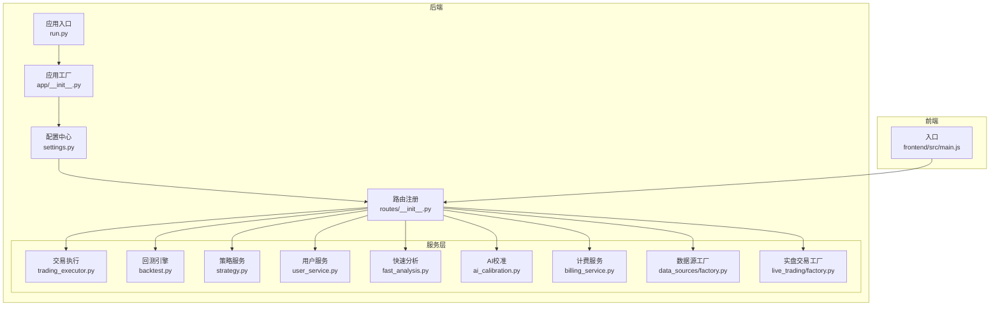
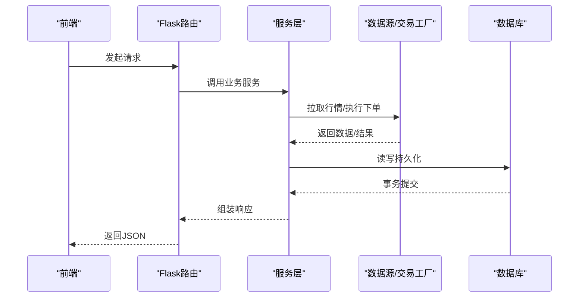
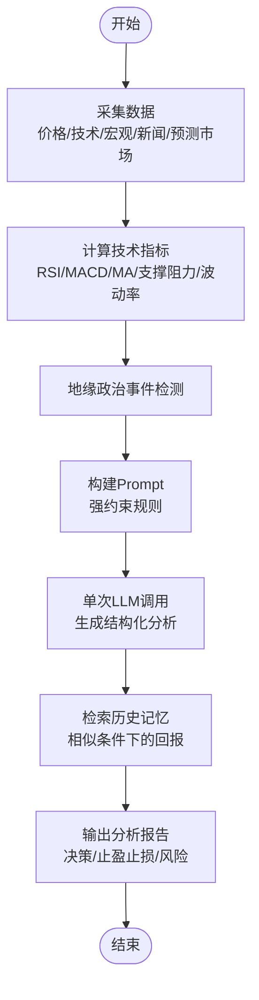
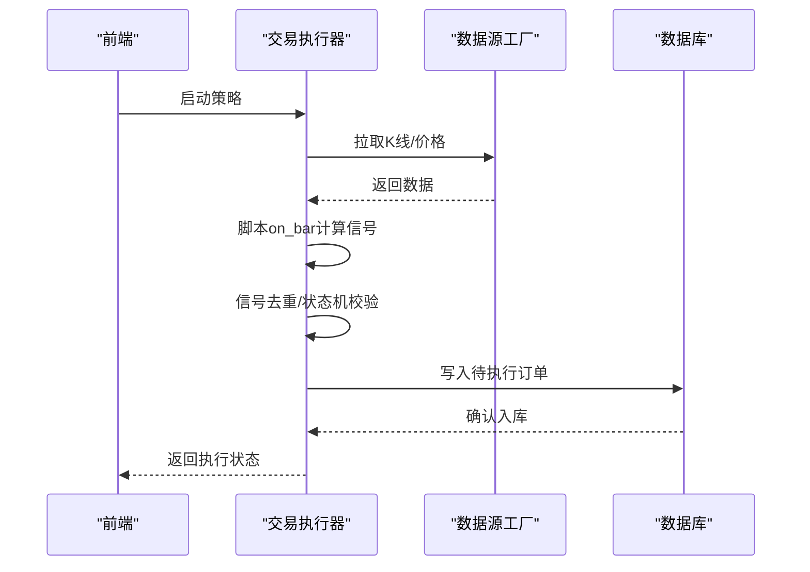
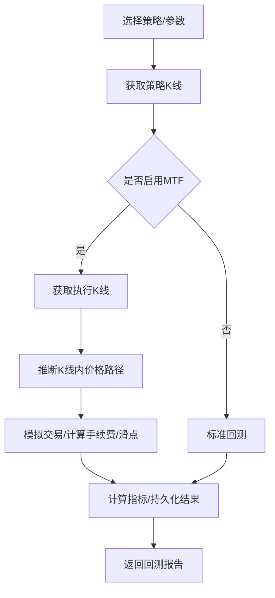
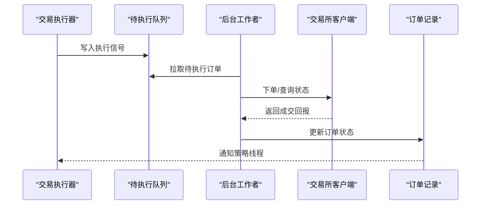
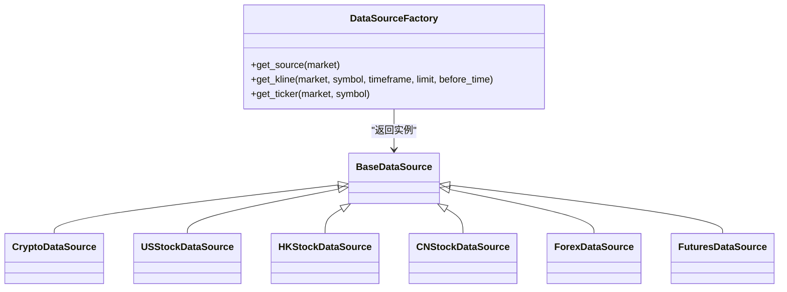
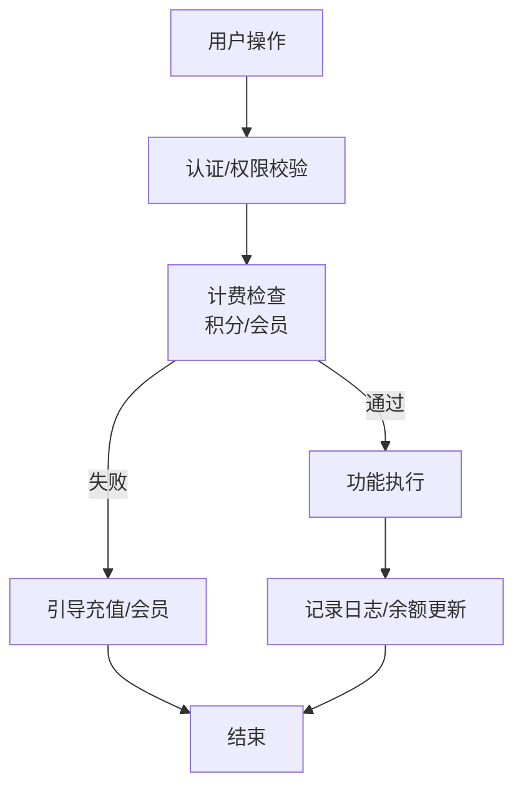
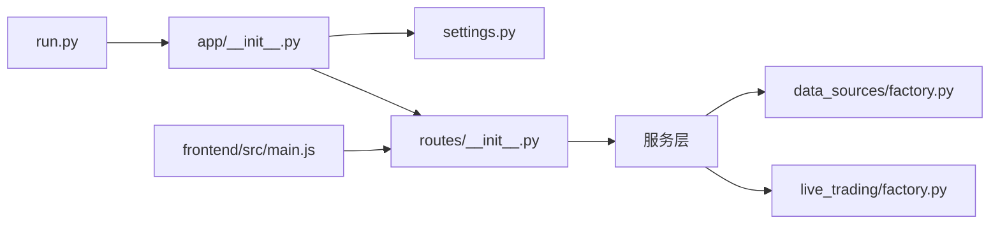

# 核心功能模块

<cite>
**本文引用的文件**
- [run.py](file://backend_api_python/run.py)
- [app/__init__.py](file://backend_api_python/app/__init__.py)
- [settings.py](file://backend_api_python/app/config/settings.py)
- [routes/__init__.py](file://backend_api_python/app/routes/__init__.py)
- [trading_executor.py](file://backend_api_python/app/services/trading_executor.py)
- [backtest.py](file://backend_api_python/app/services/backtest.py)
- [strategy.py](file://backend_api_python/app/services/strategy.py)
- [user_service.py](file://backend_api_python/app/services/user_service.py)
- [fast_analysis.py](file://backend_api_python/app/services/fast_analysis.py)
- [ai_calibration.py](file://backend_api_python/app/services/ai_calibration.py)
- [billing_service.py](file://backend_api_python/app/services/billing_service.py)
- [factory.py](file://backend_api_python/app/data_sources/factory.py)
- [live_factory.py](file://backend_api_python/app/services/live_trading/factory.py)
- [main.js](file://frontend/src/main.js)
</cite>

## 目录
1. [简介](#简介)
2. [项目结构](#项目结构)
3. [核心组件](#核心组件)
4. [架构总览](#架构总览)
5. [详细组件分析](#详细组件分析)
6. [依赖关系分析](#依赖关系分析)
7. [性能考量](#性能考量)
8. [故障排查指南](#故障排查指南)
9. [结论](#结论)
10. [附录](#附录)

## 简介
QuantDinger 是一个面向AI驱动的量化交易平台，提供从AI研究分析到策略开发、回测、实时交易执行、数据管理与用户管理及商业化的完整能力。后端采用Python/Flask，前端采用Vue，模块化设计清晰，支持多交易所、多市场类型接入，并内置AI校准与计费体系。

## 项目结构
后端以“应用工厂 + 路由注册 + 服务层”的分层架构组织，前端通过Axios与后端API交互，整体结构如下：

**图表来源**
- [run.py:1-134](file://backend_api_python/run.py#L1-L134)
- [app/__init__.py:1-288](file://backend_api_python/app/__init__.py#L1-L288)
- [settings.py:1-99](file://backend_api_python/app/config/settings.py#L1-L99)
- [routes/__init__.py:1-55](file://backend_api_python/app/routes/__init__.py#L1-L55)
- [trading_executor.py:1-800](file://backend_api_python/app/services/trading_executor.py#L1-L800)
- [backtest.py:1-800](file://backend_api_python/app/services/backtest.py#L1-L800)
- [strategy.py:1-800](file://backend_api_python/app/services/strategy.py#L1-L800)
- [user_service.py:1-701](file://backend_api_python/app/services/user_service.py#L1-L701)
- [fast_analysis.py:1-800](file://backend_api_python/app/services/fast_analysis.py#L1-L800)
- [ai_calibration.py:1-342](file://backend_api_python/app/services/ai_calibration.py#L1-L342)
- [billing_service.py:1-747](file://backend_api_python/app/services/billing_service.py#L1-L747)
- [factory.py:1-134](file://backend_api_python/app/data_sources/factory.py#L1-L134)
- [live_factory.py:1-355](file://backend_api_python/app/services/live_trading/factory.py#L1-L355)
- [main.js:1-59](file://frontend/src/main.js#L1-L59)

**章节来源**
- [run.py:1-134](file://backend_api_python/run.py#L1-L134)
- [app/__init__.py:1-288](file://backend_api_python/app/__init__.py#L1-L288)
- [settings.py:1-99](file://backend_api_python/app/config/settings.py#L1-L99)
- [routes/__init__.py:1-55](file://backend_api_python/app/routes/__init__.py#L1-L55)
- [main.js:1-59](file://frontend/src/main.js#L1-L59)

## 核心组件
- 应用入口与工厂：负责初始化配置、数据库、日志、CORS、Flasgger文档、业务服务启动钩子与单例获取。
- 路由注册：集中注册所有API蓝图，按模块划分命名空间。
- 服务层：交易执行、回测、策略、用户、快速分析、AI校准、计费、数据源工厂、实盘交易工厂。
- 前端入口：Vue应用初始化、权限控制、主题与国际化加载。

**章节来源**
- [app/__init__.py:213-288](file://backend_api_python/app/__init__.py#L213-L288)
- [routes/__init__.py:7-55](file://backend_api_python/app/routes/__init__.py#L7-L55)
- [main.js:1-59](file://frontend/src/main.js#L1-L59)

## 架构总览
后端采用“应用工厂 + 服务层 + 数据源/交易适配层”的分层设计，前端通过REST API与后端交互。核心模块间通过服务层解耦，数据流从API进入，经服务层处理，访问数据库与外部数据源，最终返回给前端。

**图表来源**
- [routes/__init__.py:7-55](file://backend_api_python/app/routes/__init__.py#L7-L55)
- [factory.py:1-134](file://backend_api_python/app/data_sources/factory.py#L1-L134)
- [live_factory.py:1-355](file://backend_api_python/app/services/live_trading/factory.py#L1-L355)

## 详细组件分析

### AI研究分析系统
- 设计目标：统一数据采集（K线、宏观、新闻、预测市场），一次LLM调用生成结构化分析报告，结合历史记忆辅助决策。
- 实现要点：
  - 数据采集：通过统一的市场数据采集器收集价格、技术指标、基本面、宏观、新闻与预测市场数据。
  - 技术指标：内置RSI、MACD、MA、支撑阻力、波动率等指标解读规则，形成可执行信号。
  - 地缘政治检测：基于模式匹配识别严重/中等级别冲突，纳入风险评估。
  - Prompt工程：强约束规则，要求语言、决策优先级、价格区间与止盈止损范围，输出结构化JSON。
  - 记忆层：检索相似历史条件下的决策与实际回报，作为上下文增强。
- 使用场景：快速生成多因子分析报告，辅助交易决策与风险评估。
- 交互关系：前端调用快速分析API → 后端聚合数据 → LLM生成报告 → 返回结构化结果。

**图表来源**
- [fast_analysis.py:186-761](file://backend_api_python/app/services/fast_analysis.py#L186-L761)

**章节来源**
- [fast_analysis.py:186-800](file://backend_api_python/app/services/fast_analysis.py#L186-L800)

### 策略开发引擎
- 设计目标：提供策略脚本运行时、参数解析、信号生成与执行信号转换、运行时状态持久化。
- 实现要点：
  - 脚本运行时：将K线DataFrame注入策略上下文，支持买卖/开平仓指令，自动维护本地持仓一致性。
  - 参数解析：将前端扁平化交易配置标准化为嵌套结构，兼容回测风格工具。
  - 信号去重：按策略+标的+信号类型+时间戳去重，避免同一K线重复下单。
  - 状态机：严格的状态机控制（开多/平多/加多、开空/平空/加空），优先级保证先平后开。
  - 运行时持久化：保存脚本参数与最后闭合K线时间，支持策略重启后继续执行。
- 使用场景：编写与运行策略脚本，支持网格、趋势、DCA等机器人策略。
- 交互关系：前端编辑策略 → 后端编译脚本 → 交易执行器按周期拉取K线/价格 → 生成执行信号 → 写入待执行队列。

**图表来源**
- [trading_executor.py:393-774](file://backend_api_python/app/services/trading_executor.py#L393-L774)
- [factory.py:74-105](file://backend_api_python/app/data_sources/factory.py#L74-L105)

**章节来源**
- [trading_executor.py:393-800](file://backend_api_python/app/services/trading_executor.py#L393-L800)
- [strategy.py:1-800](file://backend_api_python/app/services/strategy.py#L1-L800)

### 回测系统
- 设计目标：支持多时间框架回测，高精度1分钟/5分钟模拟，支持缩放规则与信号时机。
- 实现要点：
  - 多时间框架：策略时间框架用于信号生成，执行时间框架用于精确成交模拟，自动选择1分钟或5分钟执行精度。
  - 精度判定：根据回测区间天数与市场类型自动选择执行精度，超出范围降级为标准回测。
  - 交易模拟：基于执行K线推断K线内价格路径，确定触发订单，计算手续费与滑点。
  - 指标计算：统一计算收益曲线、胜率、总交易数等指标，持久化运行记录与交易明细。
- 使用场景：验证策略在历史数据上的表现，优化参数与风控。
- 交互关系：前端发起回测 → 后端获取策略K线 → 多时间框架模拟交易 → 计算指标 → 存储结果。

**图表来源**
- [backtest.py:444-667](file://backend_api_python/app/services/backtest.py#L444-L667)

**章节来源**
- [backtest.py:64-800](file://backend_api_python/app/services/backtest.py#L64-L800)

### 实时交易执行
- 设计目标：策略线程生成信号，写入待执行队列，后台工作者批量处理，对接各交易所REST直连。
- 实现要点：
  - 线程管理：限制最大线程数，清理退出线程，避免资源耗尽。
  - 符号规范化：将数据库/配置中的符号标准化为交易所合约格式。
  - 价格缓存：轻量内存缓存最近价格，降低查询压力。
  - 限流与风控：按策略维度写入日志心跳，避免过度写入。
  - 交易执行：通过实盘交易工厂创建具体交易所客户端，执行下单与状态查询。
- 使用场景：实盘运行策略，自动下单与跟踪成交。
- 交互关系：交易执行器 → 待执行队列 → 后台工作者 → 交易所REST → 成交回报。

**图表来源**
- [trading_executor.py:393-484](file://backend_api_python/app/services/trading_executor.py#L393-L484)
- [live_factory.py:59-218](file://backend_api_python/app/services/live_trading/factory.py#L59-L218)

**章节来源**
- [trading_executor.py:37-800](file://backend_api_python/app/services/trading_executor.py#L37-L800)
- [live_factory.py:1-355](file://backend_api_python/app/services/live_trading/factory.py#L1-L355)

### 数据管理
- 设计目标：统一数据源工厂，支持多市场类型（加密、美股、港股、A股、外汇、商品），提供K线与实时报价。
- 实现要点：
  - 工厂模式：按市场类型返回对应数据源，延迟创建与缓存。
  - K线获取：按时间周期与数量获取K线，自动排序。
  - 实时报价：按市场类型获取最新价格，兼容缺失实现。
- 使用场景：为策略与分析提供统一数据入口。
- 交互关系：服务层调用工厂 → 数据源返回K线/报价 → 上层使用。

**图表来源**
- [factory.py:13-71](file://backend_api_python/app/data_sources/factory.py#L13-L71)

**章节来源**
- [factory.py:1-134](file://backend_api_python/app/data_sources/factory.py#L1-L134)

### 用户管理与商业化
- 用户管理：
  - 多角色权限：viewer/user/manager/admin，不同角色具备不同权限集合。
  - 密码安全：优先bcrypt，降级SHA256，支持密码变更与重置。
  - 用户生命周期：创建、登录、权限校验、令牌版本控制（单点登录）。
- 商业化：
  - 积分体系：统一计费开关与功能单价，消费记录与余额管理。
  - 会员计划：月卡、年卡、终身卡，支持叠加与周期性发放积分。
  - AI校准：基于历史分析结果自动校准决策阈值，提升分析质量。
- 使用场景：多租户用户体系、功能付费与会员权益。
- 交互关系：前端登录/购买 → 后端鉴权/计费 → 更新用户状态与积分。

**图表来源**
- [user_service.py:56-701](file://backend_api_python/app/services/user_service.py#L56-L701)
- [billing_service.py:47-747](file://backend_api_python/app/services/billing_service.py#L47-L747)
- [ai_calibration.py:57-342](file://backend_api_python/app/services/ai_calibration.py#L57-L342)

**章节来源**
- [user_service.py:56-701](file://backend_api_python/app/services/user_service.py#L56-L701)
- [billing_service.py:47-747](file://backend_api_python/app/services/billing_service.py#L47-L747)
- [ai_calibration.py:57-342](file://backend_api_python/app/services/ai_calibration.py#L57-L342)

## 依赖关系分析
- 应用入口依赖配置与工厂，启动时初始化数据库、管理员账户、服务单例与后台任务。
- 路由注册集中管理所有API蓝图，按模块划分命名空间，避免命名冲突。
- 服务层内部通过工具函数与工厂解耦，数据源与实盘交易通过工厂创建，避免硬编码。
- 前端通过Axios与后端交互，权限与国际化在入口处初始化。

**图表来源**
- [run.py:96-134](file://backend_api_python/run.py#L96-L134)
- [app/__init__.py:265-288](file://backend_api_python/app/__init__.py#L265-L288)
- [routes/__init__.py:7-55](file://backend_api_python/app/routes/__init__.py#L7-L55)
- [factory.py:1-134](file://backend_api_python/app/data_sources/factory.py#L1-L134)
- [live_factory.py:1-355](file://backend_api_python/app/services/live_trading/factory.py#L1-L355)
- [main.js:1-59](file://frontend/src/main.js#L1-L59)

**章节来源**
- [run.py:96-134](file://backend_api_python/run.py#L96-L134)
- [app/__init__.py:265-288](file://backend_api_python/app/__init__.py#L265-L288)
- [routes/__init__.py:7-55](file://backend_api_python/app/routes/__init__.py#L7-L55)
- [main.js:1-59](file://frontend/src/main.js#L1-L59)

## 性能考量
- 线程与资源：交易执行器限制最大线程数，避免资源耗尽；提供资源状态打印便于诊断。
- 缓存：K线与价格缓存减少外部API调用；策略运行时状态持久化避免重复计算。
- I/O与并发：数据源工厂与实盘交易工厂延迟导入，按需创建，降低启动时依赖。
- 日志与可观测：安全JSON提供器避免NaN/Inf导致的前端解析错误；统一日志级别与目录配置。

**章节来源**
- [trading_executor.py:40-102](file://backend_api_python/app/services/trading_executor.py#L40-L102)
- [app/__init__.py:16-51](file://backend_api_python/app/__init__.py#L16-L51)
- [settings.py:43-98](file://backend_api_python/app/config/settings.py#L43-L98)

## 故障排查指南
- 启动与安全：
  - SECRET_KEY默认值：生产环境必须替换，否则自动生成随机密钥并提示持久化。
  - 代理与网络：支持统一代理设置，国内金融域名自动绕过代理，避免不必要的海外回环。
- 交易执行：
  - 线程上限：达到最大线程数会拒绝启动新策略，检查资源状态与线程清理。
  - 符号规范化：交易所合约符号与数据库/前端不一致时，自动规范化。
- 回测：
  - MTF执行精度：根据日期跨度与市场类型自动选择1分钟/5分钟执行精度，超出范围降级。
- 用户与计费：
  - 权限不足：检查用户角色与功能计费配置；积分不足时引导充值。
  - 会员状态：确认VIP到期时间与周期性积分发放。

**章节来源**
- [run.py:109-134](file://backend_api_python/run.py#L109-L134)
- [trading_executor.py:103-146](file://backend_api_python/app/services/trading_executor.py#L103-L146)
- [backtest.py:170-224](file://backend_api_python/app/services/backtest.py#L170-L224)
- [billing_service.py:450-514](file://backend_api_python/app/services/billing_service.py#L450-L514)
- [user_service.py:194-246](file://backend_api_python/app/services/user_service.py#L194-L246)

## 结论
QuantDinger通过清晰的分层架构与模块化设计，实现了从AI研究分析到策略开发、回测、实时交易执行、数据管理与商业化的一体化能力。服务层以工厂与单例为核心解耦外部依赖，前后端分离并通过REST API协作，适合在多交易所、多市场环境下扩展与演进。

## 附录
- 使用示例（路径指引）：
  - 启动应用：[run.py:104-134](file://backend_api_python/run.py#L104-L134)
  - 注册路由：[routes/__init__.py:7-55](file://backend_api_python/app/routes/__init__.py#L7-L55)
  - 快速分析：[fast_analysis.py:186-761](file://backend_api_python/app/services/fast_analysis.py#L186-L761)
  - 策略执行：[trading_executor.py:393-774](file://backend_api_python/app/services/trading_executor.py#L393-L774)
  - 回测运行：[backtest.py:444-667](file://backend_api_python/app/services/backtest.py#L444-L667)
  - 用户管理：[user_service.py:314-409](file://backend_api_python/app/services/user_service.py#L314-L409)
  - 计费与会员：[billing_service.py:450-747](file://backend_api_python/app/services/billing_service.py#L450-L747)
  - 数据源工厂：[factory.py:13-71](file://backend_api_python/app/data_sources/factory.py#L13-L71)
  - 实盘交易工厂：[live_factory.py:59-218](file://backend_api_python/app/services/live_trading/factory.py#L59-L218)
  - 前端入口：[main.js:1-59](file://frontend/src/main.js#L1-L59)