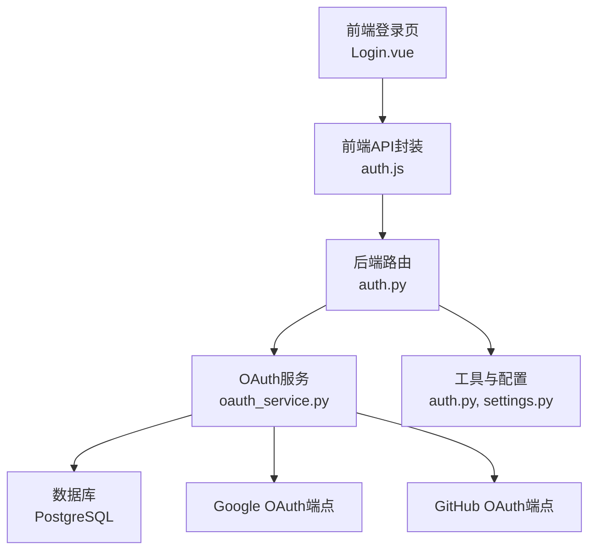
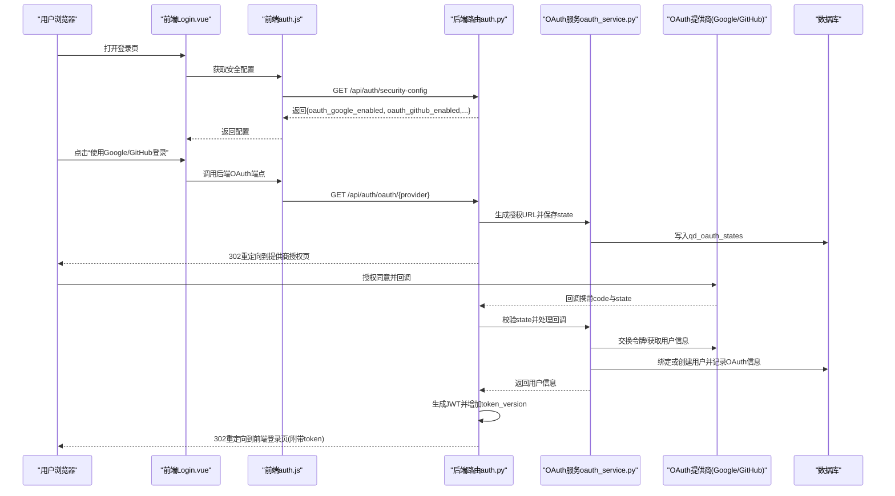
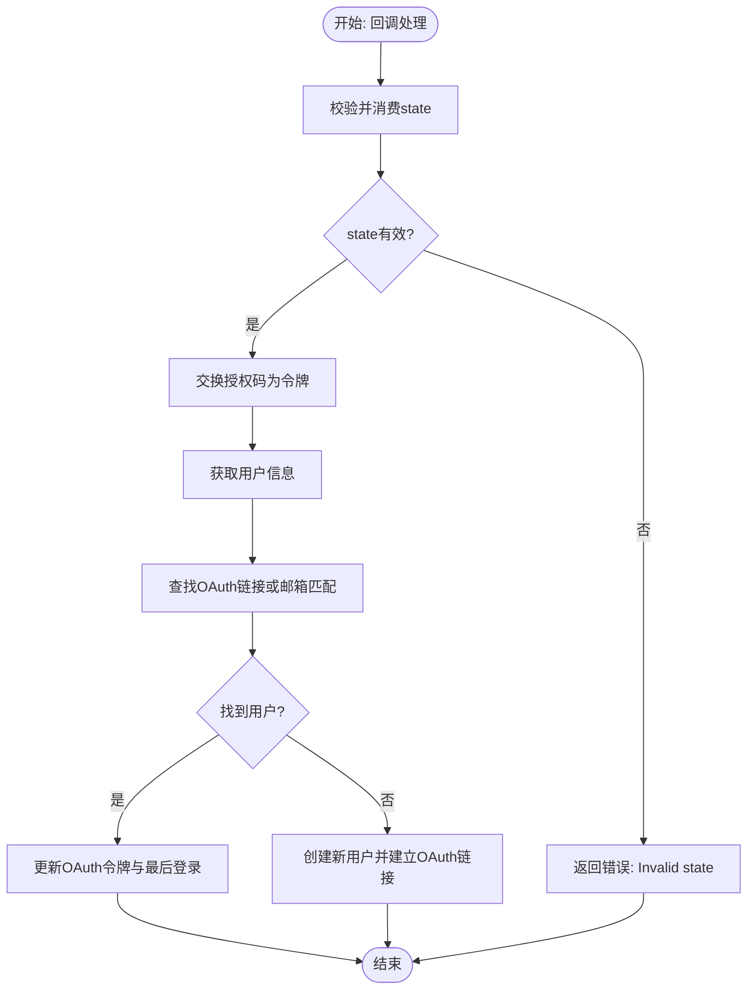
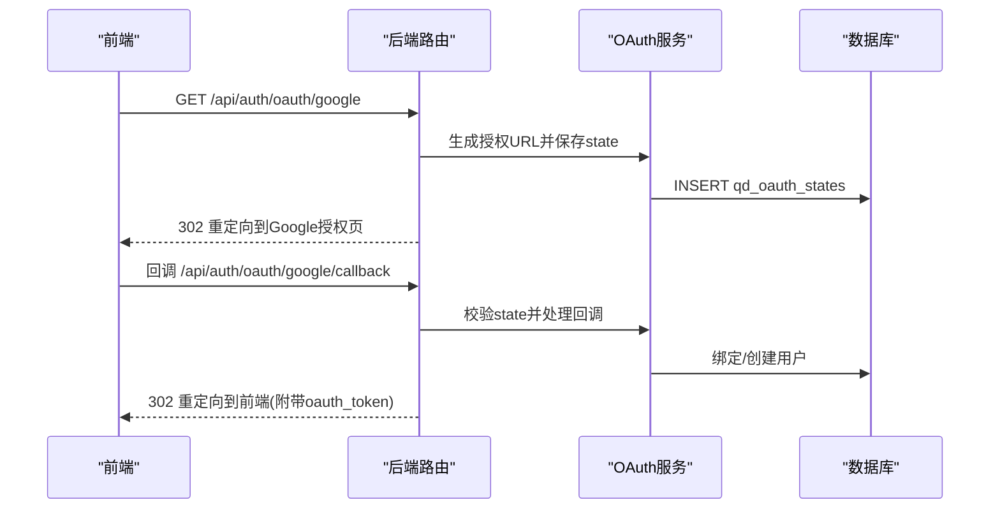
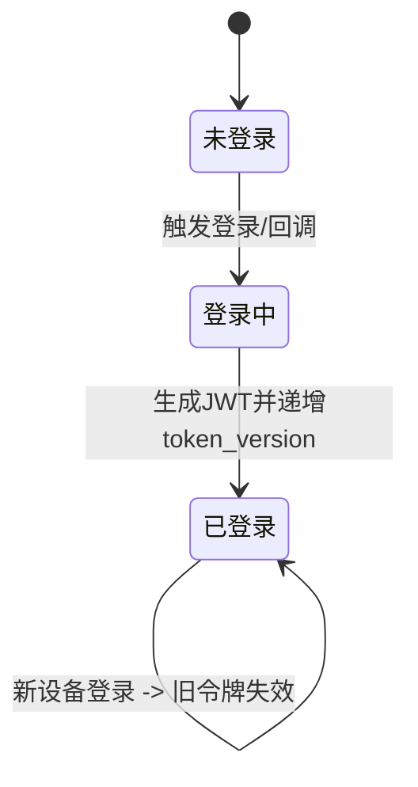
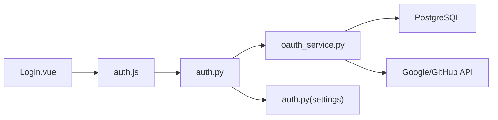

# OAuth集成

<cite>
**本文引用的文件**
- [oauth_service.py](file://backend_api_python/app/services/oauth_service.py)
- [auth.py](file://backend_api_python/app/routes/auth.py)
- [auth.js](file://frontend/src/api/auth.js)
- [Login.vue](file://frontend/src/views/user/Login.vue)
- [settings.py](file://backend_api_python/app/config/settings.py)
- [OAUTH_CONFIG_EN.md](file://docs/OAUTH_CONFIG_EN.md)
- [OAUTH_CONFIG_CN.md](file://docs/OAUTH_CONFIG_CN.md)
- [auth.py](file://backend_api_python/app/utils/auth.py)
- [user_service.py](file://backend_api_python/app/services/user_service.py)
- [init.sql](file://backend_api_python/migrations/init.sql)
</cite>

## 目录
1. [简介](#简介)
2. [项目结构](#项目结构)
3. [核心组件](#核心组件)
4. [架构总览](#架构总览)
5. [详细组件分析](#详细组件分析)
6. [依赖关系分析](#依赖关系分析)
7. [性能考量](#性能考量)
8. [故障排查指南](#故障排查指南)
9. [结论](#结论)
10. [附录](#附录)

## 简介
本文件面向QuantDinger的OAuth集成系统，提供从架构设计、实现细节到最佳实践的完整文档。系统当前支持Google与GitHub两大OAuth提供商，采用标准OAuth 2.0授权码流程，结合CSRF防护、状态持久化、用户信息聚合与账户绑定策略，实现安全、可靠的第三方登录体验。同时，文档覆盖配置指南、API接口说明、单点登录（SSO）与会话管理、跨域认证与用户身份同步、错误处理与安全加固建议。

## 项目结构
- 后端Python服务位于backend_api_python，核心OAuth逻辑集中在服务层，路由层负责对外暴露REST端点与重定向处理。
- 前端位于frontend，提供OAuth登录入口与回调接收，通过API模块调用后端OAuth端点。
- 文档docs提供OAuth提供商配置指南，便于快速部署与上线。

图表来源
- [auth.py:18-88](file://backend_api_python/app/routes/auth.py#L18-L88)
- [oauth_service.py:145-194](file://backend_api_python/app/services/oauth_service.py#L145-L194)
- [auth.js:119-131](file://frontend/src/api/auth.js#L119-L131)
- [Login.vue:188-214](file://frontend/src/views/user/Login.vue#L188-L214)

章节来源
- [auth.py:18-88](file://backend_api_python/app/routes/auth.py#L18-L88)
- [oauth_service.py:145-194](file://backend_api_python/app/services/oauth_service.py#L145-L194)
- [auth.js:119-131](file://frontend/src/api/auth.js#L119-L131)
- [Login.vue:188-214](file://frontend/src/views/user/Login.vue#L188-L214)

## 核心组件
- OAuth服务（OAuthService）
  - 负责Google与GitHub的授权URL生成、回调处理、令牌交换、用户信息拉取、OAuth账号与平台账号绑定、解绑等。
  - 实现CSRF防护的状态持久化与校验，支持多实例/多副本共享状态。
- 路由层（auth_bp）
  - 对外暴露/oauth/google与/oauth/github端点，处理授权跳转与回调，生成JWT并重定向至前端。
  - 提供安全配置查询端点，前端据此动态展示OAuth按钮。
- 前端
  - 登录页根据安全配置显示OAuth按钮；发起OAuth登录时调用后端端点；接收回调参数并存储令牌。
- 工具与配置
  - JWT工具负责令牌生成与校验，配合token_version实现单点登录。
  - 全局配置settings.py提供密钥与运行参数。

章节来源
- [oauth_service.py:27-194](file://backend_api_python/app/services/oauth_service.py#L27-L194)
- [auth.py:1270-1427](file://backend_api_python/app/routes/auth.py#L1270-L1427)
- [auth.js:119-131](file://frontend/src/api/auth.js#L119-L131)
- [Login.vue:188-214](file://frontend/src/views/user/Login.vue#L188-L214)
- [auth.py:18-113](file://backend_api_python/app/utils/auth.py#L18-L113)
- [settings.py:32-41](file://backend_api_python/app/config/settings.py#L32-L41)

## 架构总览
OAuth登录整体流程遵循OAuth 2.0授权码模式，结合CSRF防护与状态持久化，确保回调链路安全可靠。

图表来源
- [auth.py:1270-1427](file://backend_api_python/app/routes/auth.py#L1270-L1427)
- [oauth_service.py:200-297](file://backend_api_python/app/services/oauth_service.py#L200-L297)
- [auth.py:18-113](file://backend_api_python/app/utils/auth.py#L18-L113)

章节来源
- [auth.py:1270-1427](file://backend_api_python/app/routes/auth.py#L1270-L1427)
- [oauth_service.py:200-297](file://backend_api_python/app/services/oauth_service.py#L200-L297)
- [auth.py:18-113](file://backend_api_python/app/utils/auth.py#L18-L113)

## 详细组件分析

### OAuth服务（OAuthService）
- 状态管理
  - 使用qd_oauth_states表持久化state，支持跨进程/多副本一致性，避免多Worker场景下的state不一致问题。
  - 提供state保存、窥探（peek）、消费（consume）与清理方法，严格校验过期时间。
- Google OAuth
  - 生成授权URL，包含client_id、redirect_uri、scope、prompt、state等参数。
  - 回调处理：校验state，交换令牌，调用用户信息接口，返回标准化用户信息。
- GitHub OAuth
  - 生成授权URL，包含client_id、redirect_uri、scope、state等参数。
  - 回调处理：校验state，交换令牌，调用用户与邮箱接口，合并用户信息。
- 用户绑定与创建
  - 优先按provider+provider_user_id匹配已有OAuth链接；若不存在则按邮箱匹配现有用户；否则创建新用户并建立OAuth链接。
  - 新用户创建时生成随机密码（OAuth免密码登录），并进行用户名去重与邮箱去重处理。
- OAuth解绑
  - 支持解除某OAuth提供商绑定；若用户仅有此一种认证方式且无密码，则禁止解绑以保障账户安全。

图表来源
- [oauth_service.py:248-426](file://backend_api_python/app/services/oauth_service.py#L248-L426)
- [oauth_service.py:432-640](file://backend_api_python/app/services/oauth_service.py#L432-L640)

章节来源
- [oauth_service.py:70-194](file://backend_api_python/app/services/oauth_service.py#L70-L194)
- [oauth_service.py:237-426](file://backend_api_python/app/services/oauth_service.py#L237-L426)
- [oauth_service.py:432-640](file://backend_api_python/app/services/oauth_service.py#L432-L640)

### 路由层（auth_bp）
- OAuth端点
  - GET /api/auth/oauth/google：生成Google授权URL并保存state，返回302重定向。
  - GET /api/auth/oauth/github：生成GitHub授权URL并保存state，返回302重定向。
  - GET /api/auth/oauth/{provider}/callback：处理回调，调用OAuth服务，生成JWT并重定向至前端。
- 安全配置端点
  - GET /api/auth/security-config：返回Turnstile开关、OAuth提供商可用性等公共配置。
- 前端重定向构建
  - _build_frontend_login_redirect：兼容PC哈希路由与SPA历史路由，拼接oauth_token或oauth_error参数。

图表来源
- [auth.py:1270-1427](file://backend_api_python/app/routes/auth.py#L1270-L1427)
- [oauth_service.py:200-297](file://backend_api_python/app/services/oauth_service.py#L200-L297)

章节来源
- [auth.py:18-88](file://backend_api_python/app/routes/auth.py#L18-L88)
- [auth.py:1270-1427](file://backend_api_python/app/routes/auth.py#L1270-L1427)

### 前端交互（Login.vue 与 auth.js）
- 登录页根据安全配置动态显示Google/GitHub按钮。
- 通过auth.js封装的getGoogleOAuthUrl/getGitHubOAuthUrl获取后端OAuth端点，打开新窗口或跳转进行授权。
- 处理回调参数oauth_token与oauth_error，存储令牌并清除URL参数，避免重复提交。

章节来源
- [auth.js:119-131](file://frontend/src/api/auth.js#L119-L131)
- [Login.vue:188-214](file://frontend/src/views/user/Login.vue#L188-L214)
- [Login.vue:783-800](file://frontend/src/views/user/Login.vue#L783-L800)

### 单点登录（SSO）与会话管理
- token_version机制
  - 每次登录（含OAuth）都会递增用户token_version，旧令牌因版本不匹配而失效，实现单一客户端登录。
  - JWT载荷包含token_version，验证时会查询数据库当前版本，不一致则拒绝。
- 数据库迁移
  - 迁移脚本为qd_users表增加token_version列，支持该功能。

图表来源
- [auth.py:82-113](file://backend_api_python/app/utils/auth.py#L82-L113)
- [user_service.py:274-294](file://backend_api_python/app/services/user_service.py#L274-L294)
- [init.sql:824-840](file://backend_api_python/migrations/init.sql#L824-L840)

章节来源
- [auth.py:18-113](file://backend_api_python/app/utils/auth.py#L18-L113)
- [user_service.py:274-294](file://backend_api_python/app/services/user_service.py#L274-L294)
- [init.sql:824-840](file://backend_api_python/migrations/init.sql#L824-L840)

### 跨域认证与用户身份同步
- 前端重定向兼容
  - _build_frontend_login_redirect支持两种前端路由模式：PC哈希路由与SPA历史路由，自动拼接参数并保留原路径。
- 回调URL白名单
  - OAuth服务支持OAUTH_ALLOWED_REDIRECTS配置，结合FRONTEND_URL形成允许的重定向来源集合，避免开放重定向风险。

章节来源
- [auth.py:18-88](file://backend_api_python/app/routes/auth.py#L18-L88)
- [oauth_service.py:162-190](file://backend_api_python/app/services/oauth_service.py#L162-L190)

## 依赖关系分析
- 组件耦合
  - 路由层依赖OAuth服务进行授权与回调处理；OAuth服务依赖数据库持久化state与用户绑定；前端依赖路由提供的OAuth端点。
- 外部依赖
  - Google OAuth与GitHub OAuth API；PostgreSQL用于持久化state与用户绑定信息。
- 循环依赖
  - 通过延迟导入避免循环依赖（例如路由中导入OAuth服务）。

图表来源
- [auth.py:1270-1427](file://backend_api_python/app/routes/auth.py#L1270-L1427)
- [oauth_service.py:145-194](file://backend_api_python/app/services/oauth_service.py#L145-L194)
- [auth.js:119-131](file://frontend/src/api/auth.js#L119-L131)
- [Login.vue:188-214](file://frontend/src/views/user/Login.vue#L188-L214)

章节来源
- [auth.py:1270-1427](file://backend_api_python/app/routes/auth.py#L1270-L1427)
- [oauth_service.py:145-194](file://backend_api_python/app/services/oauth_service.py#L145-L194)
- [auth.js:119-131](file://frontend/src/api/auth.js#L119-L131)
- [Login.vue:188-214](file://frontend/src/views/user/Login.vue#L188-L214)

## 性能考量
- 状态持久化
  - 使用qd_oauth_states表存储state，避免内存缓存导致多Worker不一致；定期清理过期state降低表膨胀。
- 请求超时
  - 与OAuth提供商的HTTP请求设置合理超时，避免阻塞线程。
- 用户绑定
  - 优先通过provider+provider_user_id匹配，减少邮箱查询成本；邮箱冲突时进行去重处理，保证唯一性。
- 令牌版本
  - token_version递增仅在登录时发生，对正常业务影响有限；验证时仅做一次数据库查询，复杂度低。

章节来源
- [oauth_service.py:70-103](file://backend_api_python/app/services/oauth_service.py#L70-L103)
- [oauth_service.py:237-297](file://backend_api_python/app/services/oauth_service.py#L237-L297)
- [auth.py:82-113](file://backend_api_python/app/utils/auth.py#L82-L113)

## 故障排查指南
- 常见错误与定位
  - redirect_uri_mismatch：检查后端GOOGLE_REDIRECT_URI/GITHUB_REDIRECT_URI与提供商后台配置是否一致（含协议、端口、路径）。
  - Invalid state：确认state是否被正确保存与消费，检查qd_oauth_states表是否存在对应记录且未过期。
  - OAuth服务不可用：网络异常或提供商接口不可达，查看后端日志与超时设置。
  - 无法跳转回前端：检查FRONTEND_URL与OAUTH_ALLOWED_REDIRECTS配置，确保回调URL在允许列表内。
- 建议排查步骤
  - 核对环境变量与提供商后台配置。
  - 查看qd_oauth_states表状态与过期时间。
  - 检查JWT生成与校验流程，确认token_version是否递增。
  - 关注安全配置端点返回值，确认OAuth按钮是否被正确显示。

章节来源
- [OAUTH_CONFIG_EN.md:185-190](file://docs/OAUTH_CONFIG_EN.md#L185-L190)
- [OAUTH_CONFIG_CN.md:185-190](file://docs/OAUTH_CONFIG_CN.md#L185-L190)
- [oauth_service.py:70-103](file://backend_api_python/app/services/oauth_service.py#L70-L103)
- [auth.py:82-113](file://backend_api_python/app/utils/auth.py#L82-L113)

## 结论
QuantDinger的OAuth集成以OAuth 2.0授权码为核心，结合CSRF防护、状态持久化与token_version单点登录机制，提供了安全、稳定的第三方登录能力。通过清晰的路由与服务分层、完善的前端交互与配置指南，系统可在不同部署环境下快速落地。建议在生产环境中严格核对回调URL、启用HTTPS、定期清理state并监控令牌版本变化，以进一步提升安全性与稳定性。

## 附录

### OAuth提供商配置指南（摘要）
- Google OAuth
  - 在Google Cloud Console创建OAuth客户端，配置授权回调URI为后端对应端点。
  - 设置GOOGLE_CLIENT_ID、GOOGLE_CLIENT_SECRET、GOOGLE_REDIRECT_URI与FRONTEND_URL。
- GitHub OAuth
  - 在GitHub Developer Settings创建OAuth App，配置回调URL为后端对应端点。
  - 设置GITHUB_CLIENT_ID、GITHUB_CLIENT_SECRET、GITHUB_REDIRECT_URI与FRONTEND_URL。
- 部署注意事项
  - 生产环境需更新回调URL与域名白名单，确保与实际部署一致。
  - 如前后端分离部署，需分别配置各自域名与端口。

章节来源
- [OAUTH_CONFIG_EN.md:15-56](file://docs/OAUTH_CONFIG_EN.md#L15-L56)
- [OAUTH_CONFIG_EN.md:60-88](file://docs/OAUTH_CONFIG_EN.md#L60-L88)
- [OAUTH_CONFIG_EN.md:122-174](file://docs/OAUTH_CONFIG_EN.md#L122-L174)
- [OAUTH_CONFIG_CN.md:15-56](file://docs/OAUTH_CONFIG_CN.md#L15-L56)
- [OAUTH_CONFIG_CN.md:60-88](file://docs/OAUTH_CONFIG_CN.md#L60-L88)
- [OAUTH_CONFIG_CN.md:122-174](file://docs/OAUTH_CONFIG_CN.md#L122-L174)

### API接口文档（摘要）
- GET /api/auth/oauth/google
  - 作用：重定向至Google授权页。
  - 参数：redirect（可选，需在允许列表内）。
  - 响应：302重定向至Google授权页。
- GET /api/auth/oauth/github
  - 作用：重定向至GitHub授权页。
  - 参数：redirect（可选，需在允许列表内）。
  - 响应：302重定向至GitHub授权页。
- GET /api/auth/oauth/{provider}/callback
  - 作用：处理授权回调，校验state，交换令牌，创建/绑定用户，生成JWT并重定向至前端。
  - 查询参数：code、state、oauth_token/oauth_error（前端接收）。
  - 响应：302重定向至前端登录页（携带oauth_token或oauth_error）。
- GET /api/auth/security-config
  - 作用：返回Turnstile开关与OAuth提供商可用性等公共配置。
  - 响应：包含oauth_google_enabled、oauth_github_enabled等字段。

章节来源
- [auth.py:1270-1427](file://backend_api_python/app/routes/auth.py#L1270-L1427)