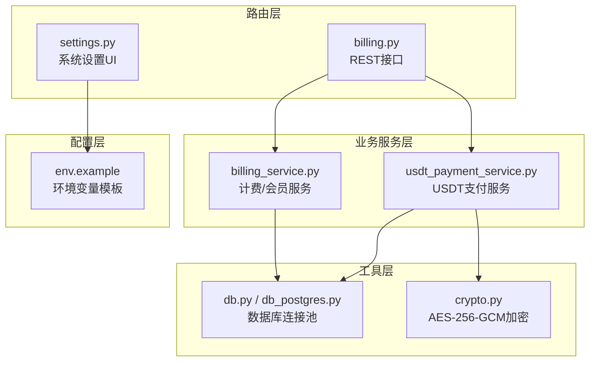
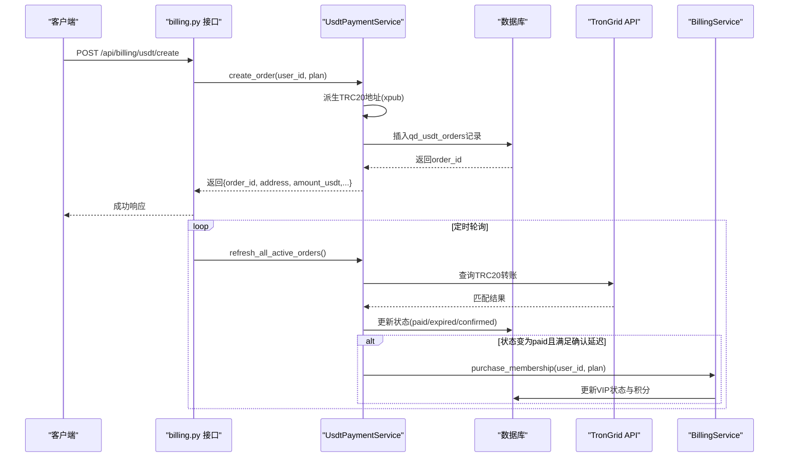
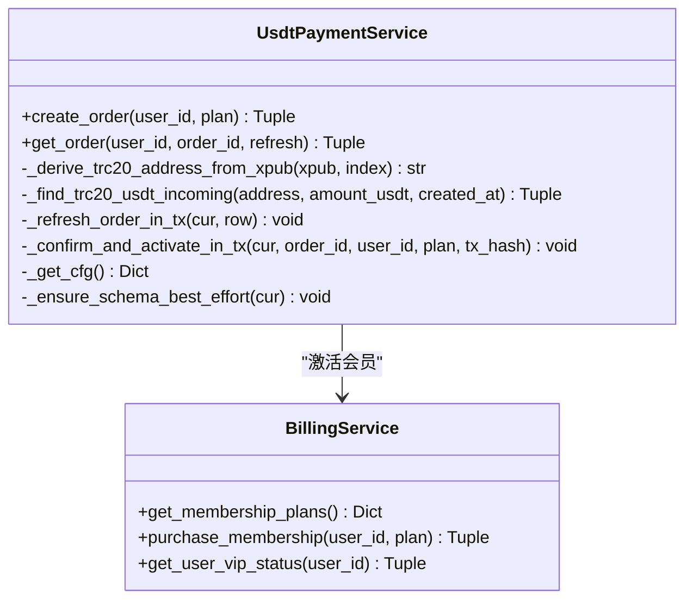
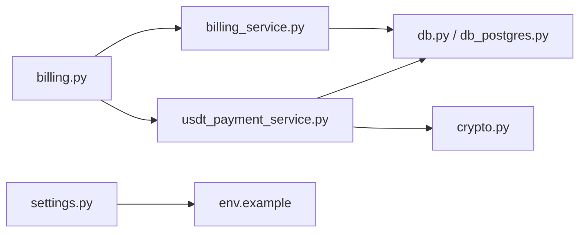
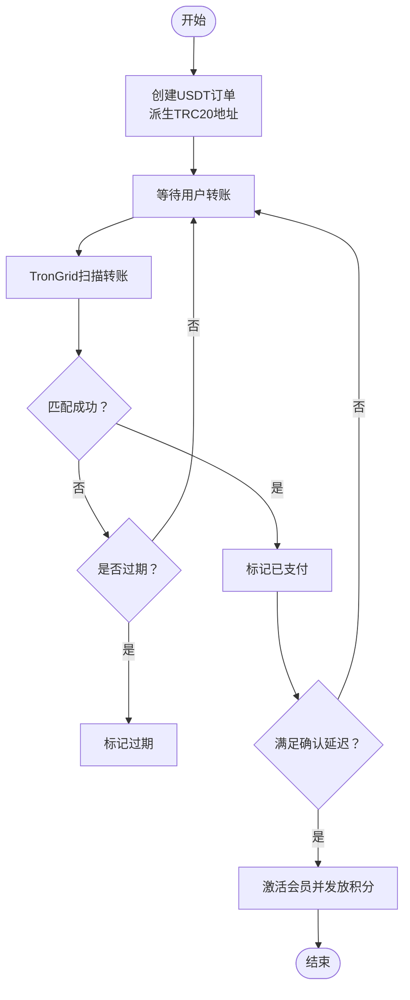

# 支付集成系统

<cite>
**本文档引用的文件**
- [usdt_payment_service.py](file://backend_api_python/app/services/usdt_payment_service.py)
- [billing.py](file://backend_api_python/app/routes/billing.py)
- [billing_service.py](file://backend_api_python/app/services/billing_service.py)
- [settings.py](file://backend_api_python/app/routs/settings.py)
- [env.example](file://backend_api_python/env.example)
- [db.py](file://backend_api_python/app/utils/db.py)
- [db_postgres.py](file://backend_api_python/app/utils/db_postgres.py)
- [crypto.py](file://backend_api_python/app/utils/crypto.py)
</cite>

## 目录
1. [简介](#简介)
2. [项目结构](#项目结构)
3. [核心组件](#核心组件)
4. [架构总览](#架构总览)
5. [详细组件分析](#详细组件分析)
6. [依赖关系分析](#依赖关系分析)
7. [性能考量](#性能考量)
8. [故障排查指南](#故障排查指南)
9. [结论](#结论)
10. [附录](#附录)

## 简介
本文件面向QuantDinger的支付集成系统，重点围绕USDT稳定币支付服务的实现进行系统化说明。内容涵盖：
- USDT支付服务的架构设计与实现细节
- 稳定币支付的优势、安全性保障与合规性考虑
- 支付网关集成方式（TronGrid + watch-only xpub派生地址）
- 钱包地址管理、交易确认机制、余额查询与转账处理
- 支付流程（订单创建、支付发起、状态跟踪、回调处理与异常恢复）
- 支付安全机制（签名验证、防重放攻击、资金安全保障）
- 支付API接口文档（请求参数、响应格式、错误码）
- 最佳实践（测试环境配置、生产环境部署与监控告警）

## 项目结构
QuantDinger后端采用Flask微服务架构，支付相关代码主要集中在以下模块：
- 路由层：billing.py 提供REST接口，暴露USDT支付相关端点
- 业务服务层：billing_service.py 提供会员购买与计费能力；usdt_payment_service.py 实现USDT支付核心逻辑
- 工具层：db.py/db_postgres.py 提供数据库连接池与事务封装；crypto.py 提供敏感数据加密工具
- 配置层：env.example 提供环境变量配置模板；settings.py 提供系统设置UI的配置项定义

图表来源
- [billing.py:1-243](file://backend_api_python/app/routes/billing.py#L1-L243)
- [billing_service.py:1-747](file://backend_api_python/app/services/billing_service.py#L1-L747)
- [usdt_payment_service.py:1-820](file://backend_api_python/app/services/usdt_payment_service.py#L1-L820)
- [db.py:1-66](file://backend_api_python/app/utils/db.py#L1-L66)
- [db_postgres.py:1-495](file://backend_api_python/app/utils/db_postgres.py#L1-L495)
- [crypto.py:1-78](file://backend_api_python/app/utils/crypto.py#L1-L78)
- [settings.py:790-989](file://backend_api_python/app/routes/settings.py#L790-L989)
- [env.example:153-163](file://backend_api_python/env.example#L153-L163)

章节来源
- [billing.py:1-243](file://backend_api_python/app/routes/billing.py#L1-L243)
- [billing_service.py:1-747](file://backend_api_python/app/services/billing_service.py#L1-L747)
- [usdt_payment_service.py:1-820](file://backend_api_python/app/services/usdt_payment_service.py#L1-L820)
- [db.py:1-66](file://backend_api_python/app/utils/db.py#L1-L66)
- [db_postgres.py:1-495](file://backend_api_python/app/utils/db_postgres.py#L1-L495)
- [crypto.py:1-78](file://backend_api_python/app/utils/crypto.py#L1-L78)
- [settings.py:790-989](file://backend_api_python/app/routes/settings.py#L790-L989)
- [env.example:153-163](file://backend_api_python/env.example#L153-L163)

## 核心组件
- USDT支付服务（UsdtPaymentService）：负责订单创建、链上状态刷新、自动对账与会员激活
- 计费服务（BillingService）：负责会员计划配置、购买流程与积分管理
- 数据库连接池（db_postgres.py）：提供线程安全的连接池与健康检查
- 加密工具（crypto.py）：提供AES-256-GCM对称加密，用于敏感配置的存储
- REST路由（billing.py）：对外暴露USDT支付相关API端点
- 系统设置（settings.py）：通过UI配置USDT支付相关参数

章节来源
- [usdt_payment_service.py:23-820](file://backend_api_python/app/services/usdt_payment_service.py#L23-L820)
- [billing_service.py:47-747](file://backend_api_python/app/services/billing_service.py#L47-L747)
- [db_postgres.py:107-495](file://backend_api_python/app/utils/db_postgres.py#L107-L495)
- [crypto.py:10-78](file://backend_api_python/app/utils/crypto.py#L10-L78)
- [billing.py:129-242](file://backend_api_python/app/routes/billing.py#L129-L242)
- [settings.py:790-989](file://backend_api_python/app/routes/settings.py#L790-L989)

## 架构总览
USDT支付系统采用“每单独立地址 + 自动对账”方案，核心流程如下：
- 用户在前端选择会员计划并发起支付
- 后端生成唯一订单并派生TRC20地址，返回给前端
- 用户向该地址转账USDT-TRC20
- 后端定时扫描TronGrid API匹配转账，更新订单状态
- 达到确认延迟后激活会员并发放相应权益

图表来源
- [billing.py:129-185](file://backend_api_python/app/routes/billing.py#L129-L185)
- [usdt_payment_service.py:132-187](file://backend_api_python/app/services/usdt_payment_service.py#L132-L187)
- [usdt_payment_service.py:538-600](file://backend_api_python/app/services/usdt_payment_service.py#L538-L600)
- [usdt_payment_service.py:420-535](file://backend_api_python/app/services/usdt_payment_service.py#L420-L535)
- [billing_service.py:202-334](file://backend_api_python/app/services/billing_service.py#L202-L334)

## 详细组件分析

### USDT支付服务（UsdtPaymentService）
- 配置管理：从环境变量读取USDT支付开关、链类型、xpub、TronGrid基础URL与API Key、合约地址、确认延迟与订单过期时间等
- 订单管理：创建订单时派生TRC20地址，写入数据库并返回订单详情
- 链上状态刷新：扫描TronGrid API匹配转账，支持“paid”状态的确认延迟检查
- 自动对账：通过唯一地址与目标金额精确匹配，避免误判
- 会员激活：确认后调用计费服务完成会员购买与积分发放

图表来源
- [usdt_payment_service.py:23-820](file://backend_api_python/app/services/usdt_payment_service.py#L23-L820)
- [billing_service.py:47-747](file://backend_api_python/app/services/billing_service.py#L47-L747)

章节来源
- [usdt_payment_service.py:33-46](file://backend_api_python/app/services/usdt_payment_service.py#L33-L46)
- [usdt_payment_service.py:132-187](file://backend_api_python/app/services/usdt_payment_service.py#L132-L187)
- [usdt_payment_service.py:420-535](file://backend_api_python/app/services/usdt_payment_service.py#L420-L535)
- [usdt_payment_service.py:282-420](file://backend_api_python/app/services/usdt_payment_service.py#L282-L420)
- [usdt_payment_service.py:396-420](file://backend_api_python/app/services/usdt_payment_service.py#L396-L420)

### 计费服务（BillingService）
- 会员计划配置：从环境变量读取月卡、年卡、终身卡的价格与积分配置
- 购买流程：模拟真实支付，立即激活VIP并发放相应积分
- 积分管理：提供查询、增加、设置与消费积分的完整能力
- 生命周期管理：支持月卡/年卡叠加与终身卡周期性积分发放

章节来源
- [billing_service.py:160-201](file://backend_api_python/app/services/billing_service.py#L160-L201)
- [billing_service.py:202-334](file://backend_api_python/app/services/billing_service.py#L202-L334)
- [billing_service.py:386-448](file://backend_api_python/app/services/billing_service.py#L386-L448)

### 数据库连接池（db_postgres.py）
- 连接池配置：支持最小/最大连接数、获取超时与健康检查
- 健康检查：定期检测连接有效性，避免“空闲事务”问题
- 上下文管理：提供with语句的安全使用方式，自动释放连接
- 占位符兼容：将?占位符转换为PostgreSQL的%s，兼容历史SQL

章节来源
- [db_postgres.py:107-161](file://backend_api_python/app/utils/db_postgres.py#L107-L161)
- [db_postgres.py:184-234](file://backend_api_python/app/utils/db_postgres.py#L184-L234)
- [db_postgres.py:244-338](file://backend_api_python/app/utils/db_postgres.py#L244-L338)

### 加密工具（crypto.py）
- 对称加密：基于PBKDF2-HMAC-SHA256派生AES-256-GCM密钥，提供加密/解密能力
- 安全性：固定盐值与迭代次数，确保密钥派生的确定性与强度
- 应用场景：用于敏感配置的存储与传输

章节来源
- [crypto.py:10-78](file://backend_api_python/app/utils/crypto.py#L10-L78)

### REST路由（billing.py）
- 计划查询：返回会员计划与用户计费快照
- 购买接口：模拟购买（Mock），立即激活会员
- USDT支付接口：
  - 创建订单：生成唯一地址与订单信息
  - 查询订单：默认刷新链上状态，返回订单详情

章节来源
- [billing.py:21-62](file://backend_api_python/app/routes/billing.py#L21-L62)
- [billing.py:129-185](file://backend_api_python/app/routes/billing.py#L129-L185)
- [billing.py:188-242](file://backend_api_python/app/routes/billing.py#L188-L242)

### 系统设置（settings.py）
- 配置项：USDT支付开关、链类型、xpub、合约地址、TronGrid基础URL与API Key、确认延迟、订单过期时间等
- UI集成：通过设置页面动态更新.env文件，支持实时生效

章节来源
- [settings.py:790-989](file://backend_api_python/app/routes/settings.py#L790-L989)

## 依赖关系分析
- 路由层依赖业务服务层：billing.py依赖usdt_payment_service与billing_service
- 业务服务层依赖工具层：usdt_payment_service依赖db与crypto；billing_service依赖db
- 配置层影响运行时行为：env.example与settings.py共同决定USDT支付的启用与参数

图表来源
- [billing.py:13-14](file://backend_api_python/app/routes/billing.py#L13-L14)
- [usdt_payment_service.py:16-18](file://backend_api_python/app/services/usdt_payment_service.py#L16-L18)
- [billing_service.py:18-19](file://backend_api_python/app/services/billing_service.py#L18-L19)
- [db.py:19-25](file://backend_api_python/app/utils/db.py#L19-L25)
- [crypto.py:1-8](file://backend_api_python/app/utils/crypto.py#L1-L8)
- [settings.py:790-989](file://backend_api_python/app/routes/settings.py#L790-L989)
- [env.example:153-163](file://backend_api_python/env.example#L153-L163)

## 性能考量
- 连接池优化：通过ThreadedConnectionPool降低连接争用，避免“空闲事务”与锁竞争
- 请求-网络分离：订单查询时先短事务读取，再在事务外进行TronGrid HTTP调用，减少数据库占用
- 批量刷新：后台工作线程批量扫描待处理订单，控制轮询频率以平衡及时性与资源消耗
- 分页与指纹：TronGrid查询使用分页与指纹参数，限制扫描范围，提升效率

章节来源
- [db_postgres.py:107-161](file://backend_api_python/app/utils/db_postgres.py#L107-L161)
- [usdt_payment_service.py:215-245](file://backend_api_python/app/services/usdt_payment_service.py#L215-L245)
- [usdt_payment_service.py:538-600](file://backend_api_python/app/services/usdt_payment_service.py#L538-L600)
- [usdt_payment_service.py:472-535](file://backend_api_python/app/services/usdt_payment_service.py#L472-L535)

## 故障排查指南
- 订单状态异常
  - 症状：订单长时间停留在pending
  - 排查：检查TronGrid API Key与基础URL配置；确认订单是否超过过期时间；查看后台工作线程日志
- 无法识别转账
  - 症状：链上转账未被识别
  - 排查：核对合约地址与目标金额；确认xpub派生的地址正确；检查分页与指纹参数
- 会员未激活
  - 症状：确认后仍为非VIP
  - 排查：检查计费服务日志；确认数据库事务提交；查看积分发放记录
- 数据库连接问题
  - 症状：连接池耗尽或健康检查失败
  - 排查：调整DB_POOL_MIN/MAX与获取超时；检查PG连接数上限

章节来源
- [usdt_payment_service.py:313-376](file://backend_api_python/app/services/usdt_payment_service.py#L313-L376)
- [usdt_payment_service.py:640-709](file://backend_api_python/app/services/usdt_payment_service.py#L640-L709)
- [db_postgres.py:184-234](file://backend_api_python/app/utils/db_postgres.py#L184-L234)

## 结论
QuantDinger的USDT支付系统通过“每单独立地址 + 自动对账”的方案，在保证资金安全的同时实现了高可靠性的支付体验。系统具备完善的配置管理、链上状态刷新与会员激活机制，并通过连接池与后台工作线程确保性能与稳定性。建议在生产环境中严格配置TronGrid API Key与xpub，合理设置确认延迟与订单过期时间，并建立完善的监控与告警体系。

## 附录

### 支付API接口文档

- 获取会员计划与计费快照
  - 方法：GET /api/billing/plans
  - 认证：Bearer Token
  - 响应字段：code、msg、data.plans、data.billing
  - 错误码：401 未授权；500 服务器错误

- 购买会员（Mock）
  - 方法：POST /api/billing/purchase
  - 参数：plan（字符串）
  - 响应字段：code、msg、data
  - 错误码：400 缺少plan；401 未授权；500 服务器错误

- 创建USDT订单
  - 方法：POST /api/billing/usdt/create
  - 参数：plan（字符串）
  - 响应字段：code、msg、data.order_id、data.plan、data.chain、data.amount_usdt、data.address、data.expires_at
  - 错误码：400 缺少plan；401 未授权；500 服务器错误

- 查询USDT订单
  - 方法：GET /api/billing/usdt/order/{order_id}?refresh={refresh}
  - 路径参数：order_id（整数）
  - 查询参数：refresh（布尔，默认true）
  - 响应字段：code、msg、data.order_id、data.plan、data.chain、data.amount_usdt、data.address、data.status、data.tx_hash、data.paid_at、data.confirmed_at、data.expires_at、data.created_at
  - 错误码：404 订单不存在；401 未授权；500 服务器错误

章节来源
- [billing.py:21-62](file://backend_api_python/app/routes/billing.py#L21-L62)
- [billing.py:65-122](file://backend_api_python/app/routes/billing.py#L65-L122)
- [billing.py:129-185](file://backend_api_python/app/routes/billing.py#L129-L185)
- [billing.py:188-242](file://backend_api_python/app/routes/billing.py#L188-L242)

### 环境变量与配置项

- USDT支付相关
  - USDT_PAY_ENABLED：启用/禁用USDT支付
  - USDT_PAY_CHAIN：链类型（当前仅支持TRC20）
  - USDT_TRC20_XPUB：watch-only xpub（派生每单地址）
  - USDT_TRC20_CONTRACT：USDT TRC20合约地址
  - TRONGRID_BASE_URL：TronGrid基础URL
  - TRONGRID_API_KEY：TronGrid API Key（可选）
  - USDT_PAY_CONFIRM_SECONDS：确认延迟（秒）
  - USDT_PAY_EXPIRE_MINUTES：订单过期时间（分钟）
  - USDT_WORKER_POLL_INTERVAL：后台轮询间隔（秒）

- 会员计划与计费
  - MEMBERSHIP_*：月卡/年卡/终身卡价格与积分配置
  - BILLING_*：计费开关与功能单价

章节来源
- [env.example:153-163](file://backend_api_python/env.example#L153-L163)
- [settings.py:790-989](file://backend_api_python/app/routes/settings.py#L790-L989)
- [billing_service.py:160-201](file://backend_api_python/app/services/billing_service.py#L160-L201)

### 支付流程图

图表来源
- [usdt_payment_service.py:132-187](file://backend_api_python/app/services/usdt_payment_service.py#L132-L187)
- [usdt_payment_service.py:313-376](file://backend_api_python/app/services/usdt_payment_service.py#L313-L376)
- [usdt_payment_service.py:640-709](file://backend_api_python/app/services/usdt_payment_service.py#L640-L709)
- [billing_service.py:202-334](file://backend_api_python/app/services/billing_service.py#L202-L334)